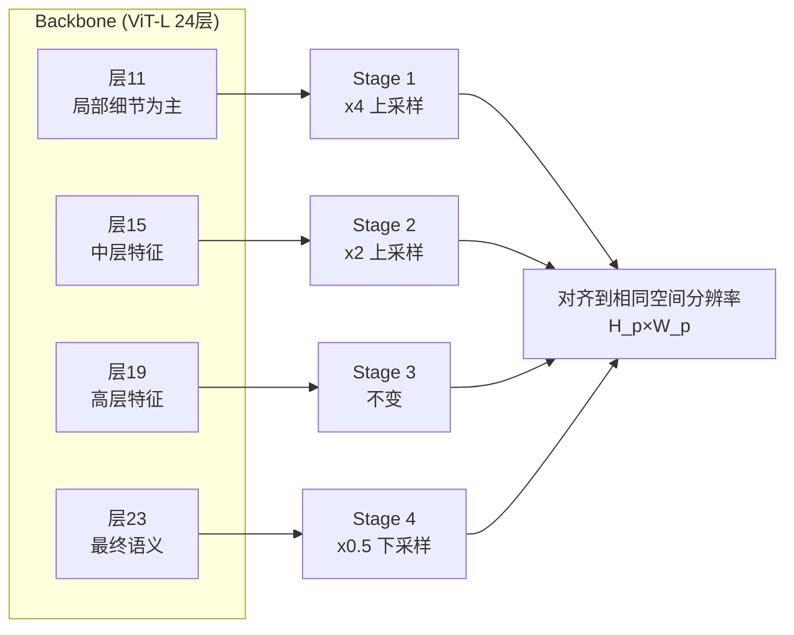

# 第四章：DualDPT 解码头——深度主头与光线辅助头

> 本章介绍 backbone 输出特征之后的事情：DualDPT 如何把四个尺度的特征图融合成像素级的深度图和 camray 图。核心问题是：为什么两个头要完全独立、深度为什么用 exp 激活、辅助头为什么输出线性值、UV 位置编码在哪里加入以及起什么作用。

---

## 从 token 序列到像素预测

backbone 输出的是 token 序列，形状 `[B, S, N, 2C]`（`cat_token` 模式下每层两倍通道）。但最终需要的是像素级的深度图和 camray 图，分辨率和输入图像相同。

这个从 token 到像素的过程要解决两件事：

1. **token 重排为特征图**：把长度为 $N$ 的序列恢复成空间排列的 $H_p \times W_p$ 网格（$H_p = H / 14$，$W_p = W / 14$，14 是 patch size）
2. **多尺度融合**：backbone 中间层的特征编码了不同粒度的信息——浅层关注局部纹理和边缘，深层关注语义和全局结构。深度估计需要两者，单用最后一层会丢失细节。

DPT（Dense Prediction Transformer）架构正是为这个目的设计的，DA3 在它的基础上增加了一个完全独立的辅助分支，构成 DualDPT。

---

## 四个尺度从哪里来

DA3-Large 的 backbone 有 24 层，`out_layers = [11, 15, 19, 23]`，即每隔 4 层取一次特征。这四层输出的形状都是 `[B, S, N, 2C]`，其中 $C = 1024$（ViT-L 的嵌入维度），`cat_token` 使通道翻倍为 2048。

为什么选这四层而不是均匀间隔？这四层对应 backbone 进入交替注意力（`alt_start=8`）之后的中期、中后期和末尾阶段——它们都经历了足够多的跨视角注意力，携带了跨视角几何信息，而第 11 层仍然保留了较多局部细节，第 23 层则是最终的高层语义。



---

## 四尺度对齐：为什么这么缩放

四层特征到达 DualDPT 时都是 patch 分辨率 $H_p \times W_p$，在空间上是完全相同的尺寸。但 DPT 需要的是多尺度的特征金字塔，所以先把它们人工对齐到不同的分辨率，然后再逐级融合。

每个尺度先用 1×1 卷积把通道数从 2048 压缩到目标通道数（256 / 512 / 1024 / 1024），然后用 `resize_layers` 对齐到一个"基准尺度"：

| 尺度 | 操作 | 结果空间大小 |
|------|------|------------|
| Stage 1（第 11 层） | ConvTranspose2d ×4（转置卷积上采样 4 倍） | $4 H_p \times 4 W_p$ |
| Stage 2（第 15 层） | ConvTranspose2d ×2 | $2 H_p \times 2 W_p$ |
| Stage 3（第 19 层） | Identity | $H_p \times W_p$ |
| Stage 4（第 23 层） | Conv2d stride=2（下采样 2 倍） | $H_p/2 \times W_p/2$ |

Stage 1 最终分辨率最高，是因为第 11 层的特征保留了更多细粒度的空间信息，放大后用来监督最细尺度的深度细节；Stage 4 来自最高语义层，压缩后作为融合金字塔的顶层全局上下文。

为什么用转置卷积而不是双线性插值上采样？转置卷积有可学习的参数，能在上采样的同时学习如何从 patch 空间恢复像素细节，而双线性插值只是固定的平滑内插。

---

## 两条完全独立的融合链

DualDPT 有两套融合模块：

- **主链**：`refinenet1–4`，融合后接 `output_conv1` + `output_conv2`，输出深度 + 深度置信度（2 维）
- **辅助链**：`refinenet1_aux–4_aux`，融合后接 `output_conv1_aux` + `output_conv2_aux`，输出 camray + 置信度（7 维）

**关键：这两条链完全不共享参数**，连输入的 stage 特征都是各自独立地从同一批 `resized_feats` 里读取。

为什么不共享？深度和 camray 是两个量纲和分布完全不同的量：深度是正实数（用 exp 激活），camray 方向是任意方向向量（线性输出）。如果共享中间特征，解码器就得同时学习"适合预测正实数深度"和"适合预测任意方向向量"两种表示，这两个目标会互相干扰。独立的融合链让每个分支自由地学习最适合自己预测目标的内部表示。

这和 DualDPT 相比之下的 DPT（单头版本）的区别也在这里：DPT 只有一条融合链加一个主头和一个可选天空头；DualDPT 是两条平行链，权重完全不共享。

---

## 融合：自顶向下的特征金字塔

两条链的融合逻辑相同（用各自的 refinenet 模块），以主链为例：

```
l4_rn ─────────────────────────────────────────────→ refinenet4 ──→ out
l3_rn ──────────────────────────────────────────→ ↗              ↘
l2_rn ──────────────────────────────────────→ refinenet3 ──→ out  ↘
l1_rn ──────────────────────────────────→ ↗              ↘       refinenet2 ──→ out
                                                           ↘                    ↘
                                                            ────────────────→ refinenet1 ──→ 最终特征
```

每个 refinenet 是一个 `FeatureFusionBlock`：接收上一级的输出（"自顶向下"路径）和本级的 stage 特征（"横向连接"），先通过残差卷积块融合，然后双线性上采样到下一级的分辨率，最后用 1×1 卷积输出。

`refinenet4` 是特殊的——它没有横向输入（`has_residual=False`），只对最粗的 stage 4 特征做一次变换后上采样，作为金字塔的起点。

这个自顶向下的设计保证了信息从语义层（第 23 层，高层）流向细节层（第 11 层，低层），最终的像素预测既有全局语义约束，又有局部细节。

---

## UV 位置编码：空间坐标补偿

在每个 stage 特征经过通道投影和空间对齐之后、进入 refinenet 之前，会叠加一个 UV 位置编码：

```python
# dualdpt.py
def _add_pos_embed(self, x, W, H, ratio=0.1):
    pw, ph = x.shape[-1], x.shape[-2]
    pe = create_uv_grid(pw, ph, aspect_ratio=W/H, ...)
    pe = position_grid_to_embed(pe, x.shape[1]) * ratio
    return x + pe
```

`create_uv_grid` 生成一个 $H_{\text{feat}} \times W_{\text{feat}} \times 2$ 的归一化坐标网格，$(u, v) \in [-1, 1]^2$，考虑了原始图像的宽高比。`position_grid_to_embed` 把这个 2D 坐标用正弦余弦编码展开成 $C$ 维向量，乘以 0.1 的缩放系数后加到特征上。

为什么需要这个？ViT 的位置编码是加在 token 输入上的，经过多层注意力之后已经被"稀释"。特征金字塔的中间特征基本上是语义特征，没有明确的空间位置信息。对于像素级深度预测这种强依赖空间位置的任务，需要在解码阶段重新把空间坐标信息注入特征，告诉解码器"这个特征对应图像的哪个位置"。

比例系数 0.1 让位置信息作为"微弱的偏置"而不是主要信号：语义特征仍然主导，但解码器能精确感知每个位置在图像空间的坐标。

在融合后上采样到最终输出分辨率时，位置编码还会再加一次（`if self.pos_embed: fused_main = self._add_pos_embed(...)`），进一步强化最终像素级输出时的空间精度。

---

## 主头输出：深度 + 置信度

主融合链最终经过两步卷积输出 2 个通道，第一个通道是深度 logit，最后一个通道是置信度 logit。两个通道用不同的激活函数处理：

**深度用 `exp` 激活**：

$$
\hat{d} = \exp(z_{\text{depth}})
$$

exp 是最自然的正实数激活函数：
- 保证深度值严格为正（物体不可能在相机后面）
- 梯度为 $e^z$，在 $z$ 不太大时梯度大小适中，不会梯度消失
- 在对数空间里，深度的相对误差（$|\hat{d} - d| / d$）等于 $|z_{\text{depth}} - \log d|$ 的线性误差——用 exp 激活相当于在对数空间训练深度，这和深度值的量纲（远处的物体误差天然更大）吻合

**置信度用 `expp1` 激活**：

$$
\hat{c} = \exp(z_{\text{conf}}) + 1
$$

置信度至少为 1（不可能为零），这避免了后续除以置信度时的数值不稳定。NestedDA3 的尺度对齐步骤（第七章）会用到 `depth_conf` 来生成 alignment mask，零置信度会导致 mask 为空。

---

## 辅助头输出：camray + 置信度

辅助融合链在每个融合级别都维护一个特征图（`aux_list`），但只在最细的那一级（`fused_aux_pyr[-1]`，对应 refinenet1_aux 输出）生成最终预测。

为什么保留所有级别但只返回最细级的输出？在训练时，中间级别的辅助特征可以用来计算中间监督损失（训练代码中的多尺度损失），加速梯度传播到浅层；推理时只需要最细级的结果。

最细级输出经过 5 层卷积的 pre-head 块（`_make_aux_out1_block`，通道 256 → 128 → 256 → 128 → 256 → 128），再接最终 1×1 投影到 7 个通道。

**camray 用线性激活（不激活）**：

$$
\hat{\mathbf{r}} = z_{\text{ray}[:6]} \in \mathbb{R}^6
$$

光线方向向量不需要任何约束：后续的 RANSAC + QL 分解会从所有像素的预测里统计性地估计旋转，归一化和方向的提取是在 `camray_to_caminfo` 里做的（把 $z$ 分量除掉投影到归一化像平面），不需要 head 提前归一化。如果在 head 里加 tanh 或 sigmoid 约束范围，反而会让梯度在饱和区域消失。

辅助置信度同样用 `expp1`，和主头置信度语义一致——值越大代表模型越确信这个像素的 camray 预测。

---

## 输出张量总结

DualDPT 在 `_forward_impl` 末尾返回一个 dict，经 `forward` 的 reshape 变成完整的 batch 形状：

| 键 | 形状 | 激活 | 含义 |
|----|------|------|------|
| `depth` | `[B, S, H, W]` | exp | 每像素深度，正实数 |
| `depth_conf` | `[B, S, H, W]` | expp1（≥1） | 深度置信度 |
| `ray` | `[B, S, H, W, 6]` | linear | camray 前 6 维 |
| `ray_conf` | `[B, S, H, W, 1]` | expp1（≥1） | camray 置信度 |

这四个 tensor 随后被 `DepthAnything3Net.forward` 消费：`depth` 和 `depth_conf` 直接输出，`ray` 和 `ray_conf` 送入 `get_extrinsic_from_camray` 转化成外参和内参（或在已知位姿时被 CameraDec 的结果覆盖）。

---

## 内存和速度：chunk 推理

当 $S$ 比较大（比如批量处理 8 张图时），把 $B \times S$ 张图一次性送入解码头会消耗大量显存（feature map 是 $H \times W$ 分辨率，比 backbone 的 token 序列大得多）。DualDPT 的 `forward` 支持 `chunk_size` 参数：把 $B \times S$ 帧切成若干块，逐块跑 `_forward_impl`，最后沿帧维度拼接结果。

三相机场景下 $S=3$，通常不需要 chunk。但在视频批量推理（$S=16$ 或更多）时，chunk_size=8 把显存峰值减半。

---

## 本章小结

DualDPT 的设计核心是"一套输入，两条完全独立的路径"：

主链（depth + depth_conf）用 exp 和 expp1 激活，保证深度为正、置信度有界远离零。辅助链（camray + camray_conf）用线性激活，让方向向量不被任何预设约束，由后续 RANSAC 统计提取真正的旋转和内参。两条链共享 4 尺度 stage 特征作为输入，但融合权重完全独立，允许各自学习最适合预测目标的内部表示。

UV 位置编码在解码阶段重新注入空间坐标，弥补了 backbone 经过多层注意力后空间信息被稀释的问题。

下一章介绍 CameraEnc 和 CameraDec：当已知位姿时，如何把外参和内参编码成 cam_token 注入 backbone；当未知位姿时，如何从 backbone 最后一层直接回归外参和内参。

::: details 📎 知识链接

- [第二章：深度光线表示](./02_深度光线表示_统一单目与多视角) — camray 6 维向量和置信度第 7 维的定义
- [第三章：Backbone 带跨视角注意力的 DINOv2](./03_Backbone_带跨视角注意力的DINOv2) — `cat_token=True` 使输出通道翻倍为 2048，DualDPT 的 `dim_in=2048` 由此而来
- [第五章：相机编解码器](./05_相机编解码器_位姿怎么进出模型) — CameraDec 会覆盖 DualDPT 辅助头产生的 `ray` / `ray_conf`

:::
