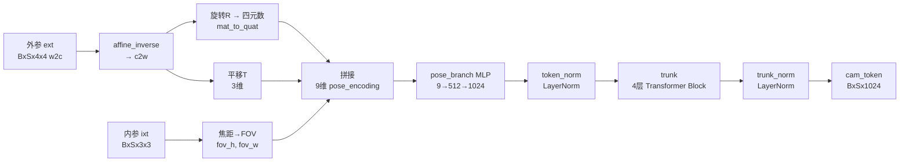

# 第五章：相机编解码器——位姿怎么进出模型

> 本章介绍 DA3 的两个相机模块：CameraEnc 负责把已知位姿"编码进"backbone，CameraDec 负责从 backbone 特征"解码出"位姿。核心问题是：位姿用什么形式表示才适合神经网络、怎么把 9 个数变成 1024 维的 token、以及什么时候用 CameraDec 而不用第二章的 RANSAC 光线路径。

---

## 两条位姿路径，各解决一个问题

DA3 有两种处理相机位姿的方式，对应两个截然不同的使用场景：

**已知位姿（CameraEnc 路径）**：机器人或无人机上的相机往往经过严格标定，外参内参是已知的、精确的。这时不需要模型去猜位姿，而是要把这个已知信息高效地传递给 backbone，让它"知道自己在看哪里"。CameraEnc 把 $(R, t, f_x, f_y)$ 压缩成一个 1024 维 token，注入 backbone 的 CLS 位置。

**未知位姿（CameraDec 路径）**：手机、相机或普通视频里的相机位姿往往是未知的。这时有两个选择：
  - 用 DualDPT 辅助头的 camray 输出，经 RANSAC + QL 分解还原位姿（第二章的路径）
  - 用 CameraDec 直接从 backbone 最后一层特征回归位姿（`use_ray_pose=False` 时走这条路）

两条路不是竞争关系，而是针对不同精度需求和计算预算的选择：RANSAC 路径依赖辅助头，精度略高但耗时较多；CameraDec 路径快速，适合实时场景。

---

## CameraEnc：把位姿变成 token

`cam_enc.py:23` 定义的 `CameraEnc` 接收外参矩阵 `ext`（`[B, S, 4, 4]`，w2c 格式）、内参矩阵 `ixt`（`[B, S, 3, 3]`）和图像尺寸，输出形状 `[B, S, dim_out]`（DA3-Large 里 `dim_out=1024`）的 token 序列。



### 9 维位姿编码的组成

`transform.py:19` 的 `extri_intri_to_pose_encoding` 把位姿压缩成 9 个标量：

$$
\text{pose\_encoding} = [\underbrace{t_x, t_y, t_z}_{3}, \underbrace{q_x, q_y, q_z, q_w}_{4}, \underbrace{\text{fov}_h, \text{fov}_w}_{2}]
$$

**平移 3 维**：直接用 c2w 的平移列（相机原点在世界坐标系中的坐标）。注意代码第一步是 `affine_inverse(ext)` 把 w2c 转成 c2w——因为模型内部用的是 c2w 格式，但外部传入的通常是 w2c。

**旋转 4 维（XYZW 四元数）**：旋转矩阵有 9 个数但只有 3 个自由度，而且需要满足正交约束。直接用旋转矩阵会让网络学到冗余参数。四元数是紧凑的 4 维表示，只有单位长度这一个约束，比欧拉角（万向节死锁问题）和轴角（非唯一性）更适合神经网络直接回归。代码用的是 XYZW 顺序（标量在最后），`standardize_quaternion` 强制实部非负，保证同一旋转有唯一表示。

**视角 2 维（垂直和水平 FOV）**：不直接用 $f_x, f_y$，而是转成视角：

$$
\text{fov}_h = 2 \arctan\!\left(\frac{H/2}{f_y}\right), \qquad \text{fov}_w = 2 \arctan\!\left(\frac{W/2}{f_x}\right)
$$

为什么用 FOV 而不用焦距像素值？焦距的大小和图像分辨率强绑定——4K 图的焦距是 1080p 图的两倍，但视角完全相同。FOV 是物理量，与分辨率无关，让模型在不同分辨率下学到一致的"相机宽窄"概念。另外 FOV 的数值范围天然有界（0 到 $\pi$），而焦距可以到几千个像素，数值范围太大对 MLP 不友好。

### MLP + Transformer 提升表征能力

9 个标量经过 `pose_branch` MLP（`9 → dim_out//2 → dim_out`，即 9 → 512 → 1024）映射到 1024 维，然后过 4 层 Transformer Block（`trunk`）。

为什么不直接用 MLP 映射后就注入 backbone？MLP 只对每个视角单独处理，无法感知这 S 个相机之间的相对关系。4 层 Transformer 让 S 个相机的 token 互相 attend，让编码器学到"这三台相机是怎么排列的"的整体几何关系。输出的 1024 维 token 不仅携带单台相机的位姿，还携带了它相对于其他视角的上下文信息。

---

## CameraDec：从特征直接回归位姿

`cam_dec.py:19` 的 `CameraDec` 做的是反方向的事：接收 backbone 最后一层的 CLS token（`feats[-1][1]`，来自 `da3.py:216` 的 `self.cam_dec(feats[-1][1])`），输出 9 维位姿编码，再由 `pose_encoding_to_extri_intri` 转回外参和内参矩阵。

结构是一个简单的 MLP：

```
输入: [B, S, dim_in]  (dim_in=1536 for ViT-L，取CLS特征)
  ↓  Linear → ReLU → Linear → ReLU   (backbone)
  ↓  fc_t: → 3维平移
  ↓  fc_qvec: → 4维四元数    (如果没传入 camera_encoding)
  ↓  fc_fov: → 2维FOV + ReLU (如果没传入 camera_encoding)
输出: [B, S, 9]  pose_enc
```

`ReLU` 在 `fc_fov` 末尾保证 FOV 值为正（视角不能是负数）。平移 `fc_t` 不加激活，允许相机原点在任意坐标。四元数 `fc_qvec` 不归一化——归一化在 `pose_encoding_to_extri_intri` 里通过 `quat_to_mat` 隐式处理（`two_s = 2 / ||q||^2` 让未归一化的四元数也能正确转换为旋转矩阵）。

### camera_encoding 直通模式

`CameraDec.forward` 有一个特殊逻辑：如果传入了 `camera_encoding`，则旋转和 FOV 直接从 `camera_encoding[..., 3:7]` 和 `camera_encoding[..., -2:]` 读取，只有平移 `fc_t` 从特征重新预测：

```python
# cam_dec.py:38
if camera_encoding is None:
    out_qvec = self.fc_qvec(feat.float())
    out_fov = self.fc_fov(feat.float())
else:
    out_qvec = camera_encoding[..., 3:7]   # 直接复用已知旋转
    out_fov = camera_encoding[..., -2:]    # 直接复用已知FOV
```

这个设计服务于一个混合场景：已知相机的旋转和内参（比如来自 IMU 和标定），但平移需要从图像里估计（比如两帧之间的位移未知）。模型只需要学习预测平移，旋转和焦距直接"直通"，减少了学习难度。

---

## 从位姿编码恢复外参和内参

`pose_encoding_to_extri_intri`（`transform.py:41`）做编码的逆操作：

$$
\begin{aligned}
f_y &= \frac{H/2}{\tan(\text{fov}_h / 2)}, \quad f_x = \frac{W/2}{\tan(\text{fov}_w / 2)} \\
c_x &= W/2, \quad c_y = H/2 \quad \text{（主点默认在图像中心）}
\end{aligned}
$$

注意主点固定为图像中心而不是从编码里恢复。这是一个有意为之的简化：在自然图像里相机主点通常接近中心，对大多数场景这个假设足够好；而且固定主点减少了要预测的自由度，让模型可以把容量集中在旋转、平移和焦距上。

恢复出的外参是 c2w 格式（`[B, S, 3, 4]`），`da3.py:225` 随即用 `affine_inverse` 转回 w2c 存入 `output.extrinsics`，保持与其他路径输出格式一致。

---

## 两条路径的选择逻辑

```
                  调用 DepthAnything3Net.forward
                            │
              extrinsics 是否为 None?
             ┌─────────────┴─────────────┐
            否                          是
     CameraEnc 编码位姿              cam_token = None
     → backbone 获得位姿先验         → backbone 用可学习 camera_token
                                              │
                                    use_ray_pose 参数?
                                   ┌──────────┴──────────┐
                                  True                  False
                           DualDPT 辅助头          CameraDec 解码
                           camray → RANSAC       backbone CLS → MLP
                           → R, f, t             → R, f, t
```

**三相机机器人场景（有标定）**：`extrinsics` 和 `intrinsics` 已知，走 CameraEnc 路径。backbone 获得精确的位姿先验，预测的深度在多视角之间几何对齐更好。输出里的 `extrinsics` 和 `intrinsics` 直接复用输入，不经过任何估计。

**普通视频或图库照片（无标定）**：`extrinsics=None`，根据精度需求选：
- 需要高精度位姿（比如用于后续三维重建）：`use_ray_pose=True`，走 RANSAC + QL 分解
- 需要快速推理（比如深度图为主、位姿精度要求低）：`use_ray_pose=False`，走 CameraDec

---

## 数值算例：三相机标定场景

以三台水平排列的相机为例，正前方相机是参考视角（R=I，t=0），左相机绕 y 轴旋转 +30°，右相机旋转 -30°，均位于 y=0 平面，间距 0.2 米，焦距 500 像素，图像 $518 \times 518$。

**编码步骤**（以左相机为例）：

1. $R$ = $y$ 轴 30° 旋转矩阵，$t = (-0.2, 0, 0)^T$（左相机位置）
2. 四元数：$q = (0, \sin 15°, 0, \cos 15°) \approx (0, 0.259, 0, 0.966)$，XYZW 顺序
3. $\text{fov}_v = 2 \arctan(259/500) \approx 54.6°$，$\text{fov}_h$ 相同
4. pose_encoding = $[-0.2, 0, 0, 0, 0.259, 0, 0.966, 0.955, 0.955]$（弧度）
5. 经 MLP → 4层 Transformer 得到 1024 维 cam_token，注入 backbone 第 8 层 CLS 位置

backbone 在第 9 层（第一次全局注意力）就能从三个 CLS token 同时感知三台相机的相对位姿，让后续的跨视角注意力有明确的几何参考系。

---

## 本章小结

CameraEnc 和 CameraDec 是 DA3 位姿信息的"入口"和"出口"：

CameraEnc 把 $(R, t, \text{FOV})$ 压缩成 9 个标量，经 MLP 扩展到 1024 维，再用 4 层 Transformer 让多台相机的 token 互相感知，最终注入 backbone。用 FOV 代替焦距像素值，用四元数代替旋转矩阵，让编码在不同分辨率和旋转表示下都保持稳定。

CameraDec 从 backbone 最后一层的 CLS token 里直接回归平移、旋转和 FOV，是一条快速的位姿估计路径，可以在旋转已知时直接复用、只重新预测平移。

下一章介绍训练数据和训练策略：DA3 用了哪些数据集，如何把单目和多视角的监督信号混在一起训练，以及从 DA2 蒸馏的逻辑。

::: details 📎 知识链接

- [第二章：深度光线表示](./02_深度光线表示_统一单目与多视角) — camray RANSAC 路径（`use_ray_pose=True`），是 CameraDec 路径的替代选项
- [第三章：Backbone 带跨视角注意力的 DINOv2](./03_Backbone_带跨视角注意力的DINOv2) — `alt_start=8` 层 CLS 注入逻辑：CameraEnc 输出的 cam_token 在这里被写入
- [第四章：DualDPT 解码头](./04_DualDPT解码头_深度主头与光线辅助头) — DualDPT 辅助头的 `ray` 输出是 `use_ray_pose=True` 时的输入

:::
