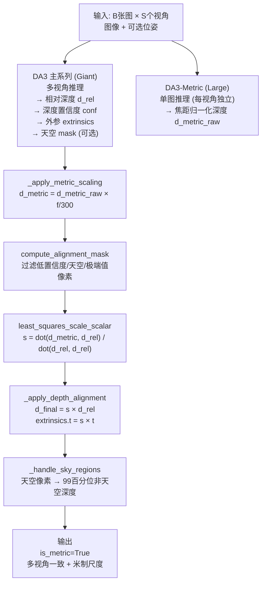
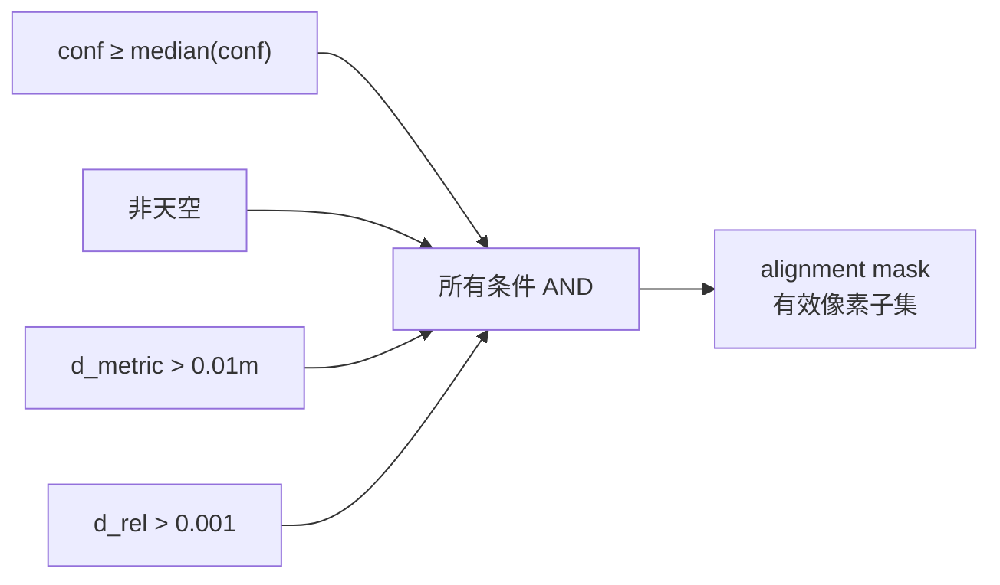

# 第七章：DA3-Nested——从相对深度到米制深度

> DA3 主系列预测的深度在几何上是多视角自洽的，但绝对尺度是任意的——深度值乘以任意正数，几何依然成立。DA3-Metric 单独能给出正确的米制尺度，但它的深度不保证跨视角一致。DA3-Nested 把两个模型嵌套在一起，让它们各自做自己擅长的事，再用一次最小二乘把尺度从 Metric 分支对齐到主分支。本章介绍这个嵌套结构的每一步：为什么这样分工、对齐公式是从哪个优化目标推导出来的、置信度和天空区域怎么影响对齐质量。

---

## 两个模型，两件不同的事

DA3（主系列）的输出深度满足多视角几何约束：如果把深度图反投影成三维点云，来自不同视角的点云在世界空间中是自洽的，同一个三维点在各视角的投影是一致的。但这个约束只固定了"形状"，不固定"尺度"——把所有视角的深度图同时乘以 2，几何约束依然成立，只是整个场景整体缩小了一半。这和训练数据的监督信号有关：多视角相对深度监督只约束不同视角之间的比例，不约束绝对米制距离。

DA3-Metric 解决的是另一件事：给一张图，预测每个像素到相机的真实物理距离（单位：米）。它知道焦距 $f$ 和"标准焦距"300 之间的比例，能从图像内容中估计出绝对尺度。但它是一个单图模型（`alt_start=-1`，没有跨视角注意力），对三张图独立运行，三张图的深度之间没有保证多视角一致的机制。

| 模型 | 多视角几何一致性 | 米制尺度 |
|------|----------------|---------|
| DA3 主系列 | ✅ 跨视角自洽 | ❌ 相对尺度，绝对值任意 |
| DA3-Metric | ❌ 各图独立 | ✅ 单图米制深度 |
| DA3-Nested | ✅ 继承主系列 | ✅ 从 Metric 对齐 |

DA3-Nested 的核心思路：**用 DA3-Metric 的米制精度来标定 DA3 主系列的相对深度，而不是反过来用 Metric 的深度替换主系列的深度**。这样保留了主系列多视角一致的几何形状，只是把这个形状的整体尺度调整到 Metric 给出的正确量级。

---

## 嵌套架构

`NestedDepthAnything3Net`（`da3.py`）包含两个子模型，在同一次推理里串行运行：

DA3-Metric 分支跑的是 Large 版本（而主系列跑 Giant），对应 YAML 里的 `da3nested-giant-large.yaml`。这个搭配不是对称的：Giant 主系列负责几何精度，Large Metric 只需要估计单图尺度，不需要最大的模型。

两个分支可以并行运行（对同一批图像独立前向），在 `_apply_depth_alignment` 步骤才合并。

---

## 焦距归一化深度的实际含义

DA3-Metric 的原始输出 $d_{\text{net}}$ 需要乘以焦距缩放才能变成真正的米制深度（`alignment.py:118`）：

$$
d_{\text{metric}} = d_{\text{net}} \cdot \frac{f}{300}
$$

其中 $f = (f_x + f_y) / 2$ 是水平和垂直焦距的均值，常数 300 是训练集的经验典型焦距。

这个公式的设计目标是：让 DA3-Metric 的训练在不同相机之间迁移。

考虑同一个物体（比如一把椅子，真实高度 0.8 米）用两台相机拍摄：一台广角（$f = 200$ 像素），一台长焦（$f = 600$ 像素）。广角相机里椅子的投影更小，感觉"更远"；长焦相机里投影更大，感觉"更近"。如果让模型直接预测米制深度，它必须同时学会"这台相机的焦距是多少、我应该用什么尺度预测"——这本质上是两件事，强行塞进一个预测目标会让训练变难。

$f/300$ 把不同焦距相机的输出"归一化"到同一个尺度：网络只需要学会"用标准相机（$f=300$）看到的深度分布"，推理时再乘以 $f/300$ 缩放到当前相机。从这个角度看，$d_{\text{net}}$ 是"焦距无关的相对深度系数"，不是米制距离本身。

对三相机机器人场景（假设三台相机均焦距 $f=500$ 像素），缩放系数是 $500/300 \approx 1.67$，Metric 分支的原始输出需要乘以 1.67 才得到米。

---

## 对齐 mask：哪些像素可以用于估计尺度

从 DA3-Metric 获得 $d_{\text{metric}}$、从 DA3 主系列获得 $d_{\text{rel}}$，理论上可以用任意一个像素来估计"应该把 $d_{\text{rel}}$ 乘以多少才等于 $d_{\text{metric}}$"。但并非所有像素都合适——`compute_alignment_mask`（`alignment.py`）用四个条件过滤出可靠的对齐点：

**条件 1：深度置信度 ≥ 中位数**
主系列输出的 `depth_conf`（`expp1` 激活，≥1）在确定性高的区域（纹理丰富、无遮挡、无反光）会更大。只保留置信度不低于当前批次中位数的像素，直接排除低质量区域——遮挡边缘、镜面反射、运动模糊等。

**条件 2：非天空像素**
天空的真实深度是"无穷远"，DA3-Metric 对天空区域的估计没有意义（天空没有表面，激光雷达也打不到）。用主系列的天空预测 mask（辅助头里的天空分割输出）过滤。

**条件 3：DA3-Metric 深度 > 0.01 米**
DA3-Metric 输出接近零的像素在物理上可疑（很少有物体距相机不到 1 厘米），更可能是数值噪声。

**条件 4：DA3 主系列深度 > 0.001**
同样过滤主系列预测的极小深度值。

这四个条件的组合排除了"深度预测本身不可靠"和"深度物理上无意义"两类像素，让最小二乘只在可信的对应点上运行。

---

## 最小二乘尺度估计

对齐 mask 确定之后，对所有有效像素 $i$，需要找到一个标量 $s$，使得：

$$
s \cdot d_{\text{rel},i} \approx d_{\text{metric},i}
$$

这是一个单参数最小二乘问题，目标函数是：

$$
\min_{s} \; \mathcal{L}(s) = \sum_{i \in \text{mask}} \bigl(s \cdot d_{\text{rel},i} - d_{\text{metric},i}\bigr)^2
$$

**为什么是标量而不是仿射变换（$s \cdot d + b$）？**

加入偏移 $b$ 意味着两张深度图之间不只是尺度不同，还有整体偏置——这只在一张图有系统性深度偏移时才有意义。DA3 主系列和 DA3-Metric 都经过了精心训练，不存在系统性偏置；而且加 $b$ 会引入更多自由度，让对齐在异常点较多时更不稳定。用纯标量 $s$ 是更保守、更稳健的选择。

对 $\mathcal{L}(s)$ 关于 $s$ 求导并令其为零：

$$
\frac{d\mathcal{L}}{ds} = 2 \sum_i d_{\text{rel},i} \bigl(s \cdot d_{\text{rel},i} - d_{\text{metric},i}\bigr) = 0
$$

化简得到解析解（`alignment.py:least_squares_scale_scalar`）：

$$
s = \frac{\sum_i d_{\text{rel},i} \cdot d_{\text{metric},i}}{\sum_i d_{\text{rel},i}^2} = \frac{\langle d_{\text{rel}},\, d_{\text{metric}} \rangle}{\langle d_{\text{rel}},\, d_{\text{rel}} \rangle}
$$

用向量内积的记号写就是 `dot(d_rel, d_metric) / dot(d_rel, d_rel)`，和代码完全对应。这个形式也可以理解为：把 $d_{\text{metric}}$ 在 $d_{\text{rel}}$ 方向上投影，得到最优的缩放系数。

**边界检验**：如果 DA3 主系列的深度预测恰好已经是正确的米制尺度（比如场景里有精确的度量参考），那么 $d_{\text{metric},i} = c \cdot d_{\text{rel},i}$（对所有像素），代入上式得 $s = c$，对齐公式自动复原正确的尺度。

**极端情况**：如果 mask 为空（全部像素都被过滤掉），代码回退到 $s = 1$（不做尺度调整）并保留 DA3 主系列的相对深度输出，仍标记 `is_metric=False`。

---

## 应用对齐：深度和外参一起缩放

计算出 $s$ 之后，`_apply_depth_alignment` 把它同时应用到深度和外参平移：

$$
d_{\text{final}} = s \cdot d_{\text{rel}}, \qquad \mathbf{t}_{\text{final}} = s \cdot \mathbf{t}_{\text{rel}}
$$

**为什么外参平移也要缩放？**

外参矩阵里的平移向量 $\mathbf{t}$（c2w 格式）记录的是相机原点在世界坐标系中的位置，单位和深度图的单位一致——都是主系列的相对尺度单位。如果深度乘以 $s$ 变成米，但平移 $\mathbf{t}$ 还是相对尺度，那么从深度图反投影得到的三维点和外参矩阵描述的相机位置就不在同一个坐标系里：点云和相机位置的单位不匹配，任何后续的三维重建或视角合成都会出错。

同步缩放 $\mathbf{t}$ 保证了：反投影三维点 $\mathbf{P} = \mathbf{t} + d_{\text{final}} \cdot \hat{\mathbf{d}}$ 的所有量都在同一个米制坐标系中。

---

## 天空区域的特殊处理

天空像素的深度从物理上说是无穷远，但实际上网络会给出一个有限的（通常是很大的）数值。如果让这些像素参与尺度估计，它们的异常大深度会拉偏 $s$；如果让它们出现在最终深度图里，点云里会有一堆错误的"远处天空点"。

`_handle_sky_regions`（`alignment.py:set_sky_regions_to_max_depth`）的处理方式：

1. 找到非天空区域的深度的第 99 百分位数 $d_{99}$
2. 把天空区域的所有像素深度设置为 $d_{99}$

用 99 百分位数（而不是最大值）是为了避免边缘噪声点拉高基准。结果是天空区域的深度被设置成"场景中最远的真实深度"，在点云里表现为一层远处的"背景板"——不影响近景几何，也不会出现异常大的数值破坏可视化。

---

## 三相机场景数值走一遍

以三台水平排列的机器人相机为例，焦距 $f = 500$ 像素，图像 $518 \times 518$。假设 DA3 主系列对正前方相机输出了相对深度图，典型前景深度在 $0.5$ 到 $3.0$（相对单位）；DA3-Metric 对同一帧输出了 $d_{\text{net}} \in [0.3, 1.8]$。

**步骤 1 — 焦距归一化**：$d_{\text{metric}} = d_{\text{net}} \times 500/300 \approx 1.67 \times d_{\text{net}}$，范围变成 $[0.5, 3.0]$ 米。

**步骤 2 — alignment mask**：过滤掉低置信度区域（地面反光）和天空（如果有），剩余约 60% 的像素参与对齐。

**步骤 3 — 最小二乘**：

$$
s = \frac{\sum d_{\text{rel}} \cdot d_{\text{metric}}}{\sum d_{\text{rel}}^2}
$$

假设两组深度高度相关（DA3 形状准确），计算得 $s \approx 1.0$（说明主系列这次碰巧接近米制）或者 $s \approx 0.8$（说明主系列系统性地偏大了 25%）。

**步骤 4 — 应用对齐**：$d_{\text{final}} = 0.8 \times d_{\text{rel}}$，外参平移 $\mathbf{t}$ 也乘以 0.8。三台相机都用各自视角的 $s$ 独立对齐，但对齐后的外参平移用相同的米制单位，三台相机之间的相对位置（基线长度）自动变成米制。

**步骤 5 — 天空处理**：天空区域替换为 $d_{99}$（假设场景远端是 5 米的墙），天空设置为 5 米。

最终输出 `is_metric=True`，深度单位是米，外参平移单位是米，三视角的点云可以直接拼接。

---

## 对齐失败的情形

有两类情形会让 $s$ 不可靠：

**场景纹理极少**（比如全白墙壁）：alignment mask 里剩余有效像素很少，最小二乘的统计基础薄弱，$s$ 的方差很大。此时代码不会报错，但输出的米制尺度可能偏差较大——这是 DA3-Metric 单图预测本身不稳定造成的，不是对齐步骤的问题。

**DA3-Metric 焦距未知**：如果 EXIF 或标定信息缺失，代码从图像分辨率估计一个默认焦距（通常假设标准视角），估计值和真实值的比值直接体现在 $s$ 里——$s$ 会吸收这个误差，但最终深度的绝对精度受限于焦距估计的精度。

---

## DA3-Nested 与各分支单独使用的对比

| 方案 | 三相机几何一致性 | 米制精度 | 适用场景 |
|------|----------------|---------|---------|
| 只用 DA3 | ✅ 跨视角自洽 | ❌ 相对尺度 | 纯相对深度、视角合成、SfM 预处理 |
| 只用 DA3-Metric | ❌ 各图独立 | ✅ 单图米制 | 单相机测距、简单深度合成 |
| DA3-Nested | ✅ + ✅ | ✅ | 三维重建、机器人导航、米制点云融合 |

DA3-Nested 的多一个代价是运行两个模型（Giant + Large），推理时间约是单独跑 DA3 的 1.5 到 2 倍。README 的推荐配置 DA3NESTED-GIANT-LARGE-1.1（1.40B 参数）是当前最高质量的公开选项。

---

## 本章小结

DA3-Nested 的设计逻辑是：让两个模型各司其职，用最小信息的对齐步骤把它们的优势合并。

DA3 主系列负责多视角几何自洽，DA3-Metric 负责单图米制尺度，最小二乘对齐 $s = \langle d_{\text{rel}}, d_{\text{metric}} \rangle / \|d_{\text{rel}}\|^2$ 是连接两者的最简形式：只调整一个全局标量，不改变主系列精心建立的多视角几何形状。外参平移随深度同步缩放，保证三维坐标系的单位统一。天空区域用 99 百分位非天空深度填充，避免无穷远点破坏点云质量。

下一章进入 3D 高斯头：从深度图直接生成可渲染的 3D Gaussian Splatting 场景，介绍 DA3 如何从深度和相机信息构建可渲染的三维表示。

::: details 📎 知识链接

- [第四章：DualDPT 解码头](./04_DualDPT解码头_深度主头与光线辅助头) — `depth_conf`（`expp1` 激活）是 `compute_alignment_mask` 的输入；主系列的 2 维主头输出深度和置信度
- [第五章：相机编解码器](./05_相机编解码器_位姿怎么进出模型) — 外参平移 $\mathbf{t}$ 的来源：CameraEnc 路径（已知位姿）或 RANSAC 路径（camray 估计）
- [第六章：训练数据与训练策略](./06_训练数据与训练策略) — DA3-Metric 的焦距归一化深度 $d = d_{\text{net}} \times f/300$ 在训练时的逻辑，与本章推理时的应用一致

:::
