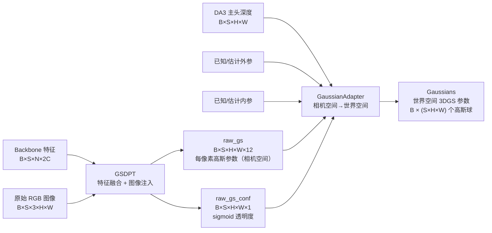

# 第八章：3D 高斯头——从深度直接到可渲染场景

> DA3 在估计深度的同时可以直接输出一个可渲染的 3D Gaussian Splatting 场景，不需要先重建点云再单独训练 NeRF 或 3DGS。本章介绍这个可选的 GS 头是怎么设计的：GSDPT 预测什么、GaussianAdapter 怎么把这些预测转换成世界空间的高斯球参数、每个设计选择背后的理由，以及三相机场景里一共会生成多少个高斯球。

---

## 为什么在深度模型上加 GS 头

标准的 3D Gaussian Splatting 流程是：先从多张图做 SfM 得到稀疏点云，再用这个点云初始化高斯球，最后通过可微渲染优化几千次。整个流程需要几分钟到几小时。

DA3 的深度头已经给出了每个像素的三维位置（深度 + 相机参数 → 世界坐标），如果同时预测每个像素的高斯球属性（颜色、透明度、旋转、大小），就能**在一次前向推断内直接得到一个可渲染的场景**——不需要优化，不需要 SfM，几秒钟内完成。

代价是质量不如优化后的 3DGS：预测出的高斯球是"一次性"的，不会经过 view-dependent 的梯度优化。但对于需要实时初始化或快速预览的场景（机器人场景感知、AR 初始化、快速三维重建），这个 tradeoff 是值得的。

GS 头是可选的（`infer_gs=False` 时完全不运行），不影响主系列的深度和位姿输出。

---

## 整体流水线



三相机 $518 \times 518$ 场景：$3 \times 518 \times 518 = 805{,}932$ 个高斯球。

---

## GSDPT：预测每像素的相机空间高斯属性

`GSDPT`（`gsdpt.py`）继承自单链 `DPT`——和主系列的双链 `DualDPT` 不同，GS 头只有一条融合链，因为高斯属性之间没有像深度和 camray 那样的领域差异，不需要分开的独立链。

### 输出维度

GSDPT 的输出维度是 `gs_adapter.d_in + 1`，其中 `d_in` 由 `GaussianAdapter` 的参数决定。默认配置（`pred_offset_xy=True`，`sh_degree=0`，`pred_offset_depth=False`）下：

| 字段 | 维度 | 含义 |
|------|------|------|
| `offset_xy` | 2 | 像素内子像素偏移，让高斯中心不被锁死在像素中心 |
| `scales` | 3 | 三轴尺度（各向异性椭球） |
| `rotations` | 4 | 相机空间四元数（XYZW） |
| `color (SH DC)` | 3 | 零阶球谐系数，等价于视角无关的 RGB 颜色 |
| **raw_gs 合计** | **12** | 相机空间参数 |
| `conf` | 1 | 透明度 logit（sigmoid 激活） |
| **输出合计** | **13** | — |

### 图像注入：为什么不只用 backbone 特征

backbone（DINOv2）的特征是高度语义化的——它们编码了"这里是什么"，而不是"这里是什么颜色"。多层注意力之后，像素级的 RGB 颜色信息已经被大量稀释。

对于高斯球的颜色预测，需要的恰恰是精确的像素级颜色，而不是语义特征。GSDPT 在特征融合之后、最终输出之前，把原始 RGB 图像经过一个小型 CNN（`images_merger`：3 层卷积 + GELU，`3 → 64 → 128 → 128` 通道）转换成特征图，直接加到融合特征上：

```python
# gsdpt.py:109
fused = fused + self.images_merger(images)
```

这个注入让颜色预测可以直接从原图里读取像素值，不用试图从语义特征里重建颜色信息。几何参数（尺度、旋转）仍然主要来自 backbone 特征，颜色来自直接的像素注入——两个信息源各司其职。

### 透明度用 sigmoid 而不是 expp1

深度置信度用 `expp1`（≥1），而高斯透明度用 `sigmoid`（输出 $(0, 1)$）。为什么不同？

深度置信度只需要"越大越好"，没有上界；它用于加权，不用于直接渲染。高斯透明度直接控制渲染时这个高斯球对最终颜色的贡献比例，物理上必须在 0 到 1 之间——`sigmoid` 的值域天然对应这个约束。用 `expp1` 会得到 ≥1 的值，无法作为透明度使用。

---

## GaussianAdapter：从相机空间到世界空间

`GaussianAdapter`（`gs_adapter.py`）接收 GSDPT 的输出，以及来自 DA3 主头的深度图和位姿，把所有参数转换到统一的世界坐标系中，输出 `Gaussians` 数据类。

### 第一步：确定高斯球中心位置（means）

高斯球的中心位置来自深度反投影，而不是 GSDPT 重新预测一个三维坐标——这是关键设计选择：**直接复用 DA3 主头已经预测好的几何精确深度**，不让 GS 头重新学习深度。

```python
# gs_adapter.py:103–117
xy_ray, _ = sample_image_grid((H, W), device)   # 像素中心归一化坐标
if self.pred_offset_xy:
    offset_xy = raw_gaussians[..., :2]
    xy_ray = xy_ray + offset_xy * pixel_size     # 子像素偏移
origins, directions = get_world_rays(xy_ray, cam2worlds, intr_normed)
gs_means_world = origins + directions * gs_depths[..., None]
```

`pred_offset_xy=True` 时，GSDPT 预测一个 $[-0.5, 0.5]$ 像素范围内的亚像素偏移，让高斯球中心可以精确落在物体边缘而不被强制对齐到像素网格。`offset_xy * pixel_size` 把这个偏移从"像素比例"转换成归一化坐标，再传给 `get_world_rays`。

`get_world_rays` 用归一化内参（$K / W$ 和 $K / H$）把像素坐标反投影成相机空间方向，再乘以 c2w 矩阵转换到世界坐标系，`origins` 直接取 c2w 矩阵最后一列（相机原点在世界坐标系中的位置）。

### 第二步：尺度（scales）

每个高斯球是一个三轴各向异性椭球，三个轴的尺度是独立预测的：

$$
s_i = s_{\min} + (s_{\max} - s_{\min}) \cdot \sigma(z_i), \quad i \in \{x, y, z\}
$$

Sigmoid 把网络输出映射到 $[s_{\min}, s_{\max}] = [10^{-5}, 30]$，然后乘以深度和一个内参相关的缩放系数：

$$
\text{gs\_scale} = s_i \cdot d \cdot \underbrace{0.1 \cdot \sum_j (K^{-1} \cdot \text{pixel\_size})_j}_{\text{multiplier}}
$$

**为什么尺度要正比于深度？** 相同物理尺寸的高斯球，在深度更大的地方视觉上更小（因为投影变小了）。如果固定高斯球的世界空间尺寸不变，近处的高斯球会过于粗糙，远处的会过于精细。乘以深度后，一个高斯球在图像上投影的角大小大致恒定——这叫"深度尺度不变性"，让网络不需要单独学习"对于这个深度该用多大的尺度"。

`multiplier` 除以焦距（$K^{-1}$ 的对角元素 $\approx 1/f$），让焦距更大的相机（投影更细）对应更小的 multiplier，从而补偿不同焦距下相同像素覆盖的不同物理角度。

### 第三步：旋转（rotations）

GSDPT 预测的是相机坐标系下的四元数（XYZW），`GaussianAdapter` 把它转换到世界坐标系：

$$
q_{\text{world}}^{\text{wxyz}} = \text{cam\_quat\_xyzw\_to\_world\_quat\_wxyz}(q_{\text{cam}}^{\text{xyzw}},\; \text{c2w})
$$

为什么在相机空间预测旋转？在相机空间里，一个朝向相机的平面高斯球的法向量就是 $(0, 0, 1)$——初始化最自然，网络更容易学习"让高斯球对齐表面"这件事。世界坐标系下的旋转和相机位姿纠缠在一起，学习难度更大。预测相机空间四元数、推理时旋转到世界空间，是一个标准的"在局部坐标系学习，推理时转全局"的工程技巧。

归一化在 `GaussianAdapter` 里显式完成（`rotations / rotations.norm(...)`），不依赖网络输出自然满足单位长度约束。

### 第四步：球谐系数（harmonics）

颜色用零阶球谐系数（DC 分量）表示，也就是视角无关的固定 RGB。三个通道的球谐系数直接来自 GSDPT 的预测，经过 `sh_mask` 加权：

```python
# gs_adapter.py:51–56
self.sh_mask[degree**2:(degree+1)**2] = 0.1 * 0.25**degree
```

高阶球谐系数在初始化时被压缩到接近零（乘以 `0.1 * 0.25^degree`），让模型初期以视角无关的颜色为主，通过训练逐渐学习视角相关效果。`sh_degree=0` 时没有高阶项，`sh_mask` 退化为全 1。

如果 `sh_degree > 0`，DA3 还会把球谐系数从相机空间旋转到世界空间（`rotate_sh`），理由和旋转参数一样：预测在相机空间更容易，渲染时需要世界空间。

### 第五步：透明度（opacities）

```python
# da3.py:277
opacities = map_pdf_to_opacity(densities)
```

`map_pdf_to_opacity` 的公式是：

$$
\alpha = 0.5 \left(1 - (1 - p)^{2^x} + p^{1/2^x}\right)
$$

训练时 `x` 随 `global_step` 从初始值增大（让透明度分布逐渐变尖锐）。**推理时 `global_step=0`，$x=0$，$2^x = 1$，公式化简为 $\alpha = p$**——即 sigmoid 的原始输出直接作为透明度。训练调度的复杂性在推理时完全消失。

---

## 位姿对齐：预测位姿与 GT 位姿不一致时怎么办

当提供了真实外参（`gt_extrinsics`）但 DA3 的估计位姿与之不完全一致时，深度图是在**估计位姿坐标系**下定义的，而高斯球要放进**GT 位姿坐标系**里渲染。直接用 GT 位姿反投影估计深度会产生坐标系错位。

`GaussianAdapter` 用 Umeyama 相似变换对齐两组位姿，提取尺度差 `pose_scales`（限制在 $[1/3, 3]$ 防止退化），然后同步缩放深度和 c2w 平移：

```python
# gs_adapter.py:98–101
cam2worlds[:, :, :3, 3] *= pose_scales           # 缩放 c2w 平移
gs_depths = gs_depths * pose_scales              # 缩放深度
```

这和第七章的尺度对齐思路一致：调整的是全局标量，不改变几何形状。

---

## 输出：Gaussians 数据类

`GaussianAdapter.forward` 最终返回 `specs.py` 里定义的 `Gaussians` 数据类：

```python
@dataclass
class Gaussians:
    means:      Tensor  # [B, V*H*W, 3]   世界空间坐标
    scales:     Tensor  # [B, V*H*W, 3]   三轴尺度
    rotations:  Tensor  # [B, V*H*W, 4]   世界空间四元数 WXYZ
    harmonics:  Tensor  # [B, V*H*W, 3, d_sh]  球谐系数
    opacities:  Tensor  # [B, V*H*W]      透明度
```

注意维度：`V*H*W` 把 S 个视角的高斯球展平在一起——三台相机产生的高斯球在世界坐标系里共存，可以直接送入 gsplat 等渲染器做任意视角的合成渲染，不需要额外的坐标系对齐步骤。

这个格式和 gsplat 库（[gsplat.studio](https://gsplat.studio)）的接口是直接兼容的。

---

## 三相机场景的规模估计

$S=3$，$518 \times 518$ 分辨率：

- 高斯球总数：$3 \times 518 \times 518 = 805{,}932$（约 80 万）
- 每个高斯球：3（位置）+ 3（尺度）+ 4（四元数）+ 3（颜色）+ 1（透明度）= 14 个浮点数
- 总显存：$\approx 806\text{K} \times 14 \times 4\text{bytes} \approx 45\text{MB}$

对比：标准 3DGS 优化完一个普通室内场景约有 50 万到 300 万个高斯球，但质量要高得多（经过了数千步的 view-dependent 优化和自适应密度控制）。DA3 的 GS 头给的是一个"合理的初始化"而非"优化后的结果"，可以直接渲染，也可以作为优化的起点。

---

## 和 3DGS 标准流程的对比

| 步骤 | 标准 3DGS | DA3 GS 头 |
|------|-----------|-----------|
| 点云初始化 | SfM（分钟级） | 深度反投影（毫秒级） |
| 高斯属性初始化 | 从点云几何启发 | GSDPT 一次前向 |
| 颜色初始化 | 从点云颜色取 | images_merger 直接读像素 |
| 优化 | 数千步可微渲染 | 无 |
| 质量 | 高（view-dependent） | 中（视角无关 DC 颜色） |
| 速度 | 分钟到小时 | 一次推断，秒级 |

DA3 GS 头的定位是：给定多张输入图像，**立刻得到一个可渲染的三维场景**，代价是初始质量有限。在此基础上用 gsplat 继续优化，可以快速收敛到高质量结果，因为起点比随机初始化或稀疏点云初始化好得多。

---

## 本章小结

DA3 的 3D 高斯头由两个模块串联组成：

GSDPT 在 backbone 特征上跑单链 DPT，并将原始 RGB 图像通过 `images_merger` 注入，让颜色预测直接读像素值而不用从语义特征重建；输出 12 维相机空间高斯参数 + 1 维 sigmoid 透明度。

GaussianAdapter 把这些预测转换到世界空间：深度反投影给中心位置，sigmoid + 深度缩放给尺度（保持深度尺度不变性），相机空间四元数旋转到世界空间，DC 球谐系数直接用作颜色。所有参数展平后组成 `Gaussians` 数据类，可直接送入 gsplat 渲染器。

整条流程完全不需要 SfM 或迭代优化，对三相机场景产生约 80 万个高斯球，从输入图像到可渲染场景在单次推断内完成。

下一章介绍 DA3-BENCH：DA3 用什么数据集评测、评测指标怎么定义、六个数据集各有什么特点。

::: details 📎 知识链接

- [第四章：DualDPT 解码头](./04_DualDPT解码头_深度主头与光线辅助头) — GSDPT 继承自单链 DPT（DualDPT 的单链版本），主头深度由 DualDPT 提供给 GaussianAdapter
- [第五章：相机编解码器](./05_相机编解码器_位姿怎么进出模型) — 外参/内参的来源；GaussianAdapter 用 c2w 把相机空间高斯球转到世界空间
- [第七章：DA3-Nested](./07_DA3Nested_从相对深度到米制深度) — 米制尺度下的深度送给 GaussianAdapter 后，高斯球的世界坐标单位也是米

:::
