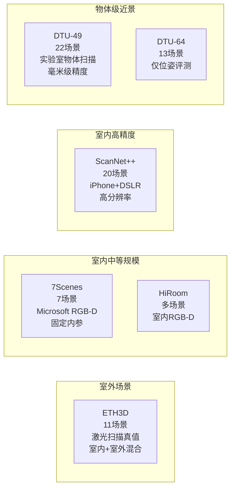
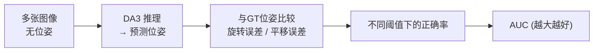
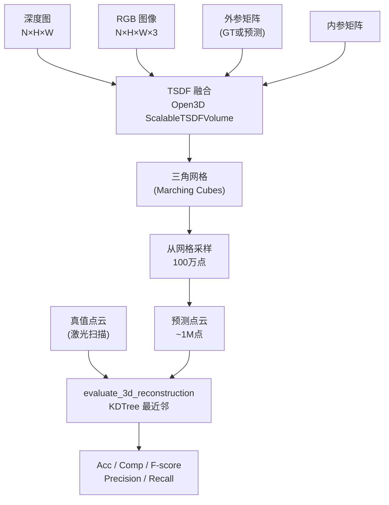

# 第九章：评测体系——DA3-BENCH 六大数据集

> DA3 的评测结果来自六个从未参与过训练的数据集，覆盖三种评测模式：位姿精度、有位姿的重建质量、无位姿的端到端重建。本章介绍这六个数据集各自测什么、场景差异有多大、评测指标为什么这样定义，以及 TSDF 融合是怎么把深度图变成可以和真值点云比较的三维重建结果的。

---

## 为什么需要专门设计评测体系

多视角深度估计有三件本质上不同的事要评：

1. **位姿精度**：给定多张图，估计的相机位姿有多准？
2. **深度质量（有位姿）**：用真值位姿来反投影，重建的三维形状有多准？
3. **端到端重建质量（无位姿）**：只给图像，位姿和深度全靠模型，最终三维形状有多准？

第 2 项和第 3 项的差别揭示了位姿误差对最终重建的影响：如果两者差距很大，说明模型的深度质量不错但位姿误差是瓶颈；如果差距很小，说明模型的位姿估计足够好，深度质量是主要限制。

DA3-BENCH 的三种模式 `pose`、`recon_posed`、`recon_unposed` 正好对应这三件事，六个数据集在每种模式下分别提供了不同的测试难度。

---

## 六个数据集：覆盖不同场景和挑战

### ETH3D

**场景性质**：11 个室内和室外场景，用工业级激光扫描仪提供点云真值，精度在毫米级。场景从精细室内结构（管道、货架）到开阔室外建筑（courtyard、facade）都有。

**为什么有挑战性**：室外场景的深度范围从 0.5 米到 100 米以上，要求模型在极大的深度范围内保持准确；室内场景结构复杂，有大量遮挡和反光。`constants.py` 注释明确写明 DA3 从未在 ETH3D 数据上训练过。

**TSDF 参数**：体素尺寸 $\approx 0.039$ 米，评测阈值 0.25 米——这比室内数据集的阈值（0.05 米）宽松 5 倍，因为室外场景的绝对距离更大，0.05 米的误差对室外 30 米深度来说已经是 0.17% 的相对误差，要求过严。

**排除的视图**：delivery_area、electro、playground、relief、relief_2 五个场景各有若干已知有问题的图像帧被手工过滤（比如曝光异常、运动模糊），在评测时不参与计算。

### 7Scenes

**场景性质**：微软开发的 7 个室内 RGB-D 数据集（chess、fire、heads、office、pumpkin、redkitchen、stairs），用 Kinect 采集，有精确的相机轨迹和三维网格真值。

**特殊之处**：所有帧共享固定内参（$f_x = f_y = 585$，$c_x = 320$，$c_y = 240$），这对评测很有利——内参完全已知，位姿误差可以完全归因于旋转和平移的估计，不会混入内参估计误差。

**TSDF 参数**：体素尺寸 $\approx 0.0078$ 米，评测阈值 0.05 米——典型室内精度要求。

### ScanNet++

**场景性质**：20 个高质量室内场景，用 iPhone LiDAR 和高分辨率 DSLR（iPhone 和 DSLR 分别成像）扫描，深度真值来自专业激光扫描仪，质量显著高于普通 Kinect 数据。

**评测输入分辨率**：$768 \times 1024$（比 DA3 默认的 $518 \times 518$ 更大），代码在推理前会 resize。

**最大深度截断**：5.0 米——室内场景通常不超过 5 米，超过这个距离的深度预测不被纳入融合，防止背景墙壁的噪声影响重建。

**为什么是最全面的测试**：ScanNet++ 既有精确的真值，场景又覆盖多种室内结构（走廊、大厅、实验室），是目前最能代表"现实室内部署"条件的数据集。

### HiRoom

**场景性质**：室内 RGB-D 数据集，场景特点是标准矩形房间结构，GT 点云存放在单独的 `fused_pcd` 目录。与 7Scenes 类似的 TSDF 参数（体素 $\approx 0.0078$ 米，阈值 0.05 米）。

**与其他室内数据集的差异**：场景列表从一个 `selected_scene_list_val.txt` 文件读取，不是固定的 hardcode 列表——评测的子集是挑选过的验证集，不覆盖全部场景，减少了评测时间。

### DTU-49

**场景性质**：丹麦技术大学的工业级多视角立体基准数据集，22 个场景（`scan1` 到 `scan118`），每个场景是一个放在转台上的物体，从固定相机阵列拍摄。深度真值用结构光扫描仪获取，精度在 0.1 毫米级别。

**尺度注意**：DTU 的评测参数是毫米单位——`DTU_DIST_THRESH=0.2`（0.2 毫米几何一致性阈值），`DTU_MAX_DIST=20`（20 毫米的外点截断），`DTU_DOWN_DENSE=0.2`（0.2 毫米下采样）。这和其他数据集用米单位完全不同，代码里有专门的 DTU 评测路径处理这个尺度。

**几何一致性过滤**：`DTU_NUM_CONSIST=4`——要求一个点在至少 4 个视角的深度预测中都出现（几何一致），才被纳入最终点云。这个严格的一致性过滤会显著减少点云噪声，是 DTU 评测的标准做法。

**`constants.py` 注释**："DepthAnything3 was never trained on any images from DTU."——明确排除了数据泄露的可能性。

### DTU-64

**场景性质**：13 个 DTU 场景的一个子集（每场景 64 张图），但仅用于**位姿评测**（`pose` 模式），不参与三维重建评测。`constants.py` 和 `eval_bench.yaml` 都明确写道这是"pose evaluation only"。

这个划分的逻辑是：DTU 原始的重建评测（DTU-49）用的是专用的点云比较工具链；DTU-64 单独提供了带有精确位姿标注的场景，适合评测模型在物体级场景下的相机位姿估计能力，而不需要跑完整的 TSDF 融合流程。

---

## 三种评测模式

### pose 模式：位姿 AUC

**输入**：多张图像（无位姿）  
**评测**：预测位姿和真值位姿的误差，计算不同误差阈值下的正确率，报告曲线下面积（AUC）

AUC 的计算方式：以误差阈值为横轴（比如旋转误差从 0 到 30°，平移误差从 0 到 1 米），以对应阈值内正确的比例为纵轴，曲线下面积就是 AUC。AUC 越大说明在各种宽严程度的标准下都表现好。

单独报告旋转 AUC 和平移 AUC 让失败原因更清晰：如果旋转 AUC 高但平移 AUC 低，说明方向估计准但平移尺度有问题（这正是相对深度估计的典型失败模式）；如果两者都低，说明跨视角匹配本身有问题。

### recon_posed 模式：有位姿三维重建

**输入**：多张图像 + 真值位姿  
**评测**：DA3 只做深度估计，用真值位姿融合深度图，与真值点云比较

这个模式把位姿误差从等式中消掉，专门测深度质量。如果模型在这个模式下表现好但 `recon_unposed` 差，说明位姿估计是瓶颈。

### recon_unposed 模式：无位姿端到端重建

**输入**：只有图像  
**评测**：DA3 同时估计位姿和深度，融合后与真值点云比较

这是最接近真实部署条件的模式——用户通常不提供标定好的位姿，特别是手持拍摄的场景。这个模式的指标是 DA3 系统能力的全貌评估。

---

## 重建评测的完整流程

三个模式里 recon 相关的两个走同一套重建 + 评测流程：

**TSDF 融合**：把 N 张深度图按照相机位姿和内参，逐帧积分到一个可扩展的 TSDF 体积（`ScalableTSDFVolume`）里。TSDF 在每个体素位置存储"到最近表面的带符号距离"，多帧积分后用 Marching Cubes 提取三角网格。和直接堆叠点云相比，TSDF 融合会自动填充单帧深度图的孔洞、消除噪声、得到一致的封闭表面。

**点云采样**：从提取的三角网格均匀采样 100 万个点，作为评测用的预测点云。采样数量在所有数据集上相同，保证不同大小场景之间的评测一致性。

---

## 重建质量指标的定义

`evaluate_3d_reconstruction`（`bench/utils.py:91`）计算六个指标，核心是两个方向的最近邻距离：

$$
\text{Acc} = \frac{1}{|\hat{P}|}\sum_{p \in \hat{P}} \min_{q \in P^*} \|p - q\|
$$

$$
\text{Comp} = \frac{1}{|P^*|}\sum_{q \in P^*} \min_{p \in \hat{P}} \|p - q\|
$$

其中 $\hat{P}$ 是预测点云，$P^*$ 是真值点云。

**Accuracy（准确率）**：预测点云里每个点到最近真值点的平均距离。衡量"预测的表面有多少是假的"——如果预测多了一堆在真实表面附近但不在上面的噪声点，Acc 会变差。

**Completeness（完整度）**：真值点云里每个点到最近预测点的平均距离。衡量"真实表面有多少被预测覆盖"——如果预测漏了某些区域（比如背对相机的面），Comp 会变差。

**F-score**：把阈值化的版本（Precision 和 Recall）调和平均：

$$
\text{Precision} = \frac{|\{p \in \hat{P}: d(p, P^*) < \tau\}|}{|\hat{P}|}, \quad
\text{Recall} = \frac{|\{q \in P^*: d(q, \hat{P}) < \tau\}|}{|P^*|}
$$

$$
F = \frac{2 \cdot \text{Prec} \cdot \text{Rec}}{\text{Prec} + \text{Rec}}
$$

阈值 $\tau$ 因数据集而异（7Scenes 和 ScanNet++ 用 0.05 米，ETH3D 用 0.25 米，DTU 用 20 毫米），反映各场景的尺度和期望精度。

F-score 是最综合的单一指标：Acc 和 Comp 如果一个很差会拉低 Overall，而 F-score 通过 Precision/Recall 的调和平均对偏差更敏感。在 DA3 的 README 对比表里，F-score 是主要排名指标。

---

## 评测的工程细节

**`max_frames=100`**：每个场景随机采样最多 100 帧。对于包含几百帧的长序列（如 RealEstate10K 风格的视频），100 帧已经足够覆盖场景的主要结构，同时控制了评测时间（TSDF 融合是 CPU 密集的操作）。

**`ref_view_strategy="first"`**：评测时统一用序列第一帧作为参考视角（而不是训练时的 `saddle_balanced`）。`constants.py` 注释说明了原因："Use 'first' for consistent and reproducible evaluation results"——固定策略消除了参考视角选择带来的随机性，让不同运行的结果完全可复现。

**`num_fusion_workers=4`**：TSDF 融合是计算瓶颈，用 4 个并行 worker 同时处理不同场景的融合，显著缩短评测时间。

**`dtu64` 在 `recon_only` preset 里被排除**：`eval_bench.yaml:89` 的 `recon_only` preset 里没有 dtu64，只有 pose 相关的 preset 包含它——DTU-64 确实只用于位姿评测。

---

## 六个数据集在三种模式下的覆盖

| 数据集 | pose | recon_posed | recon_unposed | 场景规模 | 深度真值类型 |
|--------|------|-------------|---------------|---------|------------|
| ETH3D | ✅ | ✅ | ✅ | 室内+室外 | 激光扫描 |
| 7Scenes | ✅ | ✅ | ✅ | 室内 | Kinect RGB-D |
| ScanNet++ | ✅ | ✅ | ✅ | 室内高精度 | LiDAR+DSLR |
| HiRoom | ✅ | ✅ | ✅ | 室内 | RGB-D |
| DTU-49 | — | ✅ | ✅ | 物体级 | 结构光扫描 |
| DTU-64 | ✅ | — | — | 物体级 | — |

ETH3D、7Scenes、ScanNet++、HiRoom 都被 DA3 用于论文里的三维重建对比；DTU-49 测的是小物体近景精度；DTU-64 提供了一个补充的大图像数量位姿评测。

---

## 为什么选这六个而不是其他

这几个数据集在多视角立体和相机位姿估计社区里是最广泛使用的标准 benchmark，几乎所有对比方法（VGGT、DUSt3R、MASt3R）都在这些数据集上报告了结果，横向比较有直接意义。

关键的是，这六个数据集**在 DA3 的任何训练变体里都没有出现过**，既不是监督信号，也不是伪标签来源。这点在 `constants.py` 里对 DTU 和 ETH3D 都有注释，ScanNet++ 和其他数据集则属于 "never seen" 的范围（训练集用的是 ScanNet v1 而不是 ScanNet++）。这是真正意义上的泛化能力测试。

---

## 本章小结

DA3-BENCH 的设计逻辑是分层评测：先单独测位姿，再测深度质量，最后测端到端系统能力。六个数据集覆盖了室外大场景（ETH3D）、标准室内（7Scenes）、高精度室内（ScanNet++）、特定场景（HiRoom）和近景物体（DTU-49/DTU-64），构成了从场景规模到精度要求的全方位覆盖。

重建评测走 TSDF 融合到点云的完整流程，用 Accuracy/Completeness/F-score 三个方向衡量重建质量；位姿评测用 AUC 在多个误差阈值下综合评分。评测时固定使用 `ref_view_strategy="first"` 保证可复现性。

下一章是收尾的实战章节：用三相机场景完整走一遍 DA3 的推理 API，从加载模型到读取深度、位姿和 Gaussians 输出。

::: details 📎 知识链接

- [第二章：深度光线表示](./02_深度光线表示_统一单目与多视角) — 位姿从 camray RANSAC 路径估计，是 pose 模式评测的主要路径
- [第七章：DA3-Nested 从相对深度到米制深度](./07_DA3Nested_从相对深度到米制深度) — recon 模式需要米制深度（DA3-Nested 输出）才能正确融合 TSDF
- [第八章：3D 高斯头](./08_3D高斯头_从深度直接到可渲染场景) — GS 头的输出可以作为 TSDF 融合的替代方案（直接渲染而不需要融合）

:::
