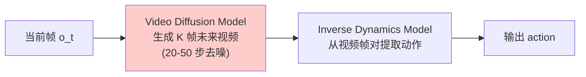

# WAM 范式：为什么机器人需要想象未来

> 一个机器人策略如果能"想象"出做了某个动作后世界会变成什么样，那它对物理世界的理解会远超只学了"看到什么做什么"映射的策略。WAM 就是这个思路的产物。

## 知识链接

- 下一章：[Fast-WAM 设计哲学](./02_设计哲学)
- [系列目录](./index)

---

## 1. 从模仿学习说起：策略学习的两种范式

机器人策略学习的目标是：给定当前观测 $o_t$（相机图像 + 本体感知）和任务描述（语言指令），输出一个动作序列 $a_{t:t+H}$ 让机器人完成任务。

目前主流有两种范式来训练这个策略：

### 1.1 纯 VLA（Vision-Language-Action）

VLA 的做法非常直接——训练一个端到端模型，输入图像+指令，直接输出动作：

$$
\pi_\theta(a_t | o_t, l) = f_\theta(\text{image}_t, \text{instruction})
$$

> 一句话：VLA 就是一个从"当前看到什么"到"应该做什么"的直接映射函数。

**逐项拆解**：
- $\pi_\theta$：策略网络（policy），参数为 $\theta$
- $a_t$：输出的动作（比如 7 维：末端执行器的 xyz 位移 + rpy 旋转 + 夹爪开合）
- $o_t$：当前观测（RGB 图像 + 关节角度等）
- $l$：语言指令（如"把红色杯子放到盘子上"）
- $f_\theta$：端到端神经网络（通常是 VLM 架构，如 PaLM-E、RT-2、OpenVLA）

**训练方式**：行为克隆——收集人类示范的 $(o_t, a_t)$ 对，用 MSE loss 或离散 token 的交叉熵 loss 直接拟合。

**数值例子**：假设一个 LIBERO 任务，observation 是 224×224 的 RGB 图像（2 个相机），action 是 7 维向量 $[dx, dy, dz, d\phi, d\psi, d\theta, \text{gripper}]$。VLA 做的就是：

$$
\text{输入}: [224 \times 224 \times 3 \times 2] + \text{"pick up the red cup"} \longrightarrow \text{输出}: [0.01, -0.02, 0.005, 0.0, 0.01, 0.0, 1.0]
$$

### 1.2 VLA 的问题：缺乏物理理解

VLA 能工作，但它有一个根本缺陷——**模型只学到了输入-输出的统计关联，没有学到世界的物理规律**。

具体表现为：

**问题 1：训练信号稀疏**

动作标注只有 7 维——一个 224×224 的图像有 150528 个像素值，但对应的监督信号只有 7 个数字。这意味着图像编码器要从 15 万维的输入空间中提取出与 7 维动作相关的信息，但梯度信号只从这 7 个输出维度回传。

对比一下信息密度：

| 监督信号 | 维度 | 每 sample 信息量 |
|---------|------|-----------------|
| 动作标注 | 7 | 7 个浮点数 |
| 视频下一帧 | 224×224×3 = 150528 | 15 万个像素值 |
| 视频 5 帧 | 752640 | 75 万个像素值 |

视频预测提供的监督信号比动作标注**密集 10 万倍**。

**问题 2：对长期后果缺乏预见**

VLA 只基于当前一帧做决策（或者最近几帧），它不需要思考"如果我做了这个动作，3 秒后世界会变成什么样"。这意味着对于需要多步规划的任务（如"先打开微波炉门 → 放入碗 → 关门"），VLA 容易在中间步骤犯错——因为它没有能力评估"当前这步对后续步骤的影响"。

**问题 3：泛化受限**

换一个光照条件、换一个桌面材质、换一个杯子形状——VLA 可能就不会了。因为它只学到了训练数据中观测-动作的统计关联，没有学到"杯子是刚体、受重力、需要从上方抓取"这种物理规律。

---

## 2. World Model 的核心思想

### 2.1 什么是 World Model？

World Model 的核心思想是：

> **让模型学会预测"如果我做了动作 a，世界会变成什么样"——即学习世界的状态转移函数。**

数学上，World Model 学的是条件分布：

$$
p_\theta(o_{t+1:t+K} | o_t, a_{t:t+K-1}, l)
$$

> 一句话：给定当前观测和未来动作序列，预测未来 K 步的观测。

**逐项拆解**：
- $o_{t+1:t+K}$：未来 K 帧的观测（在视觉场景中就是未来的视频帧）
- $o_t$：当前观测（当前帧）
- $a_{t:t+K-1}$：从 $t$ 到 $t+K-1$ 的动作序列
- $l$：语言指令（提供任务目标的语义信息）
- $p_\theta$：由参数 $\theta$ 的生成模型学习的条件分布

在机器人场景中，"世界变成什么样"最自然的表示就是**未来的相机视频帧**。因此 World Model 在实现上通常就是一个**条件视频生成模型**。

### 2.2 为什么视频预测能提供物理理解？

要准确预测"手往左移 5cm 后相机会看到什么"，模型必须隐式地理解：

1. **3D 空间结构**：物体在哪个深度、相机透视投影的几何关系
2. **物体属性**：杯子是刚体不会变形、布料是柔体会褶皱
3. **物理规律**：松开手后物体会下落、推一个圆柱体它会滚动
4. **遮挡关系**：手移到物体前面会挡住物体
5. **光照物理**：物体移动后影子和反光会变化

这些理解全部蕴含在"准确预测下一帧像素"这一个目标中——因为任何物理规律的违反都会导致像素级的预测误差。这就是为什么视频预测是一个极其丰富的学习信号。

### 2.3 数值例子：视频预测需要多少物理理解？

假设一个 224×224 的图像场景中有一个红色杯子在桌上，机器人手臂位于画面右侧。

如果动作是 $a = [0.05, 0, -0.02, 0, 0, 0, 0]$（手向左移 5cm + 向下移 2cm）：

模型要预测的下一帧必须精确地：
- 把机器人手臂的像素向左移动约 $\frac{0.05}{0.5} \times 224 \approx 22$ 像素（假设 workspace 宽 0.5m）
- 把手臂的像素向下移动约 $\frac{0.02}{0.3} \times 224 \approx 15$ 像素
- 手臂移动后露出的桌面区域要用合理的纹理填充（需要理解桌面是连续平面）
- 如果手挡住了杯子的一部分，移开后要"补全"被遮挡的杯子区域

这些预测要求模型在 150528 个像素上都做对——每一个错误像素都会贡献 loss。这就是为什么视频预测能强迫模型学到精细的物理表征。

---

## 3. WAM：联合预测视频与动作

### 3.1 从 World Model 到 World-Action Model

纯 World Model 只预测未来视频，不直接输出动作。要用它做机器人控制，传统方法需要两步：

1. 用 World Model 生成未来视频（"想象"）
2. 用一个额外的 Inverse Dynamics Model (IDM) 从视频帧对中提取动作

这引出了 **World-Action Model (WAM)** 范式——把视频预测和动作预测**联合训练在一个模型里**：

$$
p_\theta(v_{t+1:t+K}, a_{t:t+H} | o_t, l)
$$

> 一句话：一个模型同时输出未来视频和动作序列。

**逐项拆解**：
- $v_{t+1:t+K}$：未来 K 帧视频（World 分支的输出）
- $a_{t:t+H}$：未来 H 步动作（Action 分支的输出）
- $o_t$：当前观测（第一帧图像 + 本体感知）
- $l$：语言指令

### 3.2 联合训练的核心优势

为什么把两个任务放在一个模型里联合训练比分别训练更好？

**关键 insight：两个任务共享表征，视频预测的丰富梯度帮助动作预测学到更好的视觉表征。**

用更形象的方式理解：
- 动作分支说："我需要知道杯子的精确位置才能抓准"
- 视频分支提供的梯度信号说："为了准确预测杯子在下一帧的位置，编码器必须精确编码杯子的 3D 位置和姿态"
- 两者的需求完全对齐——视频分支训练出的表征恰好是动作分支需要的

联合训练的 loss：

$$
\mathcal{L}_{\text{total}} = \lambda_v \cdot \mathcal{L}_{\text{video}} + \lambda_a \cdot \mathcal{L}_{\text{action}}
$$

> 一句话：总 loss 是视频预测 loss 和动作预测 loss 的加权和。

**逐项拆解**：
- $\mathcal{L}_{\text{video}}$：视频预测的重建 loss（在 latent space 中的 MSE）
- $\mathcal{L}_{\text{action}}$：动作预测的 loss（归一化动作空间中的 MSE）
- $\lambda_v, \lambda_a$：平衡两个 loss 的权重（Fast-WAM 中默认都是 1.0）

**为什么是 1:1 的权重？** 因为两个 loss 在各自空间中已经做了归一化——video loss 是在 VAE latent space 中计算的（维度已经压缩），action loss 是在标准化后的动作空间中计算的。两者的数值量级接近，所以等权重就能平衡。

### 3.3 WAM vs VLA 对比总结

| 维度 | VLA | WAM |
|------|-----|-----|
| 输出 | 只有动作 | 动作 + 视频 |
| 训练信号密度 | 低（每 sample 只有 7 维 action label） | 高（每 sample 有 75 万像素 + 7 维 action） |
| 物理理解 | 隐式、不保证 | 显式（视频预测强制学习物理） |
| 是否需要 embodied 预训练 | 通常需要（百万级 episode） | 可以用纯视频预训练 World Model |
| 可解释性 | 黑盒 | 可以看生成的视频理解模型在"想什么" |
| 推理时是否需要生成视频 | N/A | 传统 WAM 需要（慢）、Fast-WAM 不需要（快） |

---

## 4. 传统 WAM 的致命问题：太慢了

### 4.1 Imagine-then-Execute 范式

早期 WAM（UniPi, SuSIE, IRASim, DreamZero）都采用两阶段推理：

**阶段 1（Imagine）**的计算瓶颈分析：

假设生成 5 帧 224×224 的视频，使用 DiT 作为 backbone：
- VAE encode 后 latent shape：$[16, 2, 14, 14]$（16 通道, 2 时间步, 14×14 空间）
- patch 后 token 数：$2 \times 7 \times 7 = 98$（假设 patch_size=[1,2,2]）
- DiT self-attention 的计算量：每层 $O(98^2 \times 3072)$，30 层
- **需要重复 20 次**（20 步去噪迭代）

总计算量约为单次前向的 20 倍。对于一个 5B 参数的模型，这意味着：

| 步骤 | 计算量 | 延迟 |
|------|--------|------|
| VAE encode | 1× | ~10ms |
| DiT × 20 步 | 20× | ~800ms |
| IDM forward | 1× | ~50ms |
| **总计** | | **~860ms** |

### 4.2 实时控制的需求

机器人控制通常需要 5-20Hz 的控制频率：

| 控制频率 | 允许延迟 | 能否满足？ |
|---------|---------|-----------|
| 5Hz | 200ms | ❌ 860ms >> 200ms |
| 10Hz | 100ms | ❌ |
| 20Hz | 50ms | ❌ |

传统 WAM 在任何实际控制频率下都无法实时运行。

### 4.3 问题本质的提炼

让我们抓住问题的骨架：

1. **训练时**：视频预测任务的存在是为了提供丰富的监督信号——让模型学会物理理解
2. **推理时**：我们只关心动作输出——视频是"辅助产物"

但传统 WAM 在推理时仍然完整地执行视频生成——它把训练时的辅助任务当成了推理时的必要步骤。这就像一个学生考试时把所有练习题都重新做一遍，而不是直接用练习中学到的能力答题。

> **核心问题：如何在推理时获得视频预测带来的物理理解，但不实际执行视频生成？**

这就是 Fast-WAM 要回答的问题——下一章展开。

---

## 5. 本章小结

| 概念 | 核心要点 |
|------|---------|
| VLA 的局限 | 训练信号稀疏（7 维 vs 15 万像素）、缺乏物理理解、泛化差 |
| World Model 的价值 | 视频预测强制学习 3D 结构、物体属性、物理规律 |
| WAM 范式 | 联合预测 video + action，视频分支提供丰富梯度信号 |
| 传统 WAM 的问题 | 推理时需要完整视频生成（20 步 DiT 去噪），延迟 ~860ms，无法实时 |
| 本质矛盾 | 训练需要视频任务，推理不需要视频输出——两者应该解耦 |

---

**下一章预告**：[第 2 章](./02_设计哲学)将展开 Fast-WAM 如何解决这个矛盾——通过 Mixture-of-Transformers 架构，让视频的物理理解在训练时通过共享注意力"流入"动作分支，推理时动作分支用 KV-Cache 直接复用视觉表征，完全跳过视频生成。
