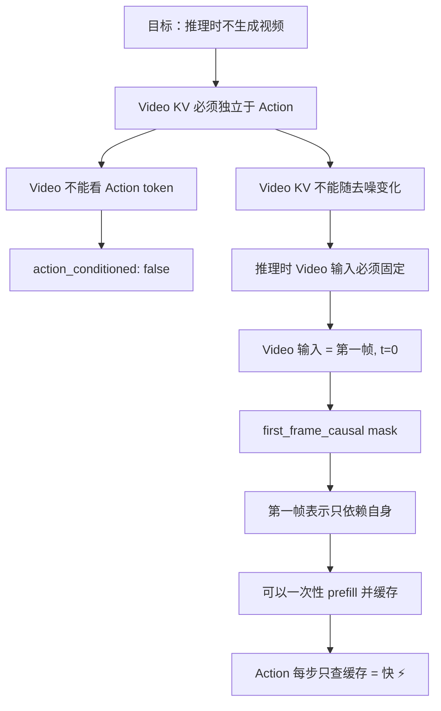

# Fast-WAM 设计哲学：训练时想象推理时跳过

> Fast-WAM 的核心洞察可以一句话概括：视频预测是训练时的"教具"，不是推理时的"考题"。通过精心设计的 attention mask，让动作分支在训练时从视频分支获取物理理解，推理时用缓存复用这些理解。

## 知识链接

- 上一章：[WAM 范式](./01_WAM范式)
- 下一章：[全局架构鸟瞰](./03_全局架构鸟瞰)
- [系列目录](./index)

---

## 前情提要

上一章我们明确了核心矛盾：训练时需要视频预测提供物理监督信号，推理时只需要动作输出。传统 WAM 把两者耦合在一起导致推理太慢。这一章拆解 Fast-WAM 如何解耦这对矛盾。

---

## 1. 核心思想："辅助任务解耦"

### 1.1 设计原则

Fast-WAM 的设计原则是：

> **训练时，视频分支和动作分支通过共享注意力层互相交流信息；推理时，只运行动作分支，但它仍然能"看到"视频分支的视觉表征——因为第一帧的表征被缓存了。**

这个原则分解为三个具体设计决策：

1. **双 Expert 架构**：Video Expert（大）和 Action Expert（小）各自有独立的参数，但在每一层共享一次 joint attention
2. **Attention mask 控制信息流**：通过 mask 精确控制 action token 能"看到"哪些 video token
3. **KV-Cache 推理**：推理时 Video Expert 只对当前第一帧做一次前向（t=0，无噪声），缓存每层的 K/V；Action Expert 在每步去噪时复用这些缓存

### 1.2 为什么用两个 Expert 而不是一个大模型？

一个自然的问题：为什么不直接用一个模型同时输出 video 和 action？

答案是**推理效率**。如果用一个统一模型：
- 模型参数量 = Video + Action 的完整参数 ≈ 5B
- 每步 action 去噪都要跑完整的 5B 模型
- 20 步去噪 = 20 × 5B 前向 ≈ 800ms

用两个 Expert 后：
- Video Expert（5B）：推理时只跑 1 次（prefill，~40ms）
- Action Expert（0.5B）：推理时跑 20 次（每步 ~6.5ms，总共 ~130ms）
- **总计 ~190ms**——因为 Action Expert 只有 Video Expert 的 1/10 大

关键 insight：**两个 Expert 不需要同样大**。视频生成是复杂任务需要大模型，但动作预测在获得视觉表征后是相对简单的任务——1024 维的小模型就够了。

---

## 2. 三种变体的设计动机

Fast-WAM 有三种变体，它们的区别**完全在于 attention mask 的设计**——即 Action token 能看到哪些 Video token。

### 2.1 FastWAM（uncond，默认版本）

**设计**：Action 只 attend 到第一帧的 Video token。

```
Action 的可见范围：
  ✅ 第一帧的 video token（当前观测的表征）
  ❌ 后续帧的 video token（未来帧的表征）
  ✅ 所有 action token（自己的完整序列）
```

**设计动机**：
- 推理时只有当前第一帧是真实的（后续帧是噪声/不存在），所以 action 只需要看第一帧就够了
- 第一帧的 Video KV 是确定的（t=0 无噪声），可以一次性缓存
- 这使得 action 去噪的每一步都不需要等 video 去噪完成——**两者完全解耦**

**代价**：Action 看不到未来帧的信息（如"3 步后杯子应该在哪里"）。这个信息在训练时通过联合 attention 间接学到了——video 分支的存在迫使共享的 attention 层编码了物理规律，action 分支通过第一帧的丰富表征（而非原始像素）就能获取这些理解。

### 2.2 FastWAMJoint

**设计**：Action attend 到**所有** Video token（全部帧）。

```
Action 的可见范围：
  ✅ 所有帧的 video token（包括未来帧）
  ✅ 所有 action token
```

**设计动机**：
- Action 能看到未来帧的完整视觉规划——理论上能做更好的长期决策
- 但代价是推理时 Video 也必须做完整去噪（KV 每步都在变），不能用 cache
- 适用于**不在乎延迟、只在乎精度**的场景（如离线评估）

**推理方式**：Video 和 Action **同步联合去噪**——每步迭代两者的 token 一起更新。延迟回到 ~800ms 级别。

### 2.3 FastWAMIDM（Inverse Dynamics Model 变体）

**设计**：训练时 Action 看到的是**干净的 GT 视频**（或加了少量噪声的 GT 视频），而不是和 Video Expert 一起从纯噪声去噪。

```
训练时 Action 的可见范围：
  ✅ 干净/轻微噪声的 GT video token（teacher-forcing）
  ✅ 所有 action token
  ❌ 正在去噪的 noisy video token
```

**设计动机**：
- 这更接近传统 IDM 的思路："假设你已经知道未来会发生什么（GT 视频），从中推断出应该做什么动作"
- 用 teacher-forcing 降低了 action 分支的学习难度
- 但推理时 GT 视频不存在——必须先用 Video Expert 生成视频，再给 Action 看

**训练特殊机制**：`video_cond_noise_prob = 0.5`——50% 的概率给 GT 视频加噪声。这是为了让 Action 分支习惯看到不完美的视频（因为推理时生成的视频不是完美的），提高 robustness。

### 2.4 三种变体对比

| 维度 | FastWAM (uncond) | FastWAMJoint | FastWAMIDM |
|------|------------------|--------------|------------|
| Action 可见 Video 范围 | 只看第一帧 | 看全部帧 | 看 GT 视频 |
| 推理时是否需要生成视频 | ❌ | ✅ | ✅ |
| 能否用 KV-Cache | ✅ | ❌ | ❌ |
| 推理延迟 | ~190ms ⚡ | ~800ms | ~800ms |
| 动作预测精度 | 高 | 略高 | 中等 |
| 代码中的类 | `FastWAM` | `FastWAMJoint` | `FastWAMIDM` |
| 适用场景 | 实时部署 | 离线/不在乎速度 | 研究对比 |

---

## 3. Attention Mask 如何决定信息流

### 3.1 为什么 mask 如此关键？

在 Mixture-of-Transformers 中，Video token 和 Action token 被拼在一起做 joint attention。**谁能看到谁**完全由一个 `[total_seq, total_seq]` 大小的 boolean mask 决定。

这个 mask 的设计直接决定了：
1. **训练时**：Action 能从 Video 学到多少物理信息
2. **推理时**：能否用 KV-Cache 加速（即 Video 的 KV 是否独立于 Action）
3. **模型变体**：三种变体的唯一区别就是这个 mask

### 3.2 FastWAM (uncond) 的 mask 可视化

假设 video 有 $S_v = 196$ 个 token（第一帧 14×14），action 有 $S_a = 16$ 个 token：

```
Attention Mask [212 × 212]:

                    Video (196)          Action (16)
              ┌──────────────────────┬────────────────┐
              │                      │                │
Video (196)   │  first_frame_causal  │     False      │
              │  (196×196 全 True)   │   (不看action) │
              │                      │                │
              ├──────────────────────┼────────────────┤
              │  True (只看前196个)  │                │
Action (16)   │  = 第一帧 video      │     True       │
              │                      │  (互相全看)    │
              │                      │                │
              └──────────────────────┴────────────────┘
```

关键规则：
- **Video → Video**：第一帧只能看自己（first_frame_causal），保证其表示独立
- **Video → Action**：False——视频不看动作（视频生成不需要知道动作是什么）
- **Action → Video**：True——动作可以看第一帧的全部 video token
- **Action → Action**：True——动作 token 之间全互相可见（bidirectional）

### 3.3 为什么 Video 不看 Action？

在 uncond 模式下 `action_conditioned: false`——Video Expert 的去噪不以动作为条件。这是一个有意的设计选择：

- 如果 Video 能看到 Action，那 Video 的 KV 就依赖于 Action 的状态
- Action 每步去噪都在变化，导致 Video 的 KV 也在变——无法缓存
- 把 Video 和 Action 的信息流设为**单向**（Action → Video 禁止，Video → Action 允许），就保证了 Video KV 的独立性

### 3.4 FastWAMJoint 的 mask

唯一区别：Action 可以看**所有** Video token，不只是第一帧：

```python
# FastWAM (uncond): action 只看第一帧
mask[video_seq_len:, :first_frame_tokens] = True

# FastWAMJoint: action 看全部 video
mask[video_seq_len:, :video_seq_len] = True
```

这意味着 Action 能看到第 2、3、4... 帧的 video token。但由于这些帧的 token 在去噪过程中不断变化，不能缓存——必须每步都重新计算全部 video token。

### 3.5 设计决策链

整个 Fast-WAM 的设计决策形成了一条逻辑链：



---

## 4. "不需要想象"的精确含义

论文标题问的是："Do World Action Models Need Test-time Future Imagination?"

答案的精确含义是：

**推理时不需要生成完整的未来视频帧——但模型确实利用了视频预测任务在训练时学到的物理理解。这个理解被编码在 Video Expert 的参数中，通过第一帧的 KV 表征传递给 Action Expert。**

换言之：
- ❌ 不需要 test-time imagination（不需要跑 Video Expert 的去噪循环）
- ✅ 需要 training-time imagination（训练时 Video 的存在帮助了 Action 学习）
- ✅ 需要 test-time visual representation（推理时仍然需要 Video Expert 编码第一帧）

这和人类的直觉类似：你学开车时，教练让你想象"如果打满方向盘车会怎么转"（训练时想象）；但你开车时不需要每次都"想象完整的车辆轨迹再操作"（推理时不想象）——你直接凭"身体记忆"（学到的表征）做反应。

---

## 5. 本章小结

| 设计决策 | 为什么这样设计 |
|---------|--------------|
| 双 Expert（Video 5B + Action 0.5B） | Video 任务复杂需要大模型，Action 任务小模型就够 + 推理时只跑小模型 |
| Joint attention（每层拼接做一次） | 让 Action 在训练时从 Video 获取物理表征 |
| Action 只看第一帧 (uncond) | 保证 Video KV 独立可缓存 → 推理加速 |
| Video 不看 Action (action_conditioned=false) | 保证 Video KV 不依赖 Action 状态 → 可一次性计算 |
| first_frame_causal mask | 第一帧表示只依赖自身 → prefill 一次就够 |
| 三种变体 | 在"信息量 vs 推理速度"的 trade-off 上提供不同选择 |

---

**下一章预告**：[第 3 章](./03_全局架构鸟瞰)将给出完整的系统架构图——从原始图像输入到动作输出，每一个组件的角色、输入输出 shape、参数量，让你对整个系统建立全局画面。
