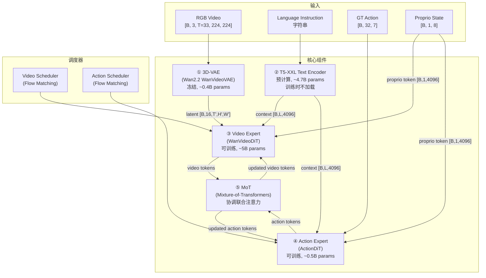
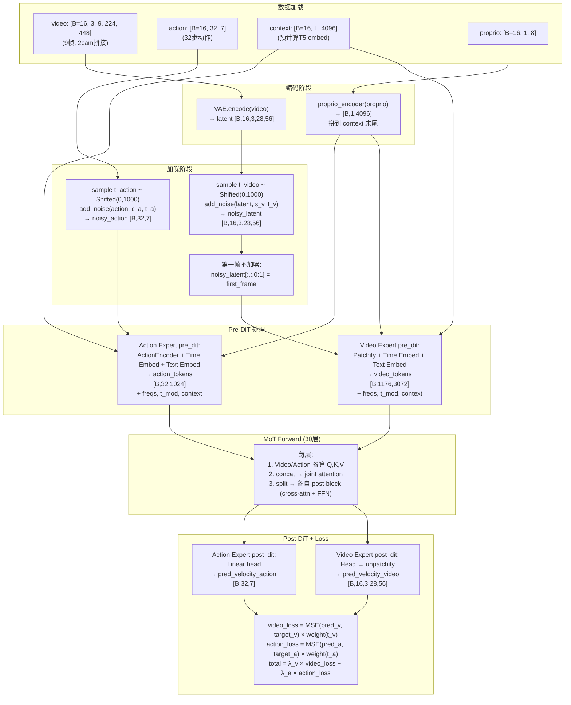
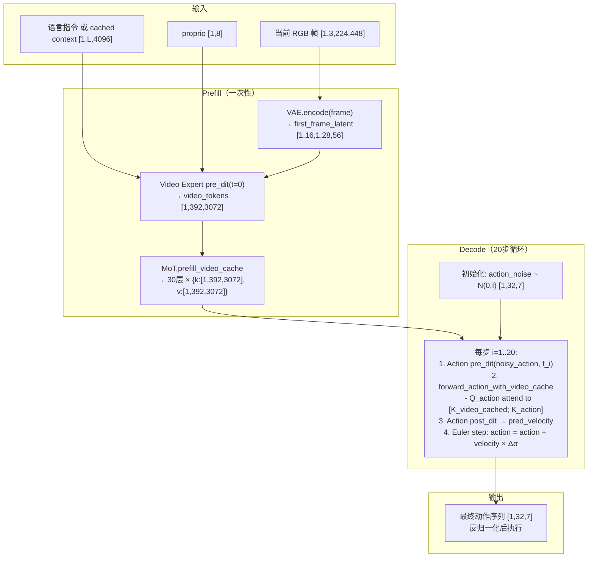

# 全局架构鸟瞰：五大组件与数据流

> 在深入每个组件之前，先建立全局画面——从原始图像输入到动作输出，数据经过了哪些变换、shape 如何变化、每个组件承担什么角色。

## 知识链接

- 上一章：[Fast-WAM 设计哲学](./02_设计哲学)
- 下一章：[Wan2.2 3D-VAE](./04_3DVAE视频表示)
- [系列目录](./index)

---

## 前情提要

前两章建立了 Fast-WAM 的设计动机和哲学。现在我们从代码层面鸟瞰整个系统的组成——每个组件是什么、输入输出是什么 shape、它们之间如何连接。

---

## 1. 系统总览

Fast-WAM 系统由 5 个核心组件构成，外加 2 个 scheduler：



---

## 2. 各组件详细规格

### ① 3D-VAE (WanVideoVAE)

| 属性 | 值 |
|------|-----|
| 来源 | Wan2.2 预训练 |
| 训练时状态 | **冻结**（不更新参数） |
| 空间下采样 | 8× |
| 时间下采样 | 4×（第一帧不压缩：(T-1)/4 + 1） |
| Latent 通道数 | 16 |
| 输入 shape | `[B, 3, T, H, W]`（像素空间，[-1, 1]） |
| 输出 shape | `[B, 16, T', H', W']`，其中 T'=(T-1)/4+1, H'=H/8, W'=W/8 |

**LIBERO 224×448 的数值例子**（2cam 水平拼接后为 224×448）：
- 输入视频：`[B, 3, 9, 224, 448]`（9 帧，从 33 帧中按 ratio=4 采样得到）
- VAE 输出 latent：`[B, 16, 3, 28, 56]`（时间 (9-1)/4+1=3, 空间 224/8=28, 448/8=56）

### ② T5-XXL Text Encoder

| 属性 | 值 |
|------|-----|
| 来源 | Google T5-XXL（与 Wan2.1 共用 tokenizer） |
| 训练时状态 | **预计算并缓存**（训练时不加载模型） |
| 输出维度 | 4096 |
| 最大序列长度 | 128 token（`context_len=128`） |
| 输出 shape | `[B, L≤128, 4096]` + mask `[B, L≤128]` |

预计算机制：训练前用 `scripts/precompute_text_embeds.py` 一次性对所有指令编码，保存到磁盘。训练时直接从缓存加载 `[L, 4096]` 的 embedding。

### ③ Video Expert (WanVideoDiT)

| 属性 | 值 |
|------|-----|
| 来源 | Wan2.2 TI2V-5B 预训练 |
| 训练时状态 | **可训练**（DiT 层参数全部更新） |
| hidden_dim | 3072 |
| ffn_dim | 14336 |
| num_heads | 24 |
| attn_head_dim | 128 |
| num_layers | 30 |
| patch_size | [1, 2, 2]（时间不压缩，空间 2×2） |
| 输入 | Noisy video latent `[B, 16, T', H', W']` + timestep + context |
| 输出 | Predicted velocity `[B, 16, T', H', W']`（和输入同 shape） |
| 参数量 | ~5B |

**Token 化计算**（LIBERO 为例）：
- VAE latent：`[B, 16, 3, 28, 56]`
- in_dim = 16 × patch[0] × patch[1] × patch[2] = 16 × 1 × 2 × 2 = 64（但实际 config 中 in_dim=48，因为还要乘通道）
- Patch 后 token grid：T'=3, H'=28/2=14, W'=56/2=28
- 总 video token 数：3 × 14 × 28 = **1176**
- 每帧 token 数（tokens_per_frame）：14 × 28 = **392**

### ④ Action Expert (ActionDiT)

| 属性 | 值 |
|------|-----|
| 来源 | 从 Video Expert 权重线性插值初始化 |
| 训练时状态 | **可训练** |
| hidden_dim | 1024 |
| ffn_dim | 4096 |
| num_heads | **24**（与 Video 相同 ⚠️） |
| attn_head_dim | **128**（与 Video 相同 ⚠️） |
| num_layers | **30**（与 Video 相同 ⚠️） |
| action_dim | 任务相关（LIBERO=7, RoboTwin=14） |
| 输入 | Noisy action `[B, action_horizon, action_dim]` + timestep + context |
| 输出 | Predicted velocity `[B, action_horizon, action_dim]` |
| 参数量 | ~0.5B |

**关键约束**：`num_heads=24`, `attn_head_dim=128`, `num_layers=30` 必须和 Video Expert 完全一致。原因：MoT 中两者的 QKV 需要拼接做联合 attention，head 数和 head 维度必须对齐。

**QKV 维度计算**：
- Video Expert QKV dim = 24 × 128 = 3072 = hidden_dim（正好对齐）
- Action Expert QKV dim = 24 × 128 = 3072 ≠ hidden_dim=1024

这意味着 Action Expert 的 Q/K/V 投影层是 `Linear(1024, 3072)`——把 1024 维的 hidden state 投影到 3072 维的 attention space。这额外的投影是 Action Expert 的 SelfAttention 和 Video Expert 不同的地方。

### ⑤ MoT (Mixture-of-Transformers)

| 属性 | 值 |
|------|-----|
| 职责 | 协调 Video Expert 和 Action Expert 的联合注意力 |
| 核心操作 | 每层：concat QKV → joint attention → split → 各自 post-block |
| num_layers | 30（必须与两个 Expert 相同） |
| 独有参数 | 无（MoT 本身没有独立参数，它只是调度逻辑） |

MoT 不是一个有参数的模块——它是一个**调度框架**，把两个 Expert 的 token 拼起来过一次 attention，再拆回去。实际参数全在两个 Expert 里。

### 调度器 (WanContinuousFlowMatchScheduler)

| 属性 | Video Scheduler | Action Scheduler |
|------|----------------|-----------------|
| shift | 5.0 | 5.0 |
| num_train_timesteps | 1000 | 1000 |
| 训练时 | 独立采样 t_video | 独立采样 t_action |
| 推理时 | 不使用（uncond 模式） | 20 步 Euler 去噪 |

---

## 3. 训练时的完整数据流

以 LIBERO 的 `libero_uncond_2cam224_1e-4` 配置为例，一个 training step 的完整数据流：



---

## 4. 推理时的完整数据流（uncond 模式）



---

## 5. 参数量与计算量分布

### 5.1 参数量

| 组件 | 参数量 | 训练状态 | 占比 |
|------|--------|---------|------|
| Video Expert (WanVideoDiT) | ~5.0B | 可训练 | 47% |
| Action Expert (ActionDiT) | ~0.5B | 可训练 | 5% |
| Proprio Encoder | 8×4096 = 32K | 可训练 | <0.01% |
| 3D-VAE | ~0.4B | 冻结 | 4% |
| T5-XXL | ~4.7B | 预计算/不加载 | 44% |
| **可训练总计** | **~5.5B** | | |

### 5.2 推理时的计算量对比

| 操作 | Token 数 | 模型大小 | 次数 | 相对计算量 |
|------|---------|---------|------|-----------|
| VAE encode (1 frame) | - | 0.4B | 1 | 1× |
| Video prefill | 392 | 5B | 1 | 50× |
| Action decode (per step) | 32+392 KV | 0.5B | 20 | 10× per step |
| **Prefill 总计** | | | | ~51× |
| **Decode 总计** | | | | ~200× |
| **推理总计** | | | | ~251× |

对比传统 WAM：Video decode 20步 = 20 × 1176 token × 5B = ~2000×（计算量是 Fast-WAM 的 8 倍）

---

## 6. 配置系统如何串联各组件

Fast-WAM 使用 Hydra 配置系统，一个 task 配置（如 `libero_uncond_2cam224_1e-4.yaml`）通过 defaults 引用 model 和 data 配置：

```yaml
# task config 的结构
defaults:
  - override /data: libero_2cam      # 引用 data/libero_2cam.yaml
  - override /model: fastwam         # 引用 model/fastwam.yaml

# task 级别的覆写
batch_size: 16
learning_rate: 1e-4
num_epochs: 10
```

配置中大量使用变量引用保持一致性：
```yaml
# model/fastwam.yaml 中：
action_dit_config:
  action_dim: ${data.train.processor.action_output_dim}  # 从 data config 取
proprio_dim: ${data.train.processor.proprio_output_dim}   # 从 data config 取
```

这确保换数据集时模型的 action_dim/proprio_dim 自动跟着变。

---

## 7. 本章小结

| 组件 | 角色 | 训练/推理状态 |
|------|------|-------------|
| 3D-VAE | 视频 ↔ latent 编解码 | 冻结 |
| T5-XXL | 文本 → embedding | 预计算 |
| Video Expert | 视频 latent 去噪 | 可训练 |
| Action Expert | 动作去噪 | 可训练 |
| MoT | 联合注意力调度 | 无参数（调度逻辑） |
| Scheduler | Flow Matching 时间步管理 | 无参数（数学公式） |

关键 shape（LIBERO 配置）：
- 原始视频：`[B, 3, 9, 224, 448]`
- VAE latent：`[B, 16, 3, 28, 56]`
- Video tokens：`[B, 1176, 3072]`
- Action tokens：`[B, 32, 1024]`（attention 空间为 3072）
- 文本 context：`[B, ≤128, 4096]`

---

**下一章预告**：[第 4 章](./04_3DVAE视频表示)将深入 Wan2.2 的 3D-VAE——CausalConv3d 如何实现因果时间卷积、时空下采样的具体计算、以及 encode/decode 的完整数据流。
