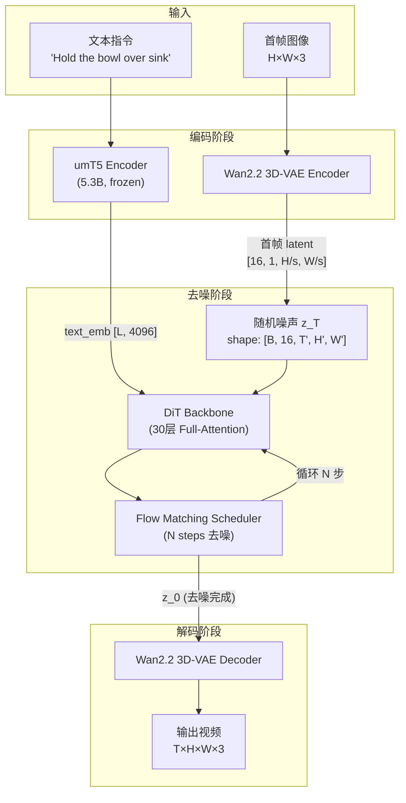
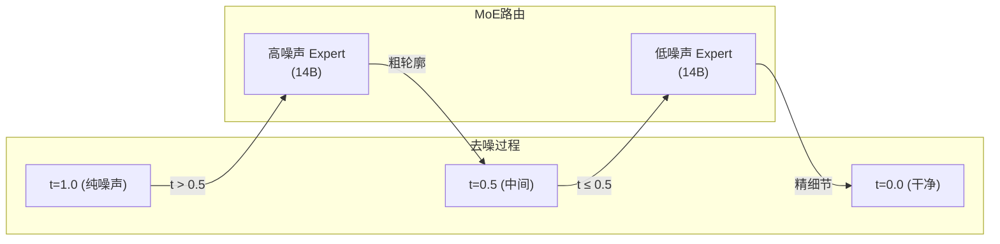

# Wan2.2 视频生成模型：整体架构与设计哲学

> fast-WAM 的 base model 是 Wan2.2-TI2V-5B——一个支持文本+图像→视频生成的 5B 参数扩散 Transformer。本章从全局视角拆解 Wan2.2 的设计哲学、pipeline 流程、和模型家族的演进。

## 知识链接

- 下一章：[Wan2.2 的 3D-VAE 与视频 Token 化](./02_Wan2.2的3D-VAE与视频Token化)
- [系列目录](./index)
- 相关阅读：本系列第 3 章会讲解 DiT + Flow Matching 的细节

---

## 1. 为什么要了解 Wan2.2？

fast-WAM 的核心架构是这样的：

Wan2.2 的 Video DiT 不是一个"被替换掉的旧模块"——它是 fast-WAM 训练和推理时**一直在运行的核心骨干**。Video Expert 的 30 层 Transformer 在每一步去噪中都参与计算，通过共享注意力层向 Action Expert 传递视觉物理信息。

因此，要理解 fast-WAM 的行为（为什么在某些场景下表现好、为什么对分辨率敏感、为什么视频生成有物理失真），必须先深入理解 Wan2.2 本身。

---

## 2. Wan 系列的演进

| 版本 | 发布时间 | 核心特点 |
|------|---------|---------|
| **Wan2.1** | 2025.02 | 首个完整发布。1.3B / 14B 参数双版本，支持 T2V / I2V / Video Editing 等 8 类任务。Apache 2.0 开源 |
| **Wan2.2** | 2025.07 | 引入 **MoE (Mixture-of-Experts)** 架构，高噪声/低噪声由不同 Expert 处理。新增 5B TI2V 模型（fast-WAM 使用的版本）。VAE 升级为 Wan2.2-VAE（压缩比 16×16×4） |

**Wan2.2 相比 2.1 的关键升级：**

1. **MoE 去噪架构**：将去噪过程按时间步分为两段，高噪声阶段和低噪声阶段分别由不同的 Expert 模型处理。这样总参数量增大但每一步的计算量不变
2. **Wan2.2-VAE**：空间压缩比从 8×8 升级到 16×16（配合时间 4× 压缩），使得生成更高分辨率的视频在计算上可行
3. **5B TI2V 模型**：一个同时支持 Text-to-Video 和 Image-to-Video 的统一模型，参数量 5B，可以在 4090 上运行

> **注意**：fast-WAM 使用的是 **Wan2.2-TI2V-5B**，即 5B 参数的 Text/Image-to-Video 版本。后面提到"Wan2.2"默认指这个版本。

---

## 3. Wan2.2 的完整推理 Pipeline

一次视频生成（以 Image-to-Video 为例）经过以下流程：

让我们逐步拆解每个组件的角色：

### 3.1 文本编码：umT5 (5.3B)

Wan2.2 使用一个 **frozen（冻结）的 umT5-XXL 编码器**（5.3B 参数）将文本指令转换为 embedding 序列。

- 输入：任意长度的文本字符串（支持中英文）
- 输出：`[seq_len, 4096]` 的 token embedding 序列
- 特点：**多语言**（umT5 = multilingual T5），且参数在整个训练过程中冻结不更新

为什么用 umT5 而不是 CLIP？因为 CLIP 的文本编码能力在长句和复杂指令上远不如 T5 系列。视频生成需要理解复杂的时序描述（"先拿起杯子，然后倒进碗里"），T5 在这方面更强。

### 3.2 图像/视频编码：Wan2.2 3D-VAE

将原始像素压缩到一个低维 latent 空间。具体架构在下一章详细拆解。这里先给出关键数字：

| 维度 | 压缩倍率 | 举例 |
|------|---------|------|
| 时间 T | **4×** | 21 帧 → (21-1)/4 + 1 = 6 个 latent 时间步 |
| 空间 H | **8×** (Wan2.1) / **16×** (Wan2.2-VAE) | 480px → 60 或 30 |
| 空间 W | 同上 | 832px → 104 或 52 |
| 通道 C | 压缩到 **16** 通道 | RGB 3通道 → 16 通道 latent |

> fast-WAM 实际使用的 VAE 是 Wan2.1 版（8×8×4 压缩），而非 Wan2.2 新版 VAE（16×16×4）。这是因为 fast-WAM 的开发基于更早的 checkpoint。

### 3.3 去噪骨干：DiT (Diffusion Transformer)

这是 Wan2.2 的核心——一个 **30 层的 Full-Attention Transformer**，对 latent token 序列做去噪。

**Wan2.2-TI2V-5B 的关键配置：**

| 参数 | 值 | 含义 |
|------|-----|------|
| 层数 | 30 | Transformer block 数量 |
| 隐藏维度 | 3072 | 每个 token 的 representation 大小 |
| 注意力头数 | 24 | Multi-Head Attention 的头数 |
| 每头维度 | 128 | 3072 / 24 = 128 |
| FFN 中间层 | ~14336 | ≈ 4.7 × 3072 |
| 文本维度 | 4096 | 来自 umT5 的 embedding 维度 |
| Latent 通道 | 16 | VAE 输出的通道数 |

> 5B 参数怎么来的：30 层 × 每层约 170M 参数（含 self-attn, cross-attn, FFN, norm）≈ 5.1B

每个 DiT block 的结构在第 3 章详细拆解。这里先建立直觉：它和标准 Vision Transformer 类似，但加了 **timestep conditioning（通过 AdaLN）** 和 **text cross-attention**。

### 3.4 Flow Matching Scheduler

Wan2.2 使用 **Flow Matching**（而非传统的 DDPM/DDIM）作为去噪调度器。

简单来说：
- 传统扩散模型：从 $x_T$（纯噪声）出发，经过 T 步去噪得到 $x_0$（干净数据）
- Flow Matching：定义一条从 $x_1$（噪声）到 $x_0$（数据）的**直线路径**，模型学习预测这条路径上的**速度场（velocity）**

具体的数学细节在第 3 章展开。这里需要知道的是：
- 推理时通常用 **20-50 步**采样
- 采样器选择（UniPC / DPM-Solver / Euler）对生成质量有影响
- 负向提示词（negative prompt）通过 **CFG (Classifier-Free Guidance)** 起作用

### 3.5 VAE 解码

最后一步：将去噪完成的 latent $z_0$ 通过 3D-VAE Decoder 重建回像素空间的视频。

---

## 4. T2V vs TI2V：两种生成模式

Wan2.2-5B 同时支持两种模式：

| 模式 | 输入 | 首帧处理 | 适用场景 |
|------|------|---------|---------|
| **T2V** (Text-to-Video) | 仅文本 | 无首帧，从纯噪声开始 | 从文字描述生成全新视频 |
| **TI2V** (Text+Image-to-Video) | 文本 + 首帧图像 | 首帧通过 VAE 编码后 concat 到 latent 中 | **fast-WAM 使用的模式**：给定当前观测图像，预测未来视频 |

**fast-WAM 为什么选 TI2V 模式？**

因为机器人控制的输入是"当前相机观测 + 语言指令"——这正好对应 TI2V 的"首帧图像 + 文本"。模型根据当前看到的场景和语言指令，预测接下来会发生什么（视频）以及该怎么做（动作）。

在 TI2V 模式中，首帧的处理方式是：
1. 首帧图像经 VAE Encoder 编码为 `[16, 1, H', W']` 的 latent
2. 这个首帧 latent 在时间维度上 concat 到噪声 latent 前面
3. DiT 在去噪过程中可以"看到"首帧的信息，从而保持生成视频与首帧的一致性

---

## 5. Wan2.2 的 MoE 架构（A14B 版本）

虽然 fast-WAM 使用的是 5B 版本（单 Expert），但了解 Wan2.2 的 MoE 设计有助于理解整个模型家族：

**设计直觉**：
- 去噪的前半段（高噪声→中等噪声）：模型需要确定**整体构图和运动方向**——这需要很强的语义理解能力
- 去噪的后半段（中等噪声→干净）：模型需要**填充纹理和细节**——这需要很强的视觉保真能力
- 让两个 Expert 各司其职，比一个模型"又管构图又管细节"效果更好

**5B 版本的简化**：fast-WAM 使用的 5B 版本是**单 Expert**（没有 MoE 路由），所有时间步共享同一套参数。这使得模型更简单、推理更快，但生成质量比 A14B 版低。

---

## 6. 参数规模对比

| 模型 | 参数量 | 架构 | 推理显存 | 生成速度 (5s 720P) |
|------|-------|------|---------|-------------------|
| Wan2.1-T2V-1.3B | 1.3B | 单 DiT | ~8GB | ~2 min (4090) |
| Wan2.1-T2V-14B | 14B | 单 DiT | ~40GB | ~10 min (A100) |
| **Wan2.2-TI2V-5B** | **5B** | **单 DiT** | **~16GB** | **~4 min (4090)** |
| Wan2.2-A14B | 14B×2 | MoE (双 Expert) | ~50GB | ~8 min (A100) |

fast-WAM 选择 5B 版本的原因：
1. 单卡 4090 可推理，便于快速迭代实验
2. 参数量适中，LoRA 微调成本可控
3. 支持 TI2V 模式（不是所有版本都支持）

---

## 7. Wan2.2 的训练数据与训练策略

虽然 Wan2.2 的训练细节没有完全公开，但从技术报告中可以知道：

### 7.1 数据规模

- 预训练数据：数亿级别的视频-文本对
- 数据清洗：多阶段过滤（分辨率/画质/运动幅度/美学评分）
- 支持的分辨率：训练时使用多分辨率策略（bucket training）

### 7.2 训练分辨率绑定

这是后面实验中一个**非常重要的发现**：

> Wan2.2 对**推理时的分辨率和帧数**非常敏感。它的效果基本只在训练时见过的分辨率/帧数组合下才好（如 1280×704, 121 帧）。换一个分辨率（如 640×352）效果就会严重劣化。

原因在于：
1. **3D RoPE 位置编码**是按照具体的 token 网格大小学习的——换分辨率意味着位置编码分布偏移
2. VAE 的训练也绑定了特定的空间分辨率
3. DiT 中 attention 的 pattern 是在特定序列长度下学习的

这个问题在第 9 章（瓶颈诊断）中会被实验反复验证。

---

## 8. 本章小结

| 组件 | 作用 | 关键数字 |
|------|------|---------|
| umT5 (5.3B) | 文本编码 | 输出 [L, 4096] |
| Wan2.2 3D-VAE | 视频 ↔ latent | 压缩比 4×8×8, 16 通道 |
| DiT Backbone (5B) | latent 去噪 | 30 层, hidden=3072, heads=24 |
| Flow Matching Scheduler | 控制去噪步骤 | 20-50 步 |

**对后续实验的影响：**
- Wan2.2 在通用视频上很强，但对**机器人第一视角视频**几乎是 OOD——因为训练数据中几乎没有这类场景
- 分辨率敏感性意味着 fast-WAM 的输入图像尺寸必须谨慎选择
- 5B 模型 + 1B Action Expert = 6B 总参数，仍可在单卡训练/推理

---

## 下章预告

下一章深入 Wan2.2 的 3D-VAE：它如何把一段视频压缩到 1/128 的大小？时间维度的 causal convolution 如何保证首帧可以独立编码？为什么 latent 通道数选 16？这些设计决策如何影响后续 fast-WAM 的训练？
