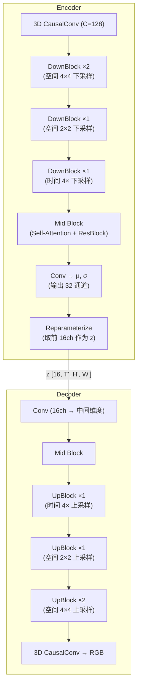

# Wan2.2 的 3D-VAE 与视频 Token 化

> 把一段 21 帧、480×832 的视频压缩到一个 [16, 6, 60, 104] 的 latent tensor——Wan-VAE 是怎么做到的？本章逐层拆解这个 3D Causal VAE 的架构、压缩策略、以及它对下游 fast-WAM 的影响。

## 知识链接

- 上一章：[Wan2.2 整体架构与设计哲学](./01_Wan2.2整体架构与设计哲学)
- 下一章：[Wan2.2 的 DiT 骨干与 Flow Matching](./03_Wan2.2的DiT骨干与FlowMatching)
- [系列目录](./index)

---

## 前情提要

上一章我们了解了 Wan2.2 的完整 pipeline：文本经 umT5 编码，视频经 3D-VAE 编码为 latent，DiT 在 latent 空间做去噪。本章深入第二个环节——3D-VAE 如何把视频压缩到极小的 latent 空间。

---

## 1. 为什么需要 VAE？直接在像素空间去噪不行吗？

一个 5 秒、24fps、720P 的视频：
- 原始像素：121 帧 × 720 × 1280 × 3 ≈ **333M 像素**
- 如果 DiT 直接处理像素 token，每个 patch 2×2×1，token 数 = 121 × 360 × 640 = **27.8M token**

这个序列长度对 Transformer 来说完全不可行（attention 的计算量是 $O(N^2)$）。

VAE 的作用是**大幅压缩**这个序列：
- 时间 4× 压缩：121 帧 → 31 个时间步
- 空间 8×8 压缩：720×1280 → 90×160
- token 数变为：31 × 90 × 160 ÷ (patch 2×2) ≈ **111K token**

再经过 DiT 的 patchify（patch_size=[1,2,2]），最终送进 Transformer 的序列长度变为可处理的范围。

---

## 2. Wan-VAE 的压缩比

Wan-VAE 有两个版本，对应不同的空间压缩比：

| 版本 | 时间压缩 | 空间压缩 | Latent 通道 | 总压缩比 |
|------|---------|---------|------------|---------|
| **Wan2.1-VAE** | 4× | 8×8 | 16 | 4×8×8 / 16ch = 每个像素压缩 ~10.7× |
| **Wan2.2-VAE** | 4× | 16×16 | 16 | 4×16×16 / 16ch = 每个像素压缩 ~42.7× |

> **fast-WAM 使用的是 Wan2.1-VAE**（8×8 空间压缩版本）。下面的分析以此为准。

### 2.1 Latent 形状的精确计算

给定输入视频 `[B, 3, T, H, W]`，经过 Wan2.1-VAE Encoder 后得到：

$$
z \in \mathbb{R}^{B \times 16 \times T' \times H' \times W'}
$$

其中：
- $T' = \lfloor(T - 1) / 4\rfloor + 1$（首帧特殊处理，见下文）
- $H' = H / 8$
- $W' = W / 8$

**具体数值例子**（fast-WAM 在 EgoVLA 上的典型设置）：

| 输入 | 值 | 计算 | Latent |
|------|-----|------|--------|
| 帧数 T | 21 | (21-1)/4 + 1 | T' = 6 |
| 高度 H | 480 | 480/8 | H' = 60 |
| 宽度 W | 832 | 832/8 | W' = 104 |
| 通道 | 3 (RGB) | → 16 | C = 16 |

最终 latent shape = `[B, 16, 6, 60, 104]`

**token 数量**（经 DiT patchify 后，patch_size=[1,2,2]）：
- $N_{tokens} = T' \times (H'/2) \times (W'/2) = 6 \times 30 \times 52 = 9360$

这个序列长度对 Transformer 来说完全可以处理。

### 2.2 为什么首帧的时间压缩是特殊的？

注意公式 $T' = (T-1)/4 + 1$——这里 **+1** 意味着首帧总是被独立保留一个时间步。

原因：Wan-VAE 使用 **causal temporal convolution**，确保：
1. 首帧可以独立编码/解码（不需要看"未来"帧）
2. 这使得 TI2V 模式可以**单独编码首帧**，然后 concat 到噪声 latent 中

如果用非 causal 的 conv3d，首帧的编码就会依赖后续帧，破坏 Image-to-Video 模式的可用性。

---

## 3. Wan-VAE 的网络结构

### 3.1 整体架构

Wan-VAE 采用经典的 **Encoder-Decoder 对称结构**，但将标准的 2D Conv 替换为 **3D Causal Conv**：



### 3.2 3D Causal Convolution

普通的 3D Conv `kernel=[3,3,3]` 在时间维度上会同时看过去和未来帧。Causal Conv 通过 **padding 策略** 确保只看当前帧和过去帧：

```python
# 普通 Conv3D: padding = [1, 1, 1]  → 看 t-1, t, t+1
# Causal Conv3D: padding = [2, 1, 1] (时间维度只在左侧 pad)  → 只看 t-2, t-1, t

class CausalConv3d(nn.Module):
    def __init__(self, in_channels, out_channels, kernel_size=3):
        super().__init__()
        # 时间维度: kernel=3, 左 pad=2, 右 pad=0 → causal
        # 空间维度: kernel=3, 左右各 pad=1 → 对称
        self.temporal_pad = kernel_size - 1  # = 2
        self.conv = nn.Conv3d(
            in_channels, out_channels, 
            kernel_size=(kernel_size, kernel_size, kernel_size),
            padding=(0, 1, 1)  # 时间维度不 pad（手动前面 pad）
        )
    
    def forward(self, x):
        # x: [B, C, T, H, W]
        # 时间维度左侧 pad 2 帧
        x = F.pad(x, (0, 0, 0, 0, self.temporal_pad, 0))
        return self.conv(x)
```

> **为什么需要 causal？** 因为 TI2V 模式下，首帧的编码必须独立于后续帧。Causal conv 保证了 $z[:, :, 0, :, :]$（首帧 latent）只依赖第一帧像素。

### 3.3 时间下采样策略

时间维度的 4× 下采样不是一步完成的，而是通过一个 DownBlock 实现：

```python
# 时间下采样：stride=(4, 1, 1)
# 但首帧需要保留 → 实际实现是：
# 1. 首帧单独通过（不参与时间下采样）
# 2. 后续帧 (T-1) 帧做 stride=4 的 conv
# 3. 结果 concat 回去

# 所以 T=21 → T'=1 + (21-1)/4 = 1 + 5 = 6
```

### 3.4 空间下采样策略

空间的 8× 下采样通过 3 个 DownBlock 逐步实现：
- DownBlock 1: stride=(1,2,2) → 空间 2× 下采样
- DownBlock 2: stride=(1,2,2) → 空间 2× 下采样
- DownBlock 3: stride=(1,2,2) → 空间 2× 下采样
- 总计：2×2×2 = **8× 空间下采样**

每个 DownBlock 包含若干个 ResBlock + 一个 stride conv：

```python
class DownBlock(nn.Module):
    def __init__(self, in_ch, out_ch, num_res_blocks=2, 
                 temporal_stride=1, spatial_stride=2):
        self.res_blocks = nn.ModuleList([
            ResBlock3D(in_ch if i==0 else out_ch, out_ch)
            for i in range(num_res_blocks)
        ])
        self.downsample = CausalConv3d(
            out_ch, out_ch, 
            stride=(temporal_stride, spatial_stride, spatial_stride)
        )
```

### 3.5 Normalization：RMSNorm 替代 GroupNorm

Wan-VAE 的一个创新是用 **RMSNorm** 替代传统 VAE 中的 GroupNorm：

$$
\text{RMSNorm}(x) = \frac{x}{\sqrt{\frac{1}{d}\sum_{i=1}^{d} x_i^2 + \epsilon}} \cdot \gamma
$$

> **一句话**：RMSNorm 只做缩放归一化（不减均值），计算量比 LayerNorm/GroupNorm 更小，且在视频生成中表现更稳定。

原因：GroupNorm 在 3D tensor 上的 group 划分不够自然（视频的通道间关系和图像不同），RMSNorm 更简洁且不依赖 batch 统计。

---

## 4. Latent 空间的特性

### 4.1 为什么通道数选 16？

Wan-VAE 的 Encoder 输出 32 通道（μ 和 σ 各 16），reparameterize 后取 16 通道的 z：

$$
z = \mu + \sigma \cdot \epsilon, \quad \epsilon \sim \mathcal{N}(0, I)
$$

选 16 通道是 capacity 和效率的权衡：
- 太少（如 4 通道，Stable Diffusion 用的）：latent 信息容量不够，重建质量差
- 太多（如 32 通道）：DiT 需要处理的通道数过多，计算量增大
- 16 通道被实验验证为视频生成中的甜蜜点

### 4.2 Latent 的数值范围

训练时 latent 大致分布在 `[-1, 1]` 范围（经过适当 scaling）。Flow Matching 的噪声也是标准正态分布。两者的数值范围匹配是训练稳定的前提。

### 4.3 DiT 的 Patchify

VAE 输出 latent `[B, 16, T', H', W']` 后，DiT 不是直接把每个空间位置当 token。而是再做一次 **patchify**（类似 ViT）：

```python
# patch_size = [1, 2, 2] (时间不再压缩，空间再 2×2)
# 输入: [B, 16, 6, 60, 104]
# patchify 后 token 数: 6 × 30 × 52 = 9360
# 每个 token 维度: 16 × 1 × 2 × 2 = 64
# Linear projection: 64 → 3072 (hidden_dim)
```

最终送进 DiT Transformer 的序列：`[B, 9360, 3072]`

---

## 5. VAE 与 fast-WAM 实验的关系

### 5.1 分辨率敏感性的根源

实验中发现 Wan2.2 在 640×352 分辨率下生成质量严重劣化。原因之一在 VAE：

- VAE 训练时主要使用 1280×704 的视频
- 640×352 经过 VAE 后的 latent 大小为 `[16, T', 44, 80]`
- DiT 的 RoPE 位置编码是按 `[T', 90, 160]`（1280×704 对应的 latent 网格）学习的
- 换分辨率后位置编码分布偏移 → 注意力 pattern 紊乱

### 5.2 对 fast-WAM 输入图像尺寸的限制

fast-WAM 在 EgoVLA 上使用 384×384 的输入图像（1 相机）。经 VAE：
- latent = `[16, 1, 48, 48]`（首帧，TI2V 模式）
- 这个 48×48 的 latent 网格和 Wan2.2 训练时常见的 90×160 差异很大
- **这可能是视频生成质量不佳的原因之一**

### 5.3 VAE 重建误差

VAE 不是无损压缩。编码→解码过程中存在重建误差，尤其在：
- 高频细节（文字、小物体边缘）
- 快速运动场景

对 fast-WAM 来说，这意味着即使 DiT 完美预测了 latent，经 VAE 解码后的视频也可能丢失一些操作细节。不过 fast-WAM 推理时不需要解码视频（只跑 Action Expert），所以这个问题主要影响训练时的视频 loss 信号质量。

---

## 6. 与其他视频 VAE 的对比

| 模型 | VAE 类型 | 时间压缩 | 空间压缩 | 通道 | 特点 |
|------|---------|---------|---------|------|------|
| **Wan2.1-VAE** | 3D Causal | 4× | 8×8 | 16 | Causal, RMSNorm |
| **Wan2.2-VAE** | 3D Causal | 4× | 16×16 | 16 | 更强压缩 |
| CogVideoX-VAE | 3D | 4× | 8×8 | 16 | 类似 Wan2.1 |
| OpenSora-VAE | 3D Causal | 4× | 8×8 | 4 | 通道少 |
| SD3 VAE | 2D | - | 8×8 | 16 | 仅图像 |

Wan-VAE 的优势：
1. **Causal**：支持流式编码，首帧独立——对 TI2V 模式至关重要
2. **16 通道**：信息容量充足，重建质量好
3. **任意长度**：理论上支持无限长视频编码（RNN-like 的 causal 性质）

---

## 7. 本章小结

| 问题 | 答案 |
|------|------|
| VAE 的压缩比是多少？ | 时间 4×，空间 8×8，通道 3→16 |
| 21 帧 480×832 的视频变成什么？ | `[16, 6, 60, 104]` 的 latent |
| 为什么用 causal conv？ | 让首帧可以独立编码（TI2V 模式需要） |
| 为什么对分辨率敏感？ | VAE + RoPE 都绑定训练分辨率 |
| DiT 最终处理多长的序列？ | patchify 后约 9360 token（上述例子） |

---

## 下章预告

下一章进入 Wan2.2 的核心——30 层 DiT 骨干：每一层的 AdaLN-Zero 如何注入时间步信息？3D RoPE 如何编码时空位置？Text Cross-Attention 怎么让文本指令"影响"视频生成？Flow Matching 的训练目标是什么？
