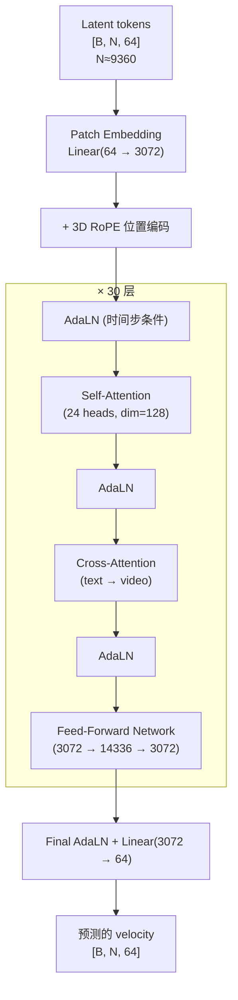

# Wan2.2 的 DiT 骨干与 Flow Matching

> DiT 每一层在做什么？时间步条件如何注入？文本指令如何影响去噪？Flow Matching 的训练目标和传统扩散模型有什么区别？本章逐层拆解 Wan2.2 的 5B 参数 Transformer 骨干和它的训练/推理机制。

## 知识链接

- 上一章：[Wan2.2 的 3D-VAE 与视频 Token 化](./02_Wan2.2的3D-VAE与视频Token化)
- 下一章：[Wan2.2 在机器人场景的适配](./04_Wan2.2机器人场景适配)
- 前置知识：[Flow Matching 与连续归一化流](/前置知识/000g_前置知识_Flow_Matching与连续归一化流)
- 前置知识：[AdaLayerNorm 条件化归一化](/前置知识/001f_前置知识_AdaLayerNorm条件化归一化)
- 前置知识：[Cross-Attention 与交替注意力机制](/前置知识/001e_前置知识_Cross_Attention与交替注意力机制)
- [系列目录](./index)

---

## 前情提要

上一章我们知道了 VAE 将视频压缩为 `[16, T', H', W']` 的 latent，经 patchify 后变为约 9360 个 token 的序列送入 DiT。本章深入 DiT 内部——这 30 层 Transformer 具体是怎么处理这些 token 的。

---

## 1. DiT 的全局结构

Wan2.2 的 DiT（Diffusion Transformer）整体结构如下：



每一层的处理流程是：**AdaLN → Self-Attention → AdaLN → Cross-Attention → AdaLN → FFN**

---

## 2. 逐组件拆解

### 2.1 Patch Embedding：从 latent patch 到 token

VAE 输出的 latent `[B, 16, T', H', W']` 先被 reshape 成 patch 序列：

```python
# patch_size = [1, 2, 2]
# 每个 patch: 16通道 × 1帧 × 2像素 × 2像素 = 64 维
# patch 数: T' × (H'/2) × (W'/2)

# 然后通过一个 Linear 投影到 hidden_dim
x = rearrange(latent, 'b c t (h p1) (w p2) -> b (t h w) (c p1 p2)', p1=2, p2=2)
# x: [B, N, 64]

x = self.patch_embed(x)  # Linear(64, 3072)
# x: [B, N, 3072]
```

### 2.2 3D RoPE 位置编码

DiT 不使用可学习的位置编码，而是用 **RoPE (Rotary Position Embedding)** 的 3D 扩展版本。

标准 RoPE（用于 1D 文本序列）把 token 位置信息编码进 attention 的 Q 和 K 中。3D RoPE 同时编码三个维度的位置：时间 t、高度 h、宽度 w。

```python
# 每个 token 有一个 3D 坐标 (t, h, w)
# 将 hidden_dim=3072 分成三组（或按比例分配）给 t/h/w
# 每组内部做标准 RoPE 旋转

def get_3d_rope(positions_thw, dim, freqs):
    """
    positions_thw: [N, 3]  每个token的(t,h,w)坐标
    对 Q 和 K 应用旋转：
      Q' = Q * cos(θ) + rotate(Q) * sin(θ)
      K' = K * cos(θ) + rotate(K) * sin(θ)
    其中 θ 由位置坐标决定
    """
    ...
```

**为什么 3D RoPE 导致分辨率敏感？**

RoPE 的频率是固定的——训练时模型在特定的 (T', H', W') 网格上学习了位置的相对关系。换分辨率后：
- H', W' 改变 → token 的 h/w 坐标范围改变
- RoPE 编码出"训练时没见过的位置组合"
- 注意力 pattern 因此紊乱

这就是为什么 Wan2.2 在非训练分辨率下效果严重劣化的核心原因。

### 2.3 AdaLN-Zero：时间步条件注入

每个 DiT block 需要知道"当前去噪到了哪一步"——即时间步 $t \in [0, 1]$（Flow Matching 中 t=1 是纯噪声，t=0 是干净数据）。

**AdaLN（Adaptive Layer Normalization）** 的做法是：

$$
\text{AdaLN}(x, t) = \gamma(t) \cdot \text{LayerNorm}(x) + \beta(t)
$$

其中 $\gamma(t)$ 和 $\beta(t)$ 是由时间步 embedding 通过 MLP 生成的**逐通道缩放和偏移**：

```python
class AdaLNZero(nn.Module):
    def __init__(self, hidden_dim, cond_dim):
        self.norm = nn.LayerNorm(hidden_dim, elementwise_affine=False)
        # 从时间步 embedding 生成 6 个参数: γ1, β1, α1, γ2, β2, α2
        self.adaLN_modulation = nn.Sequential(
            nn.SiLU(),
            nn.Linear(cond_dim, 6 * hidden_dim)
        )
    
    def forward(self, x, cond):
        # cond: 时间步的 embedding [B, cond_dim]
        shift, scale, gate = self.adaLN_modulation(cond).chunk(6, dim=-1)
        # ... 将 shift/scale 应用到 LayerNorm 后的 x
        # gate 用于 "zero-init"：训练初期输出接近 0
```

> **一句话直觉**：AdaLN 让模型在去噪早期（高噪声）和后期（低噪声）的行为不同——早期更注重"画大轮廓"，后期更注重"填细节"。时间步条件通过 AdaLN 告诉每一层"现在是哪个阶段"。

**AdaLN-Zero 的 "Zero" 是什么意思？**

初始化时让 gate 参数接近 0，使得训练初期每层的 residual 贡献接近零——网络初期几乎是恒等映射。这大大提升了深层 DiT 的训练稳定性。

### 2.4 Self-Attention：全局时空信息交互

Wan2.2 使用 **Full Attention**——所有 N 个 token 之间都可以互相 attend（没有局部窗口限制）：

```python
# Q, K, V: [B, N, 24, 128]  (24 heads, 每头 128 维)
# 注意力矩阵: [B, 24, N, N]  ← 对于 N=9360 这是个很大的矩阵！
# 实际用 FlashAttention 加速

attn = torch.bmm(Q, K.transpose(-1, -2)) / sqrt(128)
attn = softmax(attn)
out = torch.bmm(attn, V)
```

**为什么用 Full Attention 而不是窗口注意力？**

视频中远距离的时空位置经常有语义联系（比如"手在左边拿起物体"→"物体出现在右边"），局部窗口无法捕捉这种跨区域关联。Full Attention 虽然计算量大（$O(N^2)$），但让模型能学到任意距离的依赖关系。

### 2.5 Cross-Attention：文本条件注入

Self-Attention 之后，是一层 **Text-to-Video Cross-Attention**：

```python
# Q: 来自 video tokens [B, N, 3072] → [B, N, 24, 128]
# K, V: 来自 text tokens [B, L, 4096] → [B, L, 24, 128]
#   L = 文本序列长度
#   注意 text_dim=4096 ≠ hidden_dim=3072，所以 K/V 有单独的投影层

Q_video = self.q_proj(video_tokens)     # [B, N, 3072]
K_text = self.k_proj(text_tokens)       # [B, L, 3072]
V_text = self.v_proj(text_tokens)       # [B, L, 3072]

# 注意力: video token 作为 query "去问" text token
# → 每个 video token 都能获取和自己最相关的文本语义信息
attn = softmax(Q_video @ K_text.T / sqrt(d))
out = attn @ V_text  # [B, N, 3072]
```

> **作用**：Cross-Attention 是让文本指令"影响"视频生成的核心机制。比如文本说"拿起红色杯子"，通过 cross-attention，和"红色"/"杯子"相关的 text token 的信息会被注入到视频 latent 中对应位置的 token 里。

### 2.6 Feed-Forward Network (FFN)

标准的两层 MLP + 激活函数：

```python
class FFN(nn.Module):
    def __init__(self, hidden_dim=3072, ffn_dim=14336):
        self.fc1 = nn.Linear(3072, 14336)
        self.act = nn.GELU()
        self.fc2 = nn.Linear(14336, 3072)
    
    def forward(self, x):
        return self.fc2(self.act(self.fc1(x)))
```

FFN 提供**逐 token 的非线性变换**——Self-Attention 做 token 间信息混合，FFN 做 token 内特征变换。

---

## 3. Flow Matching 训练

### 3.1 和传统 DDPM 的区别

传统 DDPM 的前向过程是加高斯噪声：$x_t = \sqrt{\bar\alpha_t} x_0 + \sqrt{1-\bar\alpha_t} \epsilon$

**Flow Matching 的前向过程是线性插值**：

$$
x_t = (1 - t) \cdot x_0 + t \cdot \epsilon, \quad \epsilon \sim \mathcal{N}(0, I), \quad t \in [0, 1]
$$

> **一句话**：从数据 $x_0$ 出发，沿直线走向随机噪声 $\epsilon$，走到比例 $t$ 的位置就是 $x_t$。

**模型的训练目标是预测"速度场"（velocity）**：

$$
v_\theta(x_t, t) \approx \epsilon - x_0
$$

也就是说，模型需要预测从当前位置 $x_t$ 到目标 $x_0$ 的方向。

### 3.2 训练流程伪代码

```python
def train_step(model, x_0, text_emb):
    """
    x_0: 干净的 video latent [B, 16, T', H', W']
    text_emb: umT5 编码的文本 [B, L, 4096]
    """
    # 1. 采样随机噪声
    epsilon = torch.randn_like(x_0)
    
    # 2. 采样时间步 t ∈ [0, 1]
    t = torch.rand(B)  # 每个样本一个 t
    
    # 3. 构造 x_t = (1-t)*x_0 + t*epsilon （线性插值）
    t_expand = t[:, None, None, None, None]
    x_t = (1 - t_expand) * x_0 + t_expand * epsilon
    
    # 4. 模型预测 velocity
    v_pred = model(x_t, t, text_emb)  # DiT 前向传播
    
    # 5. 计算 loss: 预测 velocity 和真实 velocity 的 MSE
    v_target = epsilon - x_0  # 真实的 velocity
    loss = F.mse_loss(v_pred, v_target)
    
    return loss
```

### 3.3 推理（采样）流程

推理时从纯噪声 $x_1 = \epsilon$ 出发，用 ODE solver 逐步积分到 $x_0$：

```python
def sample(model, text_emb, first_frame_latent, num_steps=20):
    """
    从纯噪声出发，逐步去噪得到视频 latent
    """
    # 初始化：纯噪声
    x = torch.randn(shape)  # [B, 16, T', H', W']
    
    # 首帧 concat（TI2V 模式）
    x[:, :, 0] = first_frame_latent  # 首帧位置用真实 latent
    
    # 等间距时间步: 1.0, 0.95, 0.90, ..., 0.05, 0.0
    timesteps = torch.linspace(1.0, 0.0, num_steps + 1)
    
    for i in range(num_steps):
        t = timesteps[i]
        dt = timesteps[i+1] - timesteps[i]  # 负值
        
        # 模型预测当前时间步的 velocity
        v = model(x, t, text_emb)
        
        # Euler step: x_{t+dt} = x_t + v * dt
        x = x + v * dt
    
    return x  # 最终的干净 latent x_0
```

实际中通常不用简单 Euler，而用更高阶的求解器（UniPC / DPM-Solver），只需 20 步就能得到高质量结果。

### 3.4 CFG (Classifier-Free Guidance)

推理时用 **CFG** 增强文本对生成的控制力：

$$
v_{guided} = v_{uncond} + w \cdot (v_{cond} - v_{uncond})
$$

- $v_{cond}$：给定文本条件下的 velocity 预测
- $v_{uncond}$：不给文本（或给空文本）时的预测
- $w$：guidance scale（通常 5-7），越大文本控制力越强

**代价**：每一步需要跑两次模型（一次有文本一次无文本），推理时间翻倍。

---

## 4. 采样器选择对生成质量的影响

周报实验中发现 fast-WAM 和 diffsynth-studio 的推理结果有差异，其中一个原因就是**采样器不同**。

| 采样器 | 步数 | 特点 |
|--------|------|------|
| Euler | 20-50 | 最简单，质量一般 |
| DPM-Solver++ | 20 | 快速高阶求解，常用 |
| **UniPC** | 20 | Wan2.2 推荐，统一预测-校正框架 |

实验中发现切换采样器后视频质量有明显变化——说明 Wan2.2 对采样策略比较敏感。

---

## 5. 负向提示词的作用与副作用

Wan2.2 支持负向提示词（negative prompt），通过 CFG 机制"远离"不想要的特征。

**在通用视频场景**：负向提示词（如"低质量、模糊"）能有效提升画面质量。

**在机器人第一视角场景**：实验发现**有负向提示词时结果严重不合理**，去掉后反而更好。

为什么？推测原因：
- 机器人场景的视觉特征（低分辨率、固定相机角度、简单场景）和通用"高质量视频"的特征差距很大
- CFG 引导模型"远离低质量"的同时，可能也把模型推离了"机器人场景"这个分布
- 没有负向提示词时，模型只有 $v_{cond}$，不做 guidance，生成更贴近训练分布

---

## 6. 从 DiT 架构看 fast-WAM 的改造

了解了完整 DiT 后，fast-WAM 的 MoT (Mixture-of-Transformers) 改造就清楚了：

| Wan2.2 原始 DiT | fast-WAM MoT |
|-----------------|--------------|
| Self-Attention 只有 video token 参与 | Self-Attention 中 video + action token **concat 后共同参与** |
| Cross-Attention 只对 video 注入文本 | Cross-Attention 对 video 和 action **分别**注入文本 |
| FFN 只有 video 的 | 增加一套独立的 Action FFN (hidden=1024) |
| 输出 = 预测 video velocity | 输出 = video velocity + action velocity |

关键洞察：Action Expert（1B 参数）通过**共享 Self-Attention 层**"看到"了 Video Expert（5B）的内部表示——这就是视频物理先验向动作预测流动的通道。

---

## 7. 本章小结

| 组件 | 作用 | 参数量估计 |
|------|------|-----------|
| Patch Embed | latent patch → 3072 维 token | ~200K |
| 3D RoPE | 编码时空位置（不增加参数） | 0 |
| AdaLN-Zero × 30 | 注入时间步条件 | ~560M |
| Self-Attention × 30 | token 间全局信息交互 | ~1.7B |
| Cross-Attention × 30 | 注入文本语义 | ~1.1B |
| FFN × 30 | 逐 token 非线性变换 | ~2.6B |
| Final head | 输出 velocity | ~200K |
| **总计** | | **~5.1B** |

---

## 下章预告

理论讲完了——下一章进入实战：Wan2.2 在机器人第一视角视频上的实际表现如何？LoRA 微调用的什么数据、什么配置？fast-WAM 框架调用 Wan2.2 时遇到了哪些推理差异？如何一步步排查对齐？
