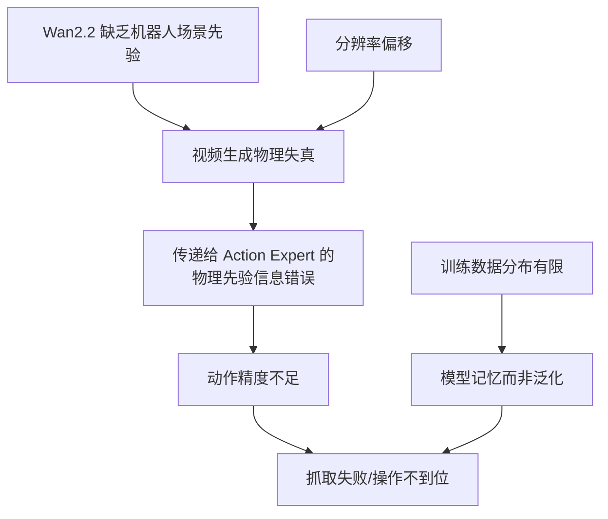

# 瓶颈诊断：视频生成质量、物理失真与空间泛化

> 前面排除了数据配比、state shortcut、历史帧等因素后，矛头指向视频生成质量本身。本章通过推理时的视频可视化、Wan2.2 原模型的 OOD 验证、分辨率消融、以及空间泛化测试，全面诊断当前 fast-WAM 的核心瓶颈。

## 知识链接

- 上一章：[State Drop 与 History：排除 Shortcut 假设](./08_StateDrop与History实验)
- 下一章：[优化探索：Video Pretrain、A2V、光流 Condition](./10_优化探索)
- [系列目录](./index)

---

## 前情提要

前三章消融实验排除了数据配比、state shortcut、历史帧等方向。问题收敛到一个核心假设：**fast-WAM 的视频生成质量不够好，无法为动作预测提供有效的物理先验。** 本章用实验验证这一假设。

---

## 1. 推理时视频可视化

### 1.1 实验方法

在 fast-WAM 闭环推理时，不仅记录输出的 action，还**同步保存模型内部生成的视频**（从 video latent 通过 VAE 解码回像素）。

### 1.2 观察到的问题

生成视频存在严重的**物理失真**：

| 失真类型 | 具体表现 |
|---------|---------|
| 手部扭曲 | 手指数量异常、关节位置不合理 |
| 物体变形 | 物体在视频中逐帧扭曲变形 |
| 物体消失 | 前一帧还在的物体突然消失 |
| 穿模 | 手穿过物体或桌面 |
| 运动不连续 | 相邻帧间物体位置跳变 |

### 1.3 这意味着什么？

fast-WAM 的设计理念是"视频分支学习物理规律 → 通过共享注意力传递给动作分支"。如果视频生成的结果本身就**违反物理规律**（物体消失、手扭曲），那传递给动作分支的信息就是**错误的物理先验**——动作精度自然不好。

---

## 2. Wan2.2 原模型在 EgoVLA 数据上的验证

### 2.1 直接用 Wan2.2 生成 EgoVLA 场景视频

测试 prompt: `"A video recorded from a robot's point of view executing the following instruction: Turn the fallen mug upright"`

| 条件 | 结果 |
|------|------|
| Wan2.2 原始参数 + EgoVLA 首帧 | **完全不可用**，生成画面和机器人操控无关 |
| Wan2.2 微调后 + EgoVLA 首帧 | 整体趋势正确，但存在物体变形和扭曲 |

结论：**EgoVLA 的仿真数据对 Wan2.2 几乎是完全 OOD**。即使用 VITRA ego4d 数据做过 LoRA 微调，Wan2.2 在仿真机器人场景上仍然没有有效的先验。

### 2.2 为什么 ego4d 微调后仍然不够？

ego4d 是**人类**第一视角的厨房操作视频——而 EgoVLA 是**仿真机器人**的第一视角。两者的视觉差异：

| 特征 | ego4d（真实人类）| EgoVLA（仿真机器人）|
|------|----------------|-------------------|
| 手 | 人类皮肤质感的手 | 金属/塑料质感的机械手 |
| 背景 | 真实厨房，复杂纹理 | 仿真环境，简单纹理 |
| 光照 | 自然光 | 均匀渲染光 |
| 运动模式 | 人类自然运动 | 机器人离散控制步 |

虽然都是"第一视角操控"，但视觉分布差异巨大。

---

## 3. 分辨率敏感性验证

### 3.1 实验设计

用 Wan2.2 原模型（通用视频能力正常）在不同分辨率下生成同一个 prompt 的视频：

| 分辨率 | 帧数 | 结果 |
|--------|------|------|
| 1280×704 | 121f | ✓ 高质量、运动流畅 |
| 1280×704 | 93f | ✓ 高质量 |
| 1280×704 | 9f | ✓ 基本正常 |
| 960×960 | 93f | ○ 可接受，略有质量下降 |
| **640×352** | 93f | **✗ 严重劣化**，画面模糊、运动异常 |

### 3.2 对 fast-WAM 的影响

fast-WAM 使用的输入分辨率是 **384×384**——这个分辨率经 VAE 后的 latent 网格为 48×48，和 Wan2.2 训练时的 1280×704 (latent 90×160) 差异巨大。

> 这意味着 Wan2.2 在 fast-WAM 的工作分辨率下，**位置编码分布严重偏移**，attention pattern 和训练时完全不同——这可能是视频生成质量差的重要原因之一。

### 3.3 即使用最佳分辨率...

即使强制使用 1280×704（Wan2.2 的最佳分辨率）来生成 EgoVLA 场景的视频：

> 结果仍然不合理——无法产生有意义的机器人操控视频。

这进一步证明：问题不仅是分辨率，更根本的是 **Wan2.2 缺乏机器人操控场景的物理先验**。

---

## 4. 空间泛化能力测试

### 4.1 实验设计

在标准闭环测试中，物体初始位置从一个固定分布中采样。为了测试模型的空间泛化能力，将物体分布范围在 **y 方向扩大 2 倍**，观察成功率变化。

用颜色编码结果：
- 🟢 绿色/蓝色 = 任务成功的初始位置
- 🔴 红色/黄色 = 任务失败的初始位置

### 4.2 结果

| 任务 | 标准分布成功率 | 扩展分布（2×）成功率 | 下降幅度 |
|------|--------------|-------------------|---------|
| Stack-Can (Sort-Cans) | 77% | **48%** | -29% |
| Flip-Mug | 70% | **37%** | -33% |

### 4.3 分析

成功率下降了约 30%——说明模型的泛化能力非常有限：

- 在训练数据分布内的位置，模型通过"记忆"可以完成任务
- 一旦物体位置超出训练分布（即使只是在 y 方向扩展 2 倍这种小幅度变化），成功率就骤降
- 失败位置（红色）主要分布在训练分布的**边缘和外部**

这进一步说明模型**没有学到真正可泛化的空间操控能力**，而是在"记忆训练分布"。

---

## 5. 根因总结

综合以上所有诊断实验，fast-WAM 当前瓶颈的根因：

**两个核心问题：**

1. **视频先验不足**：Wan2.2 没有机器人操控的物理知识，生成的视频违反物理规律，导致动作分支收到错误信号
2. **泛化能力差**：模型在训练分布内靠"记忆"完成任务，稍微偏离分布就失败

### 推测的更深层原因

模型可能更多依赖**首帧和数据集先验来拟合训练分布**，而不是学到可泛化的"物理/动作条件动态"：
- **文本描述粗糙**：一句话的任务描述无法提供足够精确的条件信息
- **成功数据包含的物理规律分布太窄**：有限的训练 episode 无法覆盖所有物理场景

---

## 6. 本章小结

| 诊断实验 | 结论 |
|---------|------|
| 推理视频可视化 | 严重物理失真（手扭曲、物体消失） |
| Wan2.2 原模型在 EgoVLA 上测试 | 完全 OOD，即使最佳分辨率也不行 |
| 分辨率消融 | 384×384 偏离训练分辨率 + 本质 OOD 叠加 |
| 空间泛化测试 | y 方向 2× 扩展后成功率降 30% |
| **核心结论** | **视频先验不足 + 泛化靠记忆** → 需要引入更强的物理先验 |

---

## 下章预告

诊断完问题后，下一章记录一系列优化尝试：用仿真 rollout 视频做 pretrain、让 action token 在训练时可见于 video（a2v）、用光流作为代理 action 提供条件、以及修正任务文本描述——这些方法能解决问题吗？
