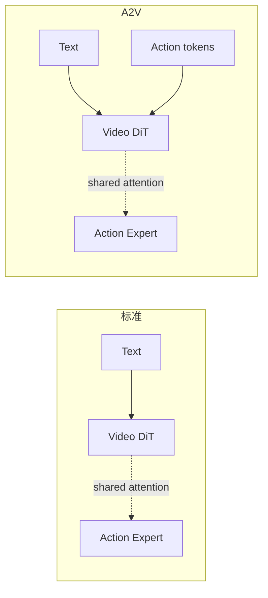

# 优化探索：Video Pretrain、A2V、光流 Condition

> 确认了"视频先验不足"是核心瓶颈后，尝试了多个方向来改善：用仿真 rollout 视频做 pretrain、模仿 giga-policy 让 video 在训练时看到 action token、用光流代理 action 提供条件、修正任务文本描述。本章记录所有尝试及其效果。

## 知识链接

- 上一章：[瓶颈诊断：视频生成质量、物理失真与空间泛化](./09_瓶颈诊断)
- 下一章：[70D 统一手部动作空间：设计、可逆映射与验证](./11_70D统一动作空间)
- [系列目录](./index)

---

## 前情提要

瓶颈已经明确：Wan2.2 在机器人场景缺乏物理先验 → 视频生成失真 → 动作预测不准。本章是所有"尝试给模型补充先验"的实验记录。

---

## 1. 任务文本描述修正

### 1.1 动机

原始任务描述中存在错误或模糊，可能导致模型对"该做什么"理解不一致：

| 原始描述 | 修正后 |
|---------|--------|
| Open the drawer, and Put can on the saucer | Put the can on the saucer in the cabinet, then close the cabinet |
| Flip the mug | Turn the fallen mug upright |
| Insert the left can into the slot and insert the right can into the slot, unload the left cans andd then unload the right cans | Insert the left can into the box, insert the right can into the box, then unload the left can and the right can |
| pour balls in cup into bowl | Pour the balls from the cup into the bowl |
| push box to the marker | Push the box to the center of the red marker |

### 1.2 只训练单动作任务

为了排除**多步任务描述歧义**的影响，仅选取 6 个单一动作的短任务训练：
- Close-Drawer, Flip-Mug, Open-Drawer, Open-Laptop, Push-Box, Stack-Can

结果：**成功率在这 6 个任务上与全量训练没有显著差距**，视频生成仍存在物理失真。

结论：文本歧义不是根本原因——即使只学一个简单动作，视频生成的物理质量也不够好。

---

## 2. 仿真 Rollout 视频 Pretrain

### 2.1 动机

如果 Wan2.2 缺乏机器人场景的先验，能否先用**已有的仿真闭环 rollout 视频**做一次 pretrain——让模型先"看到"大量正确的机器人操控视频，建立基本的视频生成能力，再训练 action 预测？

### 2.2 方法

1. 收集之前闭环评估时录制的视频（含成功和失败的 rollout）
2. 只训练 video loss（不训练 action），让 DiT 学会生成 EgoVLA 风格的视频
3. 训练完成后，加回 action branch 继续联合训练

### 2.3 结果

> **在 eval 的 rollout 视频上 pretrain，并没有学习到优秀的视频生成能力。**

pretrain 后的视频生成依然存在物理失真。可能原因：
- rollout 视频的数量和多样性不够（只有评估时录的有限视频）
- 仿真环境的渲染质量本身就不高
- LoRA 微调的表达能力有限

### 2.4 Pretrain → 微调效果

基于 pretrain checkpoint 继续训练 action+video：

| 方法 | 短任务 Mean | 长任务 Mean |
|------|------------|------------|
| 直接训练（baseline） | ~62% | ~1% |
| Pretrain → 微调 | 无显著提升 | 无显著提升 |

原因推测：pretrain 阶段学到的视频能力本身就不够好，没有建立有效的物理先验。

---

## 3. Action-to-Video (A2V)：模仿 Giga-Policy

### 3.1 动机

Giga-Policy 的做法是：训练时让视频生成分支能**看到 action token**，这样 video 的条件更充分（文本 + action 双重条件），可能缓解纯文本条件带来的歧义性。

### 3.2 方法

标准 fast-WAM：video 只以文本为条件
A2V 改进：video 在训练时额外以 action token 为条件（通过 attention 机制看到 action）

### 3.3 结果

> **模仿 giga-policy (a2v) 在闭环成功率上和不做 a2v 没有显著差别。**

两种方法在 12 个任务上的成功率几乎完全一致。

### 3.4 为什么 A2V 没用？

分析原因：
- 问题不在于"video 的条件不够充分"，而在于**模型本身缺乏物理世界的先验知识**
- 给 video 更多条件（action token）并不能让一个没见过机器人操控的模型突然"理解"物理
- 这相当于给一个没学过物理的人更多的参考信息——他还是不知道怎么正确推演运动

---

## 4. 光流作为代理 Action

### 4.1 动机

在视频 pretrain 阶段，没有 action 标注。但光流（optical flow）可以作为一种**代理 action signal**——它描述了像素级的运动方向和幅度，本质上是 action 的视觉投影。

### 4.2 方法

1. 计算训练视频的帧间光流
2. 将光流编码为条件 token
3. 在 video pretrain 时用光流代替 action 作为额外条件

### 4.3 设计

光流提供的信息示例（可视化）：
- 每帧一张光流图，颜色编码运动方向和幅度
- 手部区域的光流最强（手在运动）
- 物体区域的光流反映被操控物体的运动

### 4.4 状态

这一方向在本报告周期内还处于**探索阶段**，完整结果待后续跟进。

---

## 5. 综合对比

| 优化方向 | 核心思路 | 效果 |
|---------|---------|------|
| 修正任务描述 | 消除文本歧义 | ✗ 无显著改善 |
| 只训练单动作任务 | 降低任务复杂度 | ✗ 视频失真问题依然存在 |
| Rollout 视频 Pretrain | 给模型看正确的机器人视频 | ✗ 视频质量和数量不够 |
| A2V (action→video 条件) | 给视频更充分的条件 | ✗ 闭环成功率不变 |
| 光流代理 action | pretrain 时提供运动条件 | 🔄 探索中 |

**没有一个方向取得了突破。**

---

## 6. 核心教训

这些失败的尝试揭示了一个重要认知：

> 问题不是"条件不够充分"或"训练数据不够"——而是 **Wan2.2 的 5B 参数模型在这么少的机器人数据（几千个 episode）上，无法学到真正的物理动态理解**。

类比：你不能通过给一个人看 1000 段视频就让他理解物理——他需要从大量、多样的物理交互经验中归纳规律。

这指向了一个新方向：**用大规模人类手部操控数据（EgoVerse）做 pretrain**——人类 ego 视角的操控视频有数十万条，包含丰富的物理交互。如果能在这些数据上建立物理先验，再迁移到机器人场景，可能比直接在少量机器人数据上训练更有效。

---

## 7. 本章小结

| 尝试 | 结论 |
|------|------|
| 文本修正 | 文本歧义不是瓶颈 |
| 单动作训练 | 任务复杂度不是瓶颈 |
| 视频 pretrain | rollout 视频量不够 |
| A2V | 条件充分性不是瓶颈 |
| **真正的瓶颈** | **缺乏大规模物理先验** → 需要人类数据 pretrain |

---

## 下章预告

方向确定了——用人类手部数据做 pretrain。但人类手和机器人灵巧手的动作空间完全不同（MANO 手模型 vs Inspire 灵巧手）。下一章记录如何设计一个 70D 统一动作空间，让人类数据和机器人数据能在同一个表示下训练。
