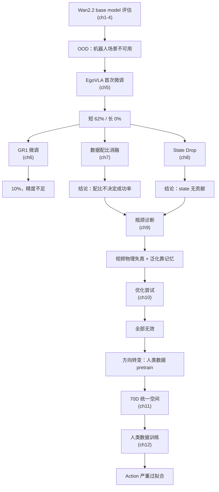

# 阶段总结与后续方向

> 回顾 12 章实验，提炼出核心结论和关键认知，定位三大瓶颈，并列出后续优化方向。

## 知识链接

- 上一章：[人类数据 Pretrain 与过拟合全面分析](./12_人类数据Pretrain与过拟合)
- [系列目录](./index)

---

## 1. 实验全景回顾

---

## 2. 核心结论汇总

### 2.1 排除的因素（不是瓶颈）

| 因素 | 实验 | 结论 |
|------|------|------|
| 数据采样比例 | 7 种方案 + seed 消融 | 成功率与配比无稳定相关 |
| State 信息 | state drop 0→1.0 | state 对 action 预测零贡献 |
| 历史帧 | 3 帧 history | 无改善 |
| 训练步数 | 11k → 30k | 无改善，甚至略降 |
| 任务文本清晰度 | 修正描述 + 单动作训练 | 无根本改善 |
| Video 条件充分性 | A2V (action→video) | 闭环成功率不变 |
| Rollout 视频 pretrain | eval 视频做 pretrain | 视频质量不够好 |

### 2.2 确认的瓶颈

| 瓶颈 | 证据 | 严重性 |
|------|------|--------|
| **Wan2.2 缺乏机器人物理先验** | 原模型 OOD，分辨率敏感，生成物理失真 | ★★★ |
| **动作预测精度不足** | 所有失败都是"抓取失败/动作不到位" | ★★★ |
| **模型泛化靠记忆** | 空间扩展后成功率骤降，人类数据上过拟合 | ★★★ |
| **Action 过拟合** | train loss -29%, val loss +54%，不同 σ 下剧烈劈叉 | ★★★ |

---

## 3. 三大瓶颈的关系

这三个瓶颈不是独立的，它们形成了一个**负向循环**：

打破这个循环需要从**外部引入大规模物理先验**——这就是人类数据 pretrain 的方向。但目前人类数据 pretrain 又遇到了新问题（action 过拟合），需要进一步解决。

---

## 4. 关键数字备忘

| 指标 | 值 | 含义 |
|------|-----|------|
| EgoVLA 短任务 best | 62.43% | 去掉 temporal smooth 后的最佳 |
| EgoVLA 长任务 best | ~2% | 几乎不可用 |
| GR1 mean SR | 10.04% | 远低于 SOTA (47-58%) |
| 空间泛化（2× 扩展后）| 从 77%→48% | 泛化能力差 |
| 人类 pretrain action 过拟合 | Val loss +54.4% | 训练 2.5→5 epoch |
| 人类 pretrain video 过拟合 | Val loss -1.1% | 几乎不过拟合 |
| 任务稳定性最高 | Close-Drawer 96% ± 2 | 简单任务不受影响 |
| 任务稳定性最低 | Insert-And-Unload 50% ± 27 | 极不稳定 |

---

## 5. 后续优化方向

### 5.1 解决 Action 过拟合

| 方向 | 思路 |
|------|------|
| **LoRA / 部分参数训练** | 冻结大部分参数，只训练少量适配层，限制模型记忆能力 |
| **增加头部运动建模** | 在 70D 空间中加入头部 action，让 video-action 对应更完整 |
| **数据增强** | 对 action 轨迹做时间扰动、空间扰动，增加有效多样性 |
| **正则化** | 更强的 dropout / weight decay / noise injection |

### 5.2 提升视频先验

| 方向 | 思路 |
|------|------|
| **EgoVerse 数据清洗** | 去掉有明显问题的数据（跳变、遮挡严重的片段）|
| **更大规模 pretrain** | 当前只训了 5 epoch，数据量和多样性需要继续增加 |
| **分辨率对齐** | 尝试在 Wan2.2 的最优分辨率下训练，而非 384×384 |

### 5.3 改善泛化

| 方向 | 思路 |
|------|------|
| **任务拆分** | 将多步任务分解为单步子任务，减少文本歧义 |
| **数据多样性** | 增加物体位置/朝向的随机化范围 |
| **Curriculum learning** | 从简单任务开始，逐步引入难任务 |

### 5.4 工程优化

| 方向 | 思路 |
|------|------|
| **评测效率** | 继续优化并行化闭环测试，减少迭代周期 |
| **验证集扩大** | 1024 条 + episode 平衡，减少评估方差 |
| **混合训练** | 人类 + 机器人数据混合训练，而非先 pretrain 再 finetune |

---

## 6. 这个系列实验给出的核心认知

1. **视频生成模型作为 World Model 的 base model，必须具备领域内的物理先验**——不能指望一个只见过互联网视频的模型理解机器人操控
2. **数据配比、state 输入、训练时长这些"调参"级别的优化对本质问题无效**——瓶颈在模型的物理理解能力
3. **模型容量过大 + 数据有限 = 必然过拟合**——尤其是 action 这种低维输出空间
4. **人类数据 pretrain 方向正确但实施有挑战**——需要解决统一动作空间、过拟合、domain gap 等问题
5. **系统性消融实验是定位问题的必要手段**——本系列的消融实验逐步排除了 5+ 种错误假设

---

## 7. 系列完结

本系列完整记录了 fast-WAM 从 base model 选型到人类数据 pretrain 的全部实验过程。虽然最终结果尚未达到目标性能，但整个诊断-尝试-分析的过程提供了非常有价值的认知：

> **知道什么不 work，和知道什么 work 一样重要。**

后续实验进展将在新的文档中持续更新。
