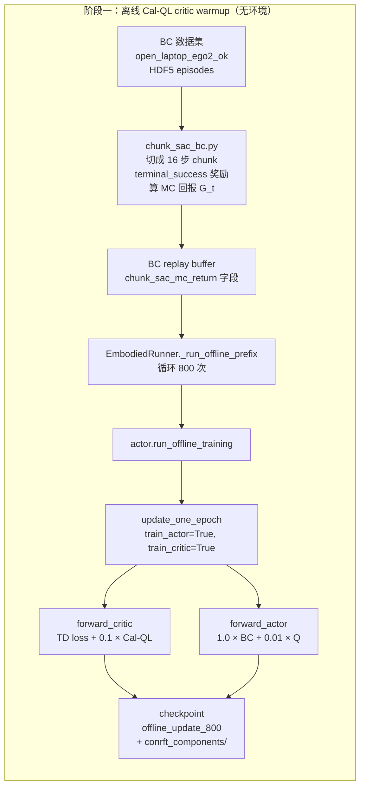
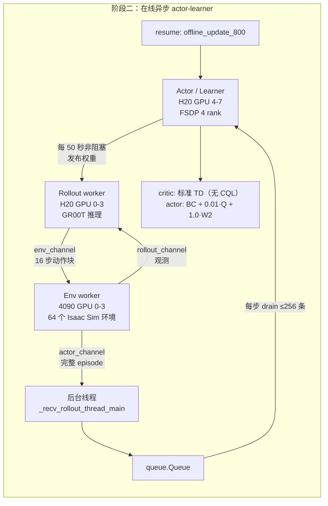
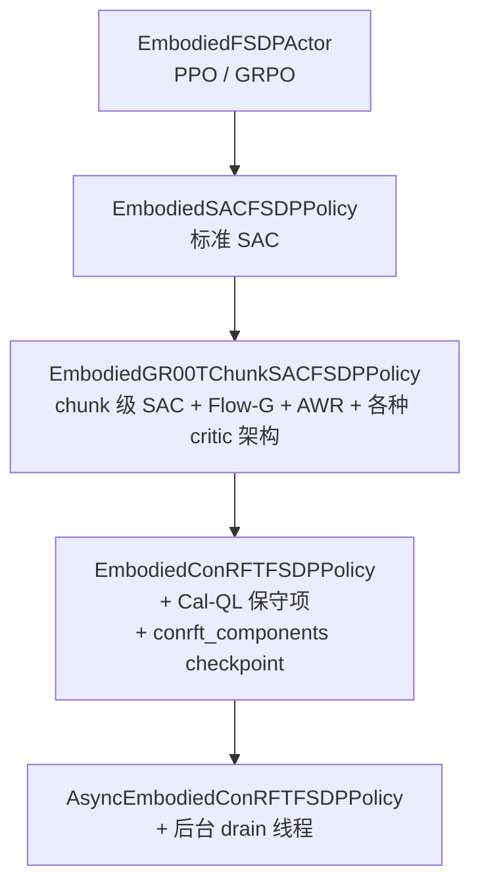

# 第 01 章 全链路总览

> 这一章给出整条链路的骨架：两个阶段各自在做什么、数据从哪里流到哪里、代码落在哪些文件上。后面 13 章都是这张图的局部放大。

## 知识链接

- [系列目录](./index)
- 下一章：[从 ConRFT 论文到本链路](./02_论文到实现的映射)
- 前置：[SAC Soft Actor-Critic](/前置知识/000k_前置知识_SAC_Soft_Actor_Critic)
- 前置：[行为克隆与 RL 微调范式](/前置知识/000d_前置知识_行为克隆与RL微调范式)
- 前置：[Cal-QL 校准保守 Q 学习](/前置知识/002h_前置知识_CalQL校准保守Q学习)
- 相关：[ConRFT 论文精读](/论文综述/010_ConRFT_一致性策略RL微调VLA)

---

## 1. 起点：我们手里有什么，想要什么

**手里有的**：一个 GR00T N1.7 的行为克隆 checkpoint（`checkpoint-500000`），在多任务双臂数据上训过。它能做 open_laptop 这个任务，但做不稳——固定 layout 的评测里成功率在 55%~69% 这个区间波动。

**想要的**：把成功率推上去，而且不能把模型搞坏。

**约束条件**决定了方法选择：

| 约束 | 后果 |
|------|------|
| 基座模型是 Flow Matching 策略（多步去噪） | 不能直接用 PPO 那种需要精确 $\log\pi(a\vert s)$ 的方法 |
| 一次推理输出 16 步动作，全部执行完再推理 | MDP 必须 chunk 化，一个"动作"是 $[16,62]$ 的矩阵 |
| 奖励极度稀疏（只有成功那一刻 +1） | 纯在线 RL 的探索成本高到不可接受 |
| 有一批 BC 演示数据 | 可以先做离线阶段，用离线数据把 critic 训出来 |
| 仿真环境启动慢、单条 episode 长（最长 350 步） | 环境采集必须和训练并行，不能串行等待 |

这五条约束几乎唯一地推出了 ConRFT 的形状：**先用离线数据训一个保守但校准的 critic，再在线用这个 critic 引导策略，同时全程用 BC 项拽着不让策略跑偏**。

## 2. 为什么必须是两个阶段、两个进程

ConRFT 的两个阶段不是"同一个训练脚本的前 800 步和后 50 步"，而是**两次独立的进程启动**，用不同的入口文件、不同的配置、不同的 run 目录。

原因有三条，每一条都是硬的。

**第一，阶段一不需要环境，而环境是最贵的资源。** 阶段一只做离线更新，`EmbodiedRunner` 会检测到 `chunk_sac.mode == "offline_pretrain"` 并**完全跳过** rollout worker 和 env worker 的创建。Isaac Sim 环境的启动要几分钟、占满 4 张 4090，阶段一 800 次更新期间让它们空转是纯浪费。

**第二，两个阶段的目标函数不同。** 阶段一的 critic loss 带 Cal-QL 保守项，阶段二不带；阶段一的 actor loss 是两项，阶段二是三项。这个切换在代码里是靠一个**构造期就确定的布尔量** `_conrft_offline_stage` 控制的，不是运行时可切换的状态。

**第三，同步 vs 异步。** 阶段一用同步 runner（`EmbodiedRunner`），阶段二用异步 runner（`AsyncEmbodiedRunner`）。这两个 runner 的 worker 编排逻辑完全不同，不可能在一次运行里切换。

RLinf 把这个约束写成了显式断言。`rlinf/config.py` 里的 `validate_conrft_entrypoint_mode` 做的就是这件事：

```python
def validate_conrft_entrypoint_mode(cfg, *, asynchronous: bool) -> None:
    """Require online ConRFT to use the asynchronous actor-learner entrypoint."""
    if cfg.algorithm.loss_type != "embodied_conrft":
        return
    mode = str(cfg.algorithm.get("chunk_sac", {}).get("mode", "online"))
    expected_mode = "online" if asynchronous else "offline_pretrain"
    if mode != expected_mode:
        entrypoint = "train_async.py" if asynchronous else "train_embodied_agent.py"
        raise ValueError(...)
```

`train_embodied_agent.py` 调用它时传 `asynchronous=False`，`train_async.py` 传 `True`。于是"用同步入口跑在线配置"或者"用异步入口跑离线配置"都会在启动的前几秒就报错，不会浪费几十分钟等到训练中途才发现配错。

## 3. 阶段一的数据流

先看图，再逐段解释。



**逐段解释**：

1. **BC 数据集**是 HDF5 格式的 episode 集合，每条 episode 记录了完整的观测序列、动作序列、以及成功标志。
2. **`chunk_sac_bc.py`** 把每条 episode 切成 16 步的 chunk（起点随机采样，每条 episode 采 256 个 chunk）。同时做两件关键的事：按 `terminal_success` 规则重新标注奖励（只有成功 episode 的最后一个物理步给 $+1$），以及按 $\gamma=0.99$ 算出每个 chunk 起点处的折扣回报 $G_t$，作为 Cal-QL 的下界。
3. **replay buffer** 里每个样本带 `chunk_sac_mc_return` 这个额外字段。这个字段只在阶段一存在——它是由 `EmbodiedConRFTFSDPPolicy._bc_replay_extra_fields` 在离线阶段注入的。
4. **`_run_offline_prefix`** 是一个纯 Python for 循环，800 次迭代，每次调用一次 `actor.run_offline_training()`，每 100 次存一个 checkpoint。没有环境，没有 rollout，没有 Channel 通信。
5. **critic 更新**：标准 chunk 级 TD loss 之外，加上 $0.1 \times$ Cal-QL 保守项。保守项要对每个状态额外算 12 个候选动作的 Q 值。
6. **actor 更新**：训在 BC 数据上，目标是 $1.0 \times \text{BC} + 0.01 \times (-Q)$。注意这里 actor 也在训——不是纯 critic warmup。配置里 `offline_train_actor: true`。

阶段一结束时产出物是 `offline_update_800/`，里面有 `runner_state.json`、`actor/dcp_checkpoint/`（FSDP 分布式 checkpoint）、以及 `actor/conrft_components/complete_rank_0..7`（8 个 rank 各自的组件完成标记）。

## 4. 阶段二的数据流



**关键点是三条时间线的解耦**：

| 时间线 | 谁在跑 | 节奏 |
|--------|--------|------|
| 环境采集 | env worker（4090） + rollout worker（H20 0-3） | 连续不停，episode 完成就往 `actor_channel` 推 |
| Learner 更新 | actor worker（H20 4-7） | 每个 runner step 做 1 次更新（`num_updates_per_step: 1`） |
| 权重发布 | actor → rollout | 每 50 秒一次（`weight_sync_interval_seconds: 50.0`），非阻塞 |

这三条时间线互相不阻塞。actor 更新时环境还在跑（收集的数据进队列排着）；权重发布用非阻塞方式，如果上一次发布还没完成就直接合并（coalesce）掉这次请求。

代价是**策略滞后**：rollout worker 用的权重最多比 learner 落后 50 秒。这是 off-policy 方法可以接受的——replay buffer 里本来就混着各个版本策略采的数据。

## 5. 代码位置速查

整条链路涉及的文件，按层次列出。这张表在后续所有章节里都会用到。

| 层次 | 文件 | 职责 |
|------|------|------|
| 本地启动 | `CONRFT/conrft.env` | 所有路径与任务的环境变量 |
| 本地启动 | `CONRFT/run_remote.sh` | `check/sync/test/warmup/online` 五个子命令 |
| 远端启动 | `examples/embodiment/run_miarena_groot_chunk_sac.sh` | PYTHONPATH、Isaac 环境变量、前置门禁 |
| 入口 | `examples/embodiment/train_embodied_agent.py` | 阶段一（同步） |
| 入口 | `examples/embodiment/train_async.py` | 阶段二（异步） |
| 配置 | `examples/embodiment/config/miarena_r1_conrft_critic_warmup_gr00t_n1d7.yaml` | 阶段一 |
| 配置 | `examples/embodiment/config/miarena_r1_conrft_gr00t_n1d7.yaml` | 阶段二 |
| 配置校验 | `rlinf/config.py` | `validate_cfg` + `validate_conrft_entrypoint_mode` |
| Runner | `rlinf/runners/embodied_runner.py` | 阶段一的 `_run_offline_prefix` |
| Runner | `rlinf/runners/async_embodied_runner.py` | 阶段二的 `run` |
| Actor 基类 | `rlinf/workers/actor/fsdp_groot_chunk_sac_policy_worker.py` | Chunk-SAC 全部基础设施 |
| Actor | `rlinf/workers/actor/fsdp_conrft_policy_worker.py` | `EmbodiedConRFTFSDPPolicy`，Cal-QL 挂载点 |
| Actor | `rlinf/workers/actor/async_fsdp_conrft_policy_worker.py` | 异步变体，后台 drain 线程 |
| 目标函数 | `rlinf/workers/actor/conrft/objectives.py` | `conservative_q_loss` + `ConRFTActorObjective` |
| 配置 dataclass | `rlinf/workers/actor/conrft/config.py` | `ConRFTConfig` 及其校验 |
| Critic 目标 | `rlinf/workers/actor/groot_chunk_sac/critic_objectives.py` | `AbsoluteCriticObjective` |
| 算法原语 | `rlinf/algorithms/chunk_sac.py` | `chunk_sac_td_target` 等 |
| 数据 | `rlinf/data/chunk_sac_bc.py` | BC 数据加载 + 奖励重标 + MC 回报 |
| 数据 | `rlinf/data/chunk_sac_replay.py` | replay buffer |
| 模型 | `rlinf/models/embodiment/gr00t/gr00t_n1d7/gr00t_action_model.py` | 三个 ForwardType 的实现 |
| 模型 | `rlinf/models/embodiment/modules/chunk_sac_head.py` | `ChunkSACCritic` |
| 模型 | `rlinf/models/embodiment/modules/flow_g_adapter.py` | `FlowGVelocityAdapter` |

## 6. ConRFT 在 Chunk-SAC 家族里的位置

这一点很容易被误解，所以单独说清楚：**ConRFT 在这个代码库里不是一个独立的算法栈，而是 Chunk-SAC 的一个子类加一个 actor objective**。

继承关系：



`EmbodiedConRFTFSDPPolicy` 一共只有 250 行，它做的事情非常有限：

| 覆写的方法 | 做什么 |
|------------|--------|
| `__init__` | 解析 `algorithm.conrft` 成 `ConRFTConfig`，确定 `_conrft_offline_stage`，跑 8 条契约校验 |
| `_sac_flow_in_bc_warmup` | 直接返回 `_conrft_offline_stage`（离线阶段 = BC warmup 语义） |
| `_bc_mc_return_gamma` | 离线阶段返回 $\gamma$，触发数据侧计算 MC 回报 |
| `_bc_replay_extra_fields` | 把 `mc_returns` 注入成 `chunk_sac_mc_return` 字段 |
| `setup_sac_components` | 把 ConRFT 超参混进 `resume_config_hash` |
| `_checkpoint_component_name` | 返回 `"conrft_components"` 而不是 `"chunk_sac_components"` |
| `_compute_conservative_loss` | 采 12 个候选动作，调 `conservative_q_loss` |
| `forward_critic` | 调父类，然后**只在离线阶段**加上 Cal-QL 项 |
| `update_one_epoch` | 调父类，然后聚合 `conrft/*` 指标 |
| `process_train_metrics` | 把 `chunk_sac/` 和 `sac/` 前缀改写成 `conrft/` |

其余全部逻辑——replay buffer、FSDP 包装、优化器、TD target、梯度累积、checkpoint 保存、评测——都是继承来的。

**这个设计的好处**：ConRFT 和 Flow-G 共享全部经过验证的基础设施，改动面小、可比性强。**代价**是配置文件里会继承一堆和 ConRFT 无关的键（第 04 章会列出哪些是死配置），以及一旦父类行为变了 ConRFT 会跟着变。

## 7. 两个阶段的目标函数速览

完整推导在第 08、09、11 章，这里先给出全貌，方便建立整体印象。

**Critic loss**：

| 阶段 | 公式 |
|------|------|
| 阶段一 | $\mathcal{L}_{\text{critic}} = \underbrace{\mathbb{E}\big[(Q_\theta - y)^2\big]}_{\text{chunk 级 TD}} + 0.1 \cdot \underbrace{\mathcal{R}_{\text{Cal}}}_{\text{Cal-QL 保守项}}$ |
| 阶段二 | $\mathcal{L}_{\text{critic}} = \mathbb{E}\big[(Q_\theta - y)^2\big]$ |

**Actor loss**：

| 阶段 | 公式 | 数据来源 |
|------|------|----------|
| 阶段一 | $\mathcal{L}_{\text{actor}} = 1.0 \cdot \mathcal{L}_{\text{BC}} + 0.01 \cdot (-\bar{Q})$ | BC/expert batch |
| 阶段二 | $\mathcal{L}_{\text{actor}} = 1.0 \cdot \mathcal{L}_{\text{BC}} + 0.01 \cdot (-\bar{Q}) + 1.0 \cdot \mathcal{L}_{\text{W2}}$ | BC 项用 expert batch，Q 项和 W2 项用在线 replay |

三项的角色：

- $\mathcal{L}_{\text{BC}}$ 是 Flow Matching 的 SFT loss（velocity 预测的 MSE），把策略往演示数据上拽
- $-\bar{Q}$ 是标准的 SAC actor 目标，把策略往 critic 认为好的方向推
- $\mathcal{L}_{\text{W2}}$ 是"当前策略输出"和"冻结 BC 参考输出"之间的 masked MSE，是一个 trust region 约束

权重 $1 : 0.01 : 1$ 意味着 **Q 项的话语权只有 1%**。这条链路本质上是"BC 为主、Q 值轻推、trust region 兜底"。这是 ConRFT 论文的设定，也是它能在真机上安全跑的原因，但也意味着如果 critic 学得很好，它的能力被这组权重严重限制了。第 11 章和第 14 章会详细讨论。

## 8. 一次完整运行的时间线

把所有东西串起来，一次从零开始的完整实验长这样：

```text
[本地] CONRFT/run_remote.sh check
       └─ ssh 探活、nvidia-smi、检查所有路径存在、确认没有残留 ray 进程

[本地] CONRFT/run_remote.sh sync
       └─ tar 白名单文件（21 个）通过 ssh 管道解压到远端 RLinf 根目录

[本地] CONRFT/run_remote.sh test
       └─ 远端跑 pytest tests/unit_tests/test_conrft_objectives.py

[本地] CONRFT/run_remote.sh warmup     ← 阶段一，前台运行
       └─ 远端 train_embodied_agent.py
          ├─ validate_cfg + validate_conrft_entrypoint_mode(asynchronous=False)
          ├─ 只创建 actor worker group（8 rank FSDP）
          ├─ 加载 BC 数据集 → replay buffer（带 mc_return）
          ├─ 800 次 run_offline_training
          │    每次：critic 更新（TD + Cal-QL）+ actor 更新（BC + 0.01·Q）
          ├─ 每 100 次存 offline_update_N
          └─ 最终产出 offline_update_800/

[本地] CONRFT/run_remote.sh online      ← 阶段二，前台运行
       └─ 远端 shell 先校验 offline_update_800 完整性（runner_state.json
          + actor/dcp_checkpoint + conrft_components/complete_rank_0..7）
          └─ train_async.py
             ├─ validate_conrft_entrypoint_mode(asynchronous=True)
             ├─ 创建 env(4090 0-3) / rollout(H20 0-3) / actor(H20 4-7)
             ├─ resume_dir = offline_update_800，恢复 update_step=800
             ├─ 首次权重同步（阻塞）
             ├─ 启动三条长驻协程 + actor 后台 drain 线程
             ├─ 50 个 runner step，每步 1 次更新
             ├─ 每 50 秒非阻塞发布权重
             ├─ 每 5 step 评测（48 个固定 layout）+ 存 checkpoint
             └─ 收尾：stop 所有 worker、flush replay
```

两个阶段都是**前台运行**（`tee` 到日志文件），必须在一个能长期保持的终端里跑。阶段一的 800 次更新在 8 卡 H20 上大约要几个小时（每次更新要算 13 倍的 Q 前向）；阶段二 50 个 step 因为每步都要等环境采够数据，实际墙钟时间取决于环境吞吐。

## 9. 问题、风险与实验安排隐患清单

这一节是整个系列最应该先读的部分。它记录了对这条链路做静态审查时发现的**全部**问题，每一条都给出**证据链**（文件 + 符号 + 具体数值）。

> **📌 重要说明：本节列出的问题，绝大多数已经在 2026-07-29 修掉了。**
>
> 每一条的开头都有一个「状态」引用块，说明它现在是**已修复 / 部分修复 / 不改行为只加监控**，以及具体的修法。**问题分析本身被完整保留**，原因有三个：
>
> 1. 它解释了每个配置项**为什么**是现在这个值。看到 `preserve_stage1_flow_g_adapter: true` 时，你需要知道它防的是什么。
> 2. 有几条问题的修法**和直觉相反**（比如 9.5：不能把 `critic_warmup_updates` 设成 0），不知道来龙去脉很容易改回去。
> 3. 有几条是**设计取舍而非缺陷**（9.10、9.11），需要长期监控而不是一次性修掉。
>
> 修复状态的汇总表在 [9.15](#9.15-修复状态总表)。如果你只想知道"现在还剩什么"，直接跳到那里。

标记含义：

- **P0**：会导致实验跑不起来、或者跑起来但结论无效。
- **P1**：会显著影响结果或运维成本。
- **P2**：设计不整洁或有浪费。

已确认发生的行为标记为「已核实」；只能通过静态分析推断的标记为「待实测」（这些标记保留了发现时的状态，后续验证结论写在各自的「状态」块里）。

> **⚠️ 其中最严重的是 [9.14](#9.14-p0-已核实-actor-loss-里权重-1.0-的-bc-项梯度恒为零)**：actor loss 里权重最大的 BC 项，其计算图里没有任何可训练参数，梯度恒为 0。它是本节唯一一条代码级 bug（其余都是配置或实验安排问题），影响两个阶段。已修复。

### 9.1 P0 — 在线阶段的评测被关掉了，无法判断方法是否有效

> **状态：已修复（2026-07-29）。** `runner.val_check_interval` 改为 `5`，与 `save_interval: 5` 整除，`check_progress` 的断言通过。在线每 5 个 outer step 评测一次。下面保留问题分析，因为它解释了这条链路为什么必须有评测。

**证据**：`miarena_r1_conrft_gr00t_n1d7.yaml` 的 `runner.val_check_interval: -1`。而 `rlinf/utils/runner_utils.py` 里：

```python
is_validation_enabled = limit_val_batches != 0 and val_check_interval > 0
run_val = (safe_is_divisible(step, val_check_interval) or is_train_end or run_time_exceeded)
run_val &= is_validation_enabled
```

`val_check_interval = -1` 使 `is_validation_enabled` 恒为 `False`，`run_val` 因此**在所有 step 上都是 False**，包括最后一步（`is_train_end` 被 `&=` 抹掉）。

**后果**：整个阶段二 50 个 step 一次评测都不做。配置里那份 48 个固定 layout 的评测集（继承自 `miarena_r1_sac_flow_g16_adapter_gr00t_n1d7.yaml` 的 `env.eval.evaluation_layout_ids`）从头到尾不会被跑；`runner.save_episode_metrics: true` 和 `episode_metrics_path` 也因此不会产出任何文件。可用的信号只剩训练环境自己的 `env/*` 指标——而训练环境用的是随机 layout、且策略权重最多滞后 50 秒，这个成功率不能和 BC 基线的 48-layout 结果直接比较。

**这意味着**：即使阶段二训练完全正常，也**没有任何数据能说明成功率是涨了还是跌了**。这是实验安排层面的问题，不是代码 bug。

**处理**：`runner.val_check_interval` 设成 `5`（与 `save_interval: 5` 一致，`check_progress` 里有 `save_interval % val_check_interval == 0` 的断言，所以必须整除）。同时确认 4090 上的 env worker 有余量跑 48 个评测环境。

展开：[第 13 章 指标手册](./13_指标手册)。

### 9.2 P0 — 在线阶段总更新预算只有 50 次

> **状态：已修复。** `num_updates_per_step` 从 `1` 改为 `35`，总更新数 $50 \times 35 = 1750$，与 Flow-G16 同量级。另外 `critic_actor_ratio` 是 `1`（Flow-G16 是 `16`），所以 actor 也更新 1750 次，比 Flow-G16 的约 109 次多 16 倍 —— 做同预算对比时要说明这一点。

**证据**：阶段二 `max_steps: 50`（继承自 flow_g16 adapter）+ `num_updates_per_step: 1` + `critic_actor_ratio: 1`。`AsyncEmbodiedRunner.run` 每个 step 调一次 `actor.run_training()`，而 `run_training` 内部循环 `num_updates_per_step` 次。

$$
\text{总梯度更新次数} = \text{max\_steps} \times \text{num\_updates\_per\_step} = 50 \times 1 = 50
$$

对照兄弟链路 Flow-G16（`miarena_r1_sac_flow_g16_adapter_gr00t_n1d7.yaml`）：`max_steps: 50`，`num_updates_per_step: 35`，即 $50 \times 35 = 1750$ 次更新。**ConRFT 的在线更新预算是 Flow-G 的 1/35。**

**后果**：actor 学习率 $1\times10^{-4}$、`clip_grad: 0.1`、并且 actor loss 里 Q 项权重只有 0.01。50 次这样的更新对一个 20 亿参数级别的策略几乎不构成可观测的改变。哪怕 critic 是完美的，策略也不会动。

**为什么会这样**：`num_updates_per_step: 1` 是 ConRFT 配置**显式写**的（不是继承来的），大概率是为了让异步链路先跑通而设的保守值。但它没有被相应地放大 `max_steps`。

**处理**：要么把 `num_updates_per_step` 提到和 Flow-G 同量级，要么把 `max_steps` 提到几百。**在改之前先想清楚哪一个才是想控制的量**——`max_steps` 决定评测频次和权重发布次数，`num_updates_per_step` 决定每批数据被复用多少次。

展开：[第 10 章 阶段二异步架构](./10_阶段二异步架构)、[第 11 章 阶段二在线三项目标](./11_阶段二在线三项目标)。

### 9.3 P0（待实测）— 阶段交接的 resume 很可能直接抛异常

> **状态：已修复，而且我原来的判断有一处是错的。** 用 Hydra 实际 compose 两个配置之后穷举比对，进入 `resume_config` 的字段里只有 4 个不同，且每个都有精确匹配的 `stage1_*` 声明：`num_updates_per_step`（4）、`critic_actor_ratio`（8）、`sac_flow_bc_warmup_updates`（512）、`head.eval_initial_noise`（`random`）。
>
> **`eval_initial_noise` 在阶段一的继承链里确实存在且等于 `random`**——我之前只 grep 了顶层 yaml，漏了它的真实来源，所以那条「键缺失导致哈希不匹配」的推断不成立。`sac_bc_coef` 现在两阶段都显式为 `0.0`；新增的 `stage1_compute_path_log_prob` 与 `stage1_straight_through_action_clip` 也与阶段一实际值一致。
>
> 下面保留完整分析，因为这套 `stage1_*` 声明机制是整条链路最容易出错的地方：**改任何一个进 `resume_config` 的键，都必须回来重新核对声明侧**。核对方法就是本节给出的那段 compose + diff 脚本。

这是启动阶段二时最可能第一个撞上的错误。逻辑链条比较长，分步说明。

**第一步**：`load_checkpoint` 先比较哈希：

```python
if state.get("resume_config_hash") != self.resume_config_hash:
    ...
    stage1_schedule_resume = is_stage1_schedule_resume(state, expected_hash=self.stage1_schedule_resume_hash, ...)
    if not (... or stage1_schedule_resume or ...):
        raise ValueError("Chunk SAC checkpoint resume config mismatch")
```

阶段一和阶段二的 `resume_config_hash` **必然不同**——因为 `resume_config` 里包含 `num_updates_per_step`（阶段一 4，阶段二 1）、`critic_actor_ratio`（8 vs 1）、`sac_flow_bc_warmup_updates`（512 vs 0）等等，而这些是阶段二有意改掉的。所以一定走进 `if` 分支。

**第二步**：唯一可行的通路是 `stage1_schedule_resume`，它要求阶段二**声明**出一份"阶段一当时到底用的什么配置"，并且哈希要精确对上：

```python
def is_stage1_schedule_resume(state, expected_hash, critic_warmup_updates, enabled):
    return bool(
        enabled                                                     # allow_stage1_schedule_resume: true ✓
        and expected_hash is not None                               # stage1_num_updates_per_step 已声明 ✓
        and state.get("resume_config_hash") == expected_hash        # ← 关键
        and int(state.get("update_step", 0)) == int(critic_warmup_updates)   # 800 == 800 ✓
        and int(state.get("pending_action_slots_global", 0)) == 0    # 离线阶段无在线 episode ✓
    )
```

这份声明就是阶段二配置里那一串 `stage1_*` 键。问题是：**它们是从 Flow-G 链路继承下来的，描述的是 Flow-G 的阶段一，没有为 ConRFT 重新核对过。** 至少两处存疑：

| 键 | 阶段二声明的值 | ConRFT 阶段一实际值 | 来源 |
|----|----------------|---------------------|------|
| `sac_bc_coef` | `0.0`（阶段二自己设，且**没有** `stage1_sac_bc_coef` 覆盖它） | `0.1`（继承 `flow_g_adapter`，ConRFT 阶段一没覆盖） | 不一致 |
| `chunk_sac.eval_initial_noise` | 被 `stage1_eval_initial_noise: random` 强制写成 `"random"` | 阶段一的 head 配置里**根本没有这个键**（全仓库只有 `flow_g16_adapter` 和几个 parity_eval 配置设过它） | 不一致 |

`stable_hash` 对"键缺失"和"键存在且等于 random"会给出不同结果，对 `0.0` 和 `0.1` 同样如此。任何一处不一致就会让 `is_stage1_schedule_resume` 返回 `False`，最终 `raise ValueError("Chunk SAC checkpoint resume config mismatch")`。

**为什么标"待实测"**：这些 `stage1_*` 键看起来是**为已经产出的某个具体 checkpoint 事后补写**的（这也解释了为什么会出现"声明了一个 head 配置里不存在的键"这种情况）。也存在运维时用命令行覆盖（`algorithm.stage1_sac_bc_coef=0.1` 之类）把哈希凑上的可能。所以结论是"极可能失败，需要实机确认"，而不是"必定失败"。

**处理**：启动阶段二之前，先做一次**只加载不训练**的干跑（把 `num_updates_per_step` 设 0 配合 `allow_debug_*` 开关，或直接跑一次 `only_eval`），确认 resume 能过。如果失败，正确的修法见下一条——**不要**简单地把 `stage1_*` 键凑到匹配。

展开：[第 12 章 Checkpoint 与阶段交接](./12_Checkpoint与阶段交接)。

### 9.4 P0 — 就算 resume 通过，阶段一训好的 Flow-G gate 会被清成恒等

> **状态：已修复。** 新增 `preserve_stage1_flow_g_adapter: true` 与 `_apply_stage1_flow_g_resume_policy()`：preserve 分支保留 adapter 与 actor optimizer 状态、不做 identity reset。`rlinf/config.py` 对在线 ConRFT 强制 `preserve_stage1_flow_g_adapter=true` 且 `repair_stage1_flow_g_identity=false`，冲突组合直接 raise。

这条和上一条是一对：**把哈希凑匹配反而会触发一个更糟的后果。**

**证据**：一旦 `stage1_schedule_resume` 为真，`load_checkpoint` 立刻执行：

```python
if stage1_schedule_resume:
    if not bool(self.cfg.algorithm.get("repair_stage1_flow_g_identity", False)):
        raise ValueError("Stage-1 Flow-G resume requires repair_stage1_flow_g_identity=true")
    self._repair_stage1_flow_g_identity()
```

而 `_repair_stage1_flow_g_identity` 做的是：

```python
adapter.reset_identity()                      # Flow-G gate 重置为恒等映射
for parameter in adapter.parameters():
    for value in self.optimizer.state.get(parameter, {}).values():
        if torch.is_tensor(value):
            value.zero_()                     # actor 优化器动量清零
_reset_optimizer_learning_rate(self.optimizer, self.lr_scheduler, float(self.cfg.actor.optim.lr))
```

`repair_stage1_flow_g_identity: true` 是阶段二从 `flow_g16_adapter` 继承来的，且上面那个 `raise` 表明这条路径**强制**要求它为真。

**为什么这对 Flow-G 是对的、对 ConRFT 是错的**：

| | Flow-G 链路 | ConRFT 链路 |
|---|---|---|
| 阶段一是否训 actor | 不训（`offline_actor_only`/`offline_train_actor` 语义下 critic-only） | **训**：`offline_train_actor: true` |
| 阶段一结束时 Flow-G gate | 仍是恒等（从没更新过） | 已被 800 次 `1.0·BC + 0.01·Q` 更新过 |
| `reset_identity()` 的效果 | 无害（本来就是恒等），只是保证数值干净 | **丢弃 800 次离线 actor 训练的全部成果** |

**后果**：阶段二起点的策略退化成"基座 BC 模型 + 恒等 gate"，也就是完全没被 RL 动过的原始 checkpoint。阶段一的 800 次 actor 更新等于白做。配合 9.2 的"在线只有 50 次更新"，整条链路实际训练出来的策略几乎就是 BC 基线本身。

**处理**：ConRFT 需要自己的阶段交接路径，不能复用 Flow-G 的 `stage1_schedule_resume`。最小改动是给 `EmbodiedConRFTFSDPPolicy` 覆写一个"允许调度变更但**不**重置 adapter"的分支，并把 `repair_stage1_flow_g_identity` 在 ConRFT 配置里显式设为 `false`（同时需要放宽上面那个 `raise`）。

展开：[第 12 章 Checkpoint 与阶段交接](./12_Checkpoint与阶段交接)。

### 9.5 P1 — `critic_warmup_updates: 800` 与 `update_step` 的耦合极其脆弱

> **状态：已修复，但修法和我原来的建议相反。** 新增 `EmbodiedConRFTFSDPPolicy._validate_online_stage1_checkpoint()`，resume 之后若 `update_step < critic_warmup_updates` 立即 raise，静默失败变成显式失败。
>
> **不要把 `critic_warmup_updates` 改成 0。** `is_stage1_schedule_resume` 用它当作「阶段一应该结束在第几次更新」的期望值（`int(state.get("update_step", 0)) == int(critic_warmup_updates)`），改成 0 会直接让阶段交接的 resume 失效。我原文那条建议是错的。

**证据**：阶段二继承了 `critic_warmup_updates: 800`（来自 `flow_g_adapter`，ConRFT 配置没覆盖）。actor 是否更新由这个函数决定：

```python
def _should_update_actor(total_samples, min_buffer_size, train_actor_steps,
                         update_step, critic_actor_ratio, critic_warmup_updates=0):
    actor_start = max(int(min_buffer_size), int(train_actor_steps))
    return (int(total_samples) >= actor_start
            and int(update_step) >= int(critic_warmup_updates)      # ← 需要 update_step ≥ 800
            and update_step % critic_actor_ratio == 0)
```

阶段一每次离线更新做 `self.update_step += 1`，800 次之后 `update_step == 800`，并被写进 checkpoint（`save_checkpoint` 里的 `"update_step": self.update_step`），resume 时 `self.update_step = int(state.get("update_step", 0))` 恢复。

所以**在正常路径下这条恰好成立**：$800 \ge 800$，阶段二第一步 actor 就参与更新。

**风险在于"恰好"**：如果 resume 因任何原因没恢复 `update_step`（比如走了 weights-only 分支、或者阶段一的 `offline_updates` 被改成 700），那么 `update_step < 800` 会让 actor **在整个阶段二都不更新**——因为总共只有 50 步（见 9.2），永远爬不到 800。而且这个失败是**静默**的：日志里不会报错，只会看到 actor 相关指标恒为 0。

**处理**：阶段二显式设 `critic_warmup_updates: 0`（阶段一已经做完 warmup 了，这个值在阶段二没有意义），并在第一步的日志里检查 `train/conrft/actor_*` 指标非零。

展开：[第 12 章](./12_Checkpoint与阶段交接)、[第 13 章](./13_指标手册)。

### 9.6 P1 — `action_squash: none` 加上 critic 侧的 clamp 造成 Q 梯度死区

> **状态：已修复。** `canonicalize_gr00t_chunk_actions` 新增 `straight_through_clip` 参数，实现是 `actions + (bounded - actions).detach()`——前向仍然是 clamp 之后的值，反向按恒等传梯度，死区消失。两个阶段的 head 配置都设了 `straight_through_action_clip: true`（缺这一项的那次阶段一 warmup 已被判为无效实验并删除）。

**证据**：本链路的 16 步配置里 `action_squash: none`（`flow_g16_critic_warmup` 和 `flow_g16_adapter` 都设），也就是策略输出**不过 tanh**，取值范围原则上是整个 $\mathbb{R}$：

```python
elif action_squash == "none":
    actions = pre_squash_actions
    terminal_log_abs_det = None
```

而 critic 在收到动作之后，第一件事是**硬 clamp**（`chunk_sac_head.py` 的 `canonicalize_gr00t_chunk_actions`）：

```python
clipped = actions.clamp(-1.0, 1.0)
physical = (clipped + 1.0) * 0.5 * (action_max - action_min) + action_min
```

**两个后果**：

1. **CQL 候选的覆盖是够的**（这一点比初看时乐观）。既然 critic 只可能看到 $[-1,1]$ 内的动作，`random_actions.uniform_(-1.0, 1.0)` 就恰好覆盖了 critic 的全部有效输入域。**保守项的采样范围没有问题。**
2. **但 Q 项存在梯度死区**。如果策略某个维度输出了 $1.3$，`clamp` 把它压成 $1.0$，那么
   $$\frac{\partial Q}{\partial a} = \frac{\partial Q}{\partial \text{clipped}} \cdot \frac{\partial \text{clipped}}{\partial a} = \frac{\partial Q}{\partial \text{clipped}} \cdot 0 = 0$$
   Q 项对这个维度**完全不产生梯度**。策略一旦漂出边界，Q 就再也推不动它（往里推也不行），只有 BC 项和 W2 项还能把它拉回来。

**为什么这个组合是脆弱的**：`action_squash: tanh` 时策略输出天然在 $(-1,1)$ 内，永远不进死区；`action_squash: none` 时没有任何机制保证策略留在范围内。当前靠的是"基座 BC 模型的输出本来就在范围内 + BC/W2 项拽着"这个隐含假设。假设成立时一切正常，不成立时表现为**部分动作维度冻结**，而且指标上很难看出来（Q 值不会异常，只是不动）。

**处理**：加一个监控——统计 `chunk_sac_action` 中 $|a| > 1$ 的元素比例（越界率）。如果这个比例长期非零且在上升，说明策略在往死区漂。真要修的话，选项是换回 `action_squash: tanh`（但会改变 `resume_config_hash`，且 16 步链路选 `none` 应该有它的理由），或者在 actor loss 里加一个越界惩罚项。

展开：[第 06 章 Critic 架构与 TD 目标](./06_Critic架构与TD目标)、[第 08 章 阶段一 Cal-QL 保守项](./08_阶段一CalQL保守项)。

### 9.7 P1 — W2 约束的是另一次采样，不是被 Q 推动的那次动作

> **状态：已修复。** `ConRFTActorObjective.compute` 现在只做一次 `ForwardType.SAC` 调用，用 `return_bc_reference=not self.offline_stage` 同时拿到 `actions` 和 `bc_reference_actions`，Q 项和 W2 项共用同一份 `policy["actions"]`。`conrft_eval_context` 不再出现在 actor 路径上，只留给 Cal-QL 的候选采样。

**证据**：`ConRFTActorObjective.compute` 里做了**两次**独立的策略前向：

```python
policy = model(forward_type=ForwardType.SAC, forward_inputs=data)     # 第一次：给 Q 项用
policy["actions"].retain_grad()
q_values = model(forward_type=ForwardType.SAC_Q, forward_inputs=data, actions=policy["actions"])
...
if not self.offline_stage:
    with conrft_eval_context(model):
        w2_policy = model(forward_type=ForwardType.SAC, forward_inputs=data,
                          return_bc_reference=True)                    # 第二次：给 W2 项用
    w2_loss = _masked_action_mse(w2_policy["actions"], w2_policy["bc_reference_actions"], data["chunk_sac_valid"])
```

`sample_chunk_sac_action` 内部每次都重新采初始噪声 `x_t = torch.randn(...)`，所以两次前向的动作来自**不同的噪声实现**。

**后果分两层**：

1. **语义**：W2 项的本意是 trust region——"不要让 Q 把策略推离 BC 太远"。但它约束的是第二次采样的动作，而 Q 项推动的是第一次采样的动作。两项作用在同一组参数上，方向上仍然有效（都是对 gate 的约束/推动），但**逐样本的耦合断了**：某个样本上 Q 推得特别猛时，W2 不会在同一个样本上给出对应强度的反作用。
2. **成本**：每次 actor 更新的策略前向从 1 次变成 2 次。GR00T 的一次 SAC 采样要跑 4 步去噪、每步一次 32 层 DiT，这是 actor 侧最贵的部分，直接翻倍。

**处理**：把两次前向合成一次——第一次前向就带 `return_bc_reference=True`，然后 Q 项和 W2 项都用同一份 `policy["actions"]`。这样既省一半算力，又让两项逐样本对齐。需要注意 `conrft_eval_context` 会把模型切到 `eval()`（影响 dropout 等），合并时要确认这个语义差异是否重要。

展开：[第 11 章 阶段二在线三项目标](./11_阶段二在线三项目标)。

### 9.8 P1 — 阶段一到阶段二从 8 个 rank reshard 到 4 个 rank，校验会被静默跳过

> **状态：已修复。** checkpoint 新增 `parameter_checksum_scope: "full_tensor_v1"`：DTensor 完整 materialize 之后算全张量 checksum，与 world size 无关，所以 8→4 reshard 也会真正校验。旧格式 checkpoint 走兼容分支并打印告警，新 checkpoint 不再走它。远端 shell 的 gate 也改成从 `alpha_rank_0.pt` 读 `world_size`，动态决定要检查几个 `complete_rank_*`。

**证据**：阶段一 actor 占 `h20` 的 GPU `0-7`（8 rank），阶段二 actor 只占 `4-7`（4 rank，另外 `0-3` 给 rollout）。`run_miarena_groot_chunk_sac.sh` 检查的是 `conrft_components/complete_rank_0..7`，也就是**源端 8 个 rank**。

reshard 本身 DCP 支持，`load_chunk_sac_sidecar` 也接收 `current_world_size` 做适配。但下面这两处校验带了 `checkpoint_world_size == self._world_size` 前置条件：

```python
if (checkpoint_world_size == self._world_size
        and self._flow_g_adapter_checksum() != state.get("flow_g_adapter_checksum")):
    raise ValueError("Chunk SAC Flow-G adapter checksum mismatch after restore")
...
if (checkpoint_world_size == self._world_size
        and self._target_critic_checksum() != state.get("target_critic_checksum")):
    raise ValueError("Chunk SAC target critic checksum mismatch after restore")
```

$8 \ne 4$，所以**这两个 checksum 校验在本链路的阶段交接上永远不执行**。只剩 signature（形状/结构）校验，它能抓住结构错配，抓不住"权重加载错了但形状对"这类问题。

**处理**：接受这个事实，但在阶段二启动后第一时间人工核对一次——比如让阶段二在第 0 步前对 replay 里的一批 BC 样本算一遍 $Q$ 值，和阶段一最后一次的 `conrft/q_mean` 对比。数量级不一致就说明 critic 没正确加载。

展开：[第 12 章](./12_Checkpoint与阶段交接)。

### 9.9 P1 — 阶段一无法续跑，阶段二无法从自己的 checkpoint 续跑

> **状态：部分修复。** `run_remote.sh` 新增 `resume-online` 子命令：显式复用正式 run 目录，自动找最新的 `global_step_*` 并注入 `runner.resume_dir=`；远端 shell 的完整性校验也改成校验被覆盖之后的那个目录。
>
> **阶段一仍不支持原地续跑**（脚本明确拒绝：`Only online ConRFT supports formal in-place resume.`），800 次 warmup 中途失败只能换 run root 重跑。考虑到中间 checkpoint 已被定为不保留，这是可接受的取舍。

**证据**：`CONRFT/run_remote.sh` 的 `run_stage`：

```bash
if [[ -d '${run_root}' ]] && [[ -n "$(find '${run_root}' -mindepth 1 -maxdepth 1 -print -quit)" ]]; then
  echo 'Refusing to reuse non-empty formal run directory: ${run_root}' >&2; exit 2;
fi
```

而阶段二的 `runner.resume_dir` 被写死成 `${oc.env:GROOT_CONRFT_CRITIC_CHECKPOINT}`，也就是**阶段一**的产物。

**后果**：

- 阶段一跑到第 600 次更新崩了 → 目录非空 → 无法用同一个 run root 续跑，只能改 `GROOT_CONRFT_CRITIC_RUN_ROOT` 换个新目录重跑 800 次。虽然 `_run_offline_prefix` 本身支持从 `completed_updates` 续（它会 `if completed_updates > total_updates: raise`），但脚本层不让你走到那一步。
- 阶段二跑到第 30 步崩了 → 同样无法续跑，而且即使换目录，`resume_dir` 仍指向阶段一，等于从头开始。
- 阶段一每 100 次存的 `offline_update_100..700` 这些中间 checkpoint 实际上无法被利用。

**处理**：给 `run_remote.sh` 加一个 `--resume` 模式，允许目录非空并把 `runner.resume_dir` 指到该目录下最新的 checkpoint。这纯属运维便利性，不影响算法。

展开：[第 03 章 启动层与门禁](./03_启动层与门禁)。

### 9.10 P1 — `terminal_success` 奖励让 Cal-QL 的下界在失败样本上完全失效

> **状态：不改行为，改为监控。** 这是 terminal-success 这个奖励定义的固有性质，不擅自动 reward。`conservative_q_loss` 新增 `calql_positive_bound_fraction` 指标（$G_t > 0$ 的样本占比）。当前有效 run 上这个值是 `1.0`，也就是这一批 BC 数据里全部 episode 都成功，下界全程有效，问题暂不出现。后续如果 replay 里混入在线失败样本，要盯这个指标下滑。

**证据**：`chunk_sac_bc.py` 的奖励规则

```python
def terminal_success_rewards(episode_length: int, success: bool) -> torch.Tensor:
    rewards = torch.zeros(episode_length, dtype=torch.float32)
    if success:
        rewards[-1] = 1.0
    return rewards
```

MC 回报由 `discounted_episode_returns(rewards, gamma)` 反向累加。对**失败** episode，所有 $r_j = 0$，于是所有 $G_t \equiv 0$。

**后果**：Cal-QL 的下界是 $\max\{Q_\theta, G(s)\}$。在失败样本上下界是 $0$，也就是"只要 Q 还在 0 以上就继续压"。而 Q 的合理范围本来就是 $[0,1]$（见第 07 章的推导），所以这些样本上 Cal-QL 提供的保护**几乎等于没有**，Q 值可以被一路压到负数。校准效果完全取决于 batch 里成功样本的占比。

这不是 bug，是稀疏终局奖励的固有性质（失败轨迹确实没提供"这个状态至少值多少"的信息）。但它意味着 `cql_bound_rate` 这个指标必须盯，而且要结合 `chunk_sac_is_expert` 的成功率一起看。

**处理**：选项一是换回 `paper_final_window`（末 15 步 $\pm 1$），失败轨迹会得到负的 $G_t$，下界变成真实的负值约束；选项二是保留 `terminal_success` 但监控 `cql_bound_rate` 并接受较弱的校准。两个选项各有取舍，第 07 章展开。

展开：[第 07 章 阶段一数据侧](./07_阶段一数据侧)、[第 08 章](./08_阶段一CalQL保守项)。

### 9.11 P2 — 一大批继承来的死配置

> **状态：部分处理。** ConRFT 的两个入口配置现在显式覆盖了全部关键项，并由 `rlinf/config.py` 的 validator 固化（写错组合直接 raise）。共享基类里的字段**不删除**，否则会影响 SAC / Flow-G 等其他链路——ConRFT 只是不执行它们。下面这张表因此仍然有参考价值：它告诉你哪些键在 ConRFT 上是空转的。
>
> 补一条新发现的空转键：`allow_pending_episode_discard_on_resume: true` 对 ConRFT 不生效，因为 `validate_pending_episode_resume` 的调用点被 `if expected_objective == "sac_flow_g"` 包着。实际行为仍然正确（`load_checkpoint` 无条件把 `restored_pending_*` 累进 `discarded_pending_*` 并打日志），只是这个键不参与判断。想让它真正生效，把那个门改成 `_uses_sac_flow_objective(self.cfg)`（该函数已包含 `conrft`）即可。

阶段二配置从 `flow_g16_adapter` 继承了整套 Flow-G 的阶段调度键，但 ConRFT 覆写了 `_sac_flow_in_bc_warmup`：

```python
def _sac_flow_in_bc_warmup(self) -> bool:
    return self._conrft_offline_stage      # 在线阶段恒为 False，与 update_step 无关
```

于是下列键在 ConRFT 链路上**永远不生效**：`sac_flow_bc_warmup_updates`、`sac_flow_warmup_bc_coef`、`stage1_num_updates_per_step`、`stage1_critic_actor_ratio`、`stage1_sac_flow_bc_warmup_updates`、`allow_identity_actor_start`。

注意 `stage1_*` 这几个"死配置"仍然会参与 `stage1_schedule_resume_hash` 的计算（见 9.3），所以它们**不影响训练行为，但影响 resume 能否通过**。这种"看起来没用其实关键"的键是最容易踩坑的。

另外 `algorithm.conrft.require_mc_returns: true` 在阶段二配置里也写着，但 `_bc_mc_return_gamma` 在线阶段返回 `None`，`_compute_conservative_loss` 在线阶段不被调用，所以它在阶段二纯属装饰。

展开：[第 04 章 配置继承链](./04_配置继承链)。

### 9.12 P2 — 两处无用计算

> **状态：一处已修，一处审计确认无需修。** `compute_path_log_prob` 现在两个阶段都是 `false`（`config.py` 里那条 `sac_flow_g requires compute_path_log_prob=true` 的断言对 `conrft_actor` 做了豁免）。`cql_scale` 经审计确认在当前 absolute critic 下数学正确，行为未改，并加了测试锁定 accumulation 缩放。

**熵项恒为 0 但仍在算路径 log 概率**：`entropy_tuning.alpha_type: fixed_alpha` + `initial_alpha: 0.0`，所以 TD target 里 $\alpha \cdot \log\pi$ 这一项恒为 0，`ConRFTActorObjective` 也完全不用 `log_pi`。但 `compute_path_log_prob: true` 是从 `flow_g_adapter` 继承的，`sample_chunk_sac_action` 依然会在 4 步去噪的每一步累加 `get_logprob_norm(x_t, mean, std)` 并做 `aggregate_sde_path_log_prob`。纯浪费。

**`cql_scale` 那个分支实际恒为 1**：

```python
cql_scale = (
    1.0 / self.gradient_accumulation
    if self.critic_objective is not None and self.critic_objective.uses_distributed_normalizers
    else 1.0
)
output.loss = output.loss + self.conrft.cql_alpha * cql_scale * cql_loss
```

ConRFT 强制 `critic_architecture: flat_absolute` → `AbsoluteCriticObjective`，它继承基类的 `uses_distributed_normalizers = False`。所以 `cql_scale = 1.0`，随后调用方对整个 `critic_output.loss`（含 CQL 项）统一除以 `gradient_accumulation`：

```python
critic_loss = critic_output.loss
if not self.critic_objective.uses_distributed_normalizers:
    critic_loss = critic_loss / self.gradient_accumulation
```

**结论是这段代码是正确的**——CQL 项和 TD 项被同一个因子缩放，尺度一致。但这个 `if` 分支的存在很容易让人误判成 bug（我第一遍读的时候就误判了）。如果将来有人把 ConRFT 接到 `temporal_bc_relative` critic 上（那个 `uses_distributed_normalizers = True`），这段逻辑才会真正生效，届时需要重新验证 CQL 项的归一化是否正确。

展开：[第 08 章](./08_阶段一CalQL保守项)。

### 9.13 需要盯的运行时门禁

> **状态：第一条已修。** `require_empty_pending_on_save` 改为 `false`：允许带着未完成 episode 片段存 checkpoint，resume 时显式记账并丢弃这些片段（`discarded_pending_valid_steps_global` 与 `discarded_pending_action_slots_global` 会累加并打日志），不再静默也不再直接崩。

不是 bug，但会让运行中途失败，列在这里方便排查：

| 门禁 | 位置 | 触发条件 | 症状 |
|------|------|----------|------|
| `require_empty_pending_on_save: true` | `validate_pending_episode_checkpoint` | 存 checkpoint 时 `pending_action_slots_global != 0` | 第 5 步存 checkpoint 时抛异常终止 |
| `processor_action_horizon_extension: error` | 模型 processor | 需要把 16 步 chunk 扩到 processor 的 action horizon | 启动时抛异常 |
| `padding_value` 必须为 0 | `config.py` | 继承链里被覆盖成 -1 | 启动时抛异常 |
| BC 数据集路径必须存在 | `run_miarena_groot_chunk_sac.sh` | `GROOT_SAC_BC_DATASET` 未设或目录不存在 | 脚本 `exit 2` |
| 必须在 H20 head 且 `RLINF_NODE_RANK=0` | 同上 | 在 4090 节点误启动 | 脚本 `exit 2` |

第一条最需要留意：阶段二有 64 个环境连续跑，如果 actor 侧的 pending 计数在存 checkpoint 时不为零，第 5 步就会崩。当前设计里 actor 只 ingest 完整 episode（`_ingest_rollout_trajectories`），所以 pending 应当恒为 0，但这依赖 env worker 侧的 episode 边界处理正确。第 10 章会说明这条链路。

### 9.14 P0（已核实）— actor loss 里权重 1.0 的 BC 项梯度恒为零

> **状态：已修复。** BC 项不再走 `ForwardType.SFT`。现在的实现是：用 `ForwardType.SAC` 在 expert batch 上采一份动作（经过 Flow-G gate，**有梯度**），再和 `chunk_sac_action` 做 masked MSE，也就是**动作空间的 BC**而不是 velocity 回归。真实运行已测到非零的动作梯度：warmup 第 35 次更新时 `bc_loss = 0.3903`、`action-gradient norm = 0.0142`、`flow_g_gate_deviation = 0.0221`、`critic loss = 0.0718`。
>
> 这条修法和兄弟链路 Flow-G 的 `_action_bc_loss` 口径一致，代价是不再和 LeRobot 的 velocity loss 逐项对齐——但在「只训 gate」的架构下这是唯一有梯度的选择。

这是本节唯一一条**代码级 bug**，而且影响两个阶段的 actor 更新。

**证据链分三步。**

**第一步：哪些参数可训练。** `EmbodiedGR00TChunkSACFSDPPolicy.model_provider_func` 先把整个模型冻住，然后只解冻两类参数：

```python
def model_provider_func(self):
    model = super().model_provider_func()
    model.requires_grad_(False)                    # ← 先全部冻结
    flow_g_config = self.cfg.actor.model.rl_head_config.chunk_sac.get("flow_g", {})
    train_flow_g_adapter_only = bool(
        flow_g_config.get("enabled", False)
        and flow_g_config.get("freeze_pretrained_velocity", True))   # 本链路两者都为 true
    ...
    for name, parameter in model.action_head.named_parameters():
        ...
        if (train_flow_g_adapter_only
                and not name.startswith("flow_g_adapter.")
                and not name.startswith("chunk_sac_critic.")):
            continue                               # ← 其余一律跳过，保持 requires_grad=False
        ...
        parameter.requires_grad_(True)
    return model
```

而 `freeze_pretrained_velocity` 被 `rlinf/config.py` 强制为 true：

```python
if not bool(flow_g_config.get("freeze_pretrained_velocity", True)):
    raise ValueError("sac_flow_g requires a frozen pretrained velocity model")
```

所以**可训练参数只有 `flow_g_adapter.*` 和 `chunk_sac_critic.*`**。`action_encoder`、DiT（`model`）、`action_decoder` 全部 `requires_grad=False`。

**第二步：BC 项走的是哪条路径。** ConRFT 的 BC 项调 `ForwardType.SFT`：

```python
bc_loss = model(forward_type=ForwardType.SFT, data=flow_data, sample_weights=...)
```

`SFT` → `sft_forward` → `action_head.flow_matching_bc_loss`。这个函数的计算图是：

```python
action_features = self.action_encoder(noisy_actions, timesteps, embodiment_id)   # 冻结
...
model_output = self.model(hidden_states=state_action_features, ...)               # 冻结（DiT）
prediction = self.action_decoder(model_output, embodiment_id)                     # 冻结
predicted_velocity = prediction[:, -self.action_horizon:]
squared_error = (predicted_velocity[...] - target_velocity[...]).square()
...
return (per_sample_loss * sample_weights.detach()).mean()
```

**整条路径里没有 `flow_g_adapter`。** Flow-G gate 只在 `sample_mean_var_val` 里被应用（那是 `ForwardType.SAC` 的路径），`flow_matching_bc_loss` 直接调用 `self.model` 和 `self.action_decoder`，完全绕过它。

**第三步：结论。** `bc_loss` 的计算图里全部参数 `requires_grad=False`，所以 `bc_loss.requires_grad == False`，它是一个**常数张量**。在

```python
loss = bc_weight * bc_loss + q_weight * q_loss + self.config.w2_weight * w2_loss
```

里，`bc_weight * bc_loss` 这一项对 `loss.backward()` 的贡献是**精确的 0**。而且因为 `q_loss` 是有梯度的，`backward()` 不会报 "does not require grad" 的错——**这个失效完全静默**。

**实际生效的 actor 目标因此是**：

| 阶段 | 配置声称的目标 | 实际生效的目标 |
|------|----------------|----------------|
| 离线 | $1.0\,\mathcal{L}_{\text{BC}} + 0.01\,(-\bar Q)$ | $0.01 \cdot (-\bar Q)$ |
| 在线 | $1.0\,\mathcal{L}_{\text{BC}} + 0.01\,(-\bar Q) + 1.0\,\mathcal{L}_{\text{W2}}$ | $0.01\,(-\bar Q) + 1.0\,\mathcal{L}_{\text{W2}}$ |

**这几乎推翻了 ConRFT 在本链路上的全部设计意图**：

- **离线阶段** actor 只受 $0.01 \times (-\bar Q)$ 驱动。这是一个**无约束的 Q 最大化**——ConRFT 之所以敢用 Q 项，前提就是有 BC 项拽着。现在拽绳没了，800 次更新是纯 Q 上升方向，只有 `clip_grad: 0.1` 和 $0.01$ 的小权重在限制它。
- **在线阶段**还剩 W2 项做 trust region，所以不至于跑飞，但"像演示"这个目标彻底消失了，只剩"不要离原始 BC 模型太远"。这两者不等价：W2 的参考是**冻结模型自己的输出**，而不是**真实演示动作**。也就是说在线阶段的策略被拽向"原始 BC 模型"，而不是拽向"数据里的好动作"。

**为什么兄弟链路 Flow-G 没有这个问题**：`SacFlowGActorObjective` 的 BC 项走的是完全不同的路径——它先用 `ForwardType.SAC`（经过 gate）采出动作，再和数据动作做动作空间的 MSE：

```python
@staticmethod
def _expert_bc_actions(model, data, policy_actions, bc_data):
    ...
    bc_actions = model(forward_type=ForwardType.SAC, forward_inputs=bc_data)["actions"]   # ← 走 gate
    return bc_data, bc_actions

def _action_bc_loss(policy_actions, data):
    valid = data["chunk_sac_valid"].to(policy_actions.dtype)
    squared_error = (policy_actions - data["chunk_sac_action"]).square()
    return (squared_error * valid.unsqueeze(-1)).sum(dim=(1,2)) / (valid.sum(dim=1).clamp_min(1.0) * squared_error.shape[-1])
```

`bc_actions` 是 `sample_chunk_sac_action` 的输出，经过了 Flow-G gate，**有梯度**。ConRFT 换成 flow-matching velocity loss 是为了对齐 LeRobot 实现（LeRobot 那边训的是整个 action head，所以 velocity loss 有梯度），但在"只训 gate"的架构下这个替换失效了。

**单元测试为什么没抓到**：`tests/unit_tests/test_conrft_objectives.py` 用的是 fake model，`SFT` 分支直接返回一个标量常数，测试只断言 `output.bc_loss` 的数值，不检查 `requires_grad`。

**怎么零成本确认**：看阶段一日志里的 `conrft/bc_loss`。

- 如果它 800 步基本水平（只有采样噪声导致的抖动，没有下降趋势）→ bug 确认。
- 如果它明显下降 → 说明我对某一步的判断有误，需要重查。

也可以直接在 worker 里加一行断言：`assert bc_loss.requires_grad, "ConRFT BC loss has no trainable parameters"`。

**修法（两个选项）**：

1. **对齐 Flow-G 的做法**（推荐，改动最小）：把 BC 项从 `ForwardType.SFT` 换成"用 `ForwardType.SAC` 在 expert batch 上采动作，再和 `chunk_sac_action` 做 masked MSE"。这样 BC 项经过 gate，有梯度，而且和 W2 项的度量口径一致（都是动作空间的 MSE）。代价是 BC 项的语义从"velocity 回归"变成"动作回归"，和 LeRobot 实现不再逐项对齐。
2. **解冻 action head**：让 `flow_matching_bc_loss` 里的参数可训练。这会让可训练参数量从 3.4 万暴涨到整个 DiT，违背 Flow-G"只训 gate"的设计前提，而且需要重新调学习率、重新评估灾难性遗忘风险。不推荐。

选项 1 还有一个附带好处：它可以和 [9.7](#9.-问题-风险与实验安排隐患清单) 的修法合并——一次 `ForwardType.SAC` 调用（带 `return_bc_reference=True`）产出 Q 项、W2 项需要的动作，加一次在 expert batch 上的调用产出 BC 项，总共 2 次策略前向，比现在的 2 次（其中 1 次白跑）更划算。

展开：[第 05 章 第 6 节](./05_模型层三个ForwardType)、[第 09 章 阶段一 Actor 目标](./09_阶段一Actor目标)、[第 11 章 阶段二在线三项目标](./11_阶段二在线三项目标)。

### 9.15 修复状态总表

截至 2026-07-29 的状态。

| 条目 | 问题 | 状态 | 修法 |
|------|------|------|------|
| 9.14 | BC 项梯度恒为 0 | ✅ 已修 | 改为 `ForwardType.SAC` 采样动作 + 动作空间 masked MSE，实测动作梯度非零 |
| 9.3 | 阶段交接 `resume_config_hash` 不匹配 | ✅ 已修 | 逐项声明 `stage1_*`；实测 4 个差异键全部对齐 |
| 9.4 | resume 时 Flow-G gate 被清成恒等 | ✅ 已修 | `preserve_stage1_flow_g_adapter: true`，validator 强制 |
| 9.2 | 在线只有 50 次更新 | ✅ 已修 | `num_updates_per_step: 35`，共 1750 次 |
| 9.1 | 在线全程不评测 | ✅ 已修 | `val_check_interval: 5` |
| 9.5 | `critic_warmup_updates` 静默失败 | ✅ 已修 | `_validate_online_stage1_checkpoint()` 硬门禁 |
| 9.6 | clamp 造成 Q 梯度死区 | ✅ 已修 | 两阶段 `straight_through_action_clip: true` |
| 9.7 | W2 用第二次独立采样 | ✅ 已修 | 单次 SAC 前向同时返回 policy action 与 frozen-BC reference |
| 9.8 | reshard 跳过 checksum | ✅ 已修 | `parameter_checksum_scope: full_tensor_v1` |
| 9.13 | pending 片段导致存 checkpoint 崩溃 | ✅ 已修 | `require_empty_pending_on_save: false` + 显式记账丢弃 |
| 9.12 前半 | path log-prob 白算 | ✅ 已修 | 两阶段 `compute_path_log_prob: false` |
| 9.12 后半 | `cql_scale` 分支易误读 | ⚪ 审计确认正确 | 行为未改，加测试锁定 accumulation 缩放 |
| 9.9 | 无法续跑 | 🟡 部分修 | 新增 `resume-online`；阶段一仍不支持原地续跑 |
| 9.11 | 死配置 | 🟡 部分修 | 入口显式覆盖 + validator 固化；共享基类字段保留以免影响其他链路 |
| 9.10 | `terminal_success` 下 Cal-QL 下界失效 | 🔵 转为监控 | 不动 reward，新增 `calql_positive_bound_fraction`，当前 run 为 `1.0` |

**还需要长期盯着的三件事**：

1. **`calql_positive_bound_fraction`**（9.10）。当前是 `1.0`，因为这批 BC 数据全部成功。一旦 replay 里混入失败样本，Cal-QL 的校准强度就会按比例下降。
2. **改任何进 `resume_config` 的键**（9.3）。改完必须重新核对阶段二的 `stage1_*` 声明，核对方法是 compose 两个配置做 diff。
3. **actor 更新次数比 Flow-G16 多 16 倍**（9.2）。`critic_actor_ratio: 1` vs Flow-G16 的 `16`。做跨方法对比时必须在结论里说明这不是同预算比较。

### 9.16 已修复问题留下的行为差异

有几条修复不只是"修好了"，而是**改变了方法的语义**，读后面章节时需要记住：

| 修复 | 语义变化 |
|------|----------|
| 9.14 BC 项 | 从 **velocity 空间的 flow-matching 回归**变成**动作空间的 masked MSE**。不再和 LeRobot ConRFT 的 BC 项逐项对齐，但和本仓库 Flow-G 的 `_action_bc_loss` 一致 |
| 9.7 单次前向 | Q 项和 W2 项现在作用在**同一份采样**上，逐样本对抗关系成立；顺带省掉一次完整的 4 步去噪 |
| 9.6 straight-through | critic 的**前向**输入仍然是 clamp 之后的值，但**反向**按恒等传梯度。Q 值本身的语义没变，只有梯度路径变了 |
| 9.12 关掉 path log-prob | `policy["log_pi"]` 现在恒为 0（`sample_chunk_sac_action` 不再累加转移 log 密度）。任何依赖 `log_pi` 的诊断指标都失去意义 |

## 10. 本章要记住的四件事

1. **两个阶段是两个进程**，靠 `chunk_sac.mode` 和入口文件的强制配对（`validate_conrft_entrypoint_mode`）保证不会用错。
2. **ConRFT 是 Chunk-SAC 的 250 行子类**，只改了 critic 的保守项、actor 的目标函数、和 checkpoint 组件名，其余全部继承。这也是它继承一堆 Flow-G 死配置、以及踩到 Flow-G 阶段交接逻辑的根源。
3. **actor 目标是 BC 主导的**：`bc : q : w2 = 1 : 0.01 : 1`。Q 项的话语权只有 1%，这是 ConRFT 的设定，也是它敢在真机上跑的原因。
4. **第 9 节的问题清单已基本修完**（[9.15 总表](#9.15-修复状态总表)），但它仍然是本系列最该先读的一节——它解释了每个配置项为什么是现在这个值，以及哪几条修法和直觉相反。

## 下章预告

总览给出了"是什么"，但没解释"为什么这么设计"。第 02 章会把 ConRFT 论文里的每一个设计元素和本链路的实现一一对应起来：论文用的是一致性策略（Consistency Policy），我们用的是 Flow Matching；论文的动作是单步，我们是 16 步 chunk；论文靠人类干预提供纠正数据，我们靠仿真自动 reset。这些替换各自改变了什么、哪些论文里的结论还成立、哪些不再成立。

→ [第 02 章 从 ConRFT 论文到本链路](./02_论文到实现的映射)
