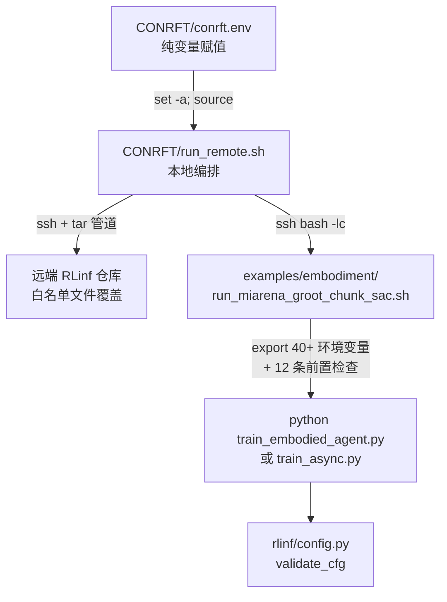

# 第 03 章 启动层：三层脚本与前置门禁

> 前情提要：第 02 章把论文方法和本链路实现对齐了。这一章往下走一层，讲从本地敲一行命令到远端 Python 进程真正跑起来之间发生的所有事——三个脚本、一次白名单代码同步、以及十几条会让脚本直接 `exit 2` 的前置检查。

::: info 目录位置
启动脚本现在放在 **`source/RLinf-groot-n1d7/CONRFT/`**（和 RLinf 代码同仓），不再是 embodied-arena 的顶层目录。下文里的 `CONRFT/xxx` 都是相对这个位置。这样做的好处是启动脚本、白名单、以及它要同步的那些文件在同一个 git 历史里，不会出现"脚本更新了但白名单还是旧的"。
:::

## 知识链接

- 上一章：[从 ConRFT 论文到本链路的映射](./02_论文到实现的映射)
- 下一章：[配置继承链与硬门禁](./04_配置继承链)
- [系列目录](./index)
- 相关：[第 01 章 9.9 阶段一无法续跑](./01_全链路总览#9.-问题-风险与实验安排隐患清单)
- 相关：[第 12 章 Checkpoint 与阶段交接](./12_Checkpoint与阶段交接) — 本章 4.2 节的完整性检查在那里展开

---

## 1. 为什么需要三层

一次训练启动要解决四类完全不同的问题，硬塞在一个脚本里会难以维护：

| 问题 | 谁负责 | 为什么不能合并 |
|------|--------|----------------|
| 这次实验用哪个模型、哪个任务、哪个 run 目录 | `CONRFT/conrft.env` | 这些是**实验参数**，每次实验都可能变，应该是纯数据 |
| 怎么连到远端、同步哪些代码、跑哪个阶段 | `CONRFT/run_remote.sh` | 这是**本地编排**，涉及 ssh 和 tar，只在开发机上跑 |
| Isaac Sim 需要哪 40 个环境变量、checkpoint 完整吗 | `examples/embodiment/run_miarena_groot_chunk_sac.sh` | 这是**远端环境**，和 RLinf 仓库版本绑定，必须跟着代码走 |
| 配置合并、算法校验 | `rlinf/config.py` | 这是 Python 层，第 04 章讲 |

分层的实际好处是：改实验参数只碰 `.env`；改远端环境只碰远端脚本（并且它在 RLinf 仓库里，跟代码一起版本化）；本地编排逻辑基本不变。

三层的调用关系：



## 2. 第一层：`conrft.env`

这个文件只做变量赋值，没有任何逻辑。全文 14 行，分四组。

**第一组：远端连接**

```bash
CONRFT_REMOTE_HOST=localhost
CONRFT_REMOTE_PORT=22220
CONRFT_REMOTE_USER=root
CONRFT_REMOTE_KNOWN_HOSTS=/dev/null
CONRFT_REMOTE_RLINF_ROOT=/robot/data-lab/rlinf-groot/workspace/RLinf
CONRFT_REMOTE_PYTHON=/evaluation/pyenv/eval_env/bin/python
```

`HOST=localhost` + `PORT=22220` 说明这是通过 **ssh 反向隧道**连到 H20 集群头节点的。`KNOWN_HOSTS=/dev/null` 配合 `StrictHostKeyChecking=no` 是因为隧道端口每次可能对应不同的实际主机，维护 known_hosts 没意义。

这个设置有一个真实的危险：**如果隧道断了，`localhost:22220` 可能连回本机**。脚本对此有专门的防护，见 4.1 节。

**第二组：模型与任务**

```bash
GROOT_RL_MODEL_PATH=.../groot_ego_lerobot_merged_multitask_dual_arm/0703/checkpoint-500000
GROOT_RL_BACKBONE_PATH=.../Cosmos-Reason2-2B
GROOT_RL_TASK_CONFIG=/robot/data-lab/embodied-arena/config/dexbench/humanoid/eval/open_laptop.yaml
GROOT_RL_TASK_DESCRIPTION="open the laptop"
GROOT_SAC_BC_DATASET=/robot/data-lab/rlinf-groot/datasets/open_laptop_ego2_ok
```

这五个变量定义了整个实验的**语义身份**。其中三个会进 `replay_semantics_hash`：

- `GROOT_RL_TASK_CONFIG` 的文件内容 SHA256（`task_config_sha256`）
- `GROOT_RL_TASK_DESCRIPTION` 的字符串本身（`task_description`）
- `GROOT_RL_MODEL_PATH` 下 `statistics.json` 的 SHA256（`action_statistics_sha256`）

这意味着**改任务描述里的一个字、或者动一下任务 yaml，都会让阶段一的 checkpoint 无法被阶段二 resume**。这个设计是对的（动作归一化统计量和任务定义变了，replay 里的数据语义就变了），但要知道它的存在。第 12 章展开。

**第三组：run 目录**

```bash
GROOT_CONRFT_CRITIC_RUN_ROOT=.../runs/conrft_critic_open_laptop_seed0_20260727
GROOT_CONRFT_RUN_ROOT=.../runs/conrft_open_laptop_seed0_20260727
GROOT_CONRFT_CRITIC_CHECKPOINT=${GROOT_CONRFT_CRITIC_RUN_ROOT}/miarena_r1_conrft_critic_warmup_gr00t_n1d7/checkpoints/offline_update_800
```

注意第三个变量：它把阶段一的产物路径**写死**成 `offline_update_800`。这个路径同时被两处使用：

1. `run_miarena_groot_chunk_sac.sh` 用它做完整性检查
2. 阶段二配置的 `runner.resume_dir: ${oc.env:GROOT_CONRFT_CRITIC_CHECKPOINT}`

**这就是第 01 章 9.9 的根源**：阶段二永远从阶段一的第 800 次更新恢复，中间的 `offline_update_100..700` 用不上，阶段二自己存的 checkpoint 也用不上。想用别的 checkpoint 只能改这个环境变量。

## 3. 第二层：`run_remote.sh`

五个子命令，都会先跑 `check_remote`。

### 3.1 `sync` 是白名单，不是全量

代码同步这一步值得单独说，因为它的设计取舍很明确。

正常做法是 `rsync -a` 整个仓库。这里没这么做，而是显式列出 21 个文件打包：

```bash
sync_code() {
  cd "${LOCAL_RLINF_ROOT}"
  tar -czf - \
    rlinf/config.py \
    rlinf/data/chunk_sac_bc.py \
    rlinf/data/chunk_sac_replay.py \
    rlinf/data/chunk_sac_schema.py \
    rlinf/data/q_chunk.py \
    rlinf/runners/async_embodied_runner.py \
    rlinf/runners/embodied_runner.py \
    rlinf/workers/actor/__init__.py \
    rlinf/workers/actor/async_fsdp_conrft_policy_worker.py \
    rlinf/workers/actor/fsdp_conrft_policy_worker.py \
    rlinf/workers/actor/fsdp_groot_chunk_sac_policy_worker.py \
    rlinf/workers/actor/conrft/ \
    rlinf/workers/actor/groot_chunk_sac/actor_objectives.py \
    rlinf/workers/actor/groot_chunk_sac/checkpoint.py \
    rlinf/workers/actor/groot_chunk_sac/critic_objectives.py \
    rlinf/workers/env/async_env_worker.py \
    rlinf/workers/rollout/hf/async_huggingface_worker.py \
    examples/embodiment/train_async.py \
    examples/embodiment/train_embodied_agent.py \
    examples/embodiment/run_miarena_groot_chunk_sac.sh \
    examples/embodiment/config/miarena_r1_conrft_gr00t_n1d7.yaml \
    examples/embodiment/config/miarena_r1_conrft_critic_warmup_gr00t_n1d7.yaml \
    tests/unit_tests/test_conrft_objectives.py \
    | ssh "${SSH_OPTIONS[@]}" "${REMOTE}" tar -xzf - -C "${CONRFT_REMOTE_RLINF_ROOT}"
}
```

`tar -czf -` 把打包结果写到 stdout，通过管道给远端的 `tar -xzf -` 直接解压到 RLinf 根目录。整个过程不落地临时文件。

**为什么用白名单**：

- 远端 RLinf 仓库是**多条链路共用**的（Flow-G、QC、pair-SAC 都在跑）。全量同步会把本地的其他改动带过去，可能踩掉别人正在跑的实验。
- 白名单等价于一份**变更清单**：读这 21 行就知道 ConRFT 这条链路碰了哪些文件。这在 review 时很有用。

**白名单的风险**：如果本地改了一个不在名单里的文件，`sync` 不会同步它，远端跑的是旧代码，而且**没有任何提示**。

这个风险曾经是实打实的——早期的名单里没有任何 `rlinf/models/` 下的文件，而第 05、06 章要讲的模型层改动（`sample_chunk_sac_action` 的双轨去噪、`canonicalize_gr00t_chunk_actions` 的 straight-through clip）全在那里。现在名单已经补上了：

```text
rlinf/algorithms/chunk_sac.py
rlinf/envs/miarena/miarena_env.py
rlinf/models/embodiment/modules/chunk_sac_head.py
rlinf/models/embodiment/gr00t/gr00t_n1d7/gr00t_action_model.py
rlinf/workers/env/env_worker.py
```

**但风险模式本身没有消失**：白名单是手工维护的，加一个新文件就要记得加一行。判断"是不是这个坑"的方法很固定——改了代码但远端行为没变，先去名单里 grep 一遍文件名。

**建议**：在 `sync_code` 之后加一句 `git -C "${LOCAL_RLINF_ROOT}" status --porcelain` 的输出对比，把"有本地改动但不在白名单里"的文件打印出来告警。

### 3.2 `run_stage` 的目录保护

```bash
if [[ -d '${run_root}' ]] && [[ -n "$(find '${run_root}' -mindepth 1 -maxdepth 1 -print -quit)" ]]; then
  echo 'Refusing to reuse non-empty formal run directory: ${run_root}' >&2
  exit 2
fi
```

`find -mindepth 1 -maxdepth 1 -print -quit` 是一个"目录是否非空"的高效判断：找到第一个条目就立刻退出，不遍历整个目录树。

**这条保护要防的事**：把两次实验的日志、TensorBoard event、checkpoint 混在一个目录里。混了之后 TensorBoard 的曲线会出现时间倒流、checkpoint 会被覆盖，实验记录直接作废。对于"正式实验"（formal run）这是必要的纪律。

**代价与现状**：这条保护和 RLinf 自己的 resume 机制是冲突的。现在脚本加了一个 `resume-online` 子命令来化解在线阶段的冲突：

```bash
CONRFT/run_remote.sh resume-online
```

它做三件事：跳过目录非空检查、在远端 `find` 出最新的 `global_step_*` 目录、把 `runner.resume_dir=<该目录>` 作为 CLI 参数注入。并且只对在线阶段开放：

```bash
if (( resume_mode )); then
  if [[ "${stage}" != "online" ]]; then
    echo "Only online ConRFT supports formal in-place resume." >&2
    exit 2
  fi
  ...
fi
```

**阶段一仍然不支持原地续跑**，见第 01 章 9.9。这不是遗漏——阶段一的中间 checkpoint（`offline_update_100..700`）已被定为不保留，所以 800 次 warmup 中途失败就换 run root 重跑。`_run_offline_prefix` 本身是支持从 `completed_updates` 继续的：

```python
completed_updates = int(getattr(self, completed_attr))
if completed_updates > total_updates:
    raise ValueError("Checkpoint offline update count exceeds configured offline_updates")
if completed_updates < total_updates:
    self.logger.info("Starting %s offline training at update %d/%d", label, completed_updates, total_updates)
for update_idx in range(completed_updates, total_updates):
    ...
```

但脚本层不让你走到这一步。**修法**：给 `run_stage` 加一个 `--resume` 标志，允许目录非空并自动把 `runner.resume_dir` 指到目录下最新的 `offline_update_*`。

### 3.3 环境变量怎么传到远端

`run_stage` 把所有变量拼成一条 `export` 语句塞进 `bash -lc`：

```bash
remote_shell "set -euo pipefail; <目录检查>; export RLINF_NODE_RANK=0 \
  GROOT_RL_CONFIG_NAME='${config_name}' GROOT_RL_ENTRYPOINT='${entrypoint}' \
  GROOT_RL_MODEL_PATH='${GROOT_RL_MODEL_PATH}' ... RAY_DEDUP_LOGS=0; \
  mkdir -p '${run_root}'; cd '${CONRFT_REMOTE_RLINF_ROOT}'; \
  bash examples/embodiment/run_miarena_groot_chunk_sac.sh 2>&1 | tee '${log_file}'"
```

三个细节：

- **`RLINF_NODE_RANK=0`**：强制声明这是 Ray head 节点。远端脚本会检查它，防止在 4090 节点上误启动（4090 只跑 env worker，没有 actor 的显存）。
- **`RAY_DEDUP_LOGS=0`**：关掉 Ray 的日志去重。默认 Ray 会把多个 worker 的相同日志合并成一条，这在调试分布式问题时会丢掉关键信息（比如"哪个 rank 的 checksum 不匹配"）。
- **`2>&1 | tee`**：stdout 和 stderr 合并后同时输出到终端和日志文件。因为是前台运行（`tee` 而不是 `nohup`），**ssh 断了训练就死**。这是有意的设计（"Training stays in the foreground and must run in a Codex-managed terminal"），但意味着必须在一个能长期保持的终端里跑。

`remote_shell` 用 `printf -v quoted_command '%q'` 做整条命令的 shell 转义，这是防命令注入的正确做法——如果任务描述里带了引号或分号，不转义会破坏远端命令的结构。

## 4. 第三层：`run_miarena_groot_chunk_sac.sh`

304 行，绝大部分是环境变量和 `if` 分支。

### 4.1 隧道自环检测

这是 `check_remote` 里第一个动作，也是最容易被忽略的一条：

```bash
local_hostname="$(hostname)"
remote_hostname="$(ssh "${SSH_OPTIONS[@]}" "${REMOTE}" hostname)"
if [[ "${local_hostname}" == "${remote_hostname}" ]]; then
  echo "Refusing to use a tunnel that resolves back to the local host." >&2
  exit 2
fi
```

**要防的事**：ssh 反向隧道断开后，`localhost:22220` 可能被本机的某个服务占用，于是 `ssh -p 22220 root@localhost` 连回了本机。此时如果继续执行 `sync`，会用本地文件覆盖本地文件（无害）；但如果执行 `warmup`，会在开发机上启动 8 卡 FSDP 训练（开发机没有 8 张 H20，会以各种奇怪的方式失败），更糟的是 `mkdir -p` 会在开发机上创建 `/robot/data-lab/...` 路径。

比较 hostname 是一个简单有效的判据。

### 4.2 在线阶段的四条完整性检查

这四条是阶段二启动前的最后一道闸，也是 handoff 文档里"Gates"那一节的内容：

```bash
elif [[ "${CONFIG_NAME}" == "miarena_r1_conrft_gr00t_n1d7" ]]; then
  [[ "${ENTRYPOINT}" == "examples/embodiment/train_async.py" ]] || {
    echo "Online ConRFT requires train_async.py" >&2; exit 2; }
  [[ -n "${GROOT_CONRFT_RUN_ROOT:-}" ]] || { ...; exit 2; }
  [[ -n "${GROOT_CONRFT_CRITIC_CHECKPOINT:-}" ]] || { ...; exit 2; }
  [[ -f "${GROOT_CONRFT_CRITIC_CHECKPOINT}/runner_state.json" ]] || {
    echo "ConRFT Critic checkpoint is missing runner_state.json" >&2; exit 2; }
  [[ -d "${GROOT_CONRFT_CRITIC_CHECKPOINT}/actor/dcp_checkpoint" ]] || {
    echo "ConRFT Critic checkpoint is missing actor DCP state" >&2; exit 2; }
  component_root="${GROOT_CONRFT_CRITIC_CHECKPOINT}/actor/conrft_components"
  for rank in {0..7}; do
    [[ -f "${component_root}/complete_rank_${rank}" ]] || {
      echo "ConRFT Critic checkpoint is incomplete for source actor rank ${rank}" >&2; exit 2; }
  done
```

逐条说明它在防什么：

| 检查 | 防的事故 |
|------|----------|
| `ENTRYPOINT == train_async.py` | 用同步入口跑在线配置。Python 层的 `validate_conrft_entrypoint_mode` 也会拦，这里是提前拦，省掉几十秒的 Ray 启动 |
| `runner_state.json` 存在 | checkpoint 目录建了但 runner 状态没写完（进程被 kill 在中间） |
| `actor/dcp_checkpoint` 存在 | 模型权重没写完 |
| **8 个 `complete_rank_*` 标记全在** | 这是最关键的一条 |

**为什么需要 `complete_rank_*` 标记**：`save_checkpoint` 的写入顺序是——先 `unlink` 掉旧标记，然后写 DCP 权重、写各 rank 的 sidecar `.pt` 文件，**最后**才 `completion_marker.touch()`：

```python
completion_marker = component_path / f"complete_rank_{self._rank}"
completion_marker.unlink(missing_ok=True)      # 先删旧标记
self._strategy.save_checkpoint(...)             # 写 DCP
torch.save({...}, component_path / f"alpha_rank_{self._rank}.pt")   # 写 sidecar
if replay_checkpointed:
    self.replay_buffer.save_checkpoint(...)     # 写 replay
completion_marker.touch()                       # 最后打标记
```

所以"标记存在"等价于"这个 rank 的所有组件都落盘了"。8 个标记全在，才说明整个 checkpoint 可用。这是一个标准的**写入屏障**模式。

**这里检查几个 rank 是动态决定的。** 早期版本硬编码 `{0..7}`，现在改成先从 sidecar 里读出保存时的 world size：

```bash
checkpoint_world_size="$("${PYTHON_BIN}" -c 'import sys, torch; print(int(torch.load(sys.argv[1], map_location="cpu", weights_only=False)["world_size"]))' "${component_root}/alpha_rank_0.pt")"
[[ "${checkpoint_world_size}" == "4" || "${checkpoint_world_size}" == "8" ]] || {
  echo "Unsupported ConRFT source actor world size: ${checkpoint_world_size}" >&2; exit 2; }
for ((rank = 0; rank < checkpoint_world_size; rank++)); do
  [[ -f "${component_root}/complete_rank_${rank}" ]] || { ...; exit 2; }
done
```

阶段一用 8 个 rank（H20 GPU 0-7），阶段二的 actor 只有 4 个（GPU 4-7，另外 4 个给 rollout）。这个 $8 \to 4$ 的 reshard 是设计内的；它曾经会让两个 checksum 校验被静默跳过，现在通过全张量 checksum 解决了，见第 01 章 9.8 和第 12 章。

另外这段还有一个细节：`conrft_resume_checkpoint` 会先扫一遍 `$@` 看有没有 `runner.resume_dir=` 覆盖，有的话就校验**被覆盖之后**的那个目录。这是给 `resume-online` 用的——否则续跑时校验的还是阶段一的 checkpoint，等于没校验。

### 4.3 阶段一被特殊放行的一条检查

脚本开头有一条看起来奇怪的例外：

```bash
if [[ "${CONFIG_NAME}" != "miarena_r1_sac_flow_g_critic_warmup_gr00t_n1d7" ]]; then
  [[ -f "${GROOT_RL_TASK_CONFIG}" ]] || { echo "Task config not found: ..." >&2; exit 2; }
fi
```

只有 Flow-G 的 critic warmup 被放行，ConRFT 的 critic warmup **没有**被放行——所以 ConRFT 阶段一仍然要求任务配置文件存在。

这是对的：虽然阶段一不启动环境，但 `replay_semantics_hash` 里包含 `task_config_sha256`，所以必须能读到这个文件才能算哈希。Flow-G 那条例外可能是历史遗留。

### 4.4 Isaac Sim 的环境变量

脚本导出了 40 多个变量，分几类：

| 类别 | 变量举例 | 作用 |
|------|----------|------|
| Python 路径 | `PYTHONPATH`（拼了 12 段） | RLinf + embodied-arena 的 7 个子包 + lerobot fork + IsaacLab 的 6 个子包 |
| 资产路径 | `MI_ASSET_ROOT_DIR`、`HUMANOID_DATA_ASSET_DIR` | 场景和机器人 USD 文件 |
| 离线模式 | `HF_HUB_OFFLINE=1`、`TRANSFORMERS_OFFLINE=1` | 禁止 HuggingFace 联网。集群无外网，不设会卡在超时上 |
| EULA | `OMNI_KIT_ACCEPT_EULA=YES` 等 4 个 | Isaac Sim 首次启动的交互式协议确认，不设会卡住等输入 |
| 图形驱动 | `LD_LIBRARY_PATH`、`VK_ICD_FILENAMES`、`VK_DRIVER_FILES` | 指向手动安装的 NVIDIA 580.105.08 驱动库。容器里的驱动版本和宿主机不一致，必须手动指定 Vulkan ICD |
| 其他 | `XDG_RUNTIME_DIR=/tmp/xdg-runtime-root` | 容器里 root 用户没有标准的 runtime 目录 |

这些变量的**唯一价值是让 Isaac Sim 能在这套特定的容器环境里起来**，没有算法含义。但少一个就跑不起来，而且报错信息通常很难定位（比如 Vulkan ICD 找不到会报"无法创建 GPU 上下文"，看不出是环境变量问题）。

注意 `miarena_r1_sac_flow_g_critic_warmup_gr00t_n1d7.yaml` 里也在 `cluster.node_groups[].env_configs[].env_vars` 重复声明了一份 PYTHONPATH 等变量。这是因为 Ray worker 是新进程，不继承 shell 的 export，必须通过 Ray 的环境配置传递。**同一份路径在两个地方维护**，改动时容易漏一处。

## 5. 完整的启动检查清单

把两层脚本的检查按执行顺序汇总，方便排查"为什么脚本 exit 2 了"。

| 顺序 | 检查 | 位置 | 失败信息 |
|------|------|------|----------|
| 1 | 隧道不能自环 | `run_remote.sh` | `Refusing to use a tunnel that resolves back to the local host.` |
| 2 | 远端 Python 可执行 | `check_remote` | `test -x` 静默失败（`set -e` 退出） |
| 3 | 远端 RLinf 根目录存在 | `check_remote` | 同上 |
| 4 | 模型 / backbone / 任务配置 / BC 数据集存在 | `check_remote` | 同上 |
| 5 | run 目录必须为空 | `run_stage` | `Refusing to reuse non-empty formal run directory` |
| 6 | Python 可执行、RLinf 根目录、模型目录 | 远端脚本 | `Python executable not found` 等 |
| 7 | 入口文件存在 | 远端脚本 | `RLinf entrypoint not found` |
| 8 | Hydra 配置文件存在 | 远端脚本 | `Hydra config not found` |
| 9 | `GROOT_SAC_BC_DATASET` 已设且存在 | 远端脚本（`*conrft*` 分支） | `GROOT_SAC_BC_DATASET is required` |
| 10 | `RLINF_NODE_RANK == 0` | 远端脚本 | `This entrypoint must run on the H20 Ray head` |
| 11 | 阶段一：入口必须是 `train_embodied_agent.py` | 远端脚本 | `ConRFT Critic warmup requires train_embodied_agent.py` |
| 12 | 阶段二：入口必须是 `train_async.py` | 远端脚本 | `Online ConRFT requires train_async.py` |
| 13 | 阶段二：checkpoint 三件套 + 8 个 rank 标记 | 远端脚本 | `ConRFT Critic checkpoint is missing/incomplete ...` |
| 14 | 配置合并与算法校验 | `rlinf/config.py` | 见第 04 章 |
| 15 | ConRFT 契约校验 | `EmbodiedConRFTFSDPPolicy._validate_conrft_contract` | 见第 04 章 |
| 16 | 入口与 mode 配对 | `validate_conrft_entrypoint_mode` | `train_async.py only supports embodied_conrft mode=online, got mode=...` |

前 13 条在几秒内完成，后 3 条在 Ray 启动之后（几十秒）。**如果要改配置，尽量让错误落在前 13 条**——这是这套分层设计的实际价值。

## 6. 单元测试这一层

`run_remote.sh test` 会在远端跑：

```bash
cd RLinf && PYTHONPATH=. python -m pytest -q tests/unit_tests/test_conrft_objectives.py
```

只有一个测试文件，覆盖 `conrft/objectives.py` 里的 `conservative_q_loss` 和 `ConRFTActorObjective`。这是纯张量逻辑，不需要 GPU、不需要模型、不需要环境，所以能快速跑。

**为什么这个测试值得单独跑**：`conservative_q_loss` 是整条链路里唯一一段"纯数学、容易写错、且错了不会崩只会静默给出错误梯度"的代码。形状对不上会抛异常（函数开头有三条形状检查），但 logsumexp 的维度选错、归一化常数算错、`max` 的广播方向错——这些都不会报错，只会让保守项失效。有一个单元测试盯着它是必要的。

在本地改完 `conrft/` 下的代码后的正确流程是：`sync` → `test` → `warmup`。跳过 `test` 直接 `warmup`，等 800 次更新跑完才发现保守项一直是 0，代价是几个小时。

## 7. 小结

| 层 | 文件 | 核心职责 | 主要风险 |
|----|------|----------|----------|
| 实验参数 | `CONRFT/conrft.env` | 14 行纯变量 | `GROOT_CONRFT_CRITIC_CHECKPOINT` 写死 `offline_update_800` |
| 本地编排 | `CONRFT/run_remote.sh` | ssh、白名单 tar 同步、run 目录保护 | 白名单不含 `rlinf/models/`，模型层改动不会被同步 |
| 远端环境 | `run_miarena_groot_chunk_sac.sh` | 40+ 环境变量、16 条前置检查 | PYTHONPATH 在脚本和 yaml 里各维护一份 |

**最需要记住的三件事**：

1. **`sync` 是白名单**。改了 `rlinf/models/` 下的文件不会同步过去，而且没有提示。
2. **run 目录必须为空**，所以没有续跑能力（第 01 章 9.9）。
3. **8 个 `complete_rank_*` 标记**是 checkpoint 完整性的唯一可靠判据，因为它是写入屏障的最后一步。

## 下章预告

脚本把 `--config-name miarena_r1_conrft_gr00t_n1d7` 交给了 Hydra。这个配置名背后是五层继承，最终生效的值往往不在你打开的那个文件里。第 04 章会把两条继承链完整展开，列出每一层覆盖了什么、哪些键是死配置、以及 `rlinf/config.py` 和 `_validate_conrft_contract` 里那十几条断言分别在保护什么。

→ [第 04 章 配置继承链与硬门禁](./04_配置继承链)
