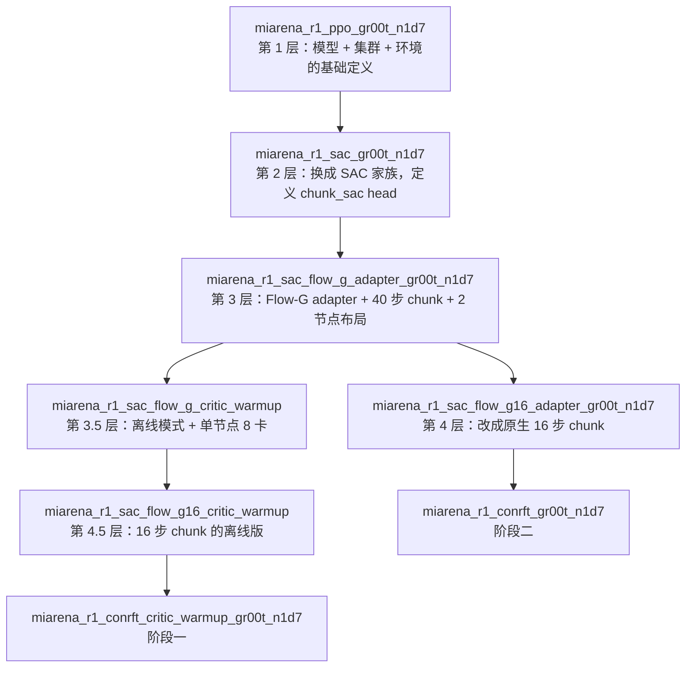

# 第 04 章 配置继承链与硬门禁

> 前情提要：第 03 章把 `--config-name miarena_r1_conrft_gr00t_n1d7` 交给了 Hydra。这一章回答"这个配置名背后到底生效了什么"——五层继承的完整展开、每个关键值的实际来源、以及十几条会在启动时抛异常的断言。

## 知识链接

- 上一章：[启动层与门禁](./03_启动层与门禁)
- 下一章：[模型层三个 ForwardType](./05_模型层三个ForwardType)
- [系列目录](./index)
- 相关：[第 01 章 9.11 死配置清单](./01_全链路总览#9.-问题-风险与实验安排隐患清单)
- 相关：[RLinf 深度解析](/系列/rlinf_deep_dive/) — RLinf 的配置体系整体设计

---

## 1. 为什么配置要继承五层

Hydra 的 `defaults` 列表实现了配置继承。ConRFT 的两个配置各自继承一条链：



每一层的分工：

| 层 | 负责什么 | 关键值 |
|----|----------|--------|
| 1. `ppo` | 模型定义、集群拓扑骨架、环境接口、weight_syncer | `micro_batch_size: 8`、`global_batch_size: 32`、`weight_syncer/patch_syncer` |
| 2. `sac` | 切到 chunk-SAC 家族，定义 critic head 的形状 | `loss_type: embodied_groot_chunk_sac`、`action_dim: 62`、`gamma: 0.99`、`tau: 0.01`、`micro_batch_size: 2` |
| 3. `flow_g_adapter` | Flow-G adapter、2 节点布局、40 步 chunk、在线调度 | `actor_objective: sac_flow_g`、`critic_warmup_updates: 800`、`sac_bc_coef: 0.1`、`flow_g.enabled: true` |
| 3.5 `flow_g_critic_warmup` | 改成离线模式、单节点 8 卡 actor | `chunk_sac.mode: offline_pretrain`、`offline_updates: 800`、`val_check_interval: -1`、actor 占 `0-7` |
| 4 / 4.5 `*_g16_*` | 40 步 → 16 步原生 chunk | `chunk_length: 16`、`action_squash: none`、`padding_value: 0` |
| 5. `conrft_*` | 换目标函数 | `loss_type: embodied_conrft`、`actor_objective: conrft`、`algorithm.conrft.*` |

**这个结构的好处**：ConRFT 的两个配置文件加起来只有 70 行，因为 90% 的设置是共享的。改一处集群布局，Flow-G 和 ConRFT 一起生效。**代价**是"最终生效的值在哪一层"变得不直观，而且会继承一堆无关的键（第 6 节）。

## 2. 关键值的实际来源

这是本章最有用的一张表。左边是你在调参时最可能想改的键，右边是它**实际生效的值**和它来自哪一层。

### 2.1 阶段一（`miarena_r1_conrft_critic_warmup_gr00t_n1d7`）

| 配置键 | 生效值 | 来源层 |
|--------|--------|--------|
| `algorithm.loss_type` | `embodied_conrft` | 5（自己） |
| `algorithm.actor_objective` | `conrft` | 5（自己） |
| `algorithm.chunk_sac.mode` | `offline_pretrain` | 3.5 |
| `algorithm.chunk_sac.offline_updates` | `800` | 3.5 |
| `algorithm.chunk_sac.offline_save_interval` | `100` | 3.5 |
| `algorithm.chunk_sac.offline_train_actor` | `true` | **5（自己）** ← ConRFT 特有 |
| `algorithm.chunk_sac.bc_reward_mode` | `terminal_success` | 5（自己，覆盖 3 的 `paper_final_window`） |
| `algorithm.chunk_sac.bc_dataset_path` | `$GROOT_SAC_BC_DATASET` | 3 |
| `algorithm.chunk_sac.bc_samples_per_episode` | `256` | 3 |
| `algorithm.conrft.cql_alpha` | `0.1` | 5（自己） |
| `algorithm.conrft.cql_n_actions` | `4` | 5（自己） |
| `algorithm.gamma` | `0.99` | 2 |
| `algorithm.tau` | `0.01` | 2 |
| `algorithm.sac_bc_coef` | **`0.1`** | 3 ← 见下方说明 |
| `algorithm.critic_warmup_updates` | `800` | 3 |
| `algorithm.critic_actor_ratio` | `8` | 3 |
| `algorithm.num_updates_per_step` | `4` | 2 |
| `algorithm.sac_flow_bc_warmup_updates` | `512` | 3 |
| `algorithm.entropy_tuning.alpha_type` | `fixed_alpha` | 5（自己，覆盖 3 的 `softplus`） |
| `algorithm.entropy_tuning.initial_alpha` | `0.0` | 5（自己） |
| `algorithm.same_state_td.enabled` | `false` | 5（自己） |
| `runner.max_steps` | `0` | 3.5 |
| `runner.val_check_interval` | `-1` | 3.5 |
| `runner.save_interval` | `-1` | 3.5 |
| `runner.resume_dir` | `null` | 3.5 |
| `cluster.component_placement.actor` | `h20: 0-7`（8 rank） | 3.5 |
| `actor.global_batch_size` | `32` | 1 |
| `actor.micro_batch_size` | `2` | 2 |
| `actor.optim.lr` | `1.0e-4` | 3 |
| `actor.optim.clip_grad` | `0.1` | 3 |
| `actor.model.num_action_chunks` | `16` | 4.5 |
| `actor.model.denoising_steps` | `4` | 3 |
| `actor.model.rl_head_config.chunk_sac.chunk_length` | `16` | 4.5 |
| `actor.model.rl_head_config.chunk_sac.action_squash` | `none` | 4.5 |
| `actor.model.rl_head_config.chunk_sac.actor_backprop_steps` | `4` | 3 |
| `actor.model.rl_head_config.chunk_sac.compute_path_log_prob` | `true` | 3 |
| `actor.model.rl_head_config.chunk_sac.flow_g.enabled` | `true` | 3 |
| `actor.model.rl_head_config.chunk_sac.critic_architecture` | `flat_absolute`（默认值） | 未显式设置 |
| `actor.model.rl_head_config.chunk_sac.eval_initial_noise` | **未设置**（模型层默认 `random`） | 无 |
| `actor.fsdp_config.checkpoint_format` | `dcp` | 3.5 |

**注意 `sac_bc_coef: 0.1` 这一行**：ConRFT 阶段一的配置**没有覆盖**它，所以继承了 Flow-G 的 `0.1`。这个值对 ConRFT 的 actor loss 实际上没有作用（`ConRFTActorObjective` 完全不读 `sac_bc_coef`，它用自己的 `bc_weight_offline`），但**它进了 `resume_config_hash`**。这就是第 01 章 9.3 里那个"阶段二声明 0.0、阶段一实际 0.1"的不一致来源。

**注意 `eval_initial_noise` 这一行**：阶段一的配置链里**从头到尾没有设置过这个键**。模型层 `sample_chunk_sac_action` 用 `self.chunk_sac_config.get("eval_initial_noise", "random")` 兜底，所以行为上等于 `random`；但 `resume_config["chunk_sac"]` 里这个键是**缺失**的，而阶段二的 `stage1_eval_initial_noise: random` 会在期望的哈希里**写入**这个键。缺失 vs 存在 → 哈希不同。同样是 9.3 的来源。

### 2.2 阶段二（`miarena_r1_conrft_gr00t_n1d7`）

只列和阶段一不同的部分。

| 配置键 | 阶段二值 | 阶段一值 | 来源层 |
|--------|----------|----------|--------|
| `algorithm.chunk_sac.mode` | `online` | `offline_pretrain` | 3（阶段二没走 3.5 那条支线） |
| `algorithm.num_updates_per_step` | **`1`** | `4` | 5（自己） |
| `algorithm.critic_actor_ratio` | **`1`** | `8` | 5（自己） |
| `algorithm.sac_bc_coef` | **`0.0`** | `0.1` | 5（自己） |
| `algorithm.sac_flow_bc_warmup_updates` | **`0`** | `512` | 5（自己） |
| `algorithm.critic_warmup_updates` | `800` | `800` | 3（**都没覆盖**，见第 01 章 9.5） |
| `algorithm.allow_stage1_schedule_resume` | `true` | 未设置 | 4 |
| `algorithm.repair_stage1_flow_g_identity` | `true` | 未设置 | 4 |
| `algorithm.stage1_num_updates_per_step` | `4` | — | 4 |
| `algorithm.stage1_critic_actor_ratio` | `8` | — | 4 |
| `algorithm.stage1_sac_flow_bc_warmup_updates` | `512` | — | 4 |
| `algorithm.stage1_eval_initial_noise` | `random` | — | 4 |
| `algorithm.require_empty_pending_on_save` | `true` | 未设置 | 4 |
| `runner.max_steps` / `max_epochs` | `50` / `50` | `0` / `1` | 4 |
| `runner.val_check_interval` | **`-1`** | `-1` | 5（自己，覆盖 4 的 `5`） |
| `runner.save_interval` | `5` | `-1` | 4 |
| `runner.weight_sync_interval_seconds` | `50.0` | — | 5（自己） |
| `runner.resume_dir` | `$GROOT_CONRFT_CRITIC_CHECKPOINT` | `null` | 4（路径被 5 的父层 4 定义，值由环境变量给） |
| `actor.sync_weight_no_wait` | `true` | — | 5（自己） |
| `actor.recv_drain_max_trajectories` | `256` | — | 5（自己） |
| `cluster.component_placement.env` | `4090: 0-3` | — | 5（自己，覆盖 3 的 `4090: 0-1`） |
| `cluster.component_placement.rollout` | `h20: 0-3` | — | 3 |
| `cluster.component_placement.actor` | **`h20: 4-7`（4 rank）** | `h20: 0-7`（8 rank） | 3 |
| `env.train.total_num_envs` | `64` | — | 5（自己） |
| `chunk_sac.eval_initial_noise` | `zero` | 未设置 | 4 |

**`runner.val_check_interval: -1` 这一行是自己显式设的**，不是继承来的——第 4 层 `flow_g16_adapter` 明明写了 `val_check_interval: 5`，阶段二主动把它改成了 `-1`。这说明关掉评测是**有意的选择**（大概是为了让链路先跑通、省掉 48 个评测环境的开销），但它的后果是整个阶段二没有任何可比的评测数据（第 01 章 9.1）。

**`critic_warmup_updates: 800` 两个阶段都没覆盖**，这个值在阶段一其实没有作用（离线路径直接调 `update_one_epoch(train_actor=True)`，不经过 `_should_update_actor`），但在阶段二决定了 actor 从第几次更新开始训。第 01 章 9.5 展开。

## 3. 梯度累积的实际数值

`global_batch_size` 和 `micro_batch_size` 是全局值，但 `gradient_accumulation` 是运行时算出来的，而且**两个阶段不一样**。

$$
\text{gradient\_accumulation} = \frac{\text{global\_batch\_size}}{\text{micro\_batch\_size} \times \text{world\_size}}
$$

**Step 1：这个公式在做什么**

**它算出"一次优化器 step 之前要跑几个 micro-batch 的前向反向"**。因为 `global_batch_size` 是全局的（所有 rank 加起来），每个 rank 只处理 $1/\text{world\_size}$，而每个 rank 一次前向只能放 `micro_batch_size` 个样本。

> **一句话直觉**：显存放不下整批，就切成小份跑，梯度累加起来再更新一次。

**逐符号拆解**：

| 符号 | 含义 | 阶段一 | 阶段二 |
|------|------|--------|--------|
| `global_batch_size` | 一次更新用的总 chunk 数 | 32 | 32 |
| `micro_batch_size` | 单 rank 单次前向的 chunk 数 | 2 | 2 |
| `world_size` | actor FSDP rank 数 | **8** | **4** |
| 每 rank 的 batch | `global / world_size` | 4 | 8 |
| `gradient_accumulation` | micro-batch 数 | **2** | **4** |

**代入计算**：

$$
\text{阶段一：} \quad \frac{32}{2 \times 8} = 2, \qquad \text{阶段二：} \quad \frac{32}{2 \times 4} = 4
$$

**这个差异的影响**：

1. **loss 缩放**。`update_one_epoch` 里 `critic_loss = critic_output.loss / self.gradient_accumulation`，`actor_loss = actor_output.loss / self.gradient_accumulation`。除数不同但因为是"累加 N 份再除 N"，最终梯度的期望是一样的，所以**这个差异是无害的**。
2. **Cal-QL 项的缩放**。第 01 章 9.12 讨论过：ConRFT 的 CQL 项是在 `forward_critic` 里加到 `output.loss` 上的，随后被调用方统一除以 `gradient_accumulation`，所以和 TD 项同尺度。**正确。**
3. **单次更新的实际样本量很小**。阶段一每次更新只看 32 个 chunk，800 次更新总共 $800 \times 32 = 25600$ 个 chunk 样本。BC 数据集每 episode 采 256 个 chunk，所以如果数据集有 50 条 episode，总 chunk 池是 12800，等于每个 chunk 平均被看 2 次。这个数量级下 critic 学到的是"数据集的平均行为"，不太可能过拟合，但也不会很精确。

代码里对可除性有硬断言：

```python
if (self.cfg.actor.global_batch_size % (self.cfg.actor.micro_batch_size * self._world_size) != 0):
    raise ValueError("Chunk SAC offline batch size does not divide FSDP ranks")
```

所以如果把 actor 的 rank 数改成 3 或 5，启动就会失败（$32 \bmod (2\times3) \ne 0$）。改 placement 时要注意。

## 4. `rlinf/config.py` 里的硬门禁

`validate_cfg` 是一个几千行的函数，其中和 ConRFT 相关的断言集中在一段。这些断言是**设计契约的显式表达**——它们标记出"这条链路的哪些参数组合是被允许的"。

先说清楚这段代码要做什么：它在 Hydra 完成配置合并之后、任何 worker 被创建之前运行，目的是把不合法的参数组合拦在启动阶段，而不是让训练跑到一半才出现语义错误。下面逐条看。

```python
chunk_sac_algorithm = cfg.algorithm.loss_type in {"embodied_groot_chunk_sac", "embodied_conrft"}
if chunk_sac_enabled != chunk_sac_algorithm:
    raise ValueError("GR00T Chunk-SAC family algorithms and "
                     "actor.model.rl_head_config.chunk_sac.enabled must be enabled together")
```

**第 1 条**：算法和模型 head 必须同时开或同时关。防的是"配了 ConRFT 但忘了打开 chunk_sac head"——那种情况下模型不会有 critic，报错会发生在很深的地方且难以理解。

```python
if cfg.algorithm.loss_type == "embodied_conrft":
    conrft_config = cfg.algorithm.get("conrft", {})
    cql_alpha = float(conrft_config.get("cql_alpha", 0.0))
    same_state_td_enabled = bool(cfg.algorithm.get("same_state_td", {}).get("enabled", False))
    if cql_alpha <= 0.0:
        raise ValueError("algorithm.conrft.cql_alpha must be positive")
    if same_state_td_enabled:
        raise ValueError("LeRobot-aligned ConRFT does not use same-state TD")
    if (str(cfg.algorithm.get("chunk_sac", {}).get("mode", "online")) == "offline_pretrain"
            and not bool(conrft_config.get("require_mc_returns", False))):
        raise ValueError("ConRFT offline training requires MC returns")
```

**第 2 条 `cql_alpha > 0`**：注意是**严格大于**。想做"关掉保守项的消融实验"不能设 `cql_alpha: 0`，会被拦。要做这个消融必须改代码或者用 `loss_type: embodied_groot_chunk_sac` 走另一条路。这个断言偏严，但它的意图是明确的——ConRFT 的定义里就包含保守项，`cql_alpha=0` 的东西不该叫 ConRFT。

**第 3 条 same-state TD 禁用**：第 02 章 5 节讲过，这是为了对齐 LeRobot 实现，排除本仓库特有的改动。

**第 4 条 离线必须有 MC 回报**：这是 Cal-QL 的定义。没有 $G_t$ 就退化成普通 CQL，第 01 章 9.10 和 [Cal-QL 前置知识](/前置知识/002h_前置知识_CalQL校准保守Q学习) 讲了后果。

```python
    chunk_length = int(OmegaConf.select(cfg, "actor.model.rl_head_config.chunk_sac.chunk_length"))
    actor_objective = str(cfg.algorithm.get("actor_objective", "direct_q"))
    required_chunk_length = int(cfg.actor.model.num_action_chunks)
    if chunk_length != required_chunk_length:
        raise ValueError(f"GR00T N1.7 {actor_objective} requires a {required_chunk_length}-step chunk")
    if cfg.algorithm.loss_type == "embodied_conrft" and required_chunk_length != 16:
        raise ValueError("GR00T N1.7 ConRFT requires the native 16-step chunk")
    if cfg.algorithm.loss_type == "embodied_conrft" and actor_objective != "conrft":
        raise ValueError("GR00T N1.7 ConRFT requires actor_objective=conrft")
    if cfg.algorithm.loss_type == "embodied_conrft" and int(
            OmegaConf.select(cfg, "actor.model.rl_head_config.padding_value", default=-1)) != 0:
        raise ValueError("GR00T N1.7 ConRFT requires padding_value=0")
```

**第 5 条 `chunk_length == num_action_chunks`**：这两个键描述同一件事（一个是模型的 action chunk 数、一个是 critic head 的 chunk 长度），必须一致。

**第 6 条 ConRFT 强制 16 步**：40 步的老配置（Flow-G 用过）在 ConRFT 上被禁止。原因是 GR00T N1.7 的原生 action horizon 就是 16，40 步需要 `processor_action_horizon_extension: repeat_last` 做扩展，那会引入"最后一步被重复 24 次"这种人为结构，和 ConRFT 的 BC loss 语义冲突。

**第 8 条 `padding_value == 0`**：chunk 长度不足时（episode 尾部）用什么值填充。ConRFT 强制 0，因为 W2 项和 BC 项都对 padding 位置做 mask，但 CQL 的候选动作是对整个 $[16,62]$ 张量采样的（没有 mask），padding 位置如果是 $-1$ 会让 Q 网络看到"真实动作里不可能出现的常数"，污染保守项。这条断言很细，但确实必要。

## 5. `_validate_conrft_contract` 的八条

`config.py` 管的是配置层面，`EmbodiedConRFTFSDPPolicy.__init__` 里还有一层运行时契约检查。它在 worker 被 Ray 创建之后、模型加载之前执行。

代码不长，直接看，然后逐条解释每条在防什么：

```python
def _validate_conrft_contract(self) -> None:
    if str(self.cfg.actor.model.model_type) != "gr00t_n1d7":
        raise ValueError("embodied_conrft only supports the existing gr00t_n1d7 model")
    if not bool(self.cfg.actor.model.rl_head_config.chunk_sac.get("enabled", False)):
        raise ValueError("embodied_conrft requires the existing N1.7 chunk_sac head")
    if str(self.cfg.algorithm.get("actor_objective", "")) != "conrft":
        raise ValueError("embodied_conrft requires actor_objective=conrft")
    critic_architecture = str(self.cfg.actor.model.rl_head_config.chunk_sac.get(
        "critic_architecture", "flat_absolute"))
    if critic_architecture != "flat_absolute":
        raise ValueError("embodied_conrft requires the absolute twin-Q critic")
    same_state_td_enabled = bool(self.cfg.algorithm.get("same_state_td", {}).get("enabled", False))
    if self.conrft.require_same_state_td:
        raise ValueError("LeRobot-aligned ConRFT does not use same-state TD")
    if same_state_td_enabled:
        raise ValueError("LeRobot-aligned ConRFT does not use same-state TD")
    if self.conrft.cql_alpha <= 0.0:
        raise ValueError("embodied_conrft requires a positive offline CQL weight")
    if self._conrft_offline_stage and not self.conrft.require_mc_returns:
        raise ValueError("ConRFT offline training requires CalQL MC returns")
```

| 条 | 断言 | 防什么 |
|----|------|--------|
| 1 | `model_type == gr00t_n1d7` | ConRFT 的实现依赖 GR00T N1.7 特有的 `sample_chunk_sac_action` 和 `apply_flow_g` 通路，换成 OpenVLA/Pi0 会在深处炸 |
| 2 | chunk_sac head 已启用 | 和 `config.py` 第 1 条重复，这里是 worker 侧的兜底 |
| 3 | `actor_objective == conrft` | 和 `config.py` 第 7 条重复 |
| 4 | **`critic_architecture == flat_absolute`** | 见下方说明 |
| 5, 6 | same-state TD 双向禁用 | `require_same_state_td` 是 `ConRFTConfig` 里的字段，默认 `False`；这里写成"如果为 True 就报错"，意思是这个字段**永远不能设为 True**（它存在只是为了让配置能显式声明"我不用"） |
| 7 | `cql_alpha > 0` | 和 `config.py` 第 2 条重复 |
| 8 | 离线必须 `require_mc_returns` | 和 `config.py` 第 4 条重复 |

**第 4 条值得展开**：`critic_architecture` 有两个选项（见 `chunk_sac_head.py`）：

| 架构 | 结构 | Q 的语义 |
|------|------|----------|
| `flat_absolute` | 状态编码 + 展平的 $16\times62$ 动作 → 两个 ValueHead | $Q(s,a)$ 直接输出绝对价值 |
| `temporal_bc_relative` | 状态 → 两个 ValueHead 出 $V$；动作经 1D 卷积时序编码 → 两个 head 出 $A$ | $Q = V + A$，$A$ 相对 BC 参考动作 |

ConRFT 强制前者。原因是 Cal-QL 的保守项直接操作 $Q$ 值，而 $Q = V + A$ 的分解会让"压低 $Q$"变成"压低 $V$ 还是压低 $A$"的歧义——如果压低了 $V$，等于说"这个状态不好"，那会污染所有动作的估值，完全违背 CQL 的意图。

而且 `temporal_bc_relative` 的 `uses_distributed_normalizers = True`，那会触发 `cql_scale = 1.0 / gradient_accumulation` 分支（第 01 章 9.12），届时 CQL 项的归一化需要重新推导。**目前这条断言把这个未验证的组合挡在门外，是对的。**

## 6. 死配置清单

第 01 章 9.11 提过，这里给完整列表和判定依据。

ConRFT 覆写了这个方法：

```python
def _sac_flow_in_bc_warmup(self) -> bool:
    return self._conrft_offline_stage
```

而基类的实现是基于 `update_step` 和 `sac_flow_bc_warmup_updates` 的比较（`... <= self.update_step`）。覆写之后，"是否在 BC warmup 阶段"完全由"是不是离线阶段"决定，和 `update_step` 无关。

**因此下列键在 ConRFT 链路上不产生任何训练行为**：

| 键 | 值 | 为什么无效 |
|----|----|------------|
| `sac_flow_bc_warmup_updates` | 阶段一 512 / 阶段二 0 | 只在基类的 `_sac_flow_in_bc_warmup` 里被读，已被覆写 |
| `sac_flow_warmup_bc_coef` | 1.0（继承层 3） | 同上 |
| `sac_bc_coef` | 阶段一 0.1 / 阶段二 0.0 | `ConRFTActorObjective` 用自己的 `bc_weight_*`，不读这个键 |
| `allow_identity_actor_start` | true（层 4） | Flow-G 的启动检查，ConRFT 不走那条路 |
| `stage1_num_updates_per_step` | 4 | 只用于构造 `stage1_schedule_resume_hash` |
| `stage1_critic_actor_ratio` | 8 | 同上 |
| `stage1_sac_flow_bc_warmup_updates` | 512 | 同上 |
| `stage1_eval_initial_noise` | random | 同上 |
| `algorithm.conrft.require_mc_returns`（阶段二） | true | 在线不算 CQL，也不注入 mc_return |
| `algorithm.awr_temperature` / `awr_max_weight` | 1.0 / 20.0 | `actor_use_awr_weights: false`，AWR 通路不启用 |
| `actor_data_filter: all` | all | ConRFT 不做样本筛选，这个值等于"不过滤"，写着是为了明确 |
| `env.eval.evaluation_layout_ids`（48 个） | 见层 4 | **因为 `val_check_interval: -1`，评测不跑，这 48 个 id 一次都用不上** |

**必须强调 `stage1_*` 这四个键的特殊性**：它们"不影响训练行为"，但**决定阶段二能否 resume 成功**（因为它们进 `stage1_schedule_resume_hash`）。这是最容易误判的一类配置——看起来是死的，实际是关键的。第 01 章 9.3 和第 12 章展开。

## 7. 想改参数时的检查顺序

实践建议，按这个顺序想：

1. **这个键在哪一层被设置？** 用 `grep -rn "<键名>" examples/embodiment/config/miarena_r1_{conrft,sac_flow_g16,sac_flow_g,sac,ppo}*.yaml` 从下往上找，最后一个匹配（最靠近叶子的层）生效。
2. **它是不是死配置？** 查上面第 6 节的表。
3. **它会不会进 `resume_config_hash`？** 查 `fsdp_groot_chunk_sac_policy_worker.py` 里 `resume_config` 那个字典的键列表。如果在里面，改它会导致阶段二无法 resume 阶段一——除非同时改 `stage1_*` 的对应声明。
4. **有没有断言拦着？** 查第 4、5 节的 16 条。
5. **改完在哪里能确认生效？** Hydra 会把合并后的完整配置写到 run 目录下（`.hydra/config.yaml`）。**改完之后第一件事就是去那里确认实际值**，不要凭继承链推断。

第 3 步是最容易踩的。举例：想把 `gamma` 从 0.99 改成 0.95，改完之后阶段一重跑没问题，但如果阶段一的 checkpoint 是用 0.99 训的，阶段二用 0.95 就会哈希不匹配直接报错。因为 `gamma` 在 `resume_config` 里。

## 8. 小结

| 主题 | 关键结论 |
|------|----------|
| 继承深度 | 阶段一 6 层、阶段二 5 层；ConRFT 自己只写 70 行 |
| 最容易搞错的值 | `sac_bc_coef`（0.1 vs 0.0）、`eval_initial_noise`（缺失 vs zero）、`critic_warmup_updates`（两阶段都是 800） |
| 梯度累积 | 阶段一 2、阶段二 4（因为 world_size 从 8 变 4），无害 |
| 单次更新样本量 | 32 个 chunk，800 次共 25600 |
| 硬门禁总数 | `config.py` 8 条 + `_validate_conrft_contract` 8 条 |
| 最严的两条 | `cql_alpha > 0`（做不了消融）、`critic_architecture == flat_absolute` |
| 死配置 | 12 类，其中 `stage1_*` 那 4 个"死但关键"（决定 resume 成败） |

## 下章预告

配置层讲完了，接下来是模型层。第 05 章会讲 `ForwardType.SAC` / `SAC_Q` / `SFT` 这三个入口分别做什么，重点是 `sample_chunk_sac_action` 这个 130 行的函数——它怎么把 4 步 Flow Matching 去噪变成一个可微的随机策略、`log_pi` 从哪来、以及 `return_bc_reference=True` 时的"双轨去噪"是怎么用同一份初始噪声同时跑出"带 gate"和"不带 gate"两条轨迹的。W2 项的全部秘密都在那里。

→ [第 05 章 模型层三个 ForwardType](./05_模型层三个ForwardType)
