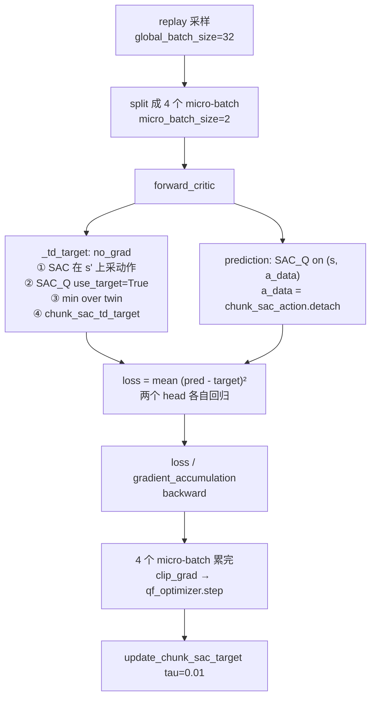

# 第 06 章 Critic 架构与 chunk 级 TD target

> 前情提要：第 05 章讲完了策略怎么采出一个可微的 16 步动作。这一章讲怎么给它打分——`ChunkSACCritic` 的结构、动作进 critic 之前必须经过的三步预处理（这是最容易被忽略但最影响正确性的部分）、以及把 16 步压成一个标量的 Bellman target。

## 知识链接

- 上一章：[模型层三个 ForwardType](./05_模型层三个ForwardType)
- 下一章：[阶段一数据侧：BC replay 与 MC 回报](./07_阶段一数据侧)
- [系列目录](./index)
- 前置：[Q 函数与 Value 函数](/前置知识/000o_前置知识_Q函数与Value函数)
- 前置：[TD 学习与 n 步回报的偏差问题](/前置知识/001k_前置知识_TD学习与n步回报的偏差问题)
- 前置：[SAC Soft Actor-Critic](/前置知识/000k_前置知识_SAC_Soft_Actor_Critic)
- 前置：[TD3](/前置知识/000q_前置知识_TD3) — twin-Q 取小抑制过估计的出处
- 相关：[Q-Chunking：RL 与动作分块](/论文综述/071_QChunking_RL与动作分块) — chunk 级 MDP 的理论
- 相关：[第 01 章 9.6 Q 梯度死区](./01_全链路总览#9.-问题-风险与实验安排隐患清单)

---

## 1. chunk MDP 回顾

第 02 章说过，本链路把整个 16 步序列定义成 MDP 里的**一个动作**。这个决定对 critic 的影响是直接的：

| 元素 | 单步 MDP | 本链路的 chunk MDP |
|------|----------|---------------------|
| 状态 $s$ | 一帧观测 | 一次推理的完整输入：多路相机图像 + 机器人状态 + 语言指令 |
| 动作 $a$ | $\mathbb{R}^{62}$ | $\mathbb{R}^{16\times62}$，展平是 992 维 |
| 奖励 | 一个标量 | 16 步奖励序列，要先聚合成一个标量 |
| 下一状态 $s'$ | 下一帧 | 执行完 16 步之后的观测 |
| 折扣 | $\gamma$ | $\gamma^{16}$ |

用 open_laptop 举例：$s$ 是"笔记本开了 30 度、右手扣在屏幕边缘"这一刻模型看到的全部输入；$a$ 是"接下来 16 步继续往上掀"这段完整轨迹；$s'$ 是 16 步执行完之后开到 45 度的那个状态。

**所以 critic 要学的函数是 $Q: \mathbb{R}^{\text{obs}} \times \mathbb{R}^{16\times62} \to \mathbb{R}$。** 输入里动作那一半有 992 维，这是整个架构设计的出发点。

## 2. `flat_absolute` twin-Q 的结构

先说设计取舍再看代码。992 维的动作有两种处理思路：

- **展平直接喂**：把 $[16, 62]$ reshape 成 $[992]$，和状态特征拼起来进 MLP。简单，但网络必须自己从 992 个输入里学出"哪些维度是同一个关节的不同时刻"这种结构。
- **时序编码**：先用 1D 卷积沿时间轴编码，压成一个低维的动作表示。参数更少、有归纳偏置，但多一层假设。

本链路的 `flat_absolute` 选第一种，代码在 `rlinf/models/embodiment/modules/chunk_sac_head.py`：

```python
self.state_encoder = nn.Sequential(
    nn.Linear(int(state_feature_dim), int(state_latent_dim)),   # 2048+state → 512
    nn.LayerNorm(int(state_latent_dim)),
    nn.GELU(),
)
if self.architecture == "flat_absolute":
    q_input_dim = int(state_latent_dim) + self.chunk_length * self.action_dim
    self.q_heads = nn.ModuleList([
        ValueHead(input_dim=q_input_dim, hidden_sizes=hidden_sizes, output_dim=1,
                  activation="gelu", bias_last=True, layer_norm=True)
        for _ in range(2)                                       # ← twin-Q
    ])
```

前向只有两行：

```python
encoded_state = self.state_encoder(state_features)
q_input = torch.cat((encoded_state, actions.flatten(start_dim=1)), dim=-1)
return torch.cat([head(q_input) for head in self.q_heads], dim=-1)      # [B, 2]
```

维度对照表：

| 阶段 | 张量 | 维度 | 来源 |
|------|------|------|------|
| VLM 特征池化 | `vl_embs.mean(dim=1)` | 2048 | Cosmos-Reason2 第 16 层输出按 token 平均 |
| 状态特征 | `state_features.reshape(B, -1)` | `proj_width` | action head 的 `_encode_state_features` |
| 拼接后 | `state_features`（critic 入参） | 2048 + state | `build_gr00t_value_features` |
| 状态编码 | `encoded_state` | **512** | `state_latent_dim` |
| 动作展平 | `actions.flatten(start_dim=1)` | **992** | $16 \times 62$ |
| Q head 输入 | `q_input` | **1504** | $512 + 992$ |
| 隐层 | — | 512, 512, 512 | `hidden_sizes` |
| 输出 | `q_values` | **[B, 2]** | twin-Q |

**参数量估算**：单个 head 是 $1504\times512 + 512\times512 + 512\times512 + 512\times1 \approx 1.30$ M；两个 head 加 `state_encoder`（约 $2048\times512 \approx 1.05$ M）合计约 **3.7 M**。加上 Flow-G gate 的 3.4 万，整条链路的可训练参数不到 400 万——相对 20 亿的基座模型可以忽略。

**为什么 twin-Q**：两个独立初始化的 head 各自估 $Q$，用到的时候取 $\min$。这是 [TD3](/前置知识/000q_前置知识_TD3) 的做法，目的是抑制过估计——两个网络在同一个 OOD 动作上同时给出虚高值的概率远小于单个网络。代码里取 min 的地方有两处：

```python
policy_q = q_values.min(dim=-1).values          # actor 目标：min_i Q_i(s, π(s))
next_q = model(..., use_target=True).min(dim=-1).values   # TD target
```

而 critic 自己的 TD loss 是**两个 head 分别**回归同一个 target：

```python
loss = (prediction - target[:, None]).square().mean()
```

`prediction` 是 $[B,2]$，`target[:, None]` 是 $[B,1]$，广播之后两个 head 各自算 MSE。所以它们不共享梯度、保持独立性。

## 3. 动作进 critic 之前的三步预处理

这一节是本章最重要的部分。`get_chunk_sac_q_values` 在把动作交给 critic 之前做了三件事，每一件都会影响正确性。

```python
critic_features = build_gr00t_value_features(
    vl_embs, state_features,
    value_vlm_mode=self.chunk_sac_config.get("value_vlm_mode", "mean_token"),
    use_vlm_value=self.chunk_sac_config.get("use_vlm_value", False),
    detach_critic_input=True,                                    # ① 切断梯度
)
actions = canonicalize_gr00t_chunk_actions(                      # ② + ③
    actions.float(), self.chunk_sac_action_min, self.chunk_sac_action_max,
    valid=valid,
    straight_through_clip=bool(self.chunk_sac_config.get("straight_through_action_clip", False)),
)
```

### 3.1 第一步：`detach_critic_input=True` 切断状态侧梯度

`build_gr00t_value_features` 最后一行是：

```python
return value_features.detach() if detach_critic_input else value_features
```

`detach_critic_input=True` 是**硬编码**的（不是配置），意思是 critic 的 loss **绝不会**通过状态特征回传到 VLM backbone 或 state encoder。

**为什么必须这样**：backbone 本来就在 `torch.no_grad()` 下跑（第 05 章），所以从 backbone 那边看没区别。但 `state_features` 来自 `action_head._encode_state_features`，那是 action head 的一部分，理论上可训练。如果 critic 的梯度能流进去，会出现两个问题：

1. critic 为了降低自己的 TD loss，可能去修改状态表示——而同一个状态表示也被策略使用，等于 critic 在偷偷改策略的输入。
2. 表示崩塌：最小化 TD 误差最省力的方式之一是让状态特征退化成常数。

配置里另有一个 `freeze_critic_feature_encoder: true`（继承自第 2 层），它在 `model_provider_func` 里通过 `_is_critic_feature_parameter(name)` 把相关参数排除在可训练集合之外。两道保险。

**结果**：critic 是一个**纯粹的浅层回归器**，只学"给定固定的状态表示，这段动作值多少分"。它学不到新的视觉表示。这既是它只有 370 万参数还能用的原因，也是它的能力上限——如果基座模型的表示里没有区分"抓稳了"和"抓滑了"的信息，critic 就永远学不出来。

### 3.2 第二步：clamp 到 $[-1,1]$，反向按恒等传梯度

```python
bounded = actions.clamp(-1.0, 1.0)
clipped = (
    actions + (bounded - actions).detach() if straight_through_clip else bounded
)
```

**Step 1：这两行在做什么**

**前向输出的是 clamp 之后的值，反向传的却是恒等梯度。** 这是标准的 straight-through estimator。

> **一句话直觉**：告诉 critic"我只接受 $[-1,1]$ 里的动作"，但告诉策略"你越界了多少，我就按越界多少给你梯度"。

**逐项拆解**：

| 表达式 | 前向值 | 反向梯度 |
|--------|--------|----------|
| `bounded = actions.clamp(-1,1)` | $\mathrm{clip}(a)$ | 越界处为 0（clamp 的真实导数） |
| `(bounded - actions).detach()` | $\mathrm{clip}(a) - a$（常数） | 恒为 0 |
| `actions + (bounded - actions).detach()` | $a + \mathrm{clip}(a) - a = \mathrm{clip}(a)$ | $\partial/\partial a = 1$ |

**代入数字**：某个动作坐标 $a = 1.3$。

- 不开 straight-through：`clipped = 1.0`，$\partial \text{clipped}/\partial a = 0$。critic 给出的 $Q$ 对这个坐标的梯度是 $\frac{\partial Q}{\partial \text{clipped}} \times 0 = 0$。**策略收不到任何信号**，Q 项对这个维度完全失效。
- 开 straight-through：`clipped = 1.0 + (1.0 - 1.3) - (-0.3)`……更直接地看，前向值是 $1.3 + (1.0 - 1.3) = 1.0$（和上面一样），但 $\partial \text{clipped}/\partial a = 1$。假设 $\frac{\partial Q}{\partial \text{clipped}} = -0.4$（critic 认为这个坐标应该更小），那么策略收到的梯度就是 $-0.4$，**会被推回边界内**。

**为什么需要它**：本链路的 `action_squash: none`，策略输出没有 tanh 约束，可以漂到 $[-1,1]$ 之外；而 critic 只在 $[-1,1]$ 上有定义（`action_min/max` 描述的是执行时的动作范围）。不开 straight-through 就会出现"策略漂出去之后 Q 项再也推不动它"的死区，只剩 BC 项和 W2 项能拉回来。第 01 章 9.6 记录了这个问题，两个阶段现在都设了 `straight_through_action_clip: true`。

**要注意的是**：`reference_actions` 那次 `canonicalize` **没有**传 `straight_through_clip`：

```python
if reference_actions is not None:
    reference_actions = canonicalize_gr00t_chunk_actions(
        reference_actions.float(), self.chunk_sac_action_min, self.chunk_sac_action_max, valid=valid,
    )
```

这是对的——参考动作来自冻结的 BC 通路，本来就不需要梯度。（顺带说明：`reference_actions` 只在 `temporal_bc_relative` 架构下真正被使用，ConRFT 强制 `flat_absolute`，所以这条分支在本链路是死代码，见 3.4 节。）

### 3.3 第三步：rot6d 的 Gram-Schmidt 重正交化

这一步是 GR00T 动作表示特有的，也是最容易被忽略的。62 维动作的分组是：

| 切片 | 含义 | 维度 |
|------|------|------|
| `[0:3]` | 左手末端位置 | 3 |
| `[3:9]` | **左手末端旋转（rot6d）** | 6 |
| `[9:12]` | 右手末端位置 | 3 |
| `[12:18]` | **右手末端旋转（rot6d）** | 6 |
| `[18:40]` | 左手手指 | 22 |
| `[40:62]` | 右手手指 | 22 |

rot6d 是旋转矩阵前两列的展平表示。它的合法集合不是整个 $\mathbb{R}^6$——两列必须**单位长度且互相垂直**。策略输出的 6 个数几乎不可能自动满足这个约束，执行时下游会做一次 Gram-Schmidt 正交化再转成旋转矩阵。

问题来了：**如果 critic 看到的是未正交化的原始 6 个数，那么"执行时等价的两个动作"在 critic 眼里是不同的。** 比如 $(2, 0, 0, 0, 2, 0)$ 和 $(1,0,0,0,1,0)$ 正交化之后是同一个旋转，但作为 MLP 的输入完全不同。critic 会给它们不同的 $Q$ 值，而这个差异是**纯粹的表示冗余**，不对应任何物理差异。

所以 `canonicalize_gr00t_chunk_actions` 把两个 rot6d 切片做一遍和执行时相同的正交化：

```python
for rotation_slice in GR00T_ROT6D_SLICES:            # (slice(3,9), slice(12,18))
    rotation = physical[..., rotation_slice]          # 先反归一化到物理量纲
    first = F.normalize(rotation[..., :3], dim=-1, eps=1e-6)          # 第一列归一
    second = rotation[..., 3:]
    second = second - (first * second).sum(dim=-1, keepdim=True) * first   # 去掉平行分量
    second = F.normalize(second, dim=-1, eps=1e-6)                    # 第二列归一
    canonical_rotation = torch.cat((first, second), dim=-1)
    rotation_min = action_min[..., rotation_slice]
    rotation_range = (action_max - action_min)[..., rotation_slice].clamp_min(1e-8)
    canonical[..., rotation_slice] = 2.0 * (canonical_rotation - rotation_min) / rotation_range - 1.0
```

**这段的逻辑顺序值得说清楚**：

1. `physical = (clipped + 1.0) * 0.5 * (action_max - action_min) + action_min` —— 先把归一化动作还原成物理量纲。正交化必须在物理量纲下做，因为归一化是逐维线性变换，会破坏"两列垂直"这个几何关系。
2. Gram-Schmidt：第一列直接归一化；第二列减掉它在第一列方向上的投影，再归一化。得到一对正交单位向量。
3. 再变换回 $[-1,1]$，写回 `canonical` 对应的切片。

**代入数字**：假设某个时间步的左手 rot6d 在物理量纲下是 $(0.8, 0.6, 0.0,\; 0.5, 0.5, 0.0)$。

- $\|(0.8,0.6,0)\| = 1.0$，所以 `first` $= (0.8, 0.6, 0)$。
- 投影：$(0.8,0.6,0)\cdot(0.5,0.5,0) = 0.4 + 0.3 = 0.7$。
- `second` $= (0.5,0.5,0) - 0.7\times(0.8,0.6,0) = (0.5-0.56,\ 0.5-0.42,\ 0) = (-0.06, 0.08, 0)$。
- $\|(-0.06,0.08,0)\| = 0.1$，归一化得 `second` $= (-0.6, 0.8, 0)$。
- 验证垂直：$0.8\times(-0.6) + 0.6\times0.8 = -0.48 + 0.48 = 0$ ✓

所以 critic 实际看到的是 $(0.8, 0.6, 0, -0.6, 0.8, 0)$ 而不是原始的第二列 $(0.5,0.5,0)$。**注意第二列被改动得很大**——这说明这一步不是可选的清理，它实质性地改变了 critic 的输入。

**位置维度和手指维度不做任何处理**，只有 clamp。它们没有几何约束。

最后还有一步 mask：

```python
if valid is not None:
    canonical = canonical * valid.to(canonical.dtype).unsqueeze(-1)
```

padding 位置被清零。配合 `padding_value: 0`（第 04 章的硬断言），保证"无效时间步"在 critic 输入里是确定的 0 而不是任意值。

### 3.4 为什么 ConRFT 强制 `flat_absolute`

`ChunkSACCritic` 支持另一种架构 `temporal_bc_relative`——状态和动作分开编码，动作部分只编码"相对 BC 动作的偏移"。两者对比：

| | `flat_absolute` | `temporal_bc_relative` |
|---|---|---|
| 结构 | 状态编码 + 展平动作 → 2 个 ValueHead | 状态 → 2 个 ValueHead 出 $V$；动作差经 1D 卷积 → 2 个 head 出 $A$ |
| 输出 | $Q(s,a)$ | $Q = V(s) + A(s, a - a_{\text{BC}}) - A(s, 0)$ |
| 需要参考动作 | 否 | **是**（`uses_bc_reference = True`） |
| `uses_distributed_normalizers` | `False` | `True` |

ConRFT 的两处断言（`config.py` 和 `_validate_conrft_contract`）都要求 `flat_absolute`。原因有两条：

**第一条，语义上的**。Cal-QL 的保守项直接操作 $Q$ 值：压低候选动作的 $Q$、抬高数据动作的 $Q$。在 $Q = V + A$ 的分解下，"压低 $Q$"变成了"压低 $V$ 还是压低 $A$"的歧义。如果梯度落在 $V$ 上，等于说"这个**状态**不好"——而 $V$ 被这个状态下的**所有**动作共享，包括数据动作。保守项会同时压低数据动作的 $Q$，和它自己的第二项（抬高数据动作）直接对抗。CQL 的整个机制建立在"数据动作和 OOD 动作可以被区别对待"之上，$V/A$ 分解破坏了这个前提。

**第二条，工程上的**。`temporal_bc_relative` 的 `uses_distributed_normalizers = True`，会触发 `forward_critic` 里那个分支：

```python
cql_scale = (
    1.0 / self.gradient_accumulation
    if self.critic_objective is not None and self.critic_objective.uses_distributed_normalizers
    else 1.0
)
```

也就是 CQL 项的归一化会走另一条路（第 08 章会完整推导为什么现在这条路是对的）。这个组合从来没被验证过，断言把它挡在门外是对的。

## 4. chunk 级 TD target

现在算 target。这是 critic 的监督信号。

### 4.1 先把 16 步奖励压成一个标量

**Step 1：这个公式在做什么**

**它把一个 chunk 内 16 步的奖励序列，按时间折扣加权求和，压成一个标量**，作为 Bellman 方程里的"即时奖励"。

$$
R_{\text{chunk}} = \sum_{h=0}^{15} \gamma^{h} \cdot r_h \cdot \mathbb{1}[\text{valid}_h]
$$

> **一句话直觉**：这 16 步里实际拿到的分，越靠后的打折越多，加起来。

**逐符号拆解**：

| 符号 | 数学含义 | 直觉 | 具体是什么 |
|------|----------|------|-----------|
| $h$ | chunk 内的步索引 | 第几个物理步 | $0..15$ |
| $r_h$ | 第 $h$ 步的即时奖励 | 环境给的分 | `chunk_sac_rewards[:, h]`，本链路只有成功那一步是 $+1$ |
| $\gamma^h$ | 折扣权重 | 越靠后越不值钱 | $0.99^h$，从 $1.0$ 递减到 $0.99^{15}=0.860$ |
| $\mathbb{1}[\text{valid}_h]$ | 有效掩码 | padding 步不算 | `chunk_sac_valid[:, h]` |

代码在 `rlinf/algorithms/chunk_sac.py`：

```python
def discounted_chunk_return(rewards, valid, gamma):
    discounts = torch.pow(
        torch.as_tensor(gamma, device=rewards.device, dtype=rewards.dtype),
        torch.arange(rewards.shape[-1], device=rewards.device, dtype=rewards.dtype),
    )
    return (rewards * valid.to(rewards.dtype) * discounts).sum(dim=-1)
```

**代入数字**（本链路的 `terminal_success` 奖励）：

- 情况 A：这个 chunk 里没有成功，全部 $r_h = 0$ → $R_{\text{chunk}} = 0$。**绝大多数样本都是这种情况。**
- 情况 B：成功发生在 chunk 的第 12 步（$h=12$），$r_{12}=1$，其余为 0 → $R_{\text{chunk}} = 0.99^{12} = 0.886$。
- 情况 C：成功发生在最后一步（$h=15$）→ $R_{\text{chunk}} = 0.99^{15} = 0.860$。

**为什么折扣要从 chunk 内部开始算**：如果把 16 步当成一个原子动作、只用 $\sum r_h$（不折扣），那么"第 1 步就成功"和"第 16 步才成功"会得到相同的回报，策略就没有动机尽早完成任务。逐步折扣保留了这个动机。

**为什么用 `valid` 掩码**：episode 尾部的 chunk 可能只有 11 步有效，后 5 步是 padding。padding 的奖励是 0，但如果不 mask，将来换成有负奖励的方案（比如 `paper_final_window` 的末 15 步 $\pm1$）就会把 padding 当成真实的惩罚。

### 4.2 加上 bootstrap

**Step 1：这个公式在做什么**

**它把"这个 chunk 内确定拿到的回报"和"16 步之后目标网络对剩余未来的估计"加起来，得到 critic 的回归目标。**

$$
y = R_{\text{chunk}} + \gamma^{16} \cdot m \cdot \Big( \min_{i\in\{1,2\}} Q^{\text{target}}_i\big(s', \pi(s')\big) - \alpha \log \pi(\cdot|s') \Big)
$$

> **一句话直觉**：这一段路实际赚的 + 打个大折扣的"从终点继续往下能赚多少"。

**逐符号拆解**：

| 符号 | 数学含义 | 直觉 | 具体是什么 |
|------|----------|------|-----------|
| $R_{\text{chunk}}$ | chunk 内折扣回报 | 已经确定的部分 | 4.1 节算出来的标量 |
| $\gamma^{16}$ | chunk 级折扣 | 跨过 16 个物理步的贴现 | $0.99^{16} = \mathbf{0.851}$ |
| $m$ | bootstrap mask | episode 是否还在继续 | `chunk_sac_bootstrap_mask`，terminal 时为 0 |
| $s'$ | 下一个决策状态 | 16 步执行完之后的观测 | `extract_chunk_sac_next_inputs(data)` |
| $\pi(s')$ | 目标策略在 $s'$ 上的采样 | **当前**策略，不是旧策略 | `model(ForwardType.SAC, next_inputs)` |
| $Q^{\text{target}}_i$ | 第 $i$ 个目标 critic head | EMA 慢副本 | `chunk_sac_target_critic` |
| $\min_i$ | twin 取小 | 抑制过估计 | `.min(dim=-1).values` |
| $\alpha$ | 熵温度 | 熵正则强度 | 本链路 `fixed_alpha` + `initial_alpha: 0.0` → **恒为 0** |
| $\log\pi$ | 策略对数密度 | 熵项 | 本链路 `compute_path_log_prob: false` → **恒为 0** |

代码：

```python
def chunk_sac_td_target(rewards, valid, bootstrap_mask, next_q, next_log_pi, alpha, gamma):
    chunk_return = discounted_chunk_return(rewards, valid, gamma)
    continuation = gamma ** rewards.shape[-1]                 # γ^16
    return chunk_return + continuation * bootstrap_mask.to(chunk_return.dtype) * (
        next_q - torch.as_tensor(alpha, ...) * next_log_pi
    )
```

target 的构造在 `ChunkSACCriticObjective._td_target`，整段在 `torch.no_grad()` 里：

```python
with torch.no_grad():
    next_policy = model(forward_type=ForwardType.SAC, forward_inputs=next_inputs,
                        return_bc_reference=self.uses_bc_reference)     # ConRFT: False
    next_q = model(forward_type=ForwardType.SAC_Q, forward_inputs=next_inputs,
                   actions=next_policy["actions"], use_target=True, ...).min(dim=-1).values
    if entropy_temperature is None:
        next_log_pi = torch.zeros_like(next_q, dtype=torch.float32)
        alpha = 0.0
    else:
        next_log_pi = next_policy["log_pi"].float()
        alpha = entropy_temperature.compute_alpha().detach()
    return chunk_sac_td_target(...)
```

**代入完整数字**。取 $\gamma=0.99$，$H=16$，$\gamma^{16}=0.851$，$\alpha=0$：

情况 A（普通中间 chunk，没成功，episode 继续）：$R_{\text{chunk}}=0$，$m=1$，目标网络给 $\min_i Q^{\text{target}}_i = 0.62$：

$$
y = 0 + 0.851 \times 1 \times (0.62 - 0) = \mathbf{0.528}
$$

情况 B（成功发生在第 12 步，episode 终止）：$R_{\text{chunk}}=0.886$，$m=0$：

$$
y = 0.886 + 0.851 \times 0 \times (\cdots) = \mathbf{0.886}
$$

情况 C（失败终止，episode 结束但没成功）：$R_{\text{chunk}}=0$，$m=0$：

$$
y = 0 + 0 = \mathbf{0}
$$

**梯度方向**：如果 critic 当前在情况 A 的样本上输出 $0.45 < 0.528$，TD loss 的梯度会把这个 $(s,a)$ 的估值往上调 —— 意思是"从这个状态出发按当前策略走下去还有 0.528 的价值，你估低了"。

**Q 值的合理范围**：把上面三种情况串起来看，成功轨迹上 $Q \approx \gamma^{k}$（$k$ 是到成功还剩几个物理步），失败轨迹上 $Q \approx 0$。所以**一切合理的 $Q$ 值都落在 $[0, 1]$**。这个观察在第 08 章判断 Cal-QL 保守项的量级、以及第 13 章设告警阈值时都会用到。

**为什么 $\gamma^{16}=0.851$ 这个数值重要**：它意味着 bootstrap 项的权重不到 0.9。相比单步 MDP 的 $\gamma=0.99$，chunk MDP 的 bootstrap 衰减快得多——**这是 chunk 化的一个额外好处**：TD 误差沿轨迹传播时衰减更快，$Q$ 值发散的风险更低。代价是有效视野变短：$Q$ 实质上只能"看到"约 $1/(1-0.851) \approx 6.7$ 个 chunk，也就是 107 个物理步。对最长 350 步的 episode，这意味着**开局阶段的状态几乎看不到终局奖励**。

### 4.3 target 网络的 EMA 更新

target 网络是在线 critic 的慢副本，每次 critic 更新之后按 $\tau$ 插值一次：

```python
if train_critic:
    model = self.model.module if hasattr(self.model, "module") else self.model
    model.action_head.update_chunk_sac_target(float(self.cfg.algorithm.tau))
```

```python
@torch.no_grad()
def ema_update_from(self, online, tau):
    for target_parameter, online_parameter in zip(self.parameters(), online.parameters(), strict=True):
        target_parameter.lerp_(online_parameter, tau)
```

$$
\theta^{\text{target}} \leftarrow (1-\tau)\,\theta^{\text{target}} + \tau\,\theta
$$

**Step 1：这个公式在做什么**

**它让 target 网络缓慢跟随在线网络**，避免"target 随着被训练的网络一起跳动"导致的自激振荡。

> **一句话直觉**：拿一个反应很慢的副本当尺子，尺子自己别乱动。

**逐符号拆解**：

| 符号 | 含义 | 值 |
|------|------|-----|
| $\tau$ | 插值系数 | `algorithm.tau: 0.01` |
| $\theta$ | 在线 critic 参数 | 每次更新都变 |
| $\theta^{\text{target}}$ | 目标 critic 参数 | 只通过这个式子变 |

**代入数字**：$\tau = 0.01$ 意味着每次更新 target 只走向在线网络 1%。等价的"半衰期"是

$$
n_{1/2} = \frac{\ln 0.5}{\ln(1-0.01)} = \frac{-0.693}{-0.01005} \approx 69 \text{ 次更新}
$$

也就是说 target 网络大致反映的是**69 次更新之前**的在线网络。放到本链路：阶段一 800 次更新里，target 会完整跟上约 11.6 个半衰期，足够收敛；阶段二 1750 次更新同理。

**注意 `strict=True`**：`zip(..., strict=True)` 要求两个网络的参数列表长度完全一致，不一致直接抛异常。这是防止 target 和 online 结构漂移的保险——在 FSDP 分片和 reshard 之后这类问题不是假想的。

**注意只在 `train_critic` 时更新**：如果某次更新只训 actor（`critic_actor_ratio > 1` 的场合），target 不动。ConRFT 在线阶段 `critic_actor_ratio: 1`，每次都训 critic，所以 target 每次都更新。

## 5. 一次 critic 更新的完整数据流

把前面拼起来。以阶段二（无 Cal-QL）的一个 micro-batch 为例：



几个数值：`gradient_accumulation = 32 / 2 / 4 = 4`（阶段二 4 个 rank），critic 的 `clip_grad` 来自 `actor.critic_optim.clip_grad`。

**注意 `prediction` 用的动作是 `data["chunk_sac_action"].detach()`**：

```python
prediction_output = model(
    forward_type=ForwardType.SAC_Q,
    forward_inputs=data,
    actions=data["chunk_sac_action"].detach(),
    ...
)
```

也就是 replay 里**实际执行过的**动作，不是策略当前会采的动作。这是 off-policy 的核心：critic 学的是 $Q^\pi$ 在数据分布上的取值，target 里的 $\pi(s')$ 才引入当前策略。`detach()` 是冗余的保险（replay 里的张量本来就没有梯度）。

**backbone 前向次数**：这一次 critic 更新里，`_prepare_chunk_sac_features` 被调了 3 次——`_td_target` 里的 SAC 一次、`_td_target` 里的 SAC_Q 一次、`prediction` 一次。都在 `no_grad` 下，但每次都是完整的 VLM 前向。这是 chunk-SAC 系列吞吐的主要瓶颈。第 08 章会看到阶段一因为 Cal-QL 还要再加两次。

## 6. 小结

| 主题 | 关键结论 |
|------|----------|
| 架构 | `flat_absolute` twin-Q：状态编码 512 + 展平动作 992 → 1504 维输入 → 两个 3 层 MLP |
| 参数量 | 约 3.7 M，相对 2 B 基座可忽略 |
| 状态侧梯度 | `detach_critic_input=True` 硬编码 + `freeze_critic_feature_encoder: true` 两道保险，critic 学不到新表示 |
| 动作预处理 | ① detach 状态 ② clamp + straight-through 梯度 ③ rot6d Gram-Schmidt 重正交化 ④ padding 清零 |
| 为什么强制 `flat_absolute` | $Q=V+A$ 分解会让 Cal-QL 的保守项和它自己的第二项对抗；且 `uses_distributed_normalizers=True` 会改变 CQL 的归一化路径 |
| chunk 折扣 | chunk 内逐步 $\gamma^h$；跨 chunk $\gamma^{16} = 0.851$ |
| 有效视野 | 约 $1/(1-0.851) = 6.7$ 个 chunk = 107 个物理步 |
| Q 值合理范围 | $[0, 1]$（`terminal_success` + $\gamma^k$） |
| 熵项 | $\alpha \equiv 0$ 且 $\log\pi \equiv 0$，TD target 里的熵项完全消失 |
| target 网络 | $\tau = 0.01$，半衰期约 69 次更新 |
| 每次 critic 更新的 VLM 前向 | 3 次（阶段二）；阶段一因 Cal-QL 变成 5 次 |

## 下章预告

Critic 的结构和 target 都清楚了，但阶段一的数据是从哪来的？第 07 章讲阶段一的数据侧：BC 数据集怎么被切成 16 步 chunk、`terminal_success` 奖励规则的精确定义、蒙特卡洛回报 $G_t$ 怎么算出来并注入 replay、以及为什么 Cal-QL 要求 replay 必须按 episode 组织而不能按 transition 存。

→ [第 07 章 阶段一数据侧：BC replay 与 MC 回报](./07_阶段一数据侧)
