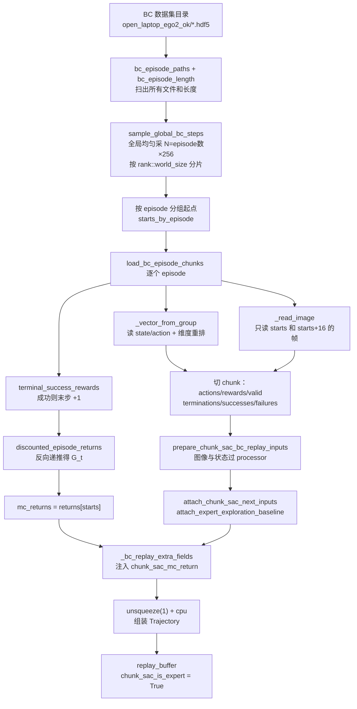

# 第 07 章 阶段一数据侧：BC replay 与 MC 回报

> 前情提要：第 06 章讲完了 critic 的结构和 TD target。这一章回答"阶段一的数据从哪来"——一批 HDF5 演示怎么变成带 `chunk_sac_mc_return` 字段的 replay buffer，`terminal_success` 奖励规则的精确定义，以及为什么 Cal-QL 要求 replay 必须按 episode 组织。

## 知识链接

- 上一章：[Critic 架构与 chunk 级 TD target](./06_Critic架构与TD目标)
- 下一章：[阶段一 Critic：Cal-QL 保守项](./08_阶段一CalQL保守项)
- [系列目录](./index)
- 前置：[Cal-QL 校准保守 Q 学习](/前置知识/002h_前置知识_CalQL校准保守Q学习) — MC 回报下界的原理
- 前置：[蒙特卡洛采样](/前置知识/002c3_前置知识_蒙特卡洛采样)
- 前置：[Replay Buffer 经验回放](/前置知识/000r_前置知识_Replay_Buffer_经验回放)
- 前置：[行为克隆与 RL 微调范式](/前置知识/000d_前置知识_行为克隆与RL微调范式)
- 相关：[第 01 章 9.10 Cal-QL 下界的有效性](./01_全链路总览#9.-问题-风险与实验安排隐患清单)

---

## 1. 一个矛盾：RL 需要 transition，但演示数据是轨迹

阶段一没有环境。它要训 critic，而 critic 的 TD loss 需要形如 $(s, a, r, s')$ 的转移。但手里的东西是一批人类遥操作的 HDF5 文件，每个文件是一条完整轨迹：$T$ 帧观测、$T$ 个动作、一个成功标志。

从轨迹造 transition 本身不难。难的是**这条链路的"动作"是 16 步 chunk**，所以要造的是：

$$
\big(s_t,\ a_{t:t+16},\ r_{t:t+16},\ s_{t+16}\big)
$$

也就是"从第 $t$ 步的观测出发，接下来 16 步的动作序列，这 16 步的奖励序列，以及第 $t+16$ 步的观测"。

这件事由 `rlinf/data/chunk_sac_bc.py` 的 `load_bc_episode_chunks` 完成。整个流程分五步，下面逐个拆。

## 2. 第一步：采样起点

一条 300 帧的 episode 可以切出多少个 chunk？如果按不重叠切，只有 $\lfloor 300/16 \rfloor = 18$ 个。这太少了——一批 50 条 episode 只能得到 900 个样本，而阶段一 800 次更新每次要 32 个，总需求是 25600。

所以做法是**随机起点、允许重叠**。而且采样是在**整个数据集的物理步上均匀**做的，不是每条 episode 固定采 N 个：

```python
def sample_global_bc_steps(episode_lengths, num_samples, *, world_size, rank, generator):
    cumulative_lengths = torch.tensor(episode_lengths, dtype=torch.int64).cumsum(0)
    flat_steps = torch.randint(
        int(cumulative_lengths[-1]), (num_samples,), generator=generator,
    )[rank::world_size].contiguous()
    episode_indices = torch.searchsorted(cumulative_lengths, flat_steps, right=True)
    episode_offsets = torch.cat((torch.zeros(1, dtype=torch.int64), cumulative_lengths[:-1]))
    starts = flat_steps - episode_offsets[episode_indices]
    return list(zip(episode_indices.tolist(), starts.tolist()))
```

**逐行讲这段在干什么**：

1. `cumulative_lengths` 是各 episode 长度的前缀和。假设 3 条 episode 长度分别是 $100, 250, 150$，那么 `cumulative_lengths = [100, 350, 500]`，总步数 500。
2. `torch.randint(500, (N,))` 在 $[0, 500)$ 上均匀采 $N$ 个"全局步号"。
3. `[rank::world_size]` 是**分片**：8 个 rank 各取一份互不重叠的子集。rank 0 拿第 0、8、16... 个，rank 1 拿第 1、9、17... 个。
4. `searchsorted` 把全局步号翻译回 `(episode_index, start)`。全局步号 380 落在 $[350, 500)$ 里，所以 `episode_index = 2`，`start = 380 - 350 = 30`。

**为什么要"全局均匀"而不是"每条 episode 固定 N 个"**：长 episode 的步数多，如果每条采一样多，短 episode 的每一步就被采得更频繁，等于给短 episode 加权。全局均匀保证每个**物理步**被采到的概率相同。

`replay_semantics_hash` 里记录的字符串 `"global_uniform_physical_step_with_replacement_v2"` 就是在声明这个采样语义——它进哈希意味着换采样方式会导致 checkpoint 不兼容。

**总样本数**：

```python
sampled_steps = sample_global_bc_steps(
    episode_lengths,
    len(paths) * samples_per_episode,        # bc_samples_per_episode: 256
    world_size=self._world_size, rank=self._rank, generator=generator,
)
```

$N = (\text{episode 数}) \times 256$。注意这是**全局**总数，除以 8 个 rank 之后每个 rank 拿 $\text{episode 数} \times 32$ 个。

**代入数字**：假设 BC 数据集有 50 条 episode，总物理步 15000。

- 全局采样数 $= 50 \times 256 = 12800$
- 每个 rank $= 12800 / 8 = 1600$
- 每个 rank 的 replay 里有 1600 个 chunk 样本
- 阶段一每次更新每个 rank 用 $32/8 = 4$ 个 chunk，800 次更新用 3200 个
- 所以**每个样本平均被看 2 次**

这个数量级说明：阶段一的 critic 不太可能过拟合到某几个样本，但也不会学得很精。它学到的是"这批演示数据的平均价值结构"。

**采样种子**：

```python
generator.manual_seed(int(self.cfg.actor.get("seed", 1234)))
```

用的是 `actor.seed`（配置里是 `0`），**所有 rank 共享同一个种子**。这是必要的——`[rank::world_size]` 分片要求所有 rank 从同一个随机序列里取，否则会重复或漏掉。

## 3. 第二步：读 HDF5 并造 chunk

数据文件的结构是固定的：

```text
data/demo_0/
├── rot6d_obs/            # 状态，按 _BC_VECTOR_KEYS 拼接后重排成 runtime 顺序
├── rot6d_processed_actions/   # 动作，同上
├── images/
│   ├── head/img_0, img_1, ...
│   ├── left_wrist/img_0, ...
│   └── right_wrist/img_0, ...
└── attrs: success, task_description
```

读取时有两个细节值得说。

**第一，动作维度顺序要重排**：

```python
def _vector_from_group(group):
    bc_order = np.concatenate([np.asarray(group[key]) for key in _BC_VECTOR_KEYS], axis=-1).astype(np.float32, copy=False)
    return bc_order[..., _BC_TO_RUNTIME_ORDER]
```

BC 数据集里各分量的排列顺序和运行时的 62 维约定不同（比如数据集里可能是"左臂位置、左臂旋转、右臂位置、右臂旋转、左手、右手"，运行时是另一种），必须重排。**这是最容易出错且最难发现的一类 bug**——顺序错了训练照样跑，只是学出来的东西毫无意义。第 06 章讲的 rot6d 切片 `(slice(3,9), slice(12,18))` 假设的是运行时顺序，如果没重排，正交化就会作用在错误的 6 个维度上。

**第二，只读需要的帧**：

```python
current_indices = starts
next_indices = [min(start + chunk_length, episode_length - 1) for start in starts]
current_images = {camera: np.stack([_read_image(demo["images"][camera], index) for index in current_indices]) for camera in _CAMERA_KEYS}
```

图像是数据里最大的部分。只读 `starts` 和 `starts + 16` 这两组索引对应的帧，不读中间的。一个 chunk 需要 $2 \times 3 = 6$ 张图（3 路相机 × 前后两个时刻）。

**注意 `next_indices` 的 clamp**：`min(start + 16, T-1)`。如果 `start = 295`、$T = 300$，那么 $s'$ 就是第 299 帧而不是第 311 帧（不存在）。这时 chunk 只有 5 步有效，`valid[:5] = True`。而 $s'$ 用最后一帧代替——**这在语义上是不精确的**（真正的 $s'$ 应该是"episode 结束后的状态"，而最后一帧还在 episode 内），但因为这种 chunk 一定是 terminal（`bootstrap_mask = False`），$s'$ 根本不会被用到，所以无害。

**造 chunk 张量**：

```python
for chunk_index, start in enumerate(starts):
    length = min(chunk_length, episode_length - start)
    chunk_actions[chunk_index, :length] = torch.from_numpy(actions[start : start + length])
    chunk_rewards[chunk_index, :length] = rewards[start : start + length]
    valid[chunk_index, :length] = True
    if start + length == episode_length:
        terminations[chunk_index, length - 1] = True
        if success:
            successes[chunk_index, length - 1] = True
        else:
            failures[chunk_index, length - 1] = True
```

`length` 是这个 chunk 的实际有效步数。剩下的位置保持初始化的 0（配合 `padding_value: 0` 的约定，见第 04 章）。

只有**触到 episode 末尾**的 chunk 才被标记 `terminations`，并且按 episode 的成功标志分成 `successes` 或 `failures`。`bootstrap_mask = ~terminations.any(dim=-1)`——terminal chunk 不 bootstrap。

## 4. 第三步：奖励重标

数据集里可能带着原始的环境奖励，但训练**不用它**。奖励是按配置的规则重新生成的：

```python
def chunk_sac_episode_rewards(episode_length, success, *, mode, final_window_length):
    if mode == "paper_final_window":
        return paper_final_window_rewards(episode_length, success, final_window_length)
    if mode == "terminal_success":
        return terminal_success_rewards(episode_length, success)
    raise ValueError(f"Unsupported Chunk SAC reward mode: {mode}")
```

本链路两个阶段都用 `terminal_success`（`bc_reward_mode` 和 `online_reward_mode` 都是它），规则极简：

```python
def terminal_success_rewards(episode_length: int, success: bool) -> torch.Tensor:
    rewards = torch.zeros(episode_length, dtype=torch.float32)
    if success:
        rewards[-1] = 1.0
    return rewards
```

**成功 episode 的最后一步给 $+1$，其余全部 $0$；失败 episode 全部 $0$。**

对比另一个选项 `paper_final_window`（末 15 步给 $\pm1$）：

| | `terminal_success` | `paper_final_window` |
|---|---|---|
| 成功 episode | 只有最后一步 $+1$ | 末 15 步各 $+1$ |
| 失败 episode | 全部 $0$ | 末 15 步各 $-1$ |
| 非零奖励的步数占比 | $1/T \approx 0.3\%$ | $15/T \approx 5\%$ |
| $Q$ 的取值范围 | $[0, 1]$ | 约 $[-1.4, 1.4]$ |
| 失败样本携带的信息 | 无 | 有（负奖励） |

**为什么选 `terminal_success`**：它是任务成功率的**无偏**表示。$Q(s,a)$ 直接就是"从这里出发、按当前策略走，最终成功的折扣概率"，物理含义极清晰。`paper_final_window` 的末 15 步 $+1$ 会让 $Q$ 混入"离终点还有多远"这个信号，解读起来更复杂。

**代价在第 6 节展开**——它让失败样本对 Cal-QL 完全没有贡献。

## 5. 第四步：算蒙特卡洛回报

这一步是 Cal-QL 独有的，也是 ConRFT 阶段一和普通 chunk-SAC critic warmup 的唯一数据差异。

触发条件是 `mc_return_gamma is not None`，而这个值由 ConRFT 的一个覆写方法给出：

```python
def _bc_mc_return_gamma(self) -> float | None:
    if not self._conrft_offline_stage:
        return None                      # 在线阶段不需要 MC 回报
    return float(self.cfg.algorithm.gamma)
```

基类的实现直接返回 `None`，所以只有 ConRFT 的离线阶段会走进这段：

```python
mc_returns = None
if mc_return_gamma is not None:
    returns = discounted_episode_returns(rewards, mc_return_gamma)
    mc_returns = returns[torch.as_tensor(starts, dtype=torch.long)]
```

### 5.1 折扣回报的反向累加

**Step 1：这个公式在做什么**

**它对 episode 里的每一个物理步 $t$，算出"从 $t$ 开始，这条轨迹实际走到底一共拿到多少折扣回报"。**

$$
G_t = \sum_{j=t}^{T-1} \gamma^{\,j-t} r_j, \qquad t = 0, 1, \ldots, T-1
$$

> **一句话直觉**：从这一步开始往后数，这条演示到底赚了多少，一分不差。

**逐符号拆解**：

| 符号 | 数学含义 | 直觉 | 具体是什么 |
|------|----------|------|-----------|
| $t$ | 物理步索引 | 从第几步开始算 | $0..T-1$ |
| $T$ | episode 长度 | 这条演示多少步 | 例如 300 |
| $r_j$ | 第 $j$ 步的即时奖励 | 环境给的分 | `terminal_success`：只有 $r_{T-1}$ 可能为 1 |
| $\gamma$ | 折扣因子 | 未来打折 | `algorithm.gamma: 0.99` |
| $G_t$ | 折扣回报 | **已经发生的事实**，不是估计 | 见下面的数值 |

**实现用的是反向递推**，避免 $O(T^2)$：

```python
def discounted_episode_returns(rewards: torch.Tensor, gamma: float) -> torch.Tensor:
    returns = torch.empty_like(rewards)
    running_return = torch.zeros((), dtype=rewards.dtype, device=rewards.device)
    for index in range(rewards.shape[0] - 1, -1, -1):
        running_return = rewards[index] + gamma * running_return
        returns[index] = running_return
    return returns
```

递推关系是 $G_t = r_t + \gamma G_{t+1}$，从末尾往前走一遍就行，$O(T)$。

**代入数字**（成功 episode，$T = 300$，只有 $r_{299} = 1$，$\gamma = 0.99$）：

| $t$ | 计算 | $G_t$ |
|-----|------|-------|
| 299 | $1 + 0.99\times0 = 1$ | $1.000$ |
| 298 | $0 + 0.99\times1$ | $0.990$ |
| 290 | $0.99^{9}$ | $0.914$ |
| 250 | $0.99^{49}$ | $0.611$ |
| 200 | $0.99^{99}$ | $0.370$ |
| 100 | $0.99^{199}$ | $0.135$ |
| 0 | $0.99^{299}$ | $0.0497$ |

**失败 episode**：所有 $r_j = 0$，所以 $G_t \equiv 0$。

**为什么 $G_t$ 是一个合理的 Q 下界**：$G_t$ 是**行为策略**（人类遥操作）从 $s_t$ 出发实际拿到的回报，也就是 $Q^{\beta}(s_t, a_t)$ 的一个无偏单样本估计。RL 的目标是学出比行为策略更好的策略，所以任何合理的 $Q$ 都不应该低于它。完整论证见 [Cal-QL 前置知识](/前置知识/002h_前置知识_CalQL校准保守Q学习)。

### 5.2 只取 chunk 起点处的值

```python
mc_returns = returns[torch.as_tensor(starts, dtype=torch.long)]
```

`returns` 是长度 $T$ 的向量，`starts` 是这条 episode 采到的所有 chunk 起点。取出来的 `mc_returns` 是长度等于 chunk 数的向量。

**为什么是起点而不是终点**：Cal-QL 的下界要和 $Q(s_t, a_{t:t+16})$ 比较，而这个 $Q$ 的语义是"从状态 $s_t$ 出发的价值"。所以下界也必须是 $G_t$，不是 $G_{t+16}$。

**量纲一致性检查**：第 06 章推导过，`terminal_success` 下 critic 的目标值范围是 $[0,1]$，成功轨迹上大约是 $\gamma^{\text{剩余步数}}$。而 $G_t$ 也正好是 $\gamma^{T-1-t}$。**两者量纲完全一致**——这不是巧合，是因为 $G_t$ 用的就是训练时的同一套奖励和同一个 $\gamma$。

这一点很重要，因为 Cal-QL 的下界如果和 $Q$ 不同量纲，保守项要么完全不触发、要么一开始就全触发（[Cal-QL 前置知识 5.1 节](/前置知识/002h_前置知识_CalQL校准保守Q学习)讨论过）。本链路靠"用同一套 reward 重算"保证了这件事。

## 6. `terminal_success` 让失败样本对 Cal-QL 无贡献

这是第 01 章 9.10 那条，现在可以精确说明。

Cal-QL 的保守项是 $\max\{Q_\theta(s,a_k),\, G(s)\}$。分两种情况：

| 样本来自 | $G_t$ | 下界的效果 |
|----------|-------|-----------|
| 成功 episode | $\gamma^{T-1-t} \in [0.05, 1.0]$ | 有效。候选 Q 被压到 $G_t$ 以下就止损 |
| 失败 episode | $0$ | 几乎无效。$Q$ 的合理范围本来就是 $[0,1]$，所以"不许低于 0"这个约束只在 $Q$ 已经跌破 0（完全不合理的区域）时才生效 |

**换句话说**：失败样本上 Cal-QL 退化成普通 CQL，保守项可以把 $Q$ 一路压到负数。

**为什么不改 reward**：这是 terminal-success 这个方法定义的一部分。如果为了 Cal-QL 好用而改成 `paper_final_window`，那 $Q$ 的语义、`replay_semantics_hash`、以及和其他链路的可比性全都变了。**方法定义优先于单个组件的便利**。

**取而代之的是加监控**。`conservative_q_loss` 里新增了一个指标：

```python
if lower_bounds is not None:
    bounds = lower_bounds.reshape(-1, 1, 1).to(sampled_q_values.dtype)
    bound_rate = (candidates < bounds).float().mean()
    positive_bound_fraction = (lower_bounds > 0).float().mean()      # ← 新增
    candidates = torch.maximum(candidates, bounds)
```

`calql_positive_bound_fraction` 就是这一批样本里 $G_t > 0$ 的比例，也就是**来自成功 episode 的样本占比**。

**当前有效 run 上这个值是 `1.0`**——这批 BC 数据里全部 episode 都成功（数据集名字 `open_laptop_ego2_ok` 里的 `ok` 就是这个意思）。所以下界全程有效，问题暂时不出现。

**什么时候会出问题**：

1. 换成包含失败演示的数据集
2. 在线阶段如果开了 CQL（当前没开）
3. 阶段一的 replay 混入在线采集的失败 episode（当前架构下不会发生，阶段一没有环境）

所以这条要盯的是 `calql_positive_bound_fraction` 从 1.0 下滑。第 13 章会给具体的阈值建议。

## 7. 第五步：进 replay buffer

最后一步是把张量组装成 `Trajectory` 塞进 replay。这一步的关键是**字段命名和 `unsqueeze(1)`**。

先看 ConRFT 独有的那一小段——MC 回报的注入。基类的 `_bc_replay_extra_fields` 返回空字典，ConRFT 覆写它：

```python
def _bc_replay_extra_fields(self, episode: Mapping[str, object]) -> dict[str, torch.Tensor]:
    if not self._conrft_offline_stage:
        return {}
    mc_returns = episode.get("mc_returns")
    if not torch.is_tensor(mc_returns):
        raise RuntimeError("ConRFT BC replay is missing Monte Carlo returns")
    return {"chunk_sac_mc_return": mc_returns.float()}
```

这个 `raise` 是有意义的：`_bc_mc_return_gamma()` 和 `_bc_replay_extra_fields()` 必须同时生效。如果哪天有人改了其中一个，这里会立刻炸而不是静默产出没有下界的 replay。

然后是字段汇总：

```python
data.update({
    "chunk_sac_raw_task_rewards": episode["raw_task_rewards"],
    "chunk_sac_successes": episode["successes"],
    "chunk_sac_failures": episode["failures"],
    "chunk_sac_rewards": episode["rewards"],
    "chunk_sac_terminations": episode["terminations"],
    "chunk_sac_truncations": episode["truncations"],
    "chunk_sac_valid": episode["valid"],
    "chunk_sac_bootstrap_mask": episode["bootstrap_mask"],
    "chunk_sac_is_expert": torch.ones(episode["valid"].shape[0], dtype=torch.bool),
})
data.update(self._bc_replay_extra_fields(episode))
for key, value in data.items():
    if torch.is_tensor(value):
        data[key] = value.unsqueeze(1).cpu().contiguous()
```

三点说明：

1. **`chunk_sac_is_expert` 全为 True**。这个标记让 `replay_buffer.sample_expert()` 能筛出演示样本。阶段一 replay 里全是 expert；阶段二会混入在线样本（`is_expert = False`），BC 项靠这个标记单独采 expert batch。
2. **`unsqueeze(1)`**：`Trajectory` 的约定是 $[\text{样本}, \text{时间}, \ldots]$，而 BC 造出来的每个 chunk 是独立的一步转移，所以插一个长度为 1 的时间维。
3. **`.cpu()`**：replay 存在 CPU 上，采样时才 `put_tensor_device` 搬到 GPU。这是必要的——每个 rank 有上千个样本，每个样本带 6 张图，放不进显存。

### 7.1 为什么 Cal-QL 要求按 episode 组织

`load_bc_episode_chunks` 的签名是"一个文件 + 一批起点"，它必须**读完整条 episode 的奖励序列**才能算 $G_t$：

```python
rewards = chunk_sac_episode_rewards(episode_length, success, mode=reward_mode, final_window_length=final_window_length)
returns = discounted_episode_returns(rewards, mc_return_gamma)     # 需要完整的 rewards 向量
mc_returns = returns[starts]
```

如果 replay 是"散装 transition"（每条记录只有 $(s,a,r,s')$，不知道自己属于哪条轨迹、后面还有多少步），$G_t$ 根本算不出来。

这是 Cal-QL 相对 CQL 的一个**额外数据要求**，会影响数据管线的设计。本链路的处理方式是：MC 回报在**建 replay 时一次性算好并存成字段**，训练时直接取用。好处是训练循环里零成本；代价是 replay 的格式版本变了（`CHUNK_SAC_REPLAY_FORMAT` 的 version），旧 replay 不能直接复用。

## 8. 完整数据流图



## 9. 数值总表

把这一章的数字集中起来，方便和日志对照。假设 BC 数据集 50 条 episode、平均 300 步、全部成功。

| 量 | 值 | 来源 |
|---|---|---|
| episode 数 | 50 | 数据集 |
| 总物理步 | 15000 | $50 \times 300$ |
| `bc_samples_per_episode` | 256 | 配置 |
| 全局采样数 | 12800 | $50 \times 256$ |
| 每 rank 样本数 | 1600 | $12800 / 8$ |
| 每 rank 每次更新用量 | 4 | $32 / 8$ |
| 800 次更新总用量（每 rank） | 3200 | $800 \times 4$ |
| 每个样本平均被看的次数 | 2 | $3200 / 1600$ |
| 单个 chunk 的图像数 | 6 | 3 相机 × 2 时刻 |
| $G_t$ 的取值范围 | $[0.0497,\ 1.0]$ | $\gamma^{299}$ 到 $\gamma^0$ |
| `calql_positive_bound_fraction` | 1.0 | 全部 episode 成功 |
| 有效奖励步占比 | 0.33% | $1/300$ |

**最后一行值得停一下**：奖励信号极度稀疏。15000 个物理步里只有 50 个非零奖励（每条 episode 一个）。critic 要从这么稀疏的信号里学出价值结构，靠的完全是 $\gamma^{16}$ bootstrap 沿轨迹的传播。这也解释了为什么阶段一需要 800 次更新而不是几十次——价值信息从终点往起点传播需要时间。

粗略估算传播需要多少次更新：$Q$ 的有效视野是 6.7 个 chunk（第 06 章），而一条 300 步的 episode 有 $300/16 \approx 19$ 个 chunk。信息要从末尾传到开头，需要"跨越"约 19 个 chunk 的 TD 链。每次更新每个样本被访问的概率是 $4/1600 = 0.25\%$，所以某个特定 chunk 在 800 次更新里被访问约 2 次。**这意味着 episode 开头的 chunk 上的 $Q$ 值几乎不可能收敛到正确值**——这不是 bug，是稀疏奖励 + 小更新预算的固有限制。实践上的含义是：**阶段一训出来的 critic 在"接近成功"的状态上可靠，在"刚开始"的状态上不可靠。** 第 13 章会给出用 `conrft/q_mean` 分层看这件事的方法。

## 10. 小结

| 主题 | 关键结论 |
|------|----------|
| 采样方式 | 全局物理步均匀采样、允许重叠、按 `rank::world_size` 分片、共享 `actor.seed` |
| 样本量 | episode 数 × 256（全局），除以 8 个 rank |
| 图像读取 | 只读 `start` 和 `start+16` 两组，每 chunk 6 张图 |
| 维度重排 | `_BC_TO_RUNTIME_ORDER`，错了会静默学出无意义的东西 |
| 奖励 | `terminal_success`：成功 episode 末步 $+1$，其余全 0 |
| MC 回报 | $G_t = r_t + \gamma G_{t+1}$ 反向递推，只取 chunk 起点处的值 |
| 量纲一致性 | $G_t$ 和 critic 目标都用同一套 reward 与 $\gamma$，范围都是 $[0,1]$ |
| 失败样本 | $G_t \equiv 0$，Cal-QL 下界近乎失效；靠 `calql_positive_bound_fraction` 监控（当前 1.0） |
| 为什么要 episode 级 replay | 算 $G_t$ 需要完整的奖励序列，散装 transition 做不到 |
| 奖励稀疏度 | 0.33%，价值信息靠 $\gamma^{16}$ bootstrap 传播 |
| 隐含限制 | episode 开头的 chunk 上 $Q$ 不可能收敛，critic 只在"接近成功"的状态上可靠 |

## 下章预告

数据和 critic 都准备好了，第 08 章讲阶段一真正独特的那一部分：Cal-QL 保守项。12 个候选动作分别从哪来、为什么必须包含 next-state 的策略采样、`torch.logsumexp` 那一行的归一化常数 $\tau\log 13 = 2.565$ 是怎么来的、`cql_scale` 那个 `if` 分支为什么在当前配置下恒等于 1 而且这是正确的、以及这一项让阶段一的 VLM 前向次数从 3 次涨到 5 次的具体账。

→ [第 08 章 阶段一 Critic：Cal-QL 保守项](./08_阶段一CalQL保守项)
