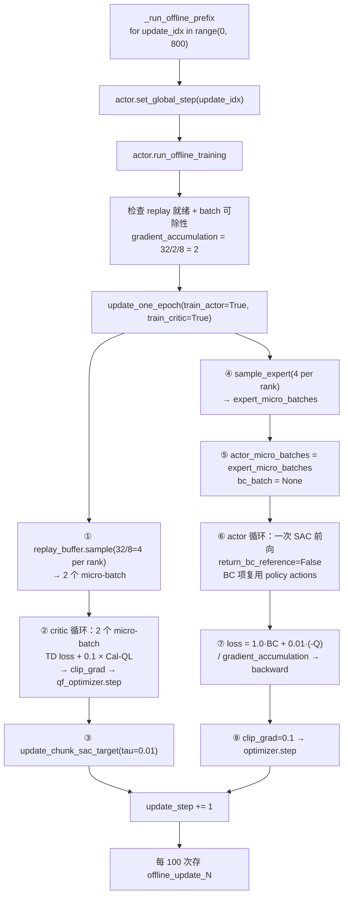

# 第 09 章 阶段一 Actor：BC 加轻量 Q

> 前情提要：第 08 章讲完了 Cal-QL 保守项。这一章讲阶段一的另一半——actor。它有一个容易被忽略的事实：这个阶段叫 "critic warmup"，但 `offline_train_actor: true`，actor 也在训。这一章说清楚它训的是什么、数据从哪来、以及为什么 W2 项在这里是一个零张量。

## 知识链接

- 上一章：[阶段一 Critic：Cal-QL 保守项](./08_阶段一CalQL保守项)
- 下一章：[阶段二异步 actor-learner 架构](./10_阶段二异步架构)
- [系列目录](./index)
- 前置：[行为克隆与 RL 微调范式](/前置知识/000d_前置知识_行为克隆与RL微调范式)
- 前置：[SAC Soft Actor-Critic](/前置知识/000k_前置知识_SAC_Soft_Actor_Critic)
- 前置：[行为约束策略优化](/前置知识/001l_前置知识_行为约束策略优化)
- 相关：[第 05 章 6.1 现在的 BC 项](./05_模型层三个ForwardType)
- 相关：[第 01 章 9.14 BC 项梯度问题](./01_全链路总览#9.14-p0-已核实-actor-loss-里权重-1.0-的-bc-项梯度恒为零)

---

## 1. 阶段一为什么要训 actor

配置里这一行是 ConRFT 阶段一相对 Flow-G 阶段一的**唯一实质差异**：

```yaml
chunk_sac:
  offline_train_actor: true
  offline_actor_only: false
```

它直接决定了 `run_offline_training` 传给 `update_one_epoch` 的参数：

```python
actor_only = bool(offline_config.get("offline_actor_only", False))
metrics = self.update_one_epoch(
    train_actor=bool(offline_config.get("offline_train_actor", False)),
    train_critic=not actor_only,
)
```

所以阶段一是 `train_actor=True, train_critic=True`，**两边一起训 800 次**。

对比 Flow-G 的阶段一：`offline_train_actor` 缺省为 `False`，只训 critic，Flow-G gate 全程保持恒等。

**为什么 ConRFT 要在离线阶段就动 actor**？三条理由：

1. **ConRFT 的定义如此**。论文的 Cal-ConRFT 阶段同时训 critic 和 policy——离线阶段的产出物是"一个能用的 critic **和** 一个已经被 Q 值轻推过的策略"，不是只有 critic。
2. **W2 项需要一个"已经偏离"的起点**。在线阶段的 W2 项惩罚 $\|\pi_\phi(s) - \pi_{\text{BC}}(s)\|^2$。如果阶段一结束时 gate 还是恒等（$\pi_\phi = \pi_{\text{BC}}$），W2 项一开始就是 0，在线阶段的前若干次更新会在"没有约束"的状态下让 Q 项自由推动策略。先在离线阶段建立一个小的偏移，W2 项从第一步就在工作。
3. **离线阶段是安全的**。没有环境，策略再怎么动也不会产生坏数据。在这里做的 actor 更新是"免费"的探索。

**这也是第 01 章 9.4 那条风险为什么严重的原因**：如果 resume 时把 gate 清成恒等，上面三条全部作废。修法是 `preserve_stage1_flow_g_adapter: true`。

## 2. `in_bc_warmup` 被覆写成了什么

`ChunkSACActorObjective` 的接口里有一个 `in_bc_warmup` 标志，基类的语义是"当前是否处于 BC 预热期"——由 `update_step` 和 `sac_flow_bc_warmup_updates` 比较得出。ConRFT 直接覆写了这个判断：

```python
def _sac_flow_in_bc_warmup(self) -> bool:
    return self._conrft_offline_stage
```

于是这个标志的语义在 ConRFT 上变成了"**是不是离线阶段**"，和 `update_step` 完全解耦。

这个覆写有三个连带效果：

| 效果 | 说明 |
|------|------|
| `sac_flow_bc_warmup_updates` 变成死配置 | 阶段一 512 / 阶段二 0 都不起作用（第 04 章 6 节） |
| 在线阶段永远不进 BC warmup 分支 | `_sac_flow_in_bc_warmup()` 恒为 False |
| `trains_on_expert_batch` 的返回值随阶段固定 | 见下一节 |

## 3. actor 训在哪批数据上

`ConRFTActorObjective` 覆写了两个"数据需求声明"方法：

```python
def requires_expert_batch(self, *, in_bc_warmup: bool) -> bool:
    del in_bc_warmup
    return True                          # 两个阶段都需要 expert batch

def trains_on_expert_batch(self, *, in_bc_warmup: bool) -> bool:
    del in_bc_warmup
    return self.offline_stage            # 只有离线阶段直接训在 expert batch 上
```

注意它们都 `del in_bc_warmup`——ConRFT 不关心这个参数，因为 `self.offline_stage` 是构造期就确定的常量：

```python
return ConRFTActorObjective(config, offline_stage=mode == "offline_pretrain")
```

基类的 `update_one_epoch` 根据这两个返回值决定数据流：

```python
in_bc_warmup = self._sac_flow_in_bc_warmup()
expert_micro_batches = None
if (train_actor
        and (calibration_allows_actor or in_bc_warmup)
        and (calibration_fresh_for_actor or in_bc_warmup)
        and self.actor_objective.requires_expert_batch(in_bc_warmup=in_bc_warmup)):
    expert_batch = self.replay_buffer.sample_expert(num_chunks=batch_size)
    expert_micro_batches = split_dict_to_chunk(expert_batch, batch_size // self.cfg.actor.micro_batch_size)
    expert_micro_batches = [put_tensor_device(batch, self.device) for batch in expert_micro_batches]

actor_micro_batches = (
    expert_micro_batches
    if self.actor_objective.trains_on_expert_batch(in_bc_warmup=in_bc_warmup)
    else micro_batches
)
```

然后在 actor 的循环里：

```python
for index, batch in enumerate(actor_micro_batches):
    bc_batch = (
        None
        if in_bc_warmup or expert_micro_batches is None
        else expert_micro_batches[index]["forward_inputs"]
    )
    ...
    actor_output = self.forward_actor(batch["forward_inputs"], bc_data=bc_batch)
```

把两个阶段的结果列出来：

| | 阶段一（离线） | 阶段二（在线） |
|---|---|---|
| `in_bc_warmup` | `True` | `False` |
| `requires_expert_batch` | `True` | `True` |
| `trains_on_expert_batch` | `True` | `False` |
| `actor_micro_batches` | **expert batch** | 普通 replay batch |
| `bc_batch` 传给 objective | `None`（因为 `in_bc_warmup`） | expert batch |
| objective 里的 `data` | expert 样本 | 在线样本 |
| objective 里的 `bc_source` | `data`（= expert） | `bc_data`（= expert） |

**阶段一的关键结论**：`data` 和 `bc_source` 是**同一批数据**。Q 项和 BC 项都在 expert 样本上计算。

这带来一个直接的优化机会，代码里也确实利用了（第 05 章 6.1 节讲过）：

```python
bc_policy_actions = (
    policy["actions"]                     # 阶段一：bc_data is None，直接复用主前向
    if bc_data is None
    else model(forward_type=ForwardType.SAC, forward_inputs=bc_source)["actions"]
)
```

**阶段一的 actor 更新只需要一次 4 步去噪**（`return_bc_reference=False`，所以连 BC 轨迹都不跑）。这是整条链路里最省的一次前向。

**阶段一为什么不用普通 replay batch**：阶段一的 replay 里**全是** expert 样本（第 07 章 7 节：`chunk_sac_is_expert` 全为 True）。所以 `sample()` 和 `sample_expert()` 采出来的分布是一样的，用哪个都行。用 `sample_expert()` 是为了语义明确，并且和在线阶段的代码路径统一。

## 4. 阶段一的目标函数

$$
\mathcal{L}_{\text{actor}}^{\text{offline}} = \underbrace{1.0 \cdot \mathcal{L}_{\text{BC}}}_{\text{像演示}} + \underbrace{0.01 \cdot \big(-\bar{Q}\big)}_{\text{往高价值走}} + \underbrace{1.0 \cdot 0}_{\text{W2，恒为零张量}}
$$

**Step 1：这个公式在做什么**

**它让策略在演示状态上输出接近演示动作的动作，同时被 critic 轻微地往"更好"的方向推一点。**

> **一句话直觉**：以模仿为主，让 Q 值稍微修正一下模仿的方向。

**逐项拆解**（多项 loss 必须逐项说明梯度方向）：

**第 1 项：$\mathcal{L}_{\text{BC}}$ — 动作空间的 masked MSE**

$$
\mathcal{L}_{\text{BC}} = \frac{\sum_{b,h} m_{b,h}\big\|\pi_\phi(s_b)_h - a^{*}_{b,h}\big\|^2}{\big(\sum_{b,h} m_{b,h}\big)\cdot 62}
$$

完整的符号拆解和数值代入在[第 05 章 6.1 节](./05_模型层三个ForwardType)，这里只说梯度方向：它把 Flow-G gate 往"让采样动作更接近演示动作"的方向推。

**这一项在阶段一是绝对主导的**。实测 `bc_loss = 0.3903`，乘权重 1.0 之后是 $0.3903$。

**第 2 项：$-\bar{Q}$ — 负的 twin-Q 最小值**

$$
\bar{Q} = \min_{i \in \{1,2\}} Q_i\big(s, \pi_\phi(s)\big), \qquad \mathcal{L}_Q = -\frac{1}{B}\sum_b \bar{Q}_b
$$

代码：

```python
q_values = model(forward_type=ForwardType.SAC_Q, forward_inputs=data, actions=policy["actions"])
policy_q = q_values.min(dim=-1).values
q_loss = -policy_q.mean()
```

**逐符号拆解**：

| 符号 | 含义 | 直觉 | 值 |
|------|------|------|-----|
| $Q_i$ | 第 $i$ 个 critic head | 两个独立估值器 | 输出 $[B,2]$ |
| $\min_i$ | twin 取小 | 保守估计，抑制过估计 | `.min(dim=-1).values` |
| $\pi_\phi(s)$ | 策略采样动作 | 带梯度，通过 4 步去噪链 | `policy["actions"]` |
| 负号 | 梯度下降 → 最大化 $\bar Q$ | 往高价值方向推 | — |

**梯度路径**：$\nabla_\phi \mathcal{L}_Q = -\frac{1}{B}\sum_b \frac{\partial Q}{\partial a}\Big|_{a=\pi_\phi(s_b)} \cdot \frac{\partial \pi_\phi(s_b)}{\partial \phi}$。第一个因子由 critic 提供（critic 的参数在这里被视为常量，不接收梯度——因为 actor 的 loss 只对 `self.actor_parameters` 做 optimizer step）；第二个因子穿过 4 步去噪链回到 gate。

**注意 `retain_grad()`**：

```python
policy["actions"].retain_grad()
```

`policy["actions"]` 是中间张量，PyTorch 默认不保留它的 `.grad`。`retain_grad()` 让它保留，用途是算诊断指标 `action_grad_norm`：

```python
if actor_output.policy_actions is None:
    action_grad_norms.append(0.0)
else:
    grad = actor_output.policy_actions.grad
    ...
```

这个指标是"BC 项有没有梯度"的直接证据（第 01 章 9.14），实测值 `0.0142`。

**权重 0.01 意味着什么**：$0.01 \times \bar{Q}$，而 $\bar Q \in [0,1]$，所以这一项对总 loss 的贡献最多 $0.01$。相对 BC 项的 $0.39$，**Q 项的份额约 2.5%**。

代入实测数字（假设 $\bar Q = 0.42$）：

$$
\mathcal{L}_{\text{actor}}^{\text{offline}} = 1.0 \times 0.3903 + 0.01 \times (-0.42) + 0 = 0.3903 - 0.0042 = \mathbf{0.3861}
$$

Q 项贡献 $-0.0042$，占 $1.1\%$。

**为什么是 0.01 这么小**：ConRFT 的核心安全假设是"离线 critic 不可信"。第 07 章 9 节推导过，阶段一的 critic 在 episode 开头的状态上几乎不可能收敛；如果给 Q 项大权重，策略会去追逐这些不可靠的估值。0.01 的意思是"听一点点 critic 的意见，但主要还是模仿"。

**第 3 项：W2 — 在离线阶段是零张量**

```python
w2_loss = policy_q.new_zeros(())
if not self.offline_stage:
    reference_actions = policy.get("bc_reference_actions")
    ...
    w2_loss = _masked_action_mse(policy["actions"], reference_actions, data["chunk_sac_valid"])
```

注意这**不是**"算出来恰好为 0"，而是**根本不算**。`policy_q.new_zeros(())` 造了一个和 `policy_q` 同 device、同 dtype 的零标量。

区别在成本上：如果真去算，需要 `return_bc_reference=True`，也就是多跑一整条 4 步 BC 去噪轨迹（第 05 章 4.2 节）。跳过它省掉一半的 actor 前向。这也是为什么主前向那里写的是：

```python
return_bc_reference=not self.offline_stage
```

**为什么离线阶段不需要 W2**：BC 项已经把策略钉在演示动作上了。W2 项的作用是"不要离原始 BC 模型太远"——在 BC 项存在且数据就是演示数据的情况下，这个约束是冗余的（两者的参考对象几乎重合：演示动作 vs 拟合演示动作的模型输出）。

**零张量参与加法有没有问题**：`0.0 * 1.0` 加进 loss 不影响梯度。但要注意 `diagnostics["action_mse"] = w2_loss.detach()` 会记录一个恒为 0 的指标——第 13 章会标注这是阶段一的"失效指标"之一。

## 5. 一次阶段一更新的完整流程



几个数值：

| 量 | 值 |
|---|---|
| 总更新次数 | 800 |
| `global_batch_size` | 32 |
| `micro_batch_size` | 2 |
| actor rank 数 | 8 |
| 每 rank 每次的 chunk 数 | 4 |
| `gradient_accumulation` | 2 |
| critic 优化器 | `qf_optimizer`，`clip_grad` 来自 `critic_optim` |
| actor 优化器 | `optimizer`，`lr: 1.0e-4`，`clip_grad: 0.1` |
| checkpoint 间隔 | 每 100 次 |

**注意 critic 和 actor 用的是两批不同的采样**：critic 用 `replay_buffer.sample()`，actor 用 `replay_buffer.sample_expert()`。在阶段一这两者分布相同（replay 里全是 expert），但**是两次独立采样**，所以 critic 和 actor 在同一次更新里看到的是不同的样本。

这不影响正确性（SAC 本来就不要求两者用同一批），但意味着**每次更新实际访问了 64 个 chunk（全局）而不是 32 个**。第 07 章 9 节算"每个样本被看 2 次"时只数了 critic 那一侧，加上 actor 应该是 4 次。

**`set_global_step(update_idx)` 的作用**：它把 update_idx 传给模型，供 `sample_mean_var_val` 里的 `noise_anneal` 使用（本链路没开 anneal，`noise_level` 固定 0.5，所以这个调用当前无实际效果）。

## 6. 阶段一的收敛行为与判读

阶段一的 800 次更新里，四个指标应该呈现什么形状：

| 指标 | 期望形状 | 异常信号 |
|------|----------|----------|
| `conrft/bc_loss` | 从初值缓慢下降，但**不会降到很低** | 完全水平 → BC 项没梯度（9.14 的复发）；掉到 0.01 以下 → 过拟合或采样退化 |
| `conrft/critic_loss` | 前 100 次快速下降，之后在低位波动 | 持续上升 → Cal-QL 太强或 lr 太大 |
| `conrft/q_mean` | 从随机初值收敛到 $[0, 1]$ 区间内 | 跑到负数 → 保守项压过头；超过 1 → TD 发散 |
| `conrft/flow_g_gate_deviation` | 从 0 缓慢单调上升 | 恒为 0 → actor 完全没训；急速上升超过 0.2 → Q 项在把策略拖走 |

**关于 `bc_loss` 为什么不会降到很低**：策略是随机的（flow SDE 每步注入噪声，第 05 章 2.2 节算过噪声标准差从 0.433 递减到 0.144）。即使 gate 完美地把速度场调到"期望上正好命中演示动作"，单次采样和演示动作之间仍然有噪声导致的偏差。$\mathcal{L}_{\text{BC}}$ 的下界大致就是这个噪声的方差量级。

实测 `bc_loss = 0.3903` 对应逐坐标 RMS $\sqrt{0.390} = 0.625$。而动作是归一化到 $[-1,1]$ 的，所以 0.625 是很大的偏差——**这说明当前主要由采样噪声支配，不是 gate 没学好**。如果想让 BC 项更"锐利"，需要降 `noise_level`，但那会同时削弱探索。

**关于 `flow_g_gate_deviation` 的量级**：实测第 35 次更新是 `0.0221`，也就是 gate 平均偏离恒等 2.2%。gate 的取值范围是 $(0, 2)$，恒等点是 1.0，所以 2.2% 的偏离对应 gate 在 $[0.978, 1.022]$ 附近。这是**非常保守**的调整——符合"BC 主导 + Q 项 1% 权重"的预期。

**两个诊断指标是新加的**，`ConRFTActorObjective` 现在会把它们透传进 diagnostics：

```python
for key in ("flow_g_gate_mean", "flow_g_gate_deviation"):
    value = policy.get(key)
    if torch.is_tensor(value):
        diagnostics[key] = value.detach()
```

它们来自 `sample_chunk_sac_action` 的 `return_flow_g_gate` 通路（第 05 章 3.2 节）。用 `.get` + `is_tensor` 判断是为了兼容"Flow-G 没启用"的情况——虽然 ConRFT 强制启用，但 objective 层不做这个假设。

## 7. 阶段一产出物

800 次更新之后，`offline_update_800/` 里有什么：

```text
offline_update_800/
├── runner_state.json                      # global_step, chunk_sac_offline_updates_completed=800
└── actor/
    ├── dcp_checkpoint/                    # FSDP 分布式模型权重 + 两个优化器
    └── conrft_components/                 # ConRFT 的 sidecar
        ├── alpha_rank_0.pt ... rank_7.pt  # entropy_temp, update_step=800, 各种 checksum, world_size=8
        ├── replay_buffer/rank_0 ... 7/     # replay 快照
        └── complete_rank_0 ... complete_rank_7    # 8 个写入屏障标记
```

其中和阶段二交接相关的关键字段（第 12 章展开）：

| 字段 | 值 | 用途 |
|------|-----|------|
| `update_step` | 800 | `is_stage1_schedule_resume` 的期望值；`_should_update_actor` 的门槛 |
| `resume_config_hash` | 混入 ConRFT 全部超参的哈希 | 阶段二用 `stage1_schedule_resume_hash` 匹配它 |
| `replay_semantics_hash` | 任务 + 奖励 + chunk 语义 | 必须与阶段二一致 |
| `flow_g_adapter_checksum` | 全张量 checksum | 验证 gate 权重被正确恢复 |
| `target_critic_checksum` | 全张量 checksum | 验证 target critic 被正确恢复 |
| `parameter_checksum_scope` | `"full_tensor_v1"` | 声明 checksum 与 world size 无关 |
| `world_size` | 8 | 远端 shell 用它决定检查几个 `complete_rank_*` |
| `pending_action_slots_global` | 0 | 离线阶段没有在线 episode |

**产出的策略是什么状态**：gate 偏离恒等约 2%（如果 800 次之后的偏离量和第 35 次同量级），也就是"几乎还是原始 BC 模型，但已经被 Q 值轻微修正过"。这正是 W2 项在阶段二需要的起点。

## 8. 小结

| 主题 | 关键结论 |
|------|----------|
| 阶段一训 actor 吗 | 训。`offline_train_actor: true`，这是 ConRFT 相对 Flow-G 阶段一的唯一实质差异 |
| 为什么要训 | ConRFT 的定义；给在线 W2 项一个非零起点；离线阶段是安全的 |
| `in_bc_warmup` 语义 | 被覆写成"是不是离线阶段"，和 `update_step` 解耦 |
| actor 训在哪批数据 | 阶段一：expert batch（`trains_on_expert_batch=True`）。阶段一 replay 里全是 expert，所以和普通采样等价 |
| `data` 与 `bc_source` | 阶段一是同一批数据 → BC 项复用主前向的 `policy["actions"]`，零额外成本 |
| 前向次数 | 阶段一 actor 只需 1 次 4 步去噪（`return_bc_reference=False`） |
| 目标函数 | $1.0\,\mathcal{L}_{\text{BC}} + 0.01\,(-\bar Q) + 0$ |
| Q 项份额 | 实测约 1.1%（$-0.0042$ vs BC 的 $0.3903$） |
| W2 项 | 零张量，不是"算出来为 0"——跳过整条 BC 去噪轨迹 |
| `retain_grad()` | 为了算 `action_grad_norm`，是 BC 项有梯度的直接证据（实测 0.0142） |
| critic 与 actor 的采样 | 两次独立采样，每次更新全局访问 64 个 chunk |
| gate 偏离量级 | 实测 2.2%，符合"BC 主导"的预期 |
| `bc_loss` 的下界 | 由 flow SDE 的采样噪声决定，不会降到很低 |

## 下章预告

阶段一结束了。第 10 章进入阶段二，先讲架构：三组 worker 怎么分布在两个物理节点上、`Channel` 的拓扑、后台 drain 线程怎么让"环境采集"和"learner 更新"互不阻塞、50 秒的权重发布节奏意味着多大的策略滞后、以及为什么 ConRFT 的第一次权重同步必须是阻塞的。

→ [第 10 章 阶段二异步 actor-learner 架构](./10_阶段二异步架构)
