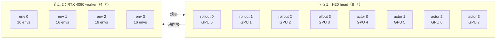
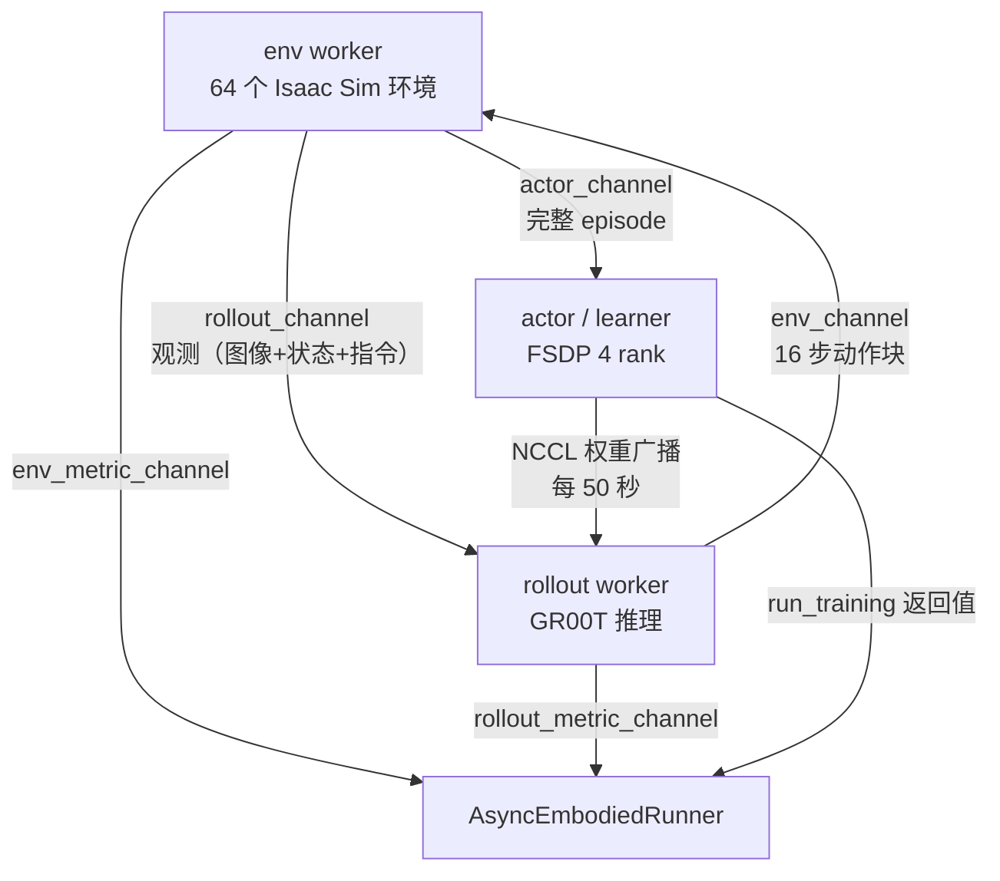

# 第 10 章 阶段二异步 actor-learner 架构

> 前情提要：第 09 章结束时我们有了 `offline_update_800`——一个训过 800 次的 critic 和一个 gate 偏离恒等约 2% 的策略。这一章讲阶段二的骨架：三组 worker 怎么分布在两个物理节点上、Channel 的拓扑、后台 drain 线程怎么让采集和训练互不阻塞、以及 50 秒权重发布节奏背后的策略滞后。

## 知识链接

- 上一章：[阶段一 Actor：BC 加轻量 Q](./09_阶段一Actor目标)
- 下一章：[阶段二在线目标：三项博弈](./11_阶段二在线三项目标)
- [系列目录](./index)
- 前置：[Replay Buffer 经验回放](/前置知识/000r_前置知识_Replay_Buffer_经验回放)
- 前置：[FSDP 全分片数据并行](/前置知识/001i_前置知识_FSDP全分片数据并行)
- 前置：[数据并行与 AllReduce 基础](/前置知识/001h_前置知识_数据并行与AllReduce基础)
- 相关：[RLinf 深度解析](/系列/rlinf_deep_dive/) — RLinf 的 scheduler 与 Channel 设计
- 相关：[LeRobot-VLARL 的分布式 actor-learner](/系列/lerobot_vlarl_deep_dive/04_分布式ActorLearner架构与训练循环) — 另一种实现（gRPC）

---

## 1. 同步 RL 循环的瓶颈

先说清楚为什么需要异步。同步的 embodied RL 循环长这样：

```text
for step in range(max_steps):
    ① 环境采集一批数据    ← 所有 GPU 等着
    ② learner 更新        ← 环境 GPU 空闲
    ③ 发布新权重          ← 所有 GPU 等着
```

在本链路的规模下这三段的耗时极不均衡：

| 阶段 | 谁在忙 | 谁在空转 | 典型耗时 |
|------|--------|----------|----------|
| ① 采集 | 4 张 4090 跑 Isaac Sim + 4 张 H20 跑 GR00T 推理 | 4 张 H20（actor） | 数十秒到分钟级（episode 最长 350 步） |
| ② 更新 | 4 张 H20（actor） | 4 张 4090 + 4 张 H20（rollout） | 秒级 |
| ③ 权重同步 | 全部 | — | 秒级（20 亿参数） |

问题在于 ①：一条 episode 最长 350 个物理步，每 16 步做一次推理，也就是 22 次 GR00T 前向；而 Isaac Sim 的物理仿真本身也不快。同步循环下 actor 的 4 张 H20 在整个采集期间完全空闲。

异步的做法是让三条时间线各自跑：环境不停采集、learner 不停更新、权重定期发布。代价是**策略滞后**——rollout worker 用的权重不是最新的。对 off-policy 方法这是可接受的（replay 里本来就混着各版本策略的数据），所以这个交换是划算的。

## 2. 物理拓扑

阶段二的资源分配在配置里是这样声明的（第 04 章的继承链把三层拼在一起）：

```yaml
# 来自 miarena_r1_conrft_gr00t_n1d7.yaml
cluster:
  component_placement:
    env:
      node_group: "4090"
      placement: 0-3

# 继承自 miarena_r1_sac_flow_g_adapter_gr00t_n1d7.yaml
cluster:
  num_nodes: 2
  component_placement:
    rollout:
      node_group: h20
      placement: 0-3
    actor:
      node_group: h20
      placement: 4-7
```



| 组件 | 位置 | 数量 | 职责 | 为什么在这里 |
|------|------|------|------|--------------|
| env | 4090 节点 GPU 0-3 | 4 worker，`total_num_envs: 64`（每卡 16 个） | Isaac Sim 物理仿真 + 渲染 | 渲染吃的是光栅化性能，4090 比 H20 划算得多 |
| rollout | H20 GPU 0-3 | 4 worker | GR00T 前向，产出 16 步动作块 | 需要 20 亿模型的显存和带宽 |
| actor | H20 GPU 4-7 | 4 rank FSDP | critic + actor 更新 | 同上，且要和 rollout 做 NCCL 权重同步 |

**注意 actor 从阶段一的 8 rank 降到 4 rank**。这直接影响两件事：

1. `gradient_accumulation` 从 2 变成 4（$32/2/4$，第 04 章 3 节）。无害。
2. checkpoint 需要 $8 \to 4$ reshard（第 12 章）。这曾经会让 checksum 校验被跳过，现在靠全张量 checksum 解决。

**Ray placement 是怎么落地的**：`HybridComponentPlacement` 读 `component_placement` 生成 Ray 的 placement group，每个 worker 被绑定到指定 `node_group` 的指定 GPU 上。`node_groups` 里那一大坨 `env_vars`（第 03 章 4.4 节）就是通过 Ray 的 runtime env 注入给这些 worker 进程的——它们是新进程，不继承启动脚本的 `export`。

## 3. Channel 拓扑

RLinf 的 worker 之间不直接调用，全部通过 `Channel` 通信。`Channel` 是基于 Ray Object Store 的异步队列。

阶段二创建的通道：

```python
env_handle = self.env.interact(
    input_channel=self.env_channel,
    rollout_channel=self.rollout_channel,
    reward_channel=self.reward_channel,
    actor_channel=self.actor_channel,
    metric_channel=self.env_metric_channel,
)
rollout_handle = self.rollout.generate(
    input_channel=self.rollout_channel,
    output_channel=self.env_channel,
    metric_channel=self.rollout_metric_channel,
)
actor_handle = self.actor.recv_rollout_trajectories(input_channel=self.actor_channel)
```

**注意这三个 handle 是长驻的**：`interact`、`generate`、`recv_rollout_trajectories` 都不是"跑一次就返回"，而是启动一个循环，一直跑到 `stop()` 被调用。



四条数据流各自的语义：

| 通道 | 方向 | 载荷 | 频率 |
|------|------|------|------|
| `rollout_channel` | env → rollout | 观测 | 每 16 个物理步一次（每个环境） |
| `env_channel` | rollout → env | $[16, 62]$ 动作块 | 同上 |
| `actor_channel` | env → actor | **完整 episode**（不是单步） | episode 结束时 |
| 权重（NCCL，不走 Channel） | actor → rollout | 模型参数 diff | 每 50 秒 |

**`actor_channel` 传的是完整 episode 而不是 transition**，这一点很关键。原因有两个：

1. **奖励要等结果才能标**。`terminal_success` 的定义是"成功 episode 的最后一步 +1"，所以在 episode 结束之前无法给任何一步标奖励。`ChunkSACEpisodeAccumulator` 在 env 侧缓存 chunk，直到 episode 结果已知才整条发出。
2. **Cal-QL 需要完整轨迹**（第 07 章 7.1 节）。虽然在线阶段不算 CQL，但 replay 的格式是统一的。

**副作用**：actor 收到数据的粒度是 episode。在一条 350 步的 episode 跑完之前，它贡献 0 个样本。这就是"pending episode"的来源——第 01 章 9.13 讨论的 `require_empty_pending_on_save`。

## 4. 后台 drain 线程

这是 `AsyncEmbodiedConRFTFSDPPolicy` 相对同步版的**全部**改动，108 行。它要解决的问题很具体。

### 4.1 问题：从 Channel 取数据是 async，训练是 sync

`Channel.get_nowait()` 是一个 asyncio 协程调用，而 `run_training()` 里的 FSDP 前向反向是同步阻塞的 CUDA 操作。如果在同一个协程里交替做这两件事，那么在 `run_training` 执行的几秒钟里，没有人从 `actor_channel` 取数据——Channel 会堆积，极端情况下 env worker 因为背压而阻塞。

### 4.2 解法：一个专门的 Python 线程

```python
@Worker.timer("actor/recv_traj")
async def recv_rollout_trajectories(self, input_channel) -> None:
    if getattr(self, "_recv_queue", None) is None:
        self._recv_queue = queue.Queue()
    if getattr(self, "_recv_stop_event", None) is None:
        self._recv_stop_event = threading.Event()
    self._recv_stop_event.clear()
    if (getattr(self, "_recv_rollout_thread", None) is None
            or not self._recv_rollout_thread.is_alive()):
        self._recv_rollout_thread = threading.Thread(
            target=self._recv_rollout_thread_main, args=(input_channel,), daemon=True,
        )
        self._recv_rollout_thread.start()
```

线程主体是一个简单的搬运循环：

```python
def _recv_rollout_thread_main(self, input_channel) -> None:
    channel_key = chunk_sac_actor_channel_key(self._rank)
    while True:
        try:
            trajectory = input_channel.get_nowait(key=channel_key)
            self._recv_queue.put(trajectory)
        except asyncio.QueueEmpty:
            if self._recv_stop_event.is_set():
                return
            self._recv_stop_event.wait(0.05)
        except Exception as error:
            self._recv_error = error
            self._recv_stop_event.set()
            return
```

**逐段讲这段在干什么**：

- `chunk_sac_actor_channel_key(self._rank)`：每个 actor rank 有自己的 channel key。env worker 按 rank 分发 episode，所以 4 个 actor rank 各自收自己那一份，不需要协调。
- `get_nowait` 拿到东西就塞进 `queue.Queue()`（一个**线程安全**的普通队列，不是 asyncio 队列）。
- 空的时候 `wait(0.05)` 睡 50 毫秒。这里用 `Event.wait` 而不是 `time.sleep` 是为了让 `stop()` 能立刻打断——`_recv_stop_event.set()` 会让 `wait` 立即返回。
- **异常不抛，而是存进 `self._recv_error`**。因为这是后台线程，抛异常没人接。错误会在主流程下一次 drain 时被重新抛出。

### 4.3 主流程按需 drain

```python
def _drain_received_trajectories(self, max_trajectories: int | None = None) -> None:
    recv_error = getattr(self, "_recv_error", None)
    if recv_error is not None:
        raise RuntimeError("ConRFT rollout receiver failed") from recv_error
    if getattr(self, "_recv_queue", None) is None:
        return
    received_trajectories = []
    while max_trajectories is None or len(received_trajectories) < max_trajectories:
        try:
            received_trajectories.append(self._recv_queue.get_nowait())
        except queue.Empty:
            break
    if received_trajectories:
        self._ingest_rollout_trajectories(received_trajectories)
```

第一行就是把后台线程的错误"转发"到主流程——这是后台线程模式的标准做法，保证故障不被吞掉。

`max_trajectories` 来自配置 `actor.recv_drain_max_trajectories: 256`。**为什么要限流**：`_ingest_rollout_trajectories` 会做 reward 重标、chunk 切分、写 replay，这些都是 CPU 工作。如果一次 drain 几千条 episode，主流程会卡住很久，把训练节奏打乱。256 是一个"每次消化一批、剩下的下次再说"的折中。

### 4.4 启动前的等待

```python
async def _wait_for_replay_buffer_ready(self, min_buffer_size: int) -> None:
    while True:
        self._drain_received_trajectories(
            max_trajectories=self.cfg.actor.get("recv_drain_max_trajectories", 256)
        )
        if await self.replay_buffer.is_ready_async(min_buffer_size):
            return
        await asyncio.sleep(1)

@Worker.timer("run_training")
async def run_training(self):
    min_buffer_size = int(self.cfg.algorithm.replay_buffer.get("min_buffer_size", 100))
    await self._wait_for_replay_buffer_ready(min_buffer_size)
    self._drain_received_trajectories(max_trajectories=...)
    await asyncio.sleep(0)
    return super().run_training()
```

`min_buffer_size` 继承自第 2 层配置，值是 `32`。所以在线阶段第一次训练之前要等到 replay 里有 32 个 chunk。

**这个等待发生在 actor 侧而不是 runner 侧**，所以 runner 的 `actor.run_training()` 调用会一直阻塞到数据够了才返回。第一次可能要等一两条 episode 跑完（每条 episode 按 350 步、16 步一个 chunk 算能产出 22 个 chunk，所以 2 条 episode 就够 32 个）。

**`await asyncio.sleep(0)` 的作用**：主动让出一次事件循环，给其他协程（比如 metric 上报）一个执行机会。这是 asyncio 里的惯用写法。

### 4.5 收尾

```python
async def stop(self) -> None:
    recv_stop_event = getattr(self, "_recv_stop_event", None)
    if recv_stop_event is not None:
        recv_stop_event.set()
    recv_thread = getattr(self, "_recv_rollout_thread", None)
    if recv_thread is not None and recv_thread.is_alive():
        await asyncio.to_thread(recv_thread.join, 5)
        if recv_thread.is_alive():
            raise RuntimeError("ConRFT rollout receiver did not stop cleanly")
    self._drain_received_trajectories()          # 无限制，把队列排空
    self.flush_replay()
```

顺序很重要：先让线程停，再把队列里剩下的全部 drain（这次不限流），最后 flush replay 到磁盘。如果反过来，线程还在往队列里塞东西，drain 永远追不上。

`join(5)` 之后还活着就 raise——宁可让收尾报错，也不留一个僵尸线程持有 Channel 引用。

## 5. Runner 主循环

`AsyncEmbodiedRunner.run` 的骨架：

```python
def run(self):
    start_step = self.global_step
    start_time = time.time()
    self.update_rollout_weights(no_wait=self._initial_weight_sync_no_wait())
    self._last_rollout_weight_sync_time = time.monotonic()

    env_handle = self.env.interact(...)          # 长驻
    rollout_handle = self.rollout.generate(...)  # 长驻
    actor_handle = self.actor.recv_rollout_trajectories(...)   # 长驻（后台线程）

    while self.global_step < self.max_steps:
        skip_step = False
        with self.timer("step"):
            actor_training_handle = self.actor.run_training()
            actor_result = actor_training_handle.wait()
            if not actor_result[0]:
                skip_step = True
            if not skip_step:
                self.global_step += 1
                if self._rollout_weight_sync_due():
                    self.update_rollout_weights(no_wait=self.sync_weight_no_wait)
                    self._last_rollout_weight_sync_time = time.monotonic()
                ...
                run_val, save_model, _ = check_progress(
                    self.global_step, self.max_steps,
                    self.cfg.runner.val_check_interval, self.cfg.runner.save_interval,
                    1.0, run_time_exceeded=False,
                )
                if save_model:
                    self._save_checkpoint()
                if run_val:
                    eval_metrics = self.evaluate()
        if skip_step:
            self.timer.consume_durations()
            time.sleep(1.0)
            continue
        ... # 一大段指标聚合与日志
    self._cleanup_pending_rollout_weight_sync(no_wait=False)
    self.env.stop().wait(); self.rollout.stop().wait(); self.actor.stop().wait()
    env_handle.wait(); rollout_handle.wait(); actor_handle.wait()
    if self.cfg.algorithm.loss_type == "embodied_conrft":
        self._finish_run()
```

几个要点。

### 5.1 `skip_step` 机制

`run_training` 在 replay 不够时返回 `{}`（空字典）。runner 检查 `actor_result[0]`（rank 0 的返回），空字典是 falsy，于是 `skip_step = True`：**`global_step` 不增加**，睡 1 秒重试。

**这个设计的含义**：`max_steps: 50` 数的是**成功的更新步**，不是循环次数。所以启动初期那些"等数据"的空转不会消耗预算。

但注意 ConRFT 的 `run_training` 在 actor 侧已经用 `_wait_for_replay_buffer_ready` 等到数据够了才返回，所以 `skip_step` 在 ConRFT 上基本不会触发。它是给同步版本和其他算法留的路径。

### 5.2 首次权重同步必须阻塞

```python
def _initial_weight_sync_no_wait(self) -> bool:
    return self.sync_weight_no_wait and (self.cfg.algorithm.loss_type != "embodied_conrft")
```

配置里 `actor.sync_weight_no_wait: true`，但这个函数对 ConRFT 特判返回 `False`，所以**第一次同步是阻塞的**。

**为什么 ConRFT 需要这个特判**：阶段二从 `offline_update_800` resume，此时 actor 手里的权重是"800 次离线更新之后的策略"，而 rollout worker 刚启动、加载的是**原始 BC checkpoint**。如果第一次同步不阻塞，env/rollout 会先用原始 BC 策略采一批数据进 replay。

这批数据的问题不是"质量差"——BC 策略采的数据质量还不错。问题是**它和 W2 项的参考基准混淆了**：W2 项要求策略不要离"冻结 BC 模型"太远，而如果 replay 里混了一批真正由 BC 模型采的数据，Q 项和 W2 项的信号会互相干扰，早期的策略更新方向变得不可预测。

阻塞一次同步的代价是几秒钟，换来的是"从第一条 episode 起，采集用的就是阶段一产出的策略"。

### 5.3 时间驱动的权重发布

```python
def _rollout_weight_sync_due(self) -> bool:
    if self.weight_sync_interval_seconds is None:
        return self.global_step % self.weight_sync_interval == 0
    return (time.monotonic() - self._last_rollout_weight_sync_time
            >= float(self.weight_sync_interval_seconds))
```

配置里同时设了两个：

```yaml
runner:
  weight_sync_interval: 1
  weight_sync_interval_seconds: 50.0
```

**`weight_sync_interval_seconds` 一旦非空就完全接管**，`weight_sync_interval: 1` 是死配置（它只在秒数为空时生效）。

**为什么用时间而不是 step**：异步模式下一个 step 的墙钟时长是高度可变的（取决于 replay 里有没有数据、drain 了多少条）。按 step 同步会导致"某段时间疯狂同步、某段时间长期不同步"。按时间同步给出稳定的策略新鲜度上界。

**50 秒意味着多大的滞后**：rollout worker 用的权重最多比 learner 落后 50 秒。在这 50 秒里 learner 做了多少次更新？取决于单步耗时，但按 `num_updates_per_step: 35`、每步几秒算，**一次同步间隔内 learner 可能做了几百次梯度更新**。

这是一个相当大的滞后。它的可接受性建立在两点上：

1. ConRFT 是 off-policy 的，replay 里本来就混着旧策略的数据。
2. **策略变化本身很慢**。Q 项权重 0.01、`clip_grad: 0.1`、W2 项拽着——第 09 章实测 gate deviation 只有 2.2%。几百次更新也不会让策略走多远。

**如果调大了 `q_weight_online`，就要同时调小 `weight_sync_interval_seconds`**。否则策略变化速度和权重新鲜度不匹配，采到的数据和当前策略偏离过大。这是第 14 章调参时的一条联动规则。

### 5.4 非阻塞同步的合并

```python
def _cleanup_pending_rollout_weight_sync(self, no_wait):
    if self._pending_rollout_weight_sync is None:
        return True
    rollout_handle, actor_handle = self._pending_rollout_weight_sync
    if no_wait and (not rollout_handle.done() or not actor_handle.done()):
        return False
    rollout_handle.wait()
    actor_handle.wait()
    self._pending_rollout_weight_sync = None
    return True

def update_rollout_weights(self, no_wait=False):
    if not no_wait:
        return super().update_rollout_weights()
    self._weight_sync_request_total += 1
    if not self._cleanup_pending_rollout_weight_sync(no_wait):
        self._weight_sync_coalesced_total += 1
        self.logger.info(f"Weight sync coalesced {self._weight_sync_coalesced_total} times.\n"
                         f"Request total {self._weight_sync_request_total} times.")
        return
    rollout_handle = self.rollout.request_actor_sync_model()
    actor_handle = self.actor.sync_model_to_rollout()
    self._pending_rollout_weight_sync = (rollout_handle, actor_handle)
```

逻辑是：如果上一次同步还没完成，**这次请求直接丢弃**（coalesce），只增加计数。

**为什么丢弃是对的**：权重同步不是"必须每次都做"的操作——它的目的是让 rollout 拿到较新的权重。如果上一次还在传，这次跳过没有损失（下一个 50 秒还会再试）。而如果排队等待，就会阻塞主循环。

`_weight_sync_coalesced_total` 是一个值得盯的指标：**如果它接近 `_weight_sync_request_total`，说明权重同步的耗时超过了 50 秒**，rollout 实际拿到的权重比配置意图的更旧。这时要么调大间隔，要么检查网络/syncer 配置。

**同步的实现**是 `weight_syncer/patch_syncer`（第 04 章配置表）。`PatchSyncer` 只传输参数的 diff（COO 稀疏格式）。对本链路特别合适——可训练参数只有 Flow-G gate 的 3.4 万个和 critic 的 370 万个，其余 20 亿参数从头到尾不变，diff 极小。

### 5.5 收尾的 `_finish_run`

```python
if self.cfg.algorithm.loss_type == "embodied_conrft":
    self._finish_run()
```

这是 ConRFT 特判——同步 runner 在 `run()` 末尾无条件调 `_finish_run()`，异步 runner 只对 ConRFT 调。`_finish_run` 做的是最终的 replay flush 和 metric logger 关闭。

其他异步算法不调，大概是历史原因（它们可能在别处处理）。这类"按 `loss_type` 特判"的代码在共享基类里出现两次（这里和 `_initial_weight_sync_no_wait`），是需要留意的耦合点。

## 6. 三条时间线的实际交错

把前面拼起来，画一次典型的时序：

```text
t=0     runner: update_rollout_weights(no_wait=False)  ← 阻塞，rollout 拿到阶段一的策略
        env/rollout/actor 三个长驻 handle 启动
        actor 的后台 drain 线程启动

t=0..T1 env: 64 个环境并行跑，每 16 步向 rollout 要一次动作
        rollout: 收观测 → GR00T 前向 → 回 16 步动作块
        actor: run_training() 阻塞在 _wait_for_replay_buffer_ready(32)
               后台线程每 50ms 轮询 actor_channel（还是空的）

t=T1    第一批 episode 结束 → 进 actor_channel
        后台线程搬进 queue → 主流程 drain → _ingest_rollout_trajectories
        replay 达到 32 → run_training 返回 → 开始 35 次更新
        （此时 env 仍在跑第二批 episode，不受影响）

t=T2    35 次更新完成，global_step=1
        检查 _rollout_weight_sync_due()：距上次同步 < 50s → 不同步
        检查 check_progress(1, 50, val=5, save=5) → 都不触发

...

t=T5    某个 step 结束时距上次同步 ≥ 50s
        update_rollout_weights(no_wait=True) → 发起非阻塞同步
        主循环立刻继续下一个 step（不等同步完成）

t=T6    global_step=5
        check_progress → save_model=True, run_val=True
        _save_checkpoint()  ← 允许带 pending 片段（require_empty_pending_on_save: false）
        evaluate()          ← 48 个固定 layout

...

t=end   global_step=50
        _cleanup_pending_rollout_weight_sync(no_wait=False)  ← 这次要等
        env.stop() / rollout.stop() / actor.stop()
        actor.stop(): 停线程 → 排空队列 → flush_replay
        _finish_run()
```

**关键观察**：`actor.run_training()` 是**同步阻塞**的（`.wait()`），所以在 35 次更新期间 runner 主循环什么也做不了——包括权重同步的**发起**。所以实际的同步间隔是 $\ge 50$ 秒，而且总是发生在某个 step 的边界上。如果单步耗时是 30 秒，那么实际同步间隔会是 60 秒（两步）而不是 50 秒。

**这意味着 `weight_sync_interval_seconds: 50.0` 是一个下界，不是精确值。** 想知道真实间隔要看日志里两次 "Weight sync" 之间的时间差。

## 7. 与阶段一的对照

| 维度 | 阶段一（同步离线） | 阶段二（异步在线） |
|------|--------------------|--------------------|
| 入口 | `train_embodied_agent.py` | `train_async.py` |
| Runner | `EmbodiedRunner._run_offline_prefix` | `AsyncEmbodiedRunner.run` |
| Actor 类 | `EmbodiedConRFTFSDPPolicy` | `AsyncEmbodiedConRFTFSDPPolicy` |
| 环境 | 无（`_is_offline_only()` 跳过创建） | 64 个 Isaac Sim |
| rollout worker | 无 | 4 个 |
| actor rank | 8 | 4 |
| `gradient_accumulation` | 2 | 4 |
| 更新循环 | 纯 for 循环 800 次 | 50 step × 35 次 = 1750 |
| 数据来源 | BC 数据集一次性建 replay | Channel 持续注入 |
| replay 内容 | 全 expert | expert（resume 带来）+ 在线样本 |
| Cal-QL | 有 | 无 |
| W2 项 | 零张量 | 真算 |
| 评测 | 无（`val_check_interval: -1`） | 每 5 step |
| checkpoint | 每 100 次更新 | 每 5 step |

## 8. 小结

| 主题 | 关键结论 |
|------|----------|
| 为什么异步 | 同步循环下 actor 的 4 张 H20 在采集期间完全空闲；episode 最长 350 步 |
| 拓扑 | env 4090×4（64 envs，每卡 16）+ rollout H20 0-3 + actor H20 4-7（4 rank FSDP） |
| Channel | `rollout_channel`（观测）、`env_channel`（动作块）、`actor_channel`（**完整 episode**） |
| 为什么传 episode | `terminal_success` 要等结果才能标奖励；Cal-QL 需要完整轨迹 |
| 后台 drain 线程 | 用 `threading.Thread` + `queue.Queue` 把 async Channel 和 sync 训练解耦 |
| 错误处理 | 后台线程的异常存进 `_recv_error`，下次 drain 时重抛 |
| drain 限流 | `recv_drain_max_trajectories: 256`，防止一次消化太多打乱训练节奏 |
| 启动等待 | `min_buffer_size: 32`，约 2 条 episode |
| 首次同步 | ConRFT 特判为**阻塞**，避免 rollout 用原始 BC 策略采数据污染 W2 基准 |
| 同步节奏 | 时间驱动 50 秒；`weight_sync_interval: 1` 是死配置 |
| 实际滞后 | $\ge 50$ 秒（是下界，因为只在 step 边界检查）；对应可能几百次梯度更新 |
| 为什么滞后可接受 | off-policy + 策略变化本身极慢（gate deviation 2.2%） |
| 联动规则 | 调大 `q_weight_online` 就要同时调小 `weight_sync_interval_seconds` |
| 合并计数 | `_weight_sync_coalesced_total` 接近请求总数 → 同步耗时超过 50 秒 |
| syncer | `PatchSyncer`，只传 diff，对"只训 370 万参数"的本链路极合适 |

## 下章预告

架构讲完了，第 11 章讲阶段二真正在优化什么：BC 项、Q 项、W2 项三者的完整博弈。重点是 `1 : 0.01 : 1` 这组权重的实际后果、W2 项的参考动作为什么必须共享随机数、以及"成功率不涨时该动哪一个权重"这个实际问题。

→ [第 11 章 阶段二在线目标：三项博弈](./11_阶段二在线三项目标)
