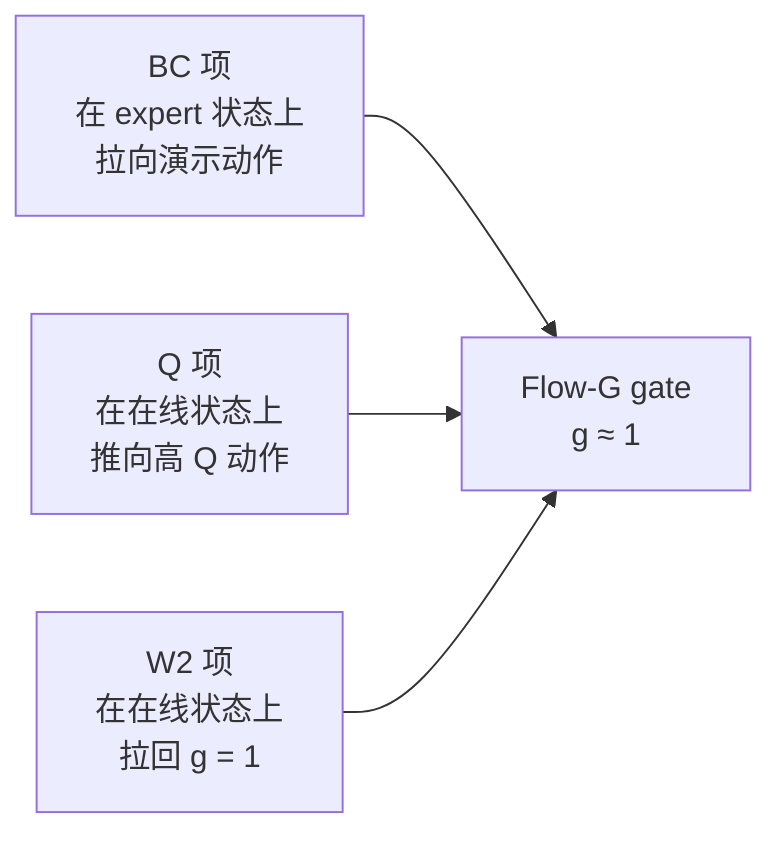

# 第 11 章 阶段二在线目标：三项博弈

> 前情提要：第 10 章讲完了阶段二的架构。这一章讲它在优化什么——BC 项、Q 项、W2 项三者各自把策略往哪拉、`1 : 0.01 : 1` 这组权重的实际后果、以及成功率不涨时该动哪一个。

## 知识链接

- 上一章：[阶段二异步 actor-learner 架构](./10_阶段二异步架构)
- 下一章：[Checkpoint、resume 与阶段交接](./12_Checkpoint与阶段交接)
- [系列目录](./index)
- 前置：[行为约束策略优化](/前置知识/001l_前置知识_行为约束策略优化)
- 前置：[KL 散度与策略约束](/前置知识/000j_前置知识_KL散度与策略约束)
- 前置：[SAC Soft Actor-Critic](/前置知识/000k_前置知识_SAC_Soft_Actor_Critic)
- 相关：[第 05 章 4.2 双轨去噪](./05_模型层三个ForwardType)
- 相关：[AWR Flow 与 ConRFT 的 Actor 更新机制对比](/系列/lerobot_vlarl_deep_dive/06_AWR_Flow与ConRFT的Actor更新机制对比)

---

## 1. 完整的目标函数

$$
\mathcal{L}_{\text{actor}}^{\text{online}}
= \underbrace{1.0 \cdot \mathcal{L}_{\text{BC}}}_{\text{像演示}}
\;+\; \underbrace{0.01 \cdot \big(-\bar{Q}\big)}_{\text{往高价值走}}
\;+\; \underbrace{1.0 \cdot \mathcal{L}_{\text{W2}}}_{\text{别离开原模型太远}}
$$

**Step 1：这个公式在做什么**

**它让策略同时满足三个互相拉扯的要求**：在演示状态上能重建演示动作、在在线状态上让 critic 给出高分、并且在任意在线状态上都不偏离原始 BC 模型太远。

> **一句话直觉**：三根绳子拉同一个 gate——演示往这边拉、Q 值往那边推、原始模型往回拽。

对应的代码是 `ConRFTActorObjective.compute` 的在线分支：

```python
policy = model(forward_type=ForwardType.SAC, forward_inputs=data, return_bc_reference=True)
policy["actions"].retain_grad()
q_values = model(forward_type=ForwardType.SAC_Q, forward_inputs=data, actions=policy["actions"])
policy_q = q_values.min(dim=-1).values
q_loss = -policy_q.mean()

bc_source = bc_data                                  # 在线阶段 bc_data 非空
bc_policy_actions = model(forward_type=ForwardType.SAC, forward_inputs=bc_source)["actions"]
bc_loss = _masked_action_mse(bc_policy_actions, bc_source["chunk_sac_action"], bc_source["chunk_sac_valid"])

reference_actions = policy.get("bc_reference_actions")
if reference_actions is None:
    raise RuntimeError("Online ConRFT requires a frozen-BC reference action")
w2_loss = _masked_action_mse(policy["actions"], reference_actions, data["chunk_sac_valid"])

loss = bc_weight * bc_loss + q_weight * q_loss + self.config.w2_weight * w2_loss
```

**三项各自作用在哪批数据上**，这是最容易混的地方：

| 项 | 数据 | 参考对象 | 采样 |
|---|------|----------|------|
| BC | **expert replay**（`bc_data`） | 演示动作 `chunk_sac_action` | 独立的一次 `ForwardType.SAC` |
| Q | **在线 replay**（`data`） | critic 的估值 | 主前向 `policy["actions"]` |
| W2 | **在线 replay**（`data`） | 冻结 BC 模型的输出 | 主前向 `policy["actions"]`，与 Q 项**同一份** |

所以在线阶段的 actor 更新一共两次策略前向（第 05 章 4.3 节的成本表）：主前向（带 BC 轨迹，2 份 DiT 4 步去噪）+ expert 前向（1 份）= 3 份。

## 2. 第 1 项：BC 项

$$
\mathcal{L}_{\text{BC}} = \frac{\sum_{b,h} m^{E}_{b,h}\big\|\pi_\phi(s^{E}_b)_h - a^{*}_{b,h}\big\|^2}{\big(\sum_{b,h} m^{E}_{b,h}\big)\cdot 62}
$$

上标 $E$ 强调这些量来自 **expert** batch 而不是在线 batch。完整的符号拆解和数值代入在[第 05 章 6.1 节](./05_模型层三个ForwardType)。

**梯度方向**：把 gate 往"让策略在演示状态上输出演示动作"的方向推。

**它和阶段一的 BC 项完全相同**——同一个函数、同一批 expert replay。区别只在于阶段一它是唯一的主导项，阶段二它要和 W2 项分享"往回拉"的角色。

**expert batch 从哪来**：

```python
expert_batch = self.replay_buffer.sample_expert(num_chunks=batch_size)
```

`sample_expert` 按 `chunk_sac_is_expert` 标记筛选。阶段二的 replay 里同时有：

- 从 `offline_update_800` resume 带过来的 BC 样本（`is_expert = True`）
- 在线采集的样本（`is_expert = False`）

配置里还有两个相关的容量参数（继承自第 4 层）：

```yaml
replay_buffer:
  cache_size: 384
  expert_cache_size: 256
  sample_window_size: 512
```

`expert_cache_size: 256` 是 expert 样本的独立缓存上限。**这意味着 BC 项看到的演示样本池是有界的**——最多 256 个 chunk（每 rank）。相对阶段一每 rank 1600 个（第 07 章 9 节），在线阶段的 BC 监督面窄了很多。

**这是一个值得注意的设计**：在线阶段的 BC 项不是在"全部演示数据"上做，而是在一个 256 个样本的滑动缓存上做。如果这个缓存的内容是固定的（resume 时填入、之后不变），那 BC 项实际上在反复拟合同 256 个样本，有过拟合风险；如果它会轮换，那需要确认轮换来源。这一点本系列没有逐行核实到 `TrajectoryReplayBuffer` 的缓存管理层，**建议实测时看 `chunk_sac/replay_buffer/*` 里的 expert 计数是否变化**。

## 3. 第 2 项：Q 项

$$
\bar{Q}_b = \min_{i\in\{1,2\}} Q_i\big(s_b, \pi_\phi(s_b)\big), \qquad
\mathcal{L}_Q = -\frac{1}{B}\sum_{b=1}^{B}\bar{Q}_b
$$

**Step 1：这个公式在做什么**

**它把策略往"critic 认为价值更高"的动作方向推。** 这是整个链路里**唯一**能让策略超越演示数据的项。

> **一句话直觉**：让 critic 当教练，告诉策略哪个动作更可能成功。

**逐符号拆解**：

| 符号 | 含义 | 直觉 | 具体是什么 |
|------|------|------|-----------|
| $s_b$ | 在线 replay 的状态 | 策略自己采出来的状态 | `data` 里的观测 |
| $\pi_\phi(s_b)$ | 策略采样动作 | 带梯度，穿过 4 步去噪 | `policy["actions"]` |
| $Q_i$ | 第 $i$ 个 critic head | 阶段一训过 800 次 + 在线继续训 | `[B, 2]` |
| $\min_i$ | twin 取小 | 保守估计 | `.min(dim=-1).values` |
| 负号 | 下降 → 最大化 | 往高价值推 | — |

**梯度路径**（这是三项里唯一穿过 critic 的）：

$$
\nabla_\phi \mathcal{L}_Q = -\frac{1}{B}\sum_b \underbrace{\frac{\partial Q_{i^*}}{\partial a}\Big|_{a=\pi_\phi(s_b)}}_{\text{critic 提供的方向}} \cdot \underbrace{\frac{\partial \pi_\phi(s_b)}{\partial \phi}}_{\text{去噪链回传到 gate}}
$$

其中 $i^*$ 是取到 min 的那个 head。注意 critic 的参数在这里被当作常量——actor 的 `optimizer.step()` 只作用在 `self.actor_parameters` 上，critic 参数在 `self.critic_parameters` 里，由 `qf_optimizer` 单独管。

**第一个因子经过了 straight-through clip**（第 06 章 3.2 节）：如果 $\pi_\phi(s)$ 的某个坐标漂到 $[-1,1]$ 之外，clamp 的真实导数是 0，但 straight-through 让它按 1 传。所以策略即使越界，Q 项也能把它推回来。

**为什么在线阶段的 Q 项比离线阶段可信**：离线 critic 只见过演示数据分布（第 07 章 9 节讨论过它在 episode 开头的状态上不可靠）。在线阶段 replay 里持续注入策略自己采的数据，critic 在"策略实际会到达的状态"上得到真实的 TD 信号。所以在线阶段的 critic 逐步变得可信。

**但权重仍然是 0.01**。ConRFT 没有随训练进度调大它。这是一个保守的设定——好处是安全，代价是即使 critic 已经很好也不会被充分利用。

## 4. 第 3 项：W2 项

这是本链路相对 ConRFT 论文额外加的一项（第 02 章 2.4 节）。

$$
\mathcal{L}_{\text{W2}} = \frac{\sum_{b,h} m_{b,h}\big\|\pi_\phi(s_b;\epsilon)_h - \pi_{\text{BC}}(s_b;\epsilon)_h\big\|^2}{\big(\sum_{b,h} m_{b,h}\big)\cdot 62}
$$

**Step 1：这个公式在做什么**

**它惩罚"当前策略"和"关掉 Flow-G gate 的原始策略"在同一状态、同一份随机数下输出动作的差异。** 这是一个 trust region 约束。

> **一句话直觉**：给 gate 系一根皮筋——它可以调整速度场，但不许调得太狠。

**逐符号拆解**：

| 符号 | 含义 | 直觉 | 具体是什么 |
|------|------|------|-----------|
| $s_b$ | 在线 replay 的状态 | 策略实际到达的状态 | `data` 里的观测 |
| $\epsilon$ | 共享的随机数 | 初始噪声 + 每步转移噪声 | 见下面的"共享"讨论 |
| $\pi_\phi(s;\epsilon)$ | 带 gate 的去噪结果 | 当前策略 | `policy["actions"]` |
| $\pi_\text{BC}(s;\epsilon)$ | **不带 gate** 的去噪结果 | 原始 BC 策略 | `policy["bc_reference_actions"]` |
| $m_{b,h}$ | valid mask | 屏蔽 padding | `data["chunk_sac_valid"]` |

### 4.1 为什么必须共享随机数

$\pi_\phi$ 和 $\pi_{\text{BC}}$ 都是**随机**策略（flow SDE 每步注入噪声）。如果两次采样用不同的随机数，那么

$$
\mathbb{E}\big[\|\pi_\phi(s;\epsilon_1) - \pi_{\text{BC}}(s;\epsilon_2)\|^2\big]
= \underbrace{\|\mu_\phi(s) - \mu_{\text{BC}}(s)\|^2}_{\text{我们想要的：gate 造成的偏移}}
+ \underbrace{\mathrm{Var}[\pi_\phi] + \mathrm{Var}[\pi_{\text{BC}}]}_{\text{噪声方差，与 gate 无关}}
$$

后面那两项是**常数偏置加噪声**，会淹没信号。第 05 章 2.2 节算过噪声标准差从 0.433 递减到 0.144，量级远大于 gate 造成的 2% 偏移。

共享随机数之后，两条轨迹的**唯一差异来源**是 gate：

```python
bc_x_t = x_t.detach().clone() if return_bc_reference else None      # 共享初始噪声
...
for idx in range(self.num_inference_timesteps):
    mean, std, flow_g_gate = self.sample_mean_var_val(..., x_t=x_t, ...)    # apply_flow_g=True
    if mode == "train":
        transition_noise = self.sample_noise(x_t.shape, x_t.device, dtype=x_t.dtype)
        x_t = mean + transition_noise * std
    if bc_x_t is not None:
        with torch.no_grad():
            bc_mean, bc_std = self.sample_mean_var_val(..., x_t=bc_x_t, ..., apply_flow_g=False)
            bc_x_t = bc_mean + transition_noise * bc_std               # 复用同一份转移噪声
```

这是统计里的 common random numbers 技巧：比较两个随机系统时用同一份随机数，方差大幅下降。

**代入数字看效果**。假设 gate 造成的期望偏移是 $\delta = 0.02$（对应 2% 的 gate deviation），单步噪声标准差平均 $\sigma \approx 0.29$：

- 不共享：$\mathcal{L}_{\text{W2}} \approx \delta^2 + 2\sigma^2 = 0.0004 + 0.168 = 0.168$。信号占 $0.24\%$，完全被淹没。
- 共享：$\mathcal{L}_{\text{W2}} \approx \delta^2 = 0.0004$。**纯信号。**

这解释了为什么 W2 项的实测值会很小（$10^{-4} \sim 10^{-3}$ 量级）——它测的是纯粹的 gate 偏移。

### 4.2 零额外显存

常规的 trust region 实现需要保留一份冻结的模型副本。对 20 亿参数的 GR00T 这意味着显存翻倍。

Flow-G 的结构提供了捷径：**速度场本来就是冻结的，唯一被训练的是 gate，所以"关掉 gate 再跑一遍"就等于原始 BC 策略**。`apply_flow_g=False` 这一个参数就实现了它。

代价是计算：BC 轨迹要跑 4 步 DiT（虽然在 `no_grad` 下，也不过 gate）。所以主前向的成本翻倍。

**一条防御性检查**：

```python
if return_bc_reference and not flow_g_config.get("enabled", False):
    raise ValueError("A frozen-BC reference requires Flow-G to be enabled")
```

没有 Flow-G 就没有"关掉 gate"这个概念。断言拦住这个组合。

### 4.3 W2 项与 gate deviation 的关系

`flow_g_gate_deviation` 是另一个衡量"偏离多远"的指标：

```python
flow_g_gate_deviations.append((flow_g_gate.float() - 1.0).abs().mean(dim=(1, 2)))
```

两者的区别：

| | `flow_g_gate_deviation` | $\mathcal{L}_{\text{W2}}$ |
|---|---|---|
| 度量空间 | 速度场的乘性系数 | 最终动作 |
| 定义 | $\mathbb{E}[\lvert g - 1\rvert]$ | $\mathbb{E}[\|a_\phi - a_{\text{BC}}\|^2]$ |
| 是否累积 4 步 | 否（对 4 步求平均） | 是（4 步的偏移在动作上累积） |
| 是否进 loss | 否（纯诊断） | 是 |
| 实测量级 | $0.0221$ | $10^{-4} \sim 10^{-3}$ |

**gate deviation 更容易解读**（"gate 平均偏离恒等 2.2%"），**W2 更贴近真正被约束的量**（最终执行的动作）。两个一起看：如果 gate deviation 涨但 W2 不涨，说明 gate 的偏移在 4 步之间互相抵消了（比如前两步放大、后两步缩小）；如果两个一起涨，说明偏移在累积。

## 5. 三项的博弈

### 5.1 数值上的份额

代入实测数字（warmup 第 35 次的量级，在线阶段初期应该类似）：

| 项 | 原始值 | 权重 | 加权值 | 占比 |
|---|--------|------|--------|------|
| $\mathcal{L}_{\text{BC}}$ | $0.3903$ | $1.0$ | $0.3903$ | $\mathbf{98.9\%}$ |
| $-\bar{Q}$ | $-0.42$ | $0.01$ | $-0.0042$ | $1.1\%$ |
| $\mathcal{L}_{\text{W2}}$ | $0.0004$ | $1.0$ | $0.0004$ | $0.1\%$ |
| 合计 | — | — | $\mathbf{0.3865}$ | — |

**这张表最重要的信息是 W2 项的份额也很小。** 权重是 1.0，但因为共享随机数让它只测纯偏移，数值天然很小。所以在线阶段的 loss 仍然是 BC 项主导。

**但 loss 份额不等于梯度份额。** 三项的梯度大小取决于各自对 gate 参数的敏感度，而不是 loss 值本身。特别地：

- BC 项的梯度作用在 **expert 状态**上
- Q 项和 W2 项的梯度作用在 **在线状态**上

如果 expert 状态和在线状态的分布差异大（策略已经跑到演示数据没覆盖的地方），BC 项在那些状态上根本不产生梯度。**所以在"策略已经偏离演示分布"的区域，实际起作用的只有 Q 项和 W2 项**——此时它们的相对比例 $0.01 : 1$ 才是真正决定策略行为的东西。

$0.01 : 1$ 意味着：W2 项的约束强度是 Q 项推力的 100 倍（在各自数值同量级时）。但因为 W2 的数值本身小两个数量级，实际上两者的梯度量级可能是可比的。**这个平衡点没有解析形式，必须靠指标观察。**

### 5.2 梯度方向的对抗

三项对 gate 的作用方向：



**W2 项的一个特殊性质**：它的最优解是 $g \equiv 1$（gate 恒等）。也就是说 W2 项**单独**的最优解是"完全不做 RL"。所以它必须靠 Q 项来对抗——两者形成一个 trust region 优化：Q 项在推，W2 项限制推多远，平衡点就是"在偏离原模型的代价换来的 Q 提升最大"的位置。

这和 [KL 约束的策略优化](/前置知识/000j_前置知识_KL散度与策略约束)是同一个结构，只是用动作空间的 L2 距离代替了 KL 散度。用 L2 而不是 KL 的原因很实际：**Flow Matching 策略没有可计算的 $\log\pi$**（第 05 章 2.3 节），KL 算不出来。

**BC 项的作用是补充**：它保证策略在演示状态上仍然像演示。没有它，W2 项只保证"不离原模型太远"，而原模型在某个状态上也可能表现不好——BC 项提供了一个"绝对"的锚点（真实的演示动作），W2 项提供的是"相对"的锚点（原模型的输出）。

## 6. 成功率不涨时该动哪个

这是最实际的问题。按诊断顺序排：

### 6.1 先确认 actor 真的在更新

看 `conrft/flow_g_gate_deviation`：

| 观察 | 诊断 | 处理 |
|------|------|------|
| 恒为 0 | actor 完全没训 | 检查 `update_step >= critic_warmup_updates`（现在有硬门禁会 raise，所以不该出现）；检查 `_prepare_actor_weights` 是否返回了 `has_actor_samples=False` |
| 从阶段一的 2.2% 开始缓慢上升 | 正常 | — |
| 急速上升超过 20% | Q 项在把策略拖走 | 调小 `q_weight_online` 或调大 `w2_weight` |

同时看 `action_grad_norm`（第 09 章）——它非零才说明梯度真的到了 gate。

### 6.2 再确认 critic 可信

`conrft/q_mean` 应该在 $[0,1]$ 内（第 06 章 4.2 节）。如果它：

- **跑到负数**：critic 坏了。检查是不是在线阶段误开了 CQL（不该）、或者 TD target 有问题。
- **超过 1**：TD 发散。检查 `bootstrap_mask` 的语义、`gamma`、以及 twin-Q 是否真的在取 min。
- **在 $[0,1]$ 但和成功率不相关**：critic 学到的是"平均价值"而不是"这个动作好不好"。这是 chunk-SAC 系列的经典难题，ConRFT 没有针对这个问题的机制。

### 6.3 然后才是调权重

**如果 critic 可信但策略不动**，按这个顺序试：

| 调整 | 理由 | 联动风险 |
|------|------|----------|
| 调大 `q_weight_online`（$0.01 \to 0.03$） | 直接增大 RL 信号 | 必须同时调小 `weight_sync_interval_seconds`（第 10 章 5.3 节），否则策略变化速度超过权重新鲜度 |
| 调小 `w2_weight`（$1.0 \to 0.3$） | 放宽 trust region | 策略可能跑到 critic 不可靠的区域，成功率反而下降 |
| 调大 `num_updates_per_step` | 更多梯度步 | replay 复用次数上升，off-policy 偏差增大 |
| 调小 `bc_weight_online` | 减少"往回拉" | 策略可能忘掉演示行为；不推荐先动这个 |

**推荐先动 `q_weight_online`**，因为它是唯一直接控制"RL 有多少话语权"的旋钮，而且和其他项的耦合最清楚。改的时候一次只动一个，并且每次都要看 `flow_g_gate_deviation` 的响应——它是"策略走了多远"的最直接读数。

**不推荐的做法**：同时调大 `q_weight_online` 和调小 `w2_weight`。两者都是"放松约束"，一起动会失去对策略偏移的控制，而且事后无法归因是哪个起的作用。

### 6.4 一个更根本的问题

如果上面都试过还是不涨，要考虑的是：**这条链路的更新预算够不够让策略走到一个更好的位置。**

阶段二 1750 次 actor 更新，`lr: 1.0e-4`，`clip_grad: 0.1`，Q 项权重 0.01。粗略估算 gate 参数能移动多远：

$$
\Delta\phi \lesssim 1750 \times 10^{-4} \times 0.1 = 0.0175
$$

（这是把梯度裁剪当上界的极粗估计，实际远小于此，因为 Adam 的自适应缩放和三项对抗都会削减有效步长。）

gate 的参数是一个 $125 \to 256 \to 62$ 的 MLP，输出经过 $2\sigma(\cdot)$。参数移动 0.0175 对应 gate 值变化多少，取决于 sigmoid 在工作点的斜率（恒等点 $\sigma'=0.25$，乘上 `gate_scale=2` 是 0.5）。所以 gate 的变化量级也在 $10^{-2}$ 附近——**和实测的 2.2% 一致**。

**这说明当前配置下策略只能做"微调"，不可能做出行为层面的改变。** 如果任务需要的是"换一种做法"而不是"把现有做法做稳"，这套配置无论怎么调权重都达不到。那时要考虑的是解冻更多参数（放弃 Flow-G 的"只训 gate"）或者大幅提高更新预算，而这两者都会引入新的稳定性问题。

## 7. 与阶段一的目标函数对照

| | 阶段一 | 阶段二 |
|---|---|---|
| BC 项数据 | expert（= `data`，同一批） | expert（`bc_data`，独立一批） |
| BC 项前向 | 复用主前向 | 额外一次 SAC 前向 |
| Q 项数据 | expert | 在线 replay |
| Q 项可信度 | 低（critic 只见过演示分布） | 逐步变高（在线数据修正） |
| W2 项 | 零张量 | 真算，共享随机数 |
| `return_bc_reference` | `False` | `True` |
| 策略前向份数（4 步去噪） | 1 | 3 |
| 三项占比 | BC 98.9% / Q 1.1% / — | BC 98.9% / Q 1.1% / W2 0.1% |

**注意最后一行的占比在两个阶段几乎一样**——因为 W2 项的数值太小。所以从 loss 的角度看，阶段一和阶段二的 actor 目标几乎没区别。真正的区别在于**数据分布**：阶段二的 Q 项作用在策略自己采的状态上。

## 8. 小结

| 主题 | 关键结论 |
|------|----------|
| 目标函数 | $1.0\,\mathcal{L}_{\text{BC}} + 0.01\,(-\bar Q) + 1.0\,\mathcal{L}_{\text{W2}}$ |
| 三项的数据 | BC 用 expert batch；Q 和 W2 用在线 batch，且共用**同一份**采样 |
| BC 项 | 和阶段一完全相同；expert 池受 `expert_cache_size: 256` 限制（建议实测确认是否轮换） |
| Q 项 | 唯一能超越演示的项；梯度穿过 straight-through clip 和 4 步去噪链 |
| W2 项 | 参考对象是"关掉 gate 的原模型"，零额外显存 |
| 共享随机数 | 必需。不共享会让噪声方差（$\approx 0.168$）淹没信号（$\approx 0.0004$） |
| W2 的最优解 | $g \equiv 1$，也就是"不做 RL"。必须靠 Q 项对抗，构成 trust region |
| 为什么用 L2 而不是 KL | Flow Matching 策略没有可计算的 $\log\pi$ |
| loss 份额 | BC 98.9% / Q 1.1% / W2 0.1%；但**loss 份额不等于梯度份额** |
| 关键洞察 | 在策略已偏离演示分布的区域，BC 项不产生梯度，实际只有 $0.01 : 1$ 的 Q 与 W2 在博弈 |
| 调参顺序 | ① 确认 gate deviation 非零 ② 确认 q_mean 在 $[0,1]$ ③ 才调 `q_weight_online` |
| 联动规则 | 调大 `q_weight_online` 必须同时调小 `weight_sync_interval_seconds` |
| 能力上界 | 参数移动量级 $10^{-2}$，只能微调不能改变行为模式 |

## 下章预告

两个阶段的算法都讲完了。第 12 章讲把它们接起来的那套机制：`conrft_components` 里存了什么、`resume_config_hash` 由哪些字段构成、`stage1_*` 声明为什么是这条链路最容易出错的地方（以及一段可以直接跑的核对脚本）、`preserve_stage1_flow_g_adapter` 防的是什么、以及 $8 \to 4$ reshard 下 checksum 怎么做到与 world size 无关。

→ [第 12 章 Checkpoint、resume 与阶段交接](./12_Checkpoint与阶段交接)
