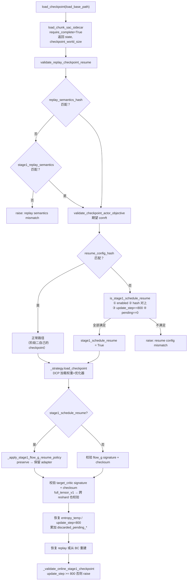

# 第 12 章 Checkpoint、resume 与阶段交接

> 前情提要：第 09 章末尾列出了 `offline_update_800` 的产出物，第 10、11 章讲完了阶段二在做什么。这一章讲把两者接起来的那套机制——它是整条链路里最容易出错、也是第 01 章问题清单里占比最高的部分。

## 知识链接

- 上一章：[阶段二在线目标：三项博弈](./11_阶段二在线三项目标)
- 下一章：[指标手册](./13_指标手册)
- [系列目录](./index)
- 前置：[FSDP 全分片数据并行](/前置知识/001i_前置知识_FSDP全分片数据并行)
- 相关：[第 01 章 9.3 / 9.4 / 9.5 / 9.8 / 9.9](./01_全链路总览#9.-问题-风险与实验安排隐患清单)
- 相关：[第 03 章 4.2 在线阶段的完整性检查](./03_启动层与门禁)

---

## 1. 为什么阶段交接这么难

阶段一和阶段二之间要传递的东西比看起来多：

| 要传的东西 | 存在哪 | 为什么不能丢 |
|------------|--------|--------------|
| critic 权重 | DCP checkpoint | 800 次 Cal-QL 训练的成果 |
| target critic 权重 | DCP checkpoint | 和在线 critic 不同（EMA 滞后 69 次更新） |
| Flow-G gate 权重 | DCP checkpoint | 800 次 actor 训练的成果（gate deviation 2.2%） |
| 两个优化器的状态 | DCP checkpoint | Adam 的一阶二阶动量。丢了等于重新预热 |
| `update_step = 800` | sidecar `.pt` | 决定在线阶段 actor 从第一步就参与更新 |
| replay 快照 | sidecar 目录 | 在线阶段 BC 项需要的 expert 样本 |
| entropy 温度 | sidecar `.pt` | 本链路 $\alpha \equiv 0$，但格式上要有 |
| 各种 checksum / 签名 | sidecar `.pt` | 验证上面这些真的被正确恢复了 |

而阶段二和阶段一有**七处配置差异**（第 04 章 2.2 节），其中四处进 `resume_config_hash`。所以"直接 resume"必然哈希不匹配——需要一套机制既允许合法的差异、又拦住非法的差异。

这套机制就是 `stage1_*` 声明 + `is_stage1_schedule_resume`。它是本章的核心。

## 2. checkpoint 的目录结构

```text
<run_root>/miarena_r1_conrft_critic_warmup_gr00t_n1d7/checkpoints/offline_update_800/
├── runner_state.json
│     └── {global_step, chunk_sac_offline_updates_completed: 800, ...}
└── actor/
    ├── dcp_checkpoint/                    # PyTorch Distributed Checkpoint
    │     └── 模型权重 + optimizer + qf_optimizer + 两个 lr_scheduler
    └── conrft_components/                 # ConRFT 的 sidecar
        ├── alpha_rank_0.pt                # 每个 rank 一份
        ├── ...
        ├── alpha_rank_7.pt
        ├── replay_buffer/
        │     ├── rank_0/
        │     └── ... rank_7/
        ├── complete_rank_0                # 写入屏障标记（空文件）
        └── ... complete_rank_7
```

**目录名 `conrft_components` 来自一个覆写**：

```python
def _checkpoint_component_name(self) -> str:
    return "conrft_components"
```

基类返回 `"chunk_sac_components"`。这个区分是**有意的隔离**：ConRFT 的 sidecar 里有 `chunk_sac_mc_return` 相关的 replay 语义，格式和 Flow-G 不兼容。用不同的目录名让"误 resume Flow-G checkpoint"在文件系统层面就失败，而不是等到反序列化时才报奇怪的错。

Handoff 文档里那句 "Never resume `chunk_sac_components/`" 就是这个意思。

### 2.1 写入顺序是一个屏障

```python
def save_checkpoint(self, save_base_path, step):
    ...
    component_path = Path(save_base_path) / self._checkpoint_component_name()
    component_path.mkdir(parents=True, exist_ok=True)
    completion_marker = component_path / f"complete_rank_{self._rank}"
    completion_marker.unlink(missing_ok=True)          # ① 先删旧标记
    self._strategy.save_checkpoint(...)                 # ② 写 DCP
    torch.save({...}, component_path / f"alpha_rank_{self._rank}.pt")   # ③ 写 sidecar
    if replay_checkpointed:
        self.replay_buffer.save_checkpoint(str(component_path / f"replay_buffer/rank_{self._rank}"))  # ④ 写 replay
    completion_marker.touch()                           # ⑤ 最后打标记
```

**"标记存在"等价于"这个 rank 的全部组件都已落盘"。** 这是标准的写入屏障模式：先清标记、写数据、最后打标记。任何时刻被 kill 掉，标记要么不存在（说明这次保存不完整）、要么存在且数据完整。

远端 shell 的门禁（第 03 章 4.2 节）就是检查这些标记，而且现在会先从 sidecar 读出 world size 再决定检查几个：

```bash
checkpoint_world_size="$("${PYTHON_BIN}" -c 'import sys, torch; print(int(torch.load(sys.argv[1], map_location="cpu", weights_only=False)["world_size"]))' "${component_root}/alpha_rank_0.pt")"
for ((rank = 0; rank < checkpoint_world_size; rank++)); do
  [[ -f "${component_root}/complete_rank_${rank}" ]] || { ...; exit 2; }
done
```

### 2.2 sidecar 里存了什么

`alpha_rank_N.pt` 的内容（从 `save_checkpoint` 里摘的关键字段）：

| 字段 | 用途 | 阶段一的值 |
|------|------|-----------|
| `entropy_temperature` / `alpha_optimizer` / `alpha_scheduler` | 熵温度状态 | $\alpha \equiv 0$，格式占位 |
| `update_step` | actor 调度的位置 | **800** |
| `resume_config_hash` | 配置身份 | 混入 ConRFT 全部超参 |
| `legacy_resume_config_hash` | 旧格式兼容 | — |
| `replay_semantics_hash` | 数据语义身份 | 任务 + 奖励 + chunk 契约 |
| `actor_objective` | 目标函数名 | `"conrft"` |
| `target_critic_signature` / `target_critic_checksum` | target critic 校验 | — |
| `flow_g_adapter_signature` / `flow_g_adapter_checksum` | gate 校验 | — |
| `parameter_checksum_scope` | checksum 口径 | `"full_tensor_v1"` |
| `world_size` | 保存时的 rank 数 | **8** |
| `replay_checkpointed` | replay 是否一起存了 | `True` |
| `replay_total_samples` | replay 规模 | 每 rank 约 1600 |
| `online_valid_physical_steps_global` 等 | 在线采集计数 | 0（离线阶段） |
| `pending_action_slots_global` | 未完成 episode 的槽位 | **0**（离线阶段没有在线 episode） |
| `discarded_pending_*` | 历史丢弃计数 | 0 |
| `critic_calibration_*` | 校准状态 | 本链路禁用 |

## 3. 两个哈希

### 3.1 `replay_semantics_hash`：数据语义身份

它回答"这批 replay 里的数据是按什么规则生成的"。构成（`setup_sac_components` 里）：

```python
replay_semantics = {
    "action_semantics_version": CHUNK_SAC_ACTION_SEMANTICS_VERSION,
    "action_normalization": str(sac_config.action_normalization),           # q01_q99
    "action_statistics_sha256": sha256_file(statistics_path),              # 模型目录下 statistics.json
    "chunk_length": int(sac_config.chunk_length),                          # 16
    "processor_action_horizon_extension": str(...),                        # error
    "action_dim": int(sac_config.action_dim),                              # 62
    "task_config_sha256": sha256_file(task_config_path),                   # open_laptop.yaml 的内容哈希
    "task_description": str(self.cfg.env.train.init_params.task_description),   # "open the laptop"
    "reward_type": str(self.cfg.algorithm.reward_type),                    # chunk_level
    "critic_architecture": str(...),                                       # flat_absolute
}
# 有 bc_dataset_path 时追加
replay_semantics["bc_sampling"] = "global_uniform_physical_step_with_replacement_v2"
replay_semantics["bc_samples_per_episode"] = 256
replay_semantics["bc_reward_mode"] = "terminal_success"
replay_semantics["bc_final_window_length"] = 15
replay_semantics["online_reward_mode"] = "terminal_success"
replay_semantics["online_final_window_length"] = 15
```

**这里面有三个"内容哈希"值得注意**：

1. `action_statistics_sha256`：模型目录下 `statistics.json` 的内容。它定义了动作归一化的分位数，换了 checkpoint 就变。
2. `task_config_sha256`：任务 yaml 的**文件内容**。改一个物理参数就变。
3. `task_description`：字符串本身。把 `"open the laptop"` 改成 `"open laptop"` 就变。

**所以"改任务描述里的一个字"会导致阶段一的 checkpoint 无法被阶段二 resume。** 这是对的——描述变了，VLM 的条件输入就变了，replay 里存的观测语义也变了。但第一次撞上会很困惑，因为报错信息只说 "replay semantics mismatch" 不说是哪个字段。

**调试建议**：如果撞上这个错，把两边的 `replay_semantics` 字典打印出来逐字段比对。这个字典不大，肉眼能看出差异。

阶段一和阶段二的 `replay_semantics_hash` 应当**完全相同**——两个配置的 `bc_reward_mode`、`online_reward_mode`、`chunk_length` 等都一致（第 04 章的核对已经确认）。

### 3.2 `resume_config_hash`：训练配置身份

它回答"这个 checkpoint 是用什么超参训出来的"。构成分三段。

**第一段（`legacy_resume_config_hash` 也包含的部分）**：

```python
resume_config = {
    "replay_semantics_hash": self.replay_semantics_hash,
    "backbone_model_path": str(Path(...).expanduser().resolve()),
    "denoising_steps": 4,
    "gamma": 0.99, "tau": 0.01,
    "sac_bc_coef": 0.0,
    "train_actor_steps": 0,
    "critic_actor_ratio": ...,        # 阶段一 8 / 阶段二 1
    "critic_warmup_updates": 800,
    "actor_data_filter": "all",
    "actor_positive_progress_threshold": 0.0,
    "actor_use_awr_weights": False,
    "critic_calibration": {...},
    "freeze_critic_feature_encoder": True,
    "entropy_tuning": {...},
    "chunk_sac": sac_config,          # ← actor.model.rl_head_config.chunk_sac（head 配置，不是 algorithm.chunk_sac）
    "actor_optim": {...}, "critic_optim": {...},
}
```

**注意 `"chunk_sac"` 这个键存的是 head 配置**（`actor.model.rl_head_config.chunk_sac`），**不是** `algorithm.chunk_sac`。所以 `mode: offline_pretrain` vs `online` 这个差异**不进哈希**——这是设计上必须的，否则两个阶段永远对不上。

**第二段（actor objective 相关）**：

```python
resume_config.update({
    "actor_objective": "conrft",
    "awr_temperature": 1.0, "awr_max_weight": 20.0,
})
```

**第三段（Flow-G 系列特有，`_uses_sac_flow_objective` 为真时追加）**：

```python
resume_config.update({
    "num_updates_per_step": ...,           # 阶段一 4 / 阶段二 35
    "sac_flow_bc_warmup_updates": ...,     # 阶段一 512 / 阶段二 0
    "sac_flow_warmup_bc_coef": 1.0,
})
```

`_uses_sac_flow_objective` 包含 `conrft`：

```python
def _uses_sac_flow_objective(cfg) -> bool:
    return str(cfg.algorithm.get("actor_objective", "direct_q")) in {"sac_flow_g", "conrft"}
```

**最后 ConRFT 再套一层**（`setup_sac_components` 的覆写）：

```python
def setup_sac_components(self) -> None:
    super().setup_sac_components()
    conrft_config = asdict(self.conrft)

    def conrft_hash(chunk_sac_hash: str | None) -> str | None:
        if chunk_sac_hash is None:
            return None
        return stable_hash({"chunk_sac_resume_config_hash": chunk_sac_hash, "conrft": conrft_config})

    self.resume_config_hash = conrft_hash(self.resume_config_hash)
    self.legacy_resume_config_hash = conrft_hash(self.legacy_resume_config_hash)
    self.stage1_schedule_resume_hash = conrft_hash(self.stage1_schedule_resume_hash)
```

**三个哈希都被套上 ConRFT 的超参**。效果是：改 `cql_alpha`、`cql_n_actions`、任何 `*_weight_*`，checkpoint 都不兼容。这个粒度很严，但对"确保 checkpoint 的语义可追溯"是合适的。

## 4. `stage1_*` 声明机制

### 4.1 问题

阶段一和阶段二的 `resume_config_hash` **必然不同**，因为 `num_updates_per_step`（4 vs 35）、`critic_actor_ratio`（8 vs 1）、`sac_flow_bc_warmup_updates`（512 vs 0）、`chunk_sac.eval_initial_noise`（`random` vs `zero`）这四项是阶段二有意改的。

直接放弃哈希检查显然不行——那就失去了"防止误 resume"的能力。

### 4.2 解法：让阶段二显式声明阶段一长什么样

阶段二配置里那一串 `stage1_*` 键就是这个声明：

```yaml
algorithm:
  allow_stage1_schedule_resume: true
  stage1_num_updates_per_step: 4
  stage1_critic_actor_ratio: 8
  stage1_sac_flow_bc_warmup_updates: 512
  stage1_eval_initial_noise: random
  stage1_compute_path_log_prob: false
  stage1_straight_through_action_clip: true
```

worker 用它们**重建一份"阶段一应该长什么样"的配置**，再算哈希：

```python
stage1_num_updates = self.cfg.algorithm.get("stage1_num_updates_per_step", None)
if stage1_num_updates is not None:
    stage1_resume_config = plain_config(resume_config)          # 从当前配置拷一份
    stage1_resume_config.pop("actor_reference", None)
    if self.stage1_replay_semantics_hash is not None:
        stage1_resume_config["replay_semantics_hash"] = self.stage1_replay_semantics_hash
    ...
    stage1_resume_config["num_updates_per_step"] = int(stage1_num_updates)
    stage1_critic_actor_ratio = self.cfg.algorithm.get("stage1_critic_actor_ratio", None)
    if stage1_critic_actor_ratio is not None:
        stage1_resume_config["critic_actor_ratio"] = int(stage1_critic_actor_ratio)
    ...
    stage1_eval_initial_noise = self.cfg.algorithm.get("stage1_eval_initial_noise", None)
    if stage1_eval_initial_noise is not None:
        stage1_resume_config["chunk_sac"]["eval_initial_noise"] = str(stage1_eval_initial_noise)
    stage1_compute_path_log_prob = self.cfg.algorithm.get("stage1_compute_path_log_prob", None)
    if stage1_compute_path_log_prob is not None:
        stage1_resume_config["chunk_sac"]["compute_path_log_prob"] = bool(stage1_compute_path_log_prob)
    stage1_straight_through_action_clip = self.cfg.algorithm.get("stage1_straight_through_action_clip", None)
    if stage1_straight_through_action_clip is False:
        stage1_resume_config["chunk_sac"].pop("straight_through_action_clip", None)      # ← 注意这个分支
    elif stage1_straight_through_action_clip is not None:
        stage1_resume_config["chunk_sac"]["straight_through_action_clip"] = bool(stage1_straight_through_action_clip)
    self.stage1_schedule_resume_hash = stable_hash(stage1_resume_config)
```

**`stage1_straight_through_action_clip is False` 那个 pop 分支值得单独说**：它处理的是"阶段一的配置里**根本没有这个键**"的情况。因为 `stable_hash` 对"键缺失"和"键存在且为 False"给出不同结果，所以必须能表达"缺失"。用 `False` 表示"pop 掉"是一个约定俗成的编码，但它同时也让"阶段一确实设了 `False`"这种情况无法表达。

这是这套机制**最脆的部分**：声明侧和实际侧的对应关系是手工维护的，而且"键缺失"和"键为 False"的编码有歧义。

### 4.3 匹配条件

```python
def is_stage1_schedule_resume(state, expected_hash, critic_warmup_updates, enabled) -> bool:
    return bool(
        enabled                                                          # allow_stage1_schedule_resume
        and expected_hash is not None                                    # stage1_num_updates_per_step 已声明
        and state.get("resume_config_hash") == expected_hash             # 哈希对上
        and int(state.get("update_step", 0)) == int(critic_warmup_updates)   # update_step == 800
        and int(state.get("pending_action_slots_global", 0)) == 0         # 没有未完成的在线 episode
    )
```

四个条件，其中第三条是**第 01 章 9.5 那条"修法和直觉相反"的来源**：

`critic_warmup_updates` 在这里被用作"阶段一应该结束在第几次更新"的期望值。阶段一跑了 800 次，`update_step` 就是 800，所以 `critic_warmup_updates` 必须**保持 800**。如果为了"消除 actor 更新的门槛"把它改成 0，这个等式就变成 $800 = 0$，resume 直接失败。

**同一个配置项在两个地方被用作不同的语义**：

| 使用点 | 语义 |
|--------|------|
| `_should_update_actor` | "actor 从第几次更新开始训" |
| `is_stage1_schedule_resume` | "阶段一应该结束在第几次更新" |

这两个语义在本链路恰好一致（阶段一跑 800 次、在线从第一步就该训 actor），所以复用同一个键是省事的。但它意味着**这个键不能独立调整**。

真正的"防止 actor 静默不更新"的机制是另一个东西：

```python
def load_checkpoint(self, load_base_path):
    super().load_checkpoint(load_base_path)
    self._validate_online_stage1_checkpoint()

def _validate_online_stage1_checkpoint(self) -> None:
    if self._conrft_offline_stage:
        return
    critic_warmup_updates = int(self.cfg.algorithm.get("critic_warmup_updates", 0))
    if self.update_step < critic_warmup_updates:
        raise ValueError(
            "Online ConRFT requires a completed Stage-1 checkpoint: "
            f"update_step={self.update_step}, required={critic_warmup_updates}"
        )
```

`update_step` 不够就直接 raise。静默失败变成显式失败。

### 4.4 一段可以直接跑的核对脚本

**每次改进 `resume_config` 的键，都要重新核对声明侧。** 这是核对方法——compose 两个配置，diff 出差异，逐个确认有对应的 `stage1_*` 声明：

```python
import os
from hydra import compose, initialize_config_dir
from omegaconf import OmegaConf

for k, v in {
    "GROOT_CONRFT_CRITIC_RUN_ROOT": "/tmp/a", "GROOT_CONRFT_RUN_ROOT": "/tmp/b",
    "GROOT_CONRFT_CRITIC_CHECKPOINT": "/tmp/c", "GROOT_SAC_BC_DATASET": "/tmp/d",
    "GROOT_RL_MODEL_PATH": "/tmp/m", "GROOT_RL_BACKBONE_PATH": "/tmp/bb",
    "GROOT_RL_TASK_CONFIG": "/tmp/t.yaml", "GROOT_RL_TASK_DESCRIPTION": "open the laptop",
    "HUMANOID_DATA_ASSET_DIR": "/tmp/h",
}.items():
    os.environ.setdefault(k, v)

d = os.path.abspath("examples/embodiment/config")

def load(name):
    with initialize_config_dir(config_dir=d, version_base=None):
        return compose(config_name=name)

def resume_subset(cfg):
    """摘出进 resume_config 的字段。改了 resume_config 就要同步改这里。"""
    a = cfg.algorithm
    return {
        "denoising_steps": int(cfg.actor.model.denoising_steps),
        "gamma": float(a.gamma), "tau": float(a.tau),
        "sac_bc_coef": float(a.get("sac_bc_coef", 0.0)),
        "train_actor_steps": int(a.get("train_actor_steps", 0)),
        "critic_actor_ratio": int(a.get("critic_actor_ratio", 1)),
        "critic_warmup_updates": int(a.get("critic_warmup_updates", 0)),
        "actor_data_filter": str(a.get("actor_data_filter", "")),
        "actor_use_awr_weights": bool(a.get("actor_use_awr_weights", False)),
        "entropy_tuning": OmegaConf.to_container(a.entropy_tuning, resolve=True),
        "chunk_sac_head": OmegaConf.to_container(cfg.actor.model.rl_head_config.chunk_sac, resolve=True),
        "actor_optim": OmegaConf.to_container(cfg.actor.optim, resolve=True),
        "critic_optim": OmegaConf.to_container(cfg.actor.critic_optim, resolve=True),
        "actor_objective": str(a.get("actor_objective", "")),
        "num_updates_per_step": int(a.num_updates_per_step),
        "sac_flow_bc_warmup_updates": int(a.get("sac_flow_bc_warmup_updates", 0)),
        "sac_flow_warmup_bc_coef": float(a.get("sac_flow_warmup_bc_coef", 0.0)),
    }

s1 = resume_subset(load("miarena_r1_conrft_critic_warmup_gr00t_n1d7"))
s2 = resume_subset(load("miarena_r1_conrft_gr00t_n1d7"))

print("--- 差异（每一条都必须有对应的 stage1_* 声明）:")
for key in s1:
    if s1[key] != s2[key]:
        if key == "chunk_sac_head":
            for kk in set(s1[key]) | set(s2[key]):
                a, b = s1[key].get(kk, "<ABSENT>"), s2[key].get(kk, "<ABSENT>")
                if a != b:
                    print(f"  head.{kk}: stage1={a!r}  stage2={b!r}")
        else:
            print(f"  {key}: stage1={s1[key]!r}  stage2={s2[key]!r}")
```

**当前配置下的输出**：

```text
--- 差异（每一条都必须有对应的 stage1_* 声明）:
  critic_actor_ratio: stage1=8  stage2=1
  head.eval_initial_noise: stage1='random'  stage2='zero'
  num_updates_per_step: stage1=4  stage2=35
  sac_flow_bc_warmup_updates: stage1=512  stage2=0
```

四条差异，对应四个声明：

| 差异 | 阶段一实际 | 声明 | 匹配 |
|------|-----------|------|------|
| `num_updates_per_step` | 4 | `stage1_num_updates_per_step: 4` | ✓ |
| `critic_actor_ratio` | 8 | `stage1_critic_actor_ratio: 8` | ✓ |
| `sac_flow_bc_warmup_updates` | 512 | `stage1_sac_flow_bc_warmup_updates: 512` | ✓ |
| `head.eval_initial_noise` | `random` | `stage1_eval_initial_noise: random` | ✓ |

另外两个声明（`stage1_compute_path_log_prob: false`、`stage1_straight_through_action_clip: true`）对应的字段两阶段同值，所以不出现在差异列表里，但声明它们仍然是必要的——它们保证如果将来某一侧改了，声明侧不会静默偏离。

## 5. `preserve_stage1_flow_g_adapter`

哈希对上之后，`load_checkpoint` 会走进 Flow-G 的阶段一交接逻辑。这里曾经有一个严重问题（第 01 章 9.4）。

### 5.1 曾经的行为

早期代码是：

```python
if stage1_schedule_resume:
    if not bool(self.cfg.algorithm.get("repair_stage1_flow_g_identity", False)):
        raise ValueError("Stage-1 Flow-G resume requires repair_stage1_flow_g_identity=true")
    self._repair_stage1_flow_g_identity()
```

而 `_repair_stage1_flow_g_identity` 做的是：

```python
adapter.reset_identity()                             # gate 权重清零 → g ≡ 1
for parameter in adapter.parameters():
    for value in self.optimizer.state.get(parameter, {}).values():
        if torch.is_tensor(value):
            value.zero_()                            # Adam 动量清零
_reset_optimizer_learning_rate(self.optimizer, self.lr_scheduler, float(self.cfg.actor.optim.lr))
```

**对 Flow-G 链路这是正确的**：Flow-G 的阶段一不训 actor（`offline_train_actor` 缺省为 False），gate 本来就是恒等，reset 只是保证数值干净。

**对 ConRFT 是灾难**：ConRFT 阶段一 `offline_train_actor: true`，800 次 actor 更新把 gate 训到 deviation 2.2%（第 09 章）。reset 之后策略退化成"原始 BC 模型 + 恒等 gate"，离线 actor 训练的全部成果丢失，而且 W2 项在在线阶段一开始也失去了非零起点（第 09 章 1 节的三条理由全部作废）。

### 5.2 现在的行为

新增了一条分支：

```python
def _apply_stage1_flow_g_resume_policy(self) -> None:
    preserve_adapter = bool(self.cfg.algorithm.get("preserve_stage1_flow_g_adapter", False))
    repair_identity = bool(self.cfg.algorithm.get("repair_stage1_flow_g_identity", False))
    if preserve_adapter:
        if repair_identity:
            raise ValueError("Stage-1 Flow-G resume cannot both preserve and reset the adapter")
        self.log_on_first_rank("Preserving the Stage-1 Flow-G adapter and actor optimizer state.")
        return
    if not repair_identity:
        raise ValueError(
            "Stage-1 Flow-G resume requires repair_stage1_flow_g_identity=true "
            "or preserve_stage1_flow_g_adapter=true"
        )
    self._repair_stage1_flow_g_identity()
```

配置侧：

```yaml
algorithm:
  allow_identity_actor_start: false
  repair_stage1_flow_g_identity: false
  preserve_stage1_flow_g_adapter: true
```

并且 `rlinf/config.py` 对在线 ConRFT 强制这个组合：

```python
if conrft_online:
    if identity_actor_start or warmup_updates != 0:
        raise ValueError("Online ConRFT requires a preserved Stage-1 actor and zero Flow-G BC warmup")
    if not preserve_stage1_adapter or repair_stage1_identity:
        raise ValueError("Online ConRFT requires preserve_stage1_flow_g_adapter=true "
                         "and repair_stage1_flow_g_identity=false")
```

**三道保险**：配置里显式设、`_apply_stage1_flow_g_resume_policy` 里互斥检查、`config.py` 里启动时强制。把这个坑彻底封住。

## 6. $8 \to 4$ reshard 与 checksum

阶段一 actor 8 rank，阶段二 4 rank。这个 reshard 涉及两件事。

### 6.1 权重和 replay 的重分片

DCP（PyTorch Distributed Checkpoint）本身支持 resharding——它按 tensor 的全局坐标存储，加载时按新的分片方案重组。sidecar 的加载也接收当前 rank 信息：

```python
state, checkpoint_world_size = load_chunk_sac_sidecar(
    component_path=component_path,
    current_rank=self._rank,
    current_world_size=self._world_size,
    require_complete=_uses_sac_flow_objective(self.cfg),
)
```

`require_complete` 对 ConRFT 为真（`_uses_sac_flow_objective` 包含 `conrft`），所以要求源端所有 rank 的组件都完整。

### 6.2 checksum 曾经被静默跳过

早期的校验带一个 world size 前置条件：

```python
if (checkpoint_world_size == self._world_size
        and self._flow_g_adapter_checksum() != state.get("flow_g_adapter_checksum")):
    raise ValueError("Chunk SAC Flow-G adapter checksum mismatch after restore")
```

$8 \ne 4$，所以这个校验**永远不执行**。原因是当时的 checksum 是**逐 rank 的本地分片** checksum（`module_local_checksum`），reshard 之后每个 rank 持有的分片不同，本地 checksum 自然不同，没法比。

结果是 $8 \to 4$ 交接时只剩 signature（形状/结构）校验，抓不住"权重加载错了但形状对"这类问题（第 01 章 9.8）。

### 6.3 现在：全张量 checksum

新增了一个口径声明字段 `parameter_checksum_scope`：

```python
full_parameter_checksums = (state.get("parameter_checksum_scope") == "full_tensor_v1")
restored_flow_g_checksum = state.get("flow_g_adapter_checksum")
if full_parameter_checksums:
    flow_g_checksum = self._flow_g_adapter_checksum()               # DTensor 完整 materialize 后算
elif checkpoint_world_size == self._world_size:
    adapter = self._flow_g_adapter()
    flow_g_checksum = module_local_checksum(adapter) if adapter is not None else None
else:
    flow_g_checksum = restored_flow_g_checksum                       # 旧格式：放弃校验
    self.log_on_first_rank(
        "Legacy reshard checkpoint has no full-parameter Flow-G "
        "checksum; relying on its distributed numerical signature."
    )
if flow_g_checksum != restored_flow_g_checksum:
    raise ValueError("Chunk SAC Flow-G adapter checksum mismatch after restore")
```

三条分支：

| 分支 | 条件 | 行为 |
|------|------|------|
| 新格式 | `parameter_checksum_scope == "full_tensor_v1"` | 把 DTensor 完整 materialize，算全张量 checksum。**与 world size 无关，reshard 也校验** |
| 旧格式 + 同 world size | `checkpoint_world_size == self._world_size` | 用本地分片 checksum（旧行为） |
| 旧格式 + reshard | 其余 | 放弃校验，打日志 |

target critic 那边是完全对称的逻辑。

**新 checkpoint 一律走第一条分支**，所以 $8 \to 4$ 交接现在有真正的数值校验。第三条分支只为兼容历史 checkpoint 存在。

**代价**：materialize 完整张量需要 all-gather，有通信开销。但这只在 save/load 时发生一次，不影响训练循环。

## 7. 阶段二自己的 checkpoint 与续跑

### 7.1 允许带 pending 片段

第 01 章 9.13 那条。早期配置是 `require_empty_pending_on_save: true`（继承自 flow_g16），意思是"存 checkpoint 时不允许有未完成的 episode"：

```python
validate_pending_episode_checkpoint(
    pending_action_slots,
    require_empty=bool(self.cfg.algorithm.get("require_empty_pending_on_save", False)),
)
```

在异步在线模式下这个要求很难满足——64 个环境连续跑，任何时刻都可能有 episode 在半途。

现在改成 `false`，允许带着 pending 片段存。resume 时这些片段被**显式记账并丢弃**：

```python
restored_pending_valid_steps = int(state.get("pending_valid_steps_global", 0))
restored_pending_action_slots = int(state.get("pending_action_slots_global", 0))
self.discarded_pending_valid_steps_global = (
    int(state.get("discarded_pending_valid_steps_global", 0)) + restored_pending_valid_steps
)
self.discarded_pending_action_slots_global = (
    int(state.get("discarded_pending_action_slots_global", 0)) + restored_pending_action_slots
)
if restored_pending_action_slots:
    self.log_on_first_rank(
        "Discarding incomplete online Chunk-SAC episodes from the checkpoint: "
        f"valid_steps={restored_pending_valid_steps}, action_slots={restored_pending_action_slots}."
    )
```

**为什么丢弃而不是恢复**：pending 片段是"chunk 已经收集但 episode 结果未知"的数据。要恢复它必须同时恢复 env 侧的仿真状态（物理状态、场景布局、已执行步数），而 Isaac Sim 的完整状态不在 checkpoint 里。丢弃是唯一可行的选择。

**丢弃了多少要能查**：`discarded_pending_*` 是**累加**的（不是覆盖），所以多次 resume 之后这个数字反映历史总丢弃量。它是 `chunk_sac/discarded_pending_*` 指标（第 13 章）。

**一个空转的配置**：`allow_pending_episode_discard_on_resume: true` 对 ConRFT 不生效，因为它只被 `validate_pending_episode_resume` 读，而那个调用点被 `if expected_objective == "sac_flow_g"` 包着：

```python
if expected_objective == "sac_flow_g":
    validate_flow_g_online_accounting_state(...)
    validate_pending_episode_resume(
        state,
        allow_pending_discard=bool(self.cfg.algorithm.get("allow_pending_episode_discard_on_resume", False)),
    )
```

实际行为仍然正确（上面那段记账代码是无条件执行的），只是这个键不参与判断。想让它真正生效，把门改成 `_uses_sac_flow_objective(self.cfg)`（该函数已包含 `conrft`）即可。

### 7.2 `resume-online`

脚本层的续跑支持（第 03 章 3.2 节）：

```bash
if (( resume_mode )); then
  if [[ "${stage}" != "online" ]]; then
    echo "Only online ConRFT supports formal in-place resume." >&2
    exit 2
  fi
  resume_checkpoint="$(remote_shell "find '${run_root}/miarena_r1_conrft_gr00t_n1d7/checkpoints' -mindepth 1 -maxdepth 1 -type d -name 'global_step_*' 2>/dev/null | sort -V | tail -n 1")"
  [[ -n "${resume_checkpoint}" ]] || { ...; }
  resume_argument="runner.resume_dir=${resume_checkpoint}"
else
  reuse_guard="if [[ -d '${run_root}' ]] && ...; then echo 'Refusing to reuse non-empty formal run directory' >&2; exit 2; fi"
fi
```

`sort -V` 是版本号排序，保证 `global_step_10` 排在 `global_step_9` 之后（字典序会排错）。

**从阶段二自己的 checkpoint resume 时哈希是匹配的**（同一个配置），所以走的是正常路径，不走 `stage1_schedule_resume`，也不会碰 `_apply_stage1_flow_g_resume_policy`。

**阶段一仍不支持原地续跑**。这不是遗漏——阶段一的中间 checkpoint（`offline_update_100..700`）已被定为不保留，800 次 warmup 中途失败就换 run root 重跑。`_run_offline_prefix` 本身是支持从 `completed_updates` 继续的，只是脚本层不让你走到那一步。

## 8. resume 的完整判定流程

把整章拼起来：



## 9. 排错速查

| 报错信息 | 原因 | 处理 |
|----------|------|------|
| `Chunk SAC checkpoint replay semantics mismatch` | 任务 yaml / 任务描述 / 模型 statistics.json / chunk 语义变了 | 打印两侧 `replay_semantics` 逐字段比对 |
| `Chunk SAC checkpoint resume config mismatch` | `resume_config` 有差异但没有对应的 `stage1_*` 声明 | 跑 4.4 节的核对脚本 |
| `Stage-1 Flow-G resume cannot both preserve and reset the adapter` | `preserve` 和 `repair` 同时为 true | 二选一 |
| `Online ConRFT requires preserve_stage1_flow_g_adapter=true and repair_stage1_flow_g_identity=false` | 配置组合非法 | 按提示改 |
| `Online ConRFT requires a completed Stage-1 checkpoint: update_step=N, required=800` | resume 的不是 `offline_update_800`，或 `update_step` 没恢复 | 检查 `GROOT_CONRFT_CRITIC_CHECKPOINT` 指向哪 |
| `Chunk SAC Flow-G adapter checksum mismatch after restore` | 权重没被正确恢复 | 检查 DCP 目录完整性；看是否 `parameter_checksum_scope` 缺失（旧 checkpoint） |
| `Chunk SAC target critic signature mismatch after restore` | critic 结构变了（`hidden_sizes`、`state_latent_dim` 等） | 结构改动不能 resume |
| `ConRFT Critic checkpoint is incomplete for source actor rank N` | 某个 rank 的 `complete_rank_N` 缺失 | 那次保存不完整，用上一个 checkpoint |
| `Unsupported ConRFT source actor world size: N` | sidecar 里的 world size 不是 4 或 8 | 改了 actor placement |
| `Only online ConRFT supports formal in-place resume.` | 对阶段一用了 `resume-online` | 阶段一换 run root 重跑 |

## 10. 小结

| 主题 | 关键结论 |
|------|----------|
| 组件目录名 | `conrft_components`（不是 `chunk_sac_components`），文件系统层面隔离 Flow-G checkpoint |
| 写入屏障 | 先删标记 → 写 DCP → 写 sidecar → 写 replay → **最后**打 `complete_rank_N` |
| 两个哈希 | `replay_semantics_hash`（数据语义）+ `resume_config_hash`（训练配置） |
| 内容哈希 | 任务 yaml 内容、任务描述字符串、`statistics.json` 都进 `replay_semantics_hash` |
| `resume_config["chunk_sac"]` | 是 **head 配置**，不是 `algorithm.chunk_sac`。所以 `mode` 不进哈希（必须如此） |
| ConRFT 再套一层 | 三个哈希都混入 `algorithm.conrft` 全部字段 |
| 阶段交接机制 | `stage1_*` 声明 + `is_stage1_schedule_resume` 四条件 |
| 当前的四条差异 | `num_updates_per_step`、`critic_actor_ratio`、`sac_flow_bc_warmup_updates`、`head.eval_initial_noise`，全部有匹配声明 |
| `critic_warmup_updates` | 一键两义（actor 门槛 + 阶段一结束位置），**必须保持 800** |
| 防静默失败 | `_validate_online_stage1_checkpoint()`，`update_step < 800` 直接 raise |
| adapter 保留 | `preserve_stage1_flow_g_adapter: true`，三道保险 |
| reshard checksum | `parameter_checksum_scope: "full_tensor_v1"`，DTensor materialize 后算全张量，$8\to4$ 也校验 |
| pending 片段 | 允许带着存，resume 时显式记账并丢弃（`discarded_pending_*` 累加） |
| 续跑 | `resume-online` 只支持在线阶段；阶段一换 run root 重跑 |
| 最脆的地方 | `stage1_*` 声明是手工维护的，"键缺失"用 `False` 编码有歧义。改 `resume_config` 就要跑 4.4 节的脚本 |

## 下章预告

链路全部讲完了。第 13 章是一份指标手册：`conrft/*` 和 `chunk_sac/*` 里每个关键指标在监控什么、正常曲线长什么样、哪些是"训练已经坏了"的早期信号、以及哪几个指标在当前配置下是**失效的**（比如 `log_pi` 恒为 0、阶段一的 `action_mse` 恒为 0）。

→ [第 13 章 指标手册](./13_指标手册)
