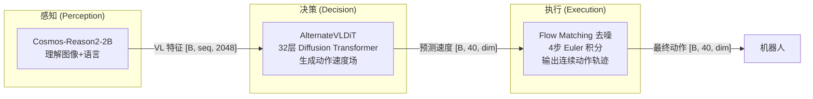
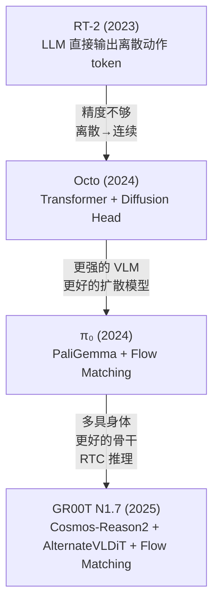
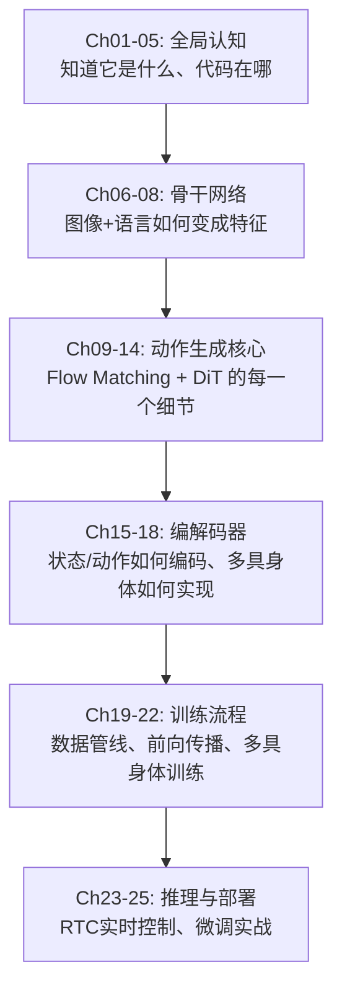

# 全景图：GR00T N1.7 在解决什么问题？

> 从"让一个模型控制所有机器人"这个愿景出发，理解 NVIDIA GR00T 系列的设计目标、技术路线与工程挑战。

## 相关阅读

- [VLA 范式回顾](./02_VLA范式回顾)（本系列第 2 章）
- [OpenPI 深度解析](/系列/openpi_deep_dive/) — 同为 VLA 基础模型的 π₀ 系列

---

## 1. 一个具体场景：为什么需要 GR00T？

假设你有一个实验室，里面有三种完全不同的机器人：

1. **一台双臂机械臂**（如 Franka Panda）：7 个关节 + 1 个夹爪，共 8 维动作空间
2. **一台人形机器人**（如 Unitree G1）：双臂 + 双手 + 腰部 + 导航，共 50+ 维动作空间
3. **一台桌面机械臂**（如 WidowX）：6 个关节 + 1 个夹爪，共 7 维动作空间

你想教它们做各种任务：拧螺丝、叠衣服、搬箱子。传统做法是：**每种机器人训练一个专用模型**。这意味着：

- 3 种机器人 × N 个任务 = 3N 个独立模型
- 每个模型需要大量专属数据
- 从一个机器人学到的"拧"的动作技巧，无法转移给另一个机器人

**GR00T 的愿景是**：训练一个**通用**模型，输入图像 + 语言指令 + 当前状态，输出任何机器人的动作轨迹。一个模型搞定所有机器人、所有任务。

---

## 2. GR00T 系列的核心设计目标

NVIDIA GR00T（Generalist Robot 00 Technology）系列模型的设计目标可以归纳为四个关键词：

### 2.1 通用性（Generality）

一个模型要能同时理解并控制多种形态的机器人。这意味着模型不能对"动作空间是 7 维"这种假设做硬编码。

**GR00T N1.7 的解决方案**：
- 统一动作维度为 `max_action_dim=132`，不够的用零填充 + mask 屏蔽
- 每种机器人有一个 `embodiment_id`（0~31 之间的整数）
- 编解码器使用 `CategorySpecificMLP`——每种 embodiment 有**独立的权重矩阵**

### 2.2 多模态理解（Multimodal Understanding）

机器人需要同时理解：
- **视觉信息**：多个摄像头看到的场景
- **语言指令**：人类的自然语言命令（"把红色杯子放到盘子上"）
- **本体感知**：关节角度、末端执行器位姿等

**GR00T N1.7 的解决方案**：
- 使用 Cosmos-Reason2-2B（基于 Qwen3-VL）作为骨干——这是一个已经在大规模数据上预训练过的视觉-语言模型
- 图像和语言经过 VLM 得到统一的特征表示，再和 state 拼接送入动作生成模块

### 2.3 精准控制（Precise Control）

机器人控制需要毫米级精度。语言模型擅长"理解意图"，但直接用 LLM 输出 token 来控制机械臂精度不够（离散 token 的分辨率有限）。

**GR00T N1.7 的解决方案**：
- 不用 LLM 直接生成动作 token（不像 RT-2 那样）
- 用 **Flow Matching 扩散模型**生成连续动作轨迹——数学上可以达到任意精度
- 预测的是"速度场"（velocity），通过 ODE 积分得到动作

### 2.4 实时性（Real-time Performance）

机器人控制通常需要 10-50 Hz 的控制频率。模型推理不能太慢。

**GR00T N1.7 的解决方案**：
- Flow Matching 只需 **4 步**去噪（对比 DDPM 需要 100-1000 步）
- 引入 **RTC（Real-Time Control）模式**：新动作块复用旧动作块的部分结果，减少冗余计算
- 骨干网络只取 VLM 的前 16 层（`select_layer=16`），截断后面的层以节省计算

---

## 3. 技术路线选择：VLM + Flow Matching + DiT

GR00T N1.7 的架构由三个核心组件构成：



### 为什么是这三个组件？

| 组件 | 替代方案 | GR00T 的选择 | 理由 |
|------|----------|-------------|------|
| 感知 | 从头训练 ViT | 用预训练 VLM (Cosmos-Reason2) | 预训练 VLM 已经学会了"理解世界"，迁移到机器人场景效率极高 |
| 决策 | MLP / Transformer decoder | Diffusion Transformer (DiT) | 扩散模型天然适合多模态分布（同一指令可能有多种正确执行方式） |
| 执行 | DDPM (1000步) / 直接回归 | Flow Matching (4步) | Flow Matching 在数学上等价于直线 ODE，步数极少即可收敛 |

### 这个架构在整个 VLA 领域中的位置



---

## 4. GR00T N1.7 的完整数据流

让我们用一个具体例子走通整个流程。假设我们有一个 Franka 机械臂，接收到指令"抓起红色方块"：

### 输入
- **图像**：2 个视角（外部相机 + 腕部相机），每帧 256×256
- **语言**："pick up the red cube"
- **状态**：7 个关节角 + 3D 末端位姿 + 夹爪状态 = 约 16 维
- **embodiment_id**：26（对应 `REAL_R1_PRO_SHARPA`）

### Step 1：骨干网络处理

```
图像 → ViT 编码 → 视觉 token [B, ~280, 2048]
语言 → Tokenizer → 语言 token [B, ~20, 2048]
拼接 → Qwen3-VL 前 16 层 → VL 特征 [B, 300, 2048]
```

### Step 2：动作头编码

```
状态 [B, 1, 132] → CategorySpecificMLP(embodiment_id=26) → state_features [B, 1, 1536]
噪声动作 [B, 40, 132] + 时间步 → MultiEmbodimentActionEncoder(embodiment_id=26) → action_features [B, 40, 1536]
拼接 → sa_embs [B, 41, 1536]
```

### Step 3：AlternateVLDiT 去噪

```
for t in [0, 1, 2, 3]:  # 4步去噪
    DiT(sa_embs, VL特征, timestep=t) → 预测速度 [B, 41, 1536]
    解码 → velocity [B, 40, 132]
    actions = actions + (1/4) * velocity  # Euler 积分
```

### Step 4：输出

```
最终动作轨迹 [B, 40, 132]
取前 8 维（7关节 + 夹爪）→ 发给机器人执行
```

---

## 5. 与前代 GR00T N1.5 的根本性区别

GR00T N1.7 不只是"换了个骨干网络"这么简单。它在多个维度上做了根本性的重新设计：

| 维度 | N1.5 的做法 | N1.7 的改进 | 改进的效果 |
|------|-----------|-----------|-----------|
| 视觉理解 | Eagle (InternVL 架构) | Cosmos-Reason2 (Qwen3-VL) | 更好的空间推理、多图理解 |
| 信息流 | 所有 VL token 同等对待 | 图像/文本 token 交替注意 | 防止文本被图像 token 淹没 |
| 硬件兼容 | 必须 Flash Attention | 自动检测 + Spark SM121 兼容 | 可以在更多 GPU 上运行 |
| 控制延迟 | 一个 chunk 执行完再推理下一个 | RTC 实时重叠 + 渐进去噪 | 控制更平滑、延迟更低 |
| 动作表示 | (较小的动作空间) | 132维统一 + mask | 从 7DOF 到 50DOF 一个模型搞定 |

---

## 6. 本系列的学习路径



每一章都是自包含的，但按顺序阅读效果最佳。如果你是第一次接触 VLA，建议不要跳章。

---

## 下一章预告

下一章我们将回顾 VLA 模型的发展历程——从最早的 RT-2 到 Octo、π₀，最后到 GR00T。你将理解为什么"VLM + Diffusion"成为了当前 VLA 的主流架构，以及 GR00T 在这条路线上做了哪些独特选择。
