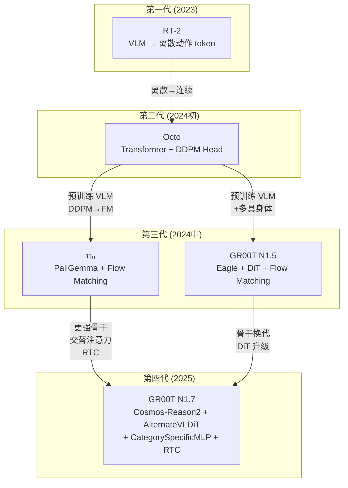

# VLA 范式回顾：视觉-语言-动作模型演进史

> 从 RT-2 到 Octo、π₀ 再到 GR00T——理解 VLA 模型是怎么一步步演化到今天的架构的，以及 GR00T N1.7 在这条技术脉络中的位置。

## 相关阅读

- [全景图：GR00T N1.7 在解决什么问题？](./01_全景图_GR00T_N1d7在解决什么问题)（上一章）
- [从 N1.5 到 N1.7：架构升级](./03_从N1d5到N1d7_架构升级)（下一章）
- [OpenPI 深度解析](/系列/openpi_deep_dive/) — π₀ 的完整技术细节

---

## 前情提要

上一章我们建立了 GR00T N1.7 的全局认知：它是一个"VLM + Flow Matching + DiT"的多具身体通用机器人模型。但这个架构不是凭空出现的——它是 VLA 领域 3 年演进的结果。本章我们回顾这段历史，理解每一代方案解决了什么问题、留下了什么遗憾。

---

## 1. VLA 是什么？

VLA = **Vision-Language-Action** 模型。简单来说：

$$
a_{1:H} = f_\theta(\text{images}, \text{language instruction}, \text{robot state})
$$

> 给定图像观测、语言指令和机器人当前状态，输出未来 $H$ 步的动作序列。

**逐项拆解**：
- $a_{1:H}$：未来 H 步的动作（如关节角速度），形状为 `[H, action_dim]`
- $f_\theta$：参数为 $\theta$ 的神经网络（即 VLA 模型）
- images：可以是多视角、多帧的图像
- language instruction：自然语言描述的任务目标
- robot state：关节角度、末端执行器位姿等本体感知信息

**具体数值例子**：对于 GR00T N1.7 的默认配置：
- $H = 40$（action_horizon），即预测未来 40 步
- $\text{action\_dim} = 132$（统一最大维度）
- 图像：256×256 RGB，可能有 2 个视角

---

## 2. 第一代：RT-2——让 LLM 直接控制机器人

### 2.1 核心思路

Google DeepMind 在 2023 年提出 RT-2，核心想法极其简洁：

**既然大语言模型能理解图像和语言，那能不能直接用它输出机器人动作？**

具体做法：
1. 用一个预训练的 VLM（如 PaLI-X）
2. 把机器人动作**离散化**为 256 个 bin（每个维度）
3. 把离散化后的动作作为"文本 token"追加到 vocabulary 中
4. 用 next-token prediction 的方式生成动作 token

```
输入: [图像 token] [指令 token "pick up red cube"]
输出: [动作 token 128] [动作 token 64] [动作 token 200] ...
       ↑ x位移=0.03  ↑ y位移=-0.02  ↑ 夹爪=0.8
```

### 2.2 优点

- 直接复用了 LLM 的海量预训练知识（包括常识推理能力）
- 架构极其简洁——就是一个 VLM
- 可以用语言做 chain-of-thought 推理再输出动作

### 2.3 致命缺陷

| 问题 | 具体表现 |
|------|---------|
| **精度不够** | 连续空间被量化为 256 bin，分辨率约为 `(max-min)/256`。对于 ±1 的动作空间，分辨率只有 0.008，不满足精密操作需求 |
| **多模态问题** | "抓杯子"可能有多种正确的手部轨迹。自回归生成倾向于产生"平均"轨迹，导致动作模糊 |
| **推理速度慢** | 需要逐 token 生成，7 维动作 × 40 步 = 280 个 token 的自回归推理 |
| **无法处理高维动作** | 人形机器人有 50+ 维动作空间，离散化后 token 数爆炸 |

### 2.4 对 GR00T 的启示

RT-2 验证了"大模型 + 机器人"这条路是可行的，但也暴露了离散动作表示的根本局限。GR00T 从此决定：**动作生成必须用连续方法**。

---

## 3. 第二代：Octo——引入扩散模型做动作头

### 3.1 核心改进

UC Berkeley 在 2024 年提出 Octo，关键洞察是：

**把 VLA 拆成两部分——用 Transformer 做感知和推理，用 Diffusion Head 做动作生成。**

架构变为：
```
图像 + 语言 → Transformer Backbone → 特征
特征 → Diffusion Action Head → 连续动作轨迹
```

### 3.2 这解决了什么问题

- **精度**：扩散模型直接在连续空间上工作，没有量化损失
- **多模态**：扩散模型天然能建模多模态分布——同一输入可以生成不同但都正确的轨迹
- **高维**：不需要逐维度生成，一次性预测整个动作向量

### 3.3 遗留问题

| 问题 | 具体表现 |
|------|---------|
| **Backbone 从头训练** | Octo 用的 Transformer 不是预训练 VLM，视觉理解能力有限 |
| **DDPM 太慢** | 需要 100+ 步去噪，推理延迟大 |
| **单一具身体** | 一个 checkpoint 通常只支持一种机器人 |

---

## 4. 第三代：π₀——VLM + Flow Matching 的结合

### 4.1 核心架构

Physical Intelligence 在 2024 年发布 π₀，将 VLM 和 Flow Matching 结合：

```
图像 → SigLIP（预训练视觉编码器）→ 视觉 token
语言 → Gemma Tokenizer → 文本 token
[视觉 + 文本] → Gemma 2B（预训练 LLM）→ VL 特征
VL 特征 + 噪声动作 → Flow Matching 去噪 → 动作轨迹
```

### 4.2 关键创新

| 创新点 | 描述 | 效果 |
|--------|------|------|
| 预训练 VLM | 使用已经见过海量图文数据的 PaliGemma | 视觉理解能力大幅提升 |
| Flow Matching | 用直线 ODE 替代 DDPM 的马尔可夫链 | 只需 ~10 步去噪 |
| 动作专家 token | 在 Transformer 序列中插入可学习的 action token | 动作预测不影响语言能力 |

### 4.3 π₀ 的局限

- **单 VLM 架构**：PaliGemma 的视觉推理能力不如最新的 VLM（如 Qwen3-VL）
- **多具身体支持有限**：没有 embodiment-specific 的编解码器设计
- **无 RTC 机制**：每次都从纯噪声开始去噪，不利用上一次的推理结果

---

## 5. GR00T N1.7：在 π₀ 基础上的全面升级

GR00T N1.7 可以看作对 π₀ 路线的进一步发展和工程化：

### 5.1 架构设计对比

| 维度 | π₀ | GR00T N1.7 | GR00T 的优势 |
|------|-----|-----------|-------------|
| VLM 骨干 | PaliGemma (SigLIP + Gemma) | Cosmos-Reason2 (Qwen3-VL) | 更强的视觉推理、原生多图支持 |
| VLM 使用方式 | 全量 + action expert token | 前 16 层 + 独立 DiT head | 计算更可控、head 可独立训练 |
| 动作生成 | 嵌入 Transformer 内部 | 独立的 AlternateVLDiT | 更灵活、支持不同大小的 DiT |
| 多具身体 | 简单 MLP + embodiment token | CategorySpecificMLP (独立权重) | 彻底避免不同机器人的参数干扰 |
| Flow Matching 步数 | ~10 步 | 4 步 | 推理更快 |
| 实时控制 | 无 | RTC (inpainting + exponential ramp) | 控制更连续平滑 |
| 训练规模 | 数千小时数据 | DROID + OXE + 自有数据 | 更多样化的机器人类型 |

### 5.2 GR00T N1.7 的核心设计选择

**选择 1：VLM 只用前 N 层，不用完整模型**

```python
# 在 Qwen3Backbone.__init__ 中：
while len(self.model.language_model.layers) > select_layer:
    self.model.language_model.layers.pop(-1)
# 默认 select_layer=16，只保留前 16 层
```

为什么？因为 VLM 的底层学到的是通用视觉-语言特征（对机器人最有用），顶层学到的是生成人类文本的能力（对机器人没用）。截断后可以节省约 50% 的计算量。

**选择 2：动作生成用独立的 DiT，而非嵌入 VLM 中**

π₀ 把 action token 混在 Gemma 的 token 序列中一起处理。GR00T N1.7 选择完全分离：VLM 只负责感知特征提取，DiT 只负责动作生成。

好处：
- VLM 和 DiT 可以用不同的学习率训练
- DiT 的规模可以独立调整（当前是 32 层、48 维 attention head）
- 推理时可以缓存 VLM 的输出，只重复跑 DiT 的去噪循环

**选择 3：交替注意力（AlternateVLDiT）**

标准 DiT 的每一个 cross-attention 层都 attend 所有 VL token（可能 300+ 个）。GR00T N1.7 发现：
- 图像 token 和文本 token 的信息密度不同
- 让 DiT 在不同层关注不同类型的 token 效果更好

具体做法：
- 每 2 个 cross-attention 层中：第 1 层只看文本 token，第 2 层只看图像 token
- 通过 `image_mask` 和 `backbone_attention_mask` 实现

**选择 4：多具身体用独立权重，而非共享 MLP + embodiment embedding**

很多多任务模型（如 Octo）用一个共享 MLP + 加一个 embodiment embedding 来区分不同机器人。GR00T N1.7 更激进——每种机器人有**完全独立的权重矩阵**：

```python
# CategorySpecificLinear: 每种 embodiment 有独立的 W 和 b
self.W = nn.Parameter(0.02 * torch.randn(num_categories, input_dim, hidden_dim))
self.b = nn.Parameter(torch.zeros(num_categories, hidden_dim))

# 前向传播时通过 embodiment_id 选择对应的参数
selected_W = self.W[cat_ids]  # [B, input_dim, hidden_dim]
selected_b = self.b[cat_ids]  # [B, hidden_dim]
output = torch.bmm(x, selected_W) + selected_b.unsqueeze(1)
```

好处：不同机器人的动作编解码完全隔离，不会互相干扰。代价：参数量随 embodiment 数线性增长（但每组只是一个小 MLP，影响不大）。

---

## 6. VLA 领域的技术演化总结



每一代解决了上一代的核心痛点：

| 演化方向 | 具体改进 |
|---------|---------|
| 离散 → 连续 | RT-2 的 token 量化 → 扩散模型的连续预测 |
| 从头训练 → 预训练 | Octo 的 scratch Transformer → 预训练 VLM |
| DDPM → Flow Matching | 100 步去噪 → 4-10 步去噪 |
| 单模型通用 → 具身体专用编解码 | 共享 MLP → CategorySpecificMLP |
| 粗糙注意力 → 精细注意力 | 全局 cross-attention → 交替 image/text attention |
| 独立预测 → 时序连贯 | 每次从噪声开始 → RTC 复用上一轮结果 |

---

## 7. 为什么 GR00T N1.7 的架构选择是合理的？

回到我们在第一章定义的四个设计目标，看 GR00T N1.7 如何用当前架构回应：

| 目标 | 架构对应 | 技术支撑 |
|------|---------|---------|
| **通用性** | CategorySpecificMLP + max_action_dim=132 | 最多 32 种具身体共享一个模型 |
| **多模态理解** | Cosmos-Reason2 (Qwen3-VL) 骨干 | 在万亿 token 上预训练的视觉-语言理解 |
| **精准控制** | Flow Matching + 连续动作空间 | 无量化损失，理论精度无限 |
| **实时性** | 4步去噪 + RTC + 16层截断 | 推理延迟满足 10Hz 控制频率 |

---

## 下一章预告

下一章我们将进行 GR00T N1.5 和 N1.7 的**逐模块对比**——从骨干网络的具体参数、到 DiT 的结构差异、到推理流程的区别。你将看到每一处改动的代码细节和工程考量。
