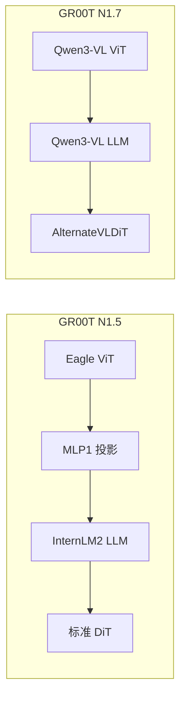
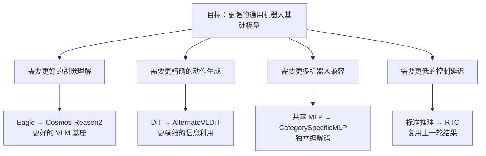

# 从 N1.5 到 N1.7：一次关键的架构升级

> 逐模块对比两代 GR00T 的代码实现，理解每一处改动的技术动机。

## 相关阅读

- [VLA 范式回顾](./02_VLA范式回顾)（上一章）
- [代码地图](./04_代码地图_仓库结构与模块职责)（下一章）
- [Qwen3Backbone 实现详解](./07_Qwen3Backbone实现详解)

---

## 前情提要

上一章我们回顾了 VLA 模型的演进脉络，定位了 GR00T N1.7 在技术谱系中的位置。
本章将深入到代码级别，逐一对比 N1.5（Eagle 骨干）和 N1.7（Cosmos-Reason2 骨干）的
具体实现差异，让你理解每一处"为什么要改"。

---

## 1. 总览：两代架构的宏观对比



第一个显著区别：N1.5 有一个**显式的 MLP1 投影层**把视觉特征映射到 LLM 维度。
N1.7 则由 Qwen3-VL 内部架构原生处理这个对齐——视觉 token 和文本 token 在同一个
embedding 空间中。

---

## 2. 骨干网络对比：Eagle vs Qwen3

### 2.1 模型加载方式

**N1.5 (Eagle)**：
```python
# EagleBackbone.__init__
eagle_path = os.path.join(os.path.dirname(__file__), "nvidia", "Eagle-Block2A-2B-v2")
config = AutoConfig.from_pretrained(eagle_path, trust_remote_code=True)
self.model = AutoModel.from_config(config, trust_remote_code=True)
```

Eagle 使用**本地配置文件**（存在仓库的 `model/modules/nvidia/Eagle-Block2A-2B-v2/` 目录下）
加载模型结构，这意味着模型权重需要单独加载，而且依赖 `trust_remote_code=True` 来
执行自定义代码。

**N1.7 (Qwen3)**：
```python
# Qwen3Backbone.__init__
self.model = Qwen3VLForConditionalGeneration.from_pretrained(
    model_name,  # "nvidia/Cosmos-Reason2-2B"
    **extra_kwargs,
    **transformers_loading_kwargs,
).eval()
```

N1.7 直接使用 HuggingFace 原生的 `from_pretrained`，从 Hub 或本地路径加载完整的
预训练权重。这意味着：
- 不需要自定义代码文件
- 可以直接利用 HF 的缓存和版本管理
- 升级 transformers 版本就能获得新特性（如更好的量化支持）

### 2.2 层截断策略

> 如果你不了解"层截断"是什么、为什么可以只用大模型的前几层，请先阅读 [VLM 层截断：只用大模型的前 N 层](/前置知识/001d_前置知识_VLM层截断_只用大模型的前N层)。

两代模型都使用了层截断（只保留 VLM 的前 N 层），但路径不同：

**N1.5**：
```python
while len(self.model.language_model.model.layers) > select_layer:
    self.model.language_model.model.layers.pop(-1)
```

**N1.7**：
```python
while len(self.model.language_model.layers) > select_layer:
    self.model.language_model.layers.pop(-1)
```

注意路径差异：Eagle 的 LLM（InternLM2）嵌套在 `language_model.model.layers`，
而 Qwen3-VL 的 LLM 直接在 `language_model.layers`。这反映了两个 VLM 架构的
内部组织方式不同。

**为什么要截断？** 默认 `select_layer=16`。完整的 Qwen3-VL 2B 有约 28 层。
截断到 16 层的原因：
1. VLM 底层（1-16层）学到的是**通用视觉-语言对齐特征**——这对机器人控制最有用
2. VLM 顶层（17-28层）学到的是**文本生成能力**——机器人不需要生成文本
3. 截断约 40% 的层可以节省等比例的计算量和显存

### 2.3 冻结参数策略

两代模型的冻结策略完全一致——这属于经过验证的最佳实践：

```python
# 两代共同逻辑：
if not tune_llm:
    self.model.language_model.requires_grad_(False)
if not tune_visual:
    self.model.visual.requires_grad_(False)  # N1.7
    # N1.5 用 self.model.vision_model
```

但有一个重要区别：

| 差异点 | N1.5 (Eagle) | N1.7 (Qwen3) |
|--------|-------------|-------------|
| 视觉模型路径 | `self.model.vision_model` | `self.model.visual` |
| MLP投影层 | `self.model.mlp1`（单独冻结） | 无（Qwen3-VL 内部处理） |
| 冻结时 eval 调用 | `vision_model.eval()` + `mlp1.eval()` | `visual.eval()` |

N1.5 有一个显式的 `mlp1` 投影层——这是 Eagle/InternVL 架构的特有组件，
用于将视觉 token（来自 ViT）的维度投影到 LLM 的隐藏维度。
N1.7 的 Qwen3-VL 则没有这个显式投影层——它在 ViT 和 LLM 之间的对齐是架构内部完成的。

### 2.4 前向传播对比

**N1.5 (Eagle) forward**：
```python
def forward(self, vl_input: BatchFeature) -> BatchFeature:
    keys_to_use = ["input_ids", "attention_mask", "pixel_values"]
    vl_input = {k: vl_input[k] for k in keys_to_use}
    outputs = self.model(**vl_input, output_hidden_states=True)
    outputs = outputs["hidden_states"][-1]  # 注意：dict 索引
    image_mask = vl_input["input_ids"] == self.model.config.image_token_index
    attention_mask = vl_input["attention_mask"] == 1
    return BatchFeature(data={
        "backbone_features": outputs,
        "backbone_attention_mask": attention_mask,
        "image_mask": image_mask,
    })
```

**N1.7 (Qwen3) forward**：
```python
def forward(self, vl_input: BatchFeature) -> BatchFeature:
    keys_to_use = ["input_ids", "attention_mask", "pixel_values", "image_grid_thw"]
    vl_input = {k: vl_input[k] for k in keys_to_use}
    outputs = self.model(**vl_input, output_hidden_states=True)
    outputs = outputs.hidden_states[-1]  # 注意：属性访问
    image_mask = vl_input["input_ids"] == self.model.config.image_token_id
    attention_mask = vl_input["attention_mask"] == 1
    return BatchFeature(data={
        "backbone_features": outputs,
        "backbone_attention_mask": attention_mask,
        "image_mask": image_mask,
    })
```

**关键差异列表**：

| 差异 | N1.5 | N1.7 | 原因 |
|------|------|------|------|
| 输入键 | 3个 | 4个（多了 `image_grid_thw`） | Qwen3-VL 支持动态分辨率，需要告知每张图的 grid 结构 |
| hidden_states 访问 | `outputs["hidden_states"]` (dict) | `outputs.hidden_states` (属性) | transformers 版本差异，新版用属性访问 |
| image token ID 字段 | `config.image_token_index` | `config.image_token_id` | Eagle 和 Qwen3 的 config 命名不同 |

**`image_grid_thw` 是什么？**

Qwen3-VL 支持**动态分辨率**输入——不同大小的图像会被切成不同数量的 patch grid。
`image_grid_thw` 的形状是 `[num_images, 3]`，每行表示一张图像的 `(temporal, height_tiles, width_tiles)`。
例如一张 256×256 的图像在 patch_size=14 时变成 `[1, 18, 18]` 的 grid。

这是 N1.7 相比 N1.5 的重要改进：支持任意分辨率的输入图像，而 Eagle 要求固定大小。

### 2.5 注意力实现对比

**N1.5**：
```python
assert use_flash_attention, "nvidia/Eagle-Block2A-2B-v2 requires flash attention by default"
assert load_bf16, "nvidia/Eagle-Block2A-2B-v2 requires bfloat16 by default"
```

Eagle **强制**要求 Flash Attention 2 和 BF16——没有这两个就无法运行。

**N1.7**：
```python
if use_flash_attention:
    try:
        import flash_attn
        extra_kwargs["attn_implementation"] = "flash_attention_2"
    except ImportError:
        logger.warning("flash_attn is not installed. Falling back to sdpa attention.")
        extra_kwargs["attn_implementation"] = "sdpa"
```

N1.7 做了优雅的降级：优先用 Flash Attention 2，不可用时自动回退到 PyTorch 原生的 SDPA。
而且在 DiT 模块中还有额外的 Spark SM121 兼容处理：

```python
def _is_spark_sm121() -> bool:
    major, minor = torch.cuda.get_device_capability()
    return (major, minor) == (12, 1)

def _sdpa_context():
    if not _should_force_math_sdpa():
        return nullcontext()
    return torch.backends.cuda.sdp_kernel(
        enable_flash=False, enable_math=True,
        enable_mem_efficient=False, enable_cudnn=False,
    )
```

这确保模型能在 NVIDIA Blackwell 架构（SM 12.1 即 "Spark"）上正确运行——
该架构的 memory-efficient SDPA kernel 存在已知问题。

---

## 3. DiT 升级：从标准 DiT 到 AlternateVLDiT

### 3.1 标准 DiT（N1.5 默认使用）

标准 DiT 的 forward 逻辑：

```python
# DiT.forward 简化版
for idx, block in enumerate(self.transformer_blocks):
    if idx % 2 == 1 and self.config.interleave_self_attention:
        # Self-attention: 只看 hidden_states 自身
        hidden_states = block(hidden_states, encoder_hidden_states=None, temb=temb)
    else:
        # Cross-attention: attend 到所有 VL token
        hidden_states = block(hidden_states, 
                             encoder_hidden_states=encoder_hidden_states,
                             temb=temb)
```

**所有 cross-attention 层都同等地 attend 所有 VL token**——不区分哪些是图像、哪些是文本。

### 3.2 AlternateVLDiT（N1.7 默认使用）

AlternateVLDiT 继承自 DiT，但覆盖了 forward 方法：

```python
# AlternateVLDiT.forward 核心逻辑
image_attention_mask = image_mask & backbone_attention_mask
non_image_attention_mask = (~image_mask) & backbone_attention_mask

for idx, block in enumerate(self.transformer_blocks):
    if idx % 2 == 1:
        # 奇数层：Self-attention
        hidden_states = block(hidden_states, encoder_hidden_states=None, temb=temb)
    else:
        # 偶数层：Cross-attention，但交替选择 attend 的对象
        if idx % (2 * self.attend_text_every_n_blocks) == 0:
            curr_mask = non_image_attention_mask  # 只看文本 token
        else:
            curr_mask = image_attention_mask      # 只看图像 token
        hidden_states = block(hidden_states,
                             encoder_hidden_states=encoder_hidden_states,
                             encoder_attention_mask=curr_mask,
                             temb=temb)
```

**关键区别**：

| 层号 (0-indexed) | 标准 DiT | AlternateVLDiT |
|----------|----------|----------------|
| 0 | Cross-Attn → 所有 VL | Cross-Attn → **文本** token |
| 1 | Self-Attn | Self-Attn |
| 2 | Cross-Attn → 所有 VL | Cross-Attn → **图像** token |
| 3 | Self-Attn | Self-Attn |
| 4 | Cross-Attn → 所有 VL | Cross-Attn → **文本** token |
| 5 | Self-Attn | Self-Attn |
| ... | ... | ... |

### 3.3 为什么交替注意力更好？

> 如果你对 Cross-Attention 和交替注意力的概念还不清楚，请先阅读 [Cross-Attention 与交替注意力机制](/前置知识/001e_前置知识_Cross_Attention与交替注意力机制)。

**⚠️ 重要澄清**：交替注意力**不代表**信息互相隔离！每一层的输出通过**残差连接**（`output = input + attention_result`）传递给下一层。所以第 2 层（看图像）的输入**已经包含了**第 0 层（看文本）获取的信息。交替只是说每层**新引入**的外部信息类型不同，但所有信息通过残差逐层累积。

考虑一个典型输入序列的 token 构成：
- 图像 token：约 ~280 个（256×256 图像经 ViT 后）
- 文本 token：约 ~20 个（"pick up the red cube" 分词后）

如果每层都 attend 所有 300 个 token：
1. 文本信息（只有 20 个 token）容易被图像信息（280 个 token）**淹没**
2. 文本 token 携带的是"做什么"的语义信息，图像 token 携带的是"在哪做"的空间信息——它们的信息性质不同

通过交替注意力：
- **文本层**：让动作模型充分理解"要做什么"
- **图像层**：让动作模型精确定位"在哪做"
- 两种信息不会在同一层互相竞争注意力

`attend_text_every_n_blocks=2` 的默认值意味着：每 4 层（2 个 cross-attn 层 + 2 个 self-attn 层）中，
1 层看文本、1 层看图像。文本和图像获得均等的注意力份额，尽管 token 数量悬殊。

---

## 4. 动作编解码器升级

### 4.1 N1.5 的 ActionEncoder

N1.5 使用通用的 `ActionEncoder`（在 `flowmatching_modules.py` 中）：

```python
class ActionEncoder(nn.Module):
    def __init__(self, action_dim, hidden_size):
        self.W1 = nn.Linear(action_dim, hidden_size)      # 共享权重
        self.W2 = nn.Linear(2 * hidden_size, hidden_size)  # 共享权重
        self.W3 = nn.Linear(hidden_size, hidden_size)      # 共享权重
        self.pos_encoding = SinusoidalPositionalEncoding(hidden_size)

    def forward(self, actions, timesteps):
        a_emb = self.W1(actions)                    # 动作嵌入
        tau_emb = self.pos_encoding(timesteps)      # 时间步编码
        x = torch.cat([a_emb, tau_emb], dim=-1)     # 拼接
        x = swish(self.W2(x))                       # 非线性变换
        x = self.W3(x)                              # 输出投影
        return x
```

**问题**：所有机器人共享同一组 W1/W2/W3 权重。当机器人 A 的"前 7 维是关节角"而
机器人 B 的"前 7 维是左臂"时，同一组权重必须学会两种完全不同的映射关系。

### 4.2 N1.7 的 MultiEmbodimentActionEncoder

N1.7 用 `MultiEmbodimentActionEncoder`（在 `embodiment_conditioned_mlp.py` 中）：

```python
class MultiEmbodimentActionEncoder(nn.Module):
    def __init__(self, action_dim, hidden_size, num_embodiments):
        # 每种 embodiment 有独立的权重！
        self.W1 = CategorySpecificLinear(num_embodiments, action_dim, hidden_size)
        self.W2 = CategorySpecificLinear(num_embodiments, 2 * hidden_size, hidden_size)
        self.W3 = CategorySpecificLinear(num_embodiments, hidden_size, hidden_size)
        self.pos_encoding = SinusoidalPositionalEncoding(hidden_size)

    def forward(self, actions, timesteps, cat_ids):  # 多了 cat_ids 参数！
        a_emb = self.W1(actions, cat_ids)           # 用该 embodiment 的专属 W1
        tau_emb = self.pos_encoding(timesteps)
        x = torch.cat([a_emb, tau_emb], dim=-1)
        x = swish(self.W2(x, cat_ids))              # 用该 embodiment 的专属 W2
        x = self.W3(x, cat_ids)                     # 用该 embodiment 的专属 W3
        return x
```

**CategorySpecificLinear 的实现**：
```python
class CategorySpecificLinear(nn.Module):
    def __init__(self, num_categories, input_dim, hidden_dim):
        # 存储 num_categories 组独立的权重矩阵
        self.W = nn.Parameter(0.02 * torch.randn(num_categories, input_dim, hidden_dim))
        self.b = nn.Parameter(torch.zeros(num_categories, hidden_dim))

    def forward(self, x, cat_ids):
        selected_W = self.W[cat_ids]        # [B, input_dim, hidden_dim]
        selected_b = self.b[cat_ids]        # [B, hidden_dim]
        return torch.bmm(x, selected_W) + selected_b.unsqueeze(1)
```

**具体数值例子**：

假设 `max_num_embodiments=32`，`action_dim=132`，`hidden_size=1536`：
- N1.5 的 W1 参数量：$132 \times 1536 = 202,752$
- N1.7 的 W1 参数量：$32 \times 132 \times 1536 = 6,488,064$（约 32 倍）

但这个代价是值得的——32 种机器人的动作空间语义完全不同，共享权重会导致严重的
负迁移。

---

## 5. 推理流程升级：RTC 实时控制

### 5.1 N1.5 的推理流程（标准 action chunking）

```
时刻 T=0: 推理生成 actions[0:40]，执行 actions[0:K]
时刻 T=K: 推理生成 actions[0:40]（从纯噪声开始），执行 actions[0:K]
时刻 T=2K: 推理生成 actions[0:40]（从纯噪声开始），执行 actions[0:K]
...
```

每次推理都从**纯高斯噪声**开始，完全不利用上一次的预测结果。这导致：
1. 相邻 chunk 之间可能出现**不连续跳变**
2. 推理延迟（比如 100ms）导致执行一开始就是"基于过时信息"的

### 5.2 N1.7 的 RTC 推理流程

```
时刻 T=0: 推理生成 actions[0:40]，执行 actions[0:K]
时刻 T=K: 
  - 取上一轮的 actions[K:40] 作为初始化（而非纯噪声）
  - 对前 frozen_steps 位置：vel_strength=0（完全冻结，不去噪）
  - 对 frozen 到 overlap 之间：用 exponential ramp 渐变
  - 对剩余位置：正常去噪
  → 输出更平滑的动作轨迹
```

**核心代码**：
```python
# 1. 用上一轮预测的尾部作为新一轮的头部初始化（inpainting）
actions[:, :rtc_overlap_steps, :] = prev_actions[:, -rtc_overlap_steps:, :]

# 2. 冻结前几步（这些步骤的动作已经在上一轮确定了）
vel_strength[:, :rtc_frozen_steps, :] = 0.0

# 3. 中间过渡区用 exponential ramp
t = torch.linspace(0.0, 1.0, intermediate_steps + 2, device=device)
ramp = 1 - torch.exp(-rtc_ramp_rate * t)
ramp = ramp / ramp[-1].clamp_min(1e-8)  # 归一化到 [0,1]
ramp = ramp[1:-1]  # 去掉首尾的 0 和 1
vel_strength[:, rtc_frozen_steps:rtc_overlap_steps, :] = ramp[None, :, None]

# 4. Euler 积分时乘以 vel_strength
actions = actions + dt * pred_velocity * vel_strength
```

**vel_strength 的空间分布**：

```
位置:    [0, 1, ..., frozen-1, frozen, ..., overlap-1, overlap, ..., 39]
强度:    [0, 0, ..., 0,        ramp↗,  ..., ramp→1,    1,      ..., 1 ]
含义:     ←— 已确定，不动 —→  ←— 渐进过渡 —→     ←— 正常去噪 —→
```

### 5.3 RTC 的效果

| 对比维度 | 无 RTC | 有 RTC |
|---------|--------|--------|
| chunk 过渡 | 可能跳变 | 通过 ramp 平滑过渡 |
| 推理延迟影响 | 旧信息被完全丢弃 | 旧信息被部分保留 |
| 控制频率 | 受限于推理速度 | 可以更高频（因为复用了部分结果） |
| 计算量 | 每次 40 步全去噪 | 冻结部分跳过梯度计算 |

---

## 6. 训练框架升级

### 6.1 Trainer 改进

N1.7 引入了 `Gr00tTrainer`——继承自 HuggingFace 的 `Trainer`，但做了关键优化：

**异步数据预取**：
```python
class _PrefetchIterator:
    """后台线程预取 batch，主线程不等待数据加载"""
    def __init__(self, buffer, bs, collate_fn, total_steps):
        self._q = queue.Queue(maxsize=4)  # 最多预取 4 个 batch
        self._worker = threading.Thread(target=self._fill)
        self._worker.daemon = True
        self._worker.start()
```

传统 Trainer 是同步的：等数据加载完 → 前向 → 反向 → 等数据加载 → ...
Gr00tTrainer 通过后台线程预取，让数据加载和 GPU 计算**并行化**，
减少 GPU 空闲时间。

**内置性能分析**：
```python
# Gr00tTrainer 自动测量数据加载 vs 模型计算的时间占比
# 帮助判断瓶颈是 I/O 还是 GPU
```

### 6.2 Data Collator 差异

**N1.5**：使用自定义的 Eagle Processor + Collator
**N1.7**：使用 `Qwen3VLProcessor` + `Gr00tN1d7DataCollator`

```python
# Gr00tN1d7DataCollator 的关键配置
self.processor = Qwen3VLProcessor.from_pretrained(model_name, **kwargs)
self.processor.tokenizer.padding_side = "left"  # Flash Attention 兼容
```

`padding_side="left"` 是一个容易被忽略但关键的设置——Flash Attention 要求
padding 在序列左侧而非右侧。

---

## 7. 配置参数对比

### 7.1 模型规模参数

| 参数 | N1.5 (推测) | N1.7 (确定) | 说明 |
|------|-----------|-----------|------|
| backbone_embedding_dim | ~2048 | 2048 | VLM 输出维度 |
| hidden_size (DiT) | ~1024 | 1024 | DiT 中间层输出维度 |
| input_embedding_dim | ~1536 | 1536 | state/action 编码后维度 |
| num_layers (DiT) | ~12-24 | 32 | DiT 层数显著增加 |
| num_attention_heads | ~8-16 | 32 | 注意力头数增加 |
| attention_head_dim | ~64 | 48 | 每头维度略小 |
| max_action_dim | 较小 | 132 | 统一动作维度 |
| action_horizon | ~16 | 40 | 预测更长的动作序列 |
| max_num_embodiments | 少量 | 32 | 支持更多机器人类型 |

### 7.2 训练超参数

| 参数 | 默认值 | 说明 |
|------|--------|------|
| num_inference_timesteps | 4 | 推理时只需 4 步去噪 |
| noise_beta_alpha | 1.5 | Beta 分布 α 参数 |
| noise_beta_beta | 1.0 | Beta 分布 β 参数 |
| noise_s | 0.999 | 噪声缩放系数 |
| num_timestep_buckets | 1000 | 离散时间步桶数 |
| state_dropout_prob | 0.2 | 状态 dropout 概率 |
| attn_dropout | 0.2 | 注意力 dropout |
| learning_rate | 1e-4 | 微调学习率 |
| warmup_ratio | 0.05 | 学习率预热比例 |
| max_steps | 10000 (finetune) / 30000 (pretrain) | 训练步数 |

---

## 8. 总结：升级的内在逻辑

从 N1.5 到 N1.7 的升级不是零散的修修补补，而是遵循一条清晰的内在逻辑：



每一项升级都直接对应一个具体的性能瓶颈。这不是"为了升级而升级"，
而是在实际部署中发现的问题驱动的工程迭代。

---

## 下一章预告

下一章我们将进入代码地图——理解 GR00T N1.7 仓库的整体结构、
模块之间的依赖关系和调用链，为后续的深度代码分析做准备。
