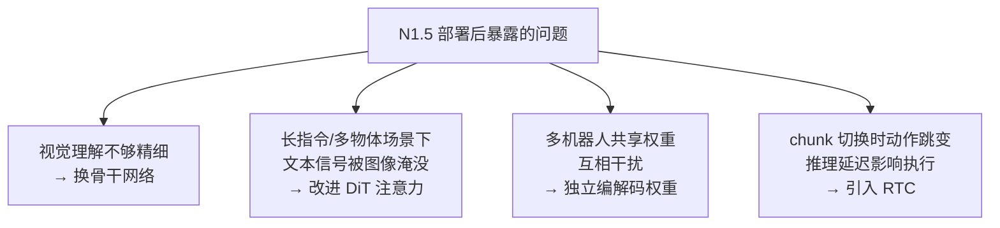
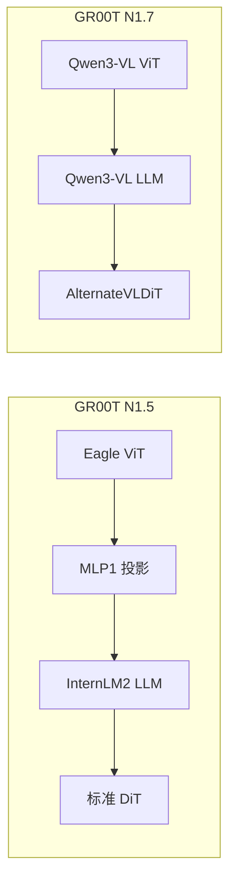
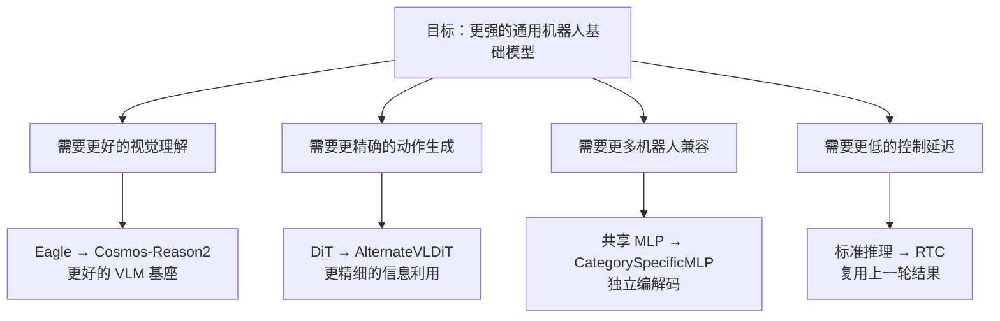

# 从 N1.5 到 N1.7：一次关键的架构升级

> 从"要解决什么问题"出发，理解 GR00T N1.7 相比 N1.5 的四项核心升级——骨干网络、动作生成、多具身体编解码、实时推理。每一项改动的具体实现细节留给后续专章展开，本章只建立"为什么要改"的整体认知。

## 相关阅读

- [VLA 范式回顾](./02_VLA范式回顾)（上一章）
- [代码地图](./04_代码地图_仓库结构与模块职责)（下一章）
- [Qwen3Backbone 实现详解](./07_Qwen3Backbone实现详解)（骨干细节）
- [AlternateVLDiT](./12_AlternateVLDiT_交替注意力设计)（DiT 细节）
- [CategorySpecificMLP](./16_CategorySpecificMLP_多具身体条件化)（编解码器细节）
- [RTC 实时控制](./24_RTC实时控制_动作块重叠)（推理细节）

---

## 前情提要

上一章我们回顾了 VLA 模型的演进脉络，定位了 GR00T N1.7 在技术谱系中的位置。
本章不逐行对比代码——那些细节会在后面每个模块的专章里展开——而是先建立一个更重要的认知：
N1.5 到 N1.7 的每一项改动都是在回应一个**具体的工程瓶颈**，不是无目的的推陈出新。

---

## 1. 总览：四个瓶颈，四项升级

把 N1.5 部署到真实机器人上之后，工程团队观察到四类问题，对应了四项针对性的升级：



宏观上看，两代模型的模块组成也发生了变化——N1.5 的骨干（Eagle）需要一个显式的投影层把
视觉特征对齐到 LLM 维度，而 N1.7 的骨干（Qwen3-VL）把这个对齐做在了架构内部，不再需要
额外的投影层：



下面四节分别展开这四项升级的动机，并各给一个最小示意代码——完整实现请跳转到对应的专章。

---

## 2. 升级一：骨干网络从 Eagle 换成 Cosmos-Reason2（Qwen3-VL）

N1.5 用的 Eagle-Block2A-2B-v2 是一个自定义架构，加载时需要仓库自带的本地配置文件，
并且依赖 `trust_remote_code=True` 执行非官方代码。这带来两个实际问题：一是复现和部署
麻烦（必须带着仓库里的自定义代码一起分发），二是只支持固定分辨率输入，无法适配不同相机的画幅。

N1.7 换成 Cosmos-Reason2-2B（基于 Qwen3-VL 架构），这是 transformers 库原生支持的模型，
直接用标准的 `from_pretrained` 加载架构和权重，不需要任何自定义代码；同时 Qwen3-VL 天然支持
**动态分辨率**，不同大小的图像会被切成不同数量的 patch，通过一个额外的 `image_grid_thw`
张量告知模型每张图的网格结构。这意味着换了骨干之后，模型第一次能够正确处理"手腕相机和
全局相机分辨率不同"这种常见的真实场景。

两代骨干在层截断、冻结策略、attention 后端选择上的思路是一致的（都截断到前 16 层、都默认
冻结骨干、都优先用 Flash Attention），只是因为 VLM 内部结构不同，代码里访问层列表的路径不同：

```python
# Eagle 的 LLM 嵌套了一层 model 容器
self.model.language_model.model.layers
# Qwen3-VL 的 LLM 直接暴露 layers
self.model.language_model.layers
```

这类路径差异是"换一个新 VLM 骨干"时最先要确认的事，具体的加载流程、层截断实现、
冻结逻辑的完整代码走读见 [Qwen3Backbone 实现详解](./07_Qwen3Backbone实现详解)
和 [Eagle vs Qwen3 工程差异](./08_Eagle_vs_Qwen3_两代骨干工程差异)。

---

## 3. 升级二：DiT 的注意力方式——从"一视同仁"到"交替关注"

N1.5 的标准 DiT 在做 Cross-Attention 时，让每一层都同等地关注全部 VL token——不区分
哪些是图像、哪些是文本。这里有一个容易被忽略的问题：一次典型输入里，图像 token 有
将近 280 个（256×256 图像经 ViT 切块后），而文本 token 往往只有 20 个左右（一句指令分词后）。
softmax 注意力权重要在所有 token 间归一化，280:20 的数量悬殊意味着即使网络给文本 token
打出了很高的单个分数，加总起来仍然容易被图像 token 稀释——指令里的关键信息（比如"红色"）
在总体注意力分布里占比可能不到 10%。

N1.7 的解法是让 DiT 中的 Cross-Attention 层**交替**只关注图像或只关注文本（通过 mask
屏蔽另一部分），两种类型的层各自独享一份不被稀释的注意力带宽：

```python
# 交替选择这一层要 attend 图像还是文本（简化示意）
if layer_idx % (2 * attend_text_every_n_blocks) == 0:
    attn_mask = text_only_mask
else:
    attn_mask = image_only_mask
```

需要强调的是，交替不代表信息被隔离——每一层的输出通过残差连接传递给下一层，所以后面
"看图像"的层，输入里已经包含了前面"看文本"的层获取的语义信息。这个设计的完整原理、
调度规则和效果分析见 [AlternateVLDiT](./12_AlternateVLDiT_交替注意力设计)。

---

## 4. 升级三：动作编解码器——从共享权重到多具身体独立权重

N1.5 的 `ActionEncoder` 用一组共享的线性层（W1/W2/W3）处理所有机器人的动作输入。
问题在于不同机器人的动作向量"前几维代表什么"完全不同——Franka 的前 7 维是关节角，
G1 的前几维可能是左臂角度——共享权重意味着同一组参数要同时学会两种毫不相关的映射，
训练数据不均衡时容易出现一个机器人的梯度更新"污染"另一个机器人表现的负迁移问题。

N1.7 把这组线性层换成了 `CategorySpecificLinear`——本质上是给每种机器人分配一组独立的
权重矩阵，前向传播时用一个 `embodiment_id` 从一个大的权重张量里"取出"当前样本该用的那一组：

```python
# 每种机器人拥有独立的一组权重，用 embodiment_id 索引选择
selected_W = self.W[cat_ids]   # (B, in_dim, out_dim)
output = torch.bmm(x, selected_W) + self.b[cat_ids].unsqueeze(1)
```

代价是参数量随机器人种类数近似线性增长（32 种机器人约是共享权重方案的 32 倍），但由于
这几个模块本身是小 MLP，相对于整个 ~3B 参数的模型而言这个代价是可控的，换来的是不同机器人
之间彻底的参数隔离。完整实现（包括维度扩展机制）见 [CategorySpecificMLP](./16_CategorySpecificMLP_多具身体条件化)。

---

## 5. 升级四：推理流程——从每次重新去噪到 RTC 实时控制

N1.5 的推理是标准的 action chunking：每次控制周期都从纯高斯噪声重新去噪出一整段动作，
执行其中前 K 步。这带来两个问题：相邻两次推理的结果之间没有任何关联，容易在 chunk 切换的
瞬间产生动作跳变；同时如果推理本身有延迟（比如 100ms），执行开始时用的已经是"过时"的观测。

N1.7 引入的 RTC（Real-Time Control）不再每次从零开始，而是复用上一轮预测的尾部作为
这一轮的初始化，并且让"已经执行过的时间段"在这一轮里完全冻结不再改动，中间用一段
平滑的渐变区连接冻结区和正常去噪区：

```python
# 用上一轮的尾部结果初始化这一轮的对应位置（而非纯噪声）
actions[:, :overlap_steps, :] = prev_actions[:, -overlap_steps:, :]
# 已确定的部分冻结，不再更新
vel_strength[:, :frozen_steps, :] = 0.0
```

这个"部分冻结 + 渐变过渡"的机制让相邻两次推理的输出自然衔接，完整的调度逻辑（指数渐变
曲线怎么算、冻结区和过渡区怎么划分）见 [RTC 实时控制](./24_RTC实时控制_动作块重叠)。

---

## 6. 训练框架的配套改动

除了模型架构本身，N1.7 在训练框架上也做了两处工程优化，目的是让上面这些更大、更复杂的
模块能训练得更快：

- **异步数据预取**：`Gr00tTrainer` 用后台线程提前加载下一个 batch，让数据 I/O 和 GPU 计算
  并行进行，而不是像传统 Trainer 那样等数据加载完才开始计算，减少 GPU 空闲等待的时间。
- **Processor 切换**：数据预处理从自定义的 Eagle Processor 换成了 transformers 原生的
  `Qwen3VLProcessor`，并把 padding 方向设为左侧（`padding_side="left"`）——这是 Flash Attention
  在处理变长序列时的常见要求，保证所有序列的最后一个 token 都对齐在同一位置，方便后续取用。

---

## 7. 一张表看懂关键参数的变化

前面四节讲的设计升级，最终都会落到具体的配置数字上。这里只做一个高层对照，
每个参数背后的完整设计考量在 [配置系统全参数解读](./05_配置系统_全参数解读) 中逐一展开：

| 参数 | N1.5（推测） | N1.7（确定） | 对应哪项升级 |
|------|-----------|-----------|------|
| 骨干模型 | Eagle-Block2A-2B-v2 | Cosmos-Reason2-2B (Qwen3-VL) | 升级一 |
| DiT 层数 | ~12-24 | 32 | 升级二 |
| DiT 注意力头数 | ~8-16 | 32 | 升级二 |
| `use_alternate_vl_dit` | 不适用 | `True` | 升级二 |
| `max_num_embodiments` | 少量 | 32 | 升级三 |
| `max_action_dim` | 较小 | 132 | 升级三 |
| `action_horizon` | ~16 | 40 | 升级三 / 升级四 |
| 推理策略 | 标准 chunking | RTC | 升级四 |

---

## 8. 总结：升级的内在逻辑

从 N1.5 到 N1.7 的四项升级不是零散的修修补补，而是各自回应一个部署中发现的具体瓶颈：



带着这四条主线去读后面的章节，会更容易理解每个模块的设计为什么是这样，而不是孤立地记住一堆实现细节。

---

## 下一章预告

下一章我们将进入代码地图——理解 GR00T N1.7 仓库的整体结构、
模块之间的依赖关系和调用链，为后续的深度代码分析做准备。
