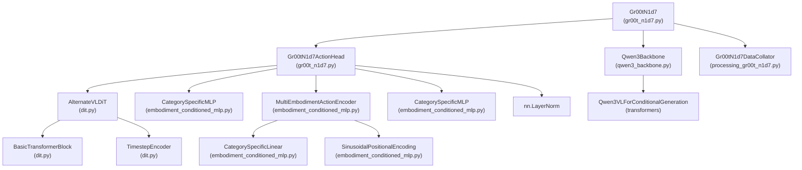
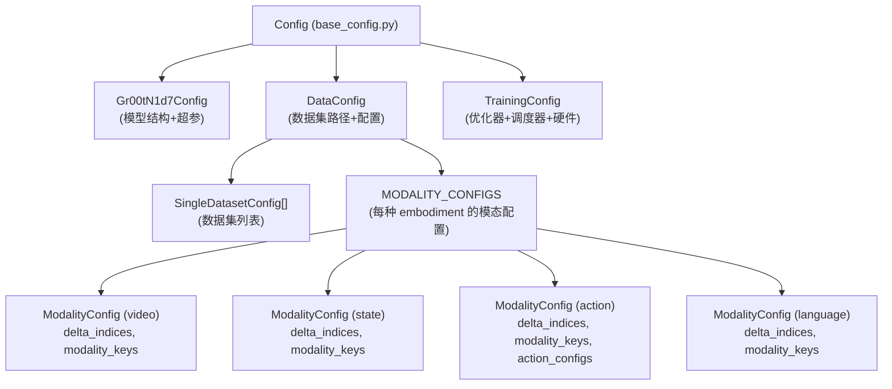
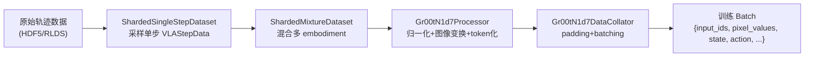
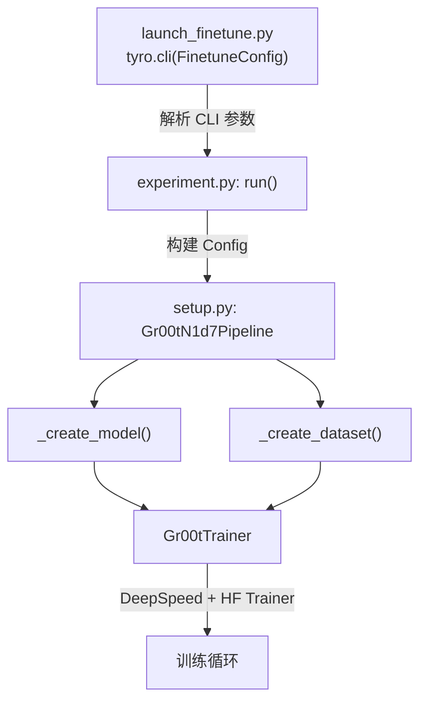
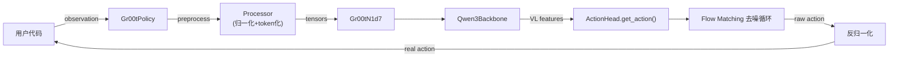

# 代码地图：仓库结构与模块职责

> 在深入任何一个模块之前，先建立全局视角——代码怎么组织、调用链是什么、从哪里开始读。

## 相关阅读

- [从 N1.5 到 N1.7](./03_从N1d5到N1d7_架构升级)（上一章）
- [配置系统全参数解读](./05_配置系统_全参数解读)（下一章）

---

## 前情提要

上一章我们从宏观层面对比了 N1.5 和 N1.7 的代码差异。本章我们暂停"对比"视角，
转而建立对 N1.7 代码仓库的**完整心智模型**——当你想找某个功能的实现时，
知道该去哪个文件找。

---

## 1. 顶层目录结构

```
gr00t/
├── __init__.py
├── model/                    # 🧠 模型定义（本系列重点）
├── configs/                  # ⚙️ 配置文件和 dataclass
├── data/                     # 📦 数据加载和处理
├── experiment/               # 🔬 训练启动和 Trainer
├── eval/                     # 📊 评估和推理
├── policy/                   # 🎯 Policy 封装（推理接口）
├── scripts/                  # 🛠️ 工具脚本
├── utils/                    # 🔧 通用工具
├── checkpoints/              # 💾 模型权重存放
└── docs/                     # 📄 文档
```

---

## 2. model/ 目录：模型定义的核心

这是整个项目最重要的目录，本系列大部分章节都在拆解这里的代码。

```
model/
├── __init__.py
├── registry.py                    # 模型注册表
├── base/
│   └── model_pipeline.py          # ModelPipeline 基类
├── gr00t_n1d7/                    # N1.7 主模型
│   ├── __init__.py
│   ├── gr00t_n1d7.py              # ⭐ 主模型类 Gr00tN1d7 + ActionHead
│   ├── processing_gr00t_n1d7.py   # ⭐ Processor + DataCollator
│   ├── image_augmentations.py     # 图像增强策略
│   └── setup.py                   # Pipeline 配置（训练入口）
└── modules/                       # 可复用模块
    ├── __init__.py
    ├── dit.py                     # ⭐ DiT / AlternateVLDiT / SelfAttentionTransformer
    ├── eagle_backbone.py          # N1.5 骨干（保留做对比）
    ├── qwen3_backbone.py          # ⭐ N1.7 骨干
    ├── flowmatching_modules.py    # Flow Matching 通用组件
    ├── embodiment_conditioned_mlp.py  # ⭐ 多具身体编解码器
    └── nvidia/
        └── Eagle-Block2A-2B-v2/   # Eagle 模型的本地配置
```

### 2.1 核心文件职责

| 文件 | 核心类/函数 | 职责 |
|------|-----------|------|
| `gr00t_n1d7.py` | `Gr00tN1d7`, `Gr00tN1d7ActionHead` | 主模型，前向传播和推理入口 |
| `qwen3_backbone.py` | `Qwen3Backbone` | VLM 骨干网络封装 |
| `dit.py` | `DiT`, `AlternateVLDiT`, `BasicTransformerBlock` | 扩散 Transformer |
| `embodiment_conditioned_mlp.py` | `CategorySpecificMLP`, `MultiEmbodimentActionEncoder` | 多具身体编解码 |
| `processing_gr00t_n1d7.py` | `Gr00tN1d7Processor`, `Gr00tN1d7DataCollator` | 数据预处理和 batch 构建 |
| `setup.py` | `Gr00tN1d7Pipeline` | 训练 pipeline 组装 |

### 2.2 模块间调用关系



---

## 3. configs/ 目录：所有超参数的定义

```
configs/
├── __init__.py
├── base_config.py             # Config 总配置类
├── finetune_config.py         # ⭐ 微调专用配置 (CLI 入口参数)
├── model/
│   ├── __init__.py
│   └── gr00t_n1d7.py          # ⭐ Gr00tN1d7Config (模型超参)
├── data/
│   ├── __init__.py
│   ├── data_config.py         # DataConfig (数据配置)
│   └── embodiment_configs.py  # ⭐ MODALITY_CONFIGS (每种机器人的配置)
├── training/
│   ├── __init__.py
│   └── training_config.py     # TrainingConfig (训练超参)
├── deepspeed/
│   ├── zero2_config.json      # DeepSpeed ZeRO-2 配置
│   └── zero3_config.json      # DeepSpeed ZeRO-3 配置
└── egoscale/                  # 特定实验配置
```

### 3.1 配置类的层次关系



### 3.2 两种使用方式

**预训练/全量训练**：通过 `Config` (YAML) + `launch_train.py` 启动
```bash
python -m gr00t.experiment.launch_train --config path/to/config.yaml
```

**微调**：通过 `FinetuneConfig` (CLI args) + `launch_finetune.py` 启动
```bash
python -m gr00t.experiment.launch_finetune \
    --base-model-path nvidia/GR00T-N1.7-3B \
    --dataset-path /path/to/data \
    --embodiment-tag NEW_EMBODIMENT \
    --tune-diffusion-model
```

微调模式更简洁——它内部会把 CLI 参数映射到 `Config` 对象中。

---

## 4. data/ 目录：数据加载全链路

```
data/
├── __init__.py
├── types.py                   # ⭐ VLAStepData, ModalityConfig, ActionConfig 等核心数据类型
├── interfaces.py              # BaseProcessor 接口定义
├── embodiment_tags.py         # ⭐ EmbodimentTag 枚举（所有支持的机器人）
├── stats.py                   # 数据统计量计算（min/max/mean/std/percentile）
├── utils.py                   # 归一化、sin/cos 编码等工具
├── dataset/
│   ├── factory.py             # DatasetFactory（数据集构建入口）
│   ├── sharded_single_step_dataset.py   # 单步数据集（分片加载）
│   └── sharded_mixture_dataset.py       # 混合数据集（多 embodiment 混合采样）
├── state_action/
│   ├── state_action_processor.py  # ⭐ 状态/动作归一化处理器
│   ├── action_chunking.py         # 动作块处理
│   └── pose.py                    # 末端执行器位姿变换
└── collator/                  # Batch 构建
```

### 4.1 数据流向



### 4.2 VLAStepData 的结构

每一步的训练数据被封装为 `VLAStepData`：

```python
@dataclass
class VLAStepData:
    images: dict[str, list[np.ndarray]]     # {"camera1": [frame_t-15, frame_t], ...}
    states: dict[str, np.ndarray]           # {"joint_position": [7], "gripper": [1]}
    actions: dict[str, np.ndarray]          # {"joint_position": [40, 7], ...}
    masks: dict[str, list[np.ndarray]] | None  # 可选的分割 mask
    text: str | None                        # "pick up the red cube"
    embodiment: EmbodimentTag               # REAL_R1_PRO_SHARPA
    is_demonstration: bool                  # True/False
    metadata: dict[str, Any]                # 额外元数据
```

---

## 5. experiment/ 目录：训练逻辑

```
experiment/
├── __init__.py
├── experiment.py          # 训练入口 run() 函数
├── launch_train.py        # 全量训练 CLI 入口
├── launch_finetune.py     # ⭐ 微调 CLI 入口
├── trainer.py             # ⭐ Gr00tTrainer（异步数据+性能分析）
├── dist_utils.py          # 分布式工具（barrier, rank 等）
└── utils.py               # 训练工具
```

### 5.1 训练启动流程



---

## 6. policy/ 目录：推理封装

```
policy/
├── __init__.py
├── policy.py              # BasePolicy 抽象基类
├── gr00t_policy.py        # ⭐ Gr00tPolicy（主推理接口）
├── replay_policy.py       # 回放策略（用于 debug）
└── server_client.py       # Server-Client 远程推理
```

### 6.1 Gr00tPolicy 的使用方式

```python
from gr00t.policy.gr00t_policy import Gr00tPolicy

policy = Gr00tPolicy(
    embodiment_tag="REAL_R1_PRO_SHARPA",
    model_path="/path/to/checkpoint",
    device="cuda:0",
)

# 每个控制周期调用一次
action = policy.get_action(observation={
    "video.exterior_image_1_left": image_frame,
    "state.joint_position": joint_angles,
    "annotation.language.language_instruction": "pick up red cube",
})
```

### 6.2 推理调用链



---

## 7. eval/ 目录：评估系统

```
eval/
├── open_loop_eval.py      # 开环评估（离线轨迹比较）
├── rollout_policy.py      # 闭环 rollout 工具
├── run_gr00t_server.py    # 推理服务器
├── run_groot_eval_server.py  # 评估服务器
├── real_robot/            # 真机评估
└── sim/                   # 仿真评估
```

开环评估和闭环评估的区别：
- **开环**：给定一条真实轨迹的初始状态，模型预测动作，比较预测动作和真实动作的 MSE
- **闭环**：模型控制仿真/真机执行任务，看任务成功率

---

## 8. 从"我想做 X"到"去看哪个文件"

| 我想... | 去看... |
|---------|--------|
| 理解模型整体结构 | `model/gr00t_n1d7/gr00t_n1d7.py` 的 `Gr00tN1d7` 类 |
| 理解 DiT 如何工作 | `model/modules/dit.py` 的 `AlternateVLDiT` 类 |
| 理解多具身体编码 | `model/modules/embodiment_conditioned_mlp.py` |
| 理解骨干网络 | `model/modules/qwen3_backbone.py` |
| 理解数据如何预处理 | `model/gr00t_n1d7/processing_gr00t_n1d7.py` |
| 理解图像增强 | `model/gr00t_n1d7/image_augmentations.py` |
| 修改训练超参 | `configs/model/gr00t_n1d7.py` 的 `Gr00tN1d7Config` |
| 添加新机器人 | `configs/data/embodiment_configs.py` + `data/embodiment_tags.py` |
| 启动微调 | `experiment/launch_finetune.py` |
| 部署推理 | `policy/gr00t_policy.py` |
| 添加新的数据集 | `data/dataset/factory.py` + 配置文件 |
| 理解归一化逻辑 | `data/state_action/state_action_processor.py` |
| 理解 RTC 推理 | `model/gr00t_n1d7/gr00t_n1d7.py` 的 `get_action_with_features()` |

---

## 9. 关键设计模式

### 9.1 注册机制

模型通过 HuggingFace 的 `AutoConfig.register` 和 `AutoModel.register` 注册，
这样可以用 `AutoModel.from_pretrained("path")` 自动加载正确的模型类：

```python
# 在 gr00t_n1d7.py 末尾
AutoConfig.register("Gr00tN1d7", Gr00tN1d7Config)
AutoModel.register(Gr00tN1d7Config, Gr00tN1d7)
```

### 9.2 Pipeline 模式

`Gr00tN1d7Pipeline` 负责把 Config → Model + Dataset + Collator 的组装逻辑：

```python
class Gr00tN1d7Pipeline(ModelPipeline):
    model_class = Gr00tN1d7
    processor_class = Gr00tN1d7Processor
    
    def setup(self):
        self.model = self._create_model()
        self.train_dataset, self.eval_dataset = self._create_dataset(...)
        self.data_collator = self._create_collator()
```

### 9.3 BatchFeature 作为统一数据容器

模型内部的中间数据全部用 HuggingFace 的 `BatchFeature`（本质是一个 dict 的封装）传递：

```python
# 骨干网络输出
BatchFeature(data={
    "backbone_features": tensor,       # [B, seq_len, 2048]
    "backbone_attention_mask": tensor,  # [B, seq_len]
    "image_mask": tensor,              # [B, seq_len] (bool)
})

# 动作头输出
BatchFeature(data={
    "loss": scalar,
    "action_loss": tensor,
    "action_mask": tensor,
    "backbone_features": tensor,
    "state_features": tensor,
})
```

这种设计让模块间的接口清晰、可扩展——添加新的中间量只需在 dict 中加一个键。

---

## 下一章预告

下一章我们将逐一解读 `Gr00tN1d7Config` 中的**每一个参数**——它的含义、默认值的选择理由、以及修改它会产生什么影响。这是真正动手微调之前必须掌握的基础。
