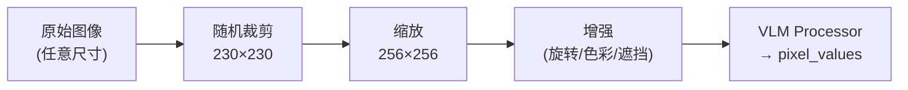

# 配置系统：从模型设计看懂 Gr00tN1d7Config

> 配置参数不是一堆孤立的开关——每一个参数背后都对应模型的一个具体设计决策。本章不按字典顺序罗列参数，而是先讲清楚"为什么要这样设计"，再告诉你这个设计对应哪个配置字段。

## 相关阅读

- [代码地图](./04_代码地图_仓库结构与模块职责)（上一章）
- [Cosmos-Reason2-2B](./06_Cosmos_Reason2_为什么选Qwen3VL)（下一章）
- [后训练实战](./25_后训练实战_微调全流程)（微调时如何调参）

---

## 前情提要

上一章我们建立了代码的全局地图，知道了 `Gr00tN1d7Config` 在 `configs/model/gr00t_n1d7.py` 中定义。
本章要解决一个常见的误区：很多人学配置的方式是打开文档，从上到下把参数表背一遍——
但这样记住的只是"有哪些旋钮"，不知道"为什么是这个值"，改起来就是蒙着眼睛试。

正确的顺序应该反过来：先理解模型每个部分**为什么要这样设计**，配置字段自然就是这个设计的"数值化表达"。
本章会按照这个顺序，带你走一遍 GR00T N1.7 的七个核心设计决策，每讲完一个设计，再告诉你它对应哪些配置字段。

---

## 1. 设计决策一：VLM 骨干要不要整个搬过来？

### 1.1 问题是什么

GR00T N1.7 的"眼睛和语言理解"来自一个预训练好的视觉语言模型（VLM）——Cosmos-Reason2-2B，
本质上是一个 Qwen3-VL 架构的模型。这个 VLM 单独训练时用了海量的图文数据，参数量以十亿计。

现在要把它接到机器人控制任务上，第一个要回答的问题是：**要不要把整个 VLM 都原样保留、并且允许训练时改动它？**

这里有两个子问题需要分别决策：

1. **要保留 VLM 的所有层吗？** 完整的 Qwen3-VL 语言模型部分有约 28 层。GR00T 的经验是：
   底层（约前 50%~60%）学到的是通用的视觉-语言对齐特征，这正是机器人控制最需要的；
   顶层则更专注于生成流畅文本，这个能力对机器人没有用处。所以没必要保留全部层数——
   物理删除掉用不上的顶层，可以省下对应比例的显存和计算量。

2. **微调时要不要更新 VLM 的权重？** VLM 已经在海量数据上训练过，具备了很强的通用能力。
   如果直接对它做微调，而下游的机器人数据集通常只有几千到几十万条轨迹，数据量远小于
   VLM 预训练用的数据——这样的微调很容易把 VLM 已经学到的能力"冲掉"，也就是**灾难性遗忘**。
   因此默认策略是把整个骨干**冻结**，只训练后面新增的动作头部分（约占总参数量的 10%）。

理解了这两个设计动机，下面这些配置字段的含义就很自然了：

| 参数 | 默认值 | 对应哪个设计决策 |
|------|--------|-----------------|
| `model_name` | `"nvidia/Cosmos-Reason2-2B"` | 决定用哪个预训练 VLM 作骨干 |
| `select_layer` | `16` | 决定"保留 VLM 前多少层"——16 层约为 28 层的 57%，是经验证的最优截断点 |
| `tune_llm` | `False` | 决定"是否允许微调 LLM 部分"——默认冻结，防止灾难性遗忘 |
| `tune_visual` | `False` | 决定"是否允许微调视觉编码器"——同上，默认冻结 |
| `tune_top_llm_layers` | `0` | 一种折中方案：只微调 LLM 最顶部的 N 层，而不是全部或完全不动 |
| `backbone_embedding_dim` | `2048` | VLM 截断后输出特征的维度，下游模块要按这个维度对齐 |
| `model_revision` | `None` | 指定模型的具体版本（git commit hash），保证可复现 |
| `backbone_model_type` | `"qwen"` | 骨干类型标识，用于选择匹配的 Processor |
| `use_flash_attention` | `True` | 是否用 Flash Attention 加速骨干的注意力计算 |
| `load_bf16` | `False` | 是否以 BF16 精度加载骨干权重，节省显存 |
| `reproject_vision` | `False` | 是否对视觉特征做额外的重投影（一般不需要） |

### 1.2 层截断具体怎么实现

> 如果你还不熟悉"为什么可以只用大模型的前几层"，请先看 [VLM 层截断](/前置知识/001d_前置知识_VLM层截断_只用大模型的前N层)。

`select_layer` 的效果是在模型初始化阶段，把多出来的层从层列表里物理删除，而不是简单地在前向传播时跳过它们：

```python
while len(self.model.language_model.layers) > select_layer:
    self.model.language_model.layers.pop(-1)
```

物理删除（而非跳过）的好处是权重文件本身不会保存那些多余的层，加载模型时也不需要为它们分配显存。

**改这个值会怎样？** 想要更强的语言理解能力，可以增大到 20~24 层，代价是推理变慢；
想要更快的推理速度，可以减小到 12 层，但可能牺牲一部分场景理解能力。

### 1.3 冻结骨干时,精度怎么处理

默认 `tune_llm=False` 且 `tune_visual=False`——但如果打开了 `tune_top_llm_layers` 让顶部若干层可训练，
同时又用 `load_bf16=True` 加载了骨干权重，就会出现一个精度问题：BF16 只有约 3~4 位有效数字，
梯度在这么低的精度下累积容易产生明显误差。`backbone_trainable_params_fp32=True` 的作用就是
把这部分**可训练**的参数单独转换为 FP32，冻结的部分仍然保持 BF16——只对需要精确梯度更新的地方多花一点显存。

---

## 2. 设计决策二：图像输入要经过怎样的标准化和增强？

### 2.1 问题是什么

机器人的摄像头拍出来的画面存在两类不确定性：**相机安装位置的微小偏差**（每次拆装、每台机器人都不完全一样）
和**光照、色彩的环境变化**。如果直接把原始图像喂给模型，模型很容易学到"过拟合到这一台机器人的这一次安装角度"的脆弱特征。

解决思路是在训练时对图像做**随机的、可控范围内的扰动**——让模型在训练阶段就见过大量"略有偏差"的图像，
这样面对真实部署时的相机误差就有了天然的鲁棒性。整个标准化流程分三步：

1. **随机裁剪**：从原图中截取一个略小的区域，天然模拟了相机位置的随机偏移
2. **缩放到统一尺寸**：保证喂给 VLM 的图像尺寸一致
3. **额外增强（可选）**：旋转、色彩抖动等进一步增加训练数据的多样性



这个设计对应的配置字段如下：

| 参数 | 默认值 | 对应设计动机 |
|------|--------|-------------|
| `image_crop_size` | `(230, 230)` | 随机裁剪的目标大小——模拟相机安装偏差 |
| `image_target_size` | `(256, 256)` | 裁剪后统一缩放到的尺寸，喂给 VLM |
| `shortest_image_edge` | `None` | 按短边缩放（Qwen3-VL 支持动态分辨率时使用） |
| `crop_fraction` | `None` | 中心裁剪比例（另一种裁剪策略，一般不与随机裁剪同时用） |
| `random_rotation_angle` | `None` | 额外的随机旋转范围（度） |
| `color_jitter_params` | `None` | 额外的颜色抖动参数 |
| `use_albumentations_transforms` | `True` | 用哪个增强库来实现上述变换 |
| `extra_augmentation_config` | `None` | 更复杂的增强（如基于 mask 的遮挡）配置入口 |

### 2.2 为什么裁剪尺寸比目标尺寸小

`image_crop_size=(230, 230)` 而 `image_target_size=(256, 256)`——裁剪尺寸**小于**目标尺寸，
这不是笔误。训练时先从原图裁出 230×230 的区域再放大到 256×256，这样就产生了 `±13 像素`的随机偏移空间：
每次训练看到的"同一张图"实际上是略微不同的局部区域，这正是对抗相机安装误差的关键——
如果裁剪尺寸和目标尺寸相同，就没有随机偏移的空间了。

### 2.3 为什么要用 Albumentations 而不是 torchvision

`use_albumentations_transforms=True` 背后的动机是**多视角一致性**问题。机器人通常有多个相机
（比如手腕相机 + 全局相机），如果对每个相机的图像**独立地**做随机颜色抖动，两个视角的亮度、色调
会产生虚假的差异——模型可能会误学到"跨视角的颜色差异"这种不存在的物理规律。

Albumentations 的 `ReplayCompose` 机制可以把同一次采样的随机变换参数**复用**到同一 batch 内的多张图像上——
保证多相机图像应用完全相同的随机变换，这是 torchvision 默认不支持的。

---

## 3. 设计决策三：一个模型怎么统一处理不同机器人的动作和状态？

### 3.1 问题是什么

GR00T 的目标是让**同一个模型**控制多种不同的机器人。但不同机器人的动作/状态维度天差地别：

- Franka Panda 机械臂：8 维（7 个关节角 + 1 个夹爪）
- Unitree G1 人形机器人全身控制：50+ 维（双臂 + 双手 + 腰 + 导航）
- DROID 混合形态：约 40 维（末端位姿 9 维 + 夹爪 + 关节角）

神经网络的输入输出层需要**固定**的维度，不能因为换了一个机器人就换一套网络结构。
解决方案是选一个足够大的"统一维度"，所有机器人的动作和状态都填充（补零）到这个维度，
同时用一个 `action_mask` 张量记录"这些填充的位置里哪些是真实的、哪些是补零的"——
计算损失时只在真实维度上计算，填充位置不参与梯度更新。

理解了这个"统一维度 + mask"的设计后,再看这几个参数就很直接：

| 参数 | 默认值 | 对应设计动机 |
|------|--------|-------------|
| `max_action_dim` | `132` | 所有机器人动作填充后的统一维度 |
| `max_state_dim` | `132` | 所有机器人状态填充后的统一维度 |
| `max_num_embodiments` | `32` | 一个 checkpoint 最多同时支持的机器人种类数 |
| `action_horizon` | `40` | 一次预测未来多少步的动作（action chunk 长度） |
| `state_history_length` | `1` | 输入历史状态的帧数 |

为什么是 132？这是目前已支持机器人中动作维度最大的那一个的上限。如果未来要接入更高维的机器人，
需要调大这个值，并通过 `CategorySpecificLinear` 提供的 `expand_action_dimension()` 方法扩展已有权重
（继承旧权重的模式，而不是随机初始化，详见 [CategorySpecificMLP](./16_CategorySpecificMLP_多具身体条件化)）。

### 3.2 为什么一次预测 40 步而不是 1 步

`action_horizon=40` 意味着模型每次前向传播不是只输出下一步的动作，而是输出未来 40 步的完整轨迹——
这被称为 Action Chunking。这样设计的原因是：预测一整段轨迹能让模型学到时序上的连贯性
（第 20 步的动作要和第 19、21 步自然衔接），而不是把每一步当作独立的预测问题。

40 这个数字是权衡的结果：更长的 horizon 能规划更完整的动作片段，但也让"越往后的预测越不准"这个
问题更突出。GR00T 选择 40 步（在假设 50Hz 控制频率下约 0.8 秒），比 π₀ 用的 16 步更长，这也是为了
给后面第 24 章会讲到的 RTC 实时控制策略留出足够的重叠空间。

### 3.3 max_num_embodiments 具体怎么用

`max_num_embodiments=32` 决定了内部 `CategorySpecificLinear` 权重矩阵的第一维大小——
每种机器人通过一个 0~31 的整数 ID（`embodiment_id`）索引自己专属的一组权重。
预训练模型已经占用了其中一部分 ID（比如 24=DROID、25=G1、26=R1），微调新机器人时
需要选择一个未被占用的 ID，或者复用一个语义相近的已有 ID。

---

## 4. 设计决策四：动作生成的 Transformer（DiT）内部维度怎么定？

### 4.1 问题是什么

state 和 action 编码之后会变成一串 token,送进一个 32 层的 Diffusion Transformer（DiT）里做去噪计算,
DiT 再通过 Cross-Attention 从 VLM 特征中获取"看到了什么、要做什么"的信息。

这里有一个容易被忽略的**维度约束**：DiT 内部的多头注意力，其"总维度"是由头数和每头维度共同决定的
（`num_attention_heads × attention_head_dim`），而这个总维度必须和 state/action 编码后的维度**完全一致**，
否则 Q/K/V 的矩阵乘法根本对不上。类似地，Cross-Attention 里 K/V 来自 VLM 特征，它的维度就必须匹配
`backbone_embedding_dim`。设计 DiT 的规模,本质上是在给这几个维度找一组自洽的取值。

对应的配置字段：

| 参数 | 默认值 | 对应设计约束 |
|------|--------|-------------|
| `input_embedding_dim` | `1536` | state/action 编码后的维度,即 DiT 的输入维度 |
| `hidden_size` | `1024` | DiT 最终输出维度(经过输出投影后),供 ActionDecoder 使用 |
| `diffusion_model_cfg.num_attention_heads` | `32` | DiT 多头注意力的头数 |
| `diffusion_model_cfg.attention_head_dim` | `48` | 每个头的维度 |
| `diffusion_model_cfg.num_layers` | `32` | DiT 总层数 |
| `diffusion_model_cfg.output_dim` | `1024` | DiT 输出投影后的维度,应等于 `hidden_size` |
| `use_alternate_vl_dit` | `True` | 用交替注意力版本的 DiT,还是标准版本 |
| `attend_text_every_n_blocks` | `2` | 交替注意力中,文本/图像轮流被关注的调度间隔 |
| `add_pos_embed` | `True` | 是否给 action token 加位置编码 |
| `use_vlln` | `True` | 是否对 VL 特征先做一次 LayerNorm |
| `max_seq_len` | `1024` | 位置编码支持的最大序列长度 |

**验证一下维度是否自洽**：`num_attention_heads × attention_head_dim = 32 × 48 = 1536`,
正好等于 `input_embedding_dim`。这不是巧合——如果改了头数或每头维度,必须同步保证乘积仍然等于
`input_embedding_dim`,否则模型初始化时会直接报形状不匹配的错误。

至于 `use_alternate_vl_dit` 和 `attend_text_every_n_blocks` 背后"为什么要交替关注图像和文本"的设计动机,
在 [AlternateVLDiT](./12_AlternateVLDiT_交替注意力设计) 一章会用一整章篇幅展开——这里只需要知道
它们是控制 DiT 注意力调度策略的开关。

---

## 5. 设计决策五：去噪要走多少步,时间步怎么采样?

### 5.1 问题是什么

GR00T 用 Flow Matching 生成动作(详见 [Flow Matching 数学基础](./09_Flow_Matching数学基础)),
推理时需要从纯噪声出发,通过若干步迭代"去噪"得到最终动作。步数越多,理论上越精确,但每一步都要
跑一次完整的 DiT 前向传播——步数直接决定了推理延迟。GR00T 的设计目标是**尽量少的步数**,
因为机器人控制对延迟很敏感。

训练时则是相反的问题:需要让模型在各个"噪声程度"下都学会预测正确的去噪方向,这就要决定
训练时怎么采样时间步 $t$——是均匀采样,还是有意偏向某个区间?

对应的配置字段：

| 参数 | 默认值 | 对应设计动机 |
|------|--------|-------------|
| `num_inference_timesteps` | `4` | 推理时的去噪步数——控制延迟的关键参数 |
| `noise_beta_alpha` | `1.5` | 训练时采样时间步用的 Beta 分布 α 参数 |
| `noise_beta_beta` | `1.0` | 训练时采样时间步用的 Beta 分布 β 参数 |
| `noise_s` | `0.999` | 时间步缩放因子,避免采样到边界值 |
| `num_timestep_buckets` | `1000` | 连续时间步离散化成整数桶的数量 |

### 5.2 为什么 4 步就够了

推理时只需 4 步 Euler 积分就能从噪声走到最终动作,比传统 DDPM(100~1000 步)快 25~250 倍。
这是因为 Flow Matching 学的是一条接近**直线**的路径(从噪声分布到目标分布的最优传输路径),
不像 DDPM 需要沿着弯曲的轨迹反复迭代。推理代码里对应的就是简单的 Euler 步进:

```python
dt = 1.0 / self.num_inference_timesteps  # dt = 0.25
for t in range(self.num_inference_timesteps):
    t_cont = t / float(self.num_inference_timesteps)
    actions = actions + dt * pred_velocity  # 逐步走一小段直线
```

### 5.3 为什么训练时不用均匀采样时间步

$$
t \sim \text{Beta}(\alpha=1.5,\ \beta=1.0)
$$

标准 Flow Matching 通常在训练时均匀采样 $t \sim U(0,1)$,但代码里实际用的是
`(1 - sample) * noise_s`,把 Beta(1.5, 1.0) 的分布"翻转"了一下,结果是采样出的 $t$ 更偏向 0(高噪声端)。

**为什么故意偏向高噪声端？** 推理时模型总是从 $t=0$(纯噪声)出发,早期几步的预测质量对最终结果的
影响最大——如果第一步方向就错了,后面很难纠正回来。让训练时更多地练习"从高噪声中恢复"这个更难的子任务,
是针对推理流程的一种有针对性的训练策略。

`noise_s=0.999` 则是为了避免 $t$ 精确取到 1.0——因为 $t=1$ 时噪声轨迹退化为无噪声的真实动作,
这会让训练目标变得病态(分母趋于零)。乘以 0.999 保证训练时始终留有微小的噪声。

`num_timestep_buckets=1000` 是把连续的 $t\in[0,1)$ 离散化成 0~999 的整数索引,配合
`TimestepEncoder` 内部使用的 sinusoidal embedding(需要整数下标),1000 个桶提供了足够的时间分辨率。

---

## 6. 设计决策六：怎么防止微调时过拟合、怎么处理归一化？

### 6.1 问题是什么

微调阶段面临两个常见风险:一是数据量小容易**过拟合**到训练集的特定模式;
二是不同机器人的状态/动作数值范围差异巨大(比如关节角是弧度制、末端位姿是米制),
直接把原始数值喂给网络会导致某些维度的梯度过大、某些维度几乎不起作用——需要归一化。

针对过拟合,GR00T 用了一种类似 Classifier-Free Guidance 思路的正则化:训练时以一定概率
把状态输入整体置零,强迫模型不能完全依赖状态信号,必须同时学会从图像里推断当前情况——
这样真实部署时即使状态传感器有噪声或延迟,模型依然有图像作为兜底信息源。

针对归一化,机器人数据里经常混有极端异常值(比如碰撞瞬间的速度尖峰)。如果用绝对的 min/max
做归一化,这些异常值会把正常数据"压缩"到很小的数值范围内。用 1%/99% 分位数替代 min/max,
可以主动忽略两端各 1% 的异常值,让占绝大多数的正常数据获得更好的数值分辨率。

对应的配置字段：

| 参数 | 默认值 | 对应设计动机 |
|------|--------|-------------|
| `state_dropout_prob` | `0.2` | 训练时随机丢弃状态输入的概率——防止过度依赖状态信号 |
| `exclude_state` | `False` | 完全排除状态输入(用于消融实验) |
| `use_percentiles` | `True` | 归一化时用分位数(q01/q99)代替绝对 min/max |
| `use_mean_std` | `False` | 是否改用 mean/std 归一化 |
| `use_relative_action` | `False` | 是否用相对动作表示(相对上一步的增量,而非绝对值) |
| `tune_projector` | `True` | 是否微调 state/action 编解码器 |
| `tune_diffusion_model` | `True` | 是否微调 DiT |
| `tune_vlln` | `True` | 是否微调 VL 特征的 LayerNorm |

`state_dropout_prob=0.2` 的具体实现是在训练时以 20% 的概率把整个状态特征张量乘以零:

```python
if self.training and self.state_dropout_prob > 0:
    do_dropout = (torch.rand(B, device=device) < self.state_dropout_prob)
    state_features = state_features * (1 - do_dropout[:, None, None].to(state_features.dtype))
```

注意 `tune_projector`、`tune_diffusion_model`、`tune_vlln` 这三个默认都是 `True`——
这和第 1 节讲的骨干冻结策略正好相反。原因很直接:骨干已经预训练得很好,不需要动;
但动作头(编解码器 + DiT)是全新初始化的模块,必须训练才能学会控制这个具体的机器人。

---

## 7. 设计决策七：给用户一个更简单的微调入口

### 7.1 问题是什么

`Gr00tN1d7Config` 是模型本身的完整参数集合,字段多、层级深,直接要求微调用户去改这个类
门槛太高。真正做微调时,用户通常只关心一小部分"高频旋钮"——用哪个 checkpoint、用哪份数据、
练多少步、学习率多少。

解决方案是在 `Gr00tN1d7Config` 之上包一层更面向用户的 `FinetuneConfig`,提供简洁的命令行参数,
内部自动映射到 Config 的对应位置,用户不需要理解 Config 的完整结构。

| 参数 | 默认值 | 映射目标 |
|------|--------|---------|
| `base_model_path` | (必填) | `training.start_from_checkpoint` |
| `dataset_path` | `""` | `data.datasets[0].dataset_paths` |
| `embodiment_tag` | `""` | `data.datasets[0].embodiment_tag` |
| `tune_llm` | `False` | `model.tune_llm` |
| `tune_visual` | `False` | `model.tune_visual` |
| `tune_projector` | `True` | `model.tune_projector` |
| `tune_diffusion_model` | `True` | `model.tune_diffusion_model` |
| `global_batch_size` | `64` | `training.global_batch_size` |
| `learning_rate` | `1e-4` | `training.learning_rate` |
| `max_steps` | `10000` | `training.max_steps` |
| `save_steps` | `1000` | `training.save_steps` |
| `num_gpus` | `1` | `training.num_gpus` |

### 7.2 三种典型微调方案对应的参数组合

结合第 1 节和第 6 节讲过的"骨干冻结 vs 动作头训练"的设计,实际微调时通常有三种典型选择：

**方案 A(最小开销,默认)**——只训练动作头,骨干完全冻结:

```bash
--tune-projector --tune-diffusion-model
# 可训练参数约 200M / 总参数约 3B
```

**方案 B(部分骨干微调)**——额外打开 LLM 顶部若干层,或用 `tune_top_llm_layers` 控制只训练顶层:

```bash
--tune-projector --tune-diffusion-model --tune-llm
```

**方案 C(全参数微调,大数据场景)**——骨干和动作头一起训练,需要更多 GPU 和更小学习率：

```bash
--tune-projector --tune-diffusion-model --tune-llm --tune-visual
```

### 7.3 训练基础设施参数

除了模型和数据相关的旋钮,`TrainingConfig` 还控制底层的训练效率——这些参数不改变模型行为,
只影响训练速度和显存占用：

| 参数 | 默认值 | 建议 |
|------|--------|------|
| `learning_rate` | `1e-4` | 只训 head 用 1e-4；带骨干微调用更小的 1e-5 |
| `deepspeed_stage` | `2` | ZeRO-2 覆盖大部分场景;单卡显存不够时用 ZeRO-3 |
| `bf16` | `True` | 混合精度训练 |
| `gradient_checkpointing` | `False` | 显存不够时开启,用计算换显存 |
| `global_batch_size` | `1024`(预训练) / `64`(微调) | 微调数据量小,用小 batch |

ZeRO-2 和 ZeRO-3 的选择本质上是"参数是否也要分片"的权衡：ZeRO-2 只切分优化器状态和梯度,
每张卡仍保有完整的模型参数,通信开销较低,适合单卡能放下模型的情况;ZeRO-3 把参数也切分开,
单卡显存需求最低,但前向传播需要额外的 all-gather 通信。GR00T N1.7 约 3B 参数,
1~2 张 GPU 配合 gradient_checkpointing 用 ZeRO-2 通常够用,单张 16GB 显存的卡则需要 ZeRO-3。

---

## 8. 参数交互:改一个必须检查另一个

前面七节按"设计决策"分组讲完了所有参数,但有些参数之间还存在**跨组的耦合关系**——
改了一个必须同时检查另一个,否则会在初始化或前向传播时报形状错误：

| 改了这个... | 必须检查... | 原因 |
|------------|-----------|------|
| `max_action_dim` | `max_state_dim` | 两者共用同一套统一维度约定 |
| `backbone_embedding_dim` | DiT 的 cross-attention 维度 | Cross-Attn 的 K/V 维度必须等于骨干输出维度 |
| `num_attention_heads × attention_head_dim` | `input_embedding_dim` | DiT 内部维度必须等于 state/action 编码维度 |
| `select_layer` | VLM 实际总层数 | 不能超过模型真实拥有的层数 |
| `action_horizon` | RTC 的 `rtc_overlap_steps` | 重叠步数不能超过总的预测步数 |
| `max_num_embodiments` | embodiment 到 projector index 的映射表 | ID 不能越界 |

---

## 9. 总结：配置的设计哲学

回顾这一章,七个设计决策对应七组配置:

1. **骨干要不要动** → `select_layer` / `tune_llm` / `tune_visual`——默认冻结,防止灾难性遗忘
2. **图像怎么标准化** → `image_crop_size` / `use_albumentations_transforms`——留出随机偏移空间,多视角一致增强
3. **多机器人怎么统一** → `max_action_dim` / `max_num_embodiments`——统一维度 + mask
4. **DiT 内部维度怎么定** → `input_embedding_dim` / `num_attention_heads × attention_head_dim`——必须自洽匹配
5. **去噪步数怎么选** → `num_inference_timesteps` / `noise_beta_alpha`——少步数、偏噪声端训练
6. **怎么防止过拟合** → `state_dropout_prob` / `use_percentiles`——正则化 + 抗异常值归一化
7. **给用户简化入口** → `FinetuneConfig`——把高频旋钮暴露成简单的 CLI 参数

配置系统的这套设计思路可以概括为:**开箱即用的默认值 + 每个默认值都有明确的工程理由**。
下次要调整某个参数时,不要只改数字试错——先回到它对应的设计决策,想清楚"我要解决的问题
和默认设计要解决的问题是否一致",再决定往哪个方向调、调多少。

---

## 下一章预告

下一章我们将深入骨干网络本身——Cosmos-Reason2-2B 的架构细节、为什么选择 Qwen3-VL、
以及它如何将原始图像和文本转化为 `[B, seq_len, 2048]` 的统一特征表示。
