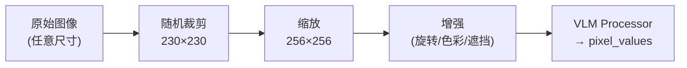

# 配置系统：Gr00tN1d7Config 全参数解读

> 逐一拆解 GR00T N1.7 的 60+ 个配置参数——每一个参数的含义、默认值选择的工程考量、修改后的影响。

## 相关阅读

- [代码地图](./04_代码地图_仓库结构与模块职责)（上一章）
- [Cosmos-Reason2-2B](./06_Cosmos_Reason2_为什么选Qwen3VL)（下一章）
- [后训练实战](./25_后训练实战_微调全流程)（微调时如何调参）

---

## 前情提要

上一章我们建立了代码的全局地图。本章进入实操核心——理解配置系统。
当你想微调 GR00T N1.7 时，所有可调的"旋钮"都在 `Gr00tN1d7Config` 中。
不理解这些参数就去调参，等于蒙着眼睛开车。

---

## 1. 配置类的继承关系

```python
class Gr00tN1d7Config(PretrainedConfig):
    """继承自 HuggingFace 的 PretrainedConfig"""
    model_type: str = "Gr00tN1d7"
```

继承 `PretrainedConfig` 意味着：
- 可以用 `config.save_pretrained("path")` 保存为 JSON
- 可以用 `AutoConfig.from_pretrained("path")` 自动加载
- 和 HuggingFace 生态完全兼容（Model Hub、AutoModel 等）

配置参数按功能分为 7 大类：骨干网络、图像处理、动作头、Flow Matching、训练控制、多具身体、数据增强。

---

## 2. 骨干网络参数

这组参数控制 VLM 骨干如何加载和使用。

| 参数 | 默认值 | 含义 |
|------|--------|------|
| `model_name` | `"nvidia/Cosmos-Reason2-2B"` | HuggingFace 模型路径或本地路径 |
| `backbone_model_type` | `"qwen"` | 骨干类型标识，用于选择 Processor |
| `model_revision` | `None` | 指定模型版本（git commit hash） |
| `backbone_embedding_dim` | `2048` | VLM 输出的隐藏维度 |
| `select_layer` | `16` | 保留 VLM 的前 N 层 |
| `tune_llm` | `False` | 是否微调 LLM 部分 |
| `tune_visual` | `False` | 是否微调视觉编码器 |
| `tune_top_llm_layers` | `0` | 只微调 LLM 顶部 N 层 |
| `reproject_vision` | `False` | 是否重新投影视觉特征 |
| `use_flash_attention` | `True` | 是否使用 Flash Attention |
| `load_bf16` | `False` | 是否以 BF16 加载权重 |
| `backbone_trainable_params_fp32` | `True` | 可训练参数是否转为 FP32 |

### 2.1 参数详解

**`select_layer = 16`**

Cosmos-Reason2-2B 的完整 LLM 部分有 ~28 层。设置 `select_layer=16` 意味着
在初始化时**物理删除**第 17-28 层：

```python
while len(self.model.language_model.layers) > select_layer:
    self.model.language_model.layers.pop(-1)
```

为什么是 16？
- 经验发现 VLM 的**中间层**（约 50-60% 位置）包含最丰富的视觉-语言对齐特征
- 顶层专注于文本生成，对机器人控制贡献有限
- 16 层约为 28 层的 57%，是一个经过实验验证的最优截断点
- 截断后节省约 43% 的 VLM 计算量

**修改建议**：
- 想要更强的语言理解 → 增大到 20-24（但推理变慢）
- 想要更快的推理 → 减小到 12（但可能牺牲理解能力）

**`tune_llm = False` + `tune_visual = False`**

默认微调时**冻结整个骨干网络**。这是因为：
1. VLM 已经在万亿 token 上预训练过——微调时数据量通常不够覆盖 VLM
2. 冻结骨干意味着只需训练动作头（约 10% 的参数），大幅降低显存需求
3. 避免"灾难性遗忘"——防止微调过程中丢失视觉理解能力

**什么时候打开 `tune_llm`？**
- 有大量高质量机器人数据（>50万条轨迹）
- 任务和预训练分布差异很大（如水下/太空场景）
- 配合小学习率（如 1e-5）+ 渐进解冻策略

**`backbone_trainable_params_fp32 = True`**

当 `load_bf16=True` 且有可训练的骨干参数时，将可训练参数转为 FP32：

```python
if load_bf16 and trainable_params_fp32:
    for n, p in self.named_parameters():
        if p.requires_grad:
            p.data = p.data.to(torch.float32)
```

原因：BF16 的精度有限（约 3-4 位有效数字），梯度累积过程中会产生数值误差。
可训练参数用 FP32 确保梯度更新的精度。

---

## 3. 图像处理参数

| 参数 | 默认值 | 含义 |
|------|--------|------|
| `image_crop_size` | `(230, 230)` | 随机裁剪大小 |
| `image_target_size` | `(256, 256)` | 最终输入模型的图像尺寸 |
| `shortest_image_edge` | `None` | 按短边缩放（Qwen3-VL 特性） |
| `crop_fraction` | `None` | 中心裁剪比例 |
| `random_rotation_angle` | `None` | 随机旋转角度（度） |
| `color_jitter_params` | `None` | 颜色抖动参数 |
| `use_albumentations_transforms` | `True` | 使用 Albumentations 增强库 |
| `extra_augmentation_config` | `None` | 额外增强（mask-based 等） |

### 3.1 图像变换流程



**`image_crop_size = (230, 230)`**

训练时从原始图像中**随机裁剪**一个 230×230 的区域，然后 resize 到 256×256。
这是一种数据增强——每次看到同一张图的略微不同区域，增加模型的鲁棒性。

为什么是 230 而不是 256？因为需要有"裁剪余量"。如果原图是 256×256，
裁 230×230 就有 `±13 像素`的随机偏移——这对抗了相机安装位置的微小误差。

**`use_albumentations_transforms = True`**

默认使用 Albumentations 库而非 torchvision 做图像增强。原因：
- Albumentations 支持 **ReplayCompose**——对同一批的多张图像应用**相同的**随机变换
- 这对多视角输入很关键：两个相机的图像应该应用相同的亮度变化，否则模型会学到虚假的跨视角差异

---

## 4. 动作头参数

这组参数控制 DiT 和编解码器的规模与行为。

| 参数 | 默认值 | 含义 |
|------|--------|------|
| `max_state_dim` | `132` | 状态向量的统一最大维度 |
| `max_action_dim` | `132` | 动作向量的统一最大维度 |
| `action_horizon` | `40` | 动作预测步长（action chunk 长度） |
| `hidden_size` | `1024` | DiT 输出维度 |
| `input_embedding_dim` | `1536` | state/action 编码后的维度 |
| `state_history_length` | `1` | 输入的历史状态帧数 |
| `add_pos_embed` | `True` | 是否给 action token 加位置编码 |
| `use_vlln` | `True` | 是否对 VL 特征做 LayerNorm |
| `max_seq_len` | `1024` | 位置编码的最大序列长度 |
| `use_alternate_vl_dit` | `True` | 使用 AlternateVLDiT 还是标准 DiT |
| `attend_text_every_n_blocks` | `2` | 每 N 个 cross-attn 块中分配一个给文本 |

### 4.1 参数详解

**`max_action_dim = 132` 和 `max_state_dim = 132`**

这是多具身体设计的核心约束。不同机器人的动作维度差异巨大：
- Franka Panda：8 维（7 关节 + 夹爪）
- Unitree G1 全身：50+ 维（双臂 + 双手 + 腰 + 导航）
- DROID 混合：~40 维（EEF 9d + gripper + joint）

统一为 132 维的做法：
1. 所有机器人的动作填充到 132 维（不足的部分补零）
2. 通过 `action_mask [B, 40, 132]` 告诉模型哪些维度是有效的
3. Loss 只在有效维度上计算：`loss = (mse * action_mask).sum() / action_mask.sum()`

为什么是 132？这是当前支持的最大维度机器人的维度上限。如果将来要支持更高维的机器人，需要增大这个值（并通过 `expand_action_dimension()` 扩展已有权重）。

**`action_horizon = 40`**

模型一次预测未来 40 步的动作。这被称为 **Action Chunking**。

为什么不是 1 步？
- 预测多步可以让模型学到时序一致性（第 20 步的动作要和第 19 步连贯）
- 执行时可以只取前 K 步，后面的用于 RTC 时的 inpainting

为什么是 40 而不是 16（π₀ 用 16）？
- GR00T 面向的控制频率更高（可能 50Hz）
- 40 步 ÷ 50Hz = 0.8 秒的规划视野——足够完成一个原子操作
- 更长的 horizon 给 RTC 留了更多 overlap 空间

**`input_embedding_dim = 1536`**

这是 DiT 的**输入**维度——state 和 action 编码后的统一维度。
它和 `backbone_embedding_dim (2048)` 不同！

为什么不直接用 2048？
- DiT 的 hidden_size 是 `num_heads × head_dim = 32 × 48 = 1536`
- state/action 编码维度和 DiT hidden 维度一致，避免额外的投影层

**`use_alternate_vl_dit = True`**

控制使用哪种 DiT 变体：
- `True`：AlternateVLDiT（交替图像/文本注意力）—— **N1.7 默认**
- `False`：标准 DiT（所有层 attend 所有 VL token）

**`attend_text_every_n_blocks = 2`**

配合 `use_alternate_vl_dit=True` 使用。默认值 2 意味着：
- 每 2 个 cross-attention 块中，1 个看文本、1 个看图像
- 32 层 DiT = 16 个 cross-attn 层 → 8 个看文本、8 个看图像

**`state_history_length = 1`**

只用当前时刻的状态（不看历史）。原因：
- 历史信息主要由**图像帧**携带（`video` 模态支持 `delta_indices=[-15, 0]`）
- 状态维度已经包含了速度信息（如果有的话）
- 增大到 2-3 可能有帮助，但会增加 state_encoder 的输入维度

---

## 5. DiT 内部参数（`diffusion_model_cfg`）

```python
diffusion_model_cfg: dict = field(default_factory=lambda: {
    "positional_embeddings": None,
    "num_layers": 32,
    "num_attention_heads": 32,
    "attention_head_dim": 48,
    "norm_type": "ada_norm",
    "dropout": 0.2,
    "final_dropout": True,
    "output_dim": 1024,
    "interleave_self_attention": True,
})
```

| 参数 | 默认值 | 含义 |
|------|--------|------|
| `num_layers` | `32` | DiT 总层数（含 self-attn + cross-attn） |
| `num_attention_heads` | `32` | 多头注意力的头数 |
| `attention_head_dim` | `48` | 每个注意力头的维度 |
| `norm_type` | `"ada_norm"` | 使用 AdaLayerNorm（时间步条件化） |
| `dropout` | `0.2` | Attention 和 FFN 中的 dropout |
| `final_dropout` | `True` | 每个 block 后是否加 dropout |
| `output_dim` | `1024` | DiT 最终输出维度（= hidden_size） |
| `interleave_self_attention` | `True` | 奇偶层交替 self-attn 和 cross-attn |
| `positional_embeddings` | `None` | DiT 内部的位置编码（None = 不加） |

### 5.1 关键设计解读

**DiT hidden 维度 = `num_attention_heads × attention_head_dim = 32 × 48 = 1536`**

注意这是 DiT 的**内部**运算维度（即 Q/K/V 的总维度），等于 `input_embedding_dim`。
而 `output_dim=1024` 是 DiT 经过最终投影后的输出维度（= `hidden_size`），
会再通过 `ActionDecoder` 映射到 `max_action_dim=132`。

**`norm_type = "ada_norm"`（Adaptive Layer Normalization）**

> AdaLayerNorm 的完整解释见 [AdaLayerNorm 条件化归一化](/前置知识/001f_前置知识_AdaLayerNorm条件化归一化)。

AdaLayerNorm 让时间步信息**调制**每一层的归一化：

```python
class AdaLayerNorm(nn.Module):
    def forward(self, x, temb):
        temb_proj = self.linear(self.silu(temb))  # [B, 2*dim]
        scale, shift = temb_proj.chunk(2, dim=1)
        x = self.norm(x) * (1 + scale[:, None]) + shift[:, None]
        return x
```

> **一句话直觉**：时间步通过 scale 和 shift 告诉每一层"我当前处于去噪的第几步"，让网络的行为随去噪进度动态调整。

这比简单地把时间步 embedding 加到输入更有效——因为 scale/shift 直接影响了特征的分布，相当于条件化了整个网络的"工作模式"。

**`interleave_self_attention = True`**

> 关于 Self-Attention 和 Cross-Attention 交替排列的设计，详见 [Cross-Attention 与交替注意力机制](/前置知识/001e_前置知识_Cross_Attention与交替注意力机制)。

开启后，32 层中的偶数层(0,2,4,...)做 cross-attention，奇数层(1,3,5,...)做 self-attention：
- Cross-attention：`hidden_states attend to encoder_hidden_states`（即动作 attend 到 VL 特征）
- Self-attention：`hidden_states attend to itself`（即 state+action token 内部交互）

这种交替设计让信息流更加充分——先从外部（VL 特征）获取信息，再在内部（state-action）消化整合。

---

## 6. Flow Matching 参数

| 参数 | 默认值 | 含义 |
|------|--------|------|
| `num_inference_timesteps` | `4` | 推理时的去噪步数 |
| `noise_beta_alpha` | `1.5` | Beta 分布的 α 参数 |
| `noise_beta_beta` | `1.0` | Beta 分布的 β 参数 |
| `noise_s` | `0.999` | 时间步缩放因子 |
| `num_timestep_buckets` | `1000` | 离散时间步桶数 |

### 6.1 参数详解

**`num_inference_timesteps = 4`**

推理时只需 4 步 Euler 积分即可从噪声到达最终动作。这比 DDPM（100-1000步）快 25-250 倍。

为什么 Flow Matching 能用这么少的步数？因为它学的是**直线** ODE——从噪声到目标的最优传输路径接近直线，不像 DDPM 那样需要沿着复杂曲线慢慢走。

推理代码中的实现：
```python
dt = 1.0 / self.num_inference_timesteps  # dt = 0.25
for t in range(self.num_inference_timesteps):  # t = 0, 1, 2, 3
    t_cont = t / float(self.num_inference_timesteps)  # 0.0, 0.25, 0.5, 0.75
    # ... 预测速度 pred_velocity ...
    actions = actions + dt * pred_velocity  # Euler 步进
```

**`noise_beta_alpha = 1.5`, `noise_beta_beta = 1.0`**

训练时，时间步 $t$ 从 Beta 分布中采样：

$$
t \sim \text{Beta}(\alpha=1.5, \beta=1.0)
$$

> **一句话直觉**：Beta(1.5, 1.0) 让训练偏向于学习"接近目标"的去噪——即 $t$ 偏向 1 附近。

**为什么这样设计？**

标准 Flow Matching 通常均匀采样 $t \sim U(0,1)$。但 GR00T 用 Beta(1.5, 1.0) 的密度分布：

```
t=0 (纯噪声端)：密度较低 → 训练时较少见到
t=0.5 (中间)：密度中等
t=1 (目标端)：密度最高 → 训练时更多学习"微调"阶段
```

注意代码中实际用的是 `(1 - sample) * noise_s`：
```python
def sample_time(self, batch_size, device, dtype):
    sample = self.beta_dist.sample([batch_size]).to(device, dtype=dtype)
    sample = (1 - sample) * self.config.noise_s
    return sample
```

所以实际的 $t$ 分布是 `1 - Beta(1.5, 1.0)`，即偏向 $t=0$（噪声端）！
这意味着模型更多地学习"从高噪声中恢复"——这合理，因为推理时从纯噪声出发，
早期步骤的预测质量对最终结果影响最大。

**`noise_s = 0.999`**

将采样的时间步乘以 0.999，避免 $t$ 精确等于 1.0。
因为 $t=1$ 时 `noisy_trajectory = actions`（无噪声），velocity 退化为 `actions - noise`，
这是一个病态目标。乘以 0.999 确保总有微小噪声。

**`num_timestep_buckets = 1000`**

连续的时间步 $t \in [0, 1)$ 被离散化为 0-999 的整数：
```python
t_discretized = (t[:, 0, 0] * self.num_timestep_buckets).long()
```

这是因为 `TimestepEncoder` 使用离散的 sinusoidal embedding，需要整数索引。
1000 个桶提供了足够的时间分辨率（每桶 0.001 的宽度）。

---

## 7. 训练控制参数

| 参数 | 默认值 | 含义 |
|------|--------|------|
| `tune_projector` | `True` | 微调 state/action 编解码器 |
| `tune_diffusion_model` | `True` | 微调 DiT |
| `tune_vlln` | `True` | 微调 VL LayerNorm |
| `state_dropout_prob` | `0.2` | 训练时随机丢弃状态信息的概率 |
| `exclude_state` | `False` | 完全排除状态输入（消融实验用） |
| `use_mean_std` | `False` | 使用 mean/std 归一化代替 min/max |
| `use_percentiles` | `True` | 使用分位数代替 min/max 做归一化 |
| `use_relative_action` | `False` | 使用相对动作表示 |

### 7.1 参数详解

**`state_dropout_prob = 0.2`**

训练时以 20% 的概率将整个状态特征置零：

```python
if self.training and self.state_dropout_prob > 0:
    do_dropout = (torch.rand(B, device=device) < self.state_dropout_prob)
    do_dropout = do_dropout[:, None, None].to(dtype=state_features.dtype)
    state_features = state_features * (1 - do_dropout)
```

**为什么需要 state dropout？**

这是一种正则化技术，让模型学会：
1. **即使没有状态输入**也能从图像中推断当前情况（增强图像理解）
2. 模型不会过度依赖状态信号——在真实部署中状态可能有噪声或延迟
3. 类似 Classifier-Free Guidance 的思想：训练时有/无条件都见过，推理时可以调节条件强度

**`use_percentiles = True`**

归一化时使用 1% 和 99% 分位数代替绝对 min/max：

```python
if self.use_percentiles:
    min_vals = np.array(stats["q01"])
    max_vals = np.array(stats["q99"])
else:
    min_vals = np.array(stats["min"])
    max_vals = np.array(stats["max"])
```

为什么？因为机器人数据中经常有**极端异常值**（如碰撞时的速度尖峰）。
用 min/max 会让 99% 的正常数据被压缩到很小的范围内。
用 q01/q99 忽略掉两端各 1% 的异常值，让正常数据获得更好的归一化分辨率。

---

## 8. 多具身体参数

| 参数 | 默认值 | 含义 |
|------|--------|------|
| `max_num_embodiments` | `32` | 最多支持的机器人种类数 |

这个参数决定了 `CategorySpecificLinear` 中权重矩阵的第一维大小：

```python
self.W = nn.Parameter(torch.randn(max_num_embodiments, input_dim, hidden_dim))
```

32 意味着一个 checkpoint 最多同时支持 32 种不同的机器人。每种机器人通过一个
0-31 的整数 ID（`embodiment_id`）索引自己的专属权重。

实际使用中，预训练模型已经占用了部分 ID（如 24=DROID, 25=G1, 26=R1 等），
微调新机器人时需要选择一个未被占用的 ID 或复用已有的。

---

## 9. FinetuneConfig：微调时的快捷配置

除了 `Gr00tN1d7Config`（模型本身的参数），微调时还有 `FinetuneConfig`
提供更面向用户的 CLI 接口。它的参数会被映射到 Config 的对应位置。

| 参数 | 默认值 | 映射目标 |
|------|--------|---------|
| `base_model_path` | (必填) | `training.start_from_checkpoint` |
| `dataset_path` | `""` | `data.datasets[0].dataset_paths` |
| `embodiment_tag` | `""` | `data.datasets[0].embodiment_tag` |
| `tune_llm` | `False` | `model.tune_llm` |
| `tune_visual` | `False` | `model.tune_visual` |
| `tune_projector` | `True` | `model.tune_projector` |
| `tune_diffusion_model` | `True` | `model.tune_diffusion_model` |
| `global_batch_size` | `64` | `training.global_batch_size` |
| `learning_rate` | `1e-4` | `training.learning_rate` |
| `max_steps` | `10000` | `training.max_steps` |
| `save_steps` | `1000` | `training.save_steps` |
| `num_gpus` | `1` | `training.num_gpus` |

### 9.1 典型微调配置方案

**方案 A：最小开销微调（默认）**
```bash
# 只训练动作头，冻结整个骨干
--tune-projector --tune-diffusion-model
# 参数量：~200M 可训练 / ~3B 总参数
```

**方案 B：部分骨干微调**
```bash
# 额外打开 LLM 顶部 4 层
--tune-projector --tune-diffusion-model --tune-llm
# 或只开顶层：在 Config 中设置 tune_top_llm_layers=4
```

**方案 C：全参数微调（大数据场景）**
```bash
--tune-projector --tune-diffusion-model --tune-llm --tune-visual
# 需要 4+ GPU、大量数据、小学习率
```

---

## 10. TrainingConfig：训练基础设施参数

微调时关键的训练参数：

| 参数 | 默认值 | 建议 |
|------|--------|------|
| `learning_rate` | `1e-4` | 只训 head 用 1e-4；带骨干用 1e-5 |
| `warmup_ratio` | `0.05` | 保持默认即可 |
| `weight_decay` | `1e-5` | 正则化，防止过拟合 |
| `max_grad_norm` | `1.0` | 梯度裁剪，稳定训练 |
| `optim` | `"adamw_torch_fused"` | Fused 版本更快 |
| `deepspeed_stage` | `2` | ZeRO-2 足够大部分场景 |
| `bf16` | `True` | 混合精度训练 |
| `tf32` | `True` | 使用 TF32 加速矩阵运算 |
| `gradient_checkpointing` | `False` | 显存不够时开启 |
| `global_batch_size` | `1024` (pretrain) / `64` (finetune) | 微调用小 batch |

### 10.1 DeepSpeed ZeRO-2 vs ZeRO-3

| | ZeRO-2 | ZeRO-3 |
|---|--------|--------|
| 分片内容 | 优化器状态 + 梯度 | 优化器状态 + 梯度 + **参数** |
| 单卡显存 | 较大（参数完整在每卡） | 较小（参数也分片） |
| 通信开销 | 较低 | 较高（前向传播需要 all-gather 参数） |
| 推荐场景 | 单卡能放下模型 | 单卡放不下模型 |

对 GR00T N1.7（~3B 参数）来说：
- **1-2 GPU**：ZeRO-2 + gradient_checkpointing 通常够用
- **4+ GPU**：ZeRO-2 直接跑
- **单张 16GB GPU**：需要 ZeRO-3

---

## 11. 参数交互：哪些参数必须一起改

有些参数之间有**隐含的耦合关系**，改一个必须检查另一个：

| 改了这个... | 必须检查... | 原因 |
|------------|-----------|------|
| `max_action_dim` | `max_state_dim`、CategorySpecificMLP 的 input_dim | 维度必须匹配 |
| `backbone_embedding_dim` | DiT 的 `cross_attention_dim` | DiT 的 cross-attn 维度必须等于骨干输出维度 |
| `num_attention_heads` × `attention_head_dim` | `input_embedding_dim` | DiT inner_dim 必须等于 state/action 编码维度 |
| `select_layer` | VLM 总层数 | 不能超过模型实际层数 |
| `action_horizon` | RTC 的 `rtc_overlap_steps` | overlap 不能超过 horizon |
| `max_num_embodiments` | EMBODIMENT_TAG_TO_PROJECTOR_INDEX 中的最大 ID | ID 不能越界 |

---

## 12. 总结：配置的设计哲学

GR00T N1.7 的配置设计遵循几个原则：

1. **合理默认值**：开箱即用，大部分情况下不需要修改
2. **微调友好**：通过 `FinetuneConfig` 暴露最常用的旋钮
3. **可扩展**：`max_num_embodiments=32` 和 `max_action_dim=132` 留了充足余量
4. **安全第一**：冻结骨干为默认，避免新手误操作导致灾难性遗忘

---

## 下一章预告

下一章我们将深入骨干网络——Cosmos-Reason2-2B 的架构细节、为什么选择 Qwen3-VL、
以及它如何将原始图像和文本转化为 `[B, seq_len, 2048]` 的统一特征表示。
