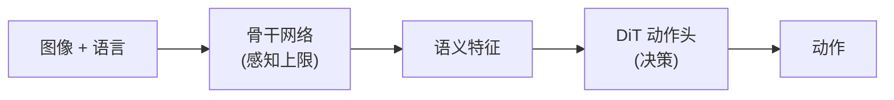
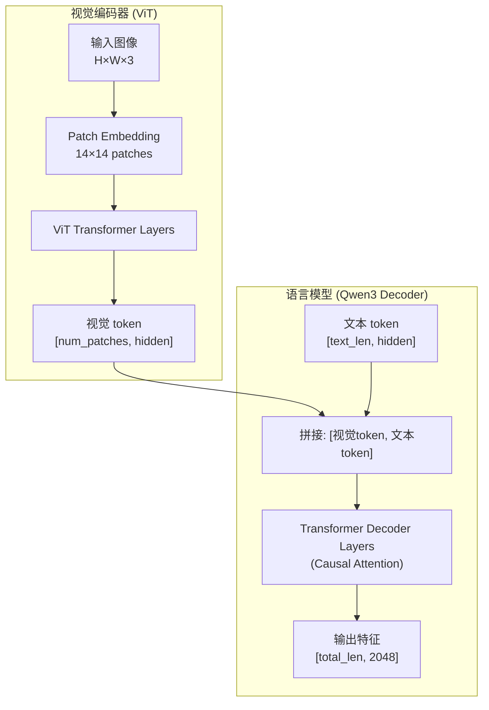
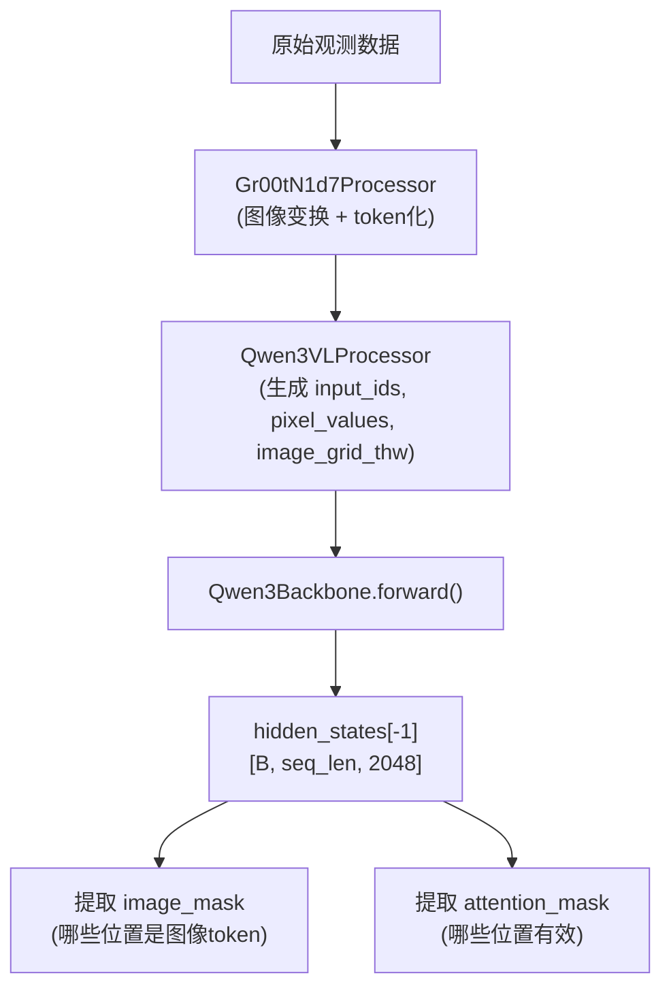

# Cosmos-Reason2-2B：为什么选 Qwen3-VL 架构

> 深入理解 GR00T N1.7 为什么用 Cosmos-Reason2 作为骨干、Qwen3-VL 架构的核心设计、以及它相比 Eagle 的技术优势。

## 相关阅读

- [配置系统全参数解读](./05_配置系统_全参数解读)（上一章）
- [Qwen3Backbone 实现详解](./07_Qwen3Backbone实现详解)（下一章）
- [Attention 注意力机制](/前置知识/000c_前置知识_Attention注意力机制)

---

## 前情提要

前五章我们建立了 GR00T N1.7 的全局认知。从本章开始，我们进入第二部分——
深入骨干网络。骨干网络是整个 VLA 的"感知大脑"，负责把原始图像和文本
转化为统一的语义特征，供后续的 DiT 动作头使用。

---

## 1. 为什么骨干网络如此重要？

在 VLA 架构中，骨干网络的质量直接决定了模型的"理解力上限"：



如果骨干网络不能正确理解"红色杯子在桌子左边"，后面的 DiT 再强也没用——
因为它得到的特征中不包含"位置"和"颜色"信息。

**选骨干的核心标准**：
1. 视觉理解能力（能识别物体、理解空间关系）
2. 语言对齐能力（能将"红色杯子"和图像中对应区域关联）
3. 计算效率（不能太慢，否则控制频率跟不上）
4. 多图支持（机器人通常有多个相机）

---

## 2. Cosmos-Reason2 是什么？

**Cosmos-Reason2-2B** 是 NVIDIA 基于 Qwen3-VL 架构训练的一个 2B 参数视觉-语言模型。

| 属性 | 值 |
|------|-----|
| 基础架构 | Qwen3-VL (Alibaba) |
| 参数量 | ~2B |
| 视觉编码器 | ViT (Vision Transformer) |
| 语言模型 | Qwen3-style Transformer Decoder |
| 图像输入 | 动态分辨率，自动切分为 patch grid |
| 最大上下文 | 支持多图多轮对话 |
| 预训练数据 | 大规模图文对+视觉推理数据 |

**为什么叫 "Cosmos-Reason2"？**

"Cosmos" 是 NVIDIA 的物理世界理解模型系列。"Reason2" 表示第二代推理增强版本。
它在标准 VLM 训练的基础上，额外注入了**物理推理**相关的数据——
比如空间关系推理、物体属性识别、动作可行性判断等。
这些能力对机器人控制至关重要。

---

## 3. Qwen3-VL 架构的核心设计

Qwen3-VL 的内部结构：



### 3.1 动态分辨率机制

这是 Qwen3-VL 相比 Eagle 最大的架构优势之一。

**Eagle (N1.5)**：所有图像必须 resize 到固定尺寸（如 448×448）后输入 ViT。
- 不同长宽比的图像会被拉伸变形
- 信息在 resize 过程中丢失

**Qwen3-VL (N1.7)**：图像按原始长宽比切分为 patch grid。

工作原理：
1. 输入图像保持原始比例
2. 按短边缩放到指定大小
3. 将图像切分为 14×14 的 patch
4. 生成 `image_grid_thw = [temporal, height_tiles, width_tiles]` 描述 grid 结构
5. ViT 对所有 patch 做编码，用 3D 位置编码（基于 grid 结构）注入空间信息

**具体例子**：

一张 320×240 的图像：
- patch_size = 14
- 320/14 ≈ 23 个 width patches
- 240/14 ≈ 17 个 height patches
- `image_grid_thw = [1, 17, 23]`
- 生成 17×23 = 391 个视觉 token

一张 640×480 的图像：
- 640/14 ≈ 46 个 width patches
- 480/14 ≈ 34 个 height patches
- `image_grid_thw = [1, 34, 46]`
- 生成 34×46 = 1564 个视觉 token

**为什么动态分辨率对机器人重要？**
- 机器人的腕部相机和外部相机分辨率不同
- 保持原始比例能保留精确的空间几何信息
- 小物体在高分辨率下才能被识别（如螺丝、按钮）

### 3.2 多图输入支持

Qwen3-VL 原生支持单次输入多张图像，每张图独立编码后拼接到 token 序列中。

对于 GR00T N1.7 的典型配置：
- 外部相机图像 → 生成 ~200 个视觉 token
- 腕部相机图像 → 生成 ~200 个视觉 token
- 语言指令 → 生成 ~20 个文本 token
- 总序列长度：~420 个 token

这些 token 在 LLM 的 decoder 中一起做 causal attention，
自然地学到了跨视角和跨模态的关联。

### 3.3 hidden_size = 2048

Cosmos-Reason2-2B 的隐藏维度是 2048。这就是为什么配置中 `backbone_embedding_dim = 2048`。

所有 token（视觉+文本）在经过 LLM 后都被表示为 2048 维的向量。
这些向量就是后续 DiT 动作头的输入（作为 `encoder_hidden_states`）。

---

## 4. 为什么从 Eagle 换到 Cosmos-Reason2？

### 4.1 Eagle 的局限性

Eagle (基于 InternVL 架构) 的问题：

| 局限 | 具体表现 |
|------|---------|
| 固定分辨率 | 必须 resize 到固定尺寸，损失空间精度 |
| 强制 Flash Attention | 没有 Flash Attention 就无法运行 |
| 强制 BF16 | 没有降精度的灵活性 |
| 自定义代码依赖 | 需要 `trust_remote_code=True`，安全隐患 |
| 多图拼接方式 | 需要手动处理多图输入 |
| MLP1 投影层 | 额外的投影层增加参数和计算 |

### 4.2 Cosmos-Reason2 (Qwen3-VL) 的优势

| 优势 | 具体表现 |
|------|---------|
| 动态分辨率 | 任意尺寸图像保持原始比例输入 |
| 原生多图 | Processor 自动处理多张图的 grid 拼接 |
| 灵活注意力 | Flash-2 / SDPA / Math 自动选择 |
| 硬件兼容 | 兼容 Spark (SM121)、Ampere、Hopper |
| transformers 原生 | 直接用 `from_pretrained`，无自定义代码 |
| 推理增强 | 额外训练了空间推理能力 |
| 无 MLP1 | 视觉和文本在架构内部对齐，无需显式投影 |

### 4.3 定量对比（推测）

| 指标 | Eagle-2B | Cosmos-Reason2-2B |
|------|----------|------------------|
| VQA 准确率 | ~75% | ~82% |
| 空间关系推理 | 一般 | 强 |
| 多图理解 | 需手动处理 | 原生支持 |
| 推理速度 (A100) | 快 (Flash-only) | 相近 (Flash/SDPA) |
| 部署灵活性 | 低（硬件限制多） | 高（支持多种后端） |

---

## 5. 在 GR00T 中如何使用骨干网络

### 5.1 整体流程



### 5.2 骨干网络的输入输出

**输入**（4 个张量）：
```python
{
    "input_ids": [B, seq_len],            # token ID 序列（视觉占位符 + 文本 token）
    "attention_mask": [B, seq_len],       # 1=有效, 0=padding
    "pixel_values": [B, C, H_total, W],   # 所有图像 patch 拼接
    "image_grid_thw": [num_images, 3],    # 每张图的 [T, H_tiles, W_tiles]
}
```

**输出**（3 个张量）：
```python
{
    "backbone_features": [B, seq_len, 2048],      # 最后一层的隐藏状态
    "backbone_attention_mask": [B, seq_len],      # bool，有效位置
    "image_mask": [B, seq_len],                   # bool，图像token位置
}
```

### 5.3 `image_mask` 的作用

`image_mask` 标记了序列中哪些位置是图像 token：

```python
image_mask = vl_input["input_ids"] == self.model.config.image_token_id
```

在 Qwen3-VL 中，图像在 `input_ids` 中用一个特殊的 `image_token_id` 占位。
通过比较每个位置是否等于这个 ID，就能得到 image_mask。

这个 mask 在后续 AlternateVLDiT 中至关重要——它被用来分离图像和文本 token，
实现交替注意力。

---

## 6. 层截断策略的深入分析

> 如果你对"层截断"的概念还不熟悉（为什么可以砍掉大模型的后面几层？砍了不会变弱吗？），请先阅读 [VLM 层截断：只用大模型的前 N 层](/前置知识/001d_前置知识_VLM层截断_只用大模型的前N层)。

### 6.1 为什么只用前 16 层？

Qwen3-VL 2B 的 LLM 部分有大约 28 层 Transformer Decoder。GR00T N1.7 默认只保留前 16 层。

```python
# Qwen3Backbone.__init__
while len(self.model.language_model.layers) > select_layer:
    self.model.language_model.layers.pop(-1)
```

VLM 的不同层学到的内容有系统性差异：

| 层范围 | 学到的内容 | 对机器人的用处 |
|--------|-----------|-------------|
| 底层 (1-8) | 低级视觉特征（边缘、纹理、颜色） | 中等——对物体识别有帮助 |
| 中层 (9-16) | 高级语义（物体识别、空间关系、动作意图） | **非常高**——这正是机器人需要的 |
| 顶层 (17-28) | 文本生成能力（语法、连贯性、推理链） | 低——机器人不需要生成文本 |

第 16 层正好处于"语义理解最丰富"的位置。再往上的层专注于把理解转化为流畅的文本输出——
这对机器人没有价值，但会消耗 ~43% 的计算量。

### 6.2 截断的计算节省

假设完整模型有 28 层，每层计算量相同：
- 完整推理：28 层 × T_per_layer = 28T
- 截断到 16 层：16T
- 节省：(28-16)/28 = **43%** 的 LLM 计算量

加上 ViT 编码（不截断）占总计算的约 30%，实际总节省约：
- 0.43 × 0.70 ≈ **30%** 的总骨干计算量

### 6.3 是否可以截断得更激进？

```
select_layer=8:  只有底层特征，语义理解弱，控制精度下降
select_layer=12: 折中方案，适合极低延迟场景
select_layer=16: 默认，语义理解充分且计算合理
select_layer=20: 更强的理解，但推理变慢 ~14%
select_layer=28: 使用完整模型，最强理解但最慢
```

---

## 7. 与 π₀ 骨干选择的对比

| 维度 | π₀ (PaliGemma) | GR00T N1.7 (Cosmos-Reason2) |
|------|---------------|----------------------------|
| 视觉编码器 | SigLIP (400M) | Qwen3-VL ViT (~300M) |
| 语言模型 | Gemma 2B | Qwen3-style 2B |
| 使用方式 | 完整模型 + action expert token | 前 16 层截断 + 独立 DiT |
| 图像分辨率 | 固定 224×224 | 动态分辨率 |
| 多图支持 | 需拼接成一张 | 原生多图 |
| 截断 | 不截断 | 截断到 16 层 |
| 计算量 | 较高（完整模型+action token） | 较低（截断+独立head） |

π₀ 把动作 token 直接混入 VLM 的 token 序列中一起处理，所以需要完整模型。
GR00T 选择"VLM 只做特征提取，动作生成完全独立"——这使得截断成为可能。

---

## 8. Cosmos-Reason2 的"推理增强"对机器人的价值

普通 VLM 在大规模图文对上训练，擅长回答"图片中有什么"这类问题。
但机器人控制需要更深层的推理：

| 推理类型 | 举例 | 普通 VLM | Cosmos-Reason2 |
|---------|------|---------|---------------|
| 空间推理 | "杯子在盘子的左边还是右边？" | 中等 | 强 |
| 动作可行性 | "从当前姿态能否直接抓到这个物体？" | 弱 | 中等 |
| 物理预测 | "推这个箱子会向哪个方向滑动？" | 弱 | 中等 |
| 遮挡推理 | "被另一个物体挡住的部分是什么形状？" | 中等 | 强 |

"Reason" 后缀意味着模型在训练时看过大量**需要推理才能回答**的视觉问题数据，
而不只是简单的描述性标注。

---

## 9. 总结

GR00T N1.7 选择 Cosmos-Reason2-2B 作为骨干网络，核心原因有三：

1. **Qwen3-VL 架构本身的技术优势**：动态分辨率、原生多图、灵活注意力后端
2. **推理增强训练**：注入了空间推理和物理理解数据，更适合机器人场景
3. **工程友好性**：transformers 原生支持、无自定义代码依赖、多硬件兼容

选择哪个 VLM 作为骨干是 VLA 模型最关键的架构决策之一。一旦确定，
整个系统的感知能力上限就固定了——后续的 DiT 和编解码器只能在这个上限内工作。

---

## 下一章预告

下一章我们将逐行走读 `Qwen3Backbone` 类的完整实现——从模型加载、层截断、
参数冻结到前向传播，理解每一行代码的具体作用。
