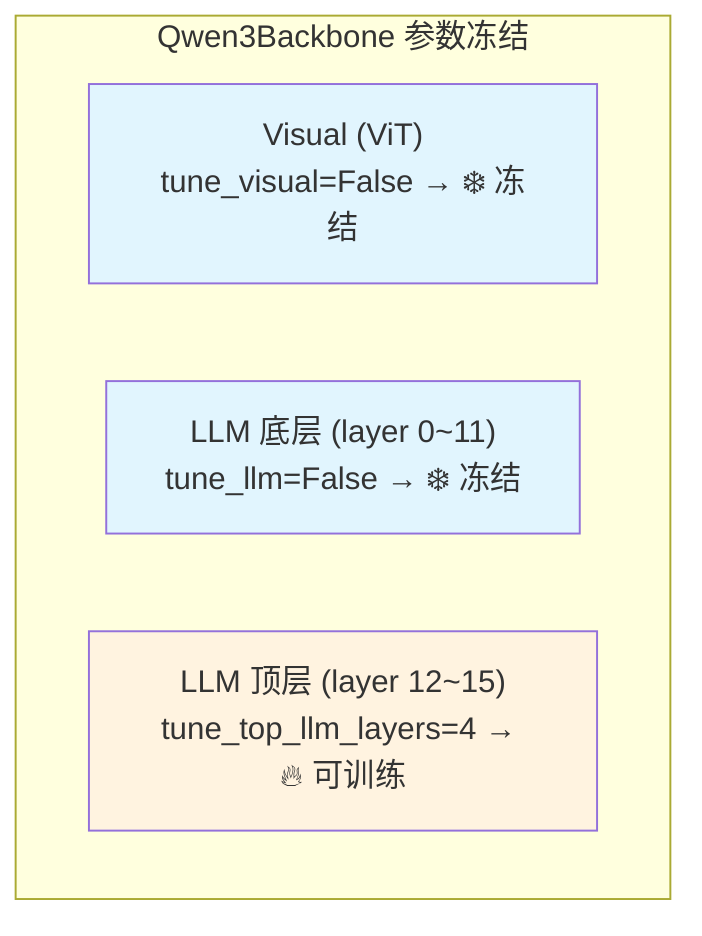

# Qwen3Backbone 实现详解：从图像到特征

> 逐行走读 `Qwen3Backbone` 类的完整实现——从模型加载到前向传播，理解每一行代码如何将原始图像和文本转化为 `[B, seq_len, 2048]` 的语义特征。

## 相关阅读

- [Cosmos-Reason2-2B](./06_Cosmos_Reason2_为什么选Qwen3VL)（上一章）
- [Eagle vs Qwen3 工程差异](./08_Eagle_vs_Qwen3_两代骨干工程差异)（下一章）
- [配置系统全参数解读](./05_配置系统_全参数解读)

---

## 前情提要

上一章我们理解了为什么选择 Cosmos-Reason2 (Qwen3-VL) 作为骨干。
本章我们将进入代码层面，完整走读 `Qwen3Backbone` 这个类的每一个方法。
文件位置：`gr00t/model/modules/qwen3_backbone.py`，总共约 100 行。

---

## 1. 类的整体结构

```python
class Qwen3Backbone(torch.nn.Module):
    def __init__(self, ...):       # 初始化：加载模型、截断、冻结
    def set_trainable_parameters(self, ...):  # 控制哪些参数可训练
    def set_frozen_modules_to_eval_mode(self):  # 冻结模块强制 eval
    def prepare_input(self, batch):   # 输入预处理
    def forward(self, vl_input):      # 前向传播
```

让我们逐一拆解。

---

## 2. `__init__`：模型加载与初始化

### 2.1 完整代码

```python
def __init__(
    self,
    model_name: str = "nvidia/Cosmos-Reason2-2B",
    tune_llm: bool = False,
    tune_visual: bool = False,
    select_layer: int = -1,
    reproject_vision: bool = True,
    use_flash_attention: bool = False,
    projector_dim: int = -1,
    load_bf16: bool = False,
    tune_top_llm_layers: int = 0,
    trainable_params_fp32: bool = False,
    transformers_loading_kwargs: dict = {},
):
```

### 2.2 逐段分析

**Step 1：版本检查**

```python
if not _QWEN3VL_AVAILABLE:
    raise ImportError(
        "Qwen3VLForConditionalGeneration is not available. "
        "Please upgrade transformers to a version that supports Qwen3-VL: "
        "pip install transformers>=4.57.0"
    )
```

Qwen3-VL 需要 transformers >= 4.57.0。如果版本太低，模块导入时 `_QWEN3VL_AVAILABLE` 
会被设为 `False`，这里直接报错并给出升级指令。

**Step 2：注意力后端选择**

```python
extra_kwargs = {}
if use_flash_attention:
    try:
        import flash_attn
        extra_kwargs["attn_implementation"] = "flash_attention_2"
    except ImportError:
        logger.warning(
            "flash_attn is not installed. Falling back to sdpa attention. "
            "Install flash-attn for better performance: pip install flash-attn"
        )
        extra_kwargs["attn_implementation"] = "sdpa"
if load_bf16:
    extra_kwargs["torch_dtype"] = torch.bfloat16
```

这段逻辑的关键设计：**优雅降级**。
- 首选 Flash Attention 2（最快，但需要额外安装 `flash-attn` 包）
- 不可用时自动回退到 SDPA（PyTorch 原生，性能略低但无额外依赖）
- `load_bf16` 控制是否以半精度加载权重（节省显存约 50%）

**Step 3：加载预训练模型**

```python
self.model = Qwen3VLForConditionalGeneration.from_pretrained(
    model_name,
    **extra_kwargs,
    **transformers_loading_kwargs,
).eval()
```

`Qwen3VLForConditionalGeneration` 是完整的 Qwen3-VL 模型（含视觉编码器+语言模型+LM head）。

注意 `.eval()` 调用——模型以**评估模式**加载。即使后续在训练中调用 `model.train()`，
冻结的部分会被 `set_frozen_modules_to_eval_mode()` 重新设为 eval。

`transformers_loading_kwargs` 可以包含：
- `trust_remote_code`：是否信任远程代码（Qwen3-VL 不需要，但保留接口）
- `local_files_only`：是否只用本地文件
- `cache_dir`：模型缓存目录
- `token`：HuggingFace Hub 访问令牌

**Step 4：层截断**

> 关于层截断的基础概念（为什么可以这样做、截断点怎么选），参见 [VLM 层截断：只用大模型的前 N 层](/前置知识/001d_前置知识_VLM层截断_只用大模型的前N层)。

```python
while len(self.model.language_model.layers) > select_layer:
    self.model.language_model.layers.pop(-1)
```

这是一个**物理删除**操作——直接从 `nn.ModuleList` 中移除最后一层，
反复执行直到只剩 `select_layer` 层。

> **一句话直觉**：把 VLM 的"文本生成部分"砍掉，只保留"理解部分"。

被删除的层不会参与任何计算，也不会占用显存。这比冻结更彻底——
冻结的参数仍在内存中，截断的参数直接不存在了。

**Step 5：参数冻结和精度转换**

```python
self.set_trainable_parameters(tune_llm, tune_visual, tune_top_llm_layers)

if load_bf16 and trainable_params_fp32:
    for n, p in self.named_parameters():
        if p.requires_grad:
            p.data = p.data.to(torch.float32)
            logger.debug(f"Casting trainable parameter {n} to fp32")
```

先设置哪些参数可训练，然后将可训练参数转为 FP32。

**为什么要这样做？** 这实现了一种"混合精度存储"策略：
- 冻结参数：保持 BF16（节省显存）
- 可训练参数：转为 FP32（梯度计算需要精度）

这样一个 2B 模型的显存占用约为：
- 冻结参数：~4GB（2B × 2 bytes/BF16）
- 可训练参数（假设只开 top 4 层 ≈ 200M）：~0.8GB（200M × 4 bytes/FP32）
- 总计：~4.8GB（远小于全 FP32 的 ~8GB）

---

## 3. `set_trainable_parameters`：精细的冻结控制

```python
def set_trainable_parameters(self, tune_llm, tune_visual, tune_top_llm_layers):
    self.tune_llm = tune_llm
    self.tune_visual = tune_visual
    
    # 默认所有参数可训练
    for p in self.parameters():
        p.requires_grad = True
    
    # 然后选择性冻结
    if not tune_llm:
        self.model.language_model.requires_grad_(False)
    if not tune_visual:
        self.model.visual.requires_grad_(False)
    
    # 特殊：即使 LLM 整体冻结，也可以打开顶部几层
    if tune_top_llm_layers > 0:
        for layer in self.model.language_model.layers[-tune_top_llm_layers:]:
            for param in layer.parameters():
                param.requires_grad = True
```

### 3.1 冻结策略可视化



### 3.2 四种典型配置

| 配置 | tune_llm | tune_visual | tune_top_llm_layers | 可训练参数量 |
|------|----------|-------------|--------------------:|-----------|
| 全冻结（默认微调） | False | False | 0 | 0 |
| 只开顶层 | False | False | 4 | ~200M |
| 开 LLM | True | False | 0 | ~1.2B |
| 全打开 | True | True | 0 | ~2B |

**最佳实践**：
- 数据 < 10K 条：全冻结（只训练 action head）
- 数据 10K-100K 条：开顶部 2-4 层
- 数据 > 100K 条：可以考虑开整个 LLM
- 开 visual：几乎不需要（除非场景和预训练差异极大）

---

## 4. `set_frozen_modules_to_eval_mode`：训练时的模式管理

```python
def set_frozen_modules_to_eval_mode(self):
    """
    Huggingface will call model.train() at each training_step. To ensure
    the expected behaviors for modules like dropout, batchnorm, etc., we
    need to call model.eval() for the frozen modules.
    """
    if self.training:
        if self.model.language_model and not self.tune_llm:
            self.model.language_model.eval()
        if self.model.visual and not self.tune_visual:
            self.model.visual.eval()
```

### 4.1 为什么需要这个方法？

这是一个容易被忽视但**极其重要**的细节。问题来自 HuggingFace Trainer 的行为：

```
每个 training_step 开始时：
  Trainer 自动调用 model.train()
  → 所有子模块（包括冻结的）都被设为 train 模式
  → 冻结模块中的 Dropout 和 BatchNorm 被激活
  → 输出变成随机的（因为 Dropout）
  → Loss 不稳定，训练失败
```

解决方案：在每次前向传播前，手动把冻结模块设回 eval 模式。

### 4.2 train 模式 vs eval 模式的差异

| 模块 | train 模式 | eval 模式 |
|------|-----------|----------|
| Dropout | 随机丢弃 neurons | 不丢弃（全部通过） |
| BatchNorm | 用 batch 统计量 | 用 running 统计量 |
| LayerNorm | 无差异 | 无差异 |

对于冻结的 VLM 骨干，我们希望它的行为**完全确定性**——
同样的输入总是产生同样的输出。所以必须保持 eval 模式。

---

## 5. `forward`：前向传播完整走读

```python
def forward(self, vl_input: BatchFeature) -> BatchFeature:
    self.set_frozen_modules_to_eval_mode()
    
    # 只取需要的键，避免多余数据传入模型
    keys_to_use = ["input_ids", "attention_mask", "pixel_values", "image_grid_thw"]
    vl_input = {k: vl_input[k] for k in keys_to_use}
    
    # 调用 Qwen3-VL 的前向传播
    outputs = self.model(**vl_input, output_hidden_states=True)
    
    # 取最后一层的 hidden states
    outputs = outputs.hidden_states[-1]
    
    # 构建 image_mask：标记哪些位置是图像 token
    image_mask = vl_input["input_ids"] == self.model.config.image_token_id
    
    # 构建 attention_mask：标记哪些位置是有效的（非 padding）
    attention_mask = vl_input["attention_mask"] == 1
    
    return BatchFeature(data={
        "backbone_features": outputs,            # [B, seq_len, 2048]
        "backbone_attention_mask": attention_mask,  # [B, seq_len]
        "image_mask": image_mask,                # [B, seq_len]
    })
```

### 5.1 逐行解析

**Line 1：`self.set_frozen_modules_to_eval_mode()`**

每次前向传播前都调用——确保冻结模块始终处于 eval 模式。
虽然有一定的函数调用开销，但相比前向传播的计算量完全可以忽略。

**Line 2-3：输入过滤**

```python
keys_to_use = ["input_ids", "attention_mask", "pixel_values", "image_grid_thw"]
vl_input = {k: vl_input[k] for k in keys_to_use}
```

输入的 `BatchFeature` 可能包含很多其他键（如 `state`, `action`, `embodiment_id` 等），
但 Qwen3-VL 只需要这 4 个键。过滤掉其他键可以避免 `TypeError: unexpected keyword argument`。

**Line 4：调用 Qwen3-VL**

```python
outputs = self.model(**vl_input, output_hidden_states=True)
```

`output_hidden_states=True` 告诉模型返回**所有层**的 hidden states，
而不仅仅是最终输出。这样我们可以取任意一层的特征。

返回的 `outputs` 结构：
```python
outputs.hidden_states  # tuple of (num_layers + 1) tensors
# outputs.hidden_states[0]  = embedding 层输出 [B, seq_len, 2048]
# outputs.hidden_states[1]  = 第 1 层输出
# ...
# outputs.hidden_states[16] = 第 16 层输出（我们截断后的最后一层）
```

**Line 5：取最后一层**

```python
outputs = outputs.hidden_states[-1]  # [B, seq_len, 2048]
```

由于我们已经物理截断了层（只保留前 16 层），`hidden_states[-1]` 就是第 16 层的输出。

**Line 6-7：构建 mask**

```python
image_mask = vl_input["input_ids"] == self.model.config.image_token_id
attention_mask = vl_input["attention_mask"] == 1
```

- `image_mask`：True 表示该位置是图像 token。用于 AlternateVLDiT 的交替注意力。
- `attention_mask`：True 表示该位置有效（非 padding）。用于屏蔽 padding 位置。

### 5.2 输出张量的具体形状

假设输入 2 张 256×256 的图像 + 一句 20 token 的指令，batch_size=4：

```
pixel_values: [4, 3, 256, 256] × 2张 → 经 ViT 后约 [4, ~660, 2048] 视觉token
input_ids: [4, ~680]（660 视觉占位 + 20 文本）
backbone_features: [4, 680, 2048]
image_mask: [4, 680]（前 660 个位置为 True）
attention_mask: [4, 680]（padding 位置为 False）
```

---

## 6. 完整数据流示例

让我们追踪一个具体的 batch 从进入骨干到出来的完整过程：

```
输入：
  图像1 (外部相机): 320×240 RGB
  图像2 (腕部相机): 160×120 RGB
  指令: "pick up the red cube"

Step 1: Qwen3VLProcessor 预处理
  图像1 → patch grid [1, 17, 23] → 391 个 patch
  图像2 → patch grid [1, 9, 12] → 108 个 patch
  指令 → tokenize → 8 个文本 token
  拼接 input_ids: [special_tokens] + [image1_placeholder×391] + [image2_placeholder×108] + [text_tokens×8]
  总 seq_len ≈ 391 + 108 + 8 + 特殊token ≈ 515

Step 2: Qwen3Backbone.forward()
  ViT 编码图像 patches → 视觉 embedding
  Embedding 层拼接视觉+文本 → [1, 515, 2048]
  经过 16 层 Transformer Decoder → [1, 515, 2048]
  
Step 3: 输出
  backbone_features: [1, 515, 2048]
  image_mask: [1, 515] (前 499 个位置为 True, 后 16 个为 False)
  attention_mask: [1, 515] (全 True, 无 padding)
```

---

## 7. 性能特征与工程考量

### 7.1 显存占用

| 组件 | BF16 (bytes) | FP32 (bytes) |
|------|-----------|-----------|
| ViT 参数 (~300M) | ~600MB | ~1.2GB |
| LLM 16层参数 (~1.2B) | ~2.4GB | ~4.8GB |
| 激活值 (bs=4, seq=515) | ~1GB | ~2GB |
| 总计 | ~4GB | ~8GB |

### 7.2 计算延迟（A100 参考）

| 步骤 | 时间（ms） |
|------|----------|
| ViT 编码 | ~5-10ms |
| LLM 16层前向 | ~10-20ms |
| 总骨干延迟 | ~15-30ms |

对比 DiT 的 4 步去噪（每步 ~5ms），骨干网络通常是推理的瓶颈。
这也是为什么在 RTC 模式中，骨干的输出可以被**缓存**——
如果图像没变，不需要重新跑骨干。

### 7.3 梯度检查点

骨干网络支持 `gradient_checkpointing`——用计算换显存。
开启后，中间层的激活值不保存，反向传播时重新计算。
显存减少约 50%，计算增加约 30%。

```python
# 在 TrainingConfig 中开启：
gradient_checkpointing: bool = True
```

---

## 8. 总结

`Qwen3Backbone` 是一个精心设计的 VLM 封装层，核心设计决策：

1. **加载即截断**：物理删除不需要的层，节省显存和计算
2. **优雅降级**：Flash → SDPA → Math，适配不同硬件
3. **混合精度存储**：冻结参数 BF16 + 可训练参数 FP32
4. **模式管理**：每次前向传播前确保冻结模块在 eval 模式
5. **最小接口**：只暴露 3 个输出张量，屏蔽了 Qwen3-VL 的复杂内部结构

从外部看，它就是一个黑盒：输入图像+文本，输出 `[B, seq_len, 2048]` 的语义特征。
整个 GR00T 系统的其他部分不需要知道内部是 Qwen3-VL、Eagle 还是别的什么——
只要输出 shape 和语义一致就行。这种**封装性**使得未来替换骨干网络变得简单。

---

## 下一章预告

下一章我们将并排对比 `EagleBackbone` 和 `Qwen3Backbone` 的每一行差异——
从输入格式、token 结构到 attention mask 的处理。这将帮你理解从 N1.5 升级到 N1.7 时
需要做的所有适配工作。
