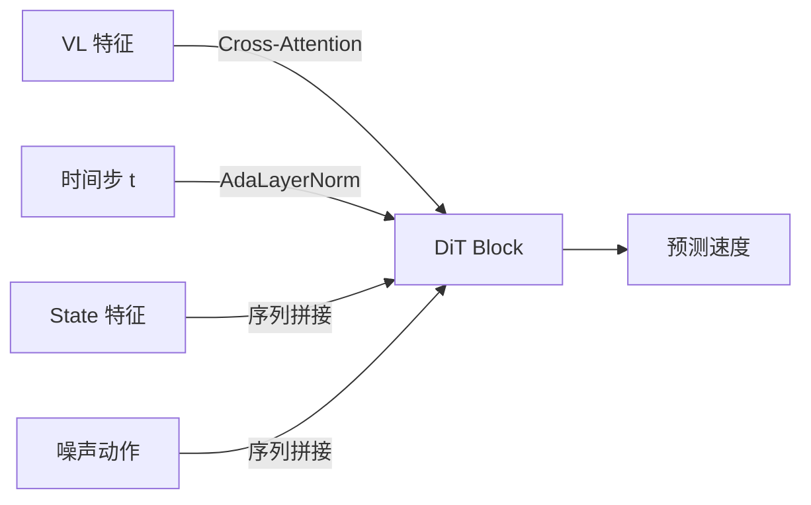

# Flow Matching 数学基础：从 ODE 到速度场

> 理解 GR00T N1.7 动作生成的数学原理——连续归一化流、直线插值、速度场回归。不需要测度论，只需要微积分基础。

## 相关阅读

- [Eagle vs Qwen3](./08_Eagle_vs_Qwen3_两代骨干工程差异)（上一章）
- [噪声调度](./10_噪声调度_Beta分布与时间步离散化)（下一章）
- [Flow Matching 与连续归一化流](/前置知识/000g_前置知识_Flow_Matching与连续归一化流)
- [常微分方程 ODE 直觉与数值求解](/前置知识/001b_前置知识_常微分方程ODE直觉与数值求解)
- [AdaLayerNorm 条件化归一化](/前置知识/001f_前置知识_AdaLayerNorm条件化归一化)

---

## 前情提要

前三章我们完整拆解了骨干网络。从本章开始进入"动作生成核心"——
理解 GR00T N1.7 如何从随机噪声生成精确的机器人动作轨迹。
动作生成的数学基础是 **Flow Matching**，本章将从零开始讲透这个方法。

---

## 1. 问题定义：我们要解决什么数学问题？

GR00T 的动作头需要做的事情：

> 给定条件 $c$（VL特征 + 机器人状态），从噪声 $\epsilon \sim \mathcal{N}(0, I)$ 生成目标动作轨迹 $a \in \mathbb{R}^{H \times d}$。

其中：
- $H = 40$（action_horizon，预测 40 步）
- $d = 132$（max_action_dim，统一动作维度）
- $c$：条件信息（骨干输出的 VL 特征）

这本质上是一个**条件生成问题**：学习条件分布 $p(a | c)$。

### 1.1 为什么不直接回归？

最简单的做法是直接预测 $\hat{a} = f_\theta(c)$，用 MSE loss 训练。

**问题**：机器人动作分布通常是**多模态**的。

举例：指令"把杯子放到盘子上"，可以从左边绕过去放，也可以从右边绕过去放。
两种轨迹都是正确的，但它们在动作空间中相距很远。

如果用 MSE 回归，模型会输出两种轨迹的**平均**——
从中间直线过去，但这可能会撞到障碍物！

$$
\hat{a}_{\text{MSE}} = \frac{1}{2}(a_{\text{left}} + a_{\text{right}}) \neq a_{\text{correct}}
$$

扩散模型（包括 Flow Matching）通过**逐步去噪**来生成样本，
能够自然地处理多模态分布——每次采样时随机选择一个模态。

---

## 2. Flow Matching 的核心思想

### 2.1 直觉

想象两堆沙子：
- **噪声沙堆** $p_0 = \mathcal{N}(0, I)$：形状随机的一堆沙
- **目标沙堆** $p_1 = p_{\text{data}}$：我们想要的形状（正确的动作分布）

Flow Matching 要做的是：找一种**最优的搬运方式**，把噪声沙堆重新排列成目标沙堆。

数学上，这个"搬运方式"用一个**速度场** $v(x, t)$ 来描述——
在时刻 $t$、位置 $x$ 处，沙粒应该以什么速度移动。

### 2.2 数学表述

定义一个随时间变化的概率路径 $p_t$，满足：
- $t = 0$：$p_0 = \mathcal{N}(0, I)$（起点是噪声）
- $t = 1$：$p_1 = p_{\text{data}}$（终点是数据）

这个路径由一个 ODE（常微分方程）定义：

$$
\frac{dx}{dt} = v_\theta(x, t, c)
$$

> **一句话直觉**：每一个时刻，粒子按照速度场 $v$ 的指示移动。从 $t=0$ 出发，到 $t=1$ 时恰好到达目标分布。

**逐项拆解**：
- $x$：当前"粒子"的位置（在动作空间中的一个点）
- $t \in [0, 1]$：时间，0 是纯噪声，1 是最终动作
- $v_\theta(x, t, c)$：神经网络预测的速度场（GR00T 中就是 DiT）
- $c$：条件信息（VL 特征 + 状态特征）

### 2.3 Flow Matching 的直线路径

Flow Matching（特指 Conditional Flow Matching / Rectified Flow）使用**最简单的路径**——
从噪声到目标的**直线插值**：

$$
x_t = (1 - t) \cdot \epsilon + t \cdot a
$$

> **一句话直觉**：在时刻 $t$，粒子处于噪声 $\epsilon$ 和目标动作 $a$ 之间的直线上，距离起点 $t$ 的比例处。

**逐项拆解**：
- $x_t$：时刻 $t$ 的中间状态
- $\epsilon \sim \mathcal{N}(0, I)$：随机噪声（起点）
- $a$：真实动作（终点，来自训练数据）
- $(1-t)$：噪声的权重，$t=0$ 时为 1（纯噪声），$t=1$ 时为 0
- $t$：数据的权重，$t=0$ 时为 0，$t=1$ 时为 1（纯数据）

**具体数值例子**：

假设 $\epsilon = [0.5, -0.3]$，$a = [1.0, 2.0]$：
- $t = 0$：$x_0 = 1.0 \times [0.5, -0.3] + 0 \times [1.0, 2.0] = [0.5, -0.3]$（纯噪声）
- $t = 0.25$：$x_{0.25} = 0.75 \times [0.5, -0.3] + 0.25 \times [1.0, 2.0] = [0.625, 0.275]$
- $t = 0.5$：$x_{0.5} = 0.5 \times [0.5, -0.3] + 0.5 \times [1.0, 2.0] = [0.75, 0.85]$
- $t = 1.0$：$x_1 = 0 \times [0.5, -0.3] + 1.0 \times [1.0, 2.0] = [1.0, 2.0]$（纯数据）

粒子沿着从 $[0.5, -0.3]$ 到 $[1.0, 2.0]$ 的直线匀速移动。

### 2.4 对应的速度场（训练目标）

沿着直线路径，速度是恒定的：

$$
v^*(x_t, t) = a - \epsilon
$$

> **一句话直觉**：速度就是"终点减起点"——沿着从噪声到目标的方向匀速前进。

**这就是 GR00T 训练时的 target！** 代码中对应：

```python
velocity = actions - noise  # 训练目标：真实动作减去噪声
```

**为什么是这个形式？**

对 $x_t = (1-t)\epsilon + ta$ 关于 $t$ 求导：
$$
\frac{dx_t}{dt} = -\epsilon + a = a - \epsilon
$$

导数恰好是常数 $a - \epsilon$，不依赖 $t$！这就是直线路径的美妙之处——
速度场是常数，模型只需要学一个与时间无关的映射。

---

## 3. 训练过程：在 GR00T 中的实现

### 3.1 训练目标的推导

Flow Matching 的训练目标是让网络预测的速度场接近真实速度场：

$$
\mathcal{L} = \mathbb{E}_{t, \epsilon, a} \left[ \| v_\theta(x_t, t, c) - (a - \epsilon) \|^2 \right]
$$

> **一句话直觉**：让网络预测的"移动方向"和真实的"噪声到目标方向"尽可能接近。

**逐项拆解**：
- $\mathbb{E}_{t, \epsilon, a}$：对时间步 $t$、噪声 $\epsilon$、数据 $a$ 求期望。实际训练中通过 mini-batch 近似。
- $v_\theta(x_t, t, c)$：DiT 网络的输出（预测速度）
- $(a - \epsilon)$：真实速度（训练目标）
- $\| \cdot \|^2$：MSE loss

### 3.2 对应的代码实现

```python
# 在 Gr00tN1d7ActionHead.forward() 中：

# 1. 采样噪声
noise = torch.randn(actions.shape, device=actions.device, dtype=actions.dtype)

# 2. 采样时间步 (从 Beta 分布)
t = self.sample_time(actions.shape[0], device=actions.device, dtype=actions.dtype)
t = t[:, None, None]  # [B, 1, 1] for broadcast

# 3. 构造带噪声的轨迹 (直线插值)
noisy_trajectory = (1 - t) * noise + t * actions

# 4. 计算真实速度 (训练目标)
velocity = actions - noise

# 5. 网络预测速度
pred = self.action_decoder(model_output, embodiment_id)
pred_actions = pred[:, -actions.shape[1]:]

# 6. MSE Loss (带 mask)
action_loss = F.mse_loss(pred_actions, velocity, reduction="none") * action_mask
loss = action_loss.sum() / (action_mask.sum() + 1e-6)
```

### 3.3 代码与公式的对应关系

| 代码 | 对应的数学 | 形状 |
|------|-----------|------|
| `noise` | $\epsilon \sim \mathcal{N}(0, I)$ | [B, 40, 132] |
| `t` | $t \sim \text{Beta}(1.5, 1.0)$ | [B, 1, 1] |
| `noisy_trajectory` | $x_t = (1-t)\epsilon + ta$ | [B, 40, 132] |
| `velocity` | $v^* = a - \epsilon$ | [B, 40, 132] |
| `pred_actions` | $v_\theta(x_t, t, c)$ | [B, 40, 132] |
| `action_loss` | $\|v_\theta - v^*\|^2$ | [B, 40, 132] |

---

## 4. 推理过程：Euler 积分

训练时我们教网络"在任意中间状态 $x_t$ 预测正确的速度"。
推理时，我们从纯噪声出发，按照网络预测的速度一步步走到终点。

### 4.1 Euler 方法

> 关于 ODE 和 Euler 方法的完整讲解，参见 [常微分方程 ODE 直觉与数值求解](/前置知识/001b_前置知识_常微分方程ODE直觉与数值求解)。

ODE $\frac{dx}{dt} = v_\theta(x, t, c)$ 的数值解法：

$$
x_{t+\Delta t} = x_t + \Delta t \cdot v_\theta(x_t, t, c)
$$

> **一句话直觉**：每一步，沿着当前预测的速度方向走一小段。走 N 步就到终点。

**逐项拆解**：
- $x_t$：当前位置（当前的"部分去噪"动作）
- $\Delta t = 1/N$：步长，N 是总步数
- $v_\theta(x_t, t, c)$：网络在当前位置和时间预测的速度
- $x_{t+\Delta t}$：走一步后的新位置

### 4.2 GR00T 推理代码

```python
# 在 get_action_with_features() 中：

# 初始化为纯噪声
actions = torch.randn(size=(batch_size, action_horizon, action_dim))

# 步长
dt = 1.0 / self.num_inference_timesteps  # dt = 1/4 = 0.25

# Euler 积分循环
for t in range(self.num_inference_timesteps):  # t = 0, 1, 2, 3
    t_cont = t / float(self.num_inference_timesteps)  # 0.0, 0.25, 0.5, 0.75
    t_discretized = int(t_cont * self.num_timestep_buckets)  # 0, 250, 500, 750
    
    # 编码当前噪声动作
    action_features = self.action_encoder(actions, timesteps_tensor, embodiment_id)
    
    # DiT 前向传播
    model_output = self.model(hidden_states=sa_embs, encoder_hidden_states=vl_embeds, ...)
    
    # 解码得到预测速度
    pred = self.action_decoder(model_output, embodiment_id)
    pred_velocity = pred[:, -self.action_horizon:]
    
    # Euler 步进！
    actions = actions + dt * pred_velocity
```

### 4.3 具体数值例子

假设 1 维动作，目标 $a = 2.0$，初始噪声 $x_0 = -1.0$：

| 步骤 | $t$ | $x_t$ | 预测速度 $v_\theta$ | 更新 |
|------|-----|--------|---------|------|
| 0 | 0.0 | -1.0 | ~3.0 (理想值=a-ε=3.0) | $-1.0 + 0.25 \times 3.0 = -0.25$ |
| 1 | 0.25 | -0.25 | ~3.0 | $-0.25 + 0.25 \times 3.0 = 0.5$ |
| 2 | 0.5 | 0.5 | ~3.0 | $0.5 + 0.25 \times 3.0 = 1.25$ |
| 3 | 0.75 | 1.25 | ~3.0 | $1.25 + 0.25 \times 3.0 = 2.0$ ✓ |

4 步就精确到达目标！因为直线路径的速度是常数 $v = a - \epsilon = 2.0 - (-1.0) = 3.0$。

### 4.4 为什么 4 步就够？

对于理想的直线 Flow Matching：
- 真实速度是常数 $v^* = a - \epsilon$
- Euler 方法对常速度 ODE **精确求解**（无误差）
- 理论上 **1 步**就够

实际中速度不是严格常数（因为网络预测有误差），但仍然接近常数。
4 步是精度和速度的最佳平衡点——误差累积在 4 步内还不显著。

---

## 5. Flow Matching vs DDPM：本质区别

| 维度 | DDPM | Flow Matching |
|------|------|--------------|
| 路径类型 | 马尔可夫链（加噪→去噪） | 连续 ODE（直线流） |
| 噪声添加 | 逐步加高斯噪声（前向SDE） | 直线插值 $(1-t)\epsilon + ta$ |
| 训练目标 | 预测加入的噪声 $\epsilon$ | 预测速度 $v = a - \epsilon$ |
| 推理步数 | 100-1000步 | 1-10步 |
| 数学工具 | 随机微分方程 (SDE) | 常微分方程 (ODE) |
| 采样质量 | 步数少时退化严重 | 少步数仍保持质量 |

**为什么 Flow Matching 需要更少的步数？**

DDPM 的去噪路径是弯曲的——每一步只去除"一点点"噪声，
需要很多步才能从纯噪声走到干净数据。

Flow Matching 的路径是（接近）直线的——从噪声直达目标，
中间几乎不需要拐弯。越直的路，越少的步数就能走完。

---

## 6. 条件化：如何让生成过程依赖条件

在 GR00T 中，条件 $c$ 包括：
- VL 特征（图像 + 语言理解的结果）
- 机器人状态
- 时间步 $t$
- Embodiment ID

条件信息通过**三种方式**注入 DiT：

1. **Cross-Attention**：VL 特征作为 `encoder_hidden_states`，DiT 的 hidden_states attend 到它
2. **AdaLayerNorm**：时间步 $t$ 通过 adaptive normalization 的 scale/shift 注入
3. **拼接**：state_features 直接拼接在 action_features 前面作为 hidden_states 的一部分



---

## 7. 总结：GR00T 中 Flow Matching 的完整公式体系

**训练阶段**：

$$
\begin{aligned}
\epsilon &\sim \mathcal{N}(0, I) & \text{(采样噪声)} \\
t &\sim \text{Beta}(1.5, 1.0) \cdot 0.999 & \text{(采样时间步)} \\
x_t &= (1-t) \cdot \epsilon + t \cdot a & \text{(构造带噪声动作)} \\
v^* &= a - \epsilon & \text{(计算目标速度)} \\
\mathcal{L} &= \frac{\sum \|v_\theta(x_t, t, c) - v^*\|^2 \cdot m}{\sum m} & \text{(加 mask 的 MSE loss)}
\end{aligned}
$$

**推理阶段**：

$$
\begin{aligned}
x_0 &\sim \mathcal{N}(0, I) & \text{(从噪声出发)} \\
\Delta t &= 1/N & \text{(步长, N=4)} \\
x_{t+\Delta t} &= x_t + \Delta t \cdot v_\theta(x_t, t, c) & \text{(Euler 步进)} \\
a &= x_1 & \text{(最终动作)}
\end{aligned}
$$

---

## 下一章预告

下一章我们将深入 GR00T 的噪声调度策略——为什么用 Beta(1.5, 1.0) 分布而非
均匀分布？`num_timestep_buckets=1000` 的离散化如何工作？`noise_s=0.999` 
这个微小的偏移为什么重要？
