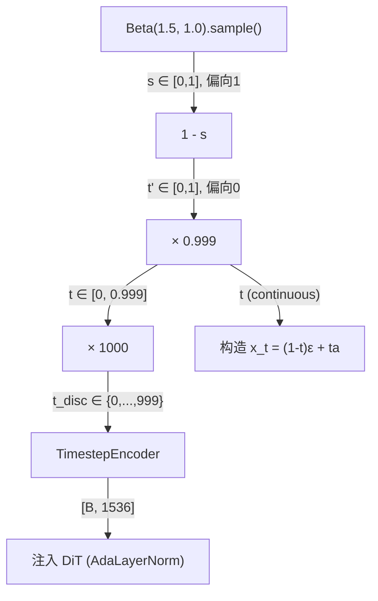

# 噪声调度：Beta 分布采样与时间步离散化

> 理解 GR00T N1.7 训练时如何选择时间步——为什么用 Beta(1.5, 1.0) 而非均匀采样？离散化如何工作？这些设计选择对训练效果的影响。

## 相关阅读

- [Flow Matching 数学基础](./09_Flow_Matching数学基础)（上一章）
- [DiT 架构逐层拆解](./11_DiT架构逐层拆解)（下一章）
- [配置系统全参数解读](./05_配置系统_全参数解读)

---

## 前情提要

上一章我们掌握了 Flow Matching 的数学原理：训练时构造 $x_t = (1-t)\epsilon + ta$，
让网络预测速度 $v = a - \epsilon$。但有一个关键问题没展开——
时间步 $t$ 怎么采样？这直接影响模型在不同噪声水平上的学习效果。

---

## 1. 为什么时间步采样策略很重要？

训练时我们需要对 $t \in [0, 1]$ 采样来构造训练样本。
不同的 $t$ 对应不同难度的去噪任务：

| 时间步范围 | 含义 | 任务难度 |
|-----------|------|---------|
| $t \approx 0$ | 接近纯噪声，几乎无数据信号 | 极难（盲猜方向） |
| $t \approx 0.5$ | 噪声和数据各半 | 中等 |
| $t \approx 1$ | 接近纯数据，只有微量噪声 | 容易（微调） |

如果均匀采样 $t \sim U(0,1)$，模型在每个难度上花**相同的时间**学习。
但实际推理中并非所有时间步同等重要——不同应用场景可能需要
在某些时间步上更精确。

---

## 2. GR00T 的时间步采样：`sample_time` 方法

### 2.1 完整代码

```python
def sample_time(self, batch_size, device, dtype):
    sample = self.beta_dist.sample([batch_size]).to(device, dtype=dtype)
    sample = (1 - sample) * self.config.noise_s
    return sample
```

其中 `self.beta_dist = Beta(1.5, 1.0)`，`noise_s = 0.999`。

### 2.2 逐步拆解

**Step 1：从 Beta(1.5, 1.0) 采样**

$$
s \sim \text{Beta}(\alpha=1.5, \beta=1.0)
$$

Beta 分布在 $[0, 1]$ 上有界。$\text{Beta}(1.5, 1.0)$ 的概率密度：

$$
f(s) = \frac{s^{\alpha-1}(1-s)^{\beta-1}}{B(\alpha, \beta)} = \frac{s^{0.5} \cdot 1}{B(1.5, 1.0)} = 1.5 \cdot \sqrt{s}
$$

> **一句话直觉**：Beta(1.5, 1.0) 的密度偏向 $s=1$——大概率采到 0.5~1.0 之间的值。

**具体数值**：
- $P(s < 0.25) \approx 0.13$（13% 概率采到小值）
- $P(s > 0.75) \approx 0.35$（35% 概率采到大值）
- 均值 = $\alpha/(\alpha+\beta) = 1.5/2.5 = 0.6$

**Step 2：取反 `(1 - sample)`**

$$
t' = 1 - s
$$

由于 $s$ 偏向 1，$(1-s)$ 偏向 0。所以 $t'$ 偏向小值。

**Step 3：乘以 `noise_s = 0.999`**

$$
t = t' \times 0.999 = (1 - s) \times 0.999
$$

最终得到的 $t$ 分布特征：
- 范围：$[0, 0.999]$（永远不会精确为 1）
- 偏向于**小值**（即接近 $t=0$ 的纯噪声端）

### 2.3 最终时间步分布

综合以上变换，最终 $t$ 的分布：

```
密度
 ▲
 │ ███
 │ ████
 │ █████
 │ ███████
 │ █████████
 │ ████████████
 │ █████████████████
 └──────────────────────→ t
 0    0.2   0.4   0.6  0.999
```

$t$ 更多地集中在 0 附近（高噪声），在 1 附近密度低。

---

## 3. 为什么偏向高噪声区间训练？

### 3.1 推理时的时间步序列

推理时 4 步 Euler 积分使用的时间步：
```python
t_values = [0/4, 1/4, 2/4, 3/4] = [0.0, 0.25, 0.5, 0.75]
```

注意：推理主要在 $t \in [0, 0.75]$ 的区间内操作（不会用到 $t$ 接近 1 的区间）。

### 3.2 训练分布与推理需求的匹配

Beta(1.5, 1.0) 经过 $(1-s) \times 0.999$ 变换后，
训练样本主要集中在 $t \in [0, 0.5]$ 区间——恰好覆盖了推理的前几步。

**为什么前几步最重要？**
- 第一步（$t=0$）：模型从纯噪声中猜测大致方向。如果第一步错了，后面全错。
- 后续步骤（$t=0.25, 0.5$）：在已有大致方向的基础上微调。容错率更高。

所以训练时在 $t$ 小的区间投入更多学习资源是合理的——
确保模型在推理最关键的第一步有最高的准确率。

### 3.3 与 π₀ 的对比

| | π₀ | GR00T N1.7 |
|---|-----|-----------|
| 时间步分布 | $t \sim U(0, 1)$ (均匀) | $(1 - \text{Beta}(1.5, 1.0)) \times 0.999$ |
| 重点区间 | 所有时间步等权 | 高噪声端（$t$ 小） |
| 推理步数 | ~10步 | 4步 |

GR00T 用更少的推理步数（4 vs 10），所以需要在训练时更密集地覆盖
那些推理会经过的时间步。这是一个"训练时的投资"换"推理时的效率"的设计。

---

## 4. 时间步离散化：`num_timestep_buckets`

### 4.1 为什么需要离散化？

Flow Matching 的时间 $t$ 是连续的 $[0, 1)$，但 DiT 内部的 `TimestepEncoder`
使用**离散**的 sinusoidal embedding。需要将连续时间映射到离散索引。

### 4.2 离散化代码

```python
# 训练时
t_discretized = (t[:, 0, 0] * self.num_timestep_buckets).long()
# 例如 t=0.35, num_buckets=1000 → t_discretized = 350

# 推理时
t_cont = t / float(self.num_inference_timesteps)  # 0.0, 0.25, 0.5, 0.75
t_discretized = int(t_cont * self.num_timestep_buckets)  # 0, 250, 500, 750
```

### 4.3 为什么是 1000 个桶？

`num_timestep_buckets = 1000` 将 $[0, 1)$ 均匀分成 1000 份，每份宽度 0.001。

**精度分析**：
- 推理时 4 步，使用的离散时间步为 0, 250, 500, 750
- 训练时连续采样的 $t$ 被四舍五入到最近的桶
- 最大量化误差：0.001/2 = 0.0005（完全可忽略）

**为什么不用更少的桶（如 100）？**
- 虽然推理只用 4 个时间步，但训练时使用连续的分布
- 更多桶让 TimestepEncoder 的 sinusoidal embedding 有更高分辨率
- 模型可以更精细地区分"t=0.35 vs t=0.36"的去噪难度

**为什么不用更多的桶（如 10000）？**
- embedding 表的大小与桶数无关（sinusoidal embedding 是计算得到的，不是查表）
- 超过 1000 后精度提升微乎其微
- 1000 是一个历史约定（DDPM 原论文用的 1000 步）

---

## 5. `noise_s = 0.999`：避免退化的边界

### 5.1 为什么不能让 $t = 1$？

当 $t = 1$ 时：
$$
x_t = (1-1) \cdot \epsilon + 1 \cdot a = a
$$

带噪声的轨迹就是数据本身——完全没有噪声！此时：
- $v^* = a - \epsilon$：速度仍然有意义
- 但网络输入 $x_t = a$ 就是答案本身——这不是一个有意义的训练样本

更严重的是，如果多个训练样本的 $t$ 精确等于 1，
网络会过度拟合"当输入和输出完全一致"的特殊情况。

### 5.2 `noise_s = 0.999` 的效果

```python
sample = (1 - sample) * 0.999  # 最大值为 0.999，不会达到 1.0
```

确保 $t_{\max} = 0.999$，此时：
$$
x_{0.999} = 0.001 \cdot \epsilon + 0.999 \cdot a \approx a + 0.001 \cdot \epsilon
$$

还有微小的噪声（标准差 ≈ 0.001），保持训练有意义。

### 5.3 推理时的影响

推理从 $t=0$ 走到 $t = (N-1)/N = 0.75$（4步时），不会到达 $t=1$。
所以 `noise_s` 只影响训练，不影响推理。

---

## 6. TimestepEncoder：将离散时间步编码为向量

### 6.1 代码

```python
class TimestepEncoder(nn.Module):
    def __init__(self, embedding_dim, compute_dtype=torch.float32):
        self.time_proj = Timesteps(
            num_channels=256, flip_sin_to_cos=True, downscale_freq_shift=1
        )
        self.timestep_embedder = TimestepEmbedding(
            in_channels=256, time_embed_dim=embedding_dim
        )
    
    def forward(self, timesteps):
        timesteps_proj = self.time_proj(timesteps).to(dtype)  # [B, 256]
        timesteps_emb = self.timestep_embedder(timesteps_proj)  # [B, embedding_dim]
        return timesteps_emb
```

### 6.2 两阶段编码

**阶段 1：Sinusoidal Projection**（`Timesteps` 类）

将离散整数时间步（0-999）编码为 256 维的 sinusoidal 向量：

$$
\text{proj}[2i] = \sin(t / 10000^{2i/256}), \quad
\text{proj}[2i+1] = \cos(t / 10000^{2i/256})
$$

这和 Transformer 的位置编码公式完全相同——
不同频率的 sin/cos 组合，让模型能区分不同的时间步。

**阶段 2：MLP Embedding**（`TimestepEmbedding` 类）

将 256 维的 sinusoidal 向量通过一个 2 层 MLP 映射到 `embedding_dim`（= DiT inner_dim = 1536）：

```
[B, 256] → Linear(256, 1536) → SiLU → Linear(1536, 1536) → [B, 1536]
```

最终得到的 `timesteps_emb` 形状为 `[B, 1536]`，被用于 AdaLayerNorm 的 scale/shift。

---

## 7. 完整的噪声调度流程图



---

## 8. 实验洞察：不同采样策略的影响

| 策略 | 推理质量 | 训练稳定性 | 适用场景 |
|------|---------|-----------|---------|
| $U(0, 1)$ 均匀 | 中等 | 高 | 通用，推理步数多(>8) |
| Beta(1.5, 1.0) 偏噪声端 | 高（少步） | 中等 | 少步推理(4步)的场景 |
| Beta(1.0, 1.5) 偏数据端 | 低（少步） | 高 | 需要精细微调的场景 |
| Logit-normal | 高 | 中等 | 研究中常用，中间偏重 |

GR00T 选择 Beta(1.5, 1.0) 是因为它的推理只用 4 步——
必须确保模型在这 4 步经过的时间区间上有最好的精度。

---

## 9. 总结

GR00T N1.7 的噪声调度有三个关键设计决策：

1. **Beta(1.5, 1.0) + 取反**：让训练重点覆盖高噪声区间，匹配 4 步推理的需求
2. **noise_s = 0.999**：避免 $t=1$ 的退化问题，保持数值稳定
3. **1000 个离散桶**：足够的时间分辨率，适配 sinusoidal embedding

这三个决策共同确保了模型在只用 4 步推理时仍能生成高质量的动作轨迹。

---

## 下一章预告

下一章我们将进入 DiT 的内部结构——逐层拆解 `TimestepEncoder`、`AdaLayerNorm`、
`BasicTransformerBlock`（含 Cross-Attention 和 FFN）的完整实现，
理解从 `hidden_states` 输入到预测速度输出的每一步数据变换。
