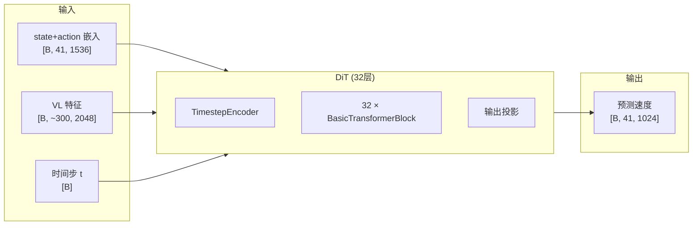

# DiT 架构逐层拆解：TimestepEncoder → AdaLayerNorm → CrossAttention

> 从 DiT 的输入到输出，逐层理解数据如何在 32 层 Transformer 中流动——时间步如何被编码、每个 Block 内部的三步操作、以及最终如何产生速度预测。

## 相关阅读

- [噪声调度](./10_噪声调度_Beta分布与时间步离散化)（上一章）
- [AlternateVLDiT](./12_AlternateVLDiT_交替注意力设计)（下一章）
- [Cross-Attention 与交替注意力](/前置知识/001e_前置知识_Cross_Attention与交替注意力机制)
- [AdaLayerNorm 条件化归一化](/前置知识/001f_前置知识_AdaLayerNorm条件化归一化)

---

## 前情提要

上一章我们理解了噪声调度——训练时如何选择时间步、Beta 分布的采样策略、
以及时间步如何被离散化。本章我们进入 DiT 的内部结构，理解这个"预测速度场"
的核心网络是怎么搭建的。

---

## 1. DiT 的角色：在整个模型中做什么？

在 GR00T N1.7 的架构中，DiT（Diffusion Transformer）位于动作头（ActionHead）内部，
负责一个核心任务：

> **给定当前的噪声动作 + VL 特征 + 时间步，预测此刻应该"往哪个方向走"（速度场）。**

它不负责理解图像（那是骨干网络的事），也不负责编码状态或解码动作（那是 MLP 的事）。
DiT 只做"给定所有信息，预测一个速度向量"——但这是整个去噪过程中最难的部分。



---

## 2. DiT 的整体结构

DiT 由三大部分组成。让我们先建立宏观认知，再逐一深入。

**第一部分：TimestepEncoder**——把离散时间步整数变成一个高维向量。
这个向量将被注入到每一层中，告诉网络"当前是去噪的第几步"。

**第二部分：32 个 BasicTransformerBlock**——核心计算单元。
偶数层做 Cross-Attention（从 VL 特征获取信息），奇数层做 Self-Attention（内部整合）。
每一层都通过 AdaLayerNorm 接收时间步信息。

**第三部分：输出投影**——把最后一层的 hidden_states 投影到目标维度（1024），
同时再做一次 AdaLN-Zero 调制。

---

## 3. 第一部分：TimestepEncoder

### 3.1 它要解决什么问题？

DiT 需要知道"当前是去噪的第几步"——因为同样的输入在 $t=0$（纯噪声）和 $t=0.75$（接近干净）时，网络应该给出完全不同的速度预测。

问题是：时间步是一个**整数**（0~999），而网络需要的是一个**高维连续向量**（1536维）。TimestepEncoder 就是做这个转换的。

### 3.2 设计思路

转换分为两步：

1. **Sinusoidal 投影**：用不同频率的 sin/cos 函数把整数编码为 256 维向量（类似 Transformer 的位置编码）
2. **MLP 嵌入**：通过一个 2 层 MLP 把 256 维扩展到 1536 维（DiT 的内部维度）

为什么要两步？因为 sinusoidal 编码是**固定的**（不可学习），它只提供"不同时间步是不同的"这个信号。MLP 在此基础上学习"不同时间步应该如何影响网络行为"——这需要可学习参数。

### 3.3 代码实现

```python
class TimestepEncoder(nn.Module):
    def __init__(self, embedding_dim, compute_dtype=torch.float32):
        super().__init__()
        # 第一步：sinusoidal 投影 (固定，不可学习)
        # 输入: 整数时间步 [B], 输出: [B, 256]
        self.time_proj = Timesteps(
            num_channels=256,           # 输出 256 维
            flip_sin_to_cos=True,       # cos 在前、sin 在后
            downscale_freq_shift=1      # 频率缩放参数
        )
        # 第二步：MLP 嵌入 (可学习)
        # 输入: [B, 256], 输出: [B, embedding_dim]
        self.timestep_embedder = TimestepEmbedding(
            in_channels=256,
            time_embed_dim=embedding_dim  # = 1536 (DiT inner_dim)
        )
    
    def forward(self, timesteps):
        dtype = next(self.parameters()).dtype
        timesteps_proj = self.time_proj(timesteps).to(dtype)   # [B] → [B, 256]
        timesteps_emb = self.timestep_embedder(timesteps_proj) # [B, 256] → [B, 1536]
        return timesteps_emb  # 这就是 temb，后续每一层都会用到它
```

### 3.4 具体数值追踪

假设 batch_size=2，时间步分别为 t=0 和 t=500：

```
输入: timesteps = [0, 500]

Step 1 - Sinusoidal 投影:
  t=0:   [cos(0), cos(0), ..., sin(0), sin(0), ...] = [1, 1, ..., 0, 0, ...]  (256维)
  t=500: [cos(500/10000^{0/256}), ..., sin(500/10000^{0/256}), ...] = [各种值]  (256维)
  
Step 2 - MLP 嵌入:
  [B, 256] → Linear(256, 1536) → SiLU → Linear(1536, 1536) → [B, 1536]
  
输出: temb = [2, 1536]
  temb[0] 编码了"t=0, 纯噪声阶段"
  temb[1] 编码了"t=500, 中间阶段"
```

这个 `temb` 会被传入每一层的 AdaLayerNorm，用于动态调制网络行为。

---

## 4. 第二部分：BasicTransformerBlock（核心计算单元）

### 4.1 每个 Block 做什么？

每个 BasicTransformerBlock 做三件事情（按顺序）：

1. **条件化归一化 + 注意力**：先用 AdaLayerNorm 注入时间步信息，再做 Attention
2. **残差连接**：把注意力的输出加回输入（不丢失已有信息）
3. **前馈网络 (FFN)**：一个 2 层 MLP 对特征做非线性变换

用数学表达：

$$
\begin{aligned}
h' &= h + \text{Attention}(\text{AdaLN}(h, \text{temb}), \ldots) \\
\text{output} &= h' + \text{FFN}(\text{LayerNorm}(h'))
\end{aligned}
$$

> **一句话直觉**：每个 Block = "带时间步条件的注意力" + "非线性变换"，外加残差连接保持梯度流畅。

### 4.2 Cross-Attention Block vs Self-Attention Block

GR00T 的 32 层 DiT 中，偶数层和奇数层的 Block 结构**完全相同**——区别只在于注意力的 K/V 来源：

| 层类型 | Attention 的行为 | 信息流方向 |
|--------|-----------------|-----------|
| Cross-Attention Block | Q 来自 hidden_states，K/V 来自 **VL 特征** | 外部→内部：从"我看到了什么"获取信息 |
| Self-Attention Block | Q/K/V 全部来自 **hidden_states** | 内部→内部：state 和 action token 互相交流 |

两种 Block 在代码中是同一个类（`BasicTransformerBlock`），
通过 `cross_attention_dim` 参数区分：不为 None 就是 Cross-Attention，
为 None 就退化为 Self-Attention。

### 4.3 Block 内部的详细数据流

以一个 Cross-Attention Block 为例，假设输入 hidden_states 形状为 `[B, 41, 1536]`：

```
输入: hidden_states [B, 41, 1536], temb [B, 1536], encoder_hidden_states [B, 300, 2048]

Step 1: AdaLayerNorm
  temb → SiLU → Linear → [scale, shift]  各 [B, 1536]
  norm_h = LayerNorm(hidden_states) * (1 + scale[:, None]) + shift[:, None]
  → norm_h: [B, 41, 1536]

Step 2: (可选) 位置编码
  如果配置了 positional_embeddings:
    norm_h = norm_h + pos_embed  (sinusoidal)

Step 3: Cross-Attention
  Q = W_Q @ norm_h             → [B, 41, 1536]   (41 个 query)
  K = W_K @ encoder_hidden_states → [B, 300, 1536]  (300 个 key，来自 VL 特征)
  V = W_V @ encoder_hidden_states → [B, 300, 1536]  (300 个 value)
  attn_output = softmax(QK^T / √48) @ V → [B, 41, 1536]
  
Step 4: Dropout + 残差
  hidden_states = hidden_states + dropout(attn_output)
  → [B, 41, 1536]  (保留了输入信息 + 注入了 VL 信息)

Step 5: FFN
  norm_h2 = LayerNorm(hidden_states)
  ff_output = Linear(GELU(Linear(norm_h2)))  (1536 → 6144 → 1536)
  hidden_states = hidden_states + ff_output
  → [B, 41, 1536]  (最终输出)
```

注意 Attention 中的 $\sqrt{48}$ 是因为 `attention_head_dim=48`。

### 4.4 注意力的多头机制

实际的 Attention 计算是**多头**的：

- 总维度 1536 被分成 32 个头（`num_attention_heads=32`）
- 每个头的维度是 48（`attention_head_dim=48`）
- 32 个头各自独立计算注意力，最后拼接

为什么要多头？不同的头可以关注不同方面的信息——
比如某些头关注空间位置、某些头关注物体属性、某些头关注时序关系。

---

## 5. 第三部分：输出投影（AdaLN-Zero）

### 5.1 为什么需要特殊的输出层？

经过 32 层 Block 后，hidden_states 包含了丰富的信息。但它的维度是 1536（DiT 内部维度），而我们最终需要的输出维度是 1024（`output_dim`，用于后续的 ActionDecoder）。

输出层需要做两件事：
1. 再做一次时间步条件化（最后的调制机会）
2. 维度投影：1536 → 1024

### 5.2 实现方式

输出层采用 **AdaLN-Zero** 风格——和中间层的 AdaLN 类似，但多了一步投影：

```python
# 在 DiT.forward() 的末尾：

# 1. 从 temb 生成 scale 和 shift
conditioning = temb                                          # [B, 1536]
shift, scale = self.proj_out_1(F.silu(conditioning)).chunk(2, dim=1)  # 各 [B, 1536]

# 2. 对最终 hidden_states 做 AdaLN 调制
hidden_states = self.norm_out(hidden_states) * (1 + scale[:, None]) + shift[:, None]
#   norm_out: LayerNorm (无可学习参数)
#   scale[:, None]: [B, 1, 1536] 广播到 [B, 41, 1536]

# 3. 投影到输出维度
output = self.proj_out_2(hidden_states)  # Linear(1536, 1024) → [B, 41, 1024]
```

### 5.3 为什么叫"Zero"？

"Zero" 指的是初始化策略——`proj_out_1` 的权重初始化为接近零的值，
使得训练开始时 scale ≈ 0、shift ≈ 0，输出约等于 `norm_out(hidden_states)` 的线性投影。

这确保了网络初期不会输出垃圾值——它从"近似恒等映射"出发，逐步学习有意义的调制。

---

## 6. 完整的 32 层数据流

现在让我们追踪一个完整的前向传播。输入：
- `hidden_states`：state + action embedding `[B, 41, 1536]`
- `encoder_hidden_states`：VL 特征 `[B, 300, 2048]`
- `timestep`：离散时间步 `[B]`，如 `[250, 500]`

### 6.1 GR00T 默认配置下 32 层的层类型分布

```
层 0:  Cross-Attn (cross_attention_dim=2048) → 从 VL 特征获取信息
层 1:  Self-Attn  (cross_attention_dim=None) → 内部交流
层 2:  Cross-Attn → 从 VL 特征获取信息
层 3:  Self-Attn  → 内部交流
...
层 30: Cross-Attn → 从 VL 特征获取信息
层 31: Self-Attn  → 内部交流
```

每一层都接收同一个 `temb`（时间步编码），但学习了**不同的** AdaLN 权重——
所以同一个 temb 在不同层产生不同的 scale/shift。

### 6.2 层间信息累积

关键概念（前面前置知识中已详细解释）：**残差连接让信息逐层累积，不会丢失**。

```
x₀ = 初始 embedding [B, 41, 1536]
x₁ = x₀ + CrossAttn(x₀, VL特征)      ← 注入了 VL 信息
x₂ = x₁ + SelfAttn(x₁)               ← state-action 内部整合了 VL 信息
x₃ = x₂ + CrossAttn(x₂, VL特征)      ← 再次从 VL 获取更精细的信息
x₄ = x₃ + SelfAttn(x₃)               ← 进一步整合
...
x₃₂ = 最终特征（累积了 16 次 VL 交互 + 16 次内部整合）
```

到第 32 层时，hidden_states 中的每个 action token 都充分融合了：
- 来自图像的空间信息（物体在哪）
- 来自文本的语义信息（要做什么）
- 来自其他 action token 的时序信息（前后动作要连贯）
- 来自 state token 的当前状态信息

### 6.3 维度变化汇总

| 阶段 | 张量 | 形状 | 说明 |
|------|------|------|------|
| 输入 | hidden_states | [B, 41, 1536] | state(1) + action(40) token |
| 输入 | encoder_hidden_states | [B, ~300, 2048] | VL 特征 |
| 输入 | timestep | [B] | 离散整数 (0-999) |
| TimestepEncoder | temb | [B, 1536] | 时间步向量 |
| 32层 Block | hidden_states | [B, 41, 1536] | 每层输入输出维度不变 |
| 输出投影 | output | [B, 41, 1024] | 最终速度特征 |

注意：hidden_states 在 32 层中**维度始终不变**（都是 [B, 41, 1536]）。
变化的是向量的**内容**——它逐步融入了越来越丰富的信息。

---

## 7. DiT 的参数量分析

GR00T 默认配置下：

| 组件 | 参数量估计 | 说明 |
|------|-----------|------|
| TimestepEncoder | ~4.7M | 256→1536 MLP (2层) |
| 每个 Cross-Attn Block | ~28M | Attn(Q/K/V/Out) + FFN(2层) + Norms |
| 每个 Self-Attn Block | ~21M | 同上但 K/V 维度较小(1536 vs 2048) |
| 输出投影 | ~6M | proj_out_1 + proj_out_2 + norm |
| **总计 (32层)** | **~790M** | 约 7.9 亿参数 |

这是 GR00T 中**可训练参数最多**的部分（当骨干网络被冻结时）。
微调时 `tune_diffusion_model=True` 就是打开这 ~790M 参数的梯度。

---

## 8. 和标准 Vision DiT 的区别

GR00T 的 DiT 和图像生成中使用的 DiT（如 Stable Diffusion 3）有几个关键区别：

| 维度 | 图像 DiT (SD3) | GR00T DiT |
|------|---------------|-----------|
| 输入 | 图像 latent token | state + action token |
| 条件注入 | 文本通过 cross-attn | VL 特征通过 cross-attn |
| 输出 | 预测噪声/速度 (图像空间) | 预测速度 (动作空间) |
| 序列长度 | ~4096 (64×64 latent) | ~41 (1 state + 40 action) |
| Cross-Attn 来源维度 | 768/1024 (文本编码) | 2048 (VLM 输出) |
| interleave self-attn | 不常用 | 默认开启 |
| 层数 | 24-38 | 32 |

GR00T 的 DiT 序列很短（只有 41 个 token），所以注意力计算非常快——
不像图像 DiT 需要处理 4096 个 token 的 $O(n^2)$ 注意力。

---

## 9. 总结

DiT 是 GR00T N1.7 动作生成的核心引擎，它的设计可以概括为：

1. **时间步条件化无处不在**：通过 AdaLayerNorm，每一层都直接受时间步控制
2. **外部信息交替获取**：偶数层从 VL 特征获取场景理解，奇数层内部消化整合
3. **残差连接保证信息累积**：32 层的信息逐步叠加，最终产生丰富的速度预测
4. **输出层 AdaLN-Zero**：最后一次条件调制 + 维度投影

整个 DiT 可以理解为一个"去噪专家"——它接收"被噪声污染的动作+场景理解+当前去噪进度"，
输出"此刻应该朝哪个方向修正动作"。通过 4 次这样的修正（推理时的 4 步 Euler 积分），
从纯噪声到达最终的精确动作轨迹。

---

## 下一章预告

下一章我们将深入 AlternateVLDiT——GR00T N1.7 的核心创新。
它在标准 DiT 的基础上引入了"图像/文本交替注意力"，让 Cross-Attention 层
在不同轮次关注不同类型的 token。我们将完整分析 `image_mask` 如何工作、
`attend_text_every_n_blocks` 的调度逻辑、以及这种设计带来的效果提升。
