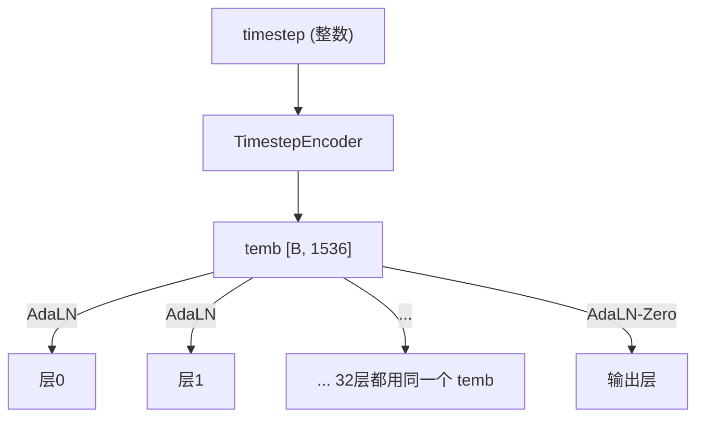

# DiT 输出层：AdaLN-Zero 调制与线性投影

> DiT 经过 32 层处理后，怎样把丰富的中间特征转化为最终的速度预测？本章聚焦输出层的设计细节。

## 相关阅读

- [Self-Attention 交叉层](./13_SelfAttention交叉层_interleave机制)（上一章）
- [ActionEncoder](./15_ActionEncoder_动作轨迹时间步联合编码)（下一章）
- [AdaLayerNorm 条件化归一化](/前置知识/001f_前置知识_AdaLayerNorm条件化归一化)

---

## 前情提要

前几章我们理解了 DiT 32 层内部如何通过交替注意力处理信息。本章聚焦最后一步——
如何把第 32 层输出的 `[B, 41, 1536]` 特征转换成模型真正需要的速度预测。

---

## 1. 为什么输出层需要特殊设计？

如果只是简单地加一个线性层把 1536 维投影到 1024 维，会漏掉一个重要信息：
**当前是去噪的第几步**。

回忆一下，DiT 的每一层内部都通过 AdaLayerNorm 感知时间步。但最后的输出投影如果不做同样的处理，就相当于"中间过程很谨慎，最后一步却把时间步信息丢掉了"。GR00T 的解决方案是：**在输出投影之前再做一次 AdaLN 调制**，确保时间步信息一直保留到最后一刻。

这种"输出层也做条件调制"的设计，在扩散 Transformer 领域有个专门的名字——**AdaLN-Zero**。

---

## 2. AdaLN-Zero 的设计动机

### 2.1 为什么叫"Zero"？

关键在于**初始化方式**。输出层的调制参数（scale, shift）来自一个线性层：

$$
[\text{shift}, \text{scale}] = \text{Linear}(\text{SiLU}(\text{temb}))
$$

如果这个 `Linear` 层的权重被初始化为**全零**，那么无论 temb 是什么，
输出的 `scale=0, shift=0`。代入 AdaLN 公式：

$$
\text{output} = \text{LN}(x) \times (1 + 0) + 0 = \text{LN}(x)
$$

网络训练刚开始时，输出层等价于一个**纯粹的 LayerNorm**——不做任何条件相关的额外扰动。

### 2.2 为什么要这样初始化？

想象一个刚初始化的网络（权重都是随机的）。如果输出层的调制参数也是随机的，
那么网络最开始的输出会是"随机噪声乘以随机缩放再加随机偏移"——完全不可控，
损失函数在训练初期会剧烈震荡。

用 Zero 初始化，网络在训练第一步的行为是**可预测的**（约等于恒等映射）,
随着训练进行，`Linear` 层的权重逐渐从零开始学习出有意义的调制参数。
这是一种"渐进式学习"策略，被证明能显著提升训练稳定性。

---

## 3. 具体实现

输出层需要完成两个任务：调制 + 投影。先做条件化的归一化（和中间层的 AdaLN 手法一致，但这次调制的对象是最终输出），再用一个线性层把维度从 1536 压缩到 1024。

来看实现：

```python
# DiT 类中定义的输出层组件（在 __init__ 中）
self.norm_out = nn.LayerNorm(self.inner_dim, elementwise_affine=False, eps=1e-6)
self.proj_out_1 = nn.Linear(self.inner_dim, 2 * self.inner_dim)  # 生成 scale+shift
self.proj_out_2 = nn.Linear(self.inner_dim, self.output_dim)    # 最终维度投影
```

有了这三个组件，`forward()` 末尾的调用顺序就是"先归一化、再调制、最后投影"三步走：

```python
# 在 forward() 的末尾：
conditioning = temb  # [B, 1536]，和中间层用的是同一个 temb

# 1. 生成 shift 和 scale
shift, scale = self.proj_out_1(F.silu(conditioning)).chunk(2, dim=1)  # 各 [B, 1536]

# 2. AdaLN 调制
hidden_states = self.norm_out(hidden_states) * (1 + scale[:, None]) + shift[:, None]
# hidden_states: [B, 41, 1536]

# 3. 投影到目标维度
output = self.proj_out_2(hidden_states)  # [B, 41, 1024]
```

逐行看这三步在做什么：

- `self.norm_out`：无可学习参数的 LayerNorm（`elementwise_affine=False`），所有的缩放偏移都靠外部条件提供。
- `scale[:, None]`：把 `[B, 1536]` 扩展为 `[B, 1, 1536]`，这样能通过广播机制作用到序列维度的每一个 token 上（`hidden_states` 是 `[B, 41, 1536]`）。
- `proj_out_2`：把最终的调制结果投影到 `output_dim=1024`。这一步之后，DiT 的工作就完成了——后续会交给 ActionDecoder 继续处理。

---

## 4. 输出的语义：这个张量代表什么？

DiT 的最终输出是形状为 `[B, 41, 1024]` 的张量。要理解它的语义，需要回顾一下整体流程：

- 序列的第 0 个 token 对应 state
- 第 1-40 个 token 对应 40 步 action

所以 DiT 的输出可以理解为：

```
output[:, 0, :]    → 融合了所有信息的 state 表示（这部分通常不会被使用）
output[:, 1:, :]   → 40 步动作对应的"速度场预测"（在 embedding 空间）
```

代码中通过切片提取动作部分：

```python
# 在 ActionHead.forward() 中：
pred = self.action_decoder(model_output, embodiment_id)  # 先解码
pred_actions = pred[:, -actions.shape[1]:]  # 再切片取最后 40 个位置
```

注意：解码（维度从 1024 降到 132）和切片（从 41 降到 40）是两个独立的操作，
`action_decoder` 才是真正把 1024 维的抽象特征转换为物理动作维度的模块——
这是下一章 `CategorySpecificMLP` 要讲的内容。

---

## 5. 时间步信息的完整旅程

回顾一下，`temb`（时间步编码）在整个 DiT 中被使用了多少次：



同一个 `temb` 被**复用了 33 次**——32 层内部各一次，输出层再一次。
每次复用都是"独立学习"的——虽然输入的 temb 相同，但每一层的 `Linear` 权重不同，
所以每一层从 temb 中提取出的 scale/shift 是不同的。

这是一种高效的参数共享设计——`TimestepEncoder` 只需要跑一次（计算量很小），
但它的输出可以驱动 33 个不同位置的条件调制。

---

## 6. 总结

DiT 输出层的关键设计点：

1. **AdaLN-Zero**：条件调制 + Zero 初始化，确保时间步信息保留到最后一刻，同时保证训练初期稳定
2. **维度投影**：从内部计算维度（1536）压缩到目标维度（1024）
3. **单次编码、多次复用**：TimestepEncoder 只跑一次，`temb` 被 33 个不同的 AdaLN 层复用

DiT 到这里的完整工作流程告一段落——从输入的噪声动作+VL特征+时间步，
经过 32 层交替注意力处理，最终输出预测的速度特征。接下来的章节将转向
"编解码器"——理解 state 和 action 是如何被编码成 DiT 能处理的向量，
以及 DiT 的输出又是如何被解码回物理动作空间的。

---

## 下一章预告

下一章我们将深入 `ActionEncoder`——动作轨迹和时间步是如何被联合编码成
DiT 输入向量的。你会看到 `SinusoidalPositionalEncoding`、`Swish` 激活函数、
以及三层线性变换（W1/W2/W3）的具体设计。
