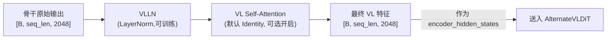

# VLLN 与 VL Self-Attention：骨干特征后处理

> 骨干网络输出的原始特征，在进入 DiT 之前还经过了哪些额外处理？本章讲清楚 VLLN 归一化和可选的 VL Self-Attention 精炼层。

## 相关阅读

- [StateEncoder 与 ActionDecoder](./17_StateEncoder与ActionDecoder)（上一章）
- [训练前向传播完整走读](./19_训练前向传播完整走读)（下一章）
- [Qwen3Backbone 实现详解](./07_Qwen3Backbone实现详解)

---

## 前情提要

前面几章我们分别看了 state/action 的编解码路径。本章补上另一条路径——
骨干网络（Qwen3Backbone）输出的 VL 特征，在成为 DiT 的 `encoder_hidden_states`
之前，还要经过 `process_backbone_output` 这个处理步骤。

---

## 1. 为什么骨干输出不能直接用？

骨干网络输出的 `backbone_features` 来自一个原本为"理解和生成文本"而训练的 VLM。
虽然这些特征包含丰富的视觉-语言信息，但它们的**数值分布**未必适合直接送入 DiT 的
cross-attention 计算——不同的预训练模型输出的特征范数、方差可能差异很大，
如果不做任何调整就直接使用，可能导致 DiT 的注意力计算不稳定。

GR00T 的解决方案很直接：**加一层 LayerNorm**，先把特征分布"标准化"，
再决定是否需要进一步的信息精炼（VL Self-Attention）。

---

## 2. VLLN：标准化骨干特征

### 2.1 实现

```python
self.vlln = (
    nn.LayerNorm(config.backbone_embedding_dim) if config.use_vlln else nn.Identity()
)
```

`use_vlln=True`（默认）时，用一个标准的 `LayerNorm` 层；否则用 `nn.Identity()`
（不做任何变换，原样传递）。这是一个典型的"可开关"设计——方便做消融实验。

### 2.2 使用位置

```python
def process_backbone_output(self, backbone_output: BatchFeature) -> BatchFeature:
    backbone_features = backbone_output["backbone_features"]
    backbone_features = self.vlln(backbone_features)         # 归一化
    backbone_features = self.vl_self_attention(backbone_features)  # 可选精炼
    backbone_output["backbone_features"] = backbone_features
    return backbone_output
```

这个方法在训练前向传播（`forward`）和推理（`get_action`）中都会被调用——
是骨干输出进入 DiT 之前的必经步骤。

### 2.3 为什么这个 LayerNorm 是可训练的？

回顾配置：`tune_vlln: bool = True`（默认可训练）。虽然骨干本身通常被冻结
（`tune_llm=False`），但这个额外加的 LayerNorm 是可训练的——
它扮演了"适配器"的角色：在骨干冻结的前提下，仍然给模型一点调整空间，
让冻结的骨干特征能更好地适配下游的动作生成任务。

这是一种常见的高效微调策略——冻结大部分参数，只训练少量"适配层"，
用很小的代价换取任务适配能力。

---

## 3. VL Self-Attention：可选的精炼层

### 3.1 动机

骨干网络输出的 VL 特征序列可能很长（几百个 token），其中图像 token 和文本 token
是分开产生的（先各自编码，再拼接）。虽然 Qwen3-VL 内部的因果注意力已经让
文本 token 能看到之前的图像 token，但这种关联可能还不够充分——
特别是当截断骨干层数（如 select_layer=16）之后，可能损失了一部分本该有的
跨模态整合能力。

`vl_self_attention` 提供了一个可选的补救机制：在 VL 特征进入 DiT 之前，
额外用几层 Self-Attention 让图像和文本 token 之间再充分交流一次。

### 3.2 实现

```python
vl_self_attention_cfg = getattr(config, "vl_self_attention_cfg", None)
if vl_self_attention_cfg and vl_self_attention_cfg.get("num_layers", 0) > 0:
    self.vl_self_attention = SelfAttentionTransformer(**vl_self_attention_cfg)
else:
    self.vl_self_attention = nn.Identity()
```

默认情况下 `vl_self_attention_cfg` 是 `None`，所以 `self.vl_self_attention`
实际是 `nn.Identity()`——即默认**不启用**这个精炼层。这是一个"预留的扩展点"，
如果未来发现骨干截断后的特征整合不够充分，可以通过配置打开这个模块。

### 3.3 SelfAttentionTransformer 的结构

回顾第 11-13 章，我们已经详细拆解了 `DiT` 和 `AlternateVLDiT` 的内部结构。
`SelfAttentionTransformer` 复用了同一套 `BasicTransformerBlock`，但**去掉了
时间步条件化和cross-attention**——它是一个纯粹的、无条件的 Self-Attention 堆叠：

```python
class SelfAttentionTransformer(ModelMixin, ConfigMixin):
    def __init__(self, num_attention_heads=8, attention_head_dim=64, num_layers=12, ...):
        self.transformer_blocks = nn.ModuleList([
            BasicTransformerBlock(
                self.inner_dim, num_attention_heads, attention_head_dim,
                # 注意：没有传入 cross_attention_dim，也没有 norm_type="ada_norm"
                # 所以这些 block 默认是标准 LayerNorm + Self-Attention
            )
            for _ in range(num_layers)
        ])

    def forward(self, hidden_states, return_all_hidden_states=False):
        for block in self.transformer_blocks:
            hidden_states = block(hidden_states)  # 注意：没有传 temb 和 encoder_hidden_states
        return hidden_states
```

和 DiT 的 Block 使用同一个类，但因为没有传入 `temb`（时间步）和
`encoder_hidden_states`（外部条件），这些 Block 退化为最朴素的 Self-Attention + FFN 堆叠——
类似一个小型的 BERT Encoder，只做"让 VL token 之间互相交流"这一件事。

---

## 4. 完整的骨干后处理流程图



在 GR00T N1.7 的默认配置下，实际流程是：
`原始骨干输出 → LayerNorm(可训练) → Identity(不变) → 送入DiT`

也就是说默认配置下，唯一实质性的处理就是那一层可训练的 LayerNorm。
`vl_self_attention` 是为未来实验预留的扩展点。

---

## 5. 为什么这些组件的训练开关独立于骨干？

回顾配置参数：
- `tune_llm=False`（骨干LLM冻结）
- `tune_visual=False`（骨干视觉冻结）
- `tune_vlln=True`（VLLN可训练）

这种"骨干冻结但外围组件可训练"的模式贯穿了整个 GR00T 设计——
DiT、编解码器、VLLN 全部默认可训练，只有"通用预训练知识"部分（骨干VLM）被冻结。

这符合迁移学习的基本原则：**通用知识（视觉理解、语言理解）不需要为特定任务重新学习，
但任务特定的适配层（如何把通用理解转化为具体动作）必须针对当前任务从头训练或精调**。

---

## 6. 总结

VLLN 和 VL Self-Attention 是骨干特征进入 DiT 之前的最后一道处理：

1. **VLLN**：一个可训练的 LayerNorm，标准化骨干输出的特征分布，充当"骨干-动作头"之间的适配器
2. **VL Self-Attention**：默认关闭（Identity），是为未来可能需要更强跨模态整合而预留的扩展点
3. **设计哲学**：骨干保持冻结（保留预训练知识），外围组件保持可训练（适配下游任务）

至此，我们已经完整梳理了 GR00T N1.7 ActionHead 内部的所有组件——从骨干输出的后处理，
到 state/action 的编解码，到核心的 DiT 处理。下一部分我们将把这些组件串起来，
完整走读一次训练时的前向传播过程。

---

## 下一章预告

下一章我们进入训练流程部分——完整走读一次前向传播，追踪一个 batch 从输入
到损失计算的每一步张量形状变化，把前面几章讲的所有组件串联成一条完整的数据流。
