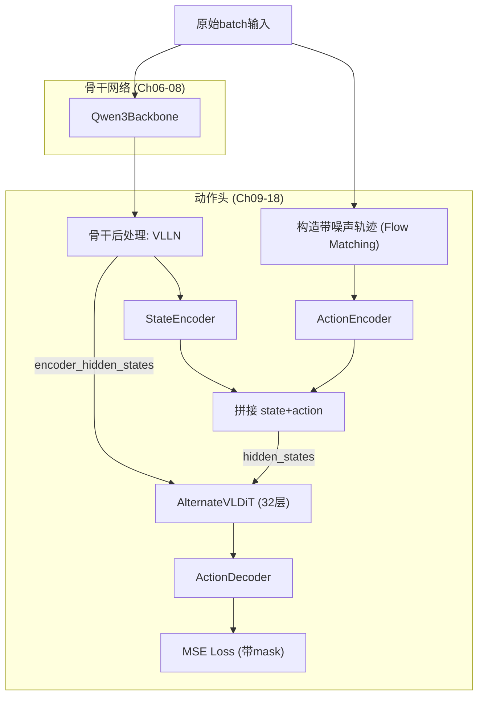

# 训练前向传播完整走读：从观测到 Loss

> 把前面所有章节讲过的组件串成一条完整数据流——追踪一个 batch 从输入张量到最终 loss 标量的每一步形状变化。

## 相关阅读

- [VLLN 与 VL Self-Attention](./18_VLLN与VL_SelfAttention)（上一章）
- [数据管线](./20_数据管线_从轨迹到Batch)（下一章）
- [Flow Matching 数学基础](./09_Flow_Matching数学基础)

---

## 前情提要

前面 18 章我们分模块讲解了骨干网络、DiT、编解码器的各自细节。本章不再引入新概念，
而是把所有组件串成一条完整的流水线——像放电影一样，完整走一遍训练时一个 batch
的生命周期。

---

## 1. 起点：一个训练 batch 长什么样？

假设 batch_size=4，动作维度统一为132，动作horizon为40，来自混合的机器人数据。
一个训练 batch 包含两部分输入：**骨干输入**（图像+文本）和**动作头输入**（状态+动作）。

```python
inputs = {
    # 骨干输入 (给 Qwen3Backbone)
    "input_ids": ...,          # [4, ~500] 文本+图像占位符
    "attention_mask": ...,     # [4, ~500]
    "pixel_values": ...,       # 图像patch数据
    "image_grid_thw": ...,     # 图像grid结构信息
    
    # 动作头输入 (给 Gr00tN1d7ActionHead)
    "state": ...,               # [4, 1, 132] (state_history_length=1)
    "action": ...,              # [4, 40, 132]
    "action_mask": ...,         # [4, 40, 132] (标记哪些维度是真实有效的)
    "embodiment_id": ...,       # [4] 整数，如 [26, 26, 25, 26]
}
```

---

## 2. 第一步：拆分输入

模型的顶层 `forward` 方法先把混合的 inputs 拆分成骨干需要的部分和动作头需要的部分，
并统一移到正确的 device 和 dtype：

```python
def forward(self, inputs: dict) -> BatchFeature:
    backbone_inputs, action_inputs = self.prepare_input(inputs)
    backbone_outputs = self.backbone(backbone_inputs)
    action_outputs = self.action_head(backbone_outputs, action_inputs)
    return action_outputs
```

三行代码概括了整个前向传播：**准备输入 → 骨干处理 → 动作头处理**。
接下来我们把这三步都展开看。

## 3. 第二步：骨干网络处理

回顾第 6-8 章的内容——骨干接收图像和文本 token，输出统一的 VL 特征。
这里我们只关注张量形状的变化：

```
输入:
  input_ids:        [4, 500]
  attention_mask:   [4, 500]
  pixel_values:      (拼接后的图像patch)
  image_grid_thw:    [num_images, 3]

Qwen3Backbone.forward():
  经过 ViT 编码图像 patches
  经过 16 层 Transformer Decoder (因为 select_layer=16)
  
输出:
  backbone_features:      [4, 500, 2048]
  backbone_attention_mask: [4, 500]  (bool)
  image_mask:              [4, 500]  (bool, 标记哪些位置是图像token)
```

---

## 4. 第三步：动作头处理——这是本章的主体

动作头（`Gr00tN1d7ActionHead.forward`）接收骨干输出和动作输入，
是整个前向传播中最复杂的部分。我们把它拆成 7 个子步骤，逐一过一遍。

### 4.1 子步骤 1：骨干特征后处理

回顾第 18 章——骨干输出先经过 VLLN（LayerNorm）和可选的 VL Self-Attention：

```python
backbone_output = self.process_backbone_output(backbone_output)
vl_embeds = backbone_output.backbone_features  # [4, 500, 2048]
```

### 4.2 子步骤 2：状态编码

回顾第 17 章——把状态reshape并送入 `CategorySpecificMLP` 编码：

```python
action_input.state = action_input.state.view(B, 1, -1)  # [4, 1, 132] (无变化，因为history=1)
state_features = self.state_encoder(action_input.state, embodiment_id)  # [4, 1, 1536]

# 训练时的 state dropout (20%概率清零)
if self.training and self.state_dropout_prob > 0:
    do_dropout = torch.rand(B) < 0.2
    state_features = state_features * (1 - do_dropout[:, None, None])
```

### 4.3 子步骤 3：构造带噪声的动作轨迹

回顾第 9-10 章——采样噪声和时间步，构造 Flow Matching 训练样本：

```python
actions = action_input.action  # [4, 40, 132] 真实动作
noise = torch.randn_like(actions)  # [4, 40, 132]

t = self.sample_time(B, device, dtype)  # [4] Beta分布采样
t = t[:, None, None]  # [4, 1, 1] 便于广播

noisy_trajectory = (1 - t) * noise + t * actions  # [4, 40, 132]
velocity = actions - noise  # [4, 40, 132] 训练目标

t_discretized = (t[:, 0, 0] * 1000).long()  # [4] 离散化时间步，如 [130, 780, 450, 20]
```

### 4.4 子步骤 4：动作编码

回顾第 15 章——把带噪声的动作和时间步一起编码：

```python
action_features = self.action_encoder(noisy_trajectory, t_discretized, embodiment_id)
# [4, 40, 1536]

# 可选：加位置编码
if self.config.add_pos_embed:
    pos_ids = torch.arange(40)
    pos_embs = self.position_embedding(pos_ids).unsqueeze(0)  # [1, 40, 1536]
    action_features = action_features + pos_embs  # 广播相加 [4, 40, 1536]
```

### 4.5 子步骤 5：拼接成 DiT 输入序列

```python
sa_embs = torch.cat((state_features, action_features), dim=1)
# [4, 1, 1536] cat [4, 40, 1536] -> [4, 41, 1536]
```

这就是 DiT 的 `hidden_states` 输入——第0个位置是state，后40个位置是action。

### 4.6 子步骤 6：DiT 前向传播

回顾第 11-14 章——32层 AlternateVLDiT 处理：

```python
model_output, all_hidden_states = self.model(
    hidden_states=sa_embs,                     # [4, 41, 1536]
    encoder_hidden_states=vl_embeds,            # [4, 500, 2048]
    encoder_attention_mask=backbone_output.backbone_attention_mask,  # [4, 500]
    timestep=t_discretized,                     # [4]
    return_all_hidden_states=True,
    image_mask=backbone_output.image_mask,       # [4, 500]
    backbone_attention_mask=backbone_output.backbone_attention_mask,
)
# model_output: [4, 41, 1024]  (32层处理 + AdaLN-Zero输出投影后)
```

### 4.7 子步骤 7：解码并计算 Loss

回顾第 17 章——解码到物理动作维度，再计算带mask的MSE loss：

```python
pred = self.action_decoder(model_output, embodiment_id)  # [4, 41, 132]
pred_actions = pred[:, -actions.shape[1]:]  # 切片取最后40个 -> [4, 40, 132]

action_mask = action_input.action_mask  # [4, 40, 132]
action_loss = F.mse_loss(pred_actions, velocity, reduction="none") * action_mask
# [4, 40, 132] 每个元素的loss，被mask的位置(无效维度)乘以0

loss = action_loss.sum() / (action_mask.sum() + 1e-6)
# 标量，只在有效维度上做平均
```

---

## 5. 为什么要用 `action_mask` 做加权平均？

这是一个容易被忽视但很重要的细节。回顾多具身体设计——不同机器人的真实动作维度
不同（Franka是8维，G1是50+维），但统一填充到132维。填充的那些"假"维度不应该
参与loss计算，否则模型会白白花费容量去学习"如何预测填充值"（通常是学预测0）。

`action_mask` 的形状和 `pred_actions` 完全一致 `[4, 40, 132]`，
真实存在的动作维度标记为1，填充维度标记为0：

```
假设样本0是Franka机器人(8维动作)，action_mask[0] 的第0步大致是:
  [1,1,1,1,1,1,1,1, 0,0,0,...,0]  (前8维=1, 后124维=0)
```

`action_loss = mse * action_mask` 让填充维度的loss贡献直接变成0。
但如果只是 `mean()`，填充的0仍然会稀释分母（除以132而不是8）。
所以正确的做法是 `sum() / mask.sum()`——分子分母都只统计有效维度，
真正实现"只在真实存在的动作维度上算平均loss"。

---

## 6. 完整数据流总图



---

## 7. 一张表看完整的张量形状变化

| 步骤 | 变量名 | 形状 | 来源章节 |
|------|--------|------|---------|
| 骨干输入 | input_ids, pixel_values | [4,500], (图像) | Ch07 |
| 骨干输出 | vl_embeds | [4, 500, 2048] | Ch06-07 |
| 状态编码 | state_features | [4, 1, 1536] | Ch16-17 |
| 噪声轨迹 | noisy_trajectory | [4, 40, 132] | Ch09-10 |
| 动作编码 | action_features | [4, 40, 1536] | Ch15 |
| DiT输入 | sa_embs | [4, 41, 1536] | 本章 |
| DiT输出 | model_output | [4, 41, 1024] | Ch11-14 |
| 解码后 | pred_actions | [4, 40, 132] | Ch16-17 |
| 最终 | loss | 标量 | 本章 |

---

## 8. 总结

本章把 GR00T ActionHead 的 7 个子步骤串成一条完整流水线：

1. 骨干特征后处理（VLLN）
2. 状态编码（+可选dropout）
3. 构造Flow Matching训练样本（采样噪声+时间步）
4. 动作编码（+位置编码）
5. 拼接state和action为DiT输入序列
6. DiT前向传播（32层交替注意力）
7. 解码+计算带mask的loss

这条流水线是理解GR00T训练机制的核心。之后的每次反向传播，梯度会沿着这条流水线
反向流动，更新DiT、编解码器（以及可能的骨干顶层）的所有可训练参数。

---

## 下一章预告

下一章我们把视角切换到"数据从哪里来"——从原始的机器人轨迹数据，
到最终变成本章描述的训练batch，中间经过了哪些处理步骤。
