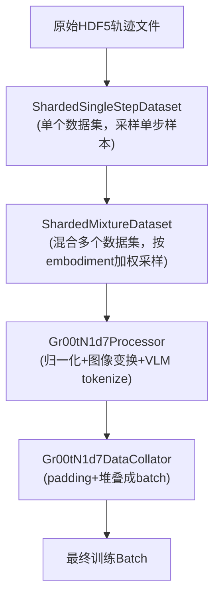
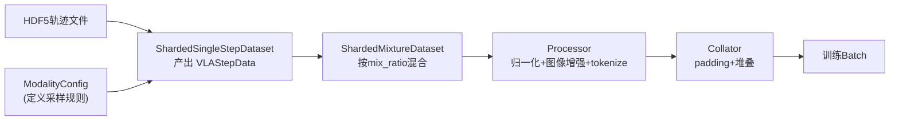

# 数据管线：从原始轨迹到训练 Batch

> 原始的机器人演示数据是怎么一步步变成上一章描述的训练batch的？本章走通完整的数据管线。

## 相关阅读

- [训练前向传播完整走读](./19_训练前向传播完整走读)（上一章）
- [图像增强与数据变换](./21_图像增强与数据变换)（下一章）
- [代码地图](./04_代码地图_仓库结构与模块职责)

---

## 前情提要

上一章我们看到训练batch的样子——已经是归一化、pad好、编码完成的张量。
本章往前看，理解这些张量是怎么从"原始的机器人演示轨迹"一步步加工出来的。

---

## 1. 原始数据是什么样的？

机器人演示数据本质上是一段"时间序列"：每一帧记录了当时的图像观测、机器人状态、
以及执行的动作。存储格式通常是 HDF5 或类似的结构化格式，一条完整的演示轨迹
可能包含几十到几百帧。

比如一条"抓取红色方块"的演示，可能有 200 帧，每帧记录：
- 2个相机视角的RGB图像（外部相机+腕部相机）
- 7维关节角状态
- 7维执行的动作（关节角速度）
- 语言标注（整条轨迹共享同一句指令）

---

## 2. 数据管线的三层结构

GR00T 的数据加载分为三个层次，职责逐级清晰：



- **ShardedSingleStepDataset**：负责从**一个**数据集（如"Franka抓取任务"）中，
  按照 `ModalityConfig` 定义的规则采样出单个训练样本（`VLAStepData`）
- **ShardedMixtureDataset**：负责把**多个**数据集（可能是不同机器人、不同任务）
  按配置的 `mix_ratio` 混合采样，产出统一的训练流
- **Processor**：负责把 `VLAStepData` 中的原始数据（numpy数组、PIL图像）转换成
  归一化后的、VLM能理解的张量格式
- **Collator**：负责把多个单独的样本堆叠（padding对齐后）成一个batch

## 3. ModalityConfig：定义"要采样什么"

在深入具体实现之前，先理解一个关键的配置概念——`ModalityConfig`。
它定义了从原始轨迹中提取训练样本时，"往前看多少帧、往后看多少帧、取哪些字段"。

### 3.1 delta_indices 的含义

回顾第4章提到的配置结构，一个典型的 `ModalityConfig` 长这样：

```python
"video": ModalityConfig(
    delta_indices=[-15, 0],  # 相对当前帧,取"15帧之前"和"当前帧"
    modality_keys=["exterior_image_1_left", "wrist_image_left"],
),
"action": ModalityConfig(
    delta_indices=list(range(40)),  # 取当前帧开始的连续40帧
    modality_keys=["eef_9d", "gripper_position", "joint_position"],
),
```

`delta_indices` 是相对于"采样的基准帧索引"的偏移量列表。假设轨迹在第100帧被采样为基准：

- `video` 的 `delta_indices=[-15, 0]` 意味着取第 85 帧和第 100 帧的图像（历史信息）
- `action` 的 `delta_indices=list(range(40))` 意味着取第 100 到 139 帧的动作
  （这就是 `action_horizon=40` 的来源——要预测未来40步）

### 3.2 为什么video要看历史帧,而action只往前看?

Video的历史帧（如15帧前）能提供"运动趋势"信息——比如判断物体是静止还是正在被推动。
Action是我们要预测的**目标**，天然只关心"接下来要做什么"，所以只往未来方向取。

---

## 4. ShardedSingleStepDataset：从单个数据集采样

这个类的核心职责是：给定一个基准帧索引，根据 `ModalityConfig` 中的 `delta_indices`,
从HDF5文件中读出对应的多个字段，组装成一个 `VLAStepData`。

关键设计是"分片(sharded)"——数据集不是一次性全部加载进内存，而是按需读取小块，
这对于超大规模数据集（可能几TB）是必要的。"分片"意味着数据被切成很多小份
（shard），每次训练迭代只加载当前需要的shard，用完即释放，避免内存爆炸。

---

## 5. ShardedMixtureDataset：混合多个数据集

### 5.1 为什么需要混合？

GR00T的预训练数据来自多个不同来源——不同机器人（DROID, G1, R1等）、
不同任务、不同数据质量。训练时希望**同时**看到这些数据，而不是先训练完一个
再训练下一个（那样会导致灾难性遗忘前面学到的机器人）。

### 5.2 混合比例:mix_ratio

回顾第4章提到的配置：

```python
config.data.datasets = [
    SingleDatasetConfig(dataset_paths=["/data/franka"], mix_ratio=1.0, embodiment_tag="franka"),
    SingleDatasetConfig(dataset_paths=["/data/g1"], mix_ratio=0.5, embodiment_tag="g1"),
]
```

`mix_ratio` 决定了不同数据集在最终混合流中的**相对**采样概率。
在 `DatasetFactory.build()` 中，实际的采样权重计算方式是：

```python
dataset_lengths = np.array([len(dataset) for dataset in datasets])  # 每个数据集的样本数
dataset_relative_lengths = dataset_lengths / dataset_lengths.sum()  # 按大小归一化
weight = relative_length * mix_ratio  # 再乘以配置的mix_ratio
```

这意味着最终权重同时受"数据集本身大小"和"配置的mix_ratio"两个因素影响——
一个数据集本身样本多，天然会被更多采样；但可以通过调低 `mix_ratio` 人为压低
它的采样频率（比如某个数据集质量较差，想减少它在训练中的比重）。

### 5.3 具体数值例子

假设：
- 数据集A（Franka）：10000个样本，mix_ratio=1.0
- 数据集B（G1）：2000个样本，mix_ratio=0.5

```
relative_length_A = 10000/(10000+2000) = 0.833
relative_length_B = 2000/(10000+2000) = 0.167

weight_A = 0.833 * 1.0 = 0.833
weight_B = 0.167 * 0.5 = 0.0835

归一化后:
  P(采样A) = 0.833 / (0.833+0.0835) ≈ 0.909
  P(采样B) = 0.0835 / (0.833+0.0835) ≈ 0.091
```

即使B的mix_ratio只是A的一半，由于B本身样本数少很多，最终B被采样的概率
远低于A（约9%）。如果想让B和A获得同等的训练关注度，需要调大它的 `mix_ratio`
来补偿样本数的差距。

---

## 6. Processor：从原始数据到归一化张量

`Gr00tN1d7Processor` 是整条管线中最"重"的一步——它需要同时处理图像变换、
状态/动作归一化、以及VLM的tokenize。

### 6.1 状态和动作的归一化

回顾我们之前提过的 `StateActionProcessor`，归一化的核心思路是把不同尺度的物理量
统一映射到 `[-1, 1]` 区间，方便神经网络处理（网络不擅长处理尺度差异悬殊的输入,
比如"关节角度"是弧度制的小数,而"末端位置"是米级的数值,直接混在一起训练效果不好)。

最常用的是 min-max 归一化：

$$
x_{\text{norm}} = 2 \cdot \frac{x - x_{\min}}{x_{\max} - x_{\min}} - 1
$$

> **一句话直觉**：把原始值在 [min, max] 区间中的相对位置，线性映射到 [-1, 1]。

**逐项拆解**：
- $x$：原始物理量（如关节角度，单位弧度）
- $x_{\min}, x_{\max}$：这个物理量在训练数据集中观测到的最小值和最大值（或1%/99%分位数）
- $\frac{x - x_{\min}}{x_{\max} - x_{\min}}$：先归一化到 [0, 1]
- $2 \cdot (\cdot) - 1$：再线性映射到 [-1, 1]

**具体数值例子**：假设某个关节角度范围是 $[-1.5, 1.5]$（弧度），当前值 $x=0.75$：
$$
x_{\text{norm}} = 2 \cdot \frac{0.75 - (-1.5)}{1.5 - (-1.5)} - 1 = 2 \cdot \frac{2.25}{3.0} - 1 = 2 \times 0.75 - 1 = 0.5
$$

**为什么用 [-1,1] 而不是 [0,1]**：因为神经网络的激活函数（如tanh）和权重初始化
通常假设输入是零中心的，[-1,1] 比 [0,1] 更符合这个假设，有利于训练稳定性。

### 6.2 为什么要用分位数而不是绝对min/max？

回顾第5章提到的 `use_percentiles=True`——用1%和99%分位数代替绝对min/max。
如果数据中有个异常值（比如传感器故障导致的极端读数），用绝对min/max会让
这个异常值"拉爆"整个归一化区间,导致99%的正常样本被压缩到很小的范围内,
损失分辨率。用分位数忽略掉两端各1%的极端值，能获得更好的归一化效果。

### 6.3 图像处理与VLM tokenize

图像部分需要经过第21章会详细讲的图像增强流程，文本部分通过VLM自带的
tokenizer转换成token ID。这两部分最终会被打包成骨干网络需要的
`input_ids`, `pixel_values`, `image_grid_thw` 等字段。

---

## 7. Collator：组装成Batch

最后一步是把多个独立的样本（可能形状略有不同，比如不同长度的文本指令）
padding对齐后堆叠成一个batch。

回顾 `Gr00tN1d7DataCollator` 的核心逻辑——对于 `state`, `action` 等固定形状的
数值字段直接堆叠（`np.stack`），对于 `vlm_content`（包含图像和文本）则调用
VLM自带的processor做padding和tokenize（这一步统一处理文本长度不一致的问题）。

```python
# 简化后的核心逻辑
for key in keys:
    values = [elem[key] for elem in features]
    if key == "vlm_content":
        # 调用VLM processor统一处理文本padding和图像batching
        vlm_inputs = self.processor(text=text_list, images=image_inputs,
                                     return_tensors="pt", padding=True)
    else:
        # state, action等数值字段，直接堆叠batch维度
        batch[key] = torch.from_numpy(np.stack(values))
```

---

## 8. 完整管线总结图



---

## 9. 总结

数据管线的核心设计要点：

1. **ModalityConfig 用 delta_indices 定义采样窗口**——video看历史，action看未来
2. **分片(sharded)加载**支持超大规模数据集，避免一次性加载进内存
3. **混合采样(mix_ratio)**让多个机器人/任务的数据能按可控比例同时训练
4. **归一化**统一不同物理量的尺度到 [-1,1]，用分位数而非绝对极值避免异常值干扰
5. **Collator**统一处理不同长度样本的padding，最终产出规整的batch张量

---

## 下一章预告

下一章我们深入图像处理的细节——裁剪、缩放、旋转、色彩抖动这些增强手段
具体怎么实现，以及基于mask的特殊增强（背景噪声、区域变色）是怎么工作的。
