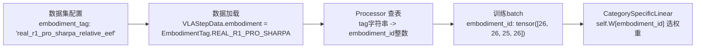
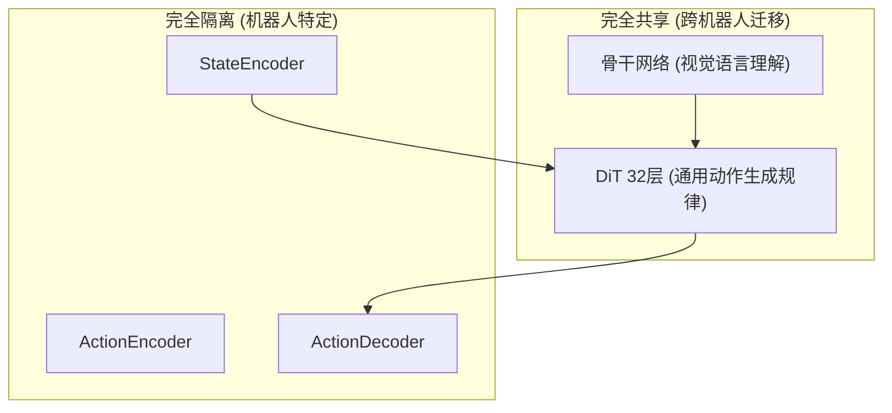

# 多具身体混合训练：EmbodimentTag 体系

> EmbodimentTag、embodiment_id、projector_index——这几个容易混淆的概念分别是什么？它们如何串联起数据、模型和多机器人支持？

## 相关阅读

- [图像增强与数据变换](./21_图像增强与数据变换)（上一章）
- [推理去噪过程](./23_推理去噪过程_Euler积分)（下一章）
- [CategorySpecificMLP](./16_CategorySpecificMLP_多具身体条件化)

---

## 前情提要

前面章节我们分别看过 `CategorySpecificLinear`（Ch16）如何用 `embodiment_id`
选择权重，以及数据管线（Ch20）如何按 `embodiment_tag` 组织不同机器人的数据集。
本章把这些概念串起来，理解GR00T多具身体体系的完整设计。

---

## 1. 三个容易混淆的概念

GR00T中和"机器人身份"相关的概念有三个，容易搞混，我们先把它们的关系理清楚。

| 概念 | 类型 | 作用范围 | 例子 |
|------|------|---------|------|
| `EmbodimentTag` | 字符串枚举 | 数据集配置、人类可读标识 | `"real_r1_pro_sharpa_relative_eef"` |
| `embodiment_id` | 整数 | 模型内部，选择CategorySpecificLinear的权重组 | `26` |
| `projector_index` | 整数 | 和embodiment_id本质是同一个东西的另一个名字 | `26` |

**关系**：`EmbodimentTag`（字符串，人读）通过一张映射表转换成整数
`embodiment_id`（模型内部用）。之所以要转换，是因为神经网络的权重索引
只能用整数（张量索引不支持字符串），但配置文件和人类交流时用有语义的字符串
更方便理解。

---

## 2. EmbodimentTag：面向人类的机器人标识

### 2.1 定义方式

```python
class EmbodimentTag(Enum):
    OXE_DROID_RELATIVE_EEF_RELATIVE_JOINT = "oxe_droid_relative_eef_relative_joint"
    REAL_G1_RELATIVE_EEF_RELATIVE_JOINTS = "real_g1_relative_eef_relative_joints"
    REAL_R1_PRO_SHARPA_RELATIVE_EEF = "real_r1_pro_sharpa_relative_eef"
    UNITREE_G1_FULL_BODY = "unitree_g1_full_body_with_waist_height_nav_cmd"
    NEW_EMBODIMENT = "new_embodiment"  # 留给用户微调自定义机器人用
    # ... 共约15个预注册的tag
```

每个tag对应一个具体的"机器人+动作表示方式"组合。比如
`REAL_R1_PRO_SHARPA_RELATIVE_EEF` 表示"真实的R1 Pro Sharpa机器人，
使用相对末端执行器(EEF)的动作表示方式"。

### 2.2 为什么命名要包含"relative_eef"这样的后缀?

同一个物理机器人，可能有多种不同的动作表示方式（绝对位置vs相对位移，
关节角vs末端执行器坐标）。不同的表示方式对模型来说是**不同的学习任务**——
即使物理硬件相同，`EmbodimentTag`也要区分开,因为它们对应不同的归一化统计量、
不同的动作语义。这就是为什么会看到同一个机器人名字（如R1_PRO_SHARPA）
出现多个不同后缀的tag（`_human`, `_maxinsights`, `_mecka`等，可能对应
不同数据采集批次或轻微变体）。

---

## 3. embodiment_id：模型内部的整数索引

### 3.1 映射表

字符串到整数的映射存储在一个字典中（`EMBODIMENT_TAG_TO_PROJECTOR_INDEX`）：

```python
EMBODIMENT_TAG_TO_PROJECTOR_INDEX = {
    # 预训练阶段就存在的具身体 (基础模型自带)
    "oxe_droid_relative_eef_relative_joint": 24,
    "real_g1_relative_eef_relative_joints": 25,
    "real_r1_pro_sharpa_relative_eef": 26,
    "real_r1_pro_sharpa_relative_eef_human": 26,   # 注意:复用同一个ID
    "real_r1_pro_sharpa_relative_eef_maxinsights": 26,  # 复用同一个ID
    
    # 后训练/微调阶段的具身体
    "unitree_g1_full_body_with_waist_height_nav_cmd": 25,  # 也复用了25!
    "libero_sim": 2,
    "new_embodiment": 9,
    "robotwin2_relative_eef_relative_joint": 10,
    # ... 共约16个映射项
}
```

### 3.2 为什么有些tag共享同一个embodiment_id?

注意到 `real_r1_pro_sharpa_relative_eef` 及其几个变体（`_human`, `_maxinsights`,
`_mecka`）都映射到同一个ID `26`。这是因为这些变体虽然EmbodimentTag字符串不同
（可能代表不同的数据采集来源或场次），但本质上是**同一个物理机器人配置**——
动作维度、关节定义完全一致，所以可以共享同一组 `CategorySpecificLinear` 权重。

这样设计的好处：不同采集批次的数据可以在训练时被视为"同一个embodiment"，
共享同一组编解码权重，从而互相促进学习（而不是被割裂成互不相关的独立任务）。

### 3.3 为什么会看到id重复使用(如25被两个不同机器人用)?

仔细看会发现 `real_g1_relative_eef_relative_joints`(G1真实机器人)和
`unitree_g1_full_body_with_waist_height_nav_cmd`(似乎是另一种G1配置)
都用了ID 25。这种情况通常出现在：一个是**预训练阶段**注册的tag，
另一个是**后训练/微调阶段**注册的tag，两者在设计时刻意复用了同一个embodiment_id——
可能是因为后训练场景实际上是想"继承"预训练时那组G1权重的知识，
在其基础上继续微调，而不是从零学一组新权重。

---

## 4. 完整的映射链路

从原始数据到模型内部使用，`embodiment_id` 经历了这样的传递路径：



在 `Gr00tN1d7Processor.__init__` 中可以看到这个映射表是如何被初始化和补全的：

```python
self.embodiment_id_mapping = embodiment_id_mapping or EMBODIMENT_TAG_TO_PROJECTOR_INDEX
# 确保预训练阶段的映射也被包含进来（即使用户传入了自定义映射表）
for k, v in EMBODIMENT_TAG_TO_PROJECTOR_INDEX.items():
    if k not in self.embodiment_id_mapping:
        self.embodiment_id_mapping[k] = v
```

这段逻辑保证了：即使用户在微调时提供了自己的映射表（可能只包含新机器人的映射），
基础模型自带的预训练映射关系也不会丢失——两者做合并而不是替换。

---

## 5. 微调新机器人时如何分配embodiment_id?

### 5.1 复用 vs 新分配

微调一个全新的机器人时，有两种策略：

**策略A：使用预留的 `new_embodiment` (ID=9)**

```python
config.data.datasets[0].embodiment_tag = "new_embodiment"  # 映射到ID 9
```

如果ID 9这组权重之前没有被大量训练过（或者你不在乎覆盖掉它），可以直接用。
这是最简单的方式，适合快速实验。

**策略B：注册一个全新的tag和ID**

修改 `EMBODIMENT_TAG_TO_PROJECTOR_INDEX`，加入一个新的映射：
```python
EMBODIMENT_TAG_TO_PROJECTOR_INDEX["my_new_robot"] = 28  # 选一个未被占用的ID
```

这样你的机器人会获得一组**全新初始化**的权重（因为ID 28之前从未被训练过），
不会和其他机器人的权重产生任何耦合。适合正式的、长期维护的新机器人集成。

### 5.2 ID不能超过max_num_embodiments

回顾第5章的配置——`max_num_embodiments=32`决定了 `CategorySpecificLinear`
中权重张量的第一维大小。如果分配的新ID超过31（0-indexed），会直接导致
张量索引越界报错。这是使用自定义ID时必须注意的边界。

---

## 6. 混合训练中不同具身体的信息隔离与共享

### 6.1 完全隔离的部分

回顾Ch16，`StateEncoder`、`ActionEncoder`、`ActionDecoder`都是
`CategorySpecificMLP`，每个embodiment用独立权重——这部分是**完全隔离**的，
不同机器人之间不会互相干扰。

### 6.2 完全共享的部分

骨干网络（Qwen3Backbone）和DiT的32层是**完全共享**的——所有机器人的样本
都经过同一套骨干和同一套DiT权重。这部分的知识（视觉理解、动作生成的通用规律）
是跨机器人共享和迁移的。

### 6.3 这种"部分隔离、部分共享"的设计价值



这个设计的价值在于：**"如何理解场景"和"如何规划动作轨迹"这些高层能力**
是跨机器人通用的（一个学会看懂"红色方块在左边"的模型，不需要为每种机器人
重新学一遍视觉理解），但**"每个物理量具体是什么、取值范围是多少"**
这些底层的、机器人特定的细节，必须用独立的编解码器来处理。

---

## 7. 总结

多具身体训练的完整体系：

1. **EmbodimentTag**：人类可读的字符串标识，可能多个tag共享同一个物理机器人配置
2. **embodiment_id**：模型内部的整数索引，通过映射表从tag转换而来
3. **信息流**：数据配置(tag) → 数据加载 → Processor查表 → batch中的整数 → 模型选权重
4. **隔离与共享并存**：编解码器完全隔离（各machine独立权重），骨干和DiT完全共享（通用能力）
5. **微调新机器人**：可复用预留ID快速实验，或注册全新ID做正式集成

---

## 下一章预告

下一章我们转向推理阶段——完整走读Flow Matching的4步Euler积分过程，
理解从纯噪声到最终精确动作轨迹的每一步具体计算。
