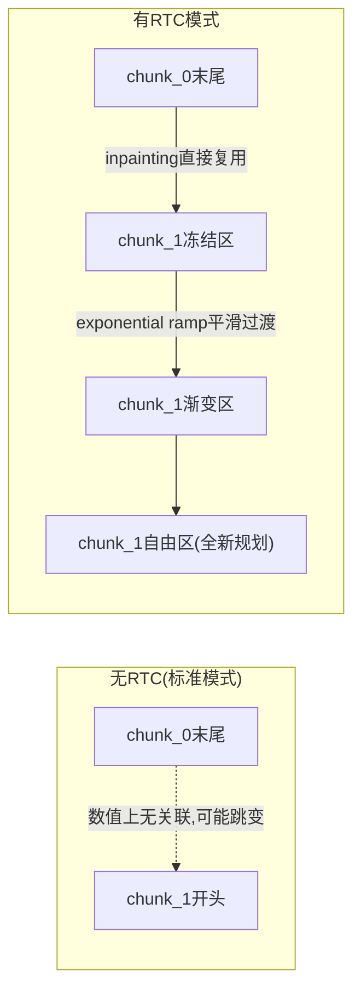

# RTC 实时控制：动作块重叠与渐进式去噪

> 标准的action chunk推理在连续控制中会有跳变问题。本章拆解GR00T的RTC机制如何通过inpainting和exponential ramp解决这个问题。

## 相关阅读

- [推理去噪过程](./23_推理去噪过程_Euler积分)（上一章）
- [后训练实战](./25_后训练实战_微调全流程)（下一章）
- [从 N1.5 到 N1.7 架构升级](./03_从N1d5到N1d7_架构升级)

---

## 前情提要

上一章我们看了标准的4步Euler积分推理流程——每次都从纯噪声出发生成一整个
40步的action chunk。本章要解决一个实际部署中的问题：**连续控制时，
相邻两次推理生成的action chunk之间会不会衔接不上？**

---

## 1. 问题：标准action chunking的衔接问题

### 1.1 场景描述

假设机器人以固定频率执行动作，每次推理生成40步的动作块，但机器人可能只执行
其中的前K步（比如K=10），就要开始下一轮推理（因为需要根据最新的观测重新规划）。

```
时刻0: 推理生成 chunk_0 = [a0, a1, ..., a39]，执行 a0~a9
时刻10: 推理生成 chunk_1 = [a0', a1', ..., a39']（全新的、独立的推理），执行 a0'~a9'
```

问题在于：`chunk_1`是**从纯噪声重新生成的**，和`chunk_0`之间没有任何数值上的
关联。如果两次推理的结果存在细微差异（哪怕场景几乎没变），机器人执行时可能
在`a9`到`a0'`之间出现**不连续的跳变**——比如速度突然变化，导致抖动。

### 1.2 推理延迟带来的额外问题

真实场景中，模型推理本身需要时间（比如100ms）。这意味着当`chunk_1`真正
生成完毕、可以执行时，机器人可能已经又往前移动了一段时间——`chunk_1`
一开始的那几步实际上已经"过时"了,因为它是基于100ms之前的观测生成的。

---

## 2. RTC的核心思路

GR00T的解法（Real-Time Control，简称RTC）从两方面同时下手：

1. **让新一轮推理"知道"上一轮的结果**——不再从纯噪声开始，而是用上一轮预测的
   尾部动作作为**部分初始化**（这个技术叫inpainting，图像修复领域的常见手法，
   这里借用到动作序列上）
2. **让刚开始的几步"冻结"不变**——因为这几步对应的时间点机器人可能已经执行完毕
   或即将执行，不应该再被重新规划打乱；同时用渐变的方式过渡到"完全自由去噪"的部分，
   避免生硬的分界线

---

## 3. 三个关键参数

RTC引入三个配置参数，理解它们的具体含义是理解整个机制的关键：

| 参数 | 含义 |
|------|------|
| `rtc_overlap_steps` | 新旧两个action chunk之间"重叠"的步数——这部分会用上一轮的结果做初始化 |
| `rtc_frozen_steps` | overlap区域中,完全"冻结"不再更新的步数（通常对应推理延迟期间已经执行完的部分） |
| `rtc_ramp_rate` | 控制"冻结区"到"完全自由去噪区"之间过渡的陡峭程度 |

三者的关系满足 `rtc_frozen_steps <= rtc_overlap_steps`——冻结区是重叠区的一个
子集（更靠前的部分）。

### 3.1 三段区域的直觉理解

把一个40步的action chunk按`vel_strength`的值分成三段：

```
位置:     0 ... frozen_steps ... overlap_steps ... 40
强度:     0 ... 0            ... 渐变0→1        ... 1 (完全自由)
含义:  已确定,别动  ← ramp渐变过渡区 →   全新规划区
```

- **冻结区** `[0, frozen_steps)`：这部分动作已经在上一轮"定型"了（可能已经执行或即将执行），
  强行保持不变（`vel_strength=0`意味着Euler更新时`dt*v*0=0`，不产生任何变化）
- **渐变区** `[frozen_steps, overlap_steps)`：从"完全不变"渐进过渡到"完全自由"，
  避免生硬的分界线导致的动作突变
- **自由区** `[overlap_steps, 40)`：全新规划的部分，正常参与Flow Matching去噪，
  不受上一轮结果的任何约束

---

## 4. 完整实现逐步走读

### 4.1 用上一轮结果做初始化（Inpainting）

```python
if "action" in action_input:
    assert options is not None and "action_horizon" in options
    assert "rtc_overlap_steps" in options and "rtc_frozen_steps" in options
    
    action_horizon_before_padding = options["action_horizon"]
    
    # 用上一轮预测的尾部,替换掉这一轮初始噪声的头部
    actions[:, :options["rtc_overlap_steps"], :] = action_input["action"][
        :,
        action_horizon_before_padding - options["rtc_overlap_steps"]:action_horizon_before_padding,
        :,
    ]
```

这里的关键操作是：`actions`原本是一整段随机噪声（第23章讲过的初始化），
这行代码用**上一轮预测结果的最后`rtc_overlap_steps`步**去覆盖这一轮初始噪声的
**前`rtc_overlap_steps`步**。

为什么是"上一轮的尾部"覆盖"这一轮的头部"？因为两轮推理之间存在**时间上的重叠**——
上一轮预测的是"从上一轮观测时刻开始的40步"，这一轮要预测的是"从这一轮观测时刻
（比某个更晚的时间点）开始的40步"。上一轮预测中,比这一轮起点更晚的那部分
（也就是上一轮的尾部）,和这一轮要预测的头部,描述的是**同一段时间区间**——
所以直接复用是合理的。

### 4.2 设置冻结强度

```python
vel_strength = torch.ones_like(actions)  # 默认全1(完全自由,第23章讲过)
vel_strength[:, :options["rtc_frozen_steps"], :] = 0.0  # 冻结区置0
```

`vel_strength`最开始（标准推理模式）全是1，这里把最前面`rtc_frozen_steps`步
的强度改成0——这些位置无论DiT预测出什么速度，乘以0之后都不会真正改变`actions`
的值,相当于"锁死"了这些步骤,保持inpainting时设置的初始值不变。

### 4.3 计算渐变区的exponential ramp

```python
intermediate_steps = options["rtc_overlap_steps"] - options["rtc_frozen_steps"]

# 生成一个从0平滑过渡到1的指数曲线
t = torch.linspace(0.0, 1.0, intermediate_steps + 2, device=device)
ramp = 1 - torch.exp(-options["rtc_ramp_rate"] * t)
ramp = ramp / ramp[-1].clamp_min(1e-8)  # 归一化,确保终点正好是1.0
ramp = ramp[1:-1]  # 去掉首尾的0和1(它们分别属于冻结区末端和自由区起点)

vel_strength[:, options["rtc_frozen_steps"]:options["rtc_overlap_steps"], :] = ramp[None, :, None]
```

**为什么用指数曲线而不是线性渐变？**

指数函数 $1-e^{-kt}$ 的形状特点是：开始时上升较快，后段趋于平缓（"快启动、慢收尾"）。
这个形状让渐变区**前半段就迅速摆脱"完全冻结"的状态**，给模型更多空间去调整,
而在**接近自由区时变化更平缓**,让"渐变区"和"自由区"之间的过渡更柔和。
`rtc_ramp_rate`这个参数直接控制指数曲线的陡峭程度——值越大,上升越快。

### 4.4 具体数值例子

假设 `rtc_frozen_steps=5`, `rtc_overlap_steps=10`, `rtc_ramp_rate=2.0`：

```
intermediate_steps = 10 - 5 = 5
t = linspace(0, 1, 7) = [0, 0.167, 0.333, 0.5, 0.667, 0.833, 1.0]  (7个点)

ramp_raw = 1 - exp(-2.0*t):
  t=0:     1-exp(0)     = 0
  t=0.167: 1-exp(-0.33) = 0.28
  t=0.333: 1-exp(-0.67) = 0.49
  t=0.5:   1-exp(-1.0)  = 0.63
  t=0.667: 1-exp(-1.33) = 0.74
  t=0.833: 1-exp(-1.67) = 0.81
  t=1.0:   1-exp(-2.0)  = 0.86

归一化 (除以最后一个值0.86):
  [0, 0.33, 0.57, 0.73, 0.86, 0.94, 1.0]

去掉首尾, 取中间5个:
  ramp = [0.33, 0.57, 0.73, 0.86, 0.94]

最终vel_strength (位置0-39):
  位置0-4:  0.0 (冻结)
  位置5-9:  [0.33, 0.57, 0.73, 0.86, 0.94] (渐变)
  位置10-39: 1.0 (自由)
```

可以看到渐变区确实呈现"快速上升后趋于平缓"的模式,符合指数曲线的特点。

---

## 5. RTC模式下的完整去噪循环

有了`vel_strength`这个"强度地图"，Euler更新公式变成（回顾第23章）：

```python
actions = actions + dt * pred_velocity * vel_strength
```

冻结区(`vel_strength=0`)始终保持inpainting时设置的初始值,完全不受4步迭代中
任何预测速度的影响。渐变区按比例部分接受模型的修正建议。自由区完全遵循标准
Flow Matching去噪流程。

---

## 6. RTC solves的实际问题



通过这套机制，相邻两次推理产生的动作序列在时间上有重叠、数值上有继承关系，
从"两段互相独立的轨迹硬拼接"变成"一条连续演化的轨迹"。

---

## 7. 总结

RTC机制的三个核心组件：

1. **Inpainting**：用上一轮预测的尾部初始化这一轮预测的头部,建立数值上的连续性
2. **冻结区**：`vel_strength=0`,锁定"已确定不该再改变"的动作步（通常对应推理延迟期间）
3. **Exponential Ramp**：在冻结区和自由区之间用指数曲线平滑过渡,避免生硬的分界

这个机制是GR00T N1.7相比N1.5的一项重要工程改进——让模型从"每次独立生成一段
动作"升级为"能够感知历史、平滑衔接的连续控制"，是实际部署到真实机器人时
提升控制体验的关键设计。

---

## 下一章预告

下一章我们进入最后一部分——完整走通GR00T N1.7的微调实战流程，
从FinetuneConfig的参数配置，到DeepSpeed分布式训练，到最终的checkpoint部署。
