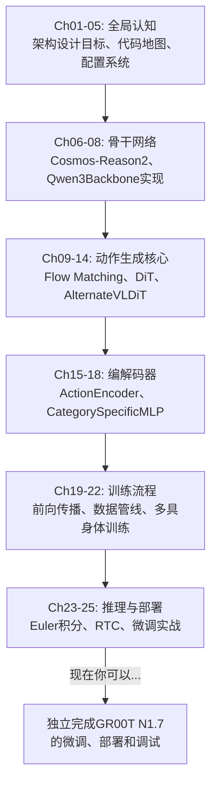

# 后训练实战：微调 GR00T N1.7 全流程

> 从零开始，把前24章的知识串成一次完整的微调实战——数据准备、配置选择、启动训练、监控排错、部署验证。

## 相关阅读

- [RTC实时控制](./24_RTC实时控制_动作块重叠)（上一章）
- [配置系统全参数解读](./05_配置系统_全参数解读)
- [多具身体混合训练](./22_多具身体混合训练)
- [数据管线](./20_数据管线_从轨迹到Batch)

---

## 前情提要

前24章我们从骨干网络到DiT到多具身体设计，把GR00T N1.7的架构原理讲透了。
本章是全系列的收官实战——假设你现在有一台新机器人和一批演示数据，
如何真正跑起来一次微调。

---

## 1. 微调前的准备工作

### 1.1 你需要准备什么

在开始写配置文件之前，先确认手头有这些东西：

1. **演示数据**：一批记录了图像观测+机器人状态+执行动作的轨迹数据
2. **语言标注**：每条轨迹对应的任务描述（哪怕是简单的"pick up the cube"）
3. **基础模型checkpoint**：预训练好的GR00T N1.7权重（通常从HuggingFace下载）
4. **计算资源**：至少1张GPU（显存建议24GB+，用于承载骨干+DiT+优化器状态）

### 1.2 决定你的embodiment_tag

回顾第22章——你需要决定给你的机器人分配哪个 `EmbodimentTag`。
如果只是快速验证效果，直接用预留的 `new_embodiment`；如果是正式的长期项目，
建议注册一个专属的tag和ID（避免和其他实验的权重产生耦合）。

---

## 2. 配置ModalityConfig：告诉模型你的机器人是什么样的

回顾第20章的`ModalityConfig`——这是连接"你的原始数据字段"和"模型输入"的桥梁。
如果你的机器人不在预注册列表中，需要自己写一份配置。

假设你的机器人有：1个外部相机、6个关节角、1个夹爪开合状态，动作是6维关节角速度：

```python
from gr00t.data.types import ModalityConfig, ActionConfig, ActionRepresentation, ActionType, ActionFormat

my_modality_config = {
    "video": ModalityConfig(
        delta_indices=[0],  # 只用当前帧(不需要历史,如果你的任务不需要判断运动趋势)
        modality_keys=["exterior_camera"],
    ),
    "state": ModalityConfig(
        delta_indices=[0],
        modality_keys=["joint_angles", "gripper_state"],  # 6+1=7维
    ),
    "action": ModalityConfig(
        delta_indices=list(range(40)),  # 预测未来40步(和GR00T默认action_horizon一致)
        modality_keys=["joint_velocities"],
        action_configs=[
            ActionConfig(rep=ActionRepresentation.ABSOLUTE, type=ActionType.NON_EEF, format=ActionFormat.DEFAULT),
        ],
    ),
    "language": ModalityConfig(
        delta_indices=[0],
        modality_keys=["task_description"],
    ),
}
```

这份配置需要注册到框架中（回顾第4章提到的`load_modality_config`机制），
微调启动脚本会自动加载。

---

## 3. 三种典型微调方案的选择

回顾第5、7章讨论过的冻结策略，结合数据规模给出实用建议：

| 你的数据规模 | 推荐方案 | 关键配置 |
|------------|---------|---------|
| < 100条轨迹 | 只训练动作头 | `tune_projector=True, tune_diffusion_model=True`, 其余全False |
| 100-1000条轨迹 | 动作头+骨干顶层 | 额外加 `tune_top_llm_layers=4` |
| > 1000条轨迹 | 全参数微调(资源充足时) | `tune_llm=True, tune_visual=True` |

**为什么数据量决定冻结策略？** 回顾第7章的讨论——骨干网络（视觉语言理解）
包含近3B参数,如果只有100条轨迹却打开全部参数微调,极易导致过拟合(模型直接
"记住"这100条轨迹,泛化能力崩溃)。数据量越大,能承载的可训练参数量也越大。

### 3.1 完整的命令行示例

假设你的数据存放在`/data/my_robot`，选择"方案A:只训练动作头"：

```bash
python -m gr00t.experiment.launch_finetune \
    --base-model-path nvidia/GR00T-N1.7-3B \
    --dataset-path /data/my_robot \
    --embodiment-tag new_embodiment \
    --modality-config-path /path/to/my_modality_config.py \
    --tune-projector \
    --tune-diffusion-model \
    --learning-rate 1e-4 \
    --global-batch-size 32 \
    --max-steps 5000 \
    --save-steps 500 \
    --output-dir /output/my_robot_finetune \
    --num-gpus 1
```

回顾第4-5章——这些命令行参数会被`launch_finetune.py`解析成`FinetuneConfig`，
再映射到完整的`Config`对象（含`model`, `data`, `training`三部分）。

---

## 4. 关键超参数选择的实用建议

### 4.1 学习率(learning_rate)

| 微调方案 | 建议学习率 |
|---------|-----------|
| 只训练动作头 | `1e-4`（默认值，动作头是随机初始化的新任务，可以用较大学习率） |
| 训练骨干顶层 | `1e-5`（骨干部分已经预训练过，用小学习率避免破坏已有知识） |
| 全参数微调 | `1e-5`或更小 |

### 4.2 global_batch_size与显存的权衡

回顾第5章——微调默认`global_batch_size=64`。如果显存不够，减小这个值，
但同时应该增大`gradient_accumulation_steps`来保持等效的batch size不变：

```
等效batch_size = global_batch_size = per_gpu_batch_size × num_gpus × gradient_accumulation_steps
```

比如单卡显存只够 `batch_size=8`,想保持等效64,则设置
`gradient_accumulation_steps=8`（8个mini-batch的梯度累积后才更新一次参数）。

### 4.3 max_steps怎么定？

一个经验公式：`max_steps ≈ (数据集轨迹数 × 每条轨迹平均步数) / batch_size × 期望的epoch数`。

对于小数据集（几百条轨迹），通常3-10个epoch足够；数据量大时（几万条），
1-2个epoch可能就够。建议先跑一个较小的`max_steps`（比如1000），
观察loss曲线是否还在下降,再决定要不要延长训练。

---

## 5. 监控训练过程

### 5.1 关注哪些指标？

回顾第19章的loss计算逻辑——训练过程中主要关注 `loss`（action_loss的加权平均）。

正常的训练loss曲线应该是：初期快速下降,然后逐渐平缓,最终趋于稳定的低值
（具体数值取决于任务难度,通常在0.01-0.1量级,这只是经验范围,不是绝对标准）。

### 5.2 常见异常与排查

| 现象 | 可能原因 | 排查方向 |
|------|---------|---------|
| loss一直不下降 | 学习率过小/数据有问题 | 检查数据归一化是否正确（回顾第20章的min-max归一化），尝试增大学习率 |
| loss突然爆炸(NaN) | 学习率过大/梯度爆炸 | 检查`max_grad_norm`设置（回顾第5章，默认1.0），降低学习率 |
| loss下降但推理效果差 | 过拟合 | 减少`max_steps`,或增大数据量,或加强图像增强(回顾第21章) |
| 某个embodiment表现差 | mix_ratio配置不当 | 回顾第20章的采样权重计算，检查该机器人是否被采样得太少 |

### 5.3 用W&B或TensorBoard可视化

回顾第5章的配置——设置 `use_wandb=True` 或 `use_tensorboard=True`
可以实时可视化loss曲线，比盯着终端日志更直观。

```bash
--use-wandb \
--wandb-project my-robot-finetune
```

---

## 6. DeepSpeed分布式配置（多GPU场景）

### 6.1 何时需要DeepSpeed

单卡显存充足时（比如A100 80GB跑单机器人微调），可以不使用DeepSpeed直接训练。
但如果要用多GPU加速，或者单卡显存吃紧，DeepSpeed ZeRO是标准方案。

回顾第5章——`deepspeed_stage=2`（默认）在梯度和优化器状态层面做分片，
是大多数场景的合理选择；只有单卡显存严重不足（模型本身放不下）时才需要
升级到`deepspeed_stage=3`（连参数本身也分片，但会增加通信开销）。

### 6.2 多卡启动示例

```bash
--num-gpus 4 \
# 框架会自动应用对应的DeepSpeed配置(zero2_config.json或zero3_config.json)
```

---

## 7. 训练完成后：Checkpoint里有什么

训练完成（或者到达`save_steps`的中间checkpoint）后，输出目录会包含：

```
output_dir/
├── final_model_config.json       # 完整的模型配置(回顾第5章)
├── final_processor_config.json   # Processor配置(归一化参数等)
├── dataset_statistics.json       # 数据集统计量(回顾第20章的min/max/mean/std)
├── checkpoint-1000/               # 第1000步的checkpoint
│   ├── model.safetensors
│   ├── optimizer.pt              # (如果save_only_model=False)
│   └── ...
└── checkpoint-5000/                # 最终checkpoint
```

`dataset_statistics.json` 特别重要——它保存了训练数据的归一化统计量
（回顾第20章的min-max归一化公式）。推理时必须用**同一份**统计量做归一化
和反归一化，否则模型的输出会完全错乱。

---

## 8. 部署验证：推理测试

### 8.1 用Gr00tPolicy加载checkpoint

回顾第4章提到的推理接口——用训练好的checkpoint做一次简单的推理测试：

```python
from gr00t.policy.gr00t_policy import Gr00tPolicy

policy = Gr00tPolicy(
    embodiment_tag="new_embodiment",
    model_path="/output/my_robot_finetune/checkpoint-5000",
    device="cuda:0",
)

# 构造一个模拟观测(实际使用时替换为真实的相机图像和状态读数)
observation = {
    "video.exterior_camera": some_image_array,
    "state.joint_angles": current_joint_angles,
    "state.gripper_state": current_gripper_state,
    "annotation.language.task_description": "pick up the red cube",
}

action = policy.get_action(observation)
print(action)  # 应该输出反归一化后的、物理尺度的动作值
```

### 8.2 开环评估：先在离线数据上验证

在真机上直接测试风险较高（可能撞坏东西）。更安全的做法是先做开环评估——
回顾第4章提到的`open_loop_eval.py`，用一条真实的演示轨迹的初始状态，
让模型预测动作，和真实执行的动作做对比（计算MSE），初步判断模型是否学到了
合理的行为，再考虑上真机测试。

### 8.3 真机测试注意事项

- **先在低速/受限空间测试**：避免微调后的模型出现意外行为造成安全问题
- **准备紧急停止方案**：任何真机部署都应该有物理急停开关
- **逐步扩大测试范围**：先测试单一简单任务，确认稳定后再扩展到复杂场景

---

## 9. 全系列回顾：从原理到实战的完整链路

至此，25章的内容构成了一条完整的知识链路：



从"为什么需要一个通用机器人模型"的顶层设计问题，到"`torch.bmm`是怎么实现
多具身体权重选择"的具体代码细节，再到"学习率该设多少"的实战经验——
这条链路希望能让你在面对GR00T N1.7这样一个复杂系统时，既能理解"为什么这样设计"，
也能动手"改到能跑通"。

---

## 10. 延伸阅读

如果你想继续深入，以下方向值得探索：

- **对比阅读**：[OpenPI深度解析](/系列/openpi_deep_dive/)——理解π₀系列模型的
  设计选择，和GR00T做横向对比，加深对VLA架构设计空间的理解
- **强化学习后训练**：[RLinf深度解析](/系列/rlinf_deep_dive/)——本系列讲的是
  监督式的行为克隆微调，如果想进一步用RL微调VLA策略，RLinf是相关的基础设施
- **动手实践**：找一个仿真环境（如LIBERO）,用本系列讲的流程走一遍完整的微调,
  比单纯阅读更能巩固理解

感谢你完整读完这个系列。GR00T N1.7是一个工程细节非常丰富的系统,
希望这25章的拆解能让你在面对类似的复杂VLA系统时,具备"能看懂代码、
能理解设计动机、能动手调参"的完整能力。
