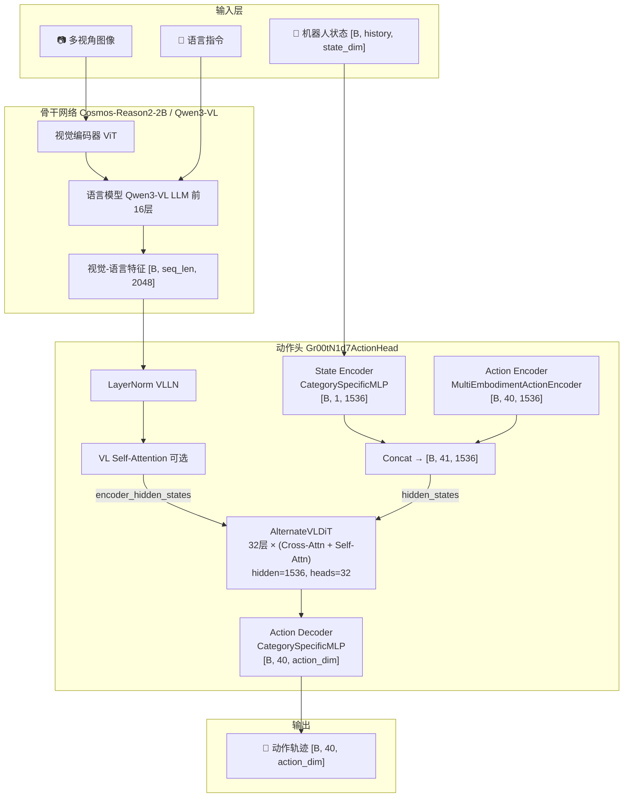

# GR00T N1.7 深度解析：从 VLA 原理到机器人后训练实战

> 从"什么是 VLA"到"如何在自己的机器人上微调 GR00T N1.7"，完整拆解 NVIDIA 具身智能基础模型的架构设计、训练方法与工程实现。

## 系列简介

GR00T N1.7 是 NVIDIA 推出的第二代具身智能基础模型（VLA），内部代号 `Gr00tN1d7`。相比前代 N1.5（基于 Eagle 视觉语言模型），N1.7 做了一次大幅升级：

- **骨干网络换代**：从 Eagle-Block2A-2B-v2 换成 Cosmos-Reason2-2B（基于 Qwen3-VL 架构），具备更强的视觉推理能力
- **动作生成升级**：引入 AlternateVLDiT——一种交替处理图像/文本 token 的 Diffusion Transformer，替代原始 DiT
- **多具身体支持**：通过 CategorySpecificMLP 实现一个模型同时驾驭不同形态的机器人（机械臂、人形机器人、移动底盘）
- **实时控制能力**：内置 RTC（Real-Time Control）推理模式，支持动作块拼接与渐进式去噪
- **后训练范式**：提供完整的 Fine-tune 工具链，只需少量数据即可适配新机器人

这个系列将从最基本的 VLA 概念出发，逐步深入到 GR00T N1.7 的每一个核心组件，最终让你具备独立微调并部署模型的能力。我们不跳步、不省略，每个公式都会拆碎了讲。

**适合读者**：
- 有基本线代和概率论知识的本科生/研究生
- 想理解"VLM + 扩散模型 = 机器人控制"这条技术路线的研究者
- 想在自己的机器人上部署 GR00T 但不知道它内部在做什么的工程师
- 对 NVIDIA 具身智能技术栈感兴趣的从业者

**你将获得**：
- 对 VLA 模型"视觉 → 语言 → 动作"完整管线的深入理解
- 对 Flow Matching 扩散策略在机器人控制中应用的清晰认知
- 对 GR00T N1.7 每一个模块（骨干、DiT、编解码器）的代码级理解
- 对多具身体训练和 Embodiment-Conditioned 设计的全面认知
- 独立完成 GR00T N1.7 微调与部署的实操能力

## 章节目录

| 章节 | 标题 | 简介 |
|------|------|------|
| **第一部分：全局认知** | | |
| 01 | [全景图：GR00T N1.7 在解决什么问题？](./01_全景图_GR00T_N1d7在解决什么问题) | 从"一个模型控制所有机器人"出发，理解设计目标与技术路线 |
| 02 | [VLA 范式回顾：视觉-语言-动作模型演进史](./02_VLA范式回顾) | RT-2 → Octo → π₀ → GR00T 的技术脉络 |
| 03 | [从 N1.5 到 N1.7：一次关键的架构升级](./03_从N1d5到N1d7_架构升级) | 完整对比两代模型，理解每一项改动的动机 |
| 04 | [代码地图：仓库结构与模块职责](./04_代码地图_仓库结构与模块职责) | 代码怎么组织、调用链是什么、从哪里开始读 |
| 05 | [配置系统：Gr00tN1d7Config 全参数解读](./05_配置系统_全参数解读) | 每一个超参的含义、默认值选择的工程考量 |
| **第二部分：骨干网络** | | |
| 06 | [Cosmos-Reason2-2B：为什么选 Qwen3-VL 架构](./06_Cosmos_Reason2_为什么选Qwen3VL) | 架构优势、与 Eagle 的对比、选型决策 |
| 07 | [Qwen3Backbone 实现详解：从图像到特征](./07_Qwen3Backbone实现详解) | 模型加载、层截断、冻结策略、forward 逐行走读 |
| 08 | [Eagle vs Qwen3：两代骨干的工程差异](./08_Eagle_vs_Qwen3_两代骨干工程差异) | 输入格式、token 结构、attention mask 处理的具体区别 |
| **第三部分：动作生成核心** | | |
| 09 | [Flow Matching 数学基础：从 ODE 到速度场](./09_Flow_Matching数学基础) | 连续归一化流、直线插值、速度场回归——动作生成的数学原理 |
| 10 | [噪声调度：Beta 分布采样与时间步离散化](./10_噪声调度_Beta分布与时间步离散化) | 为什么用 Beta(1.5,1.0) 而非均匀采样？num_timestep_buckets 的作用 |
| 11 | [DiT 架构逐层拆解：TimestepEncoder → AdaLayerNorm → CrossAttention](./11_DiT架构逐层拆解) | 标准 DiT 的完整实现：每一层的输入输出形状和数据流 |
| 12 | [AlternateVLDiT：交替注意力的设计哲学](./12_AlternateVLDiT_交替注意力设计) | 为什么交替处理图像和文本？image_mask 如何工作？attend_text_every_n_blocks |
| 13 | [Self-Attention 交叉层：interleave_self_attention 机制](./13_SelfAttention交叉层_interleave机制) | 奇偶层交替的 self-attn + cross-attn 设计及其对信息流的影响 |
| 14 | [DiT 输出层：AdaLN-Zero 调制与线性投影](./14_DiT输出层_AdaLN_Zero调制) | conditioning → shift/scale → proj_out 的最终预测生成 |
| **第四部分：编解码器与多具身体** | | |
| 15 | [ActionEncoder：动作轨迹 + 时间步的联合编码](./15_ActionEncoder_动作轨迹时间步联合编码) | SinusoidalPositionalEncoding + Swish + W1/W2/W3 三层变换 |
| 16 | [CategorySpecificMLP：多具身体条件化线性层](./16_CategorySpecificMLP_多具身体条件化) | 每个 embodiment 独立的 W/b 矩阵、BMM 实现与维度扩展机制 |
| 17 | [StateEncoder 与 ActionDecoder：输入输出映射](./17_StateEncoder与ActionDecoder) | state_history 展平、dropout 机制、解码器切片策略 |
| 18 | [VLLN 与 VL Self-Attention：骨干特征后处理](./18_VLLN与VL_SelfAttention) | LayerNorm 到 SelfAttentionTransformer 的可选精炼层 |
| **第五部分：训练流程** | | |
| 19 | [训练前向传播完整走读：从观测到 Loss](./19_训练前向传播完整走读) | 一个 batch 从输入到损失计算的每一步，附带张量形状变化 |
| 20 | [数据管线：从原始轨迹到训练 Batch](./20_数据管线_从轨迹到Batch) | VLAStepData → ShardedDataset → Processor → Collator 全链路 |
| 21 | [图像增强与数据变换：Albumentations 策略](./21_图像增强与数据变换) | 裁剪、缩放、旋转、ColorJitter、mask-based 变换的工程实现 |
| 22 | [多具身体混合训练：EmbodimentTag 体系](./22_多具身体混合训练) | tag 映射、mix_ratio 采样、projector_index 与 action_mask |
| **第六部分：推理与部署** | | |
| 23 | [推理去噪过程：Euler 积分从噪声到动作](./23_推理去噪过程_Euler积分) | num_inference_timesteps=4 的设计、逐步去噪的数据流 |
| 24 | [RTC 实时控制：动作块重叠与渐进式去噪](./24_RTC实时控制_动作块重叠) | rtc_overlap_steps、frozen_steps、exponential ramp 完整机制 |
| 25 | [后训练实战：微调 GR00T N1.7 全流程](./25_后训练实战_微调全流程) | FinetuneConfig、DeepSpeed ZeRO-2、超参选择与最佳实践 |

## 核心架构图

## GR00T N1.5 → N1.7 关键变化对照表

| 维度 | GR00T N1.5 (旧) | GR00T N1.7 (新) | 为什么改 |
|------|-----------------|-----------------|----------|
| 骨干网络 | Eagle-Block2A-2B-v2 | Cosmos-Reason2-2B (Qwen3-VL) | 更强的视觉推理+原生多图支持 |
| 骨干隐层维度 | (Eagle hidden) | 2048 | Qwen3-VL 原生维度 |
| VLM 处理器 | 自定义 Eagle Processor | Qwen3VLProcessor (left padding) | 动态分辨率+更好的多图处理 |
| 图像输入 | pixel_values | pixel_values + image_grid_thw | 支持动态分辨率网格 |
| 注意力实现 | Flash Attention 2 (必须) | SDPA / Flash Attention 2 (可选+Spark兼容) | 兼容更多硬件 |
| 层截断路径 | `language_model.model.layers` | `language_model.layers` | Qwen3-VL 结构差异 |
| DiT 变体 | 标准 DiT (全 Cross-Attn) | AlternateVLDiT (交替 image/text Cross-Attn) | 更精细的多模态信息利用 |
| 交叉注意力 | 每层 attend 所有 VL tokens | 奇数层 attend 图像、偶数层 attend 文本 | 防止长序列信息淹没 |
| Self-Attention 交叉 | 可选 | 默认开启 interleave_self_attention | 增强 state-action 内部推理 |
| 推理控制 | 标准 action chunk | RTC (exponential ramp + inpainting) | 低延迟连续控制 |
| 噪声调度 | (未知) | Beta(1.5, 1.0) + noise_s=0.999 | 偏向高噪声区间训练 |
| 训练框架 | HuggingFace Trainer | Gr00tTrainer + 异步 prefetch + profiling | 训练吞吐量提升 |
| action_dim | 固定 | 132 (统一最大维度 + mask) | 多具身体统一接口 |
| 位置编码 | 可选 sinusoidal | 可学习 Embedding + 可选 | 更灵活的序列建模 |

## 前置知识要求

阅读本系列前建议了解（系列中遇到时会链接到对应文章）：
- 线性代数基础：矩阵乘法、向量空间、投影
- 概率论基础：条件概率、高斯分布、贝叶斯公式
- 深度学习入门：前向传播、反向传播、Transformer 基本结构
- [扩散模型 DDPM](/前置知识/000b_前置知识_扩散模型DDPM)（第 9 章需要）
- [Flow Matching 与连续归一化流](/前置知识/000g_前置知识_Flow_Matching与连续归一化流)（第 9 章需要）
- [Cross-Attention 与交替注意力机制](/前置知识/001e_前置知识_Cross_Attention与交替注意力机制)（第 11-13 章需要）
- [AdaLayerNorm 条件化归一化](/前置知识/001f_前置知识_AdaLayerNorm条件化归一化)（第 11 章需要）
- [VLM 层截断](/前置知识/001d_前置知识_VLM层截断_只用大模型的前N层)（第 6-8 章需要）
- [Causal Attention 因果注意力掩码](/前置知识/001g_前置知识_Causal_Attention因果注意力掩码)（第 13 章需要）

## 阅读建议

1. **完全零基础**：按顺序从第 1 章读起，前 5 章建立全局认知
2. **熟悉 VLA 概念**：跳过前 2 章，从第 3 章（N1.5 vs N1.7 对比）开始
3. **想深入某个模块**：直接跳到对应章节，每章开头有前情提要
4. **想理解架构设计**：重点读第三、四部分（Ch09-18）
5. **想做微调**：重点读 Ch20（数据）+ Ch22（多具身体）+ Ch25（微调实战）
6. **想部署推理**：重点读 Ch23-24（推理过程与 RTC）
7. **想对比 π₀ 和 GR00T**：读 Ch02（范式回顾）+ Ch03（架构对比）

## 相关系列

- [OpenPI 深度解析](/系列/openpi_deep_dive/) — π₀ 系列模型的完整拆解，与本系列形成对照阅读
- [RLinf 深度解析](/系列/rlinf_deep_dive/) — GR00T 后训练可使用的强化学习基础设施
