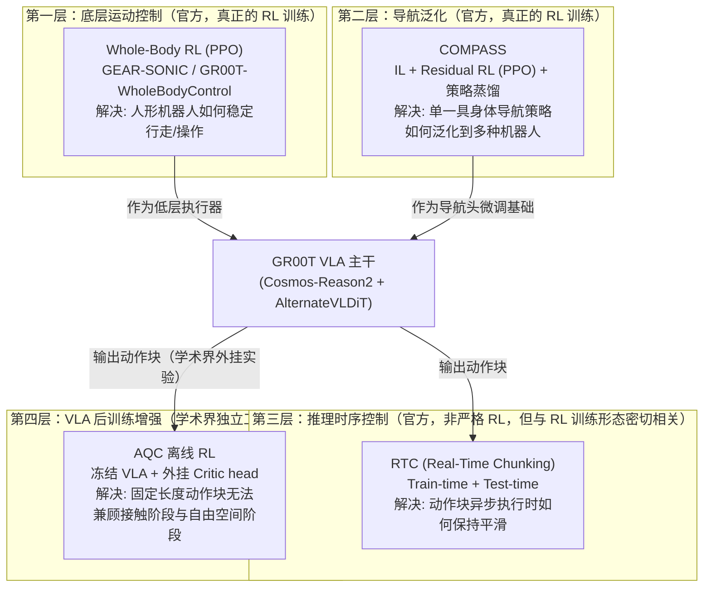
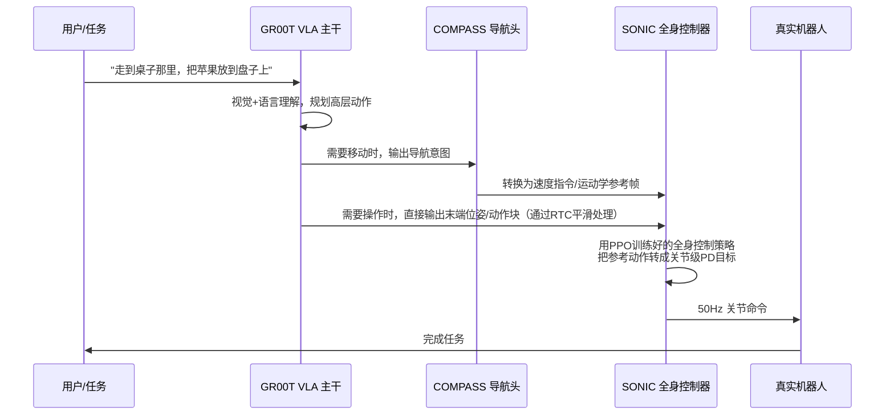
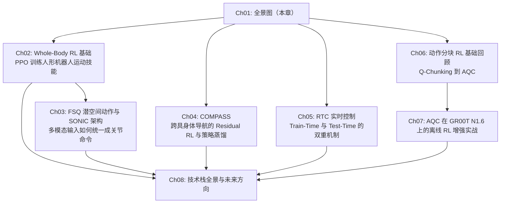

# 全景图：GR00T 生态里的强化学习都用在哪？

> 澄清一个常见误解——GR00T N1.6 并没有"集成 AQC"——然后画出 RL 在整个 GR00T 技术栈里真正发挥作用的四层地图。

## 相关阅读

- [GR00T N1.7 深度解析](/系列/groot_n1d7_deep_dive/) — 理解 GR00T 的 VLA 主干架构（本系列的前置基础，不重复讲）
- [深度强化学习方法综述](/论文综述/S01_深度强化学习方法综述) — PPO、Actor-Critic 等基础算法脉络
- [Q-Chunking：用动作分块加速离线到在线 RL](/论文综述/071_QChunking_RL与动作分块)
- [Adaptive Q-Chunking：让分块长度随状态自适应](/论文综述/072_AdaptiveQChunking_自适应动作分块长度)

---

## 一、一个需要先澄清的误解

如果你在网上搜索"GR00T N1.6 强化学习"，很容易看到类似"GR00T N1.6 集成了 AQC 的 RL 方法"这样的说法。这个说法混淆了两件完全不同的事情，值得先花一节把它讲清楚，否则整个系列的地基就是错的。

**AQC（Adaptive Q-Chunking）是什么**：它是一篇 2026 年的独立学术论文（[arXiv:2605.05544](https://arxiv.org/abs/2605.05544)，Gireesh, Ju, Wang，北大/Galbot/多伦多大学），主题是"怎么让动作分块（action chunking）的长度随状态自动调整"。这篇论文的作者为了证明自己的方法有实用价值，在论文第六节做了一个额外的实验：拿一个**已经训练好、被冻结**的 GR00T N1.6 权重当骨干，在它输出的动作块上面外挂一组自己训练的 Critic 网络，看看能不能让 GR00T 在接触密集的任务上表现更好。

**这意味着什么**：
- GR00T N1.6 的官方发布、官方权重、官方训练流程里，**不包含** AQC 的任何代码或训练目标
- AQC 论文的作者也不是 NVIDIA GEAR 团队的人，这是学术界独立发表的一篇论文
- "用 GR00T N1.6 验证 AQC" 和 "GR00T N1.6 出厂自带 AQC" 是两件完全不同的事——前者是真的，后者不是

打个比方：如果有人写了一篇论文，说"我们用一辆丰田卡罗拉测试了我们发明的新型刹车片，效果不错"，你不会因此认为"丰田卡罗拉出厂就装了这种新刹车片"。AQC 和 GR00T N1.6 的关系正是如此。

那么，**GR00T 真正、官方地用到了 RL 的地方在哪里**？这正是本系列要回答的核心问题。

---

## 二、GR00T 技术栈里 RL 的四个层级

搜集 NVIDIA 官方发布的所有关于 GR00T N1.6 及其相关子系统的文档、论文、博客后，可以整理出 RL 在整个技术栈里实际发挥作用的四个层级。它们互不替代，各自解决完全不同的具体问题：

### 2.1 第一层：Whole-Body RL（GEAR-SONIC / GR00T-WholeBodyControl）

这是 GR00T 技术栈里**分量最重、训练规模最大**的 RL 系统。它解决的问题是：一个 29 自由度的人形机器人（Unitree G1），怎么学会稳定地走、蹲、爬、做各种全身动作？

答案是：用 **PPO** 在 NVIDIA Isaac Lab 仿真环境里训练一个"运动追踪"（motion tracking）策略，让机器人模仿大规模人类动作捕捉数据（700 小时、1 亿帧）。这个训练出来的控制器叫 **SONIC**（Supersizing mOtion tracking for Natural humanoId Control），它是 GR00T N1.5 和 N1.6 里"负责让机器人身体动起来"的那个底层执行器——VLA 主干负责决定"要做什么"，SONIC 负责把这个决定变成"具体每个关节怎么动才不会摔倒"。

这一层的关键特征是：**这是一个纯粹的、经典意义上的深度强化学习系统**——有明确的 MDP 定义、明确的 PPO 训练循环、明确的奖励函数。本系列第 2-3 章会完整拆解这一层。

### 2.2 第二层：COMPASS（跨具身体导航的 Residual RL）

第二层解决的是一个不同的问题：如果我已经在一种机器人（比如轮式机器人 Nova Carter）上训练好了一个导航策略，怎么才能让这套导航能力**泛化**到形态完全不同的机器人（人形机器人 G1、四足机器人 Spot）上，而不需要给每种机器人从零开始训练？

COMPASS 的答案是一个三阶段流程：先用模仿学习（IL）在一种机器人上学一个通用的导航基础模型，然后用 **Residual RL**（也是用 PPO）针对每种新机器人训练一个"修正项"，最后把所有修正后的专家策略**蒸馏**成一个统一的、能处理所有机器人的策略。这一层的 RL 用法和第一层不同——它不是从零训练，而是"在一个已经很好的基础策略上,用强化学习做小幅度的修正"，这种范式叫 **Residual RL**，是本系列第 4 章的重点。

### 2.3 第三层：RTC（Real-Time Chunking）

第三层严格来说不是"强化学习算法"，但它和 RL 训练的关系密切到必须放进这幅地图——因为 NVIDIA 官方在 GR00T N1.6 的技术报告里，明确提到了"train-time RTC"这个概念，也就是说 RTC 不仅是一个推理时（test-time）的技巧，还有一个训练时（train-time）的版本。

RTC 要解决的问题是：VLA 模型每次推理会生成一整段（比如 16 步）的动作块，但模型推理本身需要时间。如果每次都等模型算完再执行下一段，中间会有停顿；如果不等，直接切换到新算出来的动作块，新旧两段动作之间可能存在"不连贯"，导致机器人动作抽搐甚至失控。RTC 通过把"新旧动作块的过渡"重新表述成一个**图像修复（inpainting）**问题来解决这个矛盾。第 5 章会详细展开这个机制，以及它的"训练时版本"具体指什么。

### 2.4 第四层：AQC 离线 RL 增强（学术界外挂实验）

第四层就是本节开头澄清的那个误解的源头——AQC 论文用**冻结**的 GR00T N1.6 权重，在 RoboCasa-GR1 的 24 个桌面操作任务上，外挂了一组 Critic 网络做离线强化学习训练，验证了"能不能让一个原生输出固定长度动作块的大模型，学会在接触阶段自动收紧决策粒度、在自由空间自动放开决策粒度"。第 6-7 章会完整拆解这套方法论以及它具体怎么接到 GR00T N1.6 上。

---

## 三、四层技术的定位对比

在深入每一层的细节之前，先用一张表把四层技术的定位差异说清楚，这样后面读每一章的时候，你随时能把具体细节"放回"这幅整体地图里。

| 维度 | Whole-Body RL (SONIC) | COMPASS | RTC | AQC 离线 RL 增强 |
|------|------------------------|---------|-----|-------------------|
| 官方/非官方 | 官方（NVIDIA GEAR 团队） | 官方（NVIDIA） | 官方（原始 RTC 来自 Physical Intelligence，GR00T 采用并扩展了 train-time 版本） | 非官方（学术界独立论文） |
| 是否严格的 RL | 是（PPO） | 是（Residual PPO） | 不是（推理时的采样/修复算法，但有 train-time 版本涉及训练目标改动） | 是（离线 Actor-Critic RL） |
| 解决的问题 | 人形机器人全身运动控制 | 跨具身体导航泛化 | 动作块切换时的平滑性 | 动作块长度的自适应选择 |
| 作用在 GR00T 技术栈的哪一层 | VLA 之下的低层执行器 | VLA 的导航头/子模块 | VLA 输出动作块之后的推理时处理 | VLA 输出动作块之上外挂的评估器 |
| 是否需要修改/重新训练 VLA 主干 | 不需要（SONIC 独立训练，VLA 只需学会调用它） | 不需要（COMPASS 是导航专用子系统） | 不需要（RTC 是通用的后处理机制） | 不需要（只训练外挂的 Critic head，backbone 冻结） |
| 训练场地 | Isaac Lab 仿真 | Isaac Lab 仿真 | 无需训练（test-time）/ 需要训练（train-time） | RoboCasa-GR1 仿真 + 真实数据混合 |

看这张表可以发现一个共同的设计哲学：**四层技术都尽量避免"改动或重新训练 VLA 主干本身"**。这不是巧合——VLA 主干（Cosmos-Reason2 + AlternateVLDiT）的训练成本极高（GR00T N1.6 预训练用了 300K 步、全局 batch size 16384），任何需要"顺便重新训练主干"的方案在工程上都不现实。所以整个技术栈的设计思路是：**把 RL 的能力都做成外挂式的子系统或后处理模块，分别解决主干之外遗留的具体问题**。

---

## 四、这四层技术之间的实际协作关系

理解了各自的定位后，再看它们在真实的 GR00T 部署流程里是怎么串起来协作的。以 SONIC 论文中"VLA 驱动人形机器人做移动抓取任务"的实验为例（详见第 3 章）：

具体来说：
- **VLA 主干**负责"看懂场景、理解指令、决定下一步做什么"——这是"System 2"（慢速、深思熟虑的推理）
- **SONIC**（Whole-Body RL 训练出来的）负责"具体怎么动才能不摔倒、动作自然"——这是"System 1"（快速、反应式的执行）
- **COMPASS**在需要导航移动时，负责把 VLA 的高层导航意图转换成能被 SONIC 执行的运动学参考
- **RTC** 在 VLA 每次生成新的动作块时，负责让新旧动作块之间的过渡不产生抽搐
- **AQC**（如果按照那篇论文的实验设置）则是在整个系统训练完之后，作为一种离线的、事后的性能增强手段，不影响上面这条实时执行链路

这个协作关系解释了为什么 SONIC 论文的作者会说 SONIC 是"System 1"、VLA 是"System 2"——这个类比直接借用了认知科学里 Daniel Kahneman 提出的双系统理论（快思考 vs 慢思考），用来说明 RL 训练的运动控制器和 VLA 的语言-视觉推理在整个系统里扮演的不同角色。

---

## 五、本系列剩余章节的路线图

第 2-3 章深入第一层（Whole-Body RL），第 4 章深入第二层（COMPASS），第 5 章深入第三层（RTC），第 6-7 章深入第四层（AQC，并且在第 7 章具体拆解它是怎么"接"到 GR00T N1.6 上的两阶段协议）。第 8 章做全景总结，横向比较四层技术的设计选择，并讨论开放问题。

每一章都会自包含地介绍必要的背景，但如果你想更快建立整体感，读完本章后可以按任意顺序跳读感兴趣的层级——只要记住这幅地图，就不会在读到具体细节时迷失方向。

---

## 下一章预告

下一章我们深入第一层——Whole-Body RL。你会看到 NVIDIA 是如何把"人形机器人的运动控制"重新表述成一个**运动追踪（motion tracking）**问题，用 PPO 在仿真中训练出 SONIC 这个控制器的。我们会完整拆解它的 MDP 定义、奖励函数设计，以及为什么"追踪人类动作捕捉数据"是一个比"手工设计每个任务的奖励"更好的训练范式。
