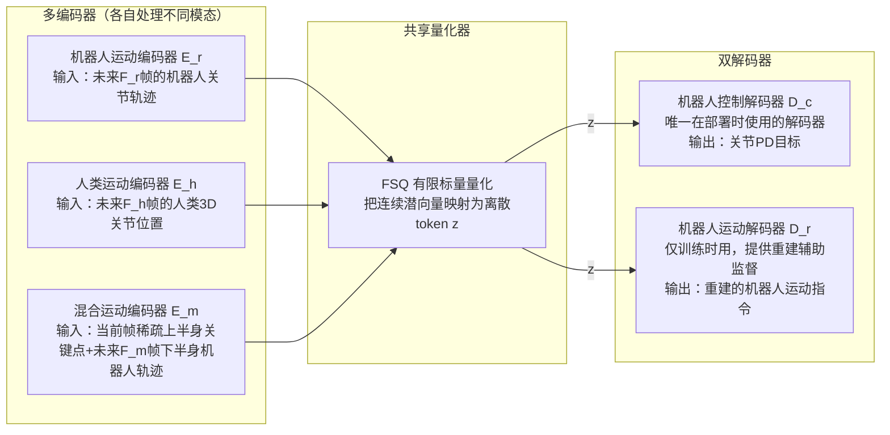

# FSQ 潜空间动作与 SONIC 架构：多模态输入如何统一成关节命令

> 前情提要：第 2 章讲清楚了 SONIC 用 PPO 训练全身运动追踪的 MDP 定义、奖励设计。本章解决上一章留下的悬念——机器人动作、人类动作捕捉、VR 遥操作这三种完全不同形态的输入，是怎么被统一到同一个策略网络里处理的。

## 相关阅读

- [Whole-Body RL 基础：用 PPO 训练人形机器人的运动技能](./02_WholeBodyRL_PPO训练人形机器人运动技能)（本系列第 2 章，本章的直接前置）
- [向量量化与离散表示学习](/前置知识/001q_前置知识_向量量化与离散表示学习) — FSQ 的完整背景，包括 VQ 的码本坍缩问题和 FSQ 怎么绕开它，强烈建议先读

关联文章：
- [RTC 实时控制：Train-Time 与 Test-Time 的双重机制](./05_RTC实时控制_TrainTime与TestTime)（本系列第 5 章，SONIC 的推理端也用到类似的"统一接口"设计思路）

---

## 贯穿本章的例子

> **场景**：延续第 2 章的 G1 人形机器人。现在假设我们希望同一个控制器能同时支持三种完全不同的使用方式：
> 1. **自主导航模式**：VLA 主干直接给出"目标关节轨迹"（机器人动作指令）
> 2. **VR 遥操作模式**：人类戴着 VR 头显，实时给出"头部+双手三个点的目标位置"（人类动作指令的一种稀疏形式）
> 3. **视频驱动模式**：从一段人类跳舞视频里提取出完整的人体关键点序列，让机器人模仿（完整人类动作指令）
>
> 这三种输入的"形状"完全不同——第一种是机器人自己的 29 维关节角，第二种是人类身体的 3D 关键点位置，第三种是同样的关键点但更完整、频率更高。**它们最终都要转化成同一个机器人的关节命令**——这正是本章要拆解的机制。

---

## 一、为什么需要一个"统一 Token 空间"

### 1.1 朴素做法的问题

如果给每一种输入模态都单独训练一个策略网络（一个专门处理机器人轨迹的、一个专门处理人类动作捕捉的、一个专门处理 VR 遥操作的），会遇到两个问题：

1. **三个模型互相学不到对方的经验**：机器人自主导航时学到的"怎么保持平衡"，没办法被 VR 遥操作模式复用，即使两者本质上是同一个身体、同一套动力学
2. **切换模式需要切换整个模型**：如果一个任务中途需要从"自主导航"切换到"VR 遥操作辅助微调"，两个独立模型之间的过渡会有不连续的风险

### 1.2 SONIC 的解法：多编码器 + 共享量化器 + 共享解码器

SONIC 的架构设计核心思想是：**允许输入的"前端"（编码器）不同，但强制所有编码结果汇聚到同一个离散 token 空间，再用同一个"后端"（解码器）统一生成动作**。

这个设计带来一个关键性质：**不管输入来自哪个编码器，只要它们被量化到同一个共享的离散 token 空间里，控制解码器 $\mathcal{D}_c$ 就可以用统一的方式把 token 转化成关节命令**——控制解码器完全不需要知道"这个 token 到底来自机器人指令还是人类动作捕捉"。

---

## 二、FSQ：为什么用有限标量量化，而不是普通的向量量化（VQ）

### 2.1 向量量化（VQ）的基本思路和它的已知问题

在深入 FSQ 之前，先建立一点直觉。"量化"在这里的意思是：把一个连续的高维向量（潜向量），映射到一个从预先定义好的**有限**集合里挑出来的离散值。这样做的好处是离散的 token 更容易在不同模态之间对齐、比较、甚至像语言模型的 token 一样被自回归模型处理。

传统的向量量化（VQ-VAE）做法是维护一个"码本"（codebook）——一堆预先学习出来的向量原型，每次量化时找出和当前潜向量最接近的那个码本向量，用它的编号（一个整数）代表这个位置。这种做法有一个众所周知的训练问题：**码本坍缩**（codebook collapse）——训练过程中，很多码本向量可能从来没有被选中过，变成"死码本"，浪费了表达能力；同时,由于"挑选最近的码本向量"这个操作本身不可导，需要额外的技巧（比如 straight-through estimator 加上专门的码本更新损失）才能让梯度传回编码器,训练动态相对脆弱。

### 2.2 FSQ 的核心思路：独立地量化每一个维度

FSQ（Finite Scalar Quantization，[Mentzer et al. 2023](https://arxiv.org/abs/2309.15505)）用一个更简单直接的思路绕开了这些问题：**不维护任何码本，直接把潜向量的每一个维度，独立地round到一个固定的、有限的离散值集合上**。

**一句话直觉**：把每个维度想象成一个"刻度尺"，只允许潜向量落在刻度尺上标出的几个固定刻度点，四舍五入到最近的刻度就完成了量化——不需要"查表找最近的码本向量"这种全局操作，每个维度独立、局部地完成量化。

具体来说，如果潜向量有 $D_z$ 个维度，每个维度允许 $L_z$ 个量化级别（比如 $L_z=5$，意味着每个维度只能取 5 个固定值中的一个），那么整个潜向量的"表达能力"上限是 $L_z^{D_z}$ 种不同的离散组合——这就是"隐式的码本大小"，但它不需要显式存储和搜索这个码本,因为每个维度是独立量化的。

**为什么这样设计能避免码本坍缩**：因为压根没有一个需要被"学习"和"维护"的码本——量化的目标位置（每个维度的固定刻度）在训练前就已经确定,不会出现"某些码本条目从未被选中"的情况,因为每个维度天然覆盖了它允许的整个离散范围。同时，因为量化操作在每个维度上都只是简单的round操作，配合straight-through梯度技巧，训练过程比 VQ-VAE 明显更稳定。

### 2.3 具体走一遍量化过程

假设潜向量的某个维度在round之前的连续值是 $2.7$，这个维度允许的量化级别是 $\{-2, -1, 0, 1, 2\}$（$L_z=5$）。量化操作是把连续值 $2.7$ round到允许集合里最接近的值——也就是 $2$（因为 $2.7$ 离 $2$ 比离其它候选值都近，且已经超出集合上限,被截断在边界值 $2$）。

如果 $D_z=4$（潜向量总共 4 维），每个维度 5 个级别,那么整个 FSQ token 空间总共有 $5^4=625$ 种不同的离散组合——这个数字就是"通用 Token 空间"的容量上限。

---

## 三、三个编码器：分别处理什么、怎么处理

### 3.1 机器人运动编码器 $\mathcal{E}_r$

输入：未来 $F_r$ 帧的机器人关节位置和速度目标（帧间间隔 $\Delta t_r$）。这是最直接的一种输入——当机器人在做纯粹的自主导航或规划任务时（比如 VLA 主干直接生成一段完整的关节轨迹作为高层指令），这个编码器负责把这段未来轨迹编码进共享潜空间。

### 3.2 人类运动编码器 $\mathcal{E}_h$

输入：未来 $F_h$ 帧的人类 3D 关节位置（帧间间隔 $\Delta t_h$，比机器人编码器的间隔更密，因为人类动作捕捉数据的时间分辨率通常更高）。这个编码器负责处理"人类想让机器人模仿一段动作捕捉序列"的场景——比如视频驱动的模仿、音乐驱动的舞蹈生成等。

### 3.3 混合运动编码器 $\mathcal{E}_m$

输入：**当前帧**的稀疏上半身关键点（头部+双手，来自 VR 遥操作设备）+ 未来 $F_m$ 帧的下半身机器人轨迹（帧间间隔 $\Delta t_m$）。

**为什么这个编码器要混合两种截然不同的信息**：VR 遥操作场景下,用户手持的控制器和头显只能提供三个稀疏的追踪点（头、左手、右手）,而且是"现在这一瞬间"的目标,不是一段未来轨迹——用户希望机器人立刻响应,不能等一整段轨迹规划完才动。但机器人的下半身（腿部）动作,如果完全被动地"跟随上半身",很容易失去平衡——需要一个独立的规划机制（本系列第 5 章会讲到的运动学规划器）来生成下半身的未来轨迹,保证整体的稳定性。混合编码器就是把这两路信息（实时的上半身目标 + 规划出来的下半身轨迹）拼在一起,一并编码进同一个共享空间——这正是"实时遥操作"和"全身平衡控制"这两个需求被同时满足的关键设计。

### 3.4 三个编码器的网络结构

三个编码器都是简单的 MLP 结构（详见论文 Table 1，隐藏层 `[2048, 1024, 512, 512]`），差异只在输入维度不同，输出统一映射到同一个共享潜空间维度。这个设计选择本身也值得注意：**编码器的架构不需要为不同模态"特殊设计"，只需要保证输出维度对齐即可**——复杂度都被推到了"共享 FSQ 空间之后如何统一使用"这个环节，而不是"如何分别处理各种输入格式"这个环节。

---

## 四、双解码器设计：为什么需要一个"训练时才用"的解码器

### 4.1 机器人控制解码器 $\mathcal{D}_c$：唯一部署时使用的组件

这是真正在真实机器人上运行的解码器——把共享空间里的 token $\boldsymbol{z}$，转化成机器人的关节 PD 控制目标。**不管 $\boldsymbol{z}$ 最初来自哪个编码器**，$\mathcal{D}_c$ 处理它的方式完全一样。

### 4.2 机器人运动解码器 $\mathcal{D}_r$：仅用于训练时的辅助监督

这个解码器的任务是"重建"出机器人运动指令本身（而不是最终的控制命令）。它在部署时完全不参与——它存在的唯一目的是在训练阶段提供额外的监督信号，帮助共享潜空间学到更有意义的结构。

**为什么需要一个额外的重建解码器**：这一点需要结合下一节的损失函数设计来理解——它的核心作用是，当输入是"人类动作"时，充当一个隐式的"人类到机器人"的重定向（retargeting）模块。

---

## 五、训练目标：四项损失协同工作

### 5.1 整体损失结构

$$
\mathcal{L} = \mathcal{L}_{\text{ppo}} + \mathcal{L}_{\text{recon}} + \mathcal{L}_{\text{token}} + \mathcal{L}_{\text{cycle}}
$$

**为什么需要这个公式**：这条总损失要同时完成四件不同的事——让策略学会追踪任务本身（PPO loss，见第 2 章）、让重建解码器学会正确解读潜空间（重建损失）、让不同模态的编码结果在共享空间里对齐（token 对齐损失）、让"人类到机器人"的隐式转换保持一致（循环一致性损失）。

**逐项拆解**：

| 损失项 | 作用 |
|--------|------|
| $\mathcal{L}_{\text{ppo}}$ | 标准 PPO 损失（clip 目标 + 价值函数损失），驱动策略去更好地完成追踪任务，详见 [策略梯度与 PPO](/前置知识/000a_前置知识_策略梯度与PPO) |
| $\mathcal{L}_{\text{recon}}$ | 重建损失，让 $\mathcal{D}_r$ 能从任意模态的 token 里恢复出机器人运动指令 |
| $\mathcal{L}_{\text{token}}$ | Token 对齐损失，强制不同模态的编码结果落在共享空间的相近位置 |
| $\mathcal{L}_{\text{cycle}}$ | 循环一致性损失，确保"人类→机器人→重新编码"这条链路不丢失信息 |

### 5.2 重建损失：$\mathcal{L}_{\text{recon}}$

$$
\mathcal{L}_{\text{recon}} = \|\mathcal{D}_r(\boldsymbol{z}^r) - \boldsymbol{g}^r\|^2 + \|\mathcal{D}_r(\boldsymbol{z}^h) - \boldsymbol{g}^r\|^2 + \|\mathcal{D}_r(\boldsymbol{z}^m) - \boldsymbol{g}^r\|^2
$$

**为什么需要这个公式**：三项加在一起，要求不管 token 来自哪个编码器（机器人 $\boldsymbol{z}^r$、人类 $\boldsymbol{z}^h$，还是混合 $\boldsymbol{z}^m$），重建解码器 $\mathcal{D}_r$ 都应该能从它恢复出**同一个目标**——机器人的运动指令 $\boldsymbol{g}^r$。

**这里最关键的一点**：注意第二项——当输入是人类动作 token $\boldsymbol{z}^h$ 时，重建目标依然是 $\boldsymbol{g}^r$（机器人运动，不是人类动作本身）。**这意味着 $\mathcal{D}_r$ 在这一项里实际上被训练成了一个隐式的"人类到机器人"重定向模块**：它必须学会"把一段人类的动作,转换成一段在物理上合理、能被机器人身体执行的动作"。这一点解释了为什么 SONIC 不需要一套独立的、手工设计的重定向算法（传统人形机器人遥操作系统通常需要专门的运动学重定向流程）——重定向能力是**作为训练的副产品自动涌现**出来的。

### 5.3 Token 对齐损失：$\mathcal{L}_{\text{token}}$

$$
\mathcal{L}_{\text{token}} = \|\boldsymbol{z}^r - \boldsymbol{z}^h\|^2
$$

**为什么需要这个公式**：这一项直接要求——对于**同一段对应动作**（比如"机器人做出的走路动作"和"人类真实走路动作，经过重定向后对应同一段机器人轨迹"这两种不同来源，但描述的是同一个物理动作），它们各自的编码器输出的 token 应该尽量接近。

**一句话直觉**：强迫两个"看起来完全不同"的输入格式（机器人关节角 vs 人类关键点），只要它们描述的是同一个物理动作，就必须被映射到共享空间里的相近位置。

**为什么这一项对跨具身体学习至关重要**：如果没有这一项，两个编码器完全可以各自学到一套内部自洽但互不相关的编码方式——即使它们各自都能让下游的重建/控制解码器工作得很好，共享空间里"人类动作对应的区域"和"机器人动作对应的区域"也可能完全不重叠。加上这项对齐损失后，共享空间被强制变成一个真正意义上的"跨具身体的通用坐标系"——这正是"人类动作数据能直接迁移成机器人控制能力"这个核心卖点背后的具体实现机制。

### 5.4 循环一致性损失：$\mathcal{L}_{\text{cycle}}$

$$
\mathcal{L}_{\text{cycle}} = \|\mathcal{E}_r(\mathcal{D}_r(\boldsymbol{z}^h)) - \boldsymbol{z}^r\|^2
$$

**为什么需要这个公式**：这一项检验一条更长的链路——把人类 token $\boldsymbol{z}^h$ 通过重建解码器 $\mathcal{D}_r$ 转换成机器人运动指令，再重新用机器人编码器 $\mathcal{E}_r$ 把这段机器人运动指令编码回共享空间,得到的结果应该和原始的机器人 token $\boldsymbol{z}^r$ 一致。

**为什么要多加这一层"绕一圈再检验"，而不是仅仅约束 $\mathcal{L}_{\text{token}}$ 就够了**：$\mathcal{L}_{\text{token}}$ 只约束了"编码阶段"的对齐，但没有约束"如果沿着人类→机器人这条转换路径走一遍，转换后的结果是否还能保持在正确的位置"。$\mathcal{L}_{\text{cycle}}$ 补上的正是这条转换路径的自洽性——它确保"人类→重定向→机器人运动→重新编码"这整条链路不会在中间某一步丢失关键信息或引入系统性偏移。两个损失合起来，才能保证共享空间不仅"看起来对齐"，而且"沿着实际会被使用的转换路径也保持对齐"。

---

## 六、编码器采样策略：训练时怎么决定用哪个编码器

在每一次训练迭代中，每个并行仿真环境会被**随机分配**一个编码器（依据配置好的采样概率 `encoder_sample_probs`），这个环境接下来这个 episode 就完全用这个被分配到的编码器和对应的输入模态数据进行训练。一个额外的观测量 `encoder_index` 会告诉网络"当前这个 token 是哪个编码器产生的"——这个信息在训练时被使用（比如用于损失函数里区分不同来源的 token），但在**部署时只会激活一个编码器**（由具体使用场景决定，比如纯自主导航部署时只用 $\mathcal{E}_r$）。

这个设计意味着：**同一套模型权重，在训练时见过了所有三种模态的数据，但在实际部署的任何一次具体使用里，只需要激活其中一路编码器**——这正是"统一模型、按需切换接口"这个目标的具体实现方式。

---

## 七、潜空间残差注入：为下游任务开一个"后门"

SONIC 架构还预留了一个面向下游任务的扩展机制——**潜空间残差注入**（Latent Residual Mode）。这个机制的用途是：当有一个外部策略（比如专门针对某个操作任务训练的策略）想要"修正"SONIC 给出的动作，而不需要重新训练整个 SONIC 系统时，可以选择三种不同的注入方式：

| 模式 | 注入位置 | 效果 |
|------|---------|------|
| `post_quantization`（默认） | 残差加在 FSQ 量化**之后** | 外部修正直接叠加在离散 token 上,不影响量化过程本身 |
| `pre_quantization` | 残差加在 FSQ 量化**之前** | 外部修正和原始潜向量相加后再统一量化,修正结果本身也会被离散化 |
| `pre_quantization_replace` | 直接**替换**原始潜向量 | 外部策略完全取代 SONIC 自己的编码结果，只借用 SONIC 的解码能力 |

这个机制和第 1 章讲到的"COMPASS 用 Residual RL 在基础策略上叠加修正"是同一种设计哲学的另一种体现——不同的是 COMPASS 的残差加在动作空间（速度指令）上，而 SONIC 这里提供的是加在**潜空间**上的残差接口，这为后续任何想要"微调 SONIC 行为但不碰它的核心权重"的下游模块（包括操作任务、特定风格化动作等）提供了一个标准化的扩展点。

---

## 八、总结

| 维度 | SONIC 的统一 Token 架构 |
|------|--------------------------|
| 核心问题 | 三种截然不同的输入模态（机器人轨迹/人类动作捕捉/VR遥操作混合）如何用同一个策略统一处理 |
| 核心方案 | 多编码器（各自处理各自模态）→ 共享 FSQ 量化器 → 双解码器（部署用的控制解码器 + 训练用的重建解码器） |
| 量化机制 | FSQ：逐维度独立round到固定离散级别，无需维护码本，避免码本坍缩 |
| 训练损失 | PPO（追踪任务本身）+ 重建损失（隐式重定向）+ Token 对齐损失（跨模态对齐）+ 循环一致性损失（转换路径自洽） |
| 关键涌现能力 | "人类到机器人"的运动重定向不需要手工设计算法，是训练的自然副产品 |
| 扩展机制 | 潜空间残差注入，允许下游任务在不重新训练 SONIC 的前提下修正其行为 |
| 部署时的简化 | 训练时激活所有编码器，部署时只需激活当前场景对应的那一路 |

## 下一章预告

本章讲完了 SONIC 这个"身体运动控制"层面的强化学习系统。下一章我们切换到 GR00T 技术栈里的第二层——**COMPASS**，看它是怎么用另一种截然不同的 RL 范式（Residual RL + 策略蒸馏）解决"跨具身体导航泛化"这个问题的。这一层的 RL 用法和本章有一个核心差异：COMPASS 不是从零训练一个策略，而是在一个已经很强的模仿学习基础模型上做"小幅度修正"——这种范式为什么更适合"泛化"这个目标，值得专门用一章讲清楚。
