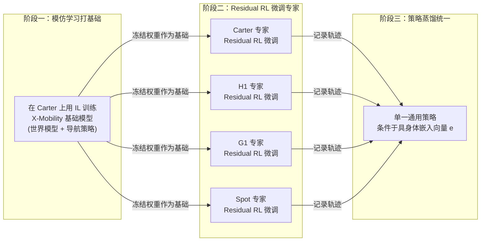

# COMPASS：跨具身体导航的 Residual RL 与策略蒸馏

> 前情提要：第 2-3 章讲完了 Whole-Body RL（SONIC）如何用 PPO 训练全身运动控制。本章切换到 GR00T 技术栈第二层——COMPASS，看它怎么用一种不同的 RL 范式（Residual RL）解决"让导航策略在多种机器人之间泛化"这个问题。

## 相关阅读

- [策略梯度与 PPO](/前置知识/000a_前置知识_策略梯度与PPO) — COMPASS 的 Residual RL 阶段仍然用 PPO 优化
- [行为克隆与 RL 微调范式](/前置知识/000d_前置知识_行为克隆与RL微调范式) — "先 IL 再 RL"这个思路的通用背景
- [KL 散度与策略约束](/前置知识/000j_前置知识_KL散度与策略约束) — 本章策略蒸馏阶段用到 KL 散度衡量分布差异

关联文章：
- [全景图：GR00T 生态里的强化学习都用在哪？](./01_全景图_GR00T生态中的强化学习地图)（本系列第 1 章）
- [Whole-Body RL 基础](./02_WholeBodyRL_PPO训练人形机器人运动技能)（本系列第 2 章，COMPASS 训练时依赖 SONIC 等运动控制器把速度指令转成关节命令）

---

## 贯穿本章的例子

> **场景**：一个仓库里，我们有四种完全不同的机器人：轮式机器人 Nova Carter、人形机器人 Unitree H1 和 G1、四足机器人 Spot Mini。任务是：给定一个目标位置，机器人要自主导航过去，避开货架和障碍物。我们已经有一个在 Carter 上训练得很好的导航模型，现在想让**同一套导航能力**适配到另外三种形态完全不同的机器人上——**不需要为每种机器人从零采集数据、从零训练**。

---

## 一、为什么"直接把 Carter 的策略搬到 G1 上"不可行

Carter 是轮式机器人，它的动力学极其简单——给一个线速度和角速度指令，机器人几乎立即按照这个指令移动。但 G1 是人形机器人，双足行走涉及复杂的平衡控制、步态生成，同样的"线速度+角速度"指令在 G1 上意味着完全不同的执行方式（需要先转换成具体的步态参数，再驱动全身运动控制器，比如第 2-3 章讲的 SONIC）。

如果直接把 Carter 上训练好的策略权重照搬到 G1 上，会遇到论文实验里验证的情况：COMPASS 论文的表格显示，直接用预训练的 X-Mobility（Carter 上的 IL 基础模型）零样本（zero-shot）测试到 G1 上，成功率只有 **3.6%**——几乎完全不可用。这个数字直观地说明了跨具身体迁移的难度：形态差异带来的动力学差异，不是"稍微调一下参数"就能弥合的。

---

## 二、COMPASS 的三阶段流程总览

COMPASS（Cross-embOdiment Mobility Policy via ResiduAl RL and Skill Synthesis，[arXiv:2502.16372](https://arxiv.org/abs/2502.16372)）用一个三阶段流程解决这个问题：

第一阶段用 IL 建立一个通用的"移动性先验"（mobility prior）；第二阶段针对每种机器人分别用 RL 训练一个"专家"，但这个 RL 不是从零开始，而是**基于**第一阶段的基础模型做残差修正；第三阶段把所有专家的知识蒸馏进一个统一的、通过具身体嵌入向量区分不同机器人的单一策略。

---

## 三、阶段一：X-Mobility——世界模型 + 导航策略的 IL 基础

### 3.1 问题设定

状态定义为 $\mathbf{x}_t = (\mathbf{I}_t, \mathbf{v}_t, \mathbf{g}_t, \mathbf{e})$：

| 符号 | 含义 |
|------|------|
| $\mathbf{I}_t$ | 当前相机 RGB 图像 |
| $\mathbf{v}_t$ | 当前测得的速度 |
| $\mathbf{g}_t$ | 路径/目标相关信息（比如机器人坐标系下的目标位置） |
| $\mathbf{e}$ | 具身体嵌入向量，标记机器人的形态类别（同一次任务内固定，但不同机器人不同） |

策略要学习一个映射 $\pi_\theta$，把状态映射到速度指令 $\mathbf{a}_t = (v_t, \omega_t)$（线速度和角速度），这个指令再交给具体机器人的底层关节控制器（比如人形机器人交给 SONIC 一类的全身控制器，四足机器人交给对应的步态控制器，轮式机器人直接调整轮速）。

### 3.2 世界模型：为什么要先学一个潜在状态表示

COMPASS 的 IL 基础模型 X-Mobility 引入了一个潜在状态 $\mathbf{s}_t$，用来捕捉环境动态：

$$
\mathbf{s}_t = f_\phi(\mathbf{s}_{t-1}, \mathbf{a}_{t-1}), \qquad \hat{\mathbf{o}}_t = g_\psi(\mathbf{s}_t)
$$

**为什么需要这个公式**：直接从原始图像 $\mathbf{o}_t=(\mathbf{I}_t, \mathbf{v}_t)$ 学习策略,会让策略网络承担"既要理解场景,又要决定动作"两个任务,而且原始图像信息量巨大、噪声也多。引入一个专门的世界模型,先把观测压缩成一个紧凑的潜在状态 $\mathbf{s}_t$（$f_\phi$ 负责根据"上一刻状态+上一步动作"预测"这一刻状态应该是什么",$g_\psi$ 负责验证这个潜在状态能不能重建/预测出原始观测),能让下游的策略网络工作在一个更干净、更结构化的表征空间上。

**逐项拆解**：

| 符号 | 含义 | 直觉 |
|------|------|------|
| $\mathbf{s}_t$ | 潜在状态,压缩了环境动态信息 | "这一刻,场景大概是什么样子(压缩版)" |
| $f_\phi$ | 潜在状态转移函数 | "根据上一刻的状态和刚做的动作,预测这一刻状态会变成什么" |
| $g_\psi$ | 观测重建/预测函数 | "检验这个潜在状态有没有捕捉到足够信息,能不能还原出真实观测" |

训练时用专家演示数据集 $\mathcal{D} = \{(\mathbf{o}_0, \mathbf{a}_0^\star, \ldots, \mathbf{o}_T, \mathbf{a}_T^\star)\}$（$\mathbf{a}_t^\star$ 是"教师策略"，通常是经典的、已经调好的传统导航算法给出的动作）,最小化重建和预测损失。

### 3.3 在潜在空间上训练策略

有了世界模型之后，策略在潜在状态上工作：

$$
\mathbf{r}_t = f_\theta(\mathbf{g}_t), \qquad \mathbf{p}_t = \Phi(\mathbf{s}_t, \mathbf{r}_t), \qquad \mathbf{a}_t = \pi_\theta^{\text{IL}}(\mathbf{p}_t)
$$

$f_\theta$ 负责编码路径/目标信息成一个"路径嵌入" $\mathbf{r}_t$，$\Phi$ 是一个可学习的融合模块，把潜在状态和路径嵌入拼接成最终的"策略状态" $\mathbf{p}_t$，再交给策略网络 $\pi_\theta^{\text{IL}}$ 输出动作。

训练目标是最小化和教师动作的差异：

$$
\min_\theta \sum_t \ell(\pi_\theta^{\text{IL}}(\mathbf{p}_t), \mathbf{a}_t^\star)
$$

这一步产出的就是"IL 基础模型"——它学到了一个通用的、在 Carter 这种简单动力学机器人上验证过的移动性先验。**这个模型接下来在整个流程里都会被冻结**，不再更新，只作为后续阶段的一个固定组件使用。

---

## 四、阶段二：Residual RL——在冻结基础模型上叠加修正

### 4.1 为什么不直接对每种机器人做纯 RL 从零训练

论文专门做了这个对照实验（Figure 7）：直接用同样的 RL 设置（同样用潜在状态,但不利用 IL 基础动作），从零训练一个策略。结果是：**即使训练了 1000 个 episode，纯 RL 方法仍然没有收敛**。

**为什么纯 RL 从零训练这么难**：导航任务的奖励是稀疏的——机器人只有走到目标附近才能获得明确的正反馈，在一个几十米见方的大环境里，随机探索几乎不可能碰到目标。这正是第 1 章、第 6 章反复提到的"长 horizon、稀疏奖励"问题的另一个具体案例。

### 4.2 Residual RL 的架构：基础动作 + 修正动作

$$
\mathbf{a}_t^{\text{base}} = \pi_\theta^{\text{base}}(\mathbf{p}_t), \qquad \mathbf{a}_t = \mathbf{a}_t^{\text{base}} + \mathbf{a}_t^{\text{res}}
$$

**为什么需要这个公式**：这是 Residual RL 范式的核心——不让新训练的策略从零决定"该做什么"，而是让**已经训练好的基础策略**先给出一个"大致靠谱"的基础动作 $\mathbf{a}_t^{\text{base}}$，新的残差策略 $\pi_\phi^{\text{res}}$ 只需要学习一个**修正量** $\mathbf{a}_t^{\text{res}}$，加到基础动作上。

**一句话直觉**：不是"从头学怎么导航"，而是"在一个已经会走的基础上，学怎么走得更适合我这种身体"。

**为什么这样能解决稀疏奖励带来的探索困难**：因为基础动作 $\mathbf{a}_t^{\text{base}}$ 已经能让机器人朝着大致正确的方向移动（即使不完美），残差策略的探索空间被大幅收窄——它不需要在整个动作空间里盲目搜索，只需要在"基础动作附近"探索小范围的修正。这就是为什么加了 IL 基础之后，即使换成完全陌生的机器人形态，RL 训练也能快速收敛——探索问题被基础策略"预先解决了大部分"。

### 4.3 奖励设计

$$
R = R_{\text{progress}} + R_{\text{collision}} + R_{\text{goal}}
$$

三项分别是：**进度奖励**（正比于"离目标距离缩短了多少"，提供稠密的引导信号）、**碰撞规避惩罚**（碰撞或摔倒扣分）、**目标完成奖励**（到达目标给一次性大额正奖励）。论文特意指出这个奖励设计是"简单的"，没有做复杂的奖励塑形——因为大部分探索难度已经被 IL 基础策略吸收了，残差 RL 阶段不需要极其精细的奖励工程。

### 4.4 训练循环：PPO + 冻结基础策略

$$
\mathbf{a}_t^{\text{base}} = \pi_\theta^{\text{base}}(\mathbf{p}_t) \; (\text{冻结}), \quad \mathbf{a}_t^{\text{res}} = \pi_\phi^{\text{res}}(\mathbf{p}_t) \; (\text{训练中})
$$

具体训练循环（Algorithm，对应论文 Fig. 2）：
1. 从环境获取当前状态 $\mathbf{x}_t$，通过世界模型得到策略状态 $\mathbf{p}_t$
2. 冻结的 IL 策略输出基础动作 $\mathbf{a}_t^{\text{base}}$，同时残差网络输出修正 $\mathbf{a}_t^{\text{res}}$
3. 组合动作 $\mathbf{a}_t$ 通过具身体专属的关节控制器在仿真中执行
4. 观测新状态 $\mathbf{x}_{t+1}$ 和奖励 $R$
5. 用 PPO 更新残差策略 $\pi_\phi^{\text{res}}$，**IL 基础策略 $\pi_\theta^{\text{base}}$ 参数保持不变**

**一个工程上的细节**：残差网络不是随机初始化的，而是**复制 IL 策略的权重**，只重新初始化最后一层输出层。这个初始化策略进一步加速了训练——残差网络在训练最开始输出接近 0（或者至少是合理范围内）的修正量，避免了"一开始残差网络乱来，把本来还不错的基础动作破坏掉"这种训练初期的不稳定性。

---

## 五、阶段三：策略蒸馏——把专家蒸馏成通用策略

### 5.1 为什么不直接部署四个独立的专家模型

阶段二为每种机器人训练出了一个"专家"——Carter 专家、H1 专家、G1 专家、Spot 专家。但如果就此结束，我们得到的是四个独立的模型，遇到一种新机器人还是需要重新走一遍阶段二。策略蒸馏的目标是把这些专家的知识**合并**进一个单一的、通过具身体嵌入向量区分行为的通用策略。

### 5.2 蒸馏目标：KL 散度匹配

$$
\min_\theta \sum_{i \in \mathcal{E}} \sum_{d_i \in \mathcal{D}_i} \text{KL}\left(\mathcal{N}(\boldsymbol{\mu}^{(i)}(\mathbf{p}), \sigma^2) \,\|\, \mathcal{N}(\boldsymbol{\mu}_\theta(\mathbf{p}, \mathbf{e}^{(i)}), \sigma_\theta^2)\right)
$$

**为什么需要这个公式**：每个专家策略在 PPO 训练时本身就是一个高斯分布 $\mathcal{N}(\boldsymbol{\mu}^{(i)}(\mathbf{p}), \sigma^2)$（PPO 常用的连续动作参数化方式）。蒸馏阶段的目标不是简单地让通用策略的**均值**去逼近专家的均值（那只是模仿"专家最可能做的动作"），而是让通用策略输出的**整个分布**去匹配专家的整个分布——这样能保留专家策略里的不确定性信息，而不只是一个点估计。

**逐项拆解**：

| 符号 | 含义 |
|------|------|
| $\mathcal{E}$ | 所有具身体的集合（Carter, H1, G1, Spot） |
| $\mathcal{D}_i$ | 第 $i$ 个专家收集的轨迹数据集（策略状态 + 动作分布参数） |
| $\boldsymbol{\mu}^{(i)}(\mathbf{p})$ | 专家 $i$ 在状态 $\mathbf{p}$ 下输出的动作分布均值 |
| $\boldsymbol{\mu}_\theta(\mathbf{p}, \mathbf{e}^{(i)})$ | 通用策略在同样状态、给定具身体嵌入 $\mathbf{e}^{(i)}$ 下输出的均值 |
| $\text{KL}(\cdot\|\cdot)$ | 衡量两个分布差多远（详见 [KL 散度与策略约束](/前置知识/000j_前置知识_KL散度与策略约束)） |

**为什么用 KL 散度而不是简单的均方误差（MSE）**：论文做了消融实验（Table III）对比这两种选择——用 KL 散度（保留方差信息）整体表现略优于只用 MSE 匹配均值，尤其在 H1（人形机器人）上差距更明显。合理的解释是：KL 散度这种方式给"训练噪声和架构差异留了余地"——通用策略不需要精确复制专家的每一个具体输出，只需要复制专家动作分布的整体形状，这在跨架构、跨具身体的蒸馏场景下更宽容、更稳健。

### 5.3 具身体嵌入向量：怎么让一个网络"知道自己在控制哪种机器人"

$\mathbf{e}^{(i)}$ 在 COMPASS 里最简单的实现是一个**独热编码**（one-hot encoding）向量——长度等于机器人种类数，每个位置对应一种具体机器人。论文指出这种简单方式在机器人种类不多、差异明显时是够用的，但如果未来要扩展到更多、更连续变化的具身体谱系，用一个**可学习的嵌入**（类似词嵌入的思路）可能更有利于对未见过的新机器人做零样本泛化——论文明确把这个方向留给了后续工作。

---

## 六、实验结果说明了什么

### 6.1 Residual RL 相比 IL 基础模型的提升幅度

论文的核心结果表（Table I）显示：X-Mobility（纯 IL 基础模型）在四种机器人上的成功率普遍很低（G1 上只有 3.6%），而经过 Residual RL 微调的专家策略成功率跃升到 **72%-96%** 区间，提升幅度在 5 倍到 40 倍之间。这个巨大的提升差距直观说明了：**IL 基础模型提供的是"移动性的通用先验"，但把这个先验适配到具体形态的物理约束上，仍然需要针对性的 RL 微调**——两者缺一不可。

### 6.2 策略蒸馏没有明显的性能损失

一个值得关注的发现是：蒸馏出的通用策略（Generalist）在四种机器人上的表现，和各自的专家策略几乎**没有差距**，在 G1 上甚至略微超过专家（可能是因为蒸馏阶段见过了更多样化的场景数据，起到了一定的正则化效果）。这个结果说明：**把多个专家策略压缩进一个单一网络,不需要付出明显的泛化能力损失代价**——这是策略蒸馏这个范式在实践中站得住脚的关键证据。

### 6.3 跨具身体能力的直观例子

论文里给了一个具体的定性例子（Figure 6）：在一个多货架仓库场景中，G1（人形机器人）能够略微侧身低头，从货架下方一个刚好够头部通过的缝隙钻过去，而 H1（另一种人形机器人，身材比例不同）由于头部间隙不够，必须绕路。**同一个通用策略网络**，根据不同的具身体嵌入向量，自动学会了适配各自身体的物理约束——这正是"具身体嵌入向量"这个设计想要达到的效果。

---

## 七、COMPASS 与 SONIC 的关系：两种 RL 范式的对比

到这里我们已经看过两种截然不同的 RL 应用方式，值得直接对比一下：

| 维度 | SONIC（第 2-3 章） | COMPASS（本章） |
|------|---------------------|-------------------|
| RL 起点 | 从零开始训练（策略网络随机初始化） | 基于冻结的 IL 基础模型，只训练一个残差修正项 |
| 解决的探索难题 | 用"追踪人类动作捕捉数据"提供稠密监督信号 | 用 IL 基础动作大幅收窄探索空间 |
| 泛化目标 | 泛化到大量不同的运动模式（同一具身体） | 泛化到不同的具身体形态（不同机器人） |
| 是否需要蒸馏 | 不需要（本身就是训练一个统一的多模态策略） | 需要（专家策略 → 蒸馏 → 通用策略） |
| 与 GR00T VLA 主干的关系 | 作为独立训练的低层执行器被 VLA 调用 | 作为导航子模块，输出速度指令交给对应的 SONIC 类底层控制器执行 |

两者共同的设计哲学：**都不要求策略网络从零学习一切**——SONIC 借助人类动作捕捉数据提供稠密监督，COMPASS 借助冻结的 IL 基础模型提供探索先验。这呼应了本系列第 1 章末尾提到的观察：整个 GR00T 技术栈里的 RL 系统,都在想办法**避免昂贵的从零探索**，因为纯粹的稀疏奖励强化学习在这些长 horizon、高维的真实机器人任务上,代价过于高昂。

---

## 八、总结

| 维度 | COMPASS |
|------|---------|
| 核心问题 | 单一具身体（如轮式机器人）训练出的导航策略，如何泛化到形态迥异的其他机器人（人形、四足）上 |
| 三阶段流程 | (1) IL 训练通用移动性先验 X-Mobility (2) Residual RL 针对每种机器人训练专家 (3) 策略蒸馏合并成单一通用策略 |
| Residual RL 的核心机制 | 冻结的 IL 基础策略提供基础动作，只训练一个残差修正网络叠加在基础动作上 |
| 为什么能解决稀疏奖励探索问题 | 基础动作已经"大致靠谱"，残差网络的探索范围被收窄到基础动作附近 |
| 蒸馏机制 | 用 KL 散度匹配专家和通用策略的完整动作分布（不只是均值），用具身体嵌入向量区分不同机器人 |
| 关键实验发现 | Residual RL 相比纯 IL 提升 5-40 倍成功率；蒸馏后的通用策略性能不输给专家策略 |
| 局限 | 具身体嵌入目前是简单的独热编码，对全新未见过形态的零样本泛化能力有限 |

## 下一章预告

前三章我们看的都是"真正意义上的 RL 训练系统"。下一章我们转向 GR00T 技术栈里一个性质不同的机制——**RTC（Real-Time Chunking）**。它严格来说不是一个强化学习算法，但 NVIDIA 官方在 GR00T N1.6 的技术报告里明确提到了"train-time RTC"这个概念，意味着这个机制也有一个训练时的版本，和 RL 训练的关系比表面上看起来更紧密。我们会拆解这个机制到底解决了什么问题，以及"训练时"和"推理时"两个版本分别在做什么。
