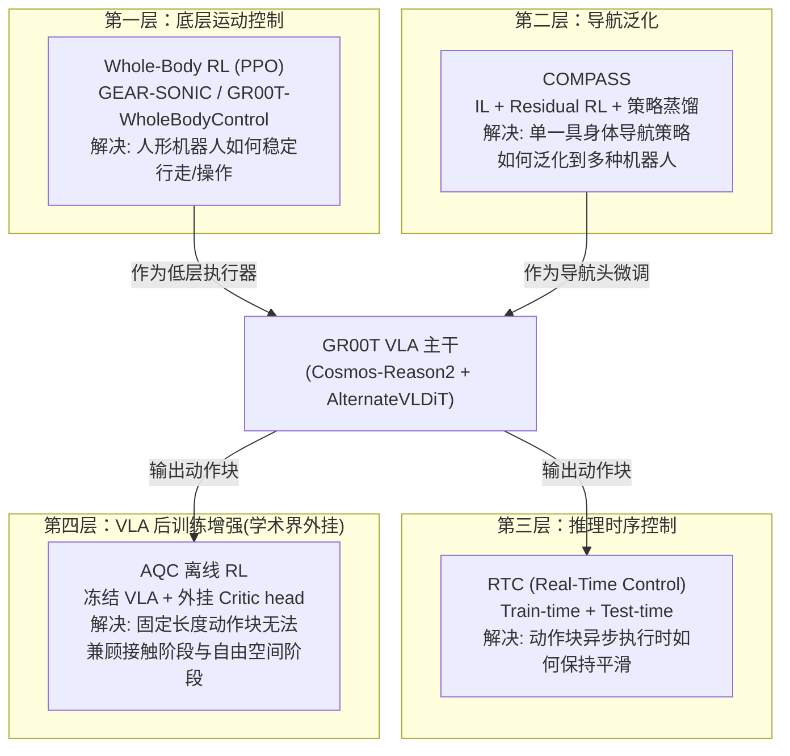

# GR00T 强化学习深度解析：从 Whole-Body RL 到 VLA 动作分块增强

> GR00T 不是一个单一的 RL 系统，而是一整套 RL 技术在不同层级上的组合——从最底层的关节控制，到导航，到 VLA 后训练。这个系列把这些分散的技术串成一条完整的地图。

## 系列简介

关于 GR00T N1.6 的强化学习，网络上流传着一种常见的误解：认为 NVIDIA 在 GR00T N1.6 里"集成了 AQC (Adaptive Q-Chunking) 的 RL 方法"。这个说法并不准确——AQC 是加州大学伯克利分校生态之外的一篇独立学术论文（[arXiv:2605.05544](https://arxiv.org/abs/2605.05544)），作者用**冻结的** GR00T N1.6 权重做骨干，外挂了一组轻量级 Critic head，在 RoboCasa-GR1 基准上验证了离线 RL 能不能给一个原生输出动作块的大模型带来"接触阶段变精细、自由空间变高效"的自适应能力。这是"用 GR00T 验证 AQC"，而不是"GR00T 出厂自带 AQC"。

那 GR00T 真正用到的 RL 在哪里？答案是：**在好几个不同的层级上，各自解决不同的问题**。本系列的目标就是把这幅地图完整画出来：

1. **最底层：Whole-Body RL**——用 PPO 在 Isaac Lab 里训练人形机器人的运动技能（走、蹲、单臂/双臂协调），产出的 GEAR-SONIC 控制器是 GR00T N1.5/N1.6 的低层执行器
2. **中间层：COMPASS**——用 Residual RL + 策略蒸馏，把单一具身体的导航策略泛化到人形、轮式、四足等多种机器人上
3. **推理层：RTC（Real-Time Control）**——虽然不是严格的 RL，但它解决的是"策略输出的动作块如何在异步执行下保持平滑"这个和 RL 训练息息相关的问题
4. **VLA 后训练层：AQC 离线 RL 增强**——学术界给 GR00T N1.6 的动作块输出加装 Critic，让它在接触密集任务上学会"该快就快、该慢就慢"

这四层技术互不替代，各自解决 GR00T 技术栈里不同的具体问题。读完这个系列，你会清楚知道"RL 在 GR00T 里到底解决了什么，用在哪一层，为什么必须是这样设计"。

**适合读者**：
- 已经读过 [GR00T N1.7 深度解析](/系列/groot_n1d7_deep_dive/) 系列，理解 VLA 架构本身，现在想搞清楚 RL 部分怎么嵌进整个技术栈
- 想理解 Whole-Body RL、Residual RL、动作分块 RL 这几种不同 RL 范式的区别
- 对 NVIDIA 具身智能 RL 技术栈感兴趣的研究者/工程师

**你将获得**：
- 对"RL 在 GR00T 生态里的完整地图"的清晰认知，不再混淆不同层级的技术
- 对 PPO 训练人形机器人运动技能全流程的理解（GEAR-SONIC/GR00T-WholeBodyControl）
- 对 Residual RL 这种"IL 打底 + RL 修正 + 蒸馏泛化"范式的深入理解（COMPASS）
- 对动作分块 RL（Q-Chunking → AQC）如何作为外挂增强大规模 VLA 的完整认知
- 对 GR00T N1.6 官方报告中"train-time RTC"这类容易被忽略的细节的准确理解

## 章节目录

| 章节 | 标题 | 简介 |
|------|------|------|
| 01 | [全景图：GR00T 生态里的强化学习都用在哪？](./01_全景图_GR00T生态中的强化学习地图) | 澄清"GR00T 集成 AQC"的误解，画出四层 RL 技术的完整地图 |
| 02 | [Whole-Body RL 基础：用 PPO 训练人形机器人的运动技能](./02_WholeBodyRL_PPO训练人形机器人运动技能) | GEAR-SONIC/GR00T-WholeBodyControl 的 PPO 训练流程、奖励设计、辅助损失 |
| 03 | [FSQ 潜空间动作与 SONIC 架构：多模态输入如何统一成关节命令](./03_FSQ潜空间动作与SONIC架构) | Finite Scalar Quantization、共享 token 空间、单一解码器的设计动机 |
| 04 | [COMPASS：跨具身体导航的 Residual RL 与策略蒸馏](./04_COMPASS_跨具身导航的ResidualRL与策略蒸馏) | IL 打底 → Residual RL 修正 → 策略蒸馏泛化的三阶段范式 |
| 05 | [RTC 实时控制：Train-Time 与 Test-Time 的双重机制](./05_RTC实时控制_TrainTime与TestTime) | 官方报告里"train-time RTC"具体指什么，和推理时 RTC 的关系 |
| 06 | [动作分块 RL 基础回顾：从 Q-Chunking 到 Adaptive Q-Chunking](./06_动作分块RL基础_QChunking到AQC回顾) | 为什么动作分块能同时解决探索问题和 TD 偏差问题，AQC 解决了什么遗留问题 |
| 07 | [AQC 如何在 GR00T N1.6 上做离线 RL 增强：两阶段实战解析](./07_AQC在GR00T_N1d6上的离线RL增强实战) | Actor 微调 + Critic 训练两阶段协议、超参数、RoboCasa-GR1 结果详解 |
| 08 | [GR00T 强化学习技术栈全景与未来方向](./08_GR00T强化学习技术栈全景与未来方向) | 四层技术的横向对比、协同关系、开放问题与展望 |

## 核心地图

## 前置知识要求

阅读本系列前建议先了解：
- [GR00T N1.7 深度解析](/系列/groot_n1d7_deep_dive/) —— 理解 GR00T 的 VLA 主干架构（本系列不重复讲这部分）
- [深度强化学习方法综述](/论文综述/S01_深度强化学习方法综述) —— PPO、Actor-Critic 等基础算法脉络
- [策略梯度与 PPO](/前置知识/000a_前置知识_策略梯度与PPO) —— 本系列第 2 章需要
- [Q 函数与 Value 函数](/前置知识/000o_前置知识_Q函数与Value函数) —— 本系列第 6-7 章需要
- [Q-Chunking：用动作分块加速离线到在线 RL](/论文综述/071_QChunking_RL与动作分块) —— 第 6 章的直接前置
- [Adaptive Q-Chunking：让分块长度随状态自适应](/论文综述/072_AdaptiveQChunking_自适应动作分块长度) —— 第 6-7 章的直接前置（本系列第 7 章聚焦其"接到 GR00T N1.6"这一具体实验，完整方法论请读该文）

## 阅读建议

1. **完全零基础**：先读 [GR00T N1.7 系列](/系列/groot_n1d7_deep_dive/) 第 1-2 章建立 VLA 认知，再回来读本系列第 1 章
2. **只想搞清楚"AQC 和 GR00T 的关系"**：直接读第 1 章 + 第 7 章
3. **想理解人形机器人运动控制**：重点读第 2-3 章
4. **想理解跨具身体导航**：重点读第 4 章
5. **想理解动作分块 RL 全貌**：按顺序读第 6-7 章，并配合 [Q-Chunking](/论文综述/071_QChunking_RL与动作分块) 和 [AQC](/论文综述/072_AdaptiveQChunking_自适应动作分块长度) 两篇精读

## 相关系列

- [GR00T N1.7 深度解析](/系列/groot_n1d7_deep_dive/) —— GR00T 的 VLA 主干架构，本系列的前置基础
- [RLinf 深度解析](/系列/rlinf_deep_dive/) —— GR00T 可以接入的强化学习后训练基础设施
