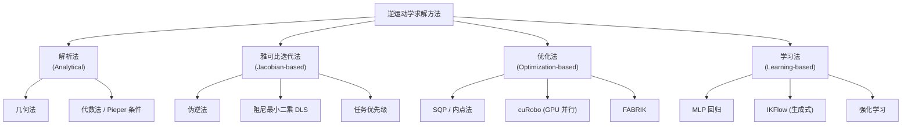

# 第一章：逆运动学问题定义与分类

> 本章目标：精确定义 IK 问题是什么、为什么它在数学上是困难的、有哪些不同的 IK 变体（位置 IK、速度 IK、约束 IK），以及各类求解方法的全景图。

**知识链接**：
- [正运动学与 DH 参数](/前置知识/003a_前置知识_正运动学与DH参数)
- [雅可比矩阵与微分运动学](/前置知识/003b_前置知识_雅可比矩阵与微分运动学)

---

## 1. IK 的精确定义

[正运动学](/前置知识/003a_前置知识_正运动学与DH参数)建立了映射 $f: \mathbb{R}^n \to SE(3)$，即从关节空间到末端位姿。逆运动学就是求这个映射的"逆"：

$$
\text{IK}(\mathbf{x}_{\text{target}}): \quad \text{求} \; \mathbf{q}^* \in \mathbb{R}^n, \quad \text{使得} \; f(\mathbf{q}^*) = \mathbf{x}_{\text{target}}
$$

**这个公式在做什么**：给定一个期望的末端位姿 $\mathbf{x}_{\text{target}}$（位置 + 姿态），找到一组关节角 $\mathbf{q}^*$ 使得正运动学的输出恰好等于目标。

::: details 📐 逐符号拆解 + 数值代入（点击展开）
**逐符号拆解**：

| 符号 | 含义 | 具体是什么 |
|------|------|-----------|
| $\mathbf{x}_{\text{target}} \in SE(3)$ | 目标末端位姿 | 一个 $4\times4$ 齐次变换矩阵（或等价地：位置 3D + 四元数/旋转矩阵） |
| $\mathbf{q}^* \in \mathbb{R}^n$ | IK 解 | $n$ 个关节角度值的向量 |
| $f(\cdot)$ | 正运动学函数 | 由机器人几何（DH 参数或 URDF）唯一确定 |
| $n$ | 关节自由度 | Franka: 7, UR5: 6, 人形臂: 7 |

**数值代入**（贯穿例子）：Franka Panda 抓取场景：
- 目标位置：$\mathbf{p}_{\text{target}} = (0.5, 0.2, 0.10)^T$ 米
- 目标姿态：夹爪竖直向下 → $R_{\text{target}} = \begin{bmatrix} 1 & 0 & 0 \\ 0 & -1 & 0 \\ 0 & 0 & -1 \end{bmatrix}$（$z$ 轴指向 $(0,0,-1)$，$y$ 轴指向 $(0,-1,0)$）
- 求：$\mathbf{q}^* = (q_1^*, q_2^*, \ldots, q_7^*)^T$，使得 $f(\mathbf{q}^*)$ 的平移部分 $= (0.5, 0.2, 0.10)$，旋转部分 $= R_{\text{target}}$

已知一个可能的解（PyBullet 计算）：$\mathbf{q}^* \approx (0.21, -0.56, -0.14, -2.42, -0.02, 1.87, 0.64)$ rad。但这不是唯一解——7-DOF 臂对 6-DOF 目标有无穷多解。

**为什么是这个形式**：IK 本质上是求非线性方程组的根。$f$ 包含大量三角函数嵌套，没有通用的封闭形式解——这就是 IK 难的根源。
:::

---

## 2. 为什么 IK 在数学上是困难的

IK 的困难源于正运动学 $f$ 的三个性质：

### 2.1 非线性

$f$ 是关节角的三角函数的嵌套组合。对 7-DOF 臂，展开后是 $\sin$、$\cos$ 乘积求和的复杂表达式。非线性方程组一般没有封闭形式解。

### 2.2 多解性

同一个末端位姿可以由多种关节构型实现：

| 机器人 | DOF | 最大 IK 解数 |
|--------|-----|-------------|
| 一般 6-DOF | 6 | 最多 16 个离散解 |
| PUMA 560 | 6 | 8 个解（特殊构型更少） |
| 7-DOF 冗余臂 | 7 | 无穷多解（连续解流形） |
| 2-DOF 平面臂 | 2 | 2 个解（"肘上"和"肘下"） |

**直觉**：2-DOF 平面臂，给定末端 $(x, y)$，两根连杆可以像人的胳膊一样"肘朝上"或"肘朝下"两种方式到达同一点。7-DOF 臂更极端——想象你固定手的位置不动，肘部可以画一个圆圈（自运动），圆上每一点对应一个不同的 IK 解。

> 上图展示了 2-DOF 平面臂到达同一目标点 (1.2, 0.8) 的两种解——左侧"肘上"（$q_2 > 0$）和右侧"肘下"（$q_2 < 0$）。虚线圆是工作空间边界。注意两种构型的关节角完全不同，但末端位置相同。

> 冗余臂（DOF > 6）的多解性更极端：上图展示了多种不同构型都到达同一末端位置的情形。肘部的轨迹构成"自运动流形"（紫色虚线），这就是冗余度带来的额外自由度。

### 2.3 不可达性

不是所有目标都有解。末端能到达的空间叫**工作空间**（workspace）：
- **可达工作空间**：至少存在一种姿态能到达的位置集合
- **灵巧工作空间**：任意姿态都能到达的位置集合（通常远小于可达工作空间）

工作空间外的目标无解。工作空间边界附近的目标虽有解，但往往接近奇异构型——关节速度需求趋于无穷大。

> 上图展示了 $L_1=1.0$, $L_2=0.7$ 的 2-DOF 臂的工作空间。蓝色区域是可达空间（环形），外边界半径 $L_1+L_2=1.7$，内边界半径 $|L_1-L_2|=0.3$。绿色星号是有多解的可达点，红色叉号是不可达点（超出外边界），橙色菱形是边界上的奇异点。

---

## 3. IK 问题的变体

根据求解目标的不同，IK 有三种主要变体：

### 3.1 位置级 IK（Position-level IK）

最常见的形式：给定目标位姿，直接求关节角。

$$
\text{求} \; \mathbf{q}^*: \quad f(\mathbf{q}^*) = T_{\text{target}}
$$

**这个公式在做什么**：找到一个关节角向量 $\mathbf{q}^*$，使得正运动学映射 $f$ 的输出恰好等于期望的目标位姿 $T_{\text{target}}$。

::: details 📐 逐符号拆解 + 数值代入（点击展开）
**逐符号拆解**：

| 符号 | 含义 | 具体是什么 |
|------|------|-----------|
| $\mathbf{q}^* \in \mathbb{R}^n$ | 待求的关节角向量 | $n$ 为自由度数，如 Franka 为 7 维 |
| $f(\cdot)$ | 正运动学函数 | 将关节角映射为末端位姿（$4\times4$ 齐次变换矩阵） |
| $T_{\text{target}} \in SE(3)$ | 目标位姿 | 包含位置 $(x,y,z)$ 和姿态（旋转矩阵） |

**数值代入**：对 2-DOF 平面臂（$l_1 = l_2 = 1$ m），目标 $(x,y) = (1.5, 0.5)$：

正运动学 $f(q_1, q_2) = (l_1\cos q_1 + l_2\cos(q_1+q_2),\; l_1\sin q_1 + l_2\sin(q_1+q_2))$。求满足 $f(\mathbf{q}^*) = (1.5, 0.5)$ 的 $(q_1^*, q_2^*)$。通过几何法可得 $q_2 \approx \pm 0.72$ rad，对应"肘上"/"肘下"两个解。

**为什么是这个形式**：这是 IK 最本质的数学表达——正运动学的"反函数"。实际中因为 $f$ 是非线性超越函数，所以"反转"它不是简单的代数操作，需要专门的求解算法。
:::

应用场景：点到点运动、抓取位姿计算、路径点计算。

### 3.2 速度级 IK（Velocity-level IK / Resolved-rate IK）

给定期望的末端速度 $\dot{\mathbf{x}}_d$，求关节速度 $\dot{\mathbf{q}}$：

$$
\dot{\mathbf{q}} = J^{-1}(\mathbf{q}) \dot{\mathbf{x}}_d \quad \text{或} \quad \dot{\mathbf{q}} = J^+(\mathbf{q}) \dot{\mathbf{x}}_d
$$

**这个公式在做什么**：实时地把笛卡尔空间的速度指令转换为关节速度指令。

::: details 📐 逐符号拆解 + 数值代入（点击展开）
**逐符号拆解**：

| 符号 | 含义 |
|------|------|
| $\dot{\mathbf{x}}_d \in \mathbb{R}^6$ | 期望末端速度（线速度 + 角速度） |
| $J^+$ | 雅可比伪逆（Moore-Penrose），$J^+ = J^T(JJ^T)^{-1}$ |
| $J^{-1}$ | 雅可比逆（仅当 $n=6$ 且非奇异时存在） |

**数值代入**：假设要让末端沿 $x$ 方向以 0.1 m/s 运动，角速度为零：$\dot{\mathbf{x}}_d = (0.1, 0, 0, 0, 0, 0)^T$。

对 Franka 在某构型下，$J^+$ 是 $7 \times 6$ 矩阵。$\dot{\mathbf{q}} = J^+ \dot{\mathbf{x}}_d$ 给出 7 个关节的角速度——这是"最小关节速度范数"的解。

**为什么是这个形式**：速度级 IK 是微分运动学 $\dot{\mathbf{x}} = J\dot{\mathbf{q}}$ 的直接反转。用伪逆而不是逆，是因为冗余臂的 $J$ 不是方阵，需要广义逆。
:::

应用场景：实时遥操作、速度级阻抗控制、视觉伺服。

### 3.3 约束 IK（Constrained IK）

在基本 IK 之上加入额外约束：

$$
\min_{\mathbf{q}} \; \|f(\mathbf{q}) - T_{\text{target}}\|^2 + w \cdot g(\mathbf{q}) \quad \text{s.t.} \quad \mathbf{q}_{\min} \le \mathbf{q} \le \mathbf{q}_{\max}, \; h(\mathbf{q}) \le 0
$$

**这个公式在做什么**：在满足关节限位、避障、避奇异等约束的前提下，找到最接近目标的关节构型。

::: details 📐 逐符号拆解 + 数值代入（点击展开）
**逐符号拆解**：

| 符号 | 含义 |
|------|------|
| $\|f(\mathbf{q}) - T_{\text{target}}\|^2$ | 末端位姿误差（需要定义 $SE(3)$ 上的距离度量） |
| $g(\mathbf{q})$ | 正则项（如关节偏离中位的惩罚、操纵性最大化） |
| $w$ | 正则权重 |
| $\mathbf{q}_{\min}, \mathbf{q}_{\max}$ | 关节限位（物理约束） |
| $h(\mathbf{q}) \le 0$ | 不等式约束（如避障距离 > 阈值、避奇异） |

**数值代入**：Franka Panda 第 1 关节限位 $q_1 \in [-2.8973, 2.8973]$ rad，第 4 关节 $q_4 \in [-3.0718, -0.0698]$ rad。如果无约束 IK 解的 $q_4 = 0.5$（超出上限），约束 IK 会找一个满足限位的次优解。

**为什么是这个形式**：纯位置 IK 可能给出关节超限、穿越障碍物、或接近奇异的解。约束 IK 把这些工程需求统一到一个优化问题中。
:::

应用场景：带碰撞避让的 IK、考虑关节限位的 IK、多目标优化。

---

## 4. 四大类求解方法全景

### 各方法对比概览

| 方法类别 | 代表算法 | 速度 | 精度 | 处理约束 | 处理冗余 | 适用场景 |
|----------|----------|------|------|----------|----------|----------|
| 解析法 | 几何法、Pieper | μs 级 | 精确 | ❌ | 有限 | 特殊构型（6-DOF, 球腕） |
| 雅可比迭代 | DLS, J^+ | ~ms | 高（迭代） | 间接 | ✅ 零空间 | 实时控制、速度级 |
| 优化法 | SQP, cuRobo | ms~10ms | 高 | ✅ 直接 | ✅ | 约束多的工程场景 |
| 学习法 | IKFlow, MLP | μs~ms | 中~高 | 间接 | ✅ | 高频推理、批量计算 |

---

## 5. IK 在机器人学习中的角色

在 VLA / 行为克隆 / RL 的上下文中，IK 出现在以下环节：

### 5.1 Action Space 选择

| Action Space | 描述 | 需要 IK？ |
|---|---|---|
| 关节角 $\Delta\mathbf{q}$ | 策略直接输出关节增量 | ❌ |
| 末端位姿 $\Delta\mathbf{x}$ (EEF) | 策略输出笛卡尔增量 | ✅ 运行时需要 IK |
| 末端绝对位姿 $T_{\text{target}}$ | 策略输出目标位姿 | ✅ 运行时需要 IK |

许多 VLA 模型（如 [π₀](/系列/openpi_deep_dive/)、RT-2）输出的是 EEF 空间动作。这意味着推理时每一步都需要调用 IK 将笛卡尔动作转换为关节指令。IK 的速度和质量直接影响闭环控制的频率和成功率。

### 5.2 数据采集中的 IK

通过遥操作采集数据时，操作者通常在笛卡尔空间控制末端。系统需要实时 IK 将操作者的位姿指令转为关节指令发给机器人。如果 IK 延迟过大或解不稳定，操作体验会很差。

### 5.3 Sim-to-Real 中的 IK

仿真中的 IK（如 Isaac Lab 的内置 IK）和真机 IK（如 MoveIt 或机器人控制器内置 IK）可能有差异。这种差异可能导致 sim2real gap：仿真中策略能稳定执行，但真机 IK 解不同导致行为偏移。

---

## 6. IK 的误差度量

IK 的"精度"如何衡量？需要在 $SE(3)$ 上定义距离：

### 6.1 位置误差

$$
e_p = \|\mathbf{p}_{\text{actual}} - \mathbf{p}_{\text{target}}\|_2
$$

**这个公式在做什么**：直接算末端实际位置和目标位置的欧几里得距离（单位：米）。

::: details 📐 逐符号拆解 + 数值代入（点击展开）
**逐符号拆解**：

| 符号 | 含义 |
|------|------|
| $\mathbf{p}_{\text{actual}} = f(\mathbf{q})_{\text{trans}}$ | IK 解代入 FK 后的末端位置 |
| $\mathbf{p}_{\text{target}}$ | 目标位置 |
| $\|\cdot\|_2$ | 欧几里得范数 |

**数值代入**：目标 $(0.500, 0.200, 0.100)$，IK 解给出 $(0.501, 0.199, 0.100)$：

$$
e_p = \sqrt{0.001^2 + 0.001^2 + 0^2} = 0.00141 \text{ m} = 1.41 \text{ mm}
$$

**为什么是这个形式**：欧几里得距离是最自然的位置误差度量。工程标准通常要求 $e_p < 1$ mm。
:::

### 6.2 姿态误差

姿态误差没有唯一标准定义。常用方式：

$$
e_o = \|\text{log}(R_{\text{target}}^T R_{\text{actual}})\|
$$

**这个公式在做什么**：用旋转矩阵的对数映射（角轴表示）度量两个姿态之间的"旋转距离"。

::: details 📐 逐符号拆解 + 数值代入（点击展开）
**逐符号拆解**：

| 符号 | 含义 |
|------|------|
| $R_{\text{target}}^T R_{\text{actual}}$ | 从目标姿态到实际姿态的相对旋转 |
| $\text{log}(\cdot)$ | $SO(3)$ 的对数映射，结果是 $3 \times 3$ 反对称矩阵 |
| $\|\cdot\|$ | Frobenius 范数（或等价地：旋转角度 $\theta$） |

对数映射的结果等价于角轴表示 $\theta \hat{\mathbf{n}}$，其中 $\theta$ 是旋转角度。所以 $e_o = \theta$（弧度）。

**数值代入**：如果实际姿态相对目标偏了 $2°$（约 0.035 rad）：$e_o = 0.035$ rad。工程标准通常要求 $e_o < 0.01$ rad（约 $0.6°$）。

**为什么是这个形式**：直接比较旋转矩阵元素没有几何意义。对数映射把 $SO(3)$ 上的距离转换为切空间中的欧几里得距离，具有明确的物理含义（"转多少度才能对齐"）。
:::

---

## 7. 总结与预告

本章建立了 IK 的基本认知：

| 要点 | 内容 |
|------|------|
| IK 本质 | 非线性方程组的求根问题 |
| 困难来源 | 非线性 + 多解 + 不可达 + 冗余 |
| 三种变体 | 位置级 / 速度级 / 约束 IK |
| 四大方法 | 解析 / 雅可比迭代 / 优化 / 学习 |
| 在 ML 中的角色 | EEF action space → joint 的实时转换 |

**下一章预告**：[第 2 章：解析法 IK](./02_解析法IK) 将介绍最快的 IK 方法——利用机器人的几何特殊性（如球形手腕），推导出精确的封闭解。我们会用 2-DOF 平面臂和 6-DOF 球腕臂两个案例，手动推导完整的解析解过程。
