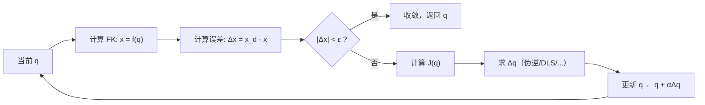

# 第三章：雅可比迭代法 IK——伪逆、阻尼最小二乘与零空间利用

> 前情提要：[第 2 章](./02_解析法IK)展示了解析法的精确与高效，但它只适用于满足特殊条件的机器人。本章介绍最通用的 IK 方法族——基于雅可比矩阵的迭代法。它适用于任意构型、支持冗余、且是大部分实时控制器的核心。

**知识链接**：
- [雅可比矩阵与微分运动学](/前置知识/003b_前置知识_雅可比矩阵与微分运动学)
- [矩阵伪逆与最小二乘](/前置知识/003d_前置知识_矩阵伪逆与最小二乘)（伪逆是什么、为什么需要、阻尼伪逆）
- [正运动学与 DH 参数](/前置知识/003a_前置知识_正运动学与DH参数)

---

## 0. 快速回顾：雅可比和伪逆是什么

> 如果你已经熟悉雅可比矩阵和伪逆，可以跳过本节直接看第 1 节。如果这两个概念对你还比较陌生，建议先读完 [雅可比矩阵前置知识](/前置知识/003b_前置知识_雅可比矩阵与微分运动学) 和 [伪逆前置知识](/前置知识/003d_前置知识_矩阵伪逆与最小二乘)。

**雅可比矩阵 $J(\mathbf{q})$** 是正运动学 $f(\mathbf{q})$ 的偏导数矩阵——它把关节速度线性映射为末端速度：

$$
\dot{\mathbf{x}} = J(\mathbf{q})\dot{\mathbf{q}}
$$

**这个公式在做什么**：雅可比矩阵把"关节空间的微小变化"线性映射为"末端空间的微小变化"——知道各关节转了多少，就能算出末端点移动了多少。

::: details 📐 逐符号拆解 + 数值代入（点击展开）
**逐符号拆解**：

| 符号 | 含义 | 具体是什么 |
|------|------|-----------|
| $\dot{\mathbf{x}}$ | 末端速度向量 | 维度 $m$（6-DOF 任务中 $m=6$：3 平移 + 3 旋转） |
| $J(\mathbf{q})$ | 雅可比矩阵 | $m \times n$ 矩阵，第 $(i,j)$ 元素 $= \partial x_i / \partial q_j$，反映第 $j$ 个关节对第 $i$ 维末端速度的贡献 |
| $\dot{\mathbf{q}}$ | 关节速度向量 | 维度 $n$（7-DOF 臂中 $n=7$） |

**数值代入**：假设一个平面 2-DOF 臂，$l_1=l_2=1$，$\mathbf{q}=(60°,30°)$，关节速度 $\dot{\mathbf{q}}=(0.1, 0.2)$ rad/s。雅可比（只取平移 $2\times2$）：

$$
J = \begin{bmatrix} -l_1 s_1 - l_2 s_{12} & -l_2 s_{12} \\ l_1 c_1 + l_2 c_{12} & l_2 c_{12} \end{bmatrix} = \begin{bmatrix} -1.37 & -0.50 \\ 0.37 & 0.87 \end{bmatrix}
$$

$$
\dot{\mathbf{x}} = \begin{bmatrix} -1.37 & -0.50 \\ 0.37 & 0.87 \end{bmatrix}\begin{bmatrix}0.1\\0.2\end{bmatrix} = \begin{bmatrix}-0.237\\0.211\end{bmatrix} \text{ m/s}
$$

**为什么是这个形式**：正运动学 $f(\mathbf{q})$ 是非线性的，雅可比是其一阶泰勒展开的系数矩阵——在当前构型附近做线性近似，这是牛顿法/迭代法的基础。
:::

对 7-DOF 机械臂，$J$ 是 $6\times7$ 矩阵。它随关节构型变化，某些构型下可能"秩亏"（奇异）。

**伪逆 $J^+$** 是对非方阵"取逆"的推广。对 $6\times7$ 的胖矩阵 $J$，右伪逆为：

$$
J^+ = J^T(JJ^T)^{-1} \quad (\text{维度：} 7\times6)
$$

**这个公式在做什么**：对"列数 > 行数"的胖矩阵 $J$，伪逆 $J^+$ 给出欠定方程 $J\dot{\mathbf{q}}=\dot{\mathbf{x}}$ 的范数最小解——在所有能产生相同末端速度的关节速度中，选关节速度幅值最小（最省力）的那个。

::: details 📐 逐符号拆解 + 数值代入（点击展开）
**逐符号拆解**：

| 符号 | 含义 | 具体是什么 |
|------|------|-----------|
| $J^+$ | 右伪逆（Moore-Penrose 伪逆在满秩胖矩阵下的形式） | $n\times m$ 矩阵（$7\times6$） |
| $J^T$ | 雅可比转置 | $n\times m$，把末端力映射回关节力矩的矩阵 |
| $JJ^T$ | 末端空间的 Gram 矩阵 | $m\times m$（$6\times6$），对称正定（满秩时） |
| $(JJ^T)^{-1}$ | Gram 矩阵的逆 | 当 $J$ 秩亏时不可逆——这就是奇异问题的根源 |

**数值代入**：沿用上面 2-DOF 例子的 $J$：

$$
JJ^T = \begin{bmatrix}-1.37 & -0.50\\0.37 & 0.87\end{bmatrix}\begin{bmatrix}-1.37 & 0.37\\-0.50 & 0.87\end{bmatrix} = \begin{bmatrix}2.13 & -0.94\\-0.94 & 0.89\end{bmatrix}
$$

$$
(JJ^T)^{-1} \approx \begin{bmatrix}0.89 & 0.94\\0.94 & 2.13\end{bmatrix} / \det \approx \begin{bmatrix}0.75 & 0.79\\0.79 & 1.79\end{bmatrix}
$$

如果某个构型让 $\det(JJ^T) \to 0$，上面的逆就爆炸——这正是 DLS（阻尼最小二乘）要修复的。

**为什么是这个形式**：$J^+ = J^T(JJ^T)^{-1}$ 是最小化 $\|\dot{\mathbf{q}}\|^2$（关节速度能量）约束于 $J\dot{\mathbf{q}}=\dot{\mathbf{x}}$ 的拉格朗日对偶解。选能量最小的解是因为：(1) 避免不必要的大幅关节运动 (2) 利用冗余自由度使运动尽量"平滑"。
:::

**问题**：当 $J$ 接近奇异时，$JJ^T$ 的某些特征值趋于 0，$(JJ^T)^{-1}$ 爆炸 → $J^+$ 给出的关节速度趋于无穷大。本章的 DLS 方法就是解决这个问题的。

---

## 1. 核心思想：线性化 + 迭代

IK 是非线性方程 $f(\mathbf{q}) = \mathbf{x}_d$ 的求根问题。
雅可比迭代法的策略是：不试图一次解出答案，而是**反复做小步修正**——每步在当前构型处用雅可比矩阵做线性近似，求一个关节增量，更新构型，直到误差足够小。



核心步骤的数学表达：

$$
\Delta\mathbf{q} = J^{\dagger}(\mathbf{q}) \cdot \Delta\mathbf{x}, \quad \mathbf{q} \leftarrow \mathbf{q} + \alpha \Delta\mathbf{q}
$$

**这个公式在做什么**：每次迭代中，用雅可比的某种"逆"（$J^\dagger$ 代表各种选择）把笛卡尔空间误差转换为关节修正量，再用步长 $\alpha$ 控制更新幅度。

::: details 📐 逐符号拆解 + 数值代入（点击展开）
**逐符号拆解**：

| 符号 | 含义 | 典型值 |
|------|------|--------|
| $\Delta\mathbf{x} = \mathbf{x}_d - f(\mathbf{q})$ | 末端当前位姿与目标的误差 | 位置误差 ~cm，姿态误差 ~0.1 rad |
| $J^{\dagger}$ | 雅可比的"广义逆" | 具体选择决定了算法变体 |
| $\alpha \in (0, 1]$ | 步长因子 | 通常 0.5~1.0，防止过冲 |
| $\Delta\mathbf{q}$ | 关节角修正量 | 典型 ~0.01 rad/iter |

**数值代入**：假设 2-DOF 平面臂当前 $\mathbf{q} = (20°, 50°)$，目标 $(1.2, 0.5)$，当前 FK 输出 $(1.15, 0.55)$：
- 误差 $\Delta\mathbf{x} = (0.05, -0.05)^T$
- 假设此构型 $J^{-1} = \begin{bmatrix} 0.5 & 0.8 \\ -1.2 & 0.3 \end{bmatrix}$（2×2 可直接求逆）
- $\Delta\mathbf{q} = J^{-1}\Delta\mathbf{x} = (0.5 \times 0.05 + 0.8 \times (-0.05),\; -1.2 \times 0.05 + 0.3 \times (-0.05))^T = (-0.015, -0.075)^T$ rad
- 步长 $\alpha = 1$：新 $\mathbf{q} = (20° - 0.86°, 50° - 4.3°) = (19.14°, 45.7°)$

重复迭代直到误差 $< 10^{-4}$ m。

**为什么是这个形式**：这本质上是牛顿法在流形上的变体。牛顿法用函数的导数（这里是雅可比）做线性近似，每步"朝着消除误差的方向"更新。
:::

---

## 2. 方法一：雅可比伪逆法

### 2.1 公式

对冗余机器人（$n > 6$），$J$ 是 $6 \times n$ 的"胖矩阵"，没有传统逆。用 **Moore-Penrose 伪逆**：

$$
\Delta\mathbf{q} = J^+(\mathbf{q}) \Delta\mathbf{x}, \quad J^+ = J^T(JJ^T)^{-1}
$$

**这个公式在做什么**：在所有满足 $J\Delta\mathbf{q} = \Delta\mathbf{x}$ 的解中，选择**关节修正量范数最小**的那个。

::: details 📐 逐符号拆解 + 数值代入（点击展开）
**逐符号拆解**：

| 符号 | 含义 | 维度 |
|------|------|------|
| $J^+ \in \mathbb{R}^{n \times 6}$ | 右伪逆 | 7×6（对 Franka） |
| $JJ^T \in \mathbb{R}^{6 \times 6}$ | 速度空间的度量矩阵 | 需要可逆（非奇异） |
| $(JJ^T)^{-1}$ | 6×6 矩阵的逆 | 奇异时爆炸 |

**最小范数性质**的证明直觉：$J\Delta\mathbf{q} = \Delta\mathbf{x}$ 定义了一个关节空间中的仿射子空间（所有满足约束的 $\Delta\mathbf{q}$）。$J^+\Delta\mathbf{x}$ 是这个子空间中离原点最近的点——即范数最小的解。

**数值代入**：7-DOF 臂，$J$ 是 $6\times7$。假设需要消除末端 $x$ 方向 1cm 误差：$\Delta\mathbf{x} = (0.01, 0, 0, 0, 0, 0)^T$。伪逆 $J^+$ 是 $7\times6$：

$$
\Delta\mathbf{q} = J^+ \Delta\mathbf{x} = \text{7维向量}
$$

这 7 个关节都会微调，但总修正量 $\|\Delta\mathbf{q}\|$ 在所有可能方案中最小。如果只用前 6 个关节（不用第 7 关节），可能需要某个关节转更多来补偿——伪逆把负担分散到所有关节。

**为什么是这个形式**：$J^T(JJ^T)^{-1}$ 的推导来自约束优化：$\min \|\Delta\mathbf{q}\|^2 \text{ s.t. } J\Delta\mathbf{q} = \Delta\mathbf{x}$，用 Lagrange 乘子法解出的就是这个表达式。
:::

### 2.2 问题：奇异点爆炸

当 $J$ 接近奇异，$JJ^T$ 的最小特征值趋近 0，$(JJ^T)^{-1}$ 爆炸 → $\Delta\mathbf{q}$ 的范数趋于无穷 → 关节狂甩。

---

## 3. 方法二：阻尼最小二乘（DLS / Levenberg-Marquardt）


### 3.1 动机

伪逆法在奇异点附近会产生巨大的关节速度。DLS 的思路是：**宁可牺牲一点末端精度，也不让关节速度爆炸**。

### 3.2 公式

$$
\Delta\mathbf{q} = J^T(JJ^T + \lambda^2 I)^{-1} \Delta\mathbf{x}
$$

**这个公式在做什么**：在伪逆的基础上加了一个"阻尼项" $\lambda^2 I$，防止矩阵求逆时分母趋于零。

::: details 📐 逐符号拆解 + 数值代入（点击展开）
**逐符号拆解**：

| 符号 | 含义 |
|------|------|
| $\lambda$ | 阻尼因子（标量），控制精度-稳定性 trade-off |
| $\lambda^2 I$ | 加在 $JJ^T$（$6 \times 6$）的对角线上 |
| $J^T(JJ^T + \lambda^2 I)^{-1}$ | "阻尼伪逆"，当 $\lambda \to 0$ 退化为普通伪逆 |

**等价优化问题**：DLS 实际上求解的是：

$$
\min_{\Delta\mathbf{q}} \; \|J\Delta\mathbf{q} - \Delta\mathbf{x}\|^2 + \lambda^2 \|\Delta\mathbf{q}\|^2
$$

第一项要求末端误差小，第二项要求关节修正量小。$\lambda$ 控制两者的平衡。

**用奇异值分解（SVD）理解**：设 $J = U\Sigma V^T$，则：
- 伪逆：$\Delta q_i \propto \sigma_i / \sigma_i^2 = 1/\sigma_i$（小奇异值 → 大关节速度）
- DLS：$\Delta q_i \propto \sigma_i / (\sigma_i^2 + \lambda^2)$（小奇异值被 $\lambda^2$ 压制）

**数值代入**：假设 $J$ 的最小奇异值 $\sigma_{\min} = 0.01$（接近奇异）：
- 伪逆：对应方向的增益 $= 1/0.01 = 100$（爆炸！）
- DLS（$\lambda = 0.1$）：增益 $= 0.01/(0.01^2 + 0.1^2) = 0.01/0.0101 = 0.99$（稳定）

代价：末端在那个方向上的跟踪精度下降（被"阻尼"了），但关节不会狂甩。

**为什么是这个形式**：这就是经典的 Tikhonov 正则化（L2 正则化）。在线性回归中加 L2 惩罚变成岭回归（Ridge regression），在 IK 中加 L2 惩罚就是 DLS。本质相同：用偏差换方差/稳定性。
:::

### 3.3 自适应阻尼

固定 $\lambda$ 的问题：远离奇异时 $\lambda$ 多余（降低精度），接近奇异时 $\lambda$ 可能还不够。

**Nakamura-Hanafusa 方案**：根据操纵性自适应调节：

$$
\lambda^2 = \begin{cases} 0 & \text{if } w > w_{\text{thresh}} \\ \lambda_{\max}^2 \left(1 - \frac{w}{w_{\text{thresh}}}\right)^2 & \text{otherwise} \end{cases}
$$

**这个公式在做什么**：当操纵性 $w$ 高于阈值时完全不加阻尼（精确模式），低于阈值时按距奇异的程度平滑增大阻尼。

::: details 📐 逐符号拆解 + 数值代入（点击展开）
**逐符号拆解**：

| 符号 | 含义 | 典型值 |
|------|------|--------|
| $w = \sqrt{\det(JJ^T)}$ | [操纵性指数](/前置知识/003b_前置知识_雅可比矩阵与微分运动学) | 远离奇异 ~0.1，接近奇异 ~0.001 |
| $w_{\text{thresh}}$ | 阻尼启动阈值 | 0.01~0.05 |
| $\lambda_{\max}$ | 最大阻尼值 | 0.1~0.5 |

**数值代入**：$w_{\text{thresh}} = 0.02$，$\lambda_{\max} = 0.2$：
- 情况 1：$w = 0.05 > 0.02$ → $\lambda = 0$（纯伪逆，最高精度）
- 情况 2：$w = 0.01$ → $\lambda^2 = 0.04 \times (1 - 0.01/0.02)^2 = 0.04 \times 0.25 = 0.01$ → $\lambda = 0.1$
- 情况 3：$w = 0.001$（几乎奇异） → $\lambda^2 = 0.04 \times (1 - 0.05)^2 \approx 0.036$ → $\lambda \approx 0.19$

**为什么是这个形式**：平方项 $(1 - w/w_{\text{thresh}})^2$ 使得阻尼在阈值处平滑过渡（导数连续），避免关节速度出现跳变。
:::

---

## 4. 方法三：雅可比转置法

最简单的变体——用 $J^T$ 代替 $J^{-1}$ 或 $J^+$：

$$
\Delta\mathbf{q} = \alpha J^T(\mathbf{q}) \Delta\mathbf{x}
$$

**这个公式在做什么**：不求任何矩阵逆，直接用雅可比转置把笛卡尔误差"投影"回关节空间。

::: details 📐 逐符号拆解 + 数值代入（点击展开）
**逐符号拆解**：

| 符号 | 含义 |
|------|------|
| $J^T \in \mathbb{R}^{n \times 6}$ | 雅可比转置 |
| $\alpha$ | 步长（需要仔细调节） |

**直觉**：$J^T \mathbf{F}$（力 → 力矩）是雅可比的对偶映射。所以 $J^T \Delta\mathbf{x}$ 可以理解为"在末端施加一个虚拟力拉向目标，算出各关节需要的力矩方向"——就是梯度下降的方向。

**优点**：
- 不需要矩阵求逆，计算量最小（$O(6n)$）
- 永远不会因为奇异性爆炸

**缺点**：
- 收敛慢（线性收敛率）
- 步长难选——太大振荡，太小需要几百次迭代

**数值代入**：2-DOF，$J = \begin{bmatrix} -0.983 & -0.483 \\ 0.996 & 0.130 \end{bmatrix}$，$\Delta\mathbf{x} = (0.05, -0.05)^T$：

$$
J^T \Delta\mathbf{x} = \begin{bmatrix} -0.983 & 0.996 \\ -0.483 & 0.130 \end{bmatrix} \begin{bmatrix} 0.05 \\ -0.05 \end{bmatrix} = \begin{bmatrix} -0.099 \\ -0.031 \end{bmatrix}
$$

方向正确（能减小误差），但不保证一步到位。

**为什么是这个形式**：$J^T$ 法等价于对目标函数 $\frac{1}{2}\|\Delta\mathbf{x}\|^2$ 做梯度下降。$\nabla_q \frac{1}{2}\|f(\mathbf{q}) - \mathbf{x}_d\|^2 = -J^T(f(\mathbf{q}) - \mathbf{x}_d)$。所以"加 $J^T\Delta\mathbf{x}$"就是"沿负梯度走"。
:::

---

## 5. 方法四：冗余机器人的零空间利用

对 7-DOF 臂，IK 有无穷多解。伪逆给出最小范数解，但最小范数不一定是"最好"的——我们可能还想：避障、远离关节限位、最大化操纵性。

**零空间投影公式**：

$$
\Delta\mathbf{q} = J^+ \Delta\mathbf{x} + (I - J^+ J) \mathbf{z}
$$

**这个公式在做什么**：在满足末端跟踪目标的基础上，利用冗余自由度执行额外的优化目标 $\mathbf{z}$。

::: details 📐 逐符号拆解 + 数值代入（点击展开）
**逐符号拆解**：

| 符号 | 含义 |
|------|------|
| $J^+ \Delta\mathbf{x}$ | 主任务：消除末端误差（最小范数解） |
| $(I - J^+ J) \in \mathbb{R}^{n \times n}$ | 零空间投影矩阵 |
| $\mathbf{z} \in \mathbb{R}^n$ | 次要目标的梯度方向 |
| $(I - J^+J)\mathbf{z}$ | $\mathbf{z}$ 在零空间中的分量——不影响末端的关节运动 |

**关键性质**：$J(I - J^+J) = J - JJ^+J = J - J = 0$。所以零空间部分在末端不产生任何速度——纯粹是"内部重构"。

**典型的 $\mathbf{z}$ 选择**：
- 远离关节限位：$z_i = -k(q_i - q_{i,\text{mid}})$（推向关节中位）
- 最大化操纵性：$\mathbf{z} = k \nabla_q w(\mathbf{q})$（操纵性梯度方向）
- 避障：$\mathbf{z} = k \nabla_q d_{\min}(\mathbf{q})$（远离最近障碍）

**数值代入**：7-DOF 臂，假设第 4 关节 $q_4 = -2.8$（接近下限 $-3.07$），中位 $q_{4,\text{mid}} = -1.57$。零空间分量把 $q_4$ 往中位推：$z_4 = -0.5 \times (-2.8 - (-1.57)) = 0.615$ rad/s，同时不影响末端位置。

**为什么是这个形式**：$(I - J^+J)$ 是到 $J$ 零空间的正交投影算子。任何向量经过这个投影后，其 $J$ 像为零——所以加上它不会影响末端。这是利用冗余的标准数学工具。
:::

---

## 6. 任务优先级框架

当有多个目标（如：主任务=末端跟踪，次任务=肘部避障）时，用**任务优先级**架构：

$$
\dot{\mathbf{q}} = J_1^+ \dot{\mathbf{x}}_1 + (I - J_1^+ J_1) J_2^+ (\dot{\mathbf{x}}_2 - J_2 J_1^+ \dot{\mathbf{x}}_1)
$$

**这个公式在做什么**：先满足最高优先级任务（末端跟踪），再利用剩余自由度尽量满足次优先级任务（避障），且次任务绝不影响主任务。

::: details 📐 逐符号拆解 + 数值代入（点击展开）
**逐符号拆解**：

| 符号 | 含义 |
|------|------|
| $J_1, \dot{\mathbf{x}}_1$ | 第一优先级任务的雅可比和目标速度 |
| $J_2, \dot{\mathbf{x}}_2$ | 第二优先级任务的雅可比和目标速度 |
| $(I - J_1^+J_1)$ | 第一任务的零空间投影 |
| $J_2 J_1^+ \dot{\mathbf{x}}_1$ | 第一任务的执行对第二任务的"副作用" |

**直觉**：
1. 先无条件执行主任务：$J_1^+ \dot{\mathbf{x}}_1$
2. 看执行主任务后，次任务还差多少：$\dot{\mathbf{x}}_2 - J_2 J_1^+ \dot{\mathbf{x}}_1$
3. 在不影响主任务的前提下（零空间内）尽量补偿这个差值

**数值代入**：主任务是末端 6-DOF 跟踪（$J_1$ 是 $6\times7$），次任务是"肘部远离桌面"（$J_2$ 是 $1\times7$——肘部高度对关节角的导数）。Franka 的 7-DOF 只有 1 维零空间，所以次任务只能在 1 维自由度内优化——不一定能完全满足。

**为什么是这个形式**：这是 Siciliano (1991) 提出的层次化任务框架。每层只在上层零空间中优化，保证严格的优先级不被违反。可以扩展到任意多层。
:::

---

## 7. 完整算法实现

综合以上方法，给出一个实用的 DLS + 零空间 IK 求解器的 Python 实现：

核心思路：在每次迭代中计算当前误差和雅可比，用自适应 DLS 求主任务的关节增量，再加上零空间中推向关节中位的分量。循环直到收敛或达到最大迭代次数。

```python
import numpy as np

def ik_dls_nullspace(fk_func, jacobian_func, x_target, q_init,
                     max_iter=100, tol_pos=1e-4, tol_ori=1e-3,
                     lambda_max=0.1, w_thresh=0.01, alpha=1.0,
                     k_null=0.5, q_mid=None):
    """
    DLS + 零空间 IK 求解器。
    
    参数：
        fk_func: 正运动学函数 q -> (pos, rot_matrix)
        jacobian_func: 雅可比函数 q -> J (6×n)
        x_target: 目标 (pos_3d, rot_3x3)
        q_init: 初始关节角 (n,)
        k_null: 零空间推向中位的增益
        q_mid: 关节中位 (n,)
    """
    q = q_init.copy()
    n = len(q)
    if q_mid is None:
        q_mid = np.zeros(n)
    
    for iteration in range(max_iter):
        # Step 1: 计算当前末端位姿和误差
        pos, rot = fk_func(q)
        pos_err = x_target[0] - pos          # (3,)
        ori_err = orientation_error(x_target[1], rot)  # (3,) 角轴误差
        dx = np.concatenate([pos_err, ori_err])  # (6,)
        
        # 收敛检查
        if np.linalg.norm(pos_err) < tol_pos and np.linalg.norm(ori_err) < tol_ori:
            return q, True, iteration
        
        # Step 2: 计算雅可比和自适应阻尼
        J = jacobian_func(q)  # (6, n)
        w = np.sqrt(max(np.linalg.det(J @ J.T), 0))  # 操纵性
        
        if w > w_thresh:
            lam = 0.0
        else:
            lam = lambda_max * (1 - w / w_thresh)
        
        # Step 3: DLS 求主任务增量
        JJT = J @ J.T + lam**2 * np.eye(6)  # (6,6)
        dq_main = J.T @ np.linalg.solve(JJT, dx)  # (n,)
        
        # Step 4: 零空间推向中位
        J_pinv = J.T @ np.linalg.inv(JJT)       # (n,6) 近似伪逆
        N = np.eye(n) - J_pinv @ J               # (n,n) 零空间投影
        z = k_null * (q_mid - q)                 # 推向中位的梯度
        dq_null = N @ z                          # 零空间分量
        
        # Step 5: 合成更新
        q = q + alpha * (dq_main + dq_null)
    
    return q, False, max_iter  # 未收敛
```

`orientation_error` 函数计算两个旋转矩阵之间的角轴误差向量，核心是对 $R_{\text{target}}^T R_{\text{actual}}$ 取对数映射。

---

## 8. 收敛性分析

| 方法 | 收敛速度 | 奇异稳定性 | 每步计算量 |
|------|----------|------------|-----------|
| $J^{-1}$（方阵） | 二次（牛顿法） | ❌ 爆炸 | $O(n^3)$（矩阵逆） |
| $J^+$ 伪逆 | 超线性 | ❌ 爆炸 | $O(6n^2)$ |
| $J^T$ 转置 | 线性 | ✅ 永远稳定 | $O(6n)$ |
| DLS | 超线性（远离奇异）/线性（接近） | ✅ 稳定 | $O(6n^2)$ |

**工程经验**：
- 大多数场景用 DLS，5-20 次迭代即可收敛到 sub-mm 精度
- 如果 IK 需要在 1kHz 控制循环中运行，用速度级（单步 $J^+$ 或 DLS），不做多步迭代
- 初始值很重要——用上一帧的关节角作为初始值（连续运动中相邻帧变化小）

---

## 9. 总结

| 方法 | 公式 | 适用场景 | 核心特点 |
|------|------|----------|----------|
| 伪逆 | $J^+\Delta x$ | 非奇异、冗余 | 最小范数解 |
| DLS | $J^T(JJ^T+\lambda^2I)^{-1}\Delta x$ | 通用（推荐） | 奇异稳定 |
| $J^T$ | $\alpha J^T\Delta x$ | 计算受限场景 | 最简但慢 |
| 零空间利用 | $J^+\Delta x + (I-J^+J)z$ | 冗余+多目标 | 不影响主任务 |
| 任务优先级 | 层次化投影 | 多优先级目标 | 严格优先级 |

**下一章预告**：[第 4 章：基于优化的 IK](./04_基于优化的IK) 将介绍把 IK 转化为带约束的非线性优化问题的方法。当需要同时处理关节限位、碰撞避让、姿态约束等复杂条件时，优化法比雅可比迭代法更灵活。代表工具：cuRobo（NVIDIA GPU 加速 IK）。
