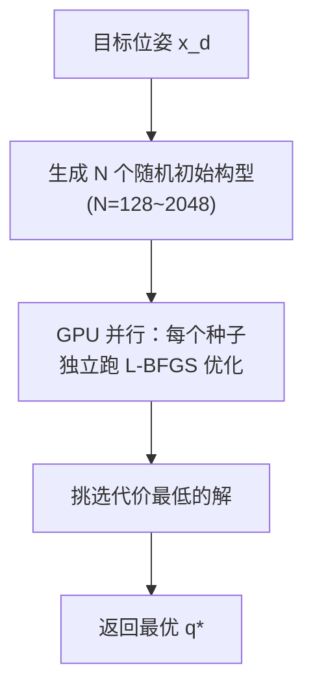

# 第四章：基于优化的 IK——约束处理、SQP 与 GPU 加速

> 前情提要：[第 3 章](./03_雅可比迭代法IK)的雅可比迭代法通用且高效，但对复杂约束（碰撞、关节限位、姿态锁定）只能通过零空间"软处理"。本章介绍把 IK 当作一个完整的约束非线性优化问题来求解的方法——可以硬性满足所有约束，代价是计算量更大。

**知识链接**：
- [雅可比矩阵与微分运动学](/前置知识/003b_前置知识_雅可比矩阵与微分运动学)
- [正运动学与 DH 参数](/前置知识/003a_前置知识_正运动学与DH参数)

---

## 1. 把 IK 写成优化问题

雅可比法把 IK 看作"方程求根"（$f(\mathbf{q}) = \mathbf{x}_d$）。优化法转换视角：把 IK 看作**最小化目标函数**的问题，同时可以附加任意约束：

$$
\min_{\mathbf{q}} \; \underbrace{\|f(\mathbf{q}) - \mathbf{x}_d\|^2_W}_{\text{末端位姿误差}} + \underbrace{w_1 \|\mathbf{q} - \mathbf{q}_{\text{ref}}\|^2}_{\text{关节正则}} + \underbrace{w_2 \cdot c_{\text{manip}}(\mathbf{q})}_{\text{操纵性惩罚}} \quad \text{s.t.} \quad \mathbf{q}_{\min} \le \mathbf{q} \le \mathbf{q}_{\max}, \; d_{\min}(\mathbf{q}) \ge d_{\text{safe}}, \; g(\mathbf{q}) \le 0
$$

**这个公式在做什么**：同时优化多个目标（末端精度 + 关节舒适度 + 操纵性），并硬性满足关节限位和碰撞安全距离等约束。

::: details 📐 逐符号拆解 + 数值代入（点击展开）
**逐符号拆解**：

| 符号 | 含义 | 典型值 |
|------|------|--------|
| $\|f(\mathbf{q}) - \mathbf{x}_d\|^2_W$ | 加权位姿误差，$W$ 可以给位置和姿态不同权重 | 位置权重 1.0，姿态权重 0.5 |
| $\mathbf{q}_{\text{ref}}$ | 参考构型（如当前构型或中位） | 让 IK 解尽量靠近上一帧 |
| $w_1, w_2$ | 权重超参数 | $w_1 \sim 0.01$，$w_2 \sim 0.001$ |
| $d_{\min}(\mathbf{q})$ | 机器人各连杆到障碍物的最近距离 | 安全阈值 $d_{\text{safe}} \sim 0.03$ m |
| $\mathbf{q}_{\min}, \mathbf{q}_{\max}$ | 关节限位 | Franka: 各关节有具体上下界 |

**数值代入**：假设优化前 $\mathbf{q}$ 的末端误差 $\|f(\mathbf{q}) - \mathbf{x}_d\| = 0.05$ m，关节偏离中位 $\|\mathbf{q} - \mathbf{q}_{\text{ref}}\| = 0.3$ rad，最近碰撞距离 $d_{\min} = 0.02$ m < 安全阈值 0.03 m。

优化器需要找到新的 $\mathbf{q}$：末端误差 $\to 0$，同时 $d_{\min} \ge 0.03$，且不超出关节限位。$w_1$ 和 $w_2$ 决定了在不能完美满足所有目标时的 trade-off（比如允许关节偏离中位更多来换取碰撞安全）。

**为什么是这个形式**：优化框架的优势是**可以任意叠加目标和约束**。雅可比法只有一个目标（消除误差）加零空间中的软优化；优化法可以加硬约束（"碰撞距离必须 > 3cm，不是尽量而是必须"）。
:::

---

## 2. 常用优化算法

### 2.1 序列二次规划（SQP）

SQP 是处理带约束非线性优化的经典方法。每步在当前点构造一个二次子问题（QP），求解 QP 得到搜索方向，再线搜索确定步长。

**和雅可比法的联系**：如果去掉所有约束、只保留位姿误差目标，SQP 的第一步就退化为 Gauss-Newton 步（≈ 雅可比伪逆）。SQP 可以看作"在雅可比法的基础上加了约束处理"。

### 2.2 内点法（Interior Point）

把不等式约束转化为对数障碍函数加到目标中：

$$
\min_{\mathbf{q}} \; \text{cost}(\mathbf{q}) - \mu \sum_i \ln(c_i(\mathbf{q}))
$$

**这个公式在做什么**：在原始代价函数上加一个"围栏"——当解靠近约束边界时，对数项趋于无穷大，把解推回可行域内部。

::: details 📐 逐符号拆解 + 数值代入（点击展开）
**逐符号拆解**：

| 符号 | 含义 | 具体是什么 |
|------|------|-----------|
| $\text{cost}(\mathbf{q})$ | 原始目标函数 | 如上面的位姿误差 + 正则项 |
| $\mu$ | 障碍参数（正数） | 初始较大（如 1.0），逐步减小到 $\sim 10^{-6}$ |
| $c_i(\mathbf{q})$ | 第 $i$ 个不等式约束的松弛量 | 如 $c_1 = q_1 - q_{1,\min}$（关节离下界的距离） |
| $\ln(c_i)$ | 对数障碍 | $c_i > 0$ 时有限，$c_i \to 0^+$ 时 $\to -\infty$ |
| $-\mu \ln(c_i)$ | 惩罚项 | $c_i$ 越小（越靠近边界），惩罚越大 |

**数值代入**：假设只有一个约束 $q \ge -2.9$（关节下界），当前 $q = -2.5$，$c = q - (-2.9) = 0.4$：

$$
-\mu \ln(c) = -1.0 \times \ln(0.4) = -1.0 \times (-0.916) = 0.916
$$

如果 $q$ 逼近边界 $q = -2.85$，$c = 0.05$：

$$
-\mu \ln(0.05) = -1.0 \times (-3.0) = 3.0
$$

惩罚从 0.916 飙升到 3.0，优化器会自动避开边界。随着 $\mu$ 减小（如 $\mu = 0.01$），惩罚变弱但更精确地逼近真正的约束边界。

**为什么是这个形式**：$\ln$ 函数在正半轴连续可微，梯度 $1/c_i$ 在边界附近趋于无穷——既保证可微（优化器能用梯度法），又保证解不会越界。
:::

当 $c_i(\mathbf{q}) \to 0$（约束边界），$-\ln(c_i) \to +\infty$，把解"推离"边界。$\mu$ 逐渐减小到 0，最终逼近真正的约束解。

### 2.3 FABRIK（Forward And Backward Reaching Inverse Kinematics）

FABRIK 不是传统优化，而是一种启发式几何方法——交替做"向前到达"和"向后到达"两步：

1. **Forward**：从末端开始，将末端移到目标位置，然后逐个把前面的关节"拉"过来（保持连杆长度不变）
2. **Backward**：从基座开始，将基座固定在原位，逐个把后面的关节"推"过去

每次前后交替就消除一些误差。收敛快（通常 3-10 次迭代）、计算极轻（只有几何运算，没有矩阵逆），但**不容易处理旋转关节约束和姿态目标**。

适用场景：游戏/动画中的骨骼 IK（对精度和约束要求低）、作为初始化给精确求解器提供好的起始点。

---

## 3. GPU 加速 IK：cuRobo

NVIDIA 的 **cuRobo** 是当前最先进的 GPU 加速运动规划/IK 库。其 IK 模块的核心思路：

### 3.1 并行多种子

**关键洞察**：IK 的非凸性意味着不同初始点可能收敛到不同局部最优（或不收敛）。与其跑一个种子反复调参，不如用 GPU 同时跑上千个种子，总有几个找到好解。

### 3.2 可微碰撞检测

cuRobo 用**球体包络**（Sphere Swept Volumes）近似连杆几何，碰撞距离计算完全可微。这使得碰撞避让可以作为梯度直接参与优化，而不需要专门的碰撞采样或 penalty scheduling。

### 3.3 性能数据

| 场景 | cuRobo GPU | MoveIt (CPU) | 加速比 |
|------|-----------|--------------|--------|
| 单次 IK（Franka） | ~2 ms | ~10-50 ms | 5-25× |
| 批量 IK（1000 目标） | ~5 ms total | ~30 s total | 6000× |
| IK + 碰撞避让 | ~5 ms | ~100 ms | 20× |

批量 IK 是 cuRobo 最大的优势场景——在 motion planning 的采样阶段，需要为成百上千个路径点求 IK。

---

## 4. 其他优化方法

### 4.1 TRAC-IK

MoveIt 的默认 IK 求解器之一。策略很简单但实用：**同时跑两个求解器**——一个 KDL 风格的雅可比迭代，一个 SQP 优化——谁先收敛用谁。

### 4.2 Relaxed IK

专门为**实时连续 IK**设计（如遥操作），除了位姿精度还优化：
- 关节速度平滑性
- 避奇异
- 关节限位
- 与上一帧的连续性

用 L-BFGS 在每帧只跑少量迭代（warm start 从上一帧解开始），实现 1kHz+ 的实时 IK。

---

## 5. 优化法 vs 雅可比法的选择

| 考量 | 雅可比迭代法 | 优化法 |
|------|-------------|--------|
| 计算速度 | 更快（~1ms） | 稍慢（~5ms） |
| 约束处理 | 只能零空间软处理 | 硬约束，guaranteed |
| 实时性 | ✅ 1kHz 控制 | ⚠️ 看实现（cuRobo 可以） |
| 全局性 | ❌ 局部最优 | ⚠️ 多种子提升（cuRobo） |
| 实现复杂度 | 低 | 中~高 |
| 碰撞避让 | 间接（零空间/排斥） | 直接（约束/penalty） |

**工程建议**：
- 实时速度控制（遥操作、视觉伺服）→ 雅可比法（DLS + 零空间）
- 离线/准离线规划、需要碰撞避让 → 优化法（cuRobo / TRAC-IK）
- 批量 IK（运动规划采样）→ cuRobo GPU 并行

---

## 6. 总结

| 方法 | 代表工具 | 核心优势 | 核心劣势 |
|------|----------|----------|----------|
| SQP | SNOPT, IPOPT | 理论完善，约束保证 | 计算重 |
| L-BFGS | cuRobo, Relaxed-IK | 适合无约束/简单约束 | 不直接处理不等式约束 |
| FABRIK | — | 极快、几何直觉强 | 精度有限，难加旋转约束 |
| cuRobo | NVIDIA cuRobo | GPU 并行、批量能力、可微碰撞 | 需要 GPU、配置较重 |
| TRAC-IK | MoveIt | 稳定、开箱即用 | 单 CPU 速度有限 |

**下一章预告**：[第 5 章：学习型 IK](./05_学习型IK) 将介绍用神经网络学习 IK 映射的方法——训练一个网络直接输出关节角，无需迭代。代表工作：IKFlow（生成式 IK，一次推理给出多个解）。
